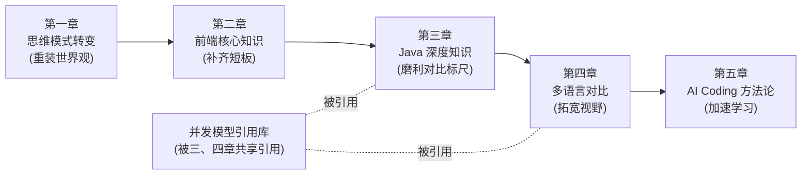

# 全栈开发大全 · 数据后端转全栈视角

> 一本写给「数据研发 / Java 后端工程师」的全栈进阶手册。
>
> 不把你当白纸，而是站在你**已经精通**的强类型、JVM、线程池、SQL、分布式系统之上，
> 用你熟悉的概念去类比和拆解前端世界与多语言生态，帮你**丝滑过渡**到全栈。

---

## 这本书为谁而写

如果你符合下面的画像，这本书就是为你量身定制的：

- 写了多年 Java（Spring Boot / MyBatis / 线程池 / JUC），习惯了强类型和编译期检查；
- 做过数据研发（Hive / Spark / Flink / SQL），擅长用「表结构 + 数据流」思考问题；
- 熟悉分布式系统、高并发、服务治理，但**前端基本是盲区**；
- 想在 AI Coding 时代成为能独立交付完整产品的全栈工程师，而不只是「后端 + 调接口」。

我们的核心信念是：**你缺的不是智商，而是一套从已知映射到未知的「翻译词典」。** 这本书就是那本词典。

---

## 全书脉络：五章递进

这本书的五章是一条精心设计的学习路径，环环相扣：

> **先重装思维 → 补齐前端短板 → 夯实 Java 基准 → 横向对比拓宽语言视野 → 用 AI 加速整个过程。**

为什么是这个顺序？第三章先把 Java 的并发、内存模型、类型、异常体系彻底夯实，是因为第四章要拿 Java 当**对比基准**去量其他语言——你得先有一把磨利的标尺，才能量出别的语言到底强在哪、弱在哪。

---

## 全书地图

### 第一章 · 后端转前端的思维模式转变 〔核心重点 ①〕

转前端最难的从来不是语法，而是**心智模型的重装**。这是全书的地基。

- [本章导读](./part1-mindset-shift/README.md)
- [1.1 从「请求-响应」到「用户交互」：同步思维 → 事件驱动思维](./part1-mindset-shift/01-从请求响应到用户交互.md)
- [1.2 从「无状态」到「有状态」：后端的无状态信仰 vs 前端的状态管理](./part1-mindset-shift/02-从无状态到有状态.md)
- [1.3 从「强类型」到「类型光谱」：静态 / 动态类型的心智模型](./part1-mindset-shift/03-从强类型到类型光谱.md)
- [1.4 从「单一运行时」到「多运行时」：JVM vs 浏览器 / Node / Deno](./part1-mindset-shift/04-从单一运行时到多运行时.md)
- [1.5 从「数据建模」到「UI 建模」：表结构思维 → 组件与状态建模](./part1-mindset-shift/05-从数据建模到UI建模.md)

### 第二章 · 前端核心知识体系

后端视角下的前端速成。系统补齐三件套、框架、状态管理、工程化这些盲区。

- [本章导读](./part2-frontend-core/README.md)
- [2.1 HTML / CSS / JS 三件套：后端工程师的最小够用集](./part2-frontend-core/01-三件套速成.md)
- [2.2 现代前端框架：React / Vue 的组件化与声明式渲染](./part2-frontend-core/02-现代框架.md)
- [2.3 前端状态管理：从混乱的全局变量到可预测的状态流](./part2-frontend-core/03-状态管理.md)
- [2.4 前端工程化：构建、打包、模块化——你熟悉的 Maven 在前端长什么样](./part2-frontend-core/04-工程化.md)

### 第三章 · Java 深度知识（对比基准） 〔核心重点 · 标尺〕

把后续要用到的 Java「标尺」磨利。这一章不是教你写 Java，而是把你「会用但未必透彻」的并发、内存、类型、异常彻底讲清，作为第四章横向对比的基准。

- [本章导读](./part3-java-deep/README.md)
- [3.1 Java 并发体系：线程 / 线程池 / JUC / AQS / 虚拟线程](./part3-java-deep/01-并发体系.md)
  > 深挖锚点：[Java 并发模型详解](./concurrency-models/java-thread-and-virtual-thread.md)
- [3.2 Java 内存模型（JMM）：volatile / happens-before / 可见性](./part3-java-deep/02-内存模型JMM.md)
- [3.3 JVM 运行时：内存结构 / GC / 类加载](./part3-java-deep/03-JVM运行时.md)
- [3.4 Java 类型系统：泛型 / 类型擦除 / 型变](./part3-java-deep/04-类型系统.md)
- [3.5 Java 异常体系：受检 / 非受检异常的设计哲学](./part3-java-deep/05-异常体系.md)

### 第四章 · 核心场景的多语言对比与讲解 〔核心重点 ②〕

以**高并发**为主线，把同一功能用 Java / Go / Rust / Node / Python 分别实现，横向对比，并借此讲解每门语言。遇到各语言的并发模型，用超链接「干镰刀」跳进下方引用库深挖。

- [本章导读](./part4-multilang-compare/README.md)
- [4.1 高并发 HTTP 服务：五语言同台对比](./part4-multilang-compare/01-高并发HTTP服务对比.md)
- [4.2 Java → JavaScript / TypeScript：最关键的一跳](./part4-multilang-compare/02-Java到JS-TS.md)
- [4.3 Java → Go：后端同温层的迁移](./part4-multilang-compare/03-Java到Go.md)
- [4.4 Java → Rust：所有权与系统级编程](./part4-multilang-compare/04-Java到Rust.md)
- [4.5 Java → Python：数据研发老朋友的再认识](./part4-multilang-compare/05-Java到Python.md)
- [4.6 错误处理对比：异常 vs 返回值 vs Result 的哲学差异](./part4-multilang-compare/06-错误处理对比.md)
- [4.7 语言选型决策树：什么场景该用哪门语言](./part4-multilang-compare/07-语言选型决策树.md)

### 并发模型引用库 〔被第三、四章共享引用〕

每门语言的并发模型独立成篇，作为「深挖锚点」。第三、四章会大量链接到这里。

- [引用库导读](./concurrency-models/README.md)
- [Java 并发模型：线程池 + JUC + 虚拟线程（Loom）](./concurrency-models/java-thread-and-virtual-thread.md)
- [Go 并发模型：Goroutine + Channel（CSP）](./concurrency-models/go-goroutine-csp.md)
- [Rust 并发模型：async/await + Tokio](./concurrency-models/rust-async-tokio.md)
- [Node.js 并发模型：事件循环 + libuv](./concurrency-models/nodejs-eventloop.md)
- [Python 并发模型：GIL + asyncio + 多进程](./concurrency-models/python-gil-asyncio.md)

### 第五章 · AI Coding 驱动的全栈学习方法论

在 AI Coding 时代，学一门新语言的方式已经变了。这一章讲如何用 AI 把学习曲线压平。

- [本章导读](./part5-ai-coding-method/README.md)
- [5.1 用 AI 快速进入陌生语言：从「查文档」到「对话式学习」](./part5-ai-coding-method/01-用AI快速进入陌生语言.md)
- [5.2 AI 辅助的全栈工作流：前后端一把梭](./part5-ai-coding-method/02-AI辅助的全栈工作流.md)
- [5.3 验证与避坑：AI 生成代码的信任边界](./part5-ai-coding-method/03-验证与避坑.md)

---

## 如何阅读

推荐两种路径：

**路径 A · 按部就班（推荐首次阅读）**：第一章 → 第二章 → 第三章 → 第四章（遇到并发模型链接就跳进引用库）→ 第五章。前三章是地基，第四章是融会贯通，第五章是加速器。

**路径 B · 问题驱动（带着具体问题查阅）**：直接从第四章的对比案例切入，遇到 Java 基准不熟就回溯第三章，遇到前端概念不懂就回溯第二章，遇到思维卡壳就回第一章。

全书所有 `.md` 文件之间用相对路径超链接互相串联，你可以在任意支持 Markdown 渲染的编辑器（VS Code、Typora、Obsidian）或 Git 平台中点击跳转，像在网页里冲浪一样阅读。

---

## 贯穿全书的一个隐喻

> **后端是「一栋楼的地基和管道」，前端是「住在楼里的人的生活」。**
>
> 你过去关心的是：水管会不会爆、承重够不够、并发上万人入住时会不会塌。
> 现在你要额外关心：开灯的开关好不好按、家具摆得顺不顺手、人在屋里走动时灯光会不会跟着变。
>
> 这两套关注点都重要，全栈就是同时住进地基和客厅。

接下来从 [第一章 · 思维模式转变](./part1-mindset-shift/README.md) 开始。
