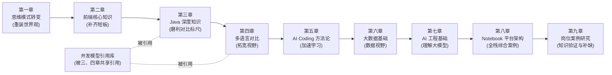

# 全栈开发大全 · 数据后端转全栈视角

> 一本写给「数据研发 / Java 后端工程师」的全栈进阶手册。
>
> 不把你当白纸，而是站在你**已经精通**的强类型、JVM、线程池、SQL、分布式系统之上，
> 用你熟悉的概念去类比和拆解前端世界与多语言生态，帮你**丝滑过渡**到全栈。

**作者**：李平江（Li Pingjiang）

**许可协议**：本作品采用商业化许可，详见 [LICENSE](./LICENSE)。未经作者书面授权，不得用于商业用途。

---

## 这本书为谁而写

如果你符合下面的画像，这本书就是为你量身定制的：

- 写了多年 Java（Spring Boot / MyBatis / 线程池 / JUC），习惯了强类型和编译期检查；
- 做过数据研发（Hive / Spark / Flink / SQL），擅长用「表结构 + 数据流」思考问题；
- 熟悉分布式系统、高并发、服务治理，但**前端基本是盲区**；
- 想在 AI Coding 时代成为能独立交付完整产品的全栈工程师，而不只是「后端 + 调接口」。

我们的核心信念是：**你缺的不是智商，而是一套从已知映射到未知的「翻译词典」。** 这本书就是那本词典。

---

## 全书脉络：七章递进

这本书的前七章是一条精心设计的学习路径，环环相扣。第八章是全栈知识的综合应用案例——以 Notebook 平台为切入点，串联前端、后端、数据、AI 四大领域。第九章是岗位案例研究——拿真实的 JD 拆解，验证知识体系的覆盖度：

> **先重装思维 → 补齐前端短板 → 夯实 Java 基准 → 横向对比拓宽语言视野 → 用 AI 加速整个过程 → 掌握大数据与 AI 工程 → Notebook 平台全栈案例 → 岗位案例研究。**

为什么是这个顺序？第三章先把 Java 的并发、内存模型、类型、异常体系彻底夯实，是因为第四章要拿 Java 当**对比基准**去量其他语言——你得先有一把磨利的标尺，才能量出别的语言到底强在哪、弱在哪。

---

## 全书地图

### 第一章 · 后端转前端的思维模式转变 〔核心重点 ①〕

转前端最难的从来不是语法，而是**心智模型的重装**。这是全书的地基。

- [本章导读](./part1-mindset-shift/README.md)
- [1.1 从「请求-响应」到「用户交互」：同步思维 → 事件驱动思维](./part1-mindset-shift/01-从请求响应到用户交互.md)
- [1.2 从「无状态」到「有状态」：后端的无状态信仰 vs 前端的状态管理](./part1-mindset-shift/02-从无状态到有状态.md)
- [1.3 从「强类型」到「类型光谱」：静态 / 动态类型的心智模型](./part1-mindset-shift/03-从强类型到类型光谱.md)
- [1.4 从「单一运行时」到「多运行时」：JVM vs 浏览器 / Node / Deno](./part1-mindset-shift/04-从单一运行时到多运行时.md)
- [1.5 从「数据建模」到「UI 建模」：表结构思维 → 组件与状态建模](./part1-mindset-shift/05-从数据建模到UI建模.md)

### 第二章 · 前端核心知识体系

后端视角下的前端速成。系统补齐三件套、框架、状态管理、工程化这些盲区。

- [本章导读](./part2-frontend-core/README.md)
- [2.1 HTML / CSS / JS 三件套：后端工程师的最小够用集](./part2-frontend-core/01-三件套速成.md)
- [2.2 现代前端框架：React / Vue 的组件化与声明式渲染](./part2-frontend-core/02-现代框架.md)
- [2.3 前端状态管理：从混乱的全局变量到可预测的状态流](./part2-frontend-core/03-状态管理.md)
- [2.4 前端工程化：构建、打包、模块化——你熟悉的 Maven 在前端长什么样](./part2-frontend-core/04-工程化.md)

### 第三章 · Java 深度知识（对比基准） 〔核心重点 · 标尺〕

把后续要用到的 Java「标尺」磨利。这一章不是教你写 Java，而是把你「会用但未必透彻」的并发、内存、类型、异常彻底讲清，作为第四章横向对比的基准。

- [本章导读](./part3-java-deep/README.md)
- [3.1 Java 并发体系：线程 / 线程池 / JUC / AQS / 虚拟线程](./part3-java-deep/01-并发体系.md)
  > 深挖锚点：[Java 并发模型详解](./concurrency-models/java-thread-and-virtual-thread.md)
- [3.2 Java 内存模型（JMM）：volatile / happens-before / 可见性](./part3-java-deep/02-内存模型JMM.md)
- [3.3 JVM 运行时：内存结构 / GC / 类加载](./part3-java-deep/03-JVM运行时.md)
- [3.4 Java 类型系统：泛型 / 类型擦除 / 型变](./part3-java-deep/04-类型系统.md)
- [3.5 Java 异常体系：受检 / 非受检异常的设计哲学](./part3-java-deep/05-异常体系.md)
- [3.6 Java 网络 IO 模型：BIO / NIO / Reactor / Netty](./part3-java-deep/06-网络IO模型.md)
- [3.7 高可用架构：限流 / 熔断 / 降级 / 幂等 / 容灾](./part3-java-deep/07-高可用架构.md)
- [3.8 缓存与 Redis：穿透 / 击穿 / 雪崩 / 一致性 / 淘汰](./part3-java-deep/08-缓存与Redis.md)
- [3.9 数据库 MySQL：索引 / 事务 MVCC / 锁 / 分库分表](./part3-java-deep/09-数据库MySQL.md)
- [3.10 分布式理论与一致性：CAP / BASE / Raft / Paxos](./part3-java-deep/10-分布式理论与一致性.md)
- [3.11 分布式事务：2PC / TCC / Saga / 本地消息表](./part3-java-deep/11-分布式事务.md)
- [3.12 消息队列：Kafka / RocketMQ / 可靠投递 / 幂等消费](./part3-java-deep/12-消息队列.md)
- [3.13 Spring 全家桶：IOC / AOP / Boot 自动配置 / Cloud](./part3-java-deep/13-Spring全家桶.md)
- [3.14 微服务治理与分布式锁：注册发现 / 分布式锁 / 链路追踪](./part3-java-deep/14-微服务与分布式锁.md)
- [3.15 Java 集合框架：ArrayList / HashMap / ConcurrentHashMap 源码](./part3-java-deep/15-Java集合框架.md)
- [3.16 Java 8+ 新特性：Lambda / Stream / Optional / Record / 虚拟线程](./part3-java-deep/16-Java8+新特性.md)
- [3.17 设计模式：23 种经典模式 / SOLID / Spring 实战](./part3-java-deep/17-设计模式.md)
- [附录 A1：核心数据结构原理——跳表 / 红黑树 / 布隆过滤器 / 一致性 Hash / HashMap / B+ 树 / MinHash / SimHash](./part3-java-deep/A1-核心数据结构原理.md)
- [附录 A2：网络协议基础——TCP 握手挥手 / HTTP / HTTPS / DNS / 网络分层](./part3-java-deep/A2-网络协议基础.md)
- [附录 A3：两阶段提交——MySQL 内部 2PC / 分布式 2PC / Flink 2PC](./part3-java-deep/A3-两阶段提交.md)
- [附录 A4：SQL 语言与查询优化——执行顺序 / JOIN / 窗口函数 / EXPLAIN / 慢 SQL](./part3-java-deep/A4-SQL语言与数据处理.md)
- [附录 A5：ElasticSearch——倒排索引 / DSL 查询 / 集群架构 / MongoDB 简介](./part3-java-deep/A5-ElasticSearch.md)
- [附录 A6：代码规范与设计原则——SOLID / 阿里规范 / 代码坏味道](./part3-java-deep/A6-代码规范与设计原则.md)
- [附录 A7：开发工具链——Git 进阶 / Maven / CI·CD / Linux 速查](./part3-java-deep/A7-开发工具链.md)
- [附录 A8：Linux 操作系统基础——cgroup / VFS / 进程线程 / namespace / IPC](./part3-java-deep/A8-Linux操作系统基础.md)

### 第四章 · 核心场景的多语言对比与讲解 〔核心重点 ②〕

以**高并发**为主线，把同一功能用 Java / Go / Rust / Node / Python 分别实现，横向对比，并借此讲解每门语言。遇到各语言的并发模型，用超链接「干镰刀」跳进下方引用库深挖。

- [本章导读](./part4-multilang-compare/README.md)
- [4.1 高并发 HTTP 服务：五语言同台对比](./part4-multilang-compare/01-高并发HTTP服务对比.md)
- [4.2 Java → JavaScript / TypeScript：最关键的一跳](./part4-multilang-compare/02-Java到JS-TS.md)
- [4.3 Java → Go：后端同温层的迁移](./part4-multilang-compare/03-Java到Go.md)
- [4.4 Java → Rust：所有权与系统级编程](./part4-multilang-compare/04-Java到Rust.md)
- [4.5 Java → Python：数据研发老朋友的再认识](./part4-multilang-compare/05-Java到Python.md)
- [4.6 错误处理对比：异常 vs 返回值 vs Result 的哲学差异](./part4-multilang-compare/06-错误处理对比.md)
- [4.7 语言选型决策树：什么场景该用哪门语言](./part4-multilang-compare/07-语言选型决策树.md)

### 并发模型引用库 〔被第三、四章共享引用〕

每门语言的并发模型独立成篇，作为「深挖锚点」。第三、四章会大量链接到这里。

- [引用库导读](./concurrency-models/README.md)
- [Java 并发模型：线程池 + JUC + 虚拟线程（Loom）](./concurrency-models/java-thread-and-virtual-thread.md)
- [Go 并发模型：Goroutine + Channel（CSP）](./concurrency-models/go-goroutine-csp.md)
- [Rust 并发模型：async/await + Tokio](./concurrency-models/rust-async-tokio.md)
- [Node.js 并发模型：事件循环 + libuv](./concurrency-models/nodejs-eventloop.md)
- [Python 并发模型：GIL + asyncio + 多进程](./concurrency-models/python-gil-asyncio.md)

### 第五章 · AI Coding 驱动的全栈学习方法论

在 AI Coding 时代，学一门新语言的方式已经变了。这一章讲如何用 AI 把学习曲线压平。

- [本章导读](./part5-ai-coding-method/README.md)
- [5.1 用 AI 快速进入陌生语言：从「查文档」到「对话式学习」](./part5-ai-coding-method/01-用AI快速进入陌生语言.md)
- [5.2 AI 辅助的全栈工作流：前后端一把梭](./part5-ai-coding-method/02-AI辅助的全栈工作流.md)
- [5.3 验证与避坑：AI 生成代码的信任边界](./part5-ai-coding-method/03-验证与避坑.md)

### 第六章 · 大数据基础 〔平行技术领域〕

当单机 MySQL 在存储、计算、实时性上触碰天花板时，你需要理解大数据技术栈的全景。大数据和前端、后端一样，是全栈体系下的一个平行领域。

- [本章导读](./part6-bigdata/README.md)
- [6.1 大数据技术栈全景：HDFS / Hive / Spark / Flink / 数仓分层](./part6-bigdata/01-大数据技术栈全景.md)
- [6.2 HDFS：分布式文件系统 / NameNode + DataNode / 副本放置 / HA](./part6-bigdata/02-HDFS.md)
- [6.3 Hive：SQL 翻译器 / 分区裁剪 / ORC & Parquet / 数据倾斜](./part6-bigdata/03-Hive.md)
- [6.4 Spark：RDD / 内存计算 / Shuffle / Catalyst 优化器](./part6-bigdata/04-Spark.md)
- [6.5 Flink：流处理 / Event Time & Watermark / Checkpoint / Exactly-Once](./part6-bigdata/05-Flink.md)
- [6.6 Doris：MPP OLAP / 三种数据模型 / 向量化执行 / 实时导入](./part6-bigdata/06-Doris.md)
- [6.7 数据仓库设计：维度建模 / 星型 & 雪花模型 / 拉链表 / 数据质量](./part6-bigdata/07-数据仓库设计.md)
- [6.8 大模型数据工程：预训练数据处理 / 多模态图文视频音频 / MinHash 去重 / Spark+Ray](./part6-bigdata/08-大模型数据工程.md)
- [6.9 湖仓一体：Iceberg / Hudi / Paimon / 统一 Catalog / 实时入湖 / 批流一体](./part6-bigdata/09-湖仓一体.md)
- [6.10 语义层与指标平台：维度 / 度量 / 指标口径 / 查询下推 / 权限过滤 / Headless BI](./part6-bigdata/10-语义层与指标平台.md)
- [6.11 ClickHouse：MergeTree 引擎族 / 列式存储 / 向量化 / 分布式架构 / vs Doris](./part6-bigdata/11-ClickHouse.md)
- [6.12 Presto 查询引擎：Pipeline 执行 / Connector 联邦查询 / CBO / 附 Trino 简介](./part6-bigdata/12-Presto查询引擎.md)
- [6.13 任务调度：DAG 依赖 / Airflow / DolphinScheduler / 重试 / SLA / 资源管理](./part6-bigdata/13-任务调度.md)
- [6.14 数据质量：六维度 / 规则引擎 / 异常检测 / 告警降噪 / 数据契约 / 质量评分](./part6-bigdata/14-数据质量.md)
- [6.15 平台可观测性：任务 / 引擎 / 链路 / 资源四维监控 / SLA / Grafana 大盘](./part6-bigdata/15-平台可观测性.md)

### 第七章 · AI 工程基础 〔理解大模型才能用好大模型〕

第五章教你"如何用 AI 工具"，这一章教你"AI 工具背后的工程原理"。每个主题都用 Java 后端的已有知识做类比：RAG ≈ 带缓存的微服务调用，KV Cache ≈ Redis，Agent ≈ 微服务编排器。

- [本章导读](./part7-ai-engineering/README.md)
- [7.1 RAG 实战：向量检索 / Embedding / 分块策略 / 企业级 RAG 架构](./part7-ai-engineering/01-RAG实战.md)
- [7.2 Prompt Engineering：CoT 思维链 / 结构化输出 / Function Calling](./part7-ai-engineering/02-Prompt-Engineering.md)
- [7.3 模型部署基础：Prefill-Decode 两阶段 / KV Cache / vLLM / 量化选型](./part7-ai-engineering/03-模型部署基础.md)
- [7.4 Transformer 核心：Self-Attention / MHA→GQA 演进 / 位置编码 RoPE](./part7-ai-engineering/04-Transformer核心.md)
- [7.5 微调入门：LoRA / QLoRA / PEFT / 微调 vs RAG 选型](./part7-ai-engineering/05-微调入门.md)
- [7.6 Agent 基础：Function Calling / MCP 协议 / Multi-Agent / NL2SQL](./part7-ai-engineering/06-Agent基础.md)
- [7.7 分布式训练：数据并行 / 流水线并行 / 张量并行 / 3D 混合并行](./part7-ai-engineering/07-分布式训练.md)
- [7.8 AgentBI 智能分析：自然语言问数 / 查询编排 / 图表推荐 / 多步归因 / 报告生成](./part7-ai-engineering/08-AgentBI智能分析.md)

### 第八章 · Notebook 平台架构：全栈开发的绝佳研究案例 〔综合应用〕

Notebook 是一个"麻雀虽小五脏俱全"的全栈系统——前端有编辑器和渲染、后端有进程管理和通信协议、数据层有 Spark/Hive 集成、AI 层有代码补全和 Agent 化单元格。用 Notebook 作为全栈开发的研究切入点，能把前面七章的知识全部串联起来。后续还会扩展 Data Agent、答疑 Chatbot 等细分场景 Case。

- [本章导读](./part8-notebook-platform/README.md)
- [8.1 Notebook 技术全景与知识体系：三种编程模型、知识图谱](./part8-notebook-platform/01-技术全景与知识体系.md)
- [8.2 通信协议全景对比：Jupyter / marimo / Zeppelin / Polynote / Observable](./part8-notebook-platform/02-通信协议全景对比.md)
- [8.3 Jupyter Notebook v7 源码架构深度分析：六大模块、三大重点、六大难点](./part8-notebook-platform/03-Jupyter源码架构分析.md)
- [8.4 marimo 源码架构与响应式执行模型：AST 分析、DirectedGraph、DAG 执行](./part8-notebook-platform/04-marimo源码架构分析.md)
- [8.5 执行引擎深度剖析：IPython Kernel vs Python REPL、PySpark Kernel vs spark-shell](./part8-notebook-platform/05-执行引擎深度剖析.md)
- [8.6 开源 Notebook 项目全景对比：8 大开源项目、技术路线选择矩阵](./part8-notebook-platform/06-开源项目全景对比.md)
- [8.7 大厂 Notebook 产品与架构：腾讯/阿里/字节/百度/华为四层模型](./part8-notebook-platform/07-大厂产品与架构.md)
- [8.8 核心难点与解决方案：多租户、Spark 交互、Kernel 生命周期、安全权限](./part8-notebook-platform/08-核心难点与解决方案.md)
- [8.9 业务场景关注点与最佳实践：6 大场景、5 项最佳实践](./part8-notebook-platform/09-业务场景与最佳实践.md)
- [8.10 面试高频问题与参考回答：8 道高频面试题](./part8-notebook-platform/10-面试高频问题.md)

### 第九章 · 案例研究：自动驾驶数据平台后端架构 〔知识验证〕

拿一个真实的岗位 JD（大疆/百度 Apollo 方向）逐条拆解，映射到全书的章节内容上，找到知识缺口并给出面试准备路径。这个案例研究的方法论可以复用到任何技术岗位——拆 JD → 映射知识体系 → 识别缺口 → 制定补缺计划。

- [本章导读](./part9-case-autonomous-driving/README.md)
- [9.1 岗位拆解：JD 逐条分析与知识映射](./part9-case-autonomous-driving/01-岗位拆解与知识映射.md)
- [9.2 基础架构全景：从车端到云端](./part9-case-autonomous-driving/02-基础架构全景.md)
- [9.3 通用知识缺口：K8s 调度、对象存储、可观测性、工作流引擎](./part9-case-autonomous-driving/03-通用知识缺口.md)
- [9.4 领域知识：自动驾驶数据闭环与仿真体系](./part9-case-autonomous-driving/04-领域知识.md)
- [9.5 面试准备路径与高频问题](./part9-case-autonomous-driving/05-面试准备.md)

---

## 如何阅读

推荐两种路径：

**路径 A · 按部就班（推荐首次阅读）**：第一章 → 第二章 → 第三章 → 第四章（遇到并发模型链接就跳进引用库）→ 第五章 → 第六章 → 第七章 → 第八章 → 第九章。前三章是地基，第四章是融会贯通，第五章是加速器，第六章是数据视野，第七章是 AI 工程认知，第八章是全栈综合应用案例，第九章是知识体系的验证与补缺。

**路径 B · 问题驱动（带着具体问题查阅）**：直接从第四章的对比案例切入，遇到 Java 基准不熟就回溯第三章，遇到前端概念不懂就回溯第二章，遇到思维卡壳就回第一章。AI 相关问题直接查第七章。Notebook 开发面试或平台架构设计直接查第八章。岗位面试准备直接查第九章。

全书所有 `.md` 文件之间用相对路径超链接互相串联，你可以在任意支持 Markdown 渲染的编辑器（VS Code、Typora、Obsidian）或 Git 平台中点击跳转，像在网页里冲浪一样阅读。

---

## 贯穿全书的一个隐喻

> **后端是「一栋楼的地基和管道」，前端是「住在楼里的人的生活」。**
>
> 你过去关心的是：水管会不会爆、承重够不够、并发上万人入住时会不会塌。
> 现在你要额外关心：开灯的开关好不好按、家具摆得顺不顺手、人在屋里走动时灯光会不会跟着变。
>
> 这两套关注点都重要，全栈就是同时住进地基和客厅。

接下来从 [第一章 · 思维模式转变](./part1-mindset-shift/README.md) 开始。
