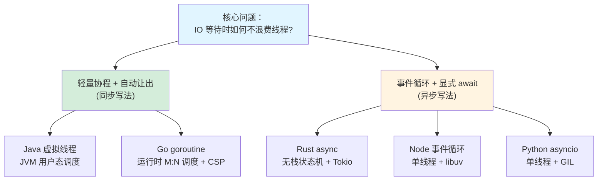

# 并发模型引用库：各语言并发机制的深度索引

> 这是一个**横切的引用库（reference library）**，不属于任何一章，而是被各章节用「钩子链接」反复引用。
> 当你在正文里读到「Go 的 goroutine」「Rust 的 async」等并发细节，想深挖原理时，就跳到这里对应的篇章。

---

## 为什么要单独建一个并发模型库

并发是贯穿全书的主线（[4.1 高并发对比](../part4-multilang-compare/01-高并发HTTP服务对比.md) 是本书重头戏）。但每门语言的并发机制都值得深入，如果把这些细节散落在各语言专章里，会割裂「并发模型」这个统一主题。

所以我们把五种语言的并发机制**深度原理**集中到这里，让你能**横向对照阅读**。各章正文讲「是什么、怎么用、和 Java 比如何」，这个库讲「底层到底怎么运转」。

---

## 一张图看懂五种并发模型的本质

**核心洞察**（[4.1](../part4-multilang-compare/01-高并发HTTP服务对比.md) 已点明）：所有并发模型都在解决同一个问题——**「IO 等待时如何不让线程空转」**。它们分成两大流派：

- **轻量协程 + 自动让出**：Java 虚拟线程、Go goroutine。你写同步代码，运行时自动在阻塞时切换。体验最好。
- **事件循环 + 显式 await**：Rust async、Node、Python asyncio。你显式标注让出点（`await`），由事件循环调度。

---

## 各篇导读

**[Java 线程与虚拟线程](./java-thread-and-virtual-thread.md)** —— 从平台线程（OS 线程薄封装）到虚拟线程（Loom）的载体线程机制、栈展开/折叠、pinning 问题。被 [3.1](../part3-java-deep/01-并发体系.md)、[4.1](../part4-multilang-compare/01-高并发HTTP服务对比.md) 引用。

**[Go goroutine 与 CSP](./go-goroutine-csp.md)** —— GMP 调度模型（G/M/P 三角色）、抢占式调度、channel 底层、CSP 理论。被 [3.1](../part3-java-deep/01-并发体系.md)、[3.2](../part3-java-deep/02-内存模型JMM.md)、[4.3](../part4-multilang-compare/03-Java到Go.md) 引用。

**[Rust async 与 Tokio](./rust-async-tokio.md)** —— Future 状态机、`.await` 编译展开、Tokio 运行时、Waker 唤醒机制、为何「无栈」。被 [3.1](../part3-java-deep/01-并发体系.md)、[3.2](../part3-java-deep/02-内存模型JMM.md)、[4.4](../part4-multilang-compare/04-Java到Rust.md) 引用。

**[Node.js 事件循环](./nodejs-eventloop.md)** —— libuv、事件循环的六个阶段、宏任务/微任务、为何单线程能高并发。被 [1.1](../part1-mindset-shift/01-从请求响应到用户交互.md)、[4.1](../part4-multilang-compare/01-高并发HTTP服务对比.md)、[4.2](../part4-multilang-compare/02-Java到JS-TS.md) 引用。

**[Python GIL 与 asyncio](./python-gil-asyncio.md)** —— GIL 的来龙去脉、它何时释放、asyncio 事件循环、多进程绕开方案、无 GIL Python（PEP 703）进展。被 [3.1](../part3-java-deep/01-并发体系.md)、[4.5](../part4-multilang-compare/05-Java到Python.md) 引用。

---

## 推荐阅读顺序

如果你想系统理解并发，建议按本库的篇章顺序读（Java→Go→Rust→Node→Python），因为它们正好覆盖「轻量协程」到「事件循环」的光谱。如果你只是从某个正文钩子跳进来，直接读对应篇章即可，每篇都自包含。

---

[← 返回全书目录](../README.md)
