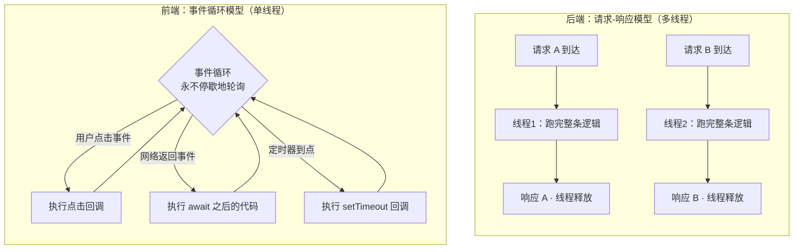

# 1.1 从「请求-响应」到「用户交互」

> 后端的世界是**线性的、有始有终的**：请求进来，逻辑跑完，响应出去，故事结束。
> 前端的世界是**循环的、永不落幕的**：程序加载后就一直活着，等着用户随时来敲门。
>
> 这一章是整本书最重要的思维转变。理解它，你才能真正「看懂」前端代码为什么长那样。

---

## 一、先回顾你熟悉的后端模型

你写过无数个 Spring Controller，它的心智模型清晰得像一条直线：

```java
@RestController
public class OrderController {

    @GetMapping("/orders/{id}")
    public OrderVO getOrder(@PathVariable Long id) {
        // 1. 请求到达，方法被调用
        Order order = orderService.findById(id);   // 2. 查数据库
        OrderVO vo = convert(order);                // 3. 组装结果
        return vo;                                  // 4. 返回，方法结束，栈帧销毁
    }
}
```

这个模型的几个关键特征，已经刻进你的肌肉记忆：

1. **有明确的入口和出口**。请求是入口，`return` 是出口。一进一出，干净利落。
2. **执行是同步线性的**。第 1 步做完做第 2 步，顺序写下来怎么读就怎么跑。
3. **生命周期短暂**。方法执行完，局部变量、栈帧统统销毁，不留痕迹。
4. **并发靠多线程**。一万个请求来了，Tomcat 用线程池开一万个（或复用）线程，每个线程各跑各的这条直线，互不干扰。

这套模型的本质是：**你的代码是被动的、一次性的「响应函数」**。框架（Tomcat / Spring）是主人，它在请求来的时候「调用你一次」，你算完就让位。你从来不需要操心「主循环」在哪——那是容器的事。

---

## 二、前端的模型：程序永远在「待命」

现在看一段等价的前端代码（先用最朴素的原生 JS，不带任何框架）：

```javascript
// 页面加载时，这段代码执行一次
const button = document.getElementById('loadOrder');
const resultDiv = document.getElementById('result');

// 关键：我们没有"执行逻辑"，而是"登记了一个回调"
button.addEventListener('click', async () => {
  const id = document.getElementById('orderId').value;
  const resp = await fetch(`/api/orders/${id}`);  // 异步请求后端
  const order = await resp.json();
  resultDiv.textContent = `订单金额：${order.amount}`;  // 改 DOM，更新界面
});

// 这段脚本到这里就"跑完"了，但程序没有结束！
```

第一次看这段代码，后端脑子会本能地问三个问题，我们逐个回答，转变就发生在这里：

**问题一：「主流程在哪？逻辑不是应该从上往下跑吗？」**

没有主流程。这段脚本从上到下执行的，只是**注册（registration）**动作——它告诉浏览器：「以后用户点了这个按钮，请帮我调用括号里这个函数。」脚本跑到底就「执行完了」，但你登记的回调还**潜伏在内存里**，等着被触发。

类比一下：后端的 Controller 方法是「我亲自坐在前台，请求来一个我接一个」；前端更像「我在前台贴了张纸条：『有人按铃就播放这段录音』，然后我就去休息了」。代码不是流程，而是**一堆贴好的纸条（事件监听器）**。

**问题二：「那程序为什么不退出？谁让它一直活着？」**

因为浏览器（以及 Node）内部有一个**永不停歇的事件循环（Event Loop）**。它就是那个「主人」，等价于后端的 Tomcat 主循环。它不停地问：「有没有事件发生？（鼠标点击、网络返回、定时器到点……）有的话，就去内存里找有没有人登记了对应的回调，有就调用它。」

> 这个事件循环是前端并发模型的核心。它如何调度、为什么单线程也能高并发，详见 [Node.js 并发模型：事件循环 + libuv](../../concurrency-models/nodejs-eventloop.md)。浏览器的事件循环和 Node 同源同构，理解一个就理解了两个。

**问题三：「`await fetch` 那行，线程是不是阻塞了？这要是后端，一个线程就卡死在这了。」**

这是最关键的认知颠覆。**前端（浏览器主线程、Node 主线程）只有一个线程**，它绝对不能阻塞——一旦阻塞，整个界面就卡死，用户点什么都没反应。

所以 `await` 在这里**根本不是「阻塞等待」**，而是「**让出**」。当代码跑到 `await fetch(...)`，它的真实含义是：

> 「这个网络请求我发出去了，但要等一会儿才回来。**我先把控制权交还给事件循环**，让它去处理别的事件（比如用户又点了别的按钮）。等网络结果回来了，事件循环再回来从 `await` 后面继续执行我。」

用 Java 类比，`await` 不像 `Thread.sleep()`（真阻塞，占着线程），而更像把 `await` 之后的代码注册成了一个 `CompletableFuture` 的回调：

```java
// Java 里的近似类比
httpClient.sendAsync(request)           // 等价于 fetch(...)
    .thenApply(resp -> resp.body())      // 等价于 await 之后的第一段
    .thenAccept(order -> updateUI(order)); // 等价于 await 之后的第二段
// 主线程立刻往下走，不在这等
```

`async/await` 就是把这套「回调地狱」用同步的写法包装了一下，让它**看起来像线性代码**，但本质上每个 `await` 都是一次「让出 + 注册后续回调」。

---

## 三、一张图看懂两种模型



后端是**一进一出的直线**，靠开很多线程跑很多条直线来扛并发。
前端是**一个圈**，靠一个线程飞快地在各种事件之间切换来扛并发——前提是每个回调都不能跑太久（不能阻塞那个唯一的线程）。

---

## 四、这个转变带来的连锁反应

一旦你接受了「前端是事件驱动的常驻程序」，很多让你困惑的前端现象就豁然开朗了：

**1. 为什么前端有「内存泄漏」这种后端很少操心的问题？**

后端方法跑完，栈帧销毁，局部变量自动回收，你几乎不操心。但前端程序常驻不退，如果你注册了一个事件监听器却忘了在不用时移除它，它就一直占着内存，引用的对象也无法回收。组件反复挂载/卸载几千次后，内存就爆了。这就是为什么 React 的 `useEffect` 一定要返回一个「清理函数」——它对应的就是「撕掉那张贴好的纸条」。

**2. 为什么不能在前端写 `while(true)` 这种死循环？**

后端某个线程死循环，最多占掉一个线程，其他请求照常。前端只有一个线程，你一个 `while(true)`，整个页面**直接卡死冻结**，用户连关闭按钮都点不动。前端的「持续运行」必须拆成一个个短小的、由事件触发的回调，永远不能霸占主线程。

**3. 为什么前端代码到处是回调、Promise、async？**

因为**任何可能耗时的操作（网络、定时、读文件）都不能同步阻塞**那个唯一的线程，只能异步化。后端你可以放心地 `jdbcTemplate.query()` 同步查库（反正你这个线程阻塞了不影响别人），前端连「读一个本地文件」都是异步 API。异步不是前端在炫技，而是**单线程模型下的生存法则**。

> 不同语言面对「不能阻塞」这件事，给出的解法各不相同：Go 用[海量廉价的 Goroutine](../../concurrency-models/go-goroutine-csp.md) 让你「假装可以阻塞」，Rust 用 [async/await + Tokio](../../concurrency-models/rust-async-tokio.md) 在编译期把异步状态机生成出来，Java 则在用[虚拟线程（Loom）](../../concurrency-models/java-thread-and-virtual-thread.md) 追赶 Go 的体验。这是第三部分会深入对比的主题。

---

## 五、给后端大脑的「翻译词典」

把这张表贴在脑子里，看前端代码时随时对照：

| 后端概念 | 前端对应物 | 说明 |
|---------|-----------|------|
| Tomcat / 容器的主循环 | 事件循环（Event Loop） | 都是那个「调用你的代码」的主人 |
| Controller 方法 | 事件监听器 / 回调函数 | 都是「被动等待被调用」的响应函数 |
| 请求到达触发调用 | 用户点击 / 网络返回触发调用 | 触发源不同，机制相同 |
| 多线程并发 | 单线程 + 异步切换并发 | 扛并发的策略根本不同 |
| `CompletableFuture.thenApply` | `Promise.then` / `await` | 几乎一一对应的异步原语 |
| 方法结束栈帧销毁 | 需手动移除监听器防泄漏 | 生命周期管理责任不同 |
| `synchronized` 防竞态 | 几乎不需要锁（单线程） | 单线程是把双刃剑：没有锁的烦恼，但绝不能阻塞 |

---

## 六、动手感受一下

如果你想亲手体会这个转变，做一个最小实验：打开浏览器控制台（F12），粘贴这段代码：

```javascript
console.log('1. 我先执行');

setTimeout(() => {
  console.log('3. 我在 0 毫秒后执行，但居然最后才打印');
}, 0);

Promise.resolve().then(() => {
  console.log('2.5 微任务，比 setTimeout 还早');
});

console.log('2. 我紧跟着第一行执行');
```

后端直觉会预期输出顺序是 `1 → 3 → 2.5 → 2`（因为 `setTimeout` 是 0 毫秒嘛）。但实际输出是：

```
1. 我先执行
2. 我紧跟着第一行执行
2.5 微任务，比 setTimeout 还早
3. 我在 0 毫秒后执行，但居然最后才打印
```

为什么？因为 `setTimeout` 哪怕是 0 毫秒，也是「**先把这个回调登记到事件队列，等当前这一轮同步代码全跑完，再由事件循环捞出来执行**」。而 `Promise.then` 进的是优先级更高的「微任务队列」。这个输出顺序，就是事件循环模型最直观的证据。如果你能解释清楚它，说明这一章的思维转变你已经吃透了。

> 微任务 / 宏任务的调度细节，是 [Node.js 并发模型](../../concurrency-models/nodejs-eventloop.md) 一章的核心内容。

---

## 本章小结

- 后端是**请求-响应**模型：线性、短暂、一进一出，靠多线程扛并发。
- 前端是**事件驱动**模型：常驻、循环、被动触发，靠单线程 + 异步切换扛并发。
- `await` 不是阻塞，而是**让出控制权 + 注册后续回调**，是单线程不卡死的关键。
- 这个转变会连锁解释前端的内存管理、异步泛滥、禁止死循环等一系列「怪现象」。

记住一句话：**后端的代码是「流程」，前端的代码是「一堆等待被触发的纸条」。** 当你不再到处找「主流程」，而是开始想「哪个事件会触发哪段代码」，你的前端思维就开光了。

---

[← 返回第一部分导读](./README.md) | [下一章：1.2 从无状态到有状态 →](./02-从无状态到有状态.md)
