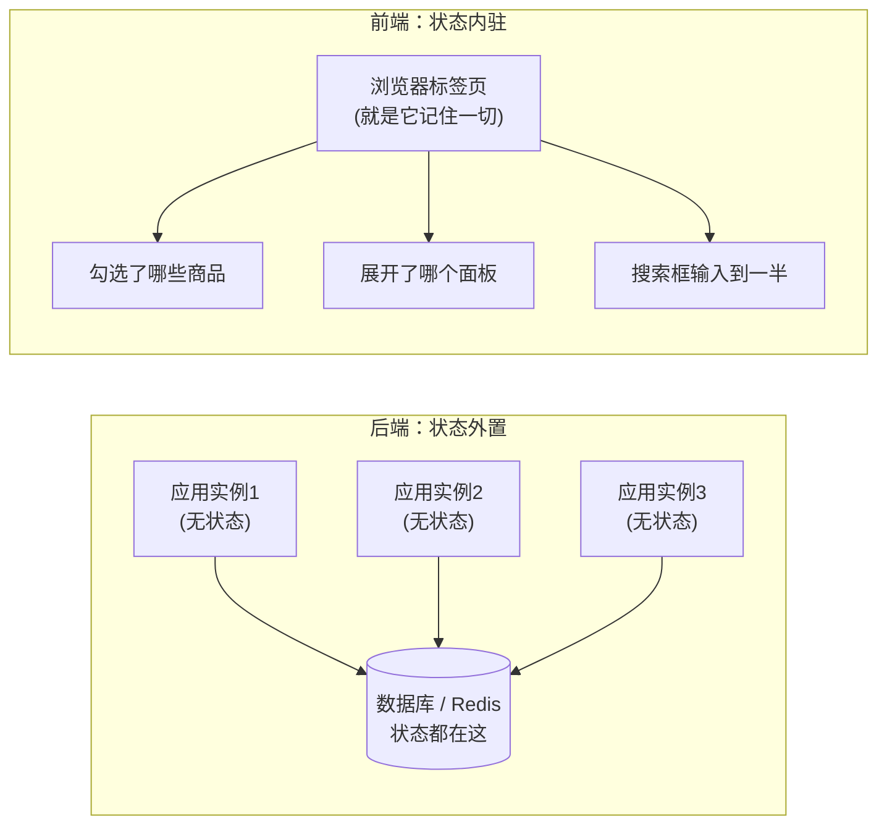

# 1.2 从「无状态」到「有状态」

> 后端工程师把「无状态」奉为信条——因为它换来了水平扩展的自由。
> 前端却天生「有状态」，而且**状态管理是整个前端工程最核心、最难的课题**，没有之一。
>
> 这一章帮你理解：你引以为傲的「无状态」，到了前端为什么行不通，以及前端是如何驯服状态这头野兽的。

---

## 一、你信仰的「无状态」到底是什么

在后端，「无状态（Stateless）」几乎是政治正确。你写的每个 Spring Bean 默认是单例的，但你**绝不会**在里面放可变的实例字段来存某个用户的数据：

```java
@Service
public class OrderService {
    // 绝对不会这么写！这个字段会被所有线程共享，是灾难
    // private Order currentOrder;

    public OrderVO process(Long userId) {
        // 正确做法：所有状态都是方法局部的，或从外部存储读取
        Order order = orderRepo.findByUser(userId);  // 状态在数据库
        return convert(order);
    }
}
```

为什么这么执着于无状态？因为它换来了一个极其宝贵的能力——**水平扩展**。你的服务实例本身不存任何会话状态，所以：

- 请求打到哪台机器都一样，负载均衡可以随便轮询；
- 某台机器挂了，流量切到别的机器，用户毫无感知；
- 想扛更多流量？再加几台机器就行，无脑扩容。

状态被你**外置**到了数据库、Redis、消息队列里。你的应用进程是「纯函数」般的存在：输入请求，输出响应，自己不留任何痕迹。这套哲学是后端高可用、高并发架构的基石。

---

## 二、前端：状态无处可外置

现在到了前端。用户打开一个页面，开始操作：勾选了 3 个商品、展开了某个折叠面板、在搜索框输入了一半的关键词、切到了第二个 Tab……

请问：**这些状态，你要外置到哪里去？**

- 外置到数据库？用户每点一下复选框就发一个请求存库，再读回来渲染？延迟和服务器压力都不可接受。
- 外置到 Redis？同样的问题，而且用户断网了怎么办？
- 根本没法外置。**这些状态只能活在用户浏览器的内存里。**

这就是前端和后端最根本的分野：**前端的状态没有「别处」可去，它必须就地驻留在内存中。** 你那套「把状态外置、保持进程无状态」的信仰，在前端**物理上就不成立**——因为前端的「进程」就是用户面前这一个浏览器标签页，它天然要记住用户当前在干什么。



---

## 三、「状态要和界面同步」——前端独有的诅咒

如果只是「状态存在内存里」，那还不算难。真正的难点在于：**前端的状态必须时刻和屏幕上看到的画面保持一致。**

后端没有这个问题。后端的数据变了，没人「看着」它，下次有人查询时读到新值就行。但前端的状态变了，屏幕上对应的那块界面**必须立刻跟着变**，否则用户就看到了「过时的画面」——这是 bug。

举个例子。一个购物车数字角标，要显示当前购物车里的商品数量。状态是 `cartCount = 3`，界面上角标显示 `3`。现在用户加购了一件，`cartCount` 变成 `4`。问题来了：**谁负责把角标从 `3` 改成 `4`？**

最原始的做法（jQuery 时代），是你手动改：

```javascript
let cartCount = 3;

function addToCart() {
  cartCount++;                                    // 1. 改状态
  document.getElementById('badge').textContent = cartCount;  // 2. 手动改界面
  // 如果角标在三个地方都显示，你得改三次。漏一个就是 bug。
}
```

这就是「**命令式 UI**」：你像个保姆，状态变一次，就得手动跑去把每一处相关的界面都改一遍。当界面复杂起来（一个状态影响十几处显示），这种手动同步会变成一场噩梦——总有你忘记同步的地方，于是「数据是对的，但界面显示的是旧的」这类幽灵 bug 层出不穷。

---

## 四、现代前端的破局：声明式 UI

现代前端框架（React / Vue）解决这个噩梦的方式，是一个优雅的范式转变——**声明式 UI**。

核心思想用一个公式概括：

> **UI = f(state)** ——界面是状态的一个函数。

你不再手动去改界面，而是**只声明「界面应该长什么样，取决于状态」**，然后框架负责：「**只要状态一变，我自动帮你重新计算界面、并高效地更新到屏幕上。**」

还是购物车角标，React 写法：

```jsx
function CartBadge() {
  const [cartCount, setCartCount] = useState(3);

  // 我只声明：角标显示的就是 cartCount。至于怎么更新到屏幕，框架的事。
  return <span className="badge">{cartCount}</span>;
}

// 加购时，我只管改状态
function addToCart() {
  setCartCount(prev => prev + 1);  // 状态一变，所有用到它的界面自动刷新
}
```

对比一下你熟悉的东西，这个转变就像：

- **命令式**像写一堆 `UPDATE` 语句，数据每变一次你都要手动写 SQL 同步各处。
- **声明式**像创建了一个**数据库视图（VIEW）**：你只定义「这个视图 = 这几张表按某规则计算的结果」，底层表数据一变，视图查出来自动是新的，你从不手动维护视图的内容。

`UI = f(state)` 里的那个 `f`，就是你写的组件渲染函数；`state` 是状态；框架则像数据库引擎，负责在 `state` 变化时高效地重新求值这个 `f`，并把差异更新到屏幕（这就是所谓的「虚拟 DOM diff」）。

> 声明式渲染的具体机制、React 与 Vue 的差异，详见 [2.2 现代前端框架](../part2-frontend-core/02-现代框架.md)。

---

## 五、状态的「层级」：前端比你想的更复杂

后端的状态归宿很简单：要么是请求级（方法局部变量），要么是持久化（数据库）。前端的状态却分成好几个层级，各有各的管理方式，这也是前端「状态管理」能成为一门独立学问的原因：

| 状态层级 | 例子 | 后端类比 | 管理方式 |
|---------|------|---------|---------|
| 组件局部状态 | 一个输入框当前的值 | 方法局部变量 | `useState` |
| 跨组件共享状态 | 当前登录用户信息 | 请求上下文 / ThreadLocal | Context / 状态库 |
| 服务端缓存状态 | 从后端拉来的列表数据 | 本地缓存（Caffeine） | React Query / SWR |
| URL 状态 | 当前在第几页、筛选条件 | 请求参数 | 路由库 |
| 持久化状态 | 用户的主题偏好 | 数据库 / 配置 | localStorage |

后端工程师初学前端最容易犯的错，就是**把所有状态一股脑塞进一个全局大对象**（像后端往 Redis 里什么都丢）。前端的最佳实践恰恰相反：**状态要尽量「就近」管理**，能放组件局部就别提升到全局。状态放得越全局，牵一发动全身的风险越大，调试越痛苦。

> 状态分层管理的实战，详见 [2.3 前端状态管理](../part2-frontend-core/03-状态管理.md)。

---

## 六、给后端大脑的「翻译词典」

| 后端概念 | 前端对应物 | 关键差异 |
|---------|-----------|---------|
| 无状态服务 + 状态外置 | 状态内驻于浏览器内存 | 前端的状态无处可外置，必须就地保存 |
| 数据变了无人看着 | 状态变了界面必须立刻同步 | 前端多了「状态-界面一致性」的诅咒 |
| 手动 `UPDATE` 同步 | 命令式 UI（手动改 DOM） | 容易漏更新，产生幽灵 bug |
| 数据库视图（VIEW） | 声明式 UI（`UI = f(state)`） | 只声明关系，变化自动传播 |
| Redis 全局大对象 | 全局状态库（慎用） | 前端推崇状态就近管理，别滥用全局 |
| ThreadLocal 请求上下文 | React Context | 跨层级传递共享数据 |

---

## 本章小结

- 后端的「无状态」是一种**主动选择**，目的是换取水平扩展能力，状态被外置到数据库。
- 前端**没得选**：状态没有「别处」可去，必须就地驻留在浏览器内存中。
- 前端独有的难点是「**状态必须和界面时刻同步**」，命令式手动同步是 bug 温床。
- 现代框架用**声明式 UI（`UI = f(state)`）** 破局，类比数据库视图：你只声明关系，变化自动传播。
- 前端状态分多个层级，最佳实践是「**就近管理**」，别把后端那套「全局 Redis」思维搬过来。

记住一句话：**后端把状态推得越远越好（外置），前端把状态收得越近越好（就近）。** 方向恰好相反，这就是这一章思维转变的精髓。

---

[← 上一章：1.1 从请求-响应到用户交互](./01-从请求响应到用户交互.md) | [下一章：1.3 从强类型到类型光谱 →](./03-从强类型到类型光谱.md)
