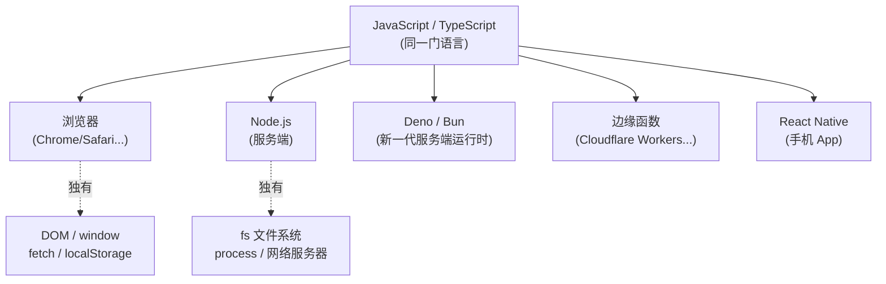

# 1.4 从「单一运行时」到「多运行时」

> 你做 Java 十年，只伺候过一个主人——JVM。它在哪都长一个样，`write once, run anywhere`。
> 前端的世界没这么省心：同一段 JavaScript，要在浏览器、Node、Deno、边缘函数里跑，
> **每个运行时的能力边界都不同**，搞混了就是 bug。这一章帮你建立「多运行时」的地图。

---

## 一、JVM 给了你一种「环境单一」的幸福

Java 的口号 `write once, run anywhere` 背后，是 JVM 这层抽象的功劳。你写的字节码，无论跑在 Linux 服务器、Windows、还是 Mac 上，面对的都是同一个 JVM 规范：

- 同一套标准库（`java.util`、`java.io`、`java.net`……）哪里都有；
- 同一套内存模型（[JMM](../part3-java-deep/02-内存模型JMM.md)）、同一套线程模型；
- 操作系统差异被 JVM 屏蔽掉了，你几乎感觉不到「我在哪台机器上」。

这种「环境单一」是一种你习以为常的幸福。你写代码时，脑子里只有一个目标平台，从不需要问「这段代码会在哪种环境跑？那种环境有没有这个 API？」

---

## 二、JavaScript 的「一鱼多吃」与随之而来的混乱

JavaScript 最初只为一件事而生：在**浏览器**里操作网页。但后来它的应用场景爆炸式扩张，同一门语言被塞进了完全不同的运行环境：



关键认知是：**这些运行时跑的是同一门语言（语法相同），但提供的「宿主 API」天差地别。** 这就像同样会说中文的人，有的有车（能开车），有的有船（能开船），你让开车的去开船就出事。

最经典的踩坑：

```javascript
// 这段代码在浏览器里跑得好好的
const data = localStorage.getItem('token');   // localStorage 是浏览器独有的
document.getElementById('app');                 // document 是浏览器独有的

// 把它原封不动搬到 Node.js 服务端：
// ReferenceError: localStorage is not defined
// ReferenceError: document is not defined
// —— Node 没有浏览器那套东西
```

反过来：

```javascript
// 这段在 Node.js 里好好的
const fs = require('fs');
const content = fs.readFileSync('/etc/config', 'utf-8');  // 读文件

// 把它搬到浏览器：
// 浏览器里根本没有 require、没有 fs —— 浏览器出于安全，禁止网页随便读你硬盘
```

对照你熟悉的世界：这就好比 `java.io.File` 在某些 JVM 上存在、在另一些上不存在——这在 Java 世界几乎不可想象，但在 JS 世界是日常。

---

## 三、为什么会这样？因为「能力」取决于宿主的职责

理解这些差异，不要死记硬背哪个 API 在哪有，而要抓住背后的逻辑：**每个运行时提供什么能力，取决于它的职责和安全边界。**

- **浏览器**的职责是「安全地展示别人服务器上的网页」。所以它给你 `DOM`（操作页面）、`fetch`（发网络请求）、`localStorage`（小容量本地存储），但**坚决不给你 `fs`**——你绝不能允许随便一个网页读取用户硬盘上的文件，那是天大的安全漏洞。浏览器是一个**沙箱**。

- **Node.js** 的职责是「在服务器上当一个完整的后端运行时」。所以它给你 `fs`（读写文件）、`net`（建网络服务）、`process`（操作进程），这些都是后端该有的能力。但它**没有 `DOM`、`window`**——服务端没有「页面」这个概念。

- **边缘函数**（如 Cloudflare Workers）的职责是「在离用户最近的节点跑一小段逻辑」。它给的 API 介于两者之间，且为了极致轻量和安全，砍掉了 Node 的很多东西。

所以「这个 API 在不在」这个问题，本质是在问「**这个运行时的职责需不需要这个能力**」。用职责去推 API，比死记硬背靠谱得多。

> Node.js 作为服务端运行时，它的并发模型（事件循环 + libuv）和浏览器同源，详见 [Node.js 并发模型](../concurrency-models/nodejs-eventloop.md)。

---

## 四、对全栈工程师的直接影响

你作为后端转全栈，会**同时**写跑在浏览器的前端代码和跑在 Node 的服务端代码。这带来一个 Java 时代从未有过的新问题：**同一个项目里，有的代码只能在浏览器跑，有的只能在 Node 跑，还有的两边都能跑。** 你得时刻清楚「我现在写的这段，将来在哪个运行时执行」。

现代框架（如 Next.js、Nuxt）把这件事推到了极致——**同构 / 服务端渲染（SSR）**：同一个 React 组件，可能先在 Node 服务端渲染一遍生成 HTML，再到浏览器「激活」一遍。这时如果你在组件里直接用了 `localStorage`，服务端渲染那一遍就会崩（Node 没有 localStorage）。这是后端转全栈最常见的翻车点之一：

```jsx
function ThemeButton() {
  // 危险！这段代码在服务端渲染时会执行，但 Node 没有 localStorage
  const theme = localStorage.getItem('theme');  // 服务端崩溃
  return <button>{theme}</button>;
}

// 正确做法：把浏览器专属操作放进只在浏览器执行的时机（useEffect）
function ThemeButton() {
  const [theme, setTheme] = useState('light');
  useEffect(() => {
    // useEffect 只在浏览器端执行，这里用 localStorage 才安全
    setTheme(localStorage.getItem('theme') ?? 'light');
  }, []);
  return <button>{theme}</button>;
}
```

这个坑的根源，就是没建立起「多运行时」的意识——下意识以为代码只在浏览器跑（像 Java 以为只在 JVM 跑），结果它在 Node 端也被执行了。

---

## 五、运行时还在「军备竞赛」

再给你一个全景认知：JS 的服务端运行时正在激烈演进，这也是 Java 世界少见的（JVM 格局稳定了几十年）。简单认个脸：

| 运行时 | 定位 | 你需要知道的一句话 |
|-------|------|------------------|
| Node.js | 元老、生态最大 | 服务端 JS 的默认选择，npm 生态都在它上面 |
| Deno | Node 原作者的「重做版」 | 默认安全、原生 TS、自带工具链，理念更现代 |
| Bun | 主打极致性能 | 启动快、内置打包/测试，想要快就看它 |
| 浏览器引擎 | V8 / JavaScriptCore | 前端代码的最终归宿，标准最严格 |

你不需要全部精通，但要知道它们存在，且**它们的标准库 API 不完全一致**。当你 copy 一段网上的代码却跑不起来时，第一个要怀疑的就是「这段是为哪个运行时写的？我跑在哪个运行时？」

---

## 六、给后端大脑的「翻译词典」

| 后端概念 | 前端对应物 | 关键差异 |
|---------|-----------|---------|
| 单一 JVM，环境统一 | 浏览器/Node/Deno/边缘 多运行时 | 同语言，宿主 API 天差地别 |
| 标准库哪里都一样 | `fs` 只在 Node，`DOM` 只在浏览器 | 能力取决于运行时的职责与安全边界 |
| `write once run anywhere` | write once, **check where it runs** | 前端要时刻问「这段在哪跑」 |
| 代码只跑在我的服务器 | 同构代码可能在 Node + 浏览器各跑一遍 | SSR 场景的经典翻车点 |
| JVM 格局稳定 | Node/Deno/Bun 军备竞赛中 | 运行时本身在快速演进 |

---

## 本章小结

- JVM 给了你「单一运行时」的幸福：环境统一，从不操心代码在哪跑。
- JavaScript 是「一鱼多吃」：同一门语言跑在浏览器、Node、Deno、边缘、手机等多个运行时。
- 各运行时**语法相同，但宿主 API 天差地别**，差异源于各自的**职责和安全边界**（浏览器是沙箱不给 `fs`，Node 是后端不给 `DOM`）。
- 全栈工程师必须时刻清楚「**我这段代码将在哪个运行时执行**」，SSR 同构场景尤其容易因此翻车。

记住一句话：**JVM 时代你只需要会说一种话给一个主人听；前端时代你说的还是同一种话，但听众有好几个，每个能听懂的「方言指令」却不一样。** 说话前先看清楚听众是谁。

---

[← 上一章：1.3 从强类型到类型光谱](./03-从强类型到类型光谱.md) | [下一章：1.5 从数据建模到 UI 建模 →](./05-从数据建模到UI建模.md)
