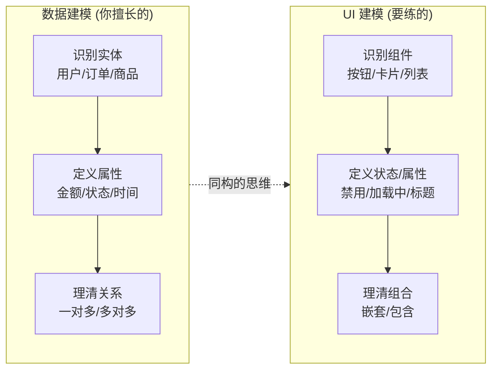
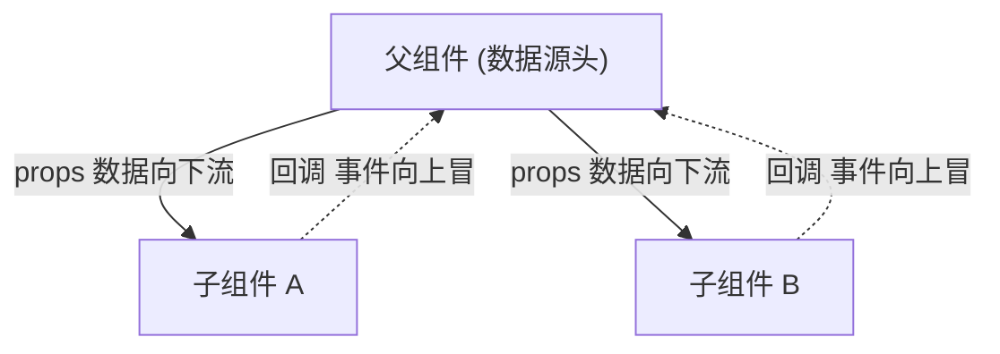

# 1.5 从「数据建模」到「UI 建模」

> 你是数据研发出身，建模是你的看家本领——ER 图、范式、维度建模，信手拈来。
> 但你练的是「**给数据建模**」的肌肉。前端要求的是另一块肌肉：「**给界面建模**」。
> 好消息是，这两种建模在底层逻辑上惊人地相通。这一章帮你把数据建模的功力平移过来。

---

## 一、你已经是一位建模高手——只是建模对象不同

别被「前端」两个字唬住。建模能力是相通的，你只是要换一个建模对象。

你做数据建模时，核心动作是三步：

1. **识别实体**：业务里有哪些核心对象？（用户、订单、商品……）
2. **定义属性**：每个实体有哪些字段？（订单有金额、状态、创建时间……）
3. **理清关系**：实体之间怎么关联？（一个用户有多个订单，一对多……）

前端的 UI 建模，几乎是同构的三步，只是换了名词：

1. **识别组件**：界面里有哪些可复用的「积木」？（按钮、卡片、列表、弹窗……）
2. **定义状态/属性**：每个组件有哪些状态和入参？（按钮有「禁用/加载中」状态、卡片有「标题/内容」属性……）
3. **理清组合关系**：组件之间怎么嵌套组合？（页面包含列表，列表包含多个卡片……）



所以这一章的核心信息是：**你不是从零学一种新能力，而是把已有的建模直觉迁移到新对象上。**

---

## 二、第一块新肌肉：把界面「拆」成组件树

数据建模里，你会把一个复杂业务拆成多张表，避免一张大宽表什么都往里塞。UI 建模里，你要把一个复杂页面拆成一棵**组件树**，避免把整个页面写成一个巨型函数。

拿一个你天天见的页面举例——一个数据看板：

```
DashboardPage（页面）
├── Header（顶部栏）
│   ├── Logo
│   └── UserMenu（用户菜单）
├── FilterBar（筛选条）
│   ├── DatePicker（日期选择）
│   └── Dropdown（下拉筛选）
└── ChartGrid（图表网格）
    ├── ChartCard（图表卡片）  ← 这个可以复用 N 次
    ├── ChartCard
    └── ChartCard
```

这棵树和你做数据建模时的「主题域 → 实体 → 字段」的层次拆解，是同一种思维。拆组件的原则也和拆表的原则相通：

| 数据建模原则 | UI 建模对应原则 |
|------------|----------------|
| 一张表只描述一类实体（单一职责） | 一个组件只干一件事（单一职责） |
| 提取公共字段，避免冗余 | 提取可复用组件，避免重复代码 |
| 范式化拆表 vs 反范式宽表的权衡 | 细粒度组件 vs 大组件的权衡 |
| 通过外键建立表关系 | 通过 props 建立组件父子关系 |

那个能复用 N 次的 `ChartCard`，就像你数据建模里抽出来的一张**维度表**——定义一次，到处引用。

---

## 三、第二块新肌肉：组件间的数据流（你最熟的部分）

这一块对数据研发来说几乎是降维打击，因为它本质就是**数据流**——你做 Spark/Flink 时天天画的那种 DAG。

前端组件间传数据，有两个方向，规则非常清晰：

**向下：父传子，通过 `props`（属性）。** 就像函数传参，也像你给一个数据处理算子喂入参数：

```jsx
// 父组件把数据"喂"给子组件，方向向下
function Dashboard() {
  const chartData = [/* ...从后端拉来的数据... */];
  return <ChartCard title="日活趋势" data={chartData} />;
  //                  ↑ 这些就是 props，像函数入参，像算子配置
}

// 子组件接收这些"入参"
function ChartCard({ title, data }) {
  return <div><h3>{title}</h3>{/* 用 data 画图 */}</div>;
}
```

**向上：子传父，通过回调函数。** 子组件不能直接改父组件的数据（就像下游算子不能反向篡改上游），只能「通知」父组件：「用户干了件事，你看着办」：

```jsx
function Dashboard() {
  const handleDateChange = (newDate) => { /* 父组件决定怎么处理 */ };
  return <DatePicker onChange={handleDateChange} />;
  //                  ↑ 把一个回调"塞"给子组件，子组件在合适时机调用它
}
```

这套「**数据向下流，事件向上冒**」的单向数据流，和你画的数据处理 DAG 是同一种心智模型：



> 数据流一旦复杂（跨越很多层级、很多组件共享），就需要专门的状态管理方案，这正是 [2.3 前端状态管理](../part2-frontend-core/03-状态管理.md) 的主题。其底层思想，和 [1.2 从无状态到有状态](./02-从无状态到有状态.md) 讲的 `UI = f(state)` 一脉相承。

---

## 四、关键差异：UI 建模多了一个「时间维度」

前面讲的都是相通的部分。但 UI 建模有一个数据建模里**相对弱化**的维度，必须单独拎出来强调——**时间 / 状态变化**。

你做数据建模，建的是一张「静态的快照」：表结构定义好，它描述的是数据**此刻**长什么样。数据会变，但「建模」本身管的是结构，不太管「变化的过程」。

但 UI 建模，你建的不只是「界面此刻长什么样」，还包括「**界面在用户操作下如何随时间变化**」。同一个组件，会有多个「状态」：

```
一个「提交按钮」组件，要建模的是它的全部状态：
├── 初始态：可点击，显示"提交"
├── 加载态：禁用 + 转圈，显示"提交中..."
├── 成功态：变绿，显示"提交成功 ✓"
└── 失败态：变红，显示"重试"
```

数据建模你不会去建模「一行数据从插入到更新的动画过程」，但 UI 建模你**必须**把一个组件在时间轴上的所有可能状态都考虑周全，否则就会出现「按钮点了没反应」「加载转圈卡住了不消失」这类体验 bug。

一个实用的建模技巧（也是和你数据建模思维的接口）：**把组件的状态当成一个有限状态机来建模**。列出所有状态、以及状态之间由什么事件触发跳转——这和你画数据流转、订单状态机其实是同一回事，只不过现在状态机的「可视化呈现」就是用户看到的界面。

---

## 五、一个完整的迁移示例

把上面所有思路串起来，演示如何用「数据建模直觉」去做一次 UI 建模。需求：做一个「订单列表页」。

**第一步，识别实体/组件（像识别表）：**
- 页面 = `OrderListPage`
- 可复用积木 = `OrderRow`（单行订单），像一张明细表的「一行」

**第二步，定义属性/状态（像定义字段）：**
- `OrderRow` 的 props（入参）：`{ orderId, amount, status }` —— 几乎就是你数据库订单表的字段子集
- `OrderListPage` 的状态：`{ orders: [], loading: false, error: null }` —— 列表数据 + 加载态 + 错误态

**第三步，理清组合与数据流（像理清表关系 + 数据流）：**
- `OrderListPage` 从后端拉数据 → 通过 props 把每行数据向下传给 `OrderRow`（数据向下流）
- 用户点某行 → `OrderRow` 通过回调通知父组件（事件向上冒）

你会发现，做完这三步，你脑子里那张「界面的模型」已经清晰得和一张 ER 图差不多了。**剩下的 JSX/CSS 只是把这个模型「翻译」成代码**，那是查文档、问 AI 就能解决的体力活。真正的硬功夫——建模——你早就会了。

---

## 六、给后端大脑的「翻译词典」

| 数据建模概念 | UI 建模对应物 | 关键差异 |
|------------|--------------|---------|
| 识别实体 | 识别组件 | 对象不同，思维相同 |
| 表字段 | 组件 props / 状态 | props 像函数入参 |
| 外键关联 | 组件父子嵌套 | props 向下传递建立关系 |
| 数据处理 DAG | 单向数据流（数据下流/事件上冒） | 几乎同构 |
| 范式 vs 反范式权衡 | 细粒度组件 vs 大组件权衡 | 同样是粒度的艺术 |
| 静态快照（结构） | 必须额外建模「随时间的状态变化」 | UI 多了时间维度 |
| 订单状态机 | 组件状态机（界面会跟着变） | 状态机思维直接复用 |

---

## 本章小结

- 你早就是建模高手，UI 建模只是**换了建模对象**：从「给数据建模」到「给界面建模」，底层思维相通。
- UI 建模三步走（识别组件 → 定义状态/属性 → 理清组合），和数据建模三步走（识别实体 → 定义字段 → 理清关系）几乎同构。
- 组件间的**单向数据流**（数据向下、事件向上）就是你熟悉的**数据处理 DAG**。
- UI 建模比数据建模**多了一个时间维度**：你必须建模组件在用户操作下的所有状态变化，用「状态机」思维去覆盖它。

记住一句话：**你不是要学一种全新的能力，而是要把建模这把老枪，从「瞄准数据」转向「瞄准界面」。** 枪还是那把枪，准星挪一挪而已。

至此第一章「思维模式转变」全部完成。接下来进入 [第二章 · 前端核心知识体系](../part2-frontend-core/README.md)，把前端的具体知识系统补齐。

---

[← 上一章：1.4 从单一运行时到多运行时](./04-从单一运行时到多运行时.md) | [返回第一章导读](./README.md) | [进入第二章 →](../part2-frontend-core/README.md)
