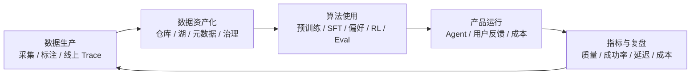

# 14.1 岗位拆解与知识映射：从 JD 语言翻译成能力模型

## 先建立正确的问题模型

用户提供的 JD 包含三组职责：建设离线和实时数仓及数据平台；与算法团队处理训练数据；与产运团队建立指标体系。把这三句话展开，岗位需要解决的不是三个独立项目，而是同一条链路上的三个断点。

如果只有数仓，没有训练数据语义，容易变成“模型团队的数据搬运工”；如果只懂数据集、不懂实时分析和治理，线上 Agent 的失败无法闭环；如果只有看板、不理解数据版本和实验设计，指标只能描述结果，不能解释原因。

## 证据来源与应有表述

本章中的职责拆解来自用户提供的 JD 摘要，不能引用成“阶跃官方 JD 原文”。可以由公开页面补强的信号有两项：官方校招职位列表出现“LLM 预训练数据算法工程师”，说明预训练数据方向确实存在；阶跃官网与开放平台强调多模态、Agent、工具调用和长程工作流，说明训练数据与 Agent 运行数据均具有业务相关性。

此外，StepTrace 的公开分享表明阶跃在 Agent 可观测侧已经讨论过 Trace 数据模型、会话分析、Token 成本、检索、评测闭环和基础设施关联。这是最接近“数据分析”工作实态的公开案例，但来源是 SelectDB 活动传播，不能外推为阶跃所有数据平台的统一技术栈。

## 职责一：离线与实时数仓、数据平台

### JD 语言背后的真实目标

“搭建数据仓库、建设数据采集/存储/治理/OLAP 平台”并不意味着要从零实现所有大数据组件。更可能的考察点是：面对不同数据的时效、形态和消费方式，能否定义清晰的数据契约、分层和服务边界。

训练数据的原始文件、标注结果、模型训练指标、生产 Trace 和业务指标在形态上完全不同。一个合理的设计至少应做到：原始数据可回放，派生数据可复现，指标口径可追溯，敏感数据可分级，在线查询不会拖垮离线作业。

### 面试中要能讲清的架构边界

| 层级 | 典型资产 | 关键要求 | 候选人应会的技术语言 |
|---|---|---|---|
| 原始层 | WARC/HTML、图片、音频、标注原件、Trace 原文 | 不丢源、不可变、可审计 | 对象存储、分区、内容哈希、数据保留策略 |
| 加工层 | 正文、OCR、结构化样本、特征、脱敏 Trace | 可复跑、可定位失败、Schema 演进 | Spark/Ray、Python、数据契约、质量 Gate |
| 数据集层 | 预训练分片、SFT、偏好对、评测集 | 版本化、可复现实验、权限隔离 | Dataset Manifest、版本号、抽样、切分 |
| 分析层 | 训练指标、Trace 宽表、质量与成本聚合 | 多维检索、秒级或近实时可见、负载隔离 | SQL、OLAP、物化视图、倒排索引、半结构化数据 |
| 服务层 | 看板、评测报告、数据 API、检索与回放 | 口径统一、权限受控、可解释 | 语义层、指标字典、行列权限、审计 |

### 知识映射

[6.7 数据仓库设计](../part6-bigdata/07-数据仓库设计.md) 解决“按什么粒度建表”；[6.9 湖仓一体](../part6-bigdata/09-湖仓一体.md) 解决“原始文件与结构化表如何共享版本和计算”；[6.11 ClickHouse](../part6-bigdata/11-ClickHouse.md) 与 [6.6 Doris](../part6-bigdata/06-Doris.md) 帮助解释高并发分析和预聚合；[6.14 数据质量](../part6-bigdata/14-数据质量.md) 与 [6.19 元数据管理](../part6-bigdata/19-元数据管理与智能数据治理.md) 解决“这份数据可不可信、从哪来的”。

## 职责二：与算法团队协作处理训练数据

### 不要把“训练数据”缩小成“清洗文本”

大模型的数据链路至少包含六类资产：预训练语料、指令数据、偏好数据、强化学习/工具轨迹、评测集，以及线上失败案例。它们的质量标准不同，不能用同一套“去重 + 长度过滤”规则一把梭。

预训练数据追求知识密度、多样性、版权与安全边界；SFT 追求任务定义清晰、答案正确、格式稳定；偏好数据追求同题候选可比较、偏好理由可靠、标注者一致；Agent 轨迹追求目标达成、步骤有效、工具状态可复现；评测集追求独立性、难度分层与长期稳定。

### 面试官实际要考什么

“算法团队说要更多代码数据”不应被直接翻译成“多爬一些 GitHub”。正确的追问是：要补的是语法知识、仓库级理解、单元测试、工具调用、修 Bug 还是长程规划？目标能力不同，样本粒度、去重策略、许可证、评测集和收益指标都不同。

“数据质量”也不能只靠主观抽样。一个完整回答应同时包含硬规则、统计分布、模型辅助评分和实验验证。硬规则排掉解析失败、重复、乱码、敏感内容；统计分布看语言、领域、长度、难度、来源是否失衡；模型/人工评分处理语义相关性与正确性；最后通过隔离评测与消融回答“是否真的提升目标能力”。

### 知识映射

- [6.8 大模型数据工程](../part6-bigdata/08-大模型数据工程.md)：网页解析、语言识别、质量过滤、MinHash/LSH 去重、多模态处理。
- [7.5 微调入门](../part7-ai-engineering/05-微调入门.md)：SFT、偏好优化和微调目标的边界。
- [7.7 分布式训练](../part7-ai-engineering/07-分布式训练.md)：数据打包、吞吐、训练稳定性为何会反过来约束数据格式。
- [7.9 AI 安全与可信](../part7-ai-engineering/09-AI安全与可信.md)：PII、投毒、越权内容和安全评测。

## 职责三：与产运团队建立指标体系

### 指标体系不是“多做几张大盘”

模型或 Agent 的业务效果至少要分为四层指标。第一层是系统健康，如请求量、错误率、P95 延迟、可用性；第二层是成本效率，如输入/输出 Token、工具调用次数、缓存命中、单任务成本；第三层是任务质量，如成功率、人工 Rubric 分、用户采纳率、安全拒答正确率；第四层是业务结果，如工单解决率、完成时长、留存或转化。

关键是因果链而非并列罗列。例如成功率下降时，先看是否由模型版本或 Prompt 版本切换引发，再把 Trace 分桶到工具失败、推理中断、输出不合格、用户中途放弃等类型，最后关联数据集、评测集与基础设施版本。只有这样，指标才能指导改动。

### StepTrace 公开案例的启发

公开演讲提到的 StepTrace 需求包括 prompt/reasoning/tool call 的数据模型、会话复盘、Token 成本、全文与元数据检索、评测闭环和基础设施关联。对于候选人而言，最值得学的不是记住某个数据库名，而是理解它把“模型表现”拆成了可计算的数据事实：一次会话由多个 Trace 组成，一个 Trace 有多个 Span，每个 Span 能关联模型、工具、输入输出、耗时、Token、状态与环境。

这也是“与产运建立指标体系”的正确落点：把模糊的“Agent 不好用”转为可检索、可聚合、可回放、可对比的实体和指标。

## 这份岗位最看重的能力组合

### 数据判断力：决定做什么，而不是只决定怎么跑

数据判断力是能在有限预算下判断样本是否真实、相关、正确、多样、安全且值得训练。它不是天赋，也不是“看多了就有感觉”；它必须落实到标签体系、抽样方法、质量量表、对照实验和复盘记录。

### 工程化能力：让判断可扩展、可复现

Python/SQL/Spark/Ray/Flink 的价值不在语言本身，而在于把判断变成稳定的批量流水线，并能处理重跑、幂等、失败隔离、资源成本、版本回溯和监控告警。

### 分析闭环：让数据变化与能力变化建立证据

没有冻结基线、没有隔离评测、没有数据版本的“模型提升”都不可信。候选人需要主动提出：比较哪个版本，保持哪些变量不变，如何切分验证集，看到退化时如何定位到样本桶。

### Owner 意识：把模糊需求翻译为验收协议

算法同学说“补一下 GUI 数据”、产品同学说“Agent 效果差”都不是可执行需求。优秀的数据工程师会先收敛任务定义、目标指标、数据边界、隐私合规、验收日期与失败回滚方案，再开始写 pipeline。

## 一个诚实的能力自检

如果能稳定回答以下问题，说明已具备该岗位的核心雏形：能否画出数据从原始文件到训练样本的版本血缘；能否区分 SFT、偏好与评测数据的质量标准；能否在一次评测回归中排除随机波动和泄漏；能否设计一张 Trace 宽表并写出成功率/成本/延迟的聚合口径；能否说明一个数据规则为什么值得上线、出了问题怎样回滚。

如果其中任一项只能讲概念，下一步不应继续堆砌术语，而应进入 [14.3 学习路径](./03-通用知识补缺与学习路径.md) 做小型、可验证的练习。
