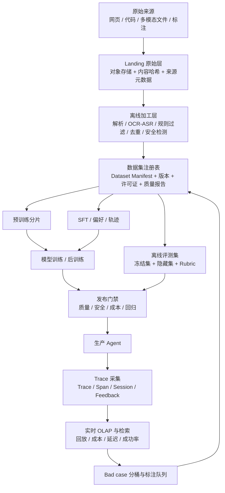
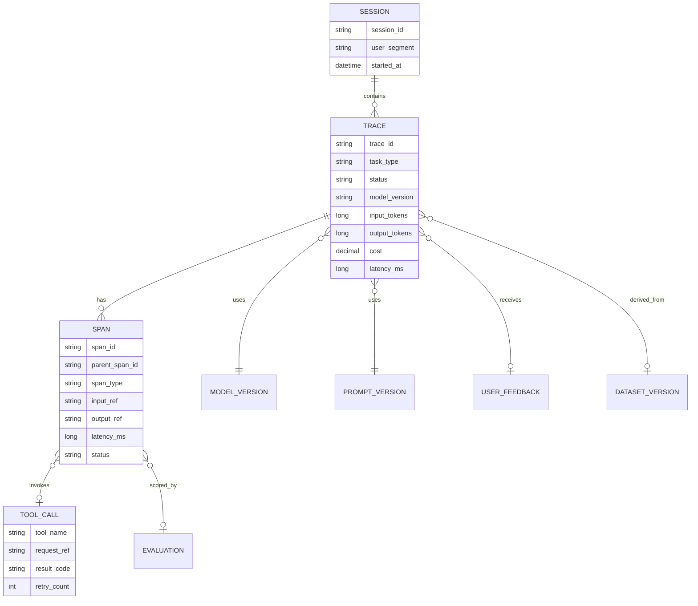

# 14.2 统一数据闭环架构：训练数据、评测与 Agent Trace

## 先给整体地图：不要把它们建成三座孤岛

训练数据平台、评测平台和 Agent 可观测平台在组织上可能属于不同团队，但从数据角度看是一条闭环。训练数据决定模型可能学到什么；离线评测决定候选版本是否值得发布；生产 Trace 揭示真实任务如何失败；这些失败在脱敏、筛选、标注和验证之后，才可能成为下一轮训练或评测资产。



下面的架构是面试建议方案，不是对任何公司内部实现的断言。它的目标是让每一条样本、每次模型变更和每个线上问题都能回溯到可验证的证据。

## 第一层：原始数据与数据集注册表

### 原始层的原则：原样保留，但不要无边界留存

原始网页、图片、音频、标注原件和线上 Trace 都应进入不可变 Landing 层，并保存来源、抓取时间、内容哈希、授权或许可证信息、所属项目、敏感级别与保留期限。不要一上来就把 HTML 清洗成纯文本后丢掉原件，否则后续无法排查正文抽取错误、版权投诉、解析版本差异或模型记忆风险。

但“保留原始数据”不等于无限期、无权限地保存所有内容。包含用户输入、账号标识、文件内容或业务数据的线上 Trace 必须先做数据最小化、脱敏和权限分级；存在删除请求、保留期限或授权限制时，数据集注册表需要能定位所有派生资产并触发删除或隔离。

### Manifest：训练数据的“发布说明 + 血缘凭证”

每一个可被训练、评测或分析使用的数据版本，都应有一个机器可读的 Manifest。它至少记录：

| 字段 | 用途 |
|---|---|
| `dataset_id` / `version` | 唯一标识与不可变版本号，避免“同名数据集被悄悄覆盖” |
| `purpose` | pretrain、SFT、preference、RL trajectory、eval、analysis 等用途 |
| `source_snapshot` | 原始来源或上游数据快照，支持回溯 |
| `pipeline_git_sha` / config | 加工代码与参数，支持复现 |
| `schema` / tokenizer | 字段与编码约束，避免训练侧误读 |
| `quality_report_uri` | 数量、语言、长度、去重率、安全命中、抽检结果 |
| `license` / sensitivity | 授权、PII、敏感等级和访问策略 |
| `split_policy` | train/dev/test 的切分和去污染策略 |
| `owner` / approver | 对质量、使用边界与变更负责的人 |

这张 Manifest 表比“数据文件存在哪”更关键。没有它，实验一旦出现回归，就无法判断到底换了训练数据、Tokenizer、样本顺序、清洗规则还是模型代码。

## 第二层：预训练与多模态数据流水线

### 典型文本链路

```text
WARC / HTML / 文档 / 代码
  → 格式解析与正文抽取
  → 编码修复、语言识别、结构完整性检查
  → 规则过滤（长度、重复、模板、垃圾、风险域）
  → 模型或人工辅助质量评分
  → 文档/段落级去重
  → PII 与安全内容处理
  → 来源、领域、语言、难度分桶与配比
  → Tokenize、pack、写入训练分片
  → 生成质量报告与 Dataset Manifest
```

关键是把便宜、确定的筛选放前面，把昂贵、主观的判断放后面。解析失败、乱码、空正文、明显模板页和精确重复可以先用规则快速淘汰；高质量文章与“看起来正常但没有训练价值”的内容，再交给质量模型或人工抽检判断。对于 PB 级数据，这种分层筛选决定成本是否可控。

### 多模态链路新增的不是“再多一种文件”

图文、视频、音频数据的质量问题不能只把文本规则照搬过去。图像需要检查分辨率、损坏、重复、OCR 密度、图文语义一致性与可能的水印/二维码噪声；音频需要检查采样率、时长、静音比例、转写可信度、说话人和噪声；视频还要考虑帧采样策略、镜头重复、时序对齐与存储成本。

更重要的是样本粒度。文本可以按文档或段落训练，图文可按一对图文、一个多图帖子或一段视觉对话训练，视频和工具轨迹通常要保留顺序与时间关系。粒度改变会影响去重、切分、Token 预算和评测定义。

### 质量 Gate 不应只有一把阈值

建议将“保留/丢弃”拆为四类结果：直接通过、直接拒绝、降权保留、进入人工复核。高质量但敏感、罕见领域、长尾语言或模型不确定样本，可能不该被简单丢弃，而应该进入受控队列；反过来，质量分高也不能绕过许可证、隐私和安全检查。

## 第三层：SFT、偏好、RL 与评测数据的分工

### 不同数据，必须不同的表结构和验收规则

| 数据类型 | 最小样本单元 | 最核心质量问题 | 不能用什么替代 |
|---|---|---|---|
| 预训练 | 文档/图文/代码片段 | 来源、知识密度、多样性、重复与安全 | 不能用少量人工精品指令数据替代广泛世界知识 |
| SFT | 指令—上下文—理想回答 | 任务清楚、答案正确、格式和风格一致 | 不能把“有偏好”的候选对直接当成单一标准答案 |
| 偏好 | 同题多候选 + 排序/理由 | 候选可比、偏好可靠、标注一致、长度偏差 | 不能用 SFT 正确率代替偏好质量 |
| RL/Agent 轨迹 | 状态—动作—工具结果—奖励 | 环境可复现、目标达成、奖励可信、无危险动作 | 不能把不完整日志当作有效轨迹 |
| Eval | 题目—参考/Rubric—切分 | 独立性、覆盖、稳定、可重复评分、抗泄漏 | 不能把训练数据切一部分就叫“能力评测” |

数据工程师的职责不是替算法选择所有训练策略，而是让这些不同资产有明确 Schema、版本、质量报告、权限和消费协议。

## 第四层：StepTrace 类 Agent 可观测数据模型

### 公开事实与架构启示

根据公开技术分享，StepTrace 兼容 Langfuse、Litefuse 和 OpenTelemetry 协议，复用 W3C Trace Context、OpenTelemetry gRPC/Collector 等技术；数据通过 Stream Load 进入 SelectDB，并用物化视图进行 Token 等聚合。演讲还提到 SWE-Agent 的镜像拉取、沙箱创建与执行、多轮模型调用和工具调用的 SDK 埋点。

这套公开信息带来的核心启示是：Agent 可观测的最小单位不是一条普通应用日志，而是能串起会话、任务、模型决策、工具执行和基础设施事件的 Trace 图。

### 推荐的逻辑模型



物理实现可采用“Trace 宽表 + Span 明细表 + 会话汇总表 + 版本维表 + 评测结果表”的组合。宽表服务日常筛选和聚合，明细表支持回放与根因排查，半结构化字段保留动态 metadata 和工具参数，敏感的大文本输入输出则应只保存脱敏内容、受控引用或经过授权的摘要，而不是默认全量暴露。

### 典型指标口径

成功率不能只用“HTTP 200 占比”。更接近业务的定义应是：在指定任务类型、用户群、模型/Prompt 版本、时间窗口和安全约束下，任务达到可验证终态的 Trace 数除以符合统计口径的总 Trace 数。工具调用成功率、人工评分、用户采纳率和安全拦截正确率可作为分层指标。

单任务成本应包括模型输入/输出 Token、推理服务单价、工具调用成本、沙箱或检索成本；P95 延迟应区分模型生成时间、工具等待时间和排队时间。否则优化一个指标可能只是把成本或延迟迁移到了另一个环节。

## 第五层：从生产 bad case 回到数据资产

线上 Trace 是宝贵的候选数据，但不是自动可训练数据。一个安全的回流流程至少包含：数据最小化与脱敏；删除无上下文、失败环境不可复现或用户无授权的样本；按失败类型聚类；为目标任务补全标准答案、工具结果和 Rubric；与现有训练/评测集做近重复检测；最后进入隔离实验而非直接上线。

```text
线上 Trace
  → 隐私/权限 Gate
  → 完整性与可复现性 Gate
  → Bad case 聚类（检索失败 / 工具失败 / 规划错误 / 幻觉 / 安全误判）
  → 标注与目标定义
  → 与 Train/Eval 去重、去污染
  → 小规模消融实验
  → 通过后进入受控数据集版本
```

这个流程体现了岗位最核心的判断力：生产问题的“可观测”不等于它已被正确“理解”，更不等于它值得被模型学习。

## 技术选型回答的正确姿势

对于 Spark、Ray、Flink、Iceberg/Paimon、Doris/SelectDB、ClickHouse、对象存储等选型，面试中不要猜测某家公司内部一定在用什么。更好的表述是按场景给出取舍：批量 HTML/多模态清洗和大规模聚合适合 Spark/Ray 类分布式计算；持续到达的 Trace、会话指标和实时告警需要流式处理或高吞吐导入；原始文件和版本化表适合对象存储加开放表格式；高维 Trace 检索与多维 Rollup 需要支持半结构化数据、索引、物化视图和负载隔离的 OLAP 引擎。

如果面试官确认其技术栈，再把上述原则映射到已知组件。这种回答既体现理解深度，也避免把未经证实的信息包装成事实。
