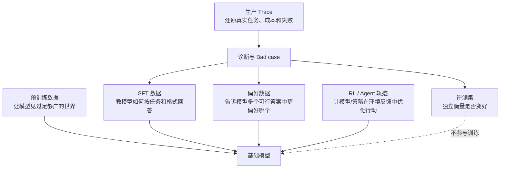

# 14.4 领域知识：LLM 数据质量、评测与可观测

## 一张总图：每种数据回答的不是同一个问题

最常见的概念错误是把它们都叫“训练数据”。预训练、SFT、偏好、轨迹、评测和生产 Trace 的质量标准、采样方式和权限边界不同。一个优秀的 AI 数据工程师首先要守住这些边界。

## 预训练数据：目标是广度、密度与安全边界

预训练数据让模型学习语言规律、世界知识、代码模式和跨模态关联。它通常规模最大、来源最杂、自动化程度最高，因此最需要工程化质量控制。

网页文本的基础流程可参考 [6.8 大模型数据工程](../part6-bigdata/08-大模型数据工程.md)：HTML 正文提取、语言识别、长度与重复过滤、质量评分、文档和段落级去重、敏感内容与 PII 处理、来源和领域配比、Tokenize 与打包。这里的核心不是列出规则，而是理解规则的副作用。例如过强的低困惑度过滤可能误伤专业、少数语言或形式化文本；过度去重可能移除需要重复学习的高频基础知识；只追求高质量域名会降低领域和文体多样性。

因此预训练数据的验收应同时看通过率、拒绝原因、语言/领域/长度分布、近重复率、敏感命中、人工抽检误差，以及关键下游能力的消融结果。任何单指标最优都可能让整体数据集变差。

## SFT 数据：目标是把“会”变成“会按要求做”

SFT 样本通常包含 system/instruction/context/response，有时还包含工具定义、结构化输出或推理字段。质量重点是任务是否清晰、上下文是否充分、答案是否事实正确、格式是否可执行、拒答是否符合安全策略、风格是否一致。

评估 SFT 样本时尤其要警惕“语言很流畅”掩盖“答案错误”。对于代码数据可加入编译、单测或静态分析；对于知识问答可加入证据检索或专家审校；对于结构化输出可校验 JSON Schema；对于工具调用可回放参数与工具返回。不能验证的答案不一定不可用，但必须降低置信度，并与可验证样本分桶管理。

## 偏好数据：目标是学习“更好”的相对关系

偏好数据的最小单元不是一条回答，而是同一问题下可比的多个候选及其排序、打分或理由。它经常用于偏好优化或奖励模型训练。

偏好质量要额外检查四件事。第一，候选是否在相同上下文、相近约束下生成，否则比较不公平。第二，偏好依据是否明确，例如正确性、安全性、遵循指令、简洁性、工具使用质量，而不是“我更喜欢 A”。第三，标注者之间是否一致，低一致样本可能反映题目歧义或 rubric 不足。第四，是否存在长度、文风或位置偏差：标注者常偏好更长、更自信或排在前面的答案，却不代表它更正确。

SFT 与偏好数据不能混为一谈。SFT 需要一个可接受的目标答案；偏好优化学习的是候选之间的相对排序。把所有偏好胜者直接抽出来做 SFT 会丢失“为什么胜出”的信息，也可能放大某种生成模型的风格偏差。

## RL 与 Agent 轨迹：目标是学会在环境里行动

对于 Agent，正确的回答不只是一段文字，而可能是一连串检索、文件编辑、浏览器、终端、API 或沙箱操作。轨迹要保存状态、动作、工具参数、工具返回、错误、重试、终态和奖励/评分。缺少任意关键上下文，离线重放与归因都会失效。

一条“最终完成任务”的轨迹也未必是好轨迹：它可能成本极高、绕了大量无效步骤、利用了偶然的环境漏洞，或隐含了不安全操作。因此轨迹质量要同时衡量任务成功、步骤效率、工具安全、环境可复现性、奖励可信度和成本。

## 评测集：目标是发现真变化，不是制造高分

好的评测集应与训练数据隔离，按能力、领域、难度、语言、输入长度、工具依赖和安全类型分桶；对开放式任务应有明确参考、Rubric 或可执行检查；对长期使用的基准要防止泄漏、过拟合和“刷题式优化”。

### 一个评测下降 2 分的排查顺序

先确认数字是否可信：样本量是否足够、置信区间是否重叠、评测脚本或裁判模型是否变了、随机种子与推理参数是否固定。再确认比较是否公平：模型、Prompt、工具、检索索引、数据版本、系统依赖是否只有预期变量发生变化。之后才按能力桶定位：下降集中在某领域、某语言、长上下文、工具任务、安全拒答，还是所有桶均匀下降。

最后回到样本和 Trace。检查训练数据是否误删某个簇、是否把评测近重复混入训练、工具是否超时、索引是否更新、模型输出格式是否让评测器误判。这个顺序能避免一看到分数下降就盲目加数据或回滚模型。

## Agent 可观测：从日志堆到可分析事实

公开的 StepTrace 分享指出，Agent 的观测对象从较确定的程序行为变为概率性的多步决策过程，因此需要在数据模型中原生处理 prompt、reasoning、tool call，并支持会话复盘、Token 成本、检索、评测闭环和基础设施关联。

对数据工程师而言，这意味着要将以下关系显式化：一个用户会话包含多个任务 Trace；一个 Trace 包含多个层级 Span；每个 Span 关联模型/Prompt/工具/数据版本和运行环境；一个最终质量标签可能来自可执行评测、人工 rubric、用户反馈或安全策略。只有版本和上下文齐全，才能回答“同类任务是模型变了还是工具变了”。

### 公共实践案例与可迁移结论

公开材料提到 StepTrace 在 SWE-Agent 场景中观测镜像拉取、沙箱创建、沙箱执行、多轮模型调用和工具调用，并用于多版本横向比较、时序性能与成功率分析；在智能座舱场景中，重点包括多轮意图收敛、约束是否生效和任务闭环率。这里可以迁移出一个通用结论：Agent 质量分析必须把模型输出与执行环境一起看，不能只盯最终答案文本。

### 一个建议的失败分类体系

| 大类 | 典型信号 | 优先处理方向 |
|---|---|---|
| 任务理解错误 | 早期计划偏离目标、检索问题错误 | Prompt、SFT、任务路由、意图数据 |
| 检索/上下文错误 | 召回为空、引用不支持答案、上下文被截断 | 索引、RAG 数据、Chunk、重排、上下文预算 |
| 工具执行错误 | 参数不合法、权限拒绝、超时、重试过多 | 工具 Schema、Harness、沙箱、重试策略 |
| 模型推理错误 | 工具成功但决策/答案不正确 | 训练数据、模型、推理策略、评测样本 |
| 安全策略错误 | 该拦未拦或不该拦却拦截 | 安全数据、分类器、策略配置、人工复核 |
| 基础设施错误 | 排队、KV Cache、网络、依赖服务异常 | 平台 SLO、容量、隔离、降级机制 |

这个分类体系既可用于看板，也可用于把 bad case 送入不同的修复队列，避免所有问题都被笼统归为“模型不行”。

## 合规与安全：数据可用不等于可训练

面对来源广泛的训练数据和线上 Trace，至少要建立四层边界。第一层是来源与授权，记录数据来自哪里、是否允许该用途、是否可再分发。第二层是隐私与敏感信息，最小化收集，检测并处理个人信息、密钥、账户、内部文档与用户上传内容。第三层是安全与内容风险，识别恶意指令、投毒、违法有害内容及可能触发的训练偏差。第四层是访问与删除，按最小权限分级，并能对撤回、过期或删除请求定位派生影响。

具体法律适用取决于数据来源、所在地区、主体身份和合同约定。本章不提供法律意见；工程上应尽早与法务、隐私和安全团队共同确定数据分类、保留期限、审批和审计策略。

## 如何把“数据判断”说成一段成熟的面试回答

“我不会只看样本是否干净。先从目标能力反推样本单位和验收标准，针对明显无效数据用规则和统计做低成本过滤，再对边界样本做分层抽检或模型辅助评分。每次规则变化都产生独立数据版本、质量报告和来源血缘；在冻结训练与评测条件下做消融，同时观察总体分数、能力分桶、安全退化和单位成本。只有确认净收益为正，才把规则固化到生产 pipeline。对于线上 Trace，我会先完成脱敏、授权和可复现性筛选，再把坏例子按模型、检索、工具和基础设施分类，而不是直接回灌训练。”

这段回答的重点不是展示术语，而是清楚地表达：你能定义标准、收集证据、控制变量，并知道数据进入模型前需要经过哪些边界。
