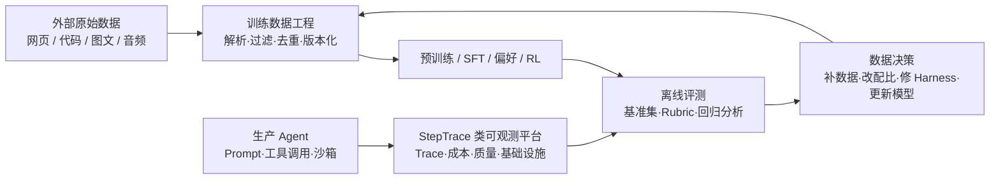

# 第十四章 · 案例研究：阶跃星辰 StepFun 的 AI 数据处理、分析与 Agent 可观测

> 以用户提供的「AI 数据处理分析工程师」岗位描述为起点，并结合阶跃星辰公开招聘、公开产品信息与 StepTrace 技术分享，重建一个“训练数据工程 + 数据平台 + Agent 评测与可观测”的复合型岗位案例。

## 先说边界：这是“相近岗位重建”，不是一份官方 JD 的逐字释义

截至本文整理时，公开渠道能直接核验到阶跃星辰在招或曾发布的相近方向包括“LLM 预训练数据算法工程师（实习）”、数据采集实习生、LLM post-train 算法研究员等；但未能在官方渠道核验到名称完全等同于“AI 数据处理分析工程师”的职位。因此，本章不会把用户提供的 JD 当作阶跃官方原文，也不会把合理的技术推断写成已公开的内部事实。

本章将信息分成三层。第一层是公开可证实事实，例如阶跃官网强调多模态、Agent 与工具调用，官方校招页列有 LLM 预训练数据算法工程师，SelectDB 发布会中有阶跃可观测性负责人介绍 StepTrace。第二层是用户提供的岗位描述，例如离线与实时数仓、训练数据协作、指标体系建设。第三层是基于前两层做出的架构推演，统一标成“建议方案”或“面试作答方案”。

这种区分很重要：面试准备的价值不是背出一家公司的“内部架构”，而是能明确说明“哪些事实已被验证、我据此会如何设计、还需要向面试官确认什么”。

## 本章定位

这个角色不是传统意义上只服务 BI 的数仓工程师，也不是只写一次性清洗脚本的数据标注运营。它处在三条数据闭环的交点：第一条是把网页、代码、图文、音频等原始资料加工成可复现、可审计、可训练的训练集；第二条是把 SFT、偏好、轨迹和评测结果转成可定位 bad case 的后训练闭环；第三条是把生产 Agent 的 Trace、Token 成本、工具调用和基础设施信号沉淀成实时分析资产。

真正的岗位价值在于让这个闭环能稳定地跑起来，并能回答三个问题：数据是否真的更好、模型为什么变好或变差、生产中的问题究竟来自数据、模型、工具链还是基础设施。

## 本章导读

- [14.0 一页速览：岗位本质、证据边界与准备重点](./00-一页速览.md)
- [14.1 岗位拆解与知识映射：从 JD 语言翻译成能力模型](./01-岗位拆解与知识映射.md)
- [14.2 统一数据闭环架构：训练数据、评测与 Agent Trace](./02-统一数据闭环架构.md)
- [14.3 通用知识补缺与学习路径：把“数据 sense”练成可验证能力](./03-通用知识补缺与学习路径.md)
- [14.4 领域知识：LLM 数据类型、质量判断、实验与合规边界](./04-领域知识：LLM数据质量评测与可观测.md)
- [14.5 面试准备：自我评价、实战题与反问清单](./05-面试准备.md)

## 与前面章节的关联

本章不重复讲 Spark、Flink、Doris、预训练处理或微调的基本原理，而是把它们按真实岗位的决策顺序重新编排。

- [6.8 大模型数据工程](../part6-bigdata/08-大模型数据工程.md)：原始语料解析、质量过滤、去重、数据配比与多模态数据处理，是训练数据链路的底座。
- [6.14 数据质量](../part6-bigdata/14-数据质量.md)：数据质量规则、异常检测、质量评分和数据契约，迁移到训练数据时要增加“训练价值”和“污染风险”两个维度。
- [6.15 平台可观测性](../part6-bigdata/15-平台可观测性.md)：任务、引擎、链路、资源四维监控是 Trace 平台的工程底座。
- [6.19 元数据管理与智能数据治理](../part6-bigdata/19-元数据管理与智能数据治理.md)：训练数据版本、派生关系、许可证与样本去向同样需要可追溯的元数据和血缘。
- [6.20 AI Native 数仓与数仓智能体](../part6-bigdata/20-AI-Native数仓与数仓智能体.md)：说明 AI 交互层、语义层、元数据层如何组成企业级数据系统；本章补充 Agent Trace 作为新的事实数据源。
- [7.5 微调入门](../part7-ai-engineering/05-微调入门.md) 与 [7.7 分布式训练](../part7-ai-engineering/07-分布式训练.md)：解释数据如何进入 SFT、偏好优化与分布式训练，而不是停在“收集样本”的层面。
- [7.6 Agent 基础](../part7-ai-engineering/06-Agent基础.md)、[7.8 AgentBI 智能分析](../part7-ai-engineering/08-AgentBI智能分析.md)：帮助理解工具调用、轨迹与多步执行为何需要单独建模和评估。
- [7.9 AI 安全与可信](../part7-ai-engineering/09-AI安全与可信.md)：训练与评测数据都必须处理 PII、数据投毒、越权样本和安全评测问题。

## 公开资料与可核验事实

本文截至 2026 年 9 月整理，技术与招聘信息更新很快，阅读时请优先查看以下原始页面。

- [阶跃星辰官网](https://stepfun.com/)：官网公开强调 Step 系列的多模态能力、Agent 工作流、工具调用与开放平台。
- [阶跃星辰官方校园招聘页](https://app.mokahr.com/campus-recruitment/step/146002)：职位列表可见“LLM 预训练数据算法工程师”等相近方向。职位会随招聘周期变化，页面当前可见不代表长期开放。
- [StepTrace 技术分享（腾讯云开发者社区转载）](https://cloud.tencent.com/developer/article/2699924)：阶跃可观测性负责人 Ric 在 SelectDB AI 产品发布会分享的实践。公开提到 StepTrace、SWE-Agent、智能座舱、Trace 模型、OpenTelemetry 兼容、Stream Load 与物化视图等。该文来自数据库厂商的活动传播，不等同于阶跃正式架构白皮书，所有性能数值均应视为演讲方自述。
- [阶跃星辰开放平台](https://platform.stepfun.com/)：公开展示面向生产 Agent 的模型能力，包括原生多模态理解、联网与视觉搜索、工具调用与主流 Agent 框架兼容。
- [Step3 模型卡（ModelScope）](https://www.modelscope.cn/models/stepfun-ai/step3-fp8)：用于交叉确认公开模型的多模态与 MoE 技术背景；它不能证明任何内部数据规模、数据配比或数据管线细节。

一句话说：这是一章面向大模型公司数据岗位的能力迁移案例。它以阶跃的公开信号为锚，但训练的是一套可以迁移到任何“训练数据 + 评测 + Agent 数据平台”岗位的判断框架。
