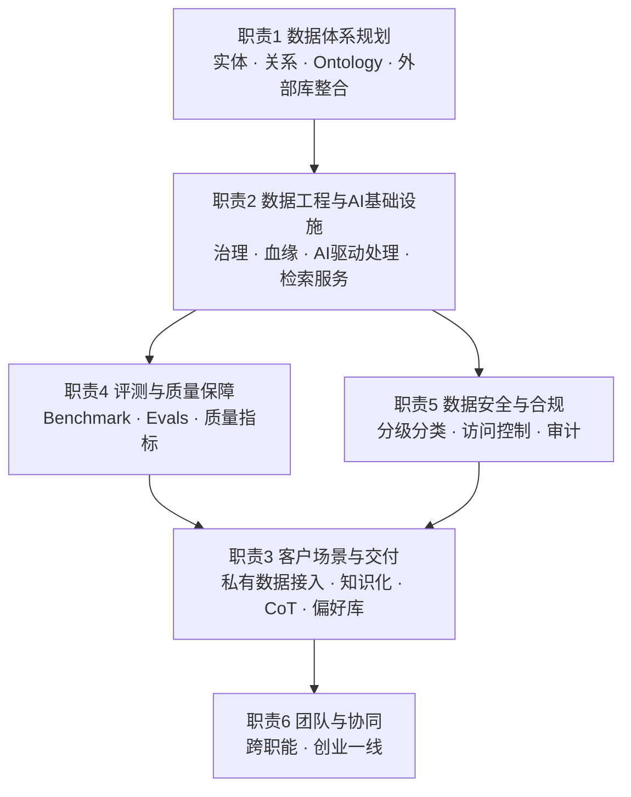

# 15.1 岗位拆解与知识映射：从 JD 语言翻译成能力模型

> 先给全局：这份 JD 的六条职责不是并列的任务清单，而是一个体系从底到顶的六层切片。把它们翻译成能力模型，才能看清自己缺什么、面试考什么。

## 先看宏观：JD 的结构本身就是一张架构图

把六条职责按依赖关系重新排列，会发现 JD 其实按「自底向上」写就了一个体系：

解读这张图有一个关键观察：**职责 4（评测）和职责 5（安全）被单独列为职责而不是任职要求，说明这个岗位的验收标准不是「数据平台建好了」，而是「AI 输出可度量、数据边界可证明」。** 一家只想要数据管道的公司不会在 JD 里写 Grounding、Citation、Provenance 这些词。这是理解整份 JD 的总钥匙：招的是「能让专业 AI 变得可信」的人，数据平台只是手段。

## 两句「反模式警告」是 JD 里最有信息量的部分

这份 JD 有两处看似抱怨的表述，实际上是面试官画出的分界线，也是筛选机制：

**第一句：「不只是 RAG / Embedding / Reranker 层面」。** 这句话排除的是「调参工程师」。过去两年大量候选人简历上写着精通 RAG，实际经验停留在分块策略、向量库选型和 Reranker 微调。JD 想要的是能回答「为什么同一套 RAG 框架，接生物医药数据和接通用文档效果差一个数量级」的人——答案在数据侧（术语归一、实体对齐、证据结构化），不在模型侧。对应的业界事实是：AstraZeneca 的 Development Assistant 之所以能用，前提是 3DP 先把源数据映射成了 FAIR 数据产品；Genentech 的研究 Agent 之所以可信，前提是 PubMed、Human Protein Atlas 和内部数亿细胞数据被组织成了可检索、可标注来源的资产。**应用层的光鲜都建立在没人看见的数据层上。**

**第二句：「不是只做平台接口，要能深入客户场景做方案设计和落地交付」。** 这句话排除的是「平台思维」。大厂习惯把能力封装成 API/平台等客户来用，但 AI 制药 ToB 的现实是：客户的私有数据烂在 ELN/LIMS/共享盘里，没有标准接口，交付的第一步永远是治理和知识化，而这部分工作 JD 里点名的产出物是「内部推理逻辑梳理、专家 CoT 思维链沉淀、偏好库建设、Evals、蒸馏」——这是把客户专家的隐性知识变成数据资产的过程，本质上是知识工程 + 数据建设，不是接口对接。

面试时，主动引用这两句话做自我定位（「我理解你们说的『不只是 RAG 层面』指的是……」）是成本最低的加分项。

## 逐条职责翻译：从 JD 语言到能力模型

| JD 职责 | 关键词提取 | 背后的真实能力要求 | 全书覆盖情况 |
|---|---|---|---|
| 1. 生物医药数据体系规划 | 实体与关系定义、Ontology、外部数据库整合、AI-ready 数据 | 领域建模能力：能对着「疾病-[靶点](./04-领域知识：生物医药研发数据实体标准与Ontology.md#term-target)-通路-分子-临床-专利」画出实体关系图，知道每个实体的权威源和脏数据模式 | 领域缺口，[15.4](./04-领域知识：生物医药研发数据实体标准与Ontology.md) 补 |
| 2. 数据工程与 AI 基础设施 | Data Catalog、血缘、Tagging、数据湖/管道、Agent 质检、AI 驱动数据采集 | 数据治理工程 + 用 LLM 做数据处理的 pipeline 设计（实体识别、[知识抽取](./04-领域知识：生物医药研发数据实体标准与Ontology.md#term-ke)、Schema Mapping 的准确率与成本权衡） | [6.16](../part6-bigdata/16-数据接入与数据集成.md)、[6.19](../part6-bigdata/19-元数据管理与智能数据治理.md)、[6.20](../part6-bigdata/20-AI-Native数仓与数仓智能体.md) 覆盖方法论 |
| 3. 客户场景与交付 | 私有数据接入、[本地治理](./04-领域知识：生物医药研发数据实体标准与Ontology.md#term-onprem)、知识化、CoT 沉淀、偏好库、Evals、蒸馏 | ToB 交付：需求到方案的转化 + 客户专家知识资产化（这同时是后训练数据的来源） | [7.5](../part7-ai-engineering/05-微调入门.md) 覆盖蒸馏/偏好数据；交付方法论本章新增 |
| 4. 评测与质量保障 | Benchmark、Eval、Grounding、Citation、Provenance | 评测体系设计：数据/检索/RAG/Agent 四层各自的指标与测试集，claim-to-evidence 级检验 | [14.2](../part14-case-stepfun-ai-data/02-统一数据闭环架构.md) 高度相关，本章迁移到生物医药 |
| 5. 数据安全与合规 | 分级分类、敏感过滤、访问控制、审计追溯、防 Agent 不当使用 | 安全工程：AI 场景的数据出入口管控，提示词注入、越权检索、训练记忆风险的落地防护 | [6.17](../part6-bigdata/17-多租户与权限体系.md)、[7.9](../part7-ai-engineering/09-AI安全与可信.md) 覆盖 |
| 6. 团队与协同 | 带生物医药/数据工程/技术团队、跨职能、创业一线 | 小团队组建与协作：招对人比自己能干更重要，但初期负责人必须是技术上限 | 本章 [15.5](./05-面试准备.md) 给初创版方案 |

## 任职要求里的三个隐含信号

**「不要求基础模型训练背景，但要懂模型如何消费专业数据」。** 这句划定了与算法团队的边界：负责人不需要会训 BioMedGPT 类模型，但必须知道多模态生物医药大模型怎么吃数据——文献、分子、蛋白、序列、知识图谱怎么进语料、怎么配比、怎么防污染。公开可核验的业界事实是：这个方向的团队已经验证过「把文献、分子、蛋白、测序、图谱数据压缩进统一多模态框架」的技术可行性（开源轻量科研版模型即为验证产物）。这意味着数据负责人的一半工作是在为自家模型准备「与通用语料完全不同质」的训练数据。

**「深度使用或集成过生物医药专业数据库」。** 注意动词是「使用或集成」而非「了解」。面试必查：ChEMBL/UniProt/ClinicalTrials/Patent 这类库的[实际字段结构、查询场景与接入选型](./04-领域知识：生物医药研发数据实体标准与Ontology.md#sec-db)、更新频率、许可证条款（学术免费 vs 商用授权的差别是真金白银的成本问题）。只用过 DrugBank 免费版读读字段，算不上「深度使用」。

**「熟悉[早期药物发现流程](./04-领域知识：生物医药研发数据实体标准与Ontology.md#sec-pipeline)，有 CMC、DMPK、多组学经验优先」。** 优先项画出的是数据场景优先级：[靶点](./04-领域知识：生物医药研发数据实体标准与Ontology.md#term-target)发现 > [多组学](./04-领域知识：生物医药研发数据实体标准与Ontology.md#term-omics) > 分子结构/序列 > CMC。这与业界参照高度一致——Genentech、复星、晶泰的公开体系都以早期发现为主场景，因为发现域风险策略最宽松（无 [GxP](./04-领域知识：生物医药研发数据实体标准与Ontology.md#term-gxp) 硬约束），适合 AI 快速迭代；临床和 CMC 是后续扩展。**准备时应把 80% 领域准备时间投在药物发现域。**

## 匹配度自评：三类候选人的画像

强匹配画像：有医药数据库集成或医药知识图谱的实战项目 + 数据治理/数据平台的工程能力 + 能讲清至少一个「数据质量决定模型效果」的一手案例 + 接受创始人汇报的一线节奏。加分项：带过 2~5 人小组、有客户现场交付经历。

弱匹配画像：纯数据开发/BI（缺领域与 AI 应用栈）、纯算法（缺数据工程与治理）、纯 RAG 应用工程师（正是 JD 第一句反模式警告排除的人群）。共同点是任一「×」号因子为零。

需要坦诚评估的风险点：没有生物医药背景的候选人，必须证明「垂直领域快速学习方法」——[15.4](./04-领域知识：生物医药研发数据实体标准与Ontology.md) 的实体模型与标准体系就是为两周突击设计的骨架；反过来，生物医药背景但缺大规模数据工程经验的候选人，要证明治理和平台能力，第六章的回链（[15.3](./03-通用知识补缺与章节回链.md)）是补缺路径。

## 初创语境下的岗位形态：负责人也是工兵

最后把 JD 放回公司语境。天使轮 AI 制药初创、汇报创始人、职级写到 VP/总监，但「创业一线，既能定方向架构，也能推动落地」这句话的真实含义是：**这个岗位没有中层可依赖，架构图上最难的那块（通常是实体对齐 pipeline 或图谱 schema 设计）初期就是负责人自己的产出物。** 判断自己是否适合这个岗位的试金石很简单：给你两周和一个生物医药博士（不懂工程），你能不能搭出「靶点—疾病—文献证据」的最小可查原型。能，则岗位成立；不能，则要么补 [15.4](./04-领域知识：生物医药研发数据实体标准与Ontology.md)，要么承认不匹配。

对应到团队职责（JD 第 6 条），初创版的组织方案不是设置六个职能团队，而是：负责人 + 1~2 名数据工程师（管道与治理）+ 1 名知识工程/生物信息（Ontology 与对齐）+ 按项目借调的领域科学家。评测和安全由负责人亲自把关，直到客户合同倒逼出专职岗位。具体招聘节奏与 90 天计划见 [15.5](./05-面试准备.md)。
