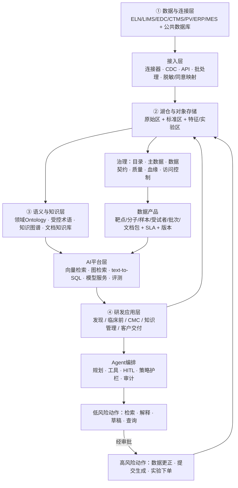

# 15.2 生物医药数据与 AI 基础设施架构全景：蓝图、业界参照与初创裁剪

> 先给全局：业界调研对中美欧英体系的总结收敛为一句话——**成功体系的核心不是「做大模型」，而是先让数据可证明、可连接、可审计。** 本章先给出完整的四层蓝图（用来对齐方向和应对架构面试），再给出初创裁剪版（用来落地和回答「你来了怎么干」），最后用业界案例校准证据边界。

## 一、完整蓝图：四层能力与一个闭环

体系由四层组成，外加贯穿始终的追溯闭环。这个蓝图适用于药企也适用于 ToB 平台，可以运行在公有云、私有云或混合环境：

两条设计原则是这张图的灵魂，也是面试时最该讲出来的判断：

**原则一：原始数据不向 AI 应用层直接暴露，Agent 不能绕过业务 API 和审批链路执行动作。** 蓝图第一层的 ELN/LIMS/EDC/CTMS/PV/ERP/MES 是研发流程各段的业务系统（全称与分工见 [15.4 的研发业务系统黑话表](./04-领域知识：生物医药研发数据实体标准与Ontology.md#term-systems)）。短链路「文档直接进 LLM」在演示里跑得通，在生产里会把数据错误、身份混用和流程失控同时放大——业界调研称其为这类体系最危险的失败模式：项目主数据尚不可靠就让 LLM 自动汇总、图谱未经本体约束就宣称推理全公司知识、Agent 没有权限边界就直连 LIMS/EDC/QMS。

**原则二：核心实体围绕「科学对象—实验证据—业务过程」组织，而不是围绕数据库表组织。** 关键关系链 `Target—hasEvidence—AssayResult—fromSample—fromStudy` 正是知识图谱相对关键词检索的优势：用户不仅找到一篇文档，还能从靶点追溯到实验、样本、研究、项目和质量状态。Servier 公开的 TURING 平台同样验证了这条路线——「结果值必须与 assay、细胞系、化合物批次、单位和项目等上下文共同保存」是业界共识，不是理论洁癖。

### 核心实体模型（与 JD 职责 1 直接对应）

| 对象类别 | 典型实体 | 需要回答的核心问题 |
|---|---|---|
| 研究主体 | 靶点/生物标志物、疾病/表型 | 研究对象是什么，用什么标识符（内部 ID + HGNC/UniProt/EFO 等外部键） |
| 干预对象 | 分子实体、项目、组织、物种 | 涉及哪些候选物和研发项目 |
| 实验证据 | assay、化合物批次、细胞/动物样本、组学数据集 | 结论由什么实验、样本、数据产生 |
| 量化结果 | readout、protocol、model version、QC 状态 | 数值如何定义，是否通过质控 |
| 业务过程 | 研究、受试者、队列、批次、文档、监管提交、BD 交易 | 证据如何进入项目和申报/交易流程 |

字段级细节（各实体的公共数据库、脏数据模式、标准 ID 体系）在 [15.4](./04-领域知识：生物医药研发数据实体标准与Ontology.md) 展开。

### 数据质量分级：不能只有「能用/不能用」两个状态

四层资产 + 状态机是治理层的骨架：

| 层级 | 典型内容 | 适用方式 | 控制要求 |
|---|---|---|---|
| Raw | 测序原始文件、仪器输出、源 PDF | 受控复用、追溯原始证据 | 保留原始状态、来源、采集上下文 |
| Standardized | CDISC/FHIR/OMOP 映射后数据 | 分析、共享、跨研究比较 | 标准版本、映射规则、转换审计 |
| Curated | 专家审核的实验/临床表征 | 直接用于模型和研发决策 | 责任人、审核状态、质量签名 |
| Derived | 特征、embedding、预测结果 | 建模和检索 | 记录代码、参数、上游版本、模型版本 |

每层附加质量状态机（`draft / validated / restricted / superseded / retained`）。这条设计直接回答一个高频面试题：「低质量数据和高质量数据被统一索引后，检索和生成失去区分度怎么办？」——答案就在索引时携带质量状态与证据等级，检索层做元数据过滤，而不是事后补救。

### 双层图谱：事实与推断必须隔离

事实图谱存经过审校的结构化事实（「靶点 X 在细胞类型 Y 表达」「化合物 Z 在 assay A 测过」）；推断图谱/检索索引存预测关系、文献证据、模型版本和置信度。**两者物理或逻辑隔离，否则模型生成的假设与验证过的科学事实在同一图里失去边界，后续检索无法区分证据等级。** 对初创这不是负担而是卖点：客户最怕的就是「AI 编的知识和真知识混在一起」。

## 二、AI 应用层：精确检索 → 受控工具 → 分域 Agent

应用层的成熟度按证据与风险控制程度递增，不按参数规模递增。

### RAG：检索质量优先于生成质量

生物医药场景的混合检索组合：

- **BM25/关键词**：解决专有名称、基因别名、精确字段（向量检索对 EGFR 这类 token 的语义泛化是灾难）；
- **向量检索**：段落级语义匹配（文献综述、机制描述）；
- **图谱检索**：约束实体和关系（「与靶点 X 同通路且已有临床证据的靶点」这种查询只有图能答）；
- **text-to-SQL / 业务 API**：最新、权威的结构化数值；
- **元数据过滤**：项目、密级、治疗领域、日期、访问权限——权限过滤必须在检索层执行，不是生成层。

高严谨场景用「**证据卡片**」直接构造答案：文档 ID、版本、页码/段落、访问时间、实体关系、适用权限策略，配最低证据数、来源冲突告警、不确定时拒答。LLM 负责重写查询、摘要、提出假设，**不成为事实的唯一来源**。

### Agent：多 Agent 的价值来自职责隔离

业界参照是 AstraZeneca 的公开架构：3DP 数据平台产出 FAIR 数据产品，应用层 supervisor agent 把自然语言查询路由给术语、临床、监管等专业子 Agent，结合 text-to-SQL 和 RAG，并展示所访问的数据表与生成过程。多 Agent 的收益是**关注点分离**——每个子 Agent 有明确的工具、权限、提示词和测试集，而不是让一个通用模型承担全部领域知识。

### Agent 权限分级（JD 职责 5 的落地形态）

| 风险等级 | 典型动作 | 控制要求 |
|---|---|---|
| 只读辅助 | 检索、图表、合规问答、草稿 | 来源引用、权限过滤、日志 |
| 受控写入 | 创建实验计划、发起查询、生成案例草稿 | 沙箱、业务校验、人工批准、幂等键 |
| 高风险动作 | 更正数据、触发仪器、变更规格、提交文档 | 双人复核、电子签名、变更控制、回滚 |
| 禁止默认开放 | 批量删除、跨项目导出、自动放行 | 默认关闭，例外治理审批 |

### MCP：工具适配器，不是治理替代品

MCP 适合做工具互操作接口（连接数据源、检索系统、内部 API、实验室系统、沙箱执行器），但模型不能借它绕过统一身份、权限、审计。稳妥公式：

> **MCP Server = 受控工具适配器 + 参数校验 + 策略执行点（PEP）+ 审计**

模型只看到最小必要的工具描述；每次调用记录模型、提示词、工具、参数、结果摘要和批准人；GxP 场景冻结工具 schema 并保留调用回放。这条公式在面试里讲出来，直接把「会用 MCP」和「会治理 MCP」区分开。

## 三、ToB 交付：控制面、数据面、证据面三平面

JD 职责 3（客户交付）的架构本质是：**客户采购的不是模型效果，而是平台对其资产边界、责任划分和合规承诺的证明。** 只有部署方式没有数据、身份、审计证据，不叫成熟私有化交付。

| 交付维度 | 客户关切 | 应提供的证据 |
|---|---|---|
| 部署拓扑 | 数据驻留、隔离、网络 | 单租户/专有云边界、数据流图 |
| 数据与 IP | 训练是否用客户数据、模型记忆 | 默认不训练、索引隔离、脱钩方案、审计（合同明确数据与衍生数据归属） |
| 身份安全 | 人员与服务账号 | SSO/SAML/OIDC、RBAC/ABAC、密钥托管与轮换 |
| 模型治理 | 幻觉、版本、锁定 | 模型目录、路由、离线评测、回滚、替代模型验证 |
| 可观测性 | 谁在何时问了什么 | 不可篡改日志、提示词与工具审计、按客户周期导出审计包 |
| 持续交付 | 升级是否影响验证环境 | 蓝绿/灰度、变更单、回滚、SBOM |

初创公司不需要一上来全部实现，但**控制面（租户/身份/策略/审计）、数据面（湖仓/图谱/检索/API）、证据面（版本/评测/质量规则/审计）的最小形态必须在第一个客户交付前成立**——因为客户安全评审不会等你成熟。

## 四、业界参照校准：哪些是事实，哪些是推断

用公开案例校准认知边界（证据均为企业/监管机构公开披露，指标为企业口径）：

- **Genentech**：gRED Research Agent 接 PubMed、Human Protein Atlas 与内部数亿细胞数据，Bedrock Agents 分解多步骤任务；披露「过去数周的任务缩短至分钟」「预计自动化逾 43,000 小时生物标志物验证工时」。→ 证明多源证据 Agent 的业务价值；43,000 小时是**预期**值不是已验证节约额。
- **AstraZeneca**：3DP + supervisor/子 Agent + text-to-SQL + RAG，展示表访问信息；披露 MVP 约六个月从 PoC 到生产就绪。→ 六个月时间线可作参照，不可照搬。
- **Sanofi**：三支柱 AI；SimplY 学批次表现提产量，GenAI 处理 PQR/MSAT/C&Q 文档，「时间与人工投入最高减少 80%」。→ CMC 文档 AI 已进生产，但不免除 GMP/Part 11。
- **Servier**：TURING 平台，领域模型 + 受控词汇 + RDF。→ 「结果值与实验上下文共存」是共同需求。
- **复星医药**：PharmAID 中枢 + AquaVista 底座 + 分域智能体，连接 EDC/CTMS/PV。→ 中国药企的「一个底座 + 分域智能体」路线已被公开验证。
- **晶泰科技**：AI + 量子物理 + 机器人自动化；公开资料未见客户部署与性能基准。→ 方向合理，ROI 证据不足。
- **医渡科技**：AI 中台 2.0（知识中心、RAG、Agent、工作流）。→ 偏医疗场景，不能不加验证套用到药企 GxP。

监管侧两个锚点：FDA 2025 年草案把 AI 可信度与用途（CoU）、训练/评估数据、风险和验证计划直接绑定；EMA 按 AI 影响程度实施全生命周期风险管理。含义是：**评测必须与用途绑定，文献 QA 好的模型不自动适用于临床终点预测或 CMC 放行**——这正是 JD 职责 4「协同业务建内部行业级评测集」的监管背景。

## 五、初创裁剪版：青澜生物实际该建什么

蓝图讲完了，现在回答真正的问题：**天使轮公司、个位数到十几人的数据团队、每一分投入都要在 6~12 个月内见效，这个蓝图砍成什么样？**

裁剪原则只有一条：**保留「不可省的控制点」，推迟「锦上添花的平台化」**。对照下表：

| 蓝图组件 | 初创决策 | 理由 |
|---|---|---|
| 数据目录 | ✂️ 用一个 YAML/表格形式的**数据清单 + 责任人**代替目录平台 | 目录平台解决的是「几百人找不到数据」，初创的问题是「十个人都知道有什么但没写下来」 |
| 数据契约 | ✅ **不可省**，第一天就用 | 契约是 schema + SLA + 责任人的轻量承诺，是防止上游静默漂移的最廉价手段，也是后续目录的种子 |
| 受控术语/实体对齐 | ✅ **不可省且是核心竞争力** | 「AI-ready」的实质就是实体统一、语义一致；这部分是产品卖点，不能砍 |
| 湖仓分层 | ✂️ 对象存储 + Parquet + 简单 raw/curated 两层，不建联邦发现、多源逻辑集成 | 单云单租户起步；客户侧部署形态跟随客户环境 |
| 知识图谱 | ✅ 但**先窄后宽**：先建「靶点—疾病—证据」一个子域的图谱 + SHACL 校验，双层图谱用逻辑隔离（命名图/属性标记）而非双库 | 图谱是差异化资产，但全领域 Ontology 是无底洞 |
| 向量/混合检索 | ✅ 开源栈组合（倒排 + 向量 + 图），自建评测驱动调优 | 检索质量是 RAG 效果的第一决定因素 |
| 多 Agent 体系 | ✂️ **先单体 Agent + 工具路由**，成熟后按 AstraZeneca 模式拆子 Agent | supervisor/子 Agent 的前提是每个子 Agent 有独立测试集，初期没有这个预算 |
| 权限/审计 | ✅ **不可省**（客户安全评审硬门槛），但用最小实现：统一网关 + ABAC 过滤 + 结构化调用日志 | 宁可功能少，不可无审计 |
| 评测体系 | ✅ **不可省且第一天建**：50~200 条专家标注 + 对抗集 + claim-to-evidence 检查 | 没有评测就没有改进方向，也无法让客户验收 |
| GxP 级验证（电子签名、Part 11） | ⏸️ 明确**暂不做**，方案设计时预留（风险分级表里标出哪些动作永远不开放） | 初创主战场是早期发现域（无 GxP 硬约束）；临床/CMC 留给后续或合作 |

三个「先手工后自动」是初创的现实主义：词汇映射审查先靠领域专家抽查（自动化对齐器是后期投入）；血缘先靠数据契约里的静态声明（OpenLineage 类动态采集后期补）；质量规则先跑核心实体的一致性检查（全维度质量评分后期补）。

裁剪版的主线故事可以一句话讲给创始人听：**前 90 天做出「靶点证据检索」这一个能让人点赞的场景 + 支撑它的最小数据底座；6 个月把它变成客户可交付的第一版；12 个月把支撑它的组件沉淀为可复用的数据产品。** 这条时间线的每一步展开在 [15.5](./05-面试准备.md) 的 90 天计划里。

## 六、风险清单：体系失败的真实原因

架构全景的最后一课是风险。业界调研的结论值得原文记住：**体系风险往往不是「模型不够大」，而是数据错误、身份混用、语义漂移和流程失控被 Agent 放大。**

| 风险 | 典型后果 | 核心控制 |
|---|---|---|
| 实体或术语不一致 | 跨项目错误合并、同名靶点重复计算 | 主数据、受控术语、映射审查、ID 治理 |
| 数据质量差/选择偏差 | 错误预测、重复实验、错误靶点 | 质量规则、责任人、外部测试、时间外推 |
| 幻觉与过度置信 | 错误科学结论、文档事实错误 | 引用、claim-level 评测、拒答、专家复核 |
| 提示词注入/工具越权 | Agent 删数据、绕审批 | 工具沙箱、参数校验、最小权限、双人批准、调用回放 |
| 私有数据泄露/训练记忆 | 客户 IP、患者信息外泄 | 租户隔离、加密、零留存、审计、渗透测试 |
| 供应商锁定/跨境限制 | 迁移困难、合规不确定 | 开放标准、可导出数据、模型路由 |

对初创，这张表还有一个战略读法：**每一条风险控制做成「可展示的证据」，就是 ToB 竞争力本身。** 大厂卖平台功能，初创卖「我能证明你的数据边界安全」——这是蓝海。
