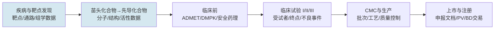

# 15.4 领域知识：生物医药研发数据实体、标准与 Ontology

> 先给全局：生物医药数据为什么「难」？不是因为量大，而是因为**数据形态由研发流程决定**——每一段流程产生一种数据，每种数据有自己的权威源、标识符体系和脏数据模式。先建立「研发流程 → 数据形态」的地图，再进实体模型和标准体系，最后是最深层的 GxP 边界与中文映射问题。本章按这个认知顺序组织。

## 一、先建地图：药物研发流程决定数据形态

药物从想法到上市走一条长链，每一段对应不同的数据：



对应到数据视角，这条链有三个决定性特征：

**特征一：越靠前越开放，越靠后越受监管。** 靶点/分子/文献数据大量来自公共数据库和论文，可以自由整合；临床、PV（药物警戒）、CMC 数据受 GxP、数据完整性（ALCOA+）、电子记录（Part 11/Annex 11）约束。所以 AI 应用的风险策略必须分域：发现域追求迭代速度，临床/CMC 域里生成式 AI 只能当「受控草稿」。JD 把主场景锚在早期发现（「覆盖早期药物发现、CMC、临床前」，优先项全是发现域），本质是选择在风险最宽松的域先把闭环跑通。

**特征二：研发数据的核心价值在「上下文」。** 一个孤立的数值（IC50 = 5 nM）没有意义，它必须绑定化合物批次、靶点及活性实验协议、细胞系、仪器、QC 状态才有科学含义。Servier 的 TURING 平台公开验证了这条工程共识：「结果值必须与 assay、细胞系、化合物批次、单位和项目等上下文共同保存」。这是生物医药 RAG 与通用 RAG 的分水岭：检索返回的必须是有上下文的证据单元，不是关键词命中的碎片。

**特征三：循环回流。** 发现域的 DMTA 循环（Design—Make—Test—Analyze：设计分子→合成→测活性→分析迭代）天然是一个「预测—实验—标注—回流」的 AI 闭环。晶泰公开的方向（AI + 自动化实验 + 标准化数据回流）说明湿实验数据如果能标准化回流，就是模型迭代的燃料——这是数据负责人能贡献的最大长期资产之一。

## 二、核心实体模型：JD 职责 1 的逐实体展开

JD 点名的实体清单是「疾病、靶点、通路、组学、药物、结构、序列、专利、临床、文献、BD 交易」。逐个展开：每个实体的身份标识、权威源、典型脏数据模式。

### 2.1 研究主体类：靶点、疾病、通路

**靶点（Target）** 是发现域的中心实体（蛋白质、基因或通路节点）。身份混乱是它的第一特性：同一个靶点有基因符号（EGFR）、蛋白名（ERBB1/HER1）、别名、历史旧称、UniProt accession（P00533）多种身份。权威键是 **HGNC**（基因命名委员会，人类基因）+ **UniProt**（蛋白）。脏数据模式：文献里写 HER1 的段落和写 EGFR 的段落， naive 系统当成两个实体；反之，基因名大小写规范（人类全大写、小鼠首字母大写）不遵守时会产生假性「同名」。

**疾病（Disease/Phenotype）** 的权威词汇是 **MONDO**（疾病本体，融合 OMIM、ICD、SNOMED 等源）或 ICD/SNOMED CT。脏数据模式：中文「非小细胞肺癌」与英文 NSCLC、adnocarcinoma 的层级归属；疾病分类在不同标准里粒度不一致（ICD 按治疗场景，MONDO 按病因学）。**适应症（Indication）** 是疾病 + 药物审批语境的组合实体，监管侧（如 FDA 批准的适应症清单）与文献侧口径不同。

**通路（Pathway）** 的权威源是 **Reactome**、KEGG、WikiPathways。脏数据模式：不同库的通路边界不一致（同一信号通路切分粒度不同），通路—基因关系随生物学认知更新频繁过期。

### 2.2 干预对象类：药物/分子、结构、序列

**药物/化合物（Drug/Compound）**：小分子的身份键首选 **InChIKey**（结构的确定性哈希），参考库是 **ChEMBL**（药物样生物活性分子，含靶点活性数据）、PubChem。**已上市药物**用 ATC 分类码；药品身份还有通用名/商品名/公司代码三套并行的命名地狱。脏数据模式：同一化合物在不同论文里用公司代码（如 GSK1120212）与通用名（trametinib）双轨出现；盐形式/立体异构体算不算同一分子需要明确建模。

**蛋白/核酸序列（Sequence）**：蛋白序列以 UniProt 为权威（含 isoform 区分）；核酸用 GenBank/RefSeq accession + 版本号。脏数据模式：序列版本更新（P00533-1 vs -2）导致历史文献引用的序列与当前库对不上；蛋白 isoform 与基因转录本交叉的建模复杂度。

**结构（Structure）**：3D 结构以 **PDB** 为权威；预测结构（AlphaFold 类）与实验结构要在数据模型里区分来源与置信度——这正是 [15.2](./02-生物医药数据与AI基础设施架构全景.md) 「事实与推断隔离」原则的一个具体实例。

### 2.3 证据与过程类：组学、专利、临床、文献、BD 交易

**组学（Omics）**：转录组/蛋白组/单细胞数据的标准载体是公共仓库（GEO、ArrayExpress、单细胞图谱联盟 HCA 类）+ 私有数据。关键建模问题：样本元数据（组织、细胞类型、疾病状态、批次）的标准化——公共组学数据的元数据质量参差，是实体对齐工作量最大的数据类型之一。

**专利（Patent）**：药物专利的检索键是专利号（家族优先于单个公开号）、优先权日、Markush 结构（专利里的通式结构，覆盖一族化合物——这是化学信息学的特有难点）。权威源是各国专利局 + 商业库。脏数据模式：同族专利多国重复公开；化合物在专利文本里的提取需要专门的化学 NER。

**临床（Clinical Trial）**：权威源是 **ClinicalTrials.gov**（NCT 编号）、中国药审机构的登记平台（CTR 编号）、EU CTR。关键字段：入排标准（自由文本，结构化是经典难题）、终点设计、适应症、申办方、状态。脏数据模式：同一试验多平台登记、状态更新滞后、终点改版未同步。

**文献（Literature）**：PubMed/ PMID 是锚点，全文获取受版权约束。知识抽取的主要对象——靶点—疾病关系、化合物—靶点活性，大部分埋在图注、表格和方法节里。

**BD 交易（Deal）**：药企间的授权/合作/并购交易，来自交易数据库和新闻。建模要素：交易结构（首付款/里程碑/分成）、涉及的管线资产、适应症领域。这是 JD 里商业化导向最重的实体，服务「立项竞争分析」场景。

### 2.4 实体统一：把上面的混乱收敛成一个体系

各实体的统一模式是一致的，可以总结成一条通用工程公式：

> **内部稳定 ID（自增/UUID，永不复用）+ 外部标准 ID 映射表（每源一行，带版本和置信度）+ 别名归一表（同义词 → 标准 ID）+ 冲突队列（两个内部 ID 疑似同一实体时进人工裁决）**

对齐质量度量：对黄金集算精确合并率（该合的合了）、误合并率（不该合的合了）、漏合并率。**误合并比漏合并危险**——漏合并只损失召回，误合并会把不同靶点的证据叠加出虚假结论。所以阈值宁严勿松，可疑对进人工队列；用 LLM 做初筛可以，但裁决责任在人，裁决记录入库（谁、何时、依据什么证据合并的）——这本身就是「审计追溯」在数据建设期的体现。

## 三、标准体系：复用优先，领域模型自建

业界调研的结论值得作为第一原则：**语义标准应优先复用，领域模型才需要自建。** 不存在一个标准替代全部数据库；「多标准共存、以映射层互联」是现实工程选择。

| 标准 | 管辖域 | 什么时候用 |
|---|---|---|
| CDISC（CDASH/SDTM/ADaM） | 临床数据采集、提交、分析 | 客户有临床试验数据要接入/对接申报时 |
| FHIR | 医疗与研究信息交换 | 对接医院/临床系统、电子病历类数据 |
| OMOP CDM | 观察性健康数据研究 | 客户要做 RWE（真实世界证据）分析时 |
| SEND | 临床前（非临床）数据提交 | 临床前数据交换场景 |
| MONDO/EFO/HGNC/UniProt | 疾病/靶点受控词汇 | 发现域日常对齐的基础设施 |
| 药品质量 FHIR IG | CMC/质量数据 | CMC 场景扩展时 |

本体表达的技术栈：**RDFS/OWL** 表达类和关系、**SKOS** 表达受控术语（同义词、层级）、**SHACL** 做图数据约束校验（相当于图谱的 schema 测试，CI 里跑）。要点是这些标准解决表达、交换和验证，**不能自动保证数据正确，不能替代数据责任人和科学审核**。

对初创的取舍：发现域主场景下，CDISC/FHIR 大部分时候用不上（它们是临床侧标准）；真正每天用的是第二张表后半段——**受控词汇的映射和内部 Ontology 的自建**。但客户项目一旦触达临床数据，标准知识就是交付门槛。面试的诚实答法：知道全景、日常深耕发现域词汇层、临床场景知道找谁/查什么。

## 四、GxP 与监管边界：知道哪些动作永远不能自动化

不需要会做合规，但必须有边界感。三层认知足够应对面试：

**第一层：GxP 是什么。** GxP 泛指药品研发生产的良好规范（GMP 生产、GCP 临床、GLP 实验室）。配套的数据要求是 ALCOA+（数据可归属、清晰、同步、原始、准确 + 完整、一致、持久、可获得）和电子记录法规（美 FDA 21 CFR Part 11、欧 Annex 11，涉及电子签名与审计追踪）。

**第二层：为什么生成式 AI 在受监管域只能当受控草稿。** 任何影响批放行、偏差处理、变更控制或申报的数据，都要经过验证模板、来源链接、双人复核和受控发布。Sanofi 公开的 CMC 文档 AI（PQR/MSAT 文档抽取综合，「时间与人工最高减少 80%」）证明 AI 已进入这些流程——**提效不等于接管决策**，规则引擎、LIMS/MES/QMS API 和人工批准不被通用聊天模型替代。

**第三层：监管正在把 AI 证据链制度化。** FDA 2025 年草案把 AI 可信度与用途（Context of Use）、训练/评估数据、风险和验证计划直接绑定；EMA 按 AI 影响程度实施全生命周期风险管理。含义：模型卡、数据说明、评测过程会逐步成为申报材料的一部分——**评测体系（JD 职责 4）不只是内部质量工具，是未来的监管证据链**。

对应到 Agent 权限分级（[15.2](./02-生物医药数据与AI基础设施架构全景.md)）：发现域只读检索可以默认开放；临床/PV/CMC 域内，Agent 生成的任何文本都是草稿，写操作走「建议—校验—审批—审计」链路；批量删除、跨项目导出、自动放行永远默认关闭。

## 五、中文语境的特有工程：术语映射层

中国市场的独有挑战：中文监管、专利、诊疗和药学文本的术语映射。工程方案是三层映射：

```text
中文表层（同义词/缩写/商品名/译名差异） → 标准概念（MONDO/UniProt/ATC 的概念 ID） → 实体 ID（内部主数据）
```

规则：中文同义词、缩写和品牌名可以指向标准概念，再通过映射表关联英文概念体系；**机器翻译结果不得直接写入受控术语主表**（可进候选队列，专家审核后入库）。中文特有的坑：药品商品名（「格列卫」vs imatinib vs Gleevec）、中文文献的疾病表述粒度与 ICD/MONDO 不对齐、监管术语的官方译法与学界译法并存（「药物警戒」vs pharmacovigilance 的表述习惯差异）。

这条映射层是本土团队的差异化资产：海外工具没有它，纯翻译方案不可靠——对客户来说是「能用」和「不能用」的区别。

## 六、多模态生物医药语料：数据负责人的另一半工作

JD 任职要求里「懂模型如何消费专业数据」指向多模态语料建设。公开可核验的业界事实：这个方向的技术可行性已被验证——把文献、分子、蛋白、测序、知识图谱数据压缩进统一的多模态大模型框架，在分子性质预测、药物—靶点亲和力、跨模态检索生成等任务上优于单一专用模型（开源轻量科研版模型即验证产物）。数据负责人对这条线的贡献是三件事：

**其一，语料的模态配比。** 文本（文献/专利/指南）、分子（SMILES/Graph）、蛋白（氨基酸序列）、知识图谱（三元组）的量级和性质完全不同，配比是模型效果的核心变量——这和通用 LLM 的数据配比问题同构，方法论从 [6.8](../part6-bigdata/08-大模型数据工程.md) 迁移，但配比实验的评测指标是领域任务（性质预测 MAE、亲和力预测 AUC）。

**其二，专业语料的污染与时效。** 时间切分防泄漏（用 2024 年文献训练、用 2025 年之后文献评测）在生物医药尤其重要，因为靶点—疾病关系随文献演进；公开 Benchmark 的划分是否做了时间切分，决定了「效果提升」是不是自欺。

**其三，知识注入的形态。** 图谱进模型有三种形态——训练语料（三元组线性化）、检索上下文（RAG 式注入）、结构编码（graph encoder），选哪种、怎么混，是数据组织方式直接决定模型效果的典型问题，也是这个岗位「能判断数据质量/组织方式对模型和 Agent 效果的影响」这条要求的实义。

## 七、小结：领域知识的优先级

把本节内容按投入产出排序，给准备时间有限的候选人：**靶点/疾病/分子的实体统一（第二节 2.1/2.2/2.4）是必答题，占 50% 权重；标准体系全景（第三节）知道分工即可；GxP 边界（第四节）能讲清「分域风险策略 + 受控草稿」就过关；中文映射（第五节）是加分题，本土候选人答好它是差异化优势；多模态语料（第六节）是区分「数据工程」和「AI-native 数据工程」的高阶题。**
