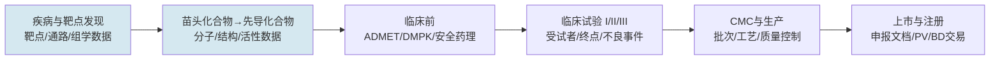

# 15.4 领域知识：生物医药研发数据实体、标准与 Ontology

> 先给全局：生物医药数据为什么「难」？不是因为量大，而是因为**数据形态由研发流程决定**——每一段流程产生一种数据，每种数据有自己的权威源、标识符体系和脏数据模式。先建立「研发流程 → 数据形态」的地图，再进实体模型和标准体系，最后是最深层的 GxP 边界与中文映射问题。本章按这个认知顺序组织。如果你是计算机背景、没有生物学基础，先读下面的「〇」节补齐概念地图，再往下走。

## 〇、写给计算机背景的读者：十分钟生物学速成

这一节用计算机工程师熟悉的类比，把本章会反复出现的生物学概念一次讲清。先声明类比纪律：**类比只是入门脚手架，帮你建立第一直觉，别把类比推到底**——生物系统没有版本控制、没有确定性执行、没有干净的接口边界，这正是它比软件系统难建模的根源。

### 从 DNA 到蛋白：理解一切的起点

细胞里有一条信息流，叫**中心法则**：DNA（脱氧核糖核酸）→ 转录 → RNA → 翻译 → 蛋白质。用工程师的语言粗略类比：DNA 是源代码（长期存储、基本不变），RNA 是编译中间产物（临时存在、会被降解），蛋白质是真正干活的进程（细胞里几乎一切功能——催化反应、传递信号、搬运物质——都由蛋白执行）。**基因**就是 DNA 上一段有功能的片段，约两万个；每个基因的产物（经过剪接变化）是一种或多种蛋白。注意一个常见误解：基因不「做事」，蛋白才做事——所以药物大多数时候瞄准的是蛋白，不是基因本身。

### 靶点（Target）：药物要攻击的那个「组件」<a id="term-target" name="term-target"></a>

**靶点是药物设计时选定的攻击对象——通常是某个与疾病相关的蛋白质（也可以是 RNA 或其他生物分子）。** 药物分子进入人体后，要在几万种生物分子里找到并结合靶点蛋白，改变它的活性（通常是抑制它），从而干预疾病进程。

用工程师视角类比：人体是一个运行中的巨型分布式系统，某条信号链上的一个组件出了 bug（突变导致持续发送增殖信号），细胞开始无限增殖——这就是癌症。你没法停机重启，只能派一个「补丁」进去精准地让这个失控组件失效。**靶点就是那个失控组件，药物就是那个补丁。**「靶」字来自药物设计的打靶隐喻：靶子选对（valid target），药物才可能有效；靶子选错，后面全部白费——所以药物研发第一阶段的核心工作就是「验证这个靶点打下去能不能治病」，这也是为什么靶点是发现域数据的中心实体。

一个贯穿本章的具体例子：**EGFR**（表皮生长因子受体）。它是细胞表面的一个受体蛋白，正常情况下接收「该生长了」的信号、短暂激活后关闭；非小细胞肺癌中它常发生突变，变成「永远在线」的开关，细胞因此疯狂增殖。针对它的药物（如吉非替尼）就是结合这个突变蛋白、把它关掉。EGFR 这个名字会在本章反复出现——同一个实体，在 ChEMBL 里是靶点 ID，在 UniProt 里是 accession P00533，在文献里可能是 HER1、ERBB1 或中文「表皮生长因子受体」，这正是第二节讲「实体统一」时最典型的案例。

### 通路（Pathway）：细胞内的「调用链」<a id="term-pathway" name="term-pathway"></a>

蛋白不是孤立干活的，而是互相接力：上游蛋白被激活后去激活下游蛋白，一环扣一环，直到信号传到细胞核改变基因表达。这样一条信号传播链就叫**通路**。最著名的例子是 MAPK/ERK 通路——RAS → RAF → MEK → ERK，四级接力把「生长信号」从细胞表面传到细胞核。传递机制是**磷酸化**：每个蛋白给下一个蛋白挂上磷酸基团，让它从「关」变「开」（RAS 像继电器开关，RAF/MEK/ERK 是三级激酶接力放大信号）。用工程师的话说：**通路就是细胞内的调用链（call chain）+ 信号放大器，只不过传的不是参数而是「磷酸化」这种化学状态的改变。**

这条链与贯穿本章的 EGFR 案例直接相连：EGFR 是链最上游的「天线」，非小细胞肺癌里 EGFR 突变「永远在线」，下游 RAS→RAF→MEK→ERK 持续喊「增殖」，细胞癌变——针对它的药物（吉非替尼）就是关掉天线。但许多患者后来出现 KRAS 突变（总开关卡死在「开」，绕过天线自己发信号），EGFR 药失效；此时可以打更下游的 MEK（trametinib 就是 MEK 抑制剂，跳过坏掉的环节直接掐断接力）。**同一通路、不同环节出 bug、用不同的药**——这正是「通路必须建成图谱才能回答『某靶点被抑制后信号走哪条旁路/下游怎么走』」的最佳例证，也是耐药机制（信号走旁路绕行）的具体形态。

通路概念的工程价值：链上任何一环都可能成为靶点（既有靶向 RAS 的药，也有靶向 MEK 的药——本章前面出现过的 trametinib 就是 MEK 抑制剂）；而且一条通路被药物阻断后，细胞可能激活旁路绕行（类比：服务被熔断后流量切到备用链路），这就是「耐药性」的机制之一。**通路数据（Reactome、KEGG）本质上就是一张巨大的实体关系图——这是生物医药天然适合知识图谱的结构性原因。**

### 药物长什么样：小分子与大分子<a id="term-molecule" name="term-molecule"></a>

**小分子药物**是化学合成的化合物（阿司匹林、吉非替尼都是），分子量小，一般口服，能穿进细胞内部，在胞内抑制靶点。**生物药（大分子）**以抗体为代表：抗体是免疫系统天然产生的 Y 形大蛋白，像「定向导弹」——经过设计后只精准结合某一个靶点（例如针对 HER2 蛋白的曲妥珠单抗），但个头大进不了细胞，通常注射给药。这个差异直接决定了第二节的实体建模：小分子的身份键是化学结构（InChIKey），蛋白类生物药的身份键是氨基酸序列——两种完全不同的标识体系。

### 组学（Omics）：对系统的全量扫描<a id="term-omics" name="term-omics"></a>

**组学是一类「全量测量」技术的统称**，后缀 -omics 加在测什么后面：基因组学测全部 DNA（类比：全量代码扫描）、转录组学测某一时刻全部 RNA 的丰度（类比：全链路 trace 快照，反映这一刻哪些代码在活跃执行）、蛋白组学测全部蛋白、代谢组学测代谢产物（类比：系统运行时的输出指标）。单细胞测序则是把转录组测量做到单个细胞的分辨率（每个细胞一条 trace，而不是聚合指标）。组学数据的特点在第二节会展开：**量大、元数据质量参差、样本上下文决定数据价值**——一组「基因 X 高表达」的数字，脱离了「什么组织、什么疾病状态、哪个细胞群」就没有意义，这和「一个延迟 30ms 的数字脱离了接口和流量背景就无法归因」是同构的问题。

### 三个高频指标：IC50、适应症、DMTA<a id="term-metrics" name="term-metrics"></a>

**IC50**（半数抑制浓度）：衡量药物抑制靶点能力的标准指标——浓度多低能把靶点活性压掉一半，数值越低药效越强（纳摩尔级 nM 通常很强，微摩尔级 μM 偏弱）。它是第二节「孤立数值没有意义」的经典例子：IC50 = 5 nM 必须绑定「哪个化合物、哪个靶点、什么实验协议、什么细胞系」才有科学含义。**适应症（Indication）**：药物被监管批准用于治疗的具体疾病范围——注意它不等于疾病本身，「吉非替尼用于 EGFR 突变的非小细胞肺癌」是一个「药物 × 疾病 × 生物标志物」的组合实体，这是第二节适应症建模比疾病建模更复杂的原因。**DMTA**（Design—Make—Test—Analyze）：药物发现的迭代循环——设计分子、合成出来、测活性、分析后进入下一轮，和软件的「编码—构建—测试—复盘」循环同构，只是单轮迭代以周计且大部分候选分子会死在循环里。

### 术语管理黑话：受控术语、主数据、Ontology<a id="term-ct" name="term-ct"></a>

接下来三个概念不是生物学，而是术语管理、AI 工程与 ToB 交付的黑话——它们在本章和 [15.2](./02-生物医药数据与AI基础设施架构全景.md)、[15.5](./05-面试准备.md) 出现频率极高，且计算机背景读者未必做过数据治理或客户交付。**受控术语（Controlled Vocabulary / Terminology，业界常缩写 CT）= 一个领域内「允许使用的词的封闭清单 + 每个词的规范含义」。** 写数据、做标注、填表单时只能从这个清单里选，不能自由发挥。对比：职业字段填「程序员 / 软件工程师 / 敲代码的」是自由文本（三个词指同一类人，机器无法聚合）；只能从固定枚举里选「软件工程师」是受控术语（所有系统里这类人共用同一个 ID）。一张完整的受控术语表通常含三件套：**规范名**（preferred label）、**同义词表**（历史上和口语里的各种写法都映射到规范名）、**层级**（NSCLC 属于肺癌、肺癌属于肿瘤）——这正是 SKOS 标准的用武之地。

生物医药里「同一个东西有多种写法」的问题极端严重（EGFR/HER1/ERBB1/表皮生长因子受体是同一个蛋白），所以 FDA 临床提交**强制**使用 CDISC CT——数据里的疾病名必须是清单里的标准码，否则申报直接被打回。「受控」二字因此有法律分量：不是风格建议，是准入门槛。三个近义词的边界：**枚举**是最朴素的受控术语（下拉框）；**Ontology** 是加强版（词表 + 层级 + 正式关系与推理规则）；**主数据**是管理意义上的对应物（企业内部那份唯一权威清单）。[15.2](./02-生物医药数据与AI基础设施架构全景.md) 初创裁剪表里「受控术语不可省、是核心竞争力」，指的就是哪怕只做一张「靶点别名归一表」，本质也是最小受控术语表——它是「AI 找到的证据是干净的」这件事的地基。

### AI 工程黑话：知识抽取<a id="term-ke" name="term-ke"></a>

**知识抽取（Knowledge Extraction）= 把埋在非结构化文本里的科学事实，转变成结构化的「实体—关系—属性」记录，使其能进数据库、进图谱、被检索和计算。** 用一个真实的文献句子看最清楚："Gefitinib inhibits EGFR phosphorylation in NSCLC cell lines with IC50 of 30 nM."——这句话对人是知识，对机器只是一串字符，无法回答「EGFR 有哪些抑制剂」。抽取后变成一条记录：Gefitinib（化合物）—抑制→ EGFR（靶点），属性 { IC50=30nM, 细胞系=NSCLC, 来源=PMID:xxx }。抽完才能进图谱、被 RAG 检索到、和 ChEMBL 数据一起比较。**生物医药的公共知识（靶点—疾病关系、化合物—靶点活性）绝大多数以自由文本埋在几千万篇文献和专利里，不抽取就永远无法被计算**——这是 JD 职责 2「用 AI 做知识抽取」的现实起点。

工程 pipeline 五步：实体识别（NER）→ 关系抽取 → **归一化（最易被忽略但最关键：表面形式对齐到受控术语/标准 ID，如 Gefitinib→ChEMBL ID、EGFR→UniProt P00533，不归一抽出的三元组全是「孤儿」）** → 约束校验（SHACL 检查 schema 合法性与必填上下文）→ 置信分流（高置信自动入库，低置信进专家裁决队列）。LLM 时代发生了质变：以前每种关系要专门训练 BERT 类 NER 模型、标注几千条样本；现在给 LLM 定义好 schema 即可零样本抽取，靠校验和抽样校准兜底。这也是生物医药图谱抽取比通用 GraphRAG 天花板更高的原因之一：**实体类型是封闭集合、schema 可预定义，抽取从「开放世界的猜测」变成「封闭模式的填表」。** 与近义词的边界：信息抽取（IE）是学界叫法，知识抽取 ≈ IE + 归一化；知识图谱构建是更大的工程（本体设计 + 抽取 + 存储 + 服务），抽取只是其中把原料变结构化的一段。

### ToB 交付黑话：本地治理与私有化部署<a id="term-onprem" name="term-onprem"></a>

JD 职责 3 的原词是「私有数据接入、治理、知识化、产品化落地，包括本地数据治理、知识库建设」。**「本地」指 on-premise——客户自己的机房、内网或私有云（与之相对的是把数据拿到自己平台）；「本地治理」= 治理组件下沉部署进客户环境，就地做盘点、分级分类、清洗、实体对齐、建知识库，数据一步不出客户边界。** 类比：大厂模式是「客户把食材送进我的中央厨房」，本地治理是「带着厨具去客户家里做饭」。药企必须「本地」的三个理由叠加：客户 IP（未公开分子结构是命根子，合同不允许拷出）、患者隐私（临床数据出域受法规约束）、GxP 数据控制（受监管数据要全程可审计，交给第三方云引入验证噩梦）。

工程难点（也是面试可讲的点）：治理组件必须**可下沉**——同一套对齐 pipeline、检索组件既能跑自己云端，也要能打包成离线安装包进客户内网跑（不能假设能联网下载模型、不能装任意工具、升级要客户 IT 审批）；由此必然产生**版本碎片**（十个客户十个环境十个版本），所以初创的应对是「组件化 + 变更清单 + 蓝绿升级」，而不是把一整个平台塞进去。与「私有化部署」的关系：私有化部署说的是**部署形态**，本地治理说的是部署之后**干的活的前半段**（治理在前，知识化、产品化在后）。

```mermaid
flowchart LR
    DNA["DNA 源代码"] -->|转录| RNA["RNA 中间产物"] -->|翻译| PROT["蛋白质\n细胞里干活的进程"]
    PROT -->|"组成信号接力（通路）"| PATH["通路 = 调用链\nRAS→RAF→MEK→ERK"]
    PATH -->|失控（突变）| DIS["疾病\n如：细胞无限增殖 = 癌症"]
    DIS -->|"找到要修的组件"| TGT["靶点\n如 EGFR（突变、永远在线）"]
    TGT -->|"设计分子去结合它"| DRUG["药物\n小分子或抗体"]
    DRUG -->|获批的治疗范围| IND["适应症\n药物 × 疾病 × 生物标志物"]
    OMICS["组学 = 全量扫描\n基因组 / 转录组 / 蛋白组"] -.测量.-> PROT
    OMICS -.测量.-> DNA
```

### 一张总图<a id="term-map" name="term-map"></a>



概念地图到此够用。接下来进入正题：这些概念落到数据系统里，每个都变成一个有标识符、有权威源、有脏数据模式的实体。

## 一、先建地图：药物研发流程决定数据形态<a id="sec-flow" name="sec-flow"></a>

药物从想法到上市走一条长链，每一段对应不同的数据：



对应到数据视角，这条链有三个决定性特征：

**特征一：越靠前越开放，越靠后越受监管。** 靶点/分子/文献数据大量来自公共数据库和论文，可以自由整合；临床、PV（药物警戒）、CMC 数据受 GxP、数据完整性（ALCOA+）、电子记录（Part 11/Annex 11）约束。所以 AI 应用的风险策略必须分域：发现域追求迭代速度，临床/CMC 域里生成式 AI 只能当「受控草稿」。JD 把主场景锚在早期发现（「覆盖早期药物发现、CMC、临床前」，优先项全是发现域），本质是选择在风险最宽松的域先把闭环跑通。

**特征二：研发数据的核心价值在「上下文」。** 一个孤立的数值（IC50 = 5 nM）没有意义，它必须绑定化合物批次、靶点及活性实验协议、细胞系、仪器、QC 状态才有科学含义。Servier 的 TURING 平台公开验证了这条工程共识：「结果值必须与 assay、细胞系、化合物批次、单位和项目等上下文共同保存」。这是生物医药 RAG 与通用 RAG 的分水岭：检索返回的必须是有上下文的证据单元，不是关键词命中的碎片。

**特征三：循环回流。** 发现域的 DMTA 循环（Design—Make—Test—Analyze：设计分子→合成→测活性→分析迭代）天然是一个「预测—实验—标注—回流」的 AI 闭环。晶泰公开的方向（AI + 自动化实验 + 标准化数据回流）说明湿实验数据如果能标准化回流，就是模型迭代的燃料——这是数据负责人能贡献的最大长期资产之一。

### 发现流水线逐段拆解：JD 优先项里的 CMC、DMPK、多组学落在哪<a id="sec-pipeline" name="sec-pipeline"></a>

JD 写「熟悉早期药物发现流程，有 CMC、DMPK、多组学经验优先」——这三个词各对应流水线上的一段。逐段看：

**① 疾病与靶点选择、靶点验证（Target Discovery & Validation）。** 从文献、遗传学证据（GWAS/OMIM）、组学数据里筛出候选靶点，再用细胞/动物实验验证「打它真能治病」。产出：验证过的靶点 + 证据链。多组学主要在这段工作。

**② 苗头化合物发现（Hit Discovery）。** 高通量筛选（HTS，机器人对几十万化合物逐一测活性）、虚拟筛选（分子对接计算）、DNA 编码化合物库（DEL）、片段筛选（FBDD）。产出：hit 列表 + 首批活性数据（IC50）。

**③ 命中到先导（Hit-to-Lead）。** 初步构效关系（SAR：结构怎么改、活性怎么变），开始测选择性（只打靶点 A 不打同家族的靶点 B）。

**④ 先导优化（Lead Optimization）。** DMTA 循环的主战场：并行优化活性、选择性和 ADMET 性质。DMPK 团队在此并行进入。

**⑤ 候选药物提名（Candidate Nomination）。** 内部决策点：一个分子获得「临床候选药物」身份，进入临床前开发（GLP 毒理、安全药理）。

**⑥ CMC（并行启动）。** 从先导阶段介入盐型晶型选择，候选提名后成为主线：合成路线放大、制剂、质量标准、稳定性。

三个优先项的准确定义：**DMPK**（Drug Metabolism and Pharmacokinetics，药物代谢与药代动力学）研究药物进入体内的 ADME——吸收（Absorption）、分布（Distribution）、代谢（Metabolism）、排泄（Excretion）。典型数据：清除率、半衰期、口服生物利用度、CYP 抑制（药物相互作用风险）。这些数据决定给药方案（一天一次还是一天三次、口服还是注射），是先导优化阶段淘汰分子的第一杀手——活性好但体内清除太快或毒性大的分子都死在这一步。**CMC**（Chemistry, Manufacturing and Controls，化学、生产与控制）是把「实验室能合成的分子」变成「能按药品生产的产物」的全部工程：合成路线、盐型晶型、制剂处方、质量标准与放行检测、稳定性研究。它横跨发现后期到上市，是 GxP 约束最强的域（GMP）——Sanofi 的 CMC 文档 AI（[15.2](./02-生物医药数据与AI基础设施架构全景.md) 业界参照）做的是这个域的文档，不是分子设计。**多组学**贯穿三处：靶点发现（差异表达找靶点）、生物标志物与患者分层（临床期）、耐药机制分析——它是最能产生「新数据资产」的技能，组学数据是靶点验证证据链的原料。

### 研发业务系统黑话：这些数据实际存在哪套系统里<a id="term-systems" name="term-systems"></a>

[15.2](./02-生物医药数据与AI基础设施架构全景.md) 蓝图的第一层写着一串缩写——ELN/LIMS/EDC/CTMS/PV/ERP/MES，它们是研发流程各段的业务系统，也是数据接入的对面系统。一张表记住：

| 缩写 | 全称与中文名 | 管什么 | 对数据负责人意味着 |
|---|---|---|---|
| ELN | Electronic Lab Notebook 电子实验记录本 | 科学家实验记录 | 发现域数据主产地，大量非结构化（文本+图谱） |
| LIMS | Laboratory Information Management System 实验室信息管理系统 | 样本、检测流程、仪器数据 | 结构化检测结果（活性、纯度）的来源 |
| EDC | Electronic Data Capture 电子数据采集 | 临床受试者数据（eCRF 病例报告表） | 临床数据源头，GCP 域 |
| CTMS | Clinical Trial Management System 临床试验管理系统 | 试验项目、中心、进度、预算 | 项目维度元数据来源 |
| PV | Pharmacovigilance 药物警戒 | 上市后不良事件监测 | 高敏患者数据，合规红线区 |
| ERP | Enterprise Resource Planning 企业资源计划 | 物料、采购、财务 | 供应链维度主数据 |
| MES | Manufacturing Execution System 制造执行系统 | 生产批次、工艺参数 | GMP 域核心数据，AI 只能做受控草稿 |
| QMS | Quality Management System 质量管理系统 | 偏差、变更、CAPA | 质量事件数据，审计追溯关键源 |

接入这些系统的现实：没有一家提供干净的 API——ELN 导出靠半结构化文档解析，LIMS 有导出模板，EDC/CTMS 在大药企通常已有数仓集成。客户私有数据接入（JD 职责 3）的第一现场就是这排缩写。

## 二、核心实体模型：JD 职责 1 的逐实体展开

JD 点名的实体清单是「疾病、靶点、通路、组学、药物、结构、序列、专利、临床、文献、BD 交易」。逐个展开：每个实体的身份标识、权威源、典型脏数据模式。

### 2.1 研究主体类：靶点、疾病、通路

**靶点（Target）** 是发现域的中心实体（蛋白质、基因或通路节点）。身份混乱是它的第一特性：同一个靶点有基因符号（EGFR）、蛋白名（ERBB1/HER1）、别名、历史旧称、UniProt accession（P00533）多种身份。权威键是 **HGNC**（基因命名委员会，人类基因）+ **UniProt**（蛋白）。脏数据模式：文献里写 HER1 的段落和写 EGFR 的段落， naive 系统当成两个实体；反之，基因名大小写规范（人类全大写、小鼠首字母大写）不遵守时会产生假性「同名」。

**疾病（Disease/Phenotype）** 的权威词汇是 **MONDO**（疾病本体，融合 OMIM、ICD、SNOMED 等源）或 ICD/SNOMED CT。脏数据模式：中文「非小细胞肺癌」与英文 NSCLC、adnocarcinoma 的层级归属；疾病分类在不同标准里粒度不一致（ICD 按治疗场景，MONDO 按病因学）。**适应症（Indication）** 是疾病 + 药物审批语境的组合实体，监管侧（如 FDA 批准的适应症清单）与文献侧口径不同。

**通路（Pathway）** 的权威源是 **Reactome**、KEGG、WikiPathways。脏数据模式：不同库的通路边界不一致（同一信号通路切分粒度不同），通路—基因关系随生物学认知更新频繁过期。

**三者的关系：现象—机制—分子，是边而不是嵌套。** 疾病（现象层，「怎么了」）、通路（机制层，「为什么会这样」）、靶点/蛋白（分子层，「拿谁下手」）之间有两类性质完全不同的边：**通路与蛋白是成员关系（contains，策展事实）**——MAPK 通路包含 EGFR/RAS/RAF/MEK/ERK 等几十个蛋白，「蛋白是通路成员」是 Reactome 里的客观边；而「这个蛋白是靶点」是一个角色，同一个蛋白在一种药里是靶点、在另一种语境下只是通路成员——多对多：一个蛋白可属于多条通路，一条通路里有多个候选靶点。**通路与疾病是驱动/关联关系（association，推断+证据）**——疾病不是通路的成员，是「通路异常驱动了疾病」（MAPK 持续激活 → 癌变），同样多对多：一种病涉及多条通路，一条通路异常驱动多种病。研发立项的三个第一性问题因此是并列的：研究什么病、破坏哪条机制、从哪个组件下手。图谱建模的三条纪律由此而来：通路实体的 ID 体系独立（R-HSA-xxx），不要试图用「疾病—靶点」复合键表达它；membership 边与 association 边必须分开建模（混为一谈会让「通路上下游查询」和「疾病相关通路查询」互相污染）；「某疾病涉及哪些通路」是推断/证据型关系（来自文献和组学），「某蛋白属于哪些通路」是策展事实——又回到 [15.2](./02-生物医药数据与AI基础设施架构全景.md#sec-kg-dual) 的双层图谱事实/推断隔离原则。

### 2.2 干预对象类：药物/分子、结构、序列

**药物/化合物（Drug/Compound）**：小分子的身份键首选 **InChIKey**（结构的确定性哈希），参考库是 **ChEMBL**（药物样生物活性分子，含靶点活性数据）、PubChem。**已上市药物**用 ATC 分类码；药品身份还有通用名/商品名/公司代码三套并行的命名地狱。脏数据模式：同一化合物在不同论文里用公司代码（如 GSK1120212）与通用名（trametinib）双轨出现；盐形式/立体异构体算不算同一分子需要明确建模。

**蛋白/核酸序列（Sequence）**：蛋白序列以 UniProt 为权威（含 isoform 区分）；核酸用 GenBank/RefSeq accession + 版本号。脏数据模式：序列版本更新（P00533-1 vs -2）导致历史文献引用的序列与当前库对不上；蛋白 isoform 与基因转录本交叉的建模复杂度。

**结构（Structure）**：3D 结构以 **PDB** 为权威；预测结构（AlphaFold 类）与实验结构要在数据模型里区分来源与置信度——这正是 [15.2](./02-生物医药数据与AI基础设施架构全景.md) 「事实与推断隔离」原则的一个具体实例。

### 2.3 证据与过程类：组学、专利、临床、文献、BD 交易

**组学（Omics）**：转录组/蛋白组/单细胞数据的标准载体是公共仓库（GEO、ArrayExpress、单细胞图谱联盟 HCA 类）+ 私有数据。关键建模问题：样本元数据（组织、细胞类型、疾病状态、批次）的标准化——公共组学数据的元数据质量参差，是实体对齐工作量最大的数据类型之一。

**专利（Patent）**：药物专利的检索键是专利号（家族优先于单个公开号）、优先权日、Markush 结构（专利里的通式结构，覆盖一族化合物——这是化学信息学的特有难点）。权威源是各国专利局 + 商业库。脏数据模式：同族专利多国重复公开；化合物在专利文本里的提取需要专门的化学 NER。

**临床（Clinical Trial）**：权威源是 **ClinicalTrials.gov**（NCT 编号）、中国药审机构的登记平台（CTR 编号）、EU CTR。关键字段：入排标准（自由文本，结构化是经典难题）、终点设计、适应症、申办方、状态。脏数据模式：同一试验多平台登记、状态更新滞后、终点改版未同步。

**文献（Literature）**：PubMed/ PMID 是锚点，全文获取受版权约束。知识抽取的主要对象——靶点—疾病关系、化合物—靶点活性，大部分埋在图注、表格和方法节里。

**BD 交易（Deal）**：药企间的授权/合作/并购交易，来自交易数据库和新闻。建模要素：交易结构（首付款/里程碑/分成）、涉及的管线资产、适应症领域。这是 JD 里商业化导向最重的实体，服务「立项竞争分析」场景。

### 2.4 实体统一：把上面的混乱收敛成一个体系<a id="term-entity-alignment" name="term-entity-alignment"></a>

各实体的统一模式是一致的，可以总结成一条通用工程公式：

> **内部稳定 ID（自增/UUID，永不复用）+ 外部标准 ID 映射表（每源一行，带版本和置信度）+ 别名归一表（同义词 → 标准 ID）+ 冲突队列（两个内部 ID 疑似同一实体时进人工裁决）**

对齐质量度量：对黄金集算精确合并率（该合的合了）、误合并率（不该合的合了）、漏合并率。**误合并比漏合并危险**——漏合并只损失召回，误合并会把不同靶点的证据叠加出虚假结论。所以阈值宁严勿松，可疑对进人工队列；用 LLM 做初筛可以，但裁决责任在人，裁决记录入库（谁、何时、依据什么证据合并的）——这本身就是「审计追溯」在数据建设期的体现。

### 2.5 公共数据库实操：字段、查询场景与接入选型<a id="sec-db" name="sec-db"></a>

JD 要求「深度使用或集成过生物医药专业数据库」——「深度」的检验标准就是这一节：知道每个库有什么字段、什么业务问题查它、用什么技术接它。四个必答题级别的库：

#### ChEMBL：分子—靶点—活性的关系库

EMBL-EBI 维护的药物样小分子库，约 240 万化合物、上万靶点、千万级活性记录，数据从文献和专利里提取。核心表五张：`molecules`（CHEMBL ID、SMILES、InChIKey、分子量）、`targets`（靶点 CHEMBL ID、UniProt 映射、靶点类型）、`activities`（化合物—靶点—活性三元组：`standard_type` 如 IC50/Ki、`standard_value`、`pchembl_value` 归一化打分）、`assays`（实验协议与上下文）、`documents`（来源文献/专利）。

典型查询：「EGFR 的活性排名前 100 的口服小分子」——三表 join：activities（target=EGFR， type=IC50）× molecules（分子量 <500）按 pchembl_value 降序。反方向：「某个分子打了几十个靶点」——化合物选择性分析，同样一个 join。接入：官方提供完整 PostgreSQL schema（约 30 张表），初创两条路——dump 导入自建 PG 做事务型查询，或转 Parquet + DuckDB 做分析型查询；分子子结构/相似性检索需要 RDKit 算指纹（PG 有 pgRDKit 扩展）。许可开放无商用限制；每年约两个 release，**版本化快照必须记录 release 号**，否则同一查询在不同时间结果不同（靶点—化合物关系随文献更新）。

#### UniProt：蛋白的权威身份库

蛋白序列与功能的权威源，分两层：Swiss-Prot（人工审核，约 57 万条，质量高）和 TrEMBL（自动注释，数亿条，覆盖广）。核心字段：`accession`（P00533 这类稳定主键）、`entry_name`（EGFR_HUMAN）、别名表、物种、序列、功能描述文本、GO 注释（蛋白功能的受控分类）、与 PDB/ChEMBL 的交叉引用。

典型查询：靶点归一（EGFR/HER1/ERBB1 → P00533，2.4 节实体统一的地基）；「与 EGFR 同家族且有实验结构的人源蛋白」（GO 家族注释 × PDB xref）。接入：REST API、SPARQL 端点、FASTA 全量下载；选型惯例——序列文件进对象存储，元数据进 PG，序列 embedding 进向量库（蛋白语言模型出的向量用于序列相似性检索）。

#### ClinicalTrials.gov：临床管线的公开账本

FDA 的试验注册库，数十万注册试验，竞品调研的第一数据源。核心字段：`NCT ID`（主键）、申办方、`conditions`（适应症）、`interventions`（干预/药物）、`phase`、入组人数、主要终点、`eligibility`（入排标准——自由文本，结构化是经典难题）、状态与日期。

典型查询：「PD-L1 抑制剂在 NSCLC 的 III 期在研试验」（condition × intervention × phase 三重过滤，管线竞争格局）；「某适应症近两年的终点设计」（终点字段聚合，为自研设计做参考）。接入：REST API v2（JSON）、定期全量快照；中国临床试验登记平台（CTR）和 EU CTR 同理，同一试验多平台登记的实体统一问题在 2.1 节已展开。

#### 专利：贵但独特的护城河数据

源分三层：各国专利局原始文件（USPTO/CNIPA/EPO/WIPO，官方 API 免费）、商业专利库（字段化、贵）、SureChEMBL（EBI 免费的专利化学实体抽取库）。核心字段：公开号/授权号、同族（INPADOC family，同一发明多国申请需去重）、优先权日、权利要求、IPC 分类；化学专利特有的 Markush 通式结构（一个通式覆盖一族化合物，解析是化学信息学专门课题）。

典型查询：FTO（自由实施）分析——「我的分子会不会侵犯别人的专利」（同族 × 权利要求比对）；竞争对手布局（申请人聚合 × 分类聚合）。接入难点：化学名→结构的解析需要专门工具（OPSIN），化学 NER 的准确率远低于蛋白/基因名。

#### 存储选型小结

| 数据形态 | 选型 | 理由 |
|---|---|---|
| 结构化表格（活性、试验元数据） | PostgreSQL（事务/join）+ Parquet/DuckDB（分析） | ChEMBL 官方就是 PG schema；分析场景列存快一个量级 |
| 名称/别名/全文检索 | Elasticsearch/倒排索引 | 别名归一的查询主力 |
| 分子结构 | RDKit 指纹 + PG 扩展 | 子结构/相似性搜索需要专门索引 |
| 蛋白/核酸序列 | 对象存储 + 向量库 | 序列比对与相似性检索走 embedding |
| 所有公共库 | 版本化快照 + release 号 + 许可标记 | 可复现（评测要求）与合规（商用边界）的底线 |

## 三、标准体系：复用优先，领域模型自建<a id="sec-standards" name="sec-standards"></a>

业界调研的结论值得作为第一原则：**语义标准应优先复用，领域模型才需要自建。** 不存在一个标准替代全部数据库；「多标准共存、以映射层互联」是现实工程选择。

| 标准 | 管辖域 | 什么时候用 |
|---|---|---|
| CDISC（CDASH/SDTM/ADaM） | 临床数据采集、提交、分析 | 客户有临床试验数据要接入/对接申报时 |
| FHIR | 医疗与研究信息交换 | 对接医院/临床系统、电子病历类数据 |
| OMOP CDM | 观察性健康数据研究 | 客户要做 RWE（真实世界证据）分析时 |
| SEND | 临床前（非临床）数据提交 | 临床前数据交换场景 |
| MONDO/EFO/HGNC/UniProt | 疾病/靶点受控词汇 | 发现域日常对齐的基础设施 |
| 药品质量 FHIR IG | CMC/质量数据 | CMC 场景扩展时 |

本体表达的技术栈：**RDFS/OWL** 表达类和关系、**SKOS** 表达受控术语（同义词、层级）、**SHACL** 做图数据约束校验（相当于图谱的 schema 测试，CI 里跑）。要点是这些标准解决表达、交换和验证，**不能自动保证数据正确，不能替代数据责任人和科学审核**。

对初创的取舍：发现域主场景下，CDISC/FHIR 大部分时候用不上（它们是临床侧标准）；真正每天用的是第二张表后半段——**受控词汇的映射和内部 Ontology 的自建**。但客户项目一旦触达临床数据，标准知识就是交付门槛。面试的诚实答法：知道全景、日常深耕发现域词汇层、临床场景知道找谁/查什么。

## 四、GxP 与监管边界：知道哪些动作永远不能自动化<a id="term-gxp" name="term-gxp"></a>

不需要会做合规，但必须有边界感。三层认知足够应对面试：

**第一层：GxP 是什么。** GxP 泛指药品研发生产的良好规范（GMP 生产、GCP 临床、GLP 实验室）。配套的数据要求是 ALCOA+（数据可归属、清晰、同步、原始、准确 + 完整、一致、持久、可获得）和电子记录法规（美 FDA 21 CFR Part 11、欧 Annex 11，涉及电子签名与审计追踪）。

**第二层：为什么生成式 AI 在受监管域只能当受控草稿。** 任何影响批放行、偏差处理、变更控制或申报的数据，都要经过验证模板、来源链接、双人复核和受控发布。Sanofi 公开的 CMC 文档 AI（PQR/MSAT 文档抽取综合，「时间与人工最高减少 80%」）证明 AI 已进入这些流程——**提效不等于接管决策**，规则引擎、LIMS/MES/QMS API 和人工批准不被通用聊天模型替代。

**第三层：监管正在把 AI 证据链制度化。** FDA 2025 年草案把 AI 可信度与用途（Context of Use）、训练/评估数据、风险和验证计划直接绑定；EMA 按 AI 影响程度实施全生命周期风险管理。含义：模型卡、数据说明、评测过程会逐步成为申报材料的一部分——**评测体系（JD 职责 4）不只是内部质量工具，是未来的监管证据链**。

对应到 Agent 权限分级（[15.2](./02-生物医药数据与AI基础设施架构全景.md)）：发现域只读检索可以默认开放；临床/PV/CMC 域内，Agent 生成的任何文本都是草稿，写操作走「建议—校验—审批—审计」链路；批量删除、跨项目导出、自动放行永远默认关闭。

## 五、中文语境的特有工程：术语映射层<a id="term-chinese" name="term-chinese"></a>

中国市场的独有挑战：中文监管、专利、诊疗和药学文本的术语映射。工程方案是三层映射：

```text
中文表层（同义词/缩写/商品名/译名差异） → 标准概念（MONDO/UniProt/ATC 的概念 ID） → 实体 ID（内部主数据）
```

规则：中文同义词、缩写和品牌名可以指向标准概念，再通过映射表关联英文概念体系；**机器翻译结果不得直接写入受控术语主表**（可进候选队列，专家审核后入库）。中文特有的坑：药品商品名（「格列卫」vs imatinib vs Gleevec）、中文文献的疾病表述粒度与 ICD/MONDO 不对齐、监管术语的官方译法与学界译法并存（「药物警戒」vs pharmacovigilance 的表述习惯差异）。

这条映射层是本土团队的差异化资产：海外工具没有它，纯翻译方案不可靠——对客户来说是「能用」和「不能用」的区别。

## 六、多模态生物医药语料：数据负责人的另一半工作<a id="sec-corpus" name="sec-corpus"></a>

JD 任职要求里「懂模型如何消费专业数据」指向多模态语料建设。公开可核验的业界事实：这个方向的技术可行性已被验证——把文献、分子、蛋白、测序、知识图谱数据压缩进统一的多模态大模型框架，在分子性质预测、药物—靶点亲和力、跨模态检索生成等任务上优于单一专用模型（开源轻量科研版模型即验证产物）。

### 先拆开「压缩进统一多模态框架」：不是文件压缩，是编码统一<a id="sec-mm" name="sec-mm"></a>

这句话的「压缩」容易误读为数据打包（zip/去重那套）。实际含义是：**把每种模态都编码成同一种「语言」——token 序列或向量——映射进同一个表示空间，然后用同一个 Transformer 骨干统一训练。** 所以你的第二种理解是对的：它就是在说「这些语料能训同一个模型」。逐模态看「怎么进去」：

| 模态 | 原始形态 | 进模型的方式 |
|---|---|---|
| 文献/专利文本 | 自然语言 | 常规 tokenizer，无需改造 |
| 分子 | 图（原子=节点、化学键=边） | SMILES 线性化（图的深度优先遍历序列）按字符 tokenize，或 GNN 编码分子图 |
| 蛋白 | 氨基酸序列 | 天然是 20+ 字母的「文本」，每个氨基酸一个 token |
| 核酸测序 | ATCG 序列 | 同上，4 字母表；转录组表达量则编码为「基因 token + 数值 token」 |
| 知识图谱 | 三元组 | 线性化成文本（「EGFR 的抑制剂是 gefitinib」），或图编码器输出 embedding |

训练目标三类：**模态内自监督**（masked/自回归预测——补全被遮的氨基酸、续写 SMILES）；**跨模态对齐**（对比学习：把配对样本在向量空间拉近，如「化合物 ↔ 描述它的文本」「蛋白 ↔ 功能注释」，CLIP 的思路）；**任务微调**（分子性质预测、药物—靶点亲和力、文字→分子生成）。

统一后的价值在跨模态语义对齐：EGFR 的蛋白序列、靶向 EGFR 的分子、描述它的文献段落在共享表示空间里彼此邻近，于是「文字找分子」「分子预测性质」「蛋白配体生成」这些跨模态任务在同一个模型里成立。数据负责人对这件事的贡献不在训练侧，而在上表左列——**每种模态喂进模型前的质量与组织**：SMILES 规范化（同一分子多种写法要唯一化）、序列版本管理、配对样本构建（哪个化合物配哪段文献，靠 2.4 节的实体统一）。

数据负责人对这条线的贡献是三件事：

**其一，语料的模态配比。** 文本（文献/专利/指南）、分子（SMILES/Graph）、蛋白（氨基酸序列）、知识图谱（三元组）的量级和性质完全不同，配比是模型效果的核心变量——这和通用 LLM 的数据配比问题同构，方法论从 [6.8](../part6-bigdata/08-大模型数据工程.md) 迁移，但配比实验的评测指标是领域任务（性质预测 MAE、亲和力预测 AUC）。

**其二，专业语料的污染与时效。** 时间切分防泄漏（用 2024 年文献训练、用 2025 年之后文献评测）在生物医药尤其重要，因为靶点—疾病关系随文献演进；公开 Benchmark 的划分是否做了时间切分，决定了「效果提升」是不是自欺。

**其三，知识注入的形态。** 图谱进模型有三种形态——训练语料（三元组线性化）、检索上下文（RAG 式注入）、结构编码（graph encoder），选哪种、怎么混，是数据组织方式直接决定模型效果的典型问题，也是这个岗位「能判断数据质量/组织方式对模型和 Agent 效果的影响」这条要求的实义。

## 七、小结：领域知识的优先级

把本节内容按投入产出排序，给准备时间有限的候选人：**靶点/疾病/分子的实体统一（第二节 2.1/2.2/2.4）是必答题，占 50% 权重；标准体系全景（第三节）知道分工即可；GxP 边界（第四节）能讲清「分域风险策略 + 受控草稿」就过关；中文映射（第五节）是加分题，本土候选人答好它是差异化优势；多模态语料（第六节）是区分「数据工程」和「AI-native 数据工程」的高阶题。**
