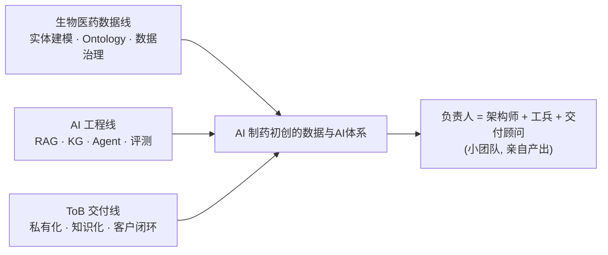

# 第十五章 · 案例研究：生物医药数据与 AI 体系负责人（AI 制药初创）

> 以一份真实的「数据与AI负责人（生物医药方向）」岗位描述为起点，结合一份截至 2026 年 9 月的生物医药数据与 AI 体系业界调研（覆盖复星医药、Genentech、AstraZeneca、Sanofi、Servier、晶泰科技、医渡科技等公开案例），重建一个「生物医药数据底座 + 知识图谱/Ontology + RAG/Agent + ToB 交付」的创业公司核心岗案例。

## 先说边界：本章做了匿名化处理

**本章对招聘方做了匿名化处理，统一使用艺名「青澜生物」。** 这不是对任何一家真实公司的描述文档，而是一个以真实 JD 为起点的能力建设案例。

这样做有两个原因：第一，岗位案例的价值在于方法论和判断框架的迁移，不在于背下某家公司的内部架构；第二，公开渠道能核验的信息（融资阶段、产品方向、团队背景的量级）与 JD 本身足以支撑案例重建，但不足以、也不应该写成对该公司的断言。

本章信息同样分三层。第一层是**公开可核验的业界事实**，来自业界调研报告与企业官方披露，例如 Genentech 的 gRED Research Agent、AstraZeneca 的 3DP 数据平台、Sanofi 的三支柱 AI 体系、Servier 的 TURING 知识平台、复星医药的 PharmAID 布局、FDA 2025 年 AI 草案与 EMA 反思文件。第二层是**用户提供的岗位描述**，即 JD 原文的六条职责与任职要求。第三层是基于前两层的**架构推演与面试作答方案**，统一标注为「建议方案」。

青澜生物的可核验画像只有一句话量级：天使轮阶段的 AI 制药初创，核心团队来自学术界与工业界 AI 背景，产品方向是生物医药垂直大模型与研发助手，同时面向自家管线和 ToB 客户输出能力。**天使轮 + 垂直大模型 + 工具/管线双轮**这三个约束条件，比任何具体细节都更影响岗位的真实形态——它们决定了这是一个「负责人也要亲自写代码、下客户现场」的一线岗，而不是大厂式的部门管理岗。

## 本章定位：一个「总装型」岗位

这个岗位处在三条线的交点上。第一条线是**生物医药数据线**：疾病、靶点、通路、组学、分子、结构、序列、专利、临床、文献、BD 交易——这些实体的建模、关联与治理，是 JD 的第一条职责，也是本章最重的领域知识块。第二条线是**AI 工程线**：LLM/Agent/RAG/知识图谱如何消费这些数据，对应第六、七章的主脊。第三条线是**ToB 交付线**：初创公司的数据底座不仅要服务自家模型，还是卖给客户的私有化产品的地基，这要求「可证明」而非「能演示」。

用一句话概括与大厂数据负责人的区别：**大厂负责人的产出是组织和平台，青澜负责人的产出是可以卖给客户的数据产品和自己能跑通的技术闭环。**

## 本章导读

- [15.0 一页速览：岗位本质、初创特殊性与准备重点](./00-一页速览.md)
- [15.1 岗位拆解与知识映射：从 JD 语言翻译成能力模型](./01-岗位拆解与知识映射.md)
- [15.2 生物医药数据与 AI 基础设施架构全景：蓝图、业界参照与初创裁剪](./02-生物医药数据与AI基础设施架构全景.md)
- [15.3 通用知识补缺与章节回链：把第六、七章的知识串成体系](./03-通用知识补缺与章节回链.md)
- [15.4 领域知识：生物医药研发数据实体、标准与 Ontology](./04-领域知识：生物医药研发数据实体标准与Ontology.md)
- [15.5 面试准备：初创 90 天计划、实战题、反问与尽调清单](./05-面试准备.md)

## 与前面章节的关联

本章不重复讲数据湖、RAG、知识图谱的基础原理，而是把它们按这个岗位的决策顺序重新编排，并补上一块全书未覆盖的领域知识（生物医药研发数据）。

- [6.8 大模型数据工程](../part6-bigdata/08-大模型数据工程.md)：多模态数据解析、质量过滤与去重，是生物医药垂直模型训练数据链路的底座；本章把「分子、蛋白、序列」作为新的模态接进来。
- [6.10 语义层与指标平台](../part6-bigdata/10-语义层与指标平台.md)：维度、口径、语义一致性的思想直接迁移到领域 Ontology 与受控术语。
- [6.14 数据质量](../part6-bigdata/14-数据质量.md)：数据契约、质量评分是本章「数据产品」的验收标准。
- [6.17 多租户与权限体系](../part6-bigdata/17-多租户与权限体系.md)：数据分级分类、行列级权限、审计，是 ToB 私有化交付的硬需求。
- [6.19 元数据管理与智能数据治理](../part6-bigdata/19-元数据管理与智能数据治理.md)：血缘、目录、AI 辅助元数据，对应 JD 的「Data Catalog、血缘追踪、Tagging」。
- [6.20 AI-Native 数仓与数仓智能体](../part6-bigdata/20-AI-Native数仓与数仓智能体.md)：AI 交互层、语义层、元数据层的企业级组合方式。
- [7.1 RAG 实战](../part7-ai-engineering/01-RAG实战.md)、[7.11 检索平台工程](../part7-ai-engineering/11-检索平台工程.md)：混合检索、Embedding 管道、语义缓存是「让 AI 可靠找到专业数据」的工程核心。
- [7.6 Agent 基础](../part7-ai-engineering/06-Agent基础.md)、[7.8 AgentBI 智能分析](../part7-ai-engineering/08-AgentBI智能分析.md)：工具调用、MCP、多 Agent 编排，对应 JD 的 Agent 体系与「supervisor + 专业子 Agent」的业界参照架构。
- [7.9 AI 安全与可信](../part7-ai-engineering/09-AI安全与可信.md)：提示词注入、数据投毒、PII 脱敏，是「防高敏信息被 Agent 不当使用」的技术底座。
- [7.10 GraphRAG 与知识图谱](../part7-ai-engineering/10-GraphRAG与知识图谱.md)：实体关系抽取、图检索，是生物医药知识层（靶点—疾病—证据链）的实现路径。
- [7.12 点富科技案例](../part7-ai-engineering/12-案例-点富科技大模型数据评测岗.md)：其中「如何对早期创业公司做尽调」的方法论，本章 15.5 直接复用并做生物医药行业适配。

## 业界参照系：七家公开案例

本章大量使用业界公开案例作为「参照答案」，避免把推断写成事实。核心参照如下，证据边界在各节内说明：

| 参照 | 已公开的核心事实 | 对本章的启示 |
|---|---|---|
| Genentech | gRED Research Agent 连接公共文献、单细胞数据与内部 API，多步骤研究 Agent | 多源证据检索与可追溯综合的价值 |
| AstraZeneca | 3DP 把源数据映射为 FAIR 数据产品；supervisor + 专业子 Agent；text-to-SQL + RAG | 数据产品先于 Agent；职责隔离优于堆数量 |
| Sanofi | Expert AI / Snackable AI / GenAI 三支柱；CMC 文档 AI 提效 | 按使用者与任务复杂度分配 AI 形态 |
| Servier | TURING 知识平台：领域模型 + 受控词汇 + RDF 图谱 | 结果值必须与实验上下文共存 |
| 复星医药 | PharmAID 中枢 + AquaVista 数据底座 + 分域智能体 | 「一个数据底座 + 分域智能体」的中国路线 |
| 晶泰科技 | AI + 自动化实验 + 标准化数据闭环 | 实验数据标准化回流是高价值资产 |
| 医渡科技 | AI 中台：知识中心、RAG、Agent、工作流编排 | 医疗场景能力不能不加验证地迁移到 GxP |

一句话说：这是一章面向「AI 制药初创数据负责人」的能力迁移案例。它以一份真实 JD 和一份业界调研为锚，训练的是一套可以迁移到任何「垂直领域数据 + 知识工程 + AI 平台 + ToB 交付」负责人岗位的判断框架——并且始终带着初创公司的资源约束思考。
