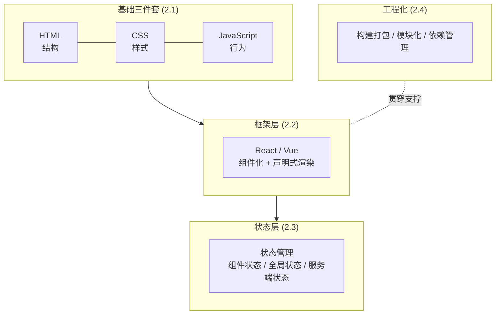

# 第二章 · 前端核心知识体系

> 第一章重装了你的思维。这一章开始填充具体的前端知识——但仍然是**后端视角**的填充：
> 不教你抠像素级 CSS，而是帮你建立「这套技术栈到底在解决什么问题、和我熟悉的东西怎么对应」的骨架认知。

---

## 这一章想给你什么

市面上的前端教程默认读者是白纸，从「什么是变量」讲起，对你是浪费时间。你需要的是一张**「前端技术地图」**：每个技术存在的理由、它在整个体系里的位置、以及它对应你后端世界里的什么东西。

填完这张地图，你再去查具体 API、问 AI 写组件，就有了「挂钩子的地方」——新知识不会悬空，而是挂在你已有的认知结构上。

---

## 前端技术全景

---

## 本章章节

### [2.1 HTML / CSS / JS 三件套：后端工程师的最小够用集](./01-三件套速成.md)
不求精通，只求「看得懂、改得动、能问对问题」。用后端类比快速建立三件套的分工认知。

### [2.2 现代前端框架：React / Vue 的组件化与声明式渲染](./02-现代框架.md)
为什么前端要用框架？组件化解决了什么？声明式渲染的 `UI = f(state)` 在代码里长什么样。

### [2.3 前端状态管理：从混乱的全局变量到可预测的状态流](./03-状态管理.md)
状态分层、何时该上状态库、服务端状态为什么要单独管。承接 [1.2 从无状态到有状态](../part1-mindset-shift/02-从无状态到有状态.md)。

### [2.4 前端工程化：构建、打包、模块化](./04-工程化.md)
你熟悉的 Maven / Gradle 在前端长什么样？npm、打包器、模块系统的对应关系。

---

## 一句话总览

| 前端层次 | 解决什么问题 | 后端类比 |
|---------|------------|---------|
| HTML | 内容的结构 | 数据的 schema |
| CSS | 内容的呈现 | （后端几乎没有对应物） |
| JavaScript | 内容的行为/交互 | 业务逻辑 |
| 框架 | 组件复用 + 状态到界面的自动同步 | Spring 之于裸 Servlet |
| 状态管理 | 驯服散落各处的内存状态 | 缓存 + 上下文管理 |
| 工程化 | 把源码变成能跑的产物 | Maven 构建 + 打包 |

读完这一章，你不会成为 CSS 大师，但你会**看得懂任何一个前端项目的整体结构**，知道每个文件夹、每个配置在干什么——这正是你接下来用 AI 高效写前端的地基。

---

[← 返回全书地图](../README.md) | [上一章：第一章 思维转变](../part1-mindset-shift/README.md) | [下一章：2.1 三件套速成 →](./01-三件套速成.md)
