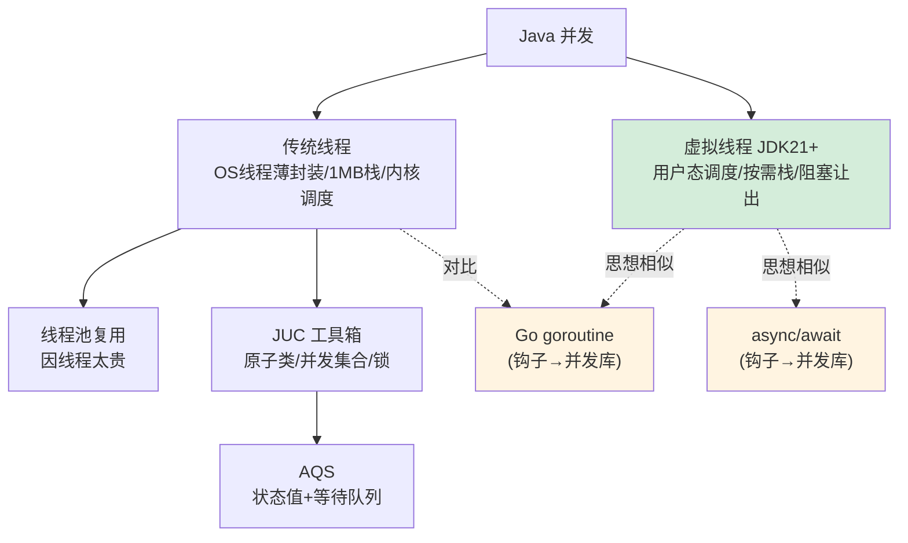

# 3.1 Java 并发体系：从线程到虚拟线程

> 这是你后面对比所有语言并发模型的**基准线**。
> 在批判 Go 协程「轻」、Rust async「无栈」、Node「单线程」之前，先把 Java 自己的并发模型彻底讲透。

---

## 一、线程的本质：OS 线程的薄封装

Java 的 `Thread`，在 JDK 21 之前，**本质是操作系统线程（内核线程）的一层薄封装**。这一句话是理解后面一切的钥匙。

```java
Thread t = new Thread(() -> System.out.println("我是一个线程"));
t.start();   // 这里真的会向 OS 申请创建一个内核线程
```

这意味着 Java 线程有 OS 线程的全部「重量」：

- **创建成本高**：每个线程默认占用约 **1MB 栈内存**，创建需要系统调用。
- **数量有限**：几千个线程就会吃光内存、压垮调度器。所以你不能「一个请求一个线程」无限开。
- **调度由 OS 负责**：线程切换是**内核态的上下文切换**，有可观的开销（保存/恢复寄存器、刷 TLB 等）。
- **阻塞即浪费**：线程调一个阻塞 IO（如读数据库），它就被挂起，**占着 1MB 内存啥也不干**，干等结果。

> 记住这个「1MB 栈 + 内核调度 + 阻塞即浪费」的画像。第四章你会看到 [Go 的 goroutine](../concurrency-models/go-goroutine-csp.md) 用几 KB 的栈、用户态调度，把这三条全改写了——而这正是 Go「高并发轻量」的根源。

---

## 二、线程池：因为线程太贵，所以要复用

正因为线程这么贵，Java 的标准实践是**用线程池复用线程**，而不是用完即抛。这就像数据库连接池——连接太贵，所以池化复用。

```java
// 创建一个固定大小的线程池，复用 10 个线程处理大量任务
ExecutorService pool = Executors.newFixedThreadPool(10);

for (int i = 0; i < 1000; i++) {
    pool.submit(() -> {
        // 1000 个任务，但只用 10 个线程轮流跑，不会创建 1000 个线程
        doWork();
    });
}
pool.shutdown();
```

线程池的核心参数（`ThreadPoolExecutor`），每一个都体现「线程是稀缺资源」的设计哲学：

| 参数 | 含义 | 体现的权衡 |
|------|------|-----------|
| `corePoolSize` | 核心线程数 | 常驻的复用线程 |
| `maximumPoolSize` | 最大线程数 | 上限，防止线程爆炸 |
| `workQueue` | 任务队列 | 线程不够时任务排队等待 |
| `RejectedExecutionHandler` | 拒绝策略 | 队列也满了怎么办（兜底） |

**线程池的存在，本身就是「OS 线程太贵」这个约束的产物。** 记住这一点——第四章你会看到 Go 不需要线程池（协程足够便宜，随便开），这个差异背后正是并发模型的根本不同。

---

## 三、JUC：`java.util.concurrent` 工具箱

裸用 `synchronized` 和 `wait/notify` 写并发又难又易错。Java 5 引入了 **JUC（`java.util.concurrent`）** 工具包，提供了一整套高质量的并发原语。你日常会用到：

```java
// 1. 原子类：无锁的线程安全计数
AtomicInteger counter = new AtomicInteger(0);
counter.incrementAndGet();   // 底层用 CAS，比 synchronized 快

// 2. 并发集合：线程安全的容器
ConcurrentHashMap<String, Integer> map = new ConcurrentHashMap<>();
map.put("k", 1);

// 3. 显式锁：比 synchronized 更灵活（可中断、可超时、可读写分离）
ReentrantLock lock = new ReentrantLock();
lock.lock();
try {
    // 临界区
} finally {
    lock.unlock();   // 必须手动解锁，所以放 finally
}

// 4. 协调工具：让多个线程协同
CountDownLatch latch = new CountDownLatch(3);   // 等 3 个任务都完成
```

这些工具的价值在于：**把容易写错的底层同步逻辑封装成经过验证的高质量组件**——这和你「用现成的工具类而非手搓底层」的工程直觉一致。

---

## 四、AQS：JUC 背后的「同步器框架」

往深一层，JUC 里的 `ReentrantLock`、`Semaphore`、`CountDownLatch` 等，**底层都基于同一个框架——AQS（AbstractQueuedSynchronizer，抽象队列同步器）**。理解 AQS，就理解了 Java 锁的半壁江山。

AQS 的核心思想可以用两句话概括：

1. **一个 volatile 的 int 状态值**（`state`），表示「同步状态」（如锁被持有几次、信号量剩多少）。
2. **一个 FIFO 等待队列**，抢不到资源的线程在这里排队（被 park 挂起），资源释放时按序唤醒。

```
            state（同步状态，volatile int）
              │
   ┌──────────┴──────────┐
   │  抢到 state 的线程    │  ← 持有资源，执行临界区
   └─────────────────────┘
              │ 抢不到的线程进入等待队列
              ▼
   [线程A] → [线程B] → [线程C]   ← FIFO 队列，依次被唤醒
   (park)    (park)    (park)
```

不同的同步器只是对「如何获取/释放 state」给出不同定义：

- `ReentrantLock`：state 表示重入次数，0 = 没人持有。
- `Semaphore`：state 表示剩余许可数。
- `CountDownLatch`：state 表示还没完成的计数，到 0 就放行所有等待者。

> 你**不需要手写 AQS**，但理解它能让你看懂锁的本质：**所有这些同步工具，都是「一个状态值 + 一个等待队列」的不同包装。** 这个「状态 + 队列」的抽象，在 [Rust 的 async 运行时](../concurrency-models/rust-async-tokio.md) 里会以另一种形态再次出现（任务排队 + waker 唤醒），届时你会发现并发的底层思想是相通的。

---

## 五、虚拟线程（Project Loom）：游戏规则改变者

JDK 21（2023 年正式发布）带来了 Java 并发史上最重大的变化——**虚拟线程（Virtual Threads）**，源自 Project Loom。它直接挑战了开篇说的「线程太贵」这个前提。

**虚拟线程不是 OS 线程的薄封装，而是 JVM 在用户态调度的「轻量级线程」**：

```java
// JDK 21+：创建虚拟线程，几乎零成本
Thread.startVirtualThread(() -> {
    // 这里可以放心地写"阻塞式"代码，比如同步读数据库
    var result = jdbcQuery();   // 阻塞时，虚拟线程会"让出"底层 OS 线程
});

// 甚至可以这样：一口气开一百万个虚拟线程，内存毫无压力
try (var executor = Executors.newVirtualThreadPerTaskExecutor()) {
    for (int i = 0; i < 1_000_000; i++) {
        executor.submit(() -> { doWork(); });
    }
}
```

虚拟线程的关键机制：

- **极轻量**：栈是按需增长的（几百字节起），不是固定 1MB。开几百万个都行。
- **用户态调度**：JVM 把大量虚拟线程「挂载」到少量 OS 线程（称为 carrier thread）上调度。
- **阻塞时自动让出**：当虚拟线程执行阻塞 IO 时，JVM 把它**从 OS 线程上卸载**，让 OS 线程去跑别的虚拟线程。等 IO 完成再恢复。**阻塞不再浪费 OS 线程。**

这一下子让 Java 用「同步阻塞」的简单写法，达到了过去要靠复杂异步代码才能达到的高并发——**「写起来像阻塞，跑起来像异步」**。

> 这是巨大的伏笔：虚拟线程的「用户态调度 + 阻塞自动让出」，思想上与 [Go 的 goroutine](../concurrency-models/go-goroutine-csp.md) 高度相似，也与各种 [async/await](../concurrency-models/nodejs-eventloop.md) 殊途同归。**Java 用虚拟线程「补上」了它在轻量并发上的短板。** 第四章 [高并发 HTTP 服务对比](../part4-multilang-compare/01-高并发HTTP服务对比.md) 会把虚拟线程版 Java 和 Go、Rust、Node 放在一起实测对比。

---

## 六、Java 并发模型全景与「钩子」



**埋给第四章的钩子**：

- 「线程太贵」→ 对比 [Go goroutine](../concurrency-models/go-goroutine-csp.md) 的几 KB 栈与 CSP 模型。
- 「虚拟线程用户态调度」→ 对比 [Rust Tokio](../concurrency-models/rust-async-tokio.md) 的无栈协程与 [Node 事件循环](../concurrency-models/nodejs-eventloop.md)。
- 「JUC/锁」→ 对比 Go「不要用共享内存通信，用通信共享内存」的哲学差异。

---

## 本章小结

- JDK 21 之前，Java 线程 = **OS 线程的薄封装**：1MB 栈、内核调度、阻塞即浪费。这是「线程太贵」的根源。
- 因为线程贵，所以有**线程池**（复用）和 **JUC**（高质量并发工具），JUC 的锁底层是 **AQS**（状态值 + 等待队列）。
- JDK 21 的**虚拟线程**改变游戏规则：用户态调度、按需栈、阻塞自动让出，让「同步写法」达到「异步并发」的效果。
- 这套 Java 并发模型，是你第四章丈量 Go/Rust/Node/Python 并发的**基准尺**。

---

[← 返回第三章导读](./README.md) | [下一节：3.2 内存模型 JMM →](./02-内存模型JMM.md)
