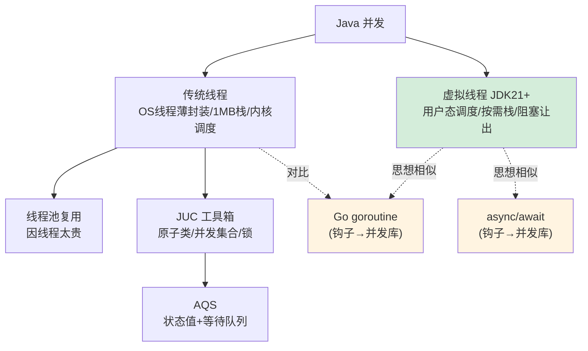

# 3.1 Java 并发体系：从线程到虚拟线程

> 这是你后面对比所有语言并发模型的**基准线**。
> 在批判 Go 协程「轻」、Rust async「无栈」、Node「单线程」之前，先把 Java 自己的并发模型彻底讲透。

---

## 一、线程的本质：OS 线程的薄封装

Java 的 `Thread`，在 JDK 21 之前，**本质是操作系统线程（内核线程）的一层薄封装**。这一句话是理解后面一切的钥匙。

```java
Thread t = new Thread(() -> System.out.println("我是一个线程"));
t.start();   // 这里真的会向 OS 申请创建一个内核线程
```

这意味着 Java 线程有 OS 线程的全部「重量」：

- **创建成本高**：每个线程默认占用约 **1MB 栈内存**，创建需要系统调用。
- **数量有限**：几千个线程就会吃光内存、压垮调度器。所以你不能「一个请求一个线程」无限开。
- **调度由 OS 负责**：线程切换是**内核态的上下文切换**，有可观的开销（保存/恢复寄存器、刷 TLB 等）。
- **阻塞即浪费**：线程调一个阻塞 IO（如读数据库），它就被挂起，**占着 1MB 内存啥也不干**，干等结果。

> 记住这个「1MB 栈 + 内核调度 + 阻塞即浪费」的画像。第四章你会看到 [Go 的 goroutine](../concurrency-models/go-goroutine-csp.md) 用几 KB 的栈、用户态调度，把这三条全改写了——而这正是 Go「高并发轻量」的根源。

---

## 二、线程池：因为线程太贵，所以要复用

正因为线程这么贵，Java 的标准实践是**用线程池复用线程**，而不是用完即抛。这就像数据库连接池——连接太贵，所以池化复用。

```java
// 创建一个固定大小的线程池，复用 10 个线程处理大量任务
ExecutorService pool = Executors.newFixedThreadPool(10);

for (int i = 0; i < 1000; i++) {
    pool.submit(() -> {
        // 1000 个任务，但只用 10 个线程轮流跑，不会创建 1000 个线程
        doWork();
    });
}
pool.shutdown();
```

线程池的核心参数（`ThreadPoolExecutor`），每一个都体现「线程是稀缺资源」的设计哲学：

| 参数 | 含义 | 体现的权衡 |
|------|------|-----------|
| `corePoolSize` | 核心线程数 | 常驻的复用线程 |
| `maximumPoolSize` | 最大线程数 | 上限，防止线程爆炸 |
| `workQueue` | 任务队列 | 线程不够时任务排队等待 |
| `RejectedExecutionHandler` | 拒绝策略 | 队列也满了怎么办（兜底） |

**线程池的存在，本身就是「OS 线程太贵」这个约束的产物。** 记住这一点——第四章你会看到 Go 不需要线程池（协程足够便宜，随便开），这个差异背后正是并发模型的根本不同。

---

## 三、JUC：`java.util.concurrent` 工具箱

裸用 `synchronized` 和 `wait/notify` 写并发又难又易错。Java 5 引入了 **JUC（`java.util.concurrent`）** 工具包，提供了一整套高质量的并发原语。你日常会用到：

```java
// 1. 原子类：无锁的线程安全计数
AtomicInteger counter = new AtomicInteger(0);
counter.incrementAndGet();   // 底层用 CAS，比 synchronized 快

// 2. 并发集合：线程安全的容器
ConcurrentHashMap<String, Integer> map = new ConcurrentHashMap<>();
map.put("k", 1);

// 3. 显式锁：比 synchronized 更灵活（可中断、可超时、可读写分离）
ReentrantLock lock = new ReentrantLock();
lock.lock();
try {
    // 临界区
} finally {
    lock.unlock();   // 必须手动解锁，所以放 finally
}

// 4. 协调工具：让多个线程协同
CountDownLatch latch = new CountDownLatch(3);   // 等 3 个任务都完成
```

这些工具的价值在于：**把容易写错的底层同步逻辑封装成经过验证的高质量组件**——这和你「用现成的工具类而非手搓底层」的工程直觉一致。

---

## 四、AQS：JUC 背后的「同步器框架」

往深一层，JUC 里的 `ReentrantLock`、`Semaphore`、`CountDownLatch` 等，**底层都基于同一个框架——AQS（AbstractQueuedSynchronizer，抽象队列同步器）**。理解 AQS，就理解了 Java 锁的半壁江山。

AQS 的核心思想可以用两句话概括：

1. **一个 volatile 的 int 状态值**（`state`），表示「同步状态」（如锁被持有几次、信号量剩多少）。
2. **一个 FIFO 等待队列**，抢不到资源的线程在这里排队（被 park 挂起），资源释放时按序唤醒。

```
            state（同步状态，volatile int）
              │
   ┌──────────┴──────────┐
   │  抢到 state 的线程    │  ← 持有资源，执行临界区
   └─────────────────────┘
              │ 抢不到的线程进入等待队列
              ▼
   [线程A] → [线程B] → [线程C]   ← FIFO 队列，依次被唤醒
   (park)    (park)    (park)
```

不同的同步器只是对「如何获取/释放 state」给出不同定义：

- `ReentrantLock`：state 表示重入次数，0 = 没人持有。
- `Semaphore`：state 表示剩余许可数。
- `CountDownLatch`：state 表示还没完成的计数，到 0 就放行所有等待者。

> 你**不需要手写 AQS**，但理解它能让你看懂锁的本质：**所有这些同步工具，都是「一个状态值 + 一个等待队列」的不同包装。** 这个「状态 + 队列」的抽象，在 [Rust 的 async 运行时](../concurrency-models/rust-async-tokio.md) 里会以另一种形态再次出现（任务排队 + waker 唤醒），届时你会发现并发的底层思想是相通的。

---

## 五、虚拟线程（Project Loom）：游戏规则改变者

JDK 21（2023 年正式发布）带来了 Java 并发史上最重大的变化——**虚拟线程（Virtual Threads）**，源自 Project Loom。它直接挑战了开篇说的「线程太贵」这个前提。

**虚拟线程不是 OS 线程的薄封装，而是 JVM 在用户态调度的「轻量级线程」**：

```java
// JDK 21+：创建虚拟线程，几乎零成本
Thread.startVirtualThread(() -> {
    // 这里可以放心地写"阻塞式"代码，比如同步读数据库
    var result = jdbcQuery();   // 阻塞时，虚拟线程会"让出"底层 OS 线程
});

// 甚至可以这样：一口气开一百万个虚拟线程，内存毫无压力
try (var executor = Executors.newVirtualThreadPerTaskExecutor()) {
    for (int i = 0; i < 1_000_000; i++) {
        executor.submit(() -> { doWork(); });
    }
}
```

虚拟线程的关键机制：

- **极轻量**：栈是按需增长的（几百字节起），不是固定 1MB。开几百万个都行。
- **用户态调度**：JVM 把大量虚拟线程「挂载」到少量 OS 线程（称为 carrier thread）上调度。
- **阻塞时自动让出**：当虚拟线程执行阻塞 IO 时，JVM 把它**从 OS 线程上卸载**，让 OS 线程去跑别的虚拟线程。等 IO 完成再恢复。**阻塞不再浪费 OS 线程。**

这一下子让 Java 用「同步阻塞」的简单写法，达到了过去要靠复杂异步代码才能达到的高并发——**「写起来像阻塞，跑起来像异步」**。

> 这是巨大的伏笔：虚拟线程的「用户态调度 + 阻塞自动让出」，思想上与 [Go 的 goroutine](../concurrency-models/go-goroutine-csp.md) 高度相似，也与各种 [async/await](../concurrency-models/nodejs-eventloop.md) 殊途同归。**Java 用虚拟线程「补上」了它在轻量并发上的短板。** 第四章 [高并发 HTTP 服务对比](../part4-multilang-compare/01-高并发HTTP服务对比.md) 会把虚拟线程版 Java 和 Go、Rust、Node 放在一起实测对比。

---

## 六、Java 并发模型全景与「钩子」



**埋给第四章的钩子**：

- 「线程太贵」→ 对比 [Go goroutine](../concurrency-models/go-goroutine-csp.md) 的几 KB 栈与 CSP 模型。
- 「虚拟线程用户态调度」→ 对比 [Rust Tokio](../concurrency-models/rust-async-tokio.md) 的无栈协程与 [Node 事件循环](../concurrency-models/nodejs-eventloop.md)。
- 「JUC/锁」→ 对比 Go「不要用共享内存通信，用通信共享内存」的哲学差异。

---

## 七、面试深度剖析：大厂高频考点

> 上面是「原理筑基」，这一节是「面试实战」。并发是大厂 Java 面试**命中率最高**的板块，几乎逢面必考。下面按面试官真实的「层层追问链」组织，每个考点给出**追问路径 + 标准答法要点 + 常见陷阱**。

### 考点 1：线程池的核心参数与执行流程（必考）

**面试官开场**：「说说线程池的几个核心参数，以及一个任务提交进来的完整执行流程。」

`ThreadPoolExecutor` 七个参数：`corePoolSize`、`maximumPoolSize`、`keepAliveTime`、`unit`、`workQueue`、`threadFactory`、`handler`（拒绝策略）。

**任务提交的执行流程**（这是高频追问，必须背熟顺序）：

```
提交任务
   │
   ├─ 1. 当前线程数 < corePoolSize?  ──是──> 创建核心线程执行
   │                                  否
   ├─ 2. 工作队列 workQueue 未满?     ──是──> 入队等待
   │                                  否
   ├─ 3. 当前线程数 < maximumPoolSize? ─是──> 创建非核心线程（"救急"）执行
   │                                  否
   └─ 4. 执行拒绝策略 handler
```

> **陷阱**：很多人答成「先开到 max 再入队」，错！正确顺序是 **核心线程 → 队列 → 非核心线程 → 拒绝**。队列优先于「开到最大线程数」。

**追问：四种内置拒绝策略？**

| 策略 | 行为 | 适用 |
|------|------|------|
| `AbortPolicy`（默认） | 抛 `RejectedExecutionException` | 要求严格、不能丢任务 |
| `CallerRunsPolicy` | 由提交任务的线程自己执行 | 削峰、不丢任务、能反压 |
| `DiscardPolicy` | 静默丢弃新任务 | 可容忍丢失 |
| `DiscardOldestPolicy` | 丢弃队列最老的任务，再尝试提交 | 只关心最新数据 |

**追问：为什么阿里规约禁止用 `Executors` 工厂方法创建线程池？**

- `Executors.newFixedThreadPool` / `newSingleThreadExecutor` 用的是**无界队列 `LinkedBlockingQueue`**（容量 `Integer.MAX_VALUE`），任务堆积会 **OOM**。
- `Executors.newCachedThreadPool` / `newScheduledThreadPool` 的 `maximumPoolSize` 是 `Integer.MAX_VALUE`，可能**创建海量线程**导致 OOM。
- 正解：**手动 `new ThreadPoolExecutor`**，显式指定有界队列和合理的 max。

### 考点 2：线程池参数怎么调（数据/IO vs CPU）

**面试官**：「线程数设多少合适？」

- **CPU 密集型**（大量计算、少 IO）：线程数 ≈ **CPU 核数 + 1**。线程太多只会增加上下文切换开销。
- **IO 密集型**（数据库、RPC、文件——你做数据研发最常见的场景）：线程数可以远大于核数，经验公式 **线程数 ≈ 核数 × (1 + 平均等待时间/平均计算时间)**。IO 等待时线程被挂起，可以多开。

> **加分项**：提到「**这正是虚拟线程要解决的问题**」——传统线程池要为 IO 密集精心调参，[虚拟线程](../concurrency-models/java-thread-and-virtual-thread.md)（第五节）让你直接「一任务一虚拟线程」，不用算这个公式。这能体现你知识的纵深。

### 考点 3：synchronized 的锁升级（重量级追问）

**面试官**：「`synchronized` 底层怎么实现的？锁升级过程说一下。」

`synchronized` 基于对象头里的 **Mark Word** 和 **Monitor（管程）** 实现。JDK 6 之后引入**锁升级**优化，避免一上来就用昂贵的操作系统互斥量：

```
无锁 ──> 偏向锁 ──> 轻量级锁 ──> 重量级锁
        (一个线程     (多线程交替，    (多线程激烈竞争，
         反复进)      CAS自旋)        升级为OS互斥量,
                                     未抢到的线程阻塞)
        ←──────── 不可逆（基本不降级）────────
```

- **偏向锁**：只有一个线程访问时，在 Mark Word 记录线程 ID，下次进入无需 CAS。（注：JDK 15 起偏向锁被默认禁用/废弃，面试可点出这个新动向作为加分。）
- **轻量级锁**：多线程交替执行（无实际竞争），用 **CAS** 尝试获取，失败则自旋。
- **重量级锁**：竞争激烈，自旋无果，膨胀为操作系统级互斥量，抢不到的线程进入阻塞（涉及内核态切换，最贵）。

**追问：`synchronized` 和 `ReentrantLock` 的区别？**

| 维度 | synchronized | ReentrantLock |
|------|-------------|---------------|
| 层面 | JVM 关键字（隐式） | JUC 类库（显式 lock/unlock） |
| 加解锁 | 自动 | **手动**，必须 finally 解锁 |
| 公平性 | 仅非公平 | 可选公平/非公平 |
| 可中断 | 不可 | 可（`lockInterruptibly`） |
| 超时获取 | 不可 | 可（`tryLock(timeout)`） |
| 条件变量 | 一个（wait/notify） | 多个 `Condition`（精准唤醒） |

### 考点 4：CAS 与 ABA 问题（原子类必问）

**面试官**：「`AtomicInteger` 怎么实现无锁线程安全？CAS 有什么问题？」

- **CAS（Compare-And-Swap）**：比较内存值与预期值，相等才更新，是一条 **CPU 原子指令**（`cmpxchg`）。`AtomicInteger.incrementAndGet` 就是「读旧值 → CAS 写新值 → 失败则自旋重试」。
- CAS 的三个问题：
  1. **ABA 问题**：值从 A→B→A，CAS 以为没变过。解法：加**版本号**，用 `AtomicStampedReference`。
  2. **自旋开销**：竞争激烈时长时间自旋空耗 CPU。
  3. **只能保证一个变量原子**：多个变量要保证原子，得用锁或封装成对象用 `AtomicReference`。

> **关联**：CAS 是 [AQS](#四aqsjuc-背后的同步器框架)（第四节）和整个 JUC 无锁化的基石，也是 [JMM](./02-内存模型JMM.md) 里 volatile 配合使用的典型场景。

### 考点 5：ThreadLocal 原理与内存泄漏（高频深挖）

**面试官**：「`ThreadLocal` 怎么实现线程隔离？为什么会内存泄漏？」

- 每个 `Thread` 内部有一个 `ThreadLocalMap`，**key 是 ThreadLocal 对象（弱引用），value 是你存的值（强引用）**。所以数据存在线程自己身上，天然隔离。
- **内存泄漏链**：key 是弱引用，GC 后 key 变 `null`，但 **value 仍被 ThreadLocalMap 强引用**。如果线程是**线程池里复用的长生命周期线程**，这个 value 永远不被回收 → 泄漏。
- **解法**：**用完一定 `remove()`**（放 finally）。这是面试和实战的核心结论。

> **陷阱**：必答「为什么 key 用弱引用」——正是为了在你忘记 remove 时，至少 key 能被回收，减轻泄漏。但 value 的泄漏还得靠你 remove。

### 考点 6：手写/分析死锁

**面试官**：「死锁的四个必要条件？怎么避免？」

四个必要条件（缺一不可）：**互斥、持有并等待、不可剥夺、循环等待**。

避免（破坏任一条件即可）：

- **破坏循环等待**（最常用）：所有线程**按固定全局顺序加锁**（如按对象 hash/id 排序）。
- 用 `tryLock(timeout)` 设置超时，拿不到就释放已有锁重试（破坏「持有并等待」）。
- 排查工具：`jstack` 打印线程栈会直接标出 `Found one Java-level deadlock`。

### 考点 7：ConcurrentHashMap 的演进（数据工程师常被问）

**面试官**：「`ConcurrentHashMap` 怎么做到线程安全又高性能？JDK 7 和 8 有什么不同？」

- **JDK 7**：**分段锁（Segment）**，把数据分成多段，每段一把锁，不同段可并发写。并发度 = 段数。
- **JDK 8**：放弃分段锁，改用 **`synchronized` 锁单个桶（链表/红黑树的头节点）+ CAS**。锁粒度更细（锁到桶级别），并发度更高；并引入红黑树优化长链表。
- **追问：为什么 ConcurrentHashMap 不允许 null key/value？** 因为多线程下 `get` 返回 null 有歧义（无法区分「键不存在」还是「值就是 null」），而单线程的 HashMap 可以靠 `containsKey` 二次确认，并发场景无法保证这两步的原子性。

---

## 本章小结

- JDK 21 之前，Java 线程 = **OS 线程的薄封装**：1MB 栈、内核调度、阻塞即浪费。这是「线程太贵」的根源。
- 因为线程贵，所以有**线程池**（复用）和 **JUC**（高质量并发工具），JUC 的锁底层是 **AQS**（状态值 + 等待队列）。
- JDK 21 的**虚拟线程**改变游戏规则：用户态调度、按需栈、阻塞自动让出，让「同步写法」达到「异步并发」的效果。
- 这套 Java 并发模型，是你第四章丈量 Go/Rust/Node/Python 并发的**基准尺**。

---

[← 返回第三章导读](./README.md) | [下一节：3.2 内存模型 JMM →](./02-内存模型JMM.md)
