# 3.1 Java 并发体系：从线程到虚拟线程

> 这是你后面对比所有语言并发模型的**基准线**。
> 在批判 Go 协程「轻」、Rust async「无栈」、Node「单线程」之前，先把 Java 自己的并发模型彻底讲透。

---

## 一、线程的本质：OS 线程的薄封装

Java 的 `Thread`，在 JDK 21 之前，**本质是操作系统线程（内核线程）的一层薄封装**。这一句话是理解后面一切的钥匙。

```java
Thread t = new Thread(() -> System.out.println("我是一个线程"));
t.start();   // 这里真的会向 OS 申请创建一个内核线程
```

这意味着 Java 线程有 OS 线程的全部「重量」：

- **创建成本高**：每个线程默认占用约 **1MB 栈内存**，创建需要系统调用。
- **数量有限**：几千个线程就会吃光内存、压垮调度器。所以你不能「一个请求一个线程」无限开。
- **调度由 OS 负责**：线程切换是**内核态的上下文切换**，有可观的开销（保存/恢复寄存器、刷 TLB 等）。
- **阻塞即浪费**：线程调一个阻塞 IO（如读数据库），它就被挂起，**占着 1MB 内存啥也不干**，干等结果。

> 记住这个「1MB 栈 + 内核调度 + 阻塞即浪费」的画像。第四章你会看到 [Go 的 goroutine](../concurrency-models/go-goroutine-csp.md) 用几 KB 的栈、用户态调度，把这三条全改写了——而这正是 Go「高并发轻量」的根源。

下面三个小节，把这个画像里最关键、也最常被「会用说不清」的三件事彻底拆开：**内核线程到底是什么、线程切换时内核具体做了什么、以及为什么那 1MB 栈是固定的而不能动态增长。**

---

## 一·补 A、内核线程（Kernel Thread）到底是什么

「线程是操作系统调度的最小单位」——这句话人人会背，但内核线程具体「是什么」？

**内核线程不是一段代码，而是内核里的一组「数据结构 + 状态」。** 在 Linux 上，每个线程对应内核里一个 `task_struct`（任务描述符），它记录了这个执行流的全部身份与现场：

- **线程 ID（TID）** 与所属进程（同一进程的多个线程共享地址空间、文件描述符表、信号处理表）。
- **调度信息**：优先级、调度类（CFS/实时）、累计运行时间、所在 CPU 运行队列。
- **上下文（Context）**：被切走时要保存的 CPU 寄存器快照（通用寄存器、程序计数器 PC、栈指针 SP、状态寄存器等）。
- **两个栈**：**用户栈**（跑你的 Java/应用代码）和**内核栈**（陷入内核态执行系统调用时用的栈）。
- **内存映射**：指向页表的指针（同进程线程共享同一套页表）。

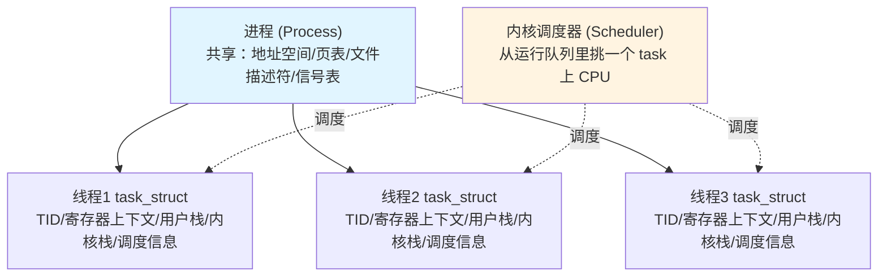

> **补充：页表（Page Table）是什么？** 程序里用的地址都是**虚拟地址**，而内存条上的是**物理地址**，两者并不直接相等——中间靠「页表」来翻译。操作系统把内存切成固定大小的**页**（page，通常 4KB），页表就是一张「虚拟页号 → 物理页框号」的**映射表**，由内核为每个进程维护、存在物理内存里。CPU 每次访存（取指令、读写变量）都要先经页表把虚拟地址翻译成物理地址，这一步叫**地址翻译**；现代 CPU 用专门的硬件 MMU 来做，并把最近用过的翻译结果缓存在 **TLB** 里加速（详见 [下一节上下文切换的「刷 TLB」](#一补-b上下文切换内核切线程时究竟做了什么)）。
>
> 关键在于：**页表是「进程级」资源，同一进程的所有线程共享同一套页表**（也就是共享同一个虚拟地址空间）——所以线程之间能直接读写彼此的对象、共享堆内存，这正是「多线程通信廉价、但要小心数据竞争」的根源。`task_struct` 里存的只是「指向这套页表的指针」，同进程的线程这个指针指向同一处。

关键认知：**线程之间共享的是进程级资源（地址空间、页表、fd 表），各自独占的是「执行现场」（寄存器上下文 + 两个栈 + 调度状态）。** 创建线程就是 `clone()` 出一个新 `task_struct` 并挂进调度队列；这是一次系统调用，要陷入内核、分配内核数据结构和栈——这就是「创建成本高」的来源。

> 「用户线程 vs 内核线程」的映射关系也由此而来：JDK 21 之前的 Java 是 **1:1 模型**（一个 Java 线程 = 一个内核线程，调度全交给 OS）；而 [Go 的 goroutine](../concurrency-models/go-goroutine-csp.md) 和 Java 虚拟线程是 **M:N 模型**（大量用户态线程复用少量内核线程）。这是后面所有并发模型对比的总纲。

---

## 一·补 B、上下文切换：内核切线程时究竟做了什么

「线程切换有开销」也是背熟的结论，但开销具体花在哪？把一次**上下文切换（Context Switch）**拆成动作序列：

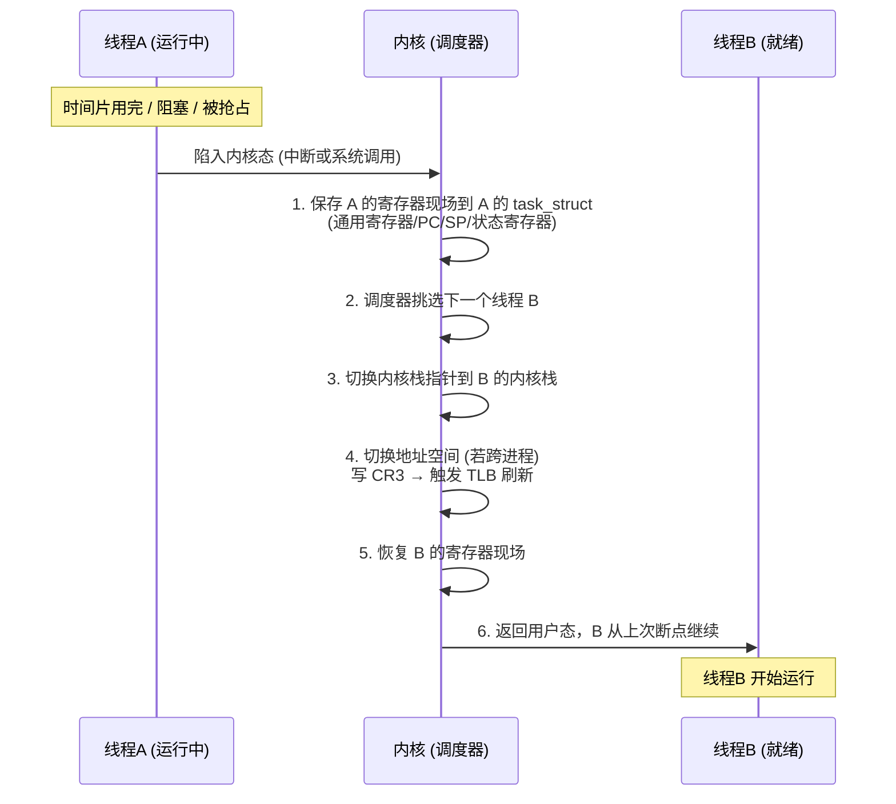

每一步的成本拆解：

- **保存/恢复寄存器**：CPU 的寄存器（在 x86-64 上是 RAX~R15、RIP/程序计数器、RSP/栈指针、RFLAGS 等）是线程的「现场」。切走 A 时必须把这些值原样存进 A 的 `task_struct`，否则 A 再次被调度时不知道「上次执行到哪、变量在哪」。切回 B 时再把 B 之前存的值灌回寄存器。这一步是纯 CPU 拷贝，本身不算太贵。
- **刷 TLB（Translation Lookaside Buffer）**：这才是**跨进程切换的大头开销**。CPU 把「虚拟地址 → 物理地址」的页表查询结果缓存在 TLB 里加速访存。**当切换到不同进程（地址空间变了）时，旧进程的 TLB 缓存全部失效**，写新页表基址寄存器（x86 的 `CR3`）会触发 TLB 刷新（flush）。切换后新线程的头几百上千次访存都要重新「走页表」（page table walk）填充 TLB，**这段冷启动期访存变慢**。
  - 优化：现代 CPU 用 **PCID/ASID（地址空间标识）**给 TLB 条目打进程标签，切回老进程时不必全刷，减轻这个代价。
  - 注意：**同一进程内的线程切换不刷 TLB**（地址空间相同，CR3 不变），所以线程切换比进程切换便宜——这也是「多线程比多进程轻」的硬件层原因之一。
- **缓存污染（隐性开销）**：切换后新线程的代码/数据不在 CPU 的 L1/L2 缓存里，会有一波 cache miss。这部分不直接计入切换耗时，但实实在在拖慢了切换后的执行。
- **调度决策**：调度器遍历运行队列挑下一个线程，也有 CPU 开销。

> 一次上下文切换的直接成本通常在**几百纳秒到几微秒**量级，看似不大，但在「一请求一线程、几万并发」的场景下，CPU 大量时间耗在「切来切去」而非干活上——这就是 [Go](../concurrency-models/go-goroutine-csp.md) 和虚拟线程要把调度搬到**用户态**的根本动机：用户态切换不陷入内核、不刷 TLB、只换很少的寄存器，开销低一个数量级。

---

<a id="阻塞挂起与内核唤醒"></a>

## 一·补 D、「阻塞」「挂起」「内核唤醒」到底是什么

后文反复出现「阻塞」「挂起」「让出 CPU，靠内核唤醒」这类说法（比如[锁分类表](#三补-c锁的类型与实现)里区分自旋锁和阻塞锁）。这几个词常被混用，但层次不同，先一次性厘清。

### 1. 什么是「内核（Kernel）」

**内核是操作系统最核心的那层程序**，它独占地管着 CPU、内存、设备这些硬件资源，是唯一能直接操作硬件、执行特权指令的代码。普通程序（包括 JVM、你的 Java 代码）跑在**用户态（user mode）**，权限受限；当它要做「分配内存、读写磁盘、创建线程、让出 CPU」这类只有内核能干的事时，必须通过**系统调用（system call）**「陷入内核态（kernel mode）」，把控制权交给内核来执行，干完再返回用户态。

> 形象点说：内核就像大楼的**总物业 + 调度中心**。每个房客（线程）想用公共资源（电梯、水电、车位），都得向物业打报告（系统调用），由物业统一调配。**线程调度器（scheduler）**就是内核里专门决定「下一刻哪个线程上 CPU 跑」的那个模块——前面[上下文切换](#一补-b上下文切换内核切线程时究竟做了什么)那张图里的「内核（调度器）」正是它。

### 2. 「阻塞」和「挂起」是同一回事吗？

**不是同义词，是「现象」与「处置手段」的关系。**

| 词 | 视角 | 含义 | 英文 |
|----|------|------|------|
| **阻塞** | 线程自身行为 | 线程因等待某条件（等锁 / 等 IO / `sleep` 到点 / 等队列有数据）而**暂时无法继续往下执行** | **Blocking** |
| **挂起** | 操作系统调度动作 | 内核把该线程**从 CPU 运行队列里摘下来、放进等待队列、不再分配时间片**，腾出 CPU 给别人 | **Suspending / Parking**（Java 里叫 `park`） |
| **阻塞态 / 等待态** | 线程的调度状态 | 被挂起后，该线程在内核里所处的状态 | **Blocked / Waiting state** |

关系链：**线程「阻塞」（现象）→ 内核把它「挂起」（手段）→ 它进入「阻塞态」（状态）**。绝大多数情况下，一个线程一旦阻塞，内核就会把它挂起，让出 CPU。

> **关键反例——阻塞不一定挂起**：[自旋锁](#三补-c锁的类型与实现)里，线程抢不到锁时也在「等」（广义的阻塞），但它**没被挂起**，而是攥着 CPU 原地 `while` 空转（[忙等](#自旋是什么)）。所以「阻塞 ≠ 一定挂起」：自旋是「不挂起地等」，park 是「挂起地等」。这正是「自旋锁 vs 阻塞锁」分类的本质区别。

### 3. 内核怎么「唤醒」一个挂起的线程

一个被挂起的线程，自己是**没法**把自己叫醒的——它已经不在 CPU 上跑了，没有任何指令在执行。必须靠**外部事件**触发内核来唤醒它。完整流程是：

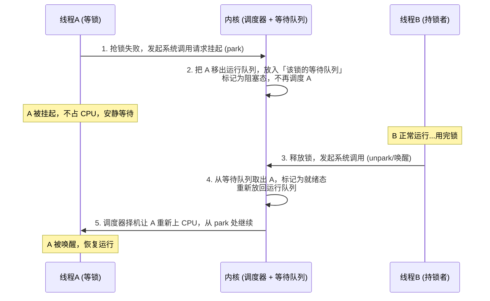

拆开看「唤醒」这两个字的实质：

- **谁来唤醒**：唤醒由「事件的另一方」发起。等锁的线程，由**释放锁的线程**唤醒；等 IO 的线程，由**磁盘/网卡完成时的硬件中断**触发内核唤醒；`sleep` 的线程，由**定时器到点**触发内核唤醒。
- **唤醒做了什么**：内核把目标线程从「等待队列」挪回「就绪队列（运行队列）」，状态从「阻塞态」改成「就绪态」。**注意「就绪」不等于「立刻运行」**——它只是重新有资格被调度了，真正上 CPU 还得等调度器在下一个调度点挑中它。
- **为什么说开销大**：挂起要陷一次内核（系统调用），唤醒又要陷一次内核，加上前面讲的[上下文切换](#一补-b上下文切换内核切线程时究竟做了什么)成本。这一来一回的「挂起→唤醒」两次内核态切换，正是[自旋](#自旋是什么)想用「原地空转几圈」去**赌掉**的开销。

> **落到 Java**：`LockSupport.park()` / `unpark(thread)` 就是 JDK 对这套「挂起 / 唤醒」机制的封装，[AQS](#四aqsjuc-背后的同步器框架)的 FIFO 等待队列、`synchronized` 重量级锁、`Object.wait/notify` 底层都靠它。`park` 在 Linux 上最终落到 `futex` 系统调用，由内核完成真正的挂起与唤醒。所以你在 Java 里写的 `lock.lock()` 抢不到锁时「卡住」，本质就是「**发起 park 系统调用 → 陷入内核 → 被挂起进等待队列**」这一串动作。

---

## 一·补 C、为什么内核线程的栈是固定 1MB，而不能动态增长

`-Xss` 默认约 1MB（Linux x86-64 上 JVM 线程栈典型值），很多人疑惑：栈明明大部分时候用不满，为什么不按需增长、用多少给多少？

> **先厘清 `-Xss` 是什么**：它是 JVM 启动参数，专门用来设置**每个线程的栈大小**（如 `-Xss512k`）。名字可以这样拆开记：`-X` 是 JVM「非标准参数」的统一前缀（这类参数不保证跨版本兼容，区别于 `-XX:` 那种「高级/实验参数」），后面的 `ss` 是 **s**tack **s**ize 的缩写。所以 `-Xss` = 「（非标准参数）栈大小」。
>
> **它为什么对应的是「内核线程的栈」？** 因为 JDK 21 之前 Java 是 **1:1 线程模型**——一个 Java 线程就是一个 OS（内核）线程，二者一一对应。你用 `new Thread()` 创建 Java 线程时，JVM 会调底层 `pthread_create` 创建一个真正的内核线程，而 `-Xss` 设的值，正是传给它、用来划定**这个内核线程栈空间上限**的参数。所以「Java 线程栈大小」和「内核线程栈大小」在 1:1 模型下指的是同一个东西。（到了虚拟线程时代，虚拟线程不再 1:1 绑定内核线程，栈也改为按需分配在堆上，`-Xss` 就不再约束它了。）

根本原因是：**内核线程的栈是一段在线程创建时就「连续预留」好的虚拟地址空间，它的增长方向和内存布局，决定了它没法安全地动态扩张。**

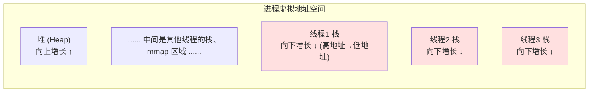

具体原因有四点：

- **栈是连续内存，且地址必须稳定**。栈上的局部变量、函数返回地址、保存的寄存器都靠「栈指针 SP + 固定偏移」来寻址。如果栈能搬家（realloc 到别处），所有指向栈上对象的指针就全部失效了——这在 C 层面是灾难。所以栈一旦分配，**起始地址不能变**，只能在原地预留足够空间。
- **多线程地址空间「插不进去」**。一个进程里有成百上千个线程，每个线程的栈在地址空间里**紧挨着排布**（见上图）。如果某个线程的栈想「向下再长一点」，它下面可能正是另一个线程的栈或 mmap 区域，**没有连续的空闲地址可扩**。所以只能在创建时一次性划定上限。
- **栈向低地址增长，靠「保护页」兜底而非动态扩**。线程栈底部放一个**保护页（guard page）**，一旦递归过深、SP 越过保护页，会触发缺页异常 → JVM 抛 `StackOverflowError`。**它是用来「检测溢出」的，不是用来「触发扩容」的**——因为下面没有连续空间可扩。
- **1MB 是「虚拟预留」而非「物理占用」**。这点最关键，能消除常见误解：那 1MB 只是**预留的虚拟地址空间**，操作系统采用**惰性分配（lazy allocation / demand paging）**——真正用到某一页时才通过缺页中断分配物理页。所以一个只用了几 KB 栈的线程，**实际物理内存占用只有几 KB，不是 1MB**。1MB 是「天花板」，不是「即时成本」。
  - 既然物理内存是惰性分配的，为什么还嫌它「贵」？因为**虚拟地址空间是有限资源**（尤其历史上 32 位系统只有几 GB 寻址空间），每个线程预留 1MB，几千个线程就把地址空间预留光了；同时每个线程的内核数据结构、内核栈、调度成本是实打实的。

> 对比的张力就在这里：因为内核栈「连续预留 + 不能搬家」，所以只能保守地给 1MB 上限。而 [Go 的 goroutine](../concurrency-models/go-goroutine-csp.md) 之所以能用 **2KB 起步的栈**，正是因为它把栈管理搬到了**用户态运行时**——goroutine 栈可以**动态增长**（栈满时分配一块更大的栈，把旧栈内容拷过去，并由运行时统一修正所有栈上指针，这是用户态运行时才有能力做的「搬家」）。Java 虚拟线程也用了类似的「按需栈」思路。**「固定 1MB」与「可增长 2KB 栈」的差异，正是内核态调度与用户态调度的分水岭。**

---

## 二、线程池：因为线程太贵，所以要复用

正因为线程这么贵，Java 的标准实践是**用线程池复用线程**，而不是用完即抛。这就像数据库连接池——连接太贵，所以**预先创建好一批线程放在一起统一管理，用的时候借一个、用完还回去**，避免反复创建销毁。这种「预先建好一批可复用资源、循环借还」的做法，业界叫**池化（pooling）**，线程池、连接池、对象池都是同一个思路。

```java
// 创建一个固定大小的线程池，复用 10 个线程处理大量任务
ExecutorService pool = Executors.newFixedThreadPool(10);

for (int i = 0; i < 1000; i++) {
    pool.submit(() -> {
        // 1000 个任务，但只用 10 个线程轮流跑，不会创建 1000 个线程
        doWork();
    });
}
pool.shutdown();
```

**先分清两个最容易被中文混为一谈的概念：「线程池（pool）」≠「任务队列（queue）」。** 中文里它们都像「装东西的容器」，但实质完全不同，看懂下面这张图，后面所有参数和流程都会豁然开朗：


| 维度 | 线程池 Pool（实例池） | 任务队列 Queue（排队队列） |
|------|----------------------|---------------------------|
| **装的是什么** | **干活的「工人」**——一个个**线程实例** | **要干的「活」**——一个个**任务对象**（`Runnable`/`Callable`） |
| **类比** | 工厂里的**工人数量**（餐厅的厨师） | 等待处理的**订单堆**（餐厅排队的客人） |
| **大小由谁定** | `corePoolSize` / `maximumPoolSize` | `workQueue` 那个队列对象的**容量** |
| **本质** | 复用昂贵的线程，避免反复创建销毁 | 线程不够时**缓冲**任务，削峰填谷 |

> **一句话点破**：线程池里装的是**线程（工人）**，任务队列里装的是**任务（活儿）**。提交任务时，先看有没有空闲工人（线程），没有就把活儿（任务）扔进队列排队等工人空出来。所以「池满了」（线程开到 `maximumPoolSize`）和「队列满了」（排队的活儿堆到容量上限）是**两件独立的事**——后面讲拒绝策略时你会看到，**只有两者同时满，才会拒绝任务**。中文读者尤其要把这两个「满」区分开。

`ThreadPoolExecutor` 的完整构造函数有 **7 个参数**，每一个都体现「线程是稀缺资源」的设计哲学。先看构造方法签名：

```java
public ThreadPoolExecutor(
    int corePoolSize,                  // 1. 核心线程数
    int maximumPoolSize,               // 2. 最大线程数
    long keepAliveTime,                // 3. 空闲存活时间
    TimeUnit unit,                     // 4. 时间单位
    BlockingQueue<Runnable> workQueue, // 5. 任务队列
    ThreadFactory threadFactory,       // 6. 线程工厂
    RejectedExecutionHandler handler)  // 7. 拒绝策略
```

**七个参数逐个讲作用：**

| # | 参数 | 类型 | 作用 |
|---|------|------|------|
| 1 | `corePoolSize` | `int` | **核心线程数**。线程池长期保持的「常驻」线程数量。任务来了优先用核心线程；即使空闲，核心线程默认也不回收（除非开启 `allowCoreThreadTimeOut`）。这是复用的主力。 |
| 2 | `maximumPoolSize` | `int` | **最大线程数**。线程池能创建的线程上限。只有当**队列已满**、核心线程都在忙时，才会创建「核心数 → 最大数」之间的**非核心线程（救急线程）**。它是防止「线程爆炸」拖垮系统的硬上限。 |
| 3 | `keepAliveTime` | `long` | **空闲存活时间**。救急流量退去后，**非核心线程**空闲超过这个时间就被回收，让线程数缩回 `corePoolSize`。体现「用完即还、不长期占用稀缺资源」。 |
| 4 | `unit` | `TimeUnit` | **时间单位**。给 `keepAliveTime` 配单位（`SECONDS`/`MILLISECONDS` 等）。它本身不是独立语义，只是让第 3 个参数可读。 |
| 5 | `workQueue` | `BlockingQueue<Runnable>` | **任务队列**。核心线程都忙时，新任务先进队列排队**等待**，而不是立刻开新线程。队列类型决定了线程池的「性格」（见下方 `workQueue` 队列类型表）。**必须用有界队列**，否则堆积会 OOM。 |
| 6 | `threadFactory` | `ThreadFactory` | **线程工厂**。负责创建池里的工作线程，可定制**线程名、是否守护线程、优先级、未捕获异常处理器**等。生产环境强烈建议自定义，**给线程起有意义的名字**（如 `order-pool-1`），出问题时排查/看堆栈一目了然。 |
| 7 | `handler` | `RejectedExecutionHandler` | **拒绝策略（兜底）**。当**队列已满 + 线程已达 `maximumPoolSize`**，再来的任务无处安放时如何处理。这是系统过载时的最后一道防线。 |

> **关键执行顺序**（七参数协同的核心，也是面试高频陷阱）：任务提交后，先用**核心线程** → 核心满了**进队列** → 队列满了开**非核心线程**（到 `maximumPoolSize`）→ 还放不下才触发**拒绝策略**。注意：**队列优先于「开到最大线程数」**，很多人答反。

**一个能澄清 90% 误解的算例：`max=10`，一次提交 20 个任务，会拒绝 10 个吗？**

直觉常认为「max=10 装不下 20，必然拒绝 10 个」——**这是错的**。关键在于一个容易被忽略的变量：**队列容量**。注意「队列容量」**不是独立的构造参数**，而是你传给第 5 个参数 `workQueue` 的那个队列对象自带的容量，在 new 队列时就定了：

```java
new ThreadPoolExecutor(
    5,                              // corePoolSize 核心线程数
    10,                             // maximumPoolSize 最大线程数
    60L, TimeUnit.SECONDS,
    new ArrayBlockingQueue<>(10),   // ← 队列容量 = 10，就藏在这里！
    Executors.defaultThreadFactory(),
    new ThreadPoolExecutor.AbortPolicy());
```

以 `core=5, max=10` 提交 20 个任务，结果**完全取决于队列容量**：

| 队列容量 | 20 个任务的去向 | 拒绝几个 |
|----------|-----------------|----------|
| 容量 = 0（`SynchronousQueue`） | 队列存不下，立刻开非核心线程到 max=10（10 个在跑），剩 10 个无处放 | **拒绝 10 个** |
| 容量 = 3 | 5 跑 + 3 排队 + 5 救急(到 max=10) = 13，剩 7 个无处放 | **拒绝 7 个** |
| 容量 = 10 | 5 跑 + 10 排队 + 5 救急(到 max=10) = 20，刚好装下 | **0 个** |
| 容量 ≥ 15 / 无界 | 5 跑，其余 15 个全进队列排队，根本轮不到开非核心线程 | **0 个** |

> **记住这个公式**：线程池在「不拒绝」前提下能同时容纳的任务数上限 = **`maximumPoolSize` + `workQueue` 容量**。只有当 **并发任务数 > max + 队列容量** 时，超出部分才走拒绝策略。所以「20 个任务、max=10 就拒 10 个」只在 `SynchronousQueue`（容量 0）这种极端情况下才成立。

**反直觉的「晚到先跑」现象**（高频追问）：还是 `core=5, max=10, 队列容量=10`，按提交先后顺序——

| 提交顺序 | 去向 | 状态 |
|----------|------|------|
| 第 1~5 个 | 占满 5 个**核心线程** | **立即在跑** ✅ |
| 第 6~15 个 | 进**队列**排队（刚好填满容量 10） | **排队等待** ⏳ |
| 第 16~20 个 | 队列已满，触发开**非核心线程**（救急） | **立即在跑** ✅ |

也就是说：**先提交的 5 个在跑，中间 10 个反而在等，最后提交的 5 个一来就立即被救急线程拉起来跑**——晚到的反而先跑，违反 FIFO 直觉。

**原因**：每来一个任务，线程池**先试着塞进队列**，塞不进去（队列满）才开新线程。第 6~15 个到达时队列没满，被「顺手」塞进去排队；第 16 个到达时队列满了，塞不进去才触发开救急线程，于是它立刻有线程跑。背后的设计意图是——**线程是稀缺资源，能用队列扛就别轻易开新线程**，开非核心线程是「最后才动用的救急手段」。等核心线程跑完手头任务，会回头从**队列头部**取第 6、7… 个继续消化，所以排队任务最终也会被执行，只是启动晚于那 5 个救急任务。

**第 5 个参数 `workQueue` 的常见选择：**

| 队列类型 | 特点 |
|----------|------|
| `ArrayBlockingQueue` | **有界**数组队列，必须指定容量，最推荐（可控、防 OOM） |
| `LinkedBlockingQueue` | 链表队列，默认**无界**（`Integer.MAX_VALUE`），慎用——堆积会 OOM |
| `SynchronousQueue` | **不存任务**，直接把任务交给线程；没有空闲线程就立刻开新线程（`newCachedThreadPool` 用它） |
| `PriorityBlockingQueue` | 带优先级的无界队列，任务按优先级出队 |

**第 7 个参数 `handler` 的四种内置策略：**

| 策略 | 行为 |
|------|------|
| `AbortPolicy`（默认） | 抛 `RejectedExecutionException`，让调用方感知到过载 |
| `CallerRunsPolicy` | 让**提交任务的线程自己执行**该任务，相当于「降速反压」，不丢任务 |
| `DiscardPolicy` | **静默丢弃**新任务，不抛异常（最危险，任务悄无声息消失） |
| `DiscardOldestPolicy` | 丢弃**队列最老**的任务，再尝试提交新任务（只关心最新数据时用） |

> **「满了之后只能拒绝吗？没有『排队等待』的策略吗？」** —— 这是个很自然的疑问，答案要分两层说清：
>
> **第一层（JDK 事实）**：JDK **没有提供「阻塞等待直到队列腾出空位」的内置策略**，上面四种就是全部。原因是 `ThreadPoolExecutor` 的设计哲学是**「快速决策、绝不无限堆积」**——队列容量本身就是你设定的「最多排多少」，队列满 + 线程达 max 意味着系统**已经过载**，此时若再让提交方无限期阻塞等待，可能引发上游线程大面积堆积、雪崩，所以默认交给 `handler` 显式决策。注意这里的「队列」本身就是排队等待机制：**真正的排队发生在「核心线程满 → 入队」这一步，而不是在拒绝这一步**。拒绝策略是排队都满了之后的最后兜底。
>
> **第二层（你想要的「等待」其实有，只是要自己选/自己写）**：
> - **`CallerRunsPolicy` 就是一种「软等待 / 反压（back-pressure）」**：任务回退给**提交任务的线程自己执行**，提交方在跑这个任务期间**无法提交新任务**，于是上游自动降速、给线程池喘息时间，且**不丢任务**。美团技术团队在实践中较常用它。代价：若提交方是 Web 容器的请求线程（如 Tomcat Worker），会拉长该请求的响应时间，延迟敏感场景需谨慎。
> - **真正的「阻塞等待队列腾空位」需要自定义 `RejectedExecutionHandler`**，在里面调用 `executor.getQueue().put(r)`（`put` 是阻塞放入，队列满就一直等到有空位）。Netty 等框架有类似实现。这才是你直觉里那个「排队等待」策略，JDK 没内置，但几行代码就能加上：
>
> ```java
> // 自定义「阻塞等待」拒绝策略：满了不丢不抛，而是阻塞等队列腾出空位
> RejectedExecutionHandler blockingHandler = (r, executor) -> {
>     if (!executor.isShutdown()) {
>         try {
>             executor.getQueue().put(r); // 阻塞，直到队列有空位
>         } catch (InterruptedException e) {
>             Thread.currentThread().interrupt();
>         }
>     }
> };
> ```
>
> 生产中还常见把被拒任务**落库/进 MQ 后续补偿**、**计数器上报告警**（Dubbo 的 `AbortPolicyWithReport` 会 dump 任务信息到本地文件便于排查）。**结论：JDK 给的是「四种快速决策 + 可自定义」的开放设计，而非『只能拒绝』。**

**线程池的存在，本身就是「OS 线程太贵」这个约束的产物。** 记住这一点——第四章你会看到 Go 不需要线程池（协程足够便宜，随便开），这个差异背后正是并发模型的根本不同。

---

## 三、JUC：`java.util.concurrent` 工具箱

裸用 `synchronized` 和 `wait/notify` 写并发又难又易错。Java 5 引入了 **JUC（`java.util.concurrent`）** 工具包，提供了一整套高质量的并发原语。你日常会用到：

```java
// 1. 原子类：无锁的线程安全计数
AtomicInteger counter = new AtomicInteger(0);
counter.incrementAndGet();   // 底层用 CAS，比 synchronized 快

// 2. 并发集合：线程安全的容器
ConcurrentHashMap<String, Integer> map = new ConcurrentHashMap<>();
map.put("k", 1);

// 3. 显式锁：比 synchronized 更灵活（可中断、可超时、可读写分离）
ReentrantLock lock = new ReentrantLock();
lock.lock();
try {
    // 临界区
} finally {
    lock.unlock();   // 必须手动解锁，所以放 finally
}

// 4. 协调工具：让多个线程协同
CountDownLatch latch = new CountDownLatch(3);   // 等 3 个任务都完成
```

这些工具的价值在于：**把容易写错的底层同步逻辑封装成经过验证的高质量组件**——这和你「用现成的工具类而非手搓底层」的工程直觉一致。

上面代码里出现了两个绕不开的核心概念——「临界区」和（下一节会大量出现的）`volatile`，以及它们背后「[锁到底有哪些类型、怎么实现](#三补-c锁的类型与实现)」。这三件事是并发的地基，下面分别讲透。

---

## 三·补 A、临界区（Critical Section）是什么

**临界区（Critical Section）**，指的是**一段访问共享资源（共享变量、共享数据结构）的代码，在同一时刻只允许一个线程进入执行**。它的英文 *critical section* 里 "critical" 是「关键、危险」之意——因为这段代码若被多个线程同时执行，就会产生**竞态条件（Race Condition）**，导致数据错乱。

> **竞态条件是什么领域的概念？还有哪些「同类问题」？** 竞态条件是**并发编程**的核心概念（在操作系统、分布式系统里也同样适用），指**程序的正确性依赖于多个线程执行的先后时序**——一旦时序不凑巧（比如两个线程同时对 `count++` 做「读-改-写」），结果就会出错。它属于一个更大的「并发缺陷家族」，常被一起考查，值得放在一起认清：
>
> | 缺陷 | 一句话含义 | 典型例子 / 关系 |
> |------|-----------|----------------|
> | **竞态条件 Race Condition** | 结果依赖线程时序，时序不对就出错 | `count++` 丢更新；本节临界区要解决的就是它 |
> | **数据竞争 Data Race** | 多线程并发访问同一变量、至少一个是写、且无同步 | 是竞态条件最常见的**底层成因**（但二者不完全等价） |
> | **死锁 Deadlock** | 多个线程互相等对方手里的锁，全卡死 | 见 [考点 6：手写/分析死锁](#考点-6手写分析死锁) |
> | **活锁 Livelock** | 线程没卡死、一直在动，但互相谦让导致谁都没进展 | 两人过道互相让路、反复同向横跨 |
> | **饥饿 Starvation** | 某线程长期抢不到资源，迟迟得不到执行 | 低优先级线程总被高优先级抢占；非公平锁下的倒霉线程 |
>
> 简单记：**数据竞争/竞态**是「同时访问共享数据没保护好」，**死锁/活锁/饥饿**则是「为了保护而协调时，协调本身又出了问题」。本节先讲怎么用临界区（互斥）消除竞态条件，死锁等协调类问题在第七节面试考点里展开。

<details>
<summary><b>👉 五种缺陷各来一个真实可运行的代码例子（点击展开）</b></summary>

下面五段都是**可直接 `main` 跑起来复现问题**的最小例子，跑几次就能亲眼看到「结果不对 / 卡死 / 空转 / 饿死」。

**① 竞态条件 / 数据竞争（Race Condition / Data Race）**——两个最常被一起讲：`count++` 不是原子操作，它是「读→改→写」三步，两个线程交错执行会丢更新。这段代码同时具备「数据竞争」（无同步地并发读写 `count`）这个底层成因，外在表现就是「竞态条件」（最终结果依赖于不可控的执行时序）。

```java
public class RaceDemo {
    static int count = 0;  // 共享变量，无任何同步保护

    public static void main(String[] args) throws InterruptedException {
        Runnable task = () -> {
            for (int i = 0; i < 100_000; i++) {
                count++;   // 非原子：读 count → +1 → 写回，三步可被打断
            }
        };
        Thread t1 = new Thread(task);
        Thread t2 = new Thread(task);
        t1.start(); t2.start();
        t1.join();  t2.join();
        // 期望 200000，实际几乎每次都小于它（丢了更新）
        System.out.println("count = " + count);  // 如 187423，且每次不同
    }
}
// 修复：count 改为 AtomicInteger 并用 incrementAndGet()，
//      或对 count++ 加 synchronized / ReentrantLock（即本节的临界区）。
```

**② 死锁（Deadlock）**——两个线程以**相反顺序**抢两把锁，各持一把、又等对方那把，谁也不退，永久卡死（AB-BA 经典死锁，详见 [考点 6](#考点-6手写分析死锁)）。

```java
public class DeadlockMiniDemo {
    static final Object lockA = new Object();
    static final Object lockB = new Object();

    public static void main(String[] args) {
        new Thread(() -> {
            synchronized (lockA) {
                sleep(100);                       // 故意停顿，让对方先拿到 lockB
                synchronized (lockB) { System.out.println("线程1拿到了 A+B"); }
            }
        }).start();

        new Thread(() -> {
            synchronized (lockB) {                // 注意：顺序与线程1相反
                sleep(100);
                synchronized (lockA) { System.out.println("线程2拿到了 B+A"); }
            }
        }).start();
        // 运行后两行都不会打印——程序卡死。jstack 可看到 "Found 1 deadlock"。
    }
    static void sleep(long ms) { try { Thread.sleep(ms); } catch (InterruptedException ignored) {} }
}
// 修复：所有线程按同一全局顺序加锁（都先 A 后 B），破坏「循环等待」条件。
```

**③ 活锁（Livelock）**——线程没卡死、CPU 一直在转，但因为彼此「太礼貌」反复谦让，谁都没真正前进。下例两个线程都想拿两把锁，拿不到第二把就**主动释放第一把再重试**，结果你让我、我让你，无限循环。

```java
public class LivelockDemo {
    static class Spoon { volatile boolean owned; }  // 一把「勺子」资源

    public static void main(String[] args) {
        Spoon spoon = new Spoon();
        spoon.owned = true;  // 初始被「自己」占着

        Runnable polite = () -> {
            String me = Thread.currentThread().getName();
            while (true) {
                if (spoon.owned) {                 // 发现别人想用
                    spoon.owned = false;           // 我让出来（谦让）
                    System.out.println(me + " 说：你先用吧");
                } else {
                    spoon.owned = true;            // 对方又让回来，我又拿起
                    System.out.println(me + " 说：不不，还是你先");
                }
                sleep(50);  // 一直在动，但永远吃不上饭——这就是活锁
            }
        };
        new Thread(polite, "Alice").start();
        new Thread(polite, "Bob").start();
    }
    static void sleep(long ms) { try { Thread.sleep(ms); } catch (InterruptedException ignored) {} }
}
// 关键区别：死锁是「都不动」，活锁是「都在动但没进展」。
// 修复：引入随机退避（每次重试前 sleep 一个随机时长），打破对称的谦让节奏。
```

**④ 饥饿（Starvation）**——某线程长期抢不到 CPU 或锁，迟迟得不到执行。下例用**线程优先级**制造饥饿：一堆高优先级线程疯狂占用 CPU，低优先级线程被一直压着，很久才轮到（在繁忙的机器上尤其明显）。

```java
public class StarvationDemo {
    public static void main(String[] args) {
        // 9 个高优先级线程拼命空转抢 CPU
        for (int i = 0; i < 9; i++) {
            Thread hi = new Thread(() -> {
                long end = System.currentTimeMillis() + 3000;
                while (System.currentTimeMillis() < end) { /* busy loop 占着 CPU */ }
            });
            hi.setPriority(Thread.MAX_PRIORITY);  // 优先级 10
            hi.start();
        }
        // 1 个低优先级线程，只想打印一句话，却可能迟迟轮不到
        Thread low = new Thread(() ->
                System.out.println("低优先级线程：我终于跑上了！time=" + System.currentTimeMillis()));
        low.setPriority(Thread.MIN_PRIORITY);     // 优先级 1
        low.start();
        // 在核数少 / 负载高时，low 这行会明显延后才打印 —— 它被「饿」着了。
    }
}
// 注意：Java 线程优先级只是给 OS 调度器的「建议」，不同平台效果不一，
//      但「非公平锁下某线程长期抢不到锁」是更工程化的饥饿场景。
// 修复：用公平锁 new ReentrantLock(true)、避免长期持锁、合理设计调度。
```

把上面五段对照着跑一遍，「结果错、卡死、空转、饿死」这四类现象就能形成肌肉记忆，面试被追问时也能随手写出复现代码。

</details>

```java
ReentrantLock lock = new ReentrantLock();
lock.lock();        // ← 进入临界区（acquire）
try {
    count++;        // ← 临界区代码：读-改-写共享变量，必须互斥
} finally {
    lock.unlock();  // ← 退出临界区（release）
}
```

临界区的保护机制本质是「**互斥（Mutual Exclusion，简称 mutex）**」，它要满足三个性质：

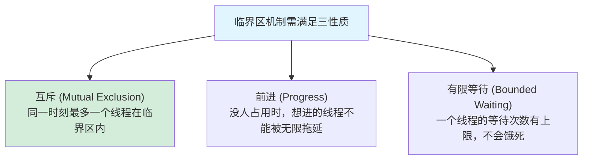

> **机制层面**：进入临界区前的 `lock()` 叫**获取（acquire）**，退出时的 `unlock()` 叫**释放（release）**。无论用 `synchronized` 还是 `ReentrantLock`，本质都是「acquire → 执行临界区 → release」这一对动作，配合下面要讲的内存屏障，保证**互斥**和**可见性**两件事同时成立。

---

## 三·补 B、volatile 是什么：含义与机制原理

`volatile` 是 Java 并发里最容易「会用说不清」的关键字。它的字面含义是「易变的」，提示编译器和 CPU：**这个变量随时可能被别的线程改动，不要做激进的缓存和重排优化。** 它给变量提供两个保证，外加一个**不保证**：

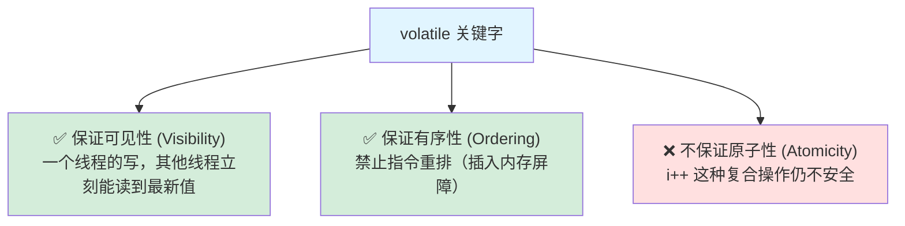

**机制原理（两层）**：

第一层是**可见性**。在没有 `volatile` 时，线程可能把变量缓存在自己的 CPU 寄存器/工作内存里，改了不及时同步回主内存，别的线程看到的是「过期值」。加上 `volatile` 后：

- **写 volatile 变量**：JVM 在写之后插入一个 **Store 屏障**，强制把这次写**立即刷回主内存**，并使其他 CPU 缓存中的该变量副本**失效**（基于 CPU 的缓存一致性协议 MESI）。
- **读 volatile 变量**：JVM 在读之前插入 **Load 屏障**，强制**从主内存重新加载**最新值，不用本地缓存的旧值。

第二层是**有序性（禁止重排）**。编译器和 CPU 为了性能会对指令重排，`volatile` 通过插入**内存屏障（Memory Barrier）**禁止特定方向的重排：

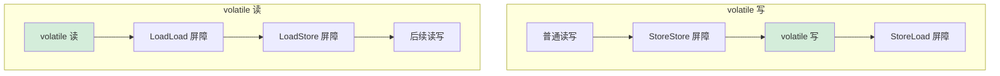

在 x86 平台，这些屏障最终体现为带 **`lock` 前缀**的指令（如 `lock addl`），它既刷新缓存（保证可见性），又充当全屏障（禁止重排）。

> **典型用途**：`volatile` 最经典的场景是**状态标志位**（如 `volatile boolean running;` 控制线程优雅停止）和**双重检查锁单例（DCL）**——后者正是「为何 volatile 不可省」的经典面试题，机制细节会在 [3.2 JMM](./02-内存模型JMM.md) 里结合 happens-before 彻底展开。这里先记住：**volatile = 可见性 + 有序性，但不含原子性。** 需要原子性请用 `AtomicXxx` 或[锁](#三补-c锁的类型与实现)。

---

## 三·补 C、锁的类型与实现

「锁」是个统称，背后是一整套分类。面试里常被要求「说说你知道哪些锁、分别怎么实现」。按不同维度梳理：

| 分类维度 | 类型 | 含义 | 典型实现 |
|---------|------|------|---------|
| **是否加锁** | 乐观锁 (Optimistic) / 悲观锁 (Pessimistic) | 乐观：假设没冲突，先做再校验（失败重试）；悲观：假设会冲突，先锁再做 | 乐观=CAS/版本号；悲观=`synchronized`/`ReentrantLock` |
| **抢不到时的行为** | 自旋锁 (Spin Lock) / 阻塞锁 (Blocking Lock) | 自旋：忙等循环重试（不让出 CPU）；阻塞：[挂起线程（让出 CPU，靠内核唤醒）](#阻塞挂起与内核唤醒) | 自旋=CAS 循环、轻量级锁；阻塞=重量级锁、`park` |
| **能否被多线程读** | 互斥锁 (Mutex) / 读写锁 (Read-Write Lock) | 互斥：读写都独占；读写：读读共享、读写/写写互斥 | 互斥=`ReentrantLock`；读写=`ReentrantReadWriteLock`、`StampedLock` |
| **是否公平** | 公平锁 (Fair) / 非公平锁 (Non-fair) | 公平：严格按排队顺序拿锁；非公平：允许插队（吞吐更高） | `ReentrantLock(true/false)` |
| **能否重入** | 可重入锁 (Reentrant) / 不可重入锁 (Non-reentrant) | 可重入：同一线程可重复获取同一把锁不死锁 | `synchronized`、`ReentrantLock` 都可重入 |
| **是否可共享** | 独占锁 (Exclusive) / 共享锁 (Shared) | 独占：一次一个线程；共享：可多个线程同时持有 | 独占=写锁；共享=读锁、`Semaphore`、`CountDownLatch` |

<a id="自旋是什么"></a>
> **插一句：什么是「自旋」？** 当一个线程抢锁失败时，它有两种选择。一是**阻塞**——交出 CPU、[被操作系统挂起（park），等锁释放时再被唤醒](#阻塞挂起与内核唤醒)，但「挂起→唤醒」要陷入内核态，开销大。二是**自旋**——不交出 CPU，原地写一个 `while` 空循环反复重试抢锁（俗称「忙等 busy-waiting」）。
> 自旋的赌注是：**如果锁马上就会释放，那原地转几圈等到它，比「挂起再唤醒」划算得多**（省掉两次内核态切换）。但如果锁迟迟不放，自旋就是在白白空耗 CPU。所以自旋适合**锁持有时间极短、马上就能拿到**的场景，这正是 `synchronized` 轻量级锁和 CAS 失败重试的工作方式。JVM 还有**自适应自旋**：根据上次自旋是否成功，动态调整下次自旋的次数。

这些类型的**底层实现**，归根结底落在三种机制上：

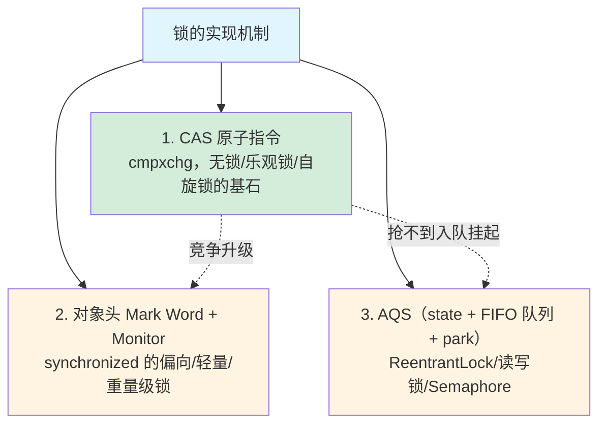

- **CAS（Compare-And-Swap）**：靠一条 CPU 原子指令实现「比较并交换」，是乐观锁、自旋锁、原子类的底座（详见[考点 4：CAS 与 ABA 问题](#考点-4cas-与-aba-问题原子类必问)）。
- **`synchronized`**：靠[对象头 Mark Word](#三补-d对象头与-mark-word)记录锁状态，按竞争程度在偏向锁→轻量级锁（CAS 自旋）→重量级锁（OS 互斥量）之间升级（详见[考点 3：synchronized 的锁升级](#考点-3synchronized-的锁升级重量级追问)）。
- **AQS**：靠一个 `volatile int state` + 一个 FIFO 等待队列 + `LockSupport.park/unpark` 实现，是 `ReentrantLock`、读写锁、`Semaphore` 的共同底座（下一节展开）。

> 你会发现：上面三种实现里，CAS 和 AQS 都**离不开 `volatile`**（AQS 的 state 就是 volatile），而它们要保证的「互斥 + 可见」正是为了安全地进出**临界区**。**临界区、volatile、锁——这三者其实是同一件事的三个侧面。**

---

## 三·补 D、对象头与 Mark Word

> `synchronized` 把锁信息存在哪？答案是对象头里的 Mark Word。这一节解释「对象头到底是什么」。

上面说 `synchronized`「靠对象头里的 Mark Word 记录锁状态」。那么**对象头到底是什么**？这是看懂锁升级、`hashCode`、GC 的共同前提，值得单独讲清。

**Java 对象在堆里的内存布局**分三部分：

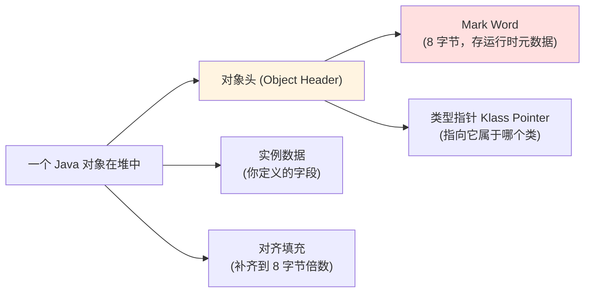

其中**对象头**又分两块：**类型指针**（指向方法区里的类元信息，回答「我是谁的实例」）和 **Mark Word**（64 位 JVM 下占 8 字节，存对象的**运行时状态**）。

**Mark Word 的关键设计：它会「变身」。** 同样这 8 字节，在不同状态下塞的是不同东西——这正是锁升级能「就地」进行的原因：

| 锁状态 | Mark Word 里存的内容 |
|--------|---------------------|
| 无锁 | 对象的 `hashCode`、分代年龄、是否偏向（标志位 `01`） |
| 偏向锁 | 持有偏向的**线程 ID** + epoch（标志位 `01`，偏向位 `1`） |
| 轻量级锁 | 指向**栈中锁记录（Lock Record）的指针**（标志位 `00`） |
| 重量级锁 | 指向**操作系统 Monitor（管程）对象的指针**（标志位 `10`） |
| GC 标记 | （标志位 `11`，GC 过程使用） |

> **一个经典的副作用**：因为偏向/轻量级锁会**占用**原本存 `hashCode` 的位置，所以一旦对象调用过 `Object.hashCode()`（生成了 identity hashCode），它就**无法再进入偏向锁**——只能直接走轻量级/重量级锁。这也是 JDK 15 之后干脆默认禁用偏向锁的原因之一：收益不稳定、维护成本高。
>
> 想用代码亲眼看 Mark Word 的变化，可以引入 OpenJDK 的 **JOL（Java Object Layout）** 工具：`ClassLayout.parseInstance(obj).toPrintable()` 会把对象头逐字节打印出来，加锁前后对比就能看到标志位翻转。

理解了对象头，再回头看 [三·补 C 的锁实现机制](#三补-c锁的类型与实现) 就通了：`synchronized` 的「偏向→轻量→重量」升级，本质就是 **Mark Word 这 8 字节里存的内容在不断改写**。

---

## 三·补 E、线程中断（interrupt）机制

很多人以为 `thread.interrupt()` 会**强行杀死**线程——这是最大的误解。Java 没有提供「强杀线程」的安全手段（早期的 `Thread.stop()` 因会让锁意外释放、对象处于不一致状态，早已废弃）。**中断本质是一种「协作式通知」**：你只是给目标线程的「中断标志位」打了个勾，**至于停不停、怎么停，由目标线程自己决定**。

涉及三个方法，务必分清：

| 方法 | 作用 | 是否清除标志 |
|------|------|------------|
| `t.interrupt()` | 给线程 t 打上中断标记（发通知） | 否 |
| `t.isInterrupted()` | 查询线程 t 是否被中断 | **否**（只读） |
| `Thread.interrupted()` | 查询**当前线程**是否被中断 | **是**（查完就清除，静态方法） |

**关键规则**：当线程正阻塞在 `sleep`、`wait`、`join`、`BlockingQueue.take` 等可中断方法上时，若被 `interrupt()`，这些方法会**立刻抛出 `InterruptedException` 并清除中断标志**。所以 catch 到这个异常，就意味着「有人请你停下」。

**场景一：优雅停止一个循环工作的线程**（最常见）

```java
public class InterruptDemo {
    public static void main(String[] args) throws InterruptedException {
        Thread worker = new Thread(() -> {
            // 用中断标志作为循环退出条件，而不是自定义 volatile boolean flag
            while (!Thread.currentThread().isInterrupted()) {
                System.out.println("工作中... " + System.currentTimeMillis());
                // 模拟一点 CPU 工作
                for (int i = 0; i < 1_000_000; i++) { Math.sqrt(i); }
            }
            System.out.println("收到中断，干净地退出循环");
        });

        worker.start();
        Thread.sleep(50);          // 让它先跑一会儿
        worker.interrupt();        // 发出中断通知（不是强杀）
        worker.join();
        System.out.println("worker 已优雅停止");
    }
}
```

**场景二：阻塞中被中断（响应 `InterruptedException`）**

```java
public class InterruptSleepDemo {
    public static void main(String[] args) throws InterruptedException {
        Thread sleeper = new Thread(() -> {
            try {
                System.out.println("准备睡 10 秒...");
                Thread.sleep(10_000);                 // 阻塞在这里
            } catch (InterruptedException e) {
                // sleep 被中断会抛此异常，并已清除中断标志
                System.out.println("睡眠被打断，提前醒来收尾");
                // 最佳实践：要么向上抛，要么补回中断标志，别静默吞掉
                Thread.currentThread().interrupt();
            }
        });

        sleeper.start();
        Thread.sleep(1000);
        sleeper.interrupt();      // 1 秒后打断它的睡眠，无需等满 10 秒
        sleeper.join();
    }
}
```

> **两条铁律**：
>
> 1. **不要静默吞掉 `InterruptedException`**（空 catch 块）。要么向上抛出，要么调 `Thread.currentThread().interrupt()` 把标志「补回去」，让上层有机会感知。否则中断信号就被你「吃掉」了，线程池等上层逻辑会失去停止它的能力。
> 2. **用中断标志而非自定义 `volatile boolean flag` 来控制停止**——因为中断能同时唤醒阻塞中的线程（`sleep`/`wait`/`take`），而自定义 flag 在线程阻塞时无法立即生效。

这也解释了为什么 `ReentrantLock` 的 **`lockInterruptibly()` 算一个卖点**：普通 `synchronized` 在等锁时**无法被中断**（只能死等），而 `lockInterruptibly()` 让一个正在等锁的线程能响应中断、放弃等待——详见 [考点 3 的 synchronized vs ReentrantLock 对比](#考点-3synchronized-的锁升级重量级追问)。

---

## 四、AQS：JUC 背后的「同步器框架」

往深一层，JUC 里的 `ReentrantLock`、`Semaphore`、`CountDownLatch` 等，**底层都基于同一个框架——AQS（AbstractQueuedSynchronizer，抽象队列同步器）**。理解 AQS，就理解了 Java 锁的半壁江山。

AQS 的核心思想可以用两句话概括：

1. **一个 volatile 的 int 状态值**（`state`），表示「同步状态」（如锁被持有几次、信号量剩多少）。
2. **一个 FIFO 等待队列**，抢不到资源的线程在这里排队（被 park 挂起），资源释放时按序唤醒。

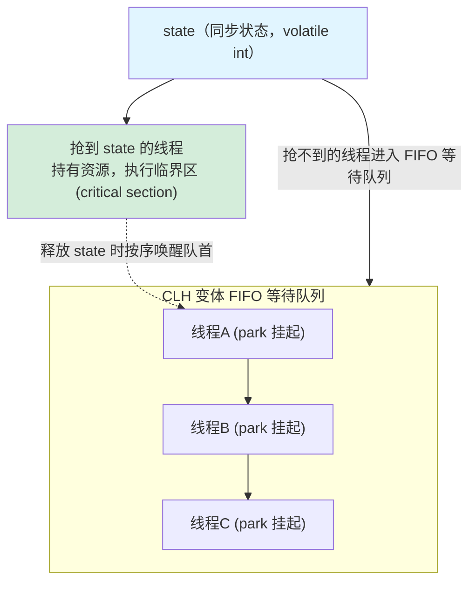

不同的同步器只是对「如何获取/释放 state」给出不同定义：

- `ReentrantLock`：state 表示重入次数，0 = 没人持有。
- `Semaphore`：state 表示剩余许可数。
- `CountDownLatch`：state 表示还没完成的计数，到 0 就放行所有等待者。

> 你**不需要手写 AQS**，但理解它能让你看懂锁的本质：**所有这些同步工具，都是「一个状态值 + 一个等待队列」的不同包装。** 这个「状态 + 队列」的抽象，在 [Rust 的 async 运行时](../concurrency-models/rust-async-tokio.md) 里会以另一种形态再次出现（任务排队 + waker 唤醒），届时你会发现并发的底层思想是相通的。

---

## 五、虚拟线程（Project Loom）：游戏规则改变者

JDK 21（2023 年正式发布）带来了 Java 并发史上最重大的变化——**虚拟线程（Virtual Threads）**，源自 Project Loom。它直接挑战了开篇说的「线程太贵」这个前提。

**虚拟线程不是 OS 线程的薄封装，而是 JVM 在用户态调度的「轻量级线程」**：

```java
// JDK 21+：创建虚拟线程，几乎零成本
Thread.startVirtualThread(() -> {
    // 这里可以放心地写"阻塞式"代码，比如同步读数据库
    var result = jdbcQuery();   // 阻塞时，虚拟线程会"让出"底层 OS 线程
});

// 甚至可以这样：一口气开一百万个虚拟线程，内存毫无压力
try (var executor = Executors.newVirtualThreadPerTaskExecutor()) {
    for (int i = 0; i < 1_000_000; i++) {
        executor.submit(() -> { doWork(); });
    }
}
```

虚拟线程的关键机制：

- **极轻量**：栈是按需增长的（几百字节起），不是固定 1MB。开几百万个都行。
- **用户态调度**：JVM 把大量虚拟线程「挂载」到少量 OS 线程（称为 carrier thread）上调度。
- **阻塞时自动让出**：当虚拟线程执行阻塞 IO 时，JVM 把它**从 OS 线程上卸载**，让 OS 线程去跑别的虚拟线程。等 IO 完成再恢复。**阻塞不再浪费 OS 线程。**

这一下子让 Java 用「同步阻塞」的简单写法，达到了过去要靠复杂异步代码才能达到的高并发——**「写起来像阻塞，跑起来像异步」**。

> 这是巨大的伏笔：虚拟线程的「用户态调度 + 阻塞自动让出」，思想上与 [Go 的 goroutine](../concurrency-models/go-goroutine-csp.md) 高度相似，也与各种 [async/await](../concurrency-models/nodejs-eventloop.md) 殊途同归。**Java 用虚拟线程「补上」了它在轻量并发上的短板。** 第四章 [高并发 HTTP 服务对比](../part4-multilang-compare/01-高并发HTTP服务对比.md) 会把虚拟线程版 Java 和 Go、Rust、Node 放在一起实测对比。

---

## 六、Java 并发模型全景与「钩子」

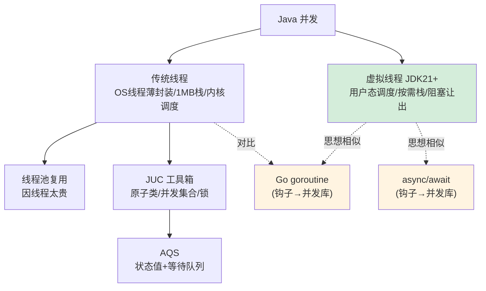

**埋给第四章的钩子**：

- 「线程太贵」→ 对比 [Go goroutine](../concurrency-models/go-goroutine-csp.md) 的几 KB 栈与 CSP 模型。
- 「虚拟线程用户态调度」→ 对比 [Rust Tokio](../concurrency-models/rust-async-tokio.md) 的无栈协程与 [Node 事件循环](../concurrency-models/nodejs-eventloop.md)。
- 「JUC/[锁](#三补-c锁的类型与实现)」→ 对比 Go「不要用共享内存通信，用通信共享内存」的哲学差异。

---

## 七、面试深度剖析：大厂高频考点

> 上面是「原理筑基」，这一节是「面试实战」。并发是大厂 Java 面试**命中率最高**的板块，几乎逢面必考。下面按面试官真实的「层层追问链」组织，每个考点给出**追问路径 + 标准答法要点 + 常见陷阱**。

### 考点 1：线程池的核心参数与执行流程（必考）

**面试官开场**：「说说线程池的几个核心参数，以及一个任务提交进来的完整执行流程。」

`ThreadPoolExecutor` 七个参数：`corePoolSize`、`maximumPoolSize`、`keepAliveTime`、`unit`、`workQueue`、`threadFactory`、`handler`（拒绝策略）。每个参数的具体作用见[本章第二节的逐参数详解](#二线程池因为线程太贵所以要复用)。

**任务提交的执行流程**（这是高频追问，必须背熟顺序）：

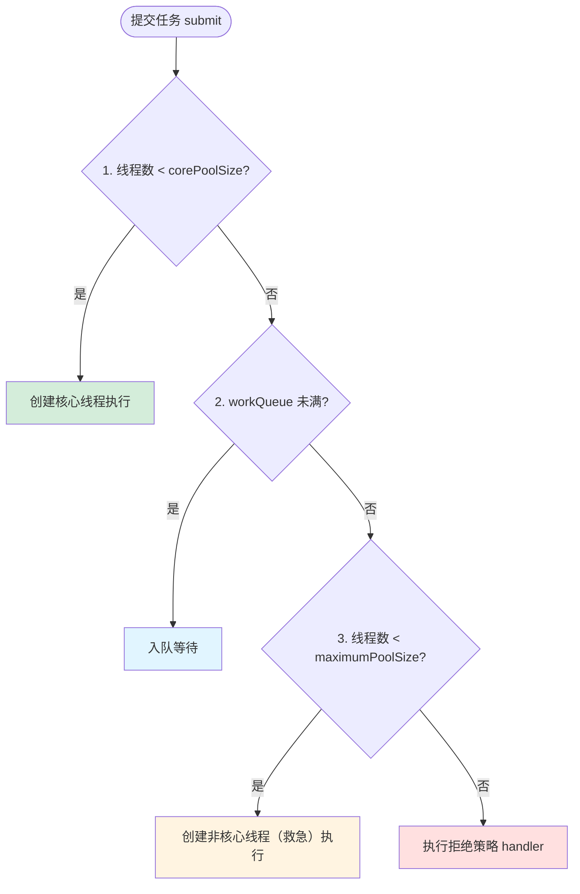

> **陷阱**：很多人答成「先开到 max 再入队」，错！正确顺序是 **核心线程 → 队列 → 非核心线程 → 拒绝**。队列优先于「开到最大线程数」。

**追问：四种内置拒绝策略？**

| 策略 | 行为 | 适用 |
|------|------|------|
| `AbortPolicy`（默认） | 抛 `RejectedExecutionException` | 要求严格、不能丢任务 |
| `CallerRunsPolicy` | 由提交任务的线程自己执行 | 削峰、不丢任务、能反压 |
| `DiscardPolicy` | 静默丢弃新任务 | 可容忍丢失 |
| `DiscardOldestPolicy` | 丢弃队列最老的任务，再尝试提交 | 只关心最新数据 |

**追问：满了之后只能拒绝吗？有没有「阻塞等待」策略？**

- JDK **没有内置「阻塞等待队列腾空位」的策略**，上面四种就是全部——这是「快速决策、不无限堆积」的设计取舍。
- 但「等待」并非没有：`CallerRunsPolicy` 是**软反压**（提交线程自己跑任务，自动给上游降速、不丢任务）；要真正阻塞等待，可**自定义 `RejectedExecutionHandler` 调 `executor.getQueue().put(r)`**（Netty 类似实现）。
- 详见[第二节对该疑问的两层拆解](#二线程池因为线程太贵所以要复用)。

**追问：为什么阿里规约禁止用 `Executors` 工厂方法创建线程池？**

- `Executors.newFixedThreadPool` / `newSingleThreadExecutor` 用的是**无界队列 `LinkedBlockingQueue`**（容量 `Integer.MAX_VALUE`），任务堆积会 **OOM**。
- `Executors.newCachedThreadPool` / `newScheduledThreadPool` 的 `maximumPoolSize` 是 `Integer.MAX_VALUE`，可能**创建海量线程**导致 OOM。
- 正解：**手动 `new ThreadPoolExecutor`**，显式指定有界队列和合理的 max。

**追问：`newFixedThreadPool` 和 `newCachedThreadPool` 有什么区别？** 先看它们的源码本质（都是对 `ThreadPoolExecutor` 的封装）：

```java
// Fixed：核心数 = 最大数 = n，线程数恒定；无界队列
newFixedThreadPool(n)  → new ThreadPoolExecutor(n, n, 0L, MS,  new LinkedBlockingQueue<>());
// Cached：核心数 = 0，最大数 = ∞，按需弹性伸缩；SynchronousQueue 不存任务
newCachedThreadPool()  → new ThreadPoolExecutor(0, Integer.MAX_VALUE, 60L, SEC, new SynchronousQueue<>());
```

| 维度 | `newFixedThreadPool(n)` | `newCachedThreadPool()` |
|------|------------------------|-------------------------|
| 核心/最大线程 | 都是 n，**线程数恒定不变** | core=0，**max=∞，按需伸缩** |
| 队列 | 无界 `LinkedBlockingQueue` | `SynchronousQueue`（容量 0，不囤任务） |
| 任务来太多 | 任务在队列里**无限排队**（可能堆积 OOM） | **不停开新线程**（可能线程爆炸 OOM） |
| 空闲线程 | 永久保留、不回收 | 空闲 60 秒回收，最终缩回 0 |
| 适合场景 | 负载稳定、任务量可控 | 大量**短小、突发**的任务 |

**澄清两个最容易被字面误导的点**：

- **Fixed 是不是「永远固定 n 个线程」？** 不完全是。它的核心线程数 = 最大线程数 = n，但**线程是「懒创建」的**：池子刚建好时是 0 个线程，来一个任务才创建一个，直到攒满 n 个就不再增加。一旦达到 n 个，就**永久保留、不回收**（默认 core 线程不超时销毁），后续任务全在无界队列里排队。所以更准确的说法是「**线程数上限恒定为 n，且达到 n 后不再回落**」。
- **Cached「缓存」的到底是什么？** 缓存的是**空闲线程本身**，目的是**复用**——这正是它名字的由来。它的工作逻辑是：来一个任务，**先看有没有空闲且存活的线程可复用**，有就直接交给它（不新建）；没有才开一个新线程。线程干完活后不会马上销毁，而是**空闲存活 60 秒**等着接新任务被复用；只有连续 60 秒没活干，才被回收，池子最终能缩回 0。所以它不是「来一个任务就无脑新建、干完就销毁」，而是**优先复用、复用不上才新建、闲置一段时间才回收**——这套「缓存复用空闲线程」的机制，就是 cached 的本质。

> **一句话记忆**：**Fixed 把压力堆在「队列」上**（任务排队等固定数量的线程），**Cached 把压力堆在「线程」上**（来一个任务就尽量开一个线程跑）。两者都因各自的「无界」（Fixed 的队列无界、Cached 的线程数无界）而被阿里规约禁用——这也正好印证前面 [pool ≠ queue](#二线程池因为线程太贵所以要复用) 的区分：一个在队列上失控，一个在池上失控。

### 考点 2：线程池参数怎么调（数据/IO vs CPU）

**面试官**：「线程数设多少合适？」

- **CPU 密集型**（大量计算、少 IO）：线程数 ≈ **CPU 核数 + 1**。线程太多只会增加上下文切换开销。
- **IO 密集型**（数据库、RPC、文件——你做数据研发最常见的场景）：线程数可以远大于核数，经验公式 **线程数 ≈ 核数 × (1 + 平均等待时间/平均计算时间)**。IO 等待时线程被挂起，可以多开。

**追问：CPU 密集型为什么是「核数 + 1」，这个 +1 哪来的？**（高频深挖）

- **为什么是「核数」**：CPU 密集型任务几乎一直在算、不阻塞。一个核同一时刻只能真正跑一个线程，所以**线程数 = 核数**时刚好让每个核都满负荷、吞吐最高。再多开线程不会更快，反而徒增**上下文切换**开销（保存/恢复寄存器、刷 TLB——就是前面讲的那些成本）。
- **为什么「+1」**：这多出来的 1 个是**「替补线程」**。即使是 CPU 密集型，线程也偶尔会因**缺页中断（page fault）、偶发 IO、或 GC 短暂暂停**而短时间挂起。若正好 N 个线程占 N 个核，一旦某线程卡住，那个核就**空转浪费**了；多备 1 个线程就能在这种空隙里**顶上去利用空闲的 CPU 周期**，避免核空转。
- **出处与态度**：「+1」出自 Brian Goetz《Java Concurrency in Practice》的经验公式，是行业共识。但它**是经验值不是铁律**——严谨做法是压测调优，「+1」只是一个合理起点。面试答出「+1 是为了填补线程偶发挂起时的 CPU 空隙」即可拿分。

> **加分项**：提到「**这正是虚拟线程要解决的问题**」——传统线程池要为 IO 密集精心调参，[虚拟线程](../concurrency-models/java-thread-and-virtual-thread.md)（第五节）让你直接「一任务一虚拟线程」，不用算这个公式。这能体现你知识的纵深。

### 考点 3：synchronized 的锁升级（重量级追问）

**面试官**：「`synchronized` 底层怎么实现的？锁升级过程说一下。」

> 这道题是 [三·补 C 锁的类型与实现](#三补-c锁的类型与实现) 里「`synchronized` 靠 Mark Word + Monitor 实现」那一句的展开深挖，建议先看完锁的整体分类再读这里。

`synchronized` 基于[对象头](#三补-d对象头与-mark-word)里的 **Mark Word** 和 **Monitor（管程）** 实现。JDK 6 之后引入**锁升级**优化，避免一上来就用昂贵的操作系统互斥量：

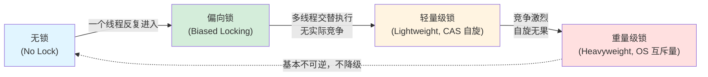

- **偏向锁**：只有一个线程访问时，在 Mark Word 记录线程 ID，下次进入无需 CAS。（注：JDK 15 起偏向锁被默认禁用/废弃，面试可点出这个新动向作为加分。）
- **轻量级锁**：多线程交替执行（无实际竞争），用 **[CAS](#考点-4cas-与-aba-问题原子类必问)** 尝试获取，失败则[自旋](#自旋是什么)。
- **重量级锁**：竞争激烈，自旋无果，膨胀为操作系统级互斥量，抢不到的线程进入阻塞（涉及内核态切换，最贵）。

**追问：`synchronized` 和 `ReentrantLock` 的区别？**

| 维度 | synchronized | ReentrantLock |
|------|-------------|---------------|
| 层面 | JVM 关键字（隐式） | JUC 类库（显式 lock/unlock） |
| 加解锁 | 自动 | **手动**，必须 finally 解锁 |
| 公平性 | 仅非公平 | 可选公平/非公平 |
| [可中断](#三补-e线程中断interrupt机制) | 不可 | 可（`lockInterruptibly`） |
| 超时获取 | 不可 | 可（`tryLock(timeout)`） |
| 条件变量 | 一个（wait/notify） | 多个 `Condition`（精准唤醒） |

### 考点 4：CAS 与 ABA 问题（原子类必问）

**面试官**：「`AtomicInteger` 怎么实现无锁线程安全？CAS 有什么问题？」

**CAS（Compare-And-Swap，比较并交换）的具体流程**：它接收三个操作数——内存地址 `V`、旧的预期值 `A`、要写入的新值 `B`。语义是「**当且仅当 V 处当前的值等于 A，才把它改成 B；否则什么都不做**」。整个「比较 + 交换」由一条 CPU 原子指令（x86 的 `cmpxchg`）保证不可分割，中途不会被其它线程插入。

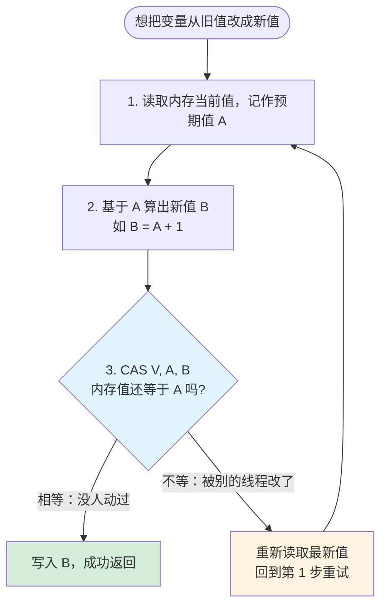

以 `AtomicInteger.incrementAndGet()` 为例，它内部就是这样一个**自旋重试循环**（简化版）：

```java
public final int incrementAndGet() {
    int prev, next;
    do {
        prev = get();          // 1. 读旧值（预期值 A）
        next = prev + 1;       // 2. 算新值 B
    } while (!compareAndSet(prev, next)); // 3. CAS；若期间值被改则失败，循环重试
    return next;
}
```

它**全程没有加锁**：靠「读 → 算 → CAS，失败就重来」这种乐观策略实现线程安全，所以也叫**无锁（lock-free）算法**。CAS 成功就一次过，失败说明有竞争、再读最新值重试即可。

> CAS 是 [三·补 C 锁实现机制](#三补-c锁的类型与实现) 里乐观锁、[自旋锁](#自旋是什么)的底座，也是 `synchronized` 轻量级锁、AQS 入队的核心动作。

**追问：CAS 有什么问题？**

- CAS 的三个问题：
  1. **ABA 问题**：值从 A→B→A，CAS 以为没变过。解法：加**版本号**，用 `AtomicStampedReference`。
  2. **自旋开销**：竞争激烈时长时间自旋空耗 CPU。
  3. **只能保证一个变量原子**：多个变量要保证原子，得用锁或封装成对象用 `AtomicReference`。

> **关联**：CAS 是 [AQS](#四aqsjuc-背后的同步器框架)（第四节）和整个 JUC 无锁化的基石，也是 [JMM](./02-内存模型JMM.md) 里 volatile 配合使用的典型场景。

### 考点 5：ThreadLocal 原理与内存泄漏（高频深挖）

**面试官**：「`ThreadLocal` 怎么实现线程隔离？为什么会内存泄漏？」

- 每个 `Thread` 内部有一个 `ThreadLocalMap`，**key 是 ThreadLocal 对象（弱引用），value 是你存的值（强引用）**。所以数据存在线程自己身上，天然隔离。
- **内存泄漏链**：key 是弱引用，GC 后 key 变 `null`，但 **value 仍被 ThreadLocalMap 强引用**。如果线程是**线程池里复用的长生命周期线程**，这个 value 永远不被回收 → 泄漏。
- **解法**：**用完一定 `remove()`**（放 finally）。这是面试和实战的核心结论。

> **陷阱**：必答「为什么 key 用弱引用」——正是为了在你忘记 remove 时，至少 key 能被回收，减轻泄漏。但 value 的泄漏还得靠你 remove。

### 考点 6：手写/分析死锁

**面试官**：「死锁的四个必要条件？怎么避免？」

四个必要条件（缺一不可）：**互斥、持有并等待、不可剥夺、循环等待**。

**可运行的死锁示例**：两个线程以**相反顺序**获取两把锁，就会互相等对方手里的锁，谁也不让——经典的 AB-BA 死锁。

```java
public class DeadlockDemo {
    private static final Object lockA = new Object();
    private static final Object lockB = new Object();

    public static void main(String[] args) {
        // 线程 1：先拿 A 再拿 B
        new Thread(() -> {
            synchronized (lockA) {
                System.out.println("线程1 持有 A，尝试获取 B...");
                sleep(100);                       // 故意停顿，让线程2 也拿到它的第一把锁
                synchronized (lockB) {            // 卡在这里：B 被线程2 拿着
                    System.out.println("线程1 同时持有 A 和 B");
                }
            }
        }, "线程1").start();

        // 线程 2：先拿 B 再拿 A（顺序相反，这是死锁的根源）
        new Thread(() -> {
            synchronized (lockB) {
                System.out.println("线程2 持有 B，尝试获取 A...");
                sleep(100);
                synchronized (lockA) {            // 卡在这里：A 被线程1 拿着
                    System.out.println("线程2 同时持有 B 和 A");
                }
            }
        }, "线程2").start();
    }

    private static void sleep(long ms) {
        try { Thread.sleep(ms); } catch (InterruptedException e) { Thread.currentThread().interrupt(); }
    }
}
```

运行后程序会**永久挂起**（两行「尝试获取...」打印后再无输出）。此时用 `jps` 找到进程号，再 `jstack <pid>` 查看，会直接看到 JVM 帮你定位的死锁：

```text
Found one Java-level deadlock:
=============================
"线程2":
  waiting to lock monitor ... (object ... a java.lang.Object),
  which is held by "线程1"
"线程1":
  waiting to lock monitor ... (object ... a java.lang.Object),
  which is held by "线程2"
```

**修复：破坏「循环等待」——让所有线程按同一全局顺序加锁。** 只要两个线程都「先 A 后 B」，就不可能形成环：

```java
// 修复版：两个线程都按 lockA → lockB 的固定顺序获取
Runnable task = () -> {
    synchronized (lockA) {
        synchronized (lockB) {
            // 安全：不会再有反向持有
        }
    }
};
new Thread(task, "线程1").start();
new Thread(task, "线程2").start();
```

避免死锁（破坏任一必要条件即可）：

- **破坏循环等待**（最常用，即上面的修复法）：所有线程**按固定全局顺序加锁**（如按对象 hash/id 排序）。
- 用 `tryLock(timeout)` 设置超时，拿不到就释放已有锁重试（破坏「持有并等待」）。`tryLock` 是 [ReentrantLock](#考点-3synchronized-的锁升级重量级追问) 的能力，`synchronized` 做不到。
- 排查工具：`jstack` 打印线程栈会直接标出 `Found one Java-level deadlock`，是线上排查死锁的第一手段。

### 考点 7：ConcurrentHashMap 的演进（数据工程师常被问）

**面试官**：「`ConcurrentHashMap` 怎么做到线程安全又高性能？JDK 7 和 8 有什么不同？」

- **JDK 7**：**分段锁（Segment）**，把数据分成多段，每段一把锁，不同段可并发写。并发度 = 段数。
- **JDK 8**：放弃分段锁，改用 **`synchronized` 锁单个桶（链表/红黑树的头节点）+ CAS**。锁粒度更细（锁到桶级别），并发度更高；并引入红黑树优化长链表。
- **追问：为什么 ConcurrentHashMap 不允许 null key/value？** 因为多线程下 `get` 返回 null 有歧义（无法区分「键不存在」还是「值就是 null」），而单线程的 HashMap 可以靠 `containsKey` 二次确认，并发场景无法保证这两步的原子性。

---

## 本章小结

- JDK 21 之前，Java 线程 = **OS 线程的薄封装**：1MB 栈、内核调度、阻塞即浪费。这是「线程太贵」的根源。
- 因为线程贵，所以有**线程池**（复用）和 **JUC**（高质量并发工具），JUC 的锁底层是 **AQS**（状态值 + 等待队列）。
- JDK 21 的**虚拟线程**改变游戏规则：用户态调度、按需栈、阻塞自动让出，让「同步写法」达到「异步并发」的效果。
- 这套 Java 并发模型，是你第四章丈量 Go/Rust/Node/Python 并发的**基准尺**。

---

[← 返回第三章导读](./README.md) | [下一节：3.2 内存模型 JMM →](./02-内存模型JMM.md)
