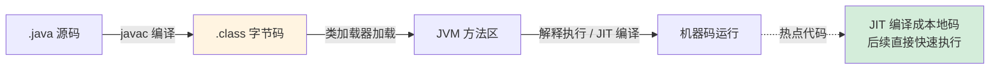

# 3.3 JVM 运行时：你的代码从 `.java` 到运行经历了什么

> 你写了一辈子 Java，但你的代码到底跑在哪、内存怎么分、垃圾怎么回收、类怎么加载？
> 这一节把 JVM 这个「你天天用却看不见的运行时」讲清楚，它是后面对比 Go/Rust「无 VM、无 GC」的基准。

---

## 一、从源码到运行：一条完整的链路

先建立全局视角。你的 `HelloWorld.java` 到底经历了什么？



关键点：

1. **`javac` 把源码编译成字节码（`.class`）**，不是机器码。字节码是 JVM 能懂的「中间语言」。
2. **JVM 加载字节码并执行**。一开始是**解释执行**（一条条翻译），跑得慢。
3. **JIT（即时编译）** 发现「热点代码」（被反复执行的方法）后，把它**编译成本地机器码**，后续直接快速执行。这是 Java「运行越久越快」的原因。

> 这就是 Java「一次编写，到处运行」的根基：字节码与平台无关，只要目标机器有 JVM 就能跑。
> **对比钩子**：[Go 和 Rust](../part4-multilang-compare/01-高并发HTTP服务对比.md) 走的是另一条路——**直接编译成目标平台的机器码**，没有 VM、没有解释、没有 JIT 预热，启动即全速。代价是「编译产物与平台绑定」。这个根本差异，后面会反复影响性能、启动速度、部署形态的对比。

---

## 二、运行时内存结构：数据都放哪

JVM 运行时把内存划分为几块区域，理解它们是排查内存问题的基础：

```
┌─────────────────────────────────────────┐
│              JVM 运行时内存                 │
│                                           │
│  ┌──────────┐  线程私有     ┌──────────┐  │
│  │ 虚拟机栈   │  每个线程一份  │ 程序计数器 │  │
│  │ (栈帧/局部 │              │ (当前指令) │  │
│  │  变量)    │              └──────────┘  │
│  └──────────┘                            │
│                                           │
│  ┌─────────────────────────────────────┐ │
│  │            堆 (Heap) 线程共享          │ │
│  │  所有对象实例都在这里                   │ │
│  │  ┌─────────┐      ┌──────────────┐  │ │
│  │  │ 新生代    │ ───> │   老年代       │  │ │
│  │  │ (新对象)  │ 晋升  │ (长寿对象)     │  │ │
│  │  └─────────┘      └──────────────┘  │ │
│  └─────────────────────────────────────┘ │
│                                           │
│  ┌──────────────────────────────────────┐│
│  │  方法区/元空间 (类信息、常量、静态变量)    ││
│  └──────────────────────────────────────┘│
└─────────────────────────────────────────┘
```

你最该记住的两个区域，以及它们的本质区别：

| 区域 | 存什么 | 线程共享? | 生命周期 |
|------|--------|----------|---------|
| **栈（Stack）** | 局部变量、方法调用帧、对象引用 | 每个线程私有 | 随方法调用/返回自动分配回收 |
| **堆（Heap）** | 所有对象实例（`new` 出来的） | 所有线程共享 | 由 GC 管理回收 |

一个关键认知：**`new` 出来的对象在堆上，但指向它的「引用」（变量）在栈上**。

```java
void method() {
    User u = new User();   // User 对象在【堆】，引用变量 u 在【栈】
}   // 方法结束，栈上的 u 自动消失；堆上的 User 对象等 GC 回收
```

> 这个「引用在栈、对象在堆，由 GC 回收」的模型，是 Java 内存管理的核心。
> **对比钩子**：[Rust](../part4-multilang-compare/04-Java到Rust.md) 用**所有权**机制，让对象在「拥有者离开作用域时立即确定性回收」，**没有 GC**；[Go](../part4-multilang-compare/03-Java到Go.md) 有 GC 但通过逃逸分析尽量把对象分配在栈上。这些设计差异，第四章会专门对比。

---

## 三、垃圾回收（GC）：自动内存管理的代价与红利

Java 最大的「红利」之一就是 **GC 自动回收不再使用的对象**，你不用像 C/C++ 那样手动 `free`。但红利背后有代价，理解它才能用好。

**GC 怎么判断对象「该回收」？** 主流是**可达性分析**：从一组「根对象」（GC Roots，如栈上的引用、静态变量）出发，能引用到的对象都「存活」，引用不到的就是垃圾。

```
GC Roots (栈引用/静态变量)
   │
   ├──> 对象A ──> 对象B      ← 可达，存活
   │
   └──> 对象C               ← 可达，存活

       对象D ──> 对象E       ← 不可达（没有根能到达），回收！
```

**分代回收**：基于「大部分对象朝生夕死」的经验，堆分为新生代（频繁、快速回收）和老年代（少回收、对象长寿）。新对象先进新生代，熬过多次 GC 后「晋升」到老年代。

**GC 的代价——STW（Stop The World）**：GC 工作时可能要**暂停所有应用线程**。这就是为什么你的服务偶尔会有「卡顿毛刺」。现代 GC（G1、ZGC、Shenandoah）拼命缩短 STW 时间：

| 收集器 | 特点 | 适用 |
|--------|------|------|
| Parallel GC | 吞吐优先，STW 较长 | 批处理、后台计算 |
| G1 GC | 平衡吞吐与停顿（JDK 9+ 默认） | 大多数在线服务 |
| ZGC / Shenandoah | 超低停顿（亚毫秒级） | 对延迟极敏感的服务 |

> **对比钩子**：GC 是「便利」和「不可预测的停顿」之间的权衡。[Rust](../part4-multilang-compare/04-Java到Rust.md) 选择**没有 GC**——靠所有权在编译期确定回收时机，因此**没有 STW、内存占用可预测**，代价是写代码时要满足借用检查器。[Go](../part4-multilang-compare/03-Java到Go.md) 选择**低延迟并发 GC**。这条「要不要 GC、要什么样的 GC」的分岔，是系统语言设计的核心抉择之一。

---

## 四、类加载机制：类是怎么进 JVM 的

JVM 不是一上来就加载所有类，而是**用到时才加载（懒加载）**。类加载经历：加载 → 验证 → 准备 → 解析 → 初始化。你最需要理解的是**双亲委派模型**：

```
            启动类加载器 (Bootstrap)      ← 加载核心类库 (java.*)
                  ▲ 委派
            扩展类加载器 (Platform)
                  ▲ 委派
            应用类加载器 (Application)     ← 加载你的 classpath 代码
                  ▲ 委派
            自定义类加载器
```

**双亲委派**的逻辑：一个类加载器收到加载请求，先**往上委派给父加载器**，父加载器能加载就用父的，加载不了才自己来。

为什么这么设计？**为了安全和唯一性**。比如你写了个 `java.lang.String`，企图替换核心库——双亲委派会把它委派给启动类加载器，启动类加载器加载了官方的 `String`，你的山寨版根本没机会被加载。这保证了核心类不被篡改，且同一个类在 JVM 中**全局唯一**。

> 实战中你会在这些场景碰到类加载：Tomcat 的应用隔离、热部署、SPI 机制、各种「ClassNotFoundException / NoClassDefFoundError」排查。理解双亲委派，这些问题就有了分析框架。

---

## 五、给后端大脑的速查表

| 概念 | 一句话本质 | 实战意义 |
|------|-----------|---------|
| 字节码 + JVM | 平台无关的中间码 + 解释/JIT 执行 | 跨平台、运行越久越快 |
| 栈 | 局部变量、引用、调用帧，线程私有 | 方法结束自动回收 |
| 堆 | 所有对象实例，线程共享 | GC 管理，可能 OOM |
| GC | 自动回收不可达对象 | 省心，但有 STW 停顿 |
| 分代 | 新生代频繁快收，老年代少收 | 调优的基础概念 |
| 双亲委派 | 加载先往上委派父加载器 | 保证核心类安全与唯一 |

---

## 本章小结

- Java 代码经 `javac` 编成**字节码**，由 **JVM** 解释执行 + **JIT** 把热点编成机器码（运行越久越快）。
- 运行时内存核心是**栈**（局部变量/引用，线程私有，自动回收）和**堆**（对象实例，线程共享，GC 回收）。
- **GC** 用可达性分析 + 分代回收，自动管理内存，代价是 **STW 停顿**；G1/ZGC 致力于压低停顿。
- **类加载**用双亲委派模型保证核心类的安全与全局唯一。
- 这一整套「VM + GC + 类加载」是 Java 的运行时基石，也是第四章对比 [Go](../part4-multilang-compare/03-Java到Go.md)（编译机器码 + 并发 GC）和 [Rust](../part4-multilang-compare/04-Java到Rust.md)（编译机器码 + 无 GC + 所有权）的基准。

---

[← 上一节：3.2 内存模型 JMM](./02-内存模型JMM.md) | [下一节：3.4 类型系统 →](./04-类型系统.md)
