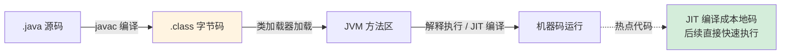
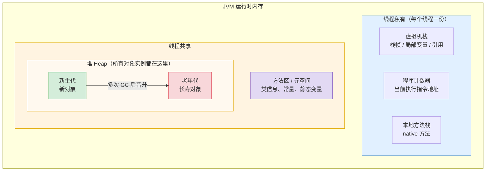
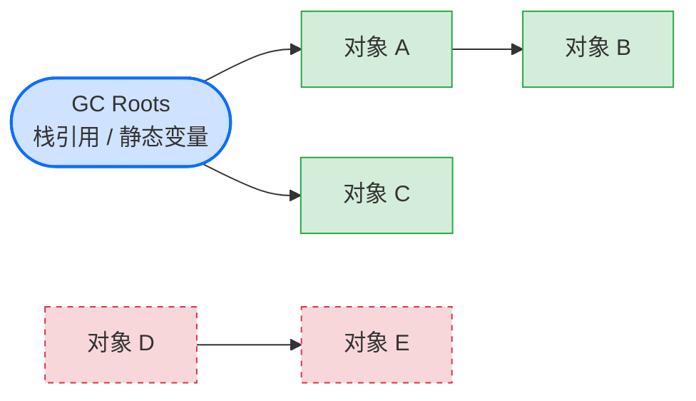
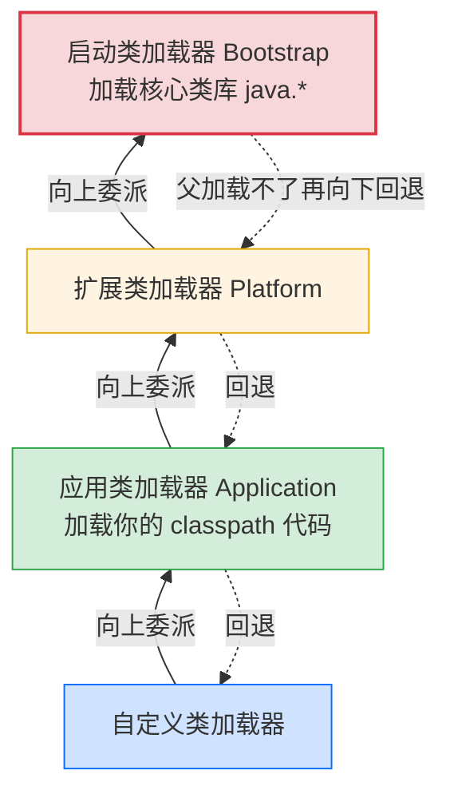
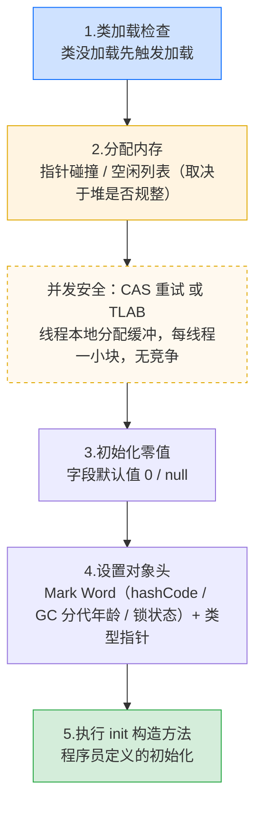
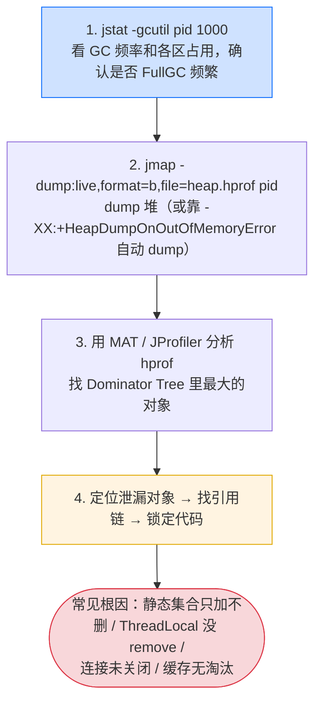
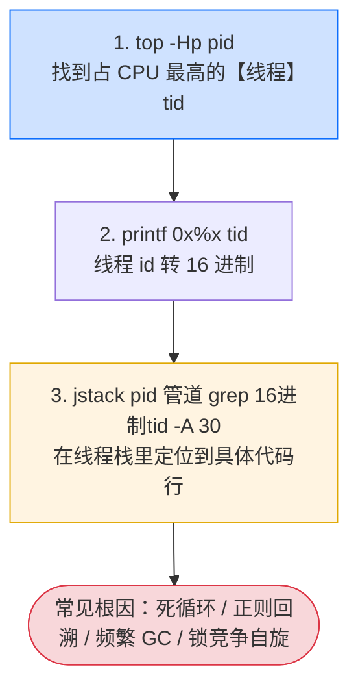

# 3.3 JVM 运行时：你的代码从 `.java` 到运行经历了什么

> 你写了一辈子 Java，但你的代码到底跑在哪、内存怎么分、垃圾怎么回收、类怎么加载？
> 这一节把 JVM 这个「你天天用却看不见的运行时」讲清楚，它是后面对比 Go/Rust「无 VM、无 GC」的基准。

---

## 一、从源码到运行：一条完整的链路

先建立全局视角。你的 `HelloWorld.java` 到底经历了什么？



关键点：

1. **`javac` 把源码编译成字节码（Bytecode，`.class`）**，不是机器码。字节码是 JVM 能懂的「中间语言」。
2. **JVM 加载字节码并执行**。一开始是**解释执行（Interpretation）**（一条条翻译），跑得慢。
3. **JIT（即时编译，Just-In-Time Compilation）** 发现「热点代码（Hotspot Code）」（被反复执行的方法）后，把它**编译成本地机器码**，后续直接快速执行。这是 Java「运行越久越快」的原因。

<details>
<summary><b>展开：解释执行和 JIT 都是跑机器码，到底差在哪？</b></summary>

先说清「本地机器码」这个词：它就是**原生机器码（native machine code，简称 native code）**——真实物理 CPU 直接能认、不再经过 JVM 这层抽象的指令。这里的「本地 / native」对照的是**「字节码」这种「虚拟机的码」**：字节码是给 JVM 这台虚拟机看的中间语言，而 native code 是落到真机、脱离虚拟机后直接执行的码。所以「本地机器码」「原生机器码」「native code」说的是同一个东西，后文统一这么理解即可。（顺带：JNI 是 Java **Native** Interface、GraalVM 的 AOT 产物叫 **Native** Image，这里的 native 全是「脱离 JVM 抽象、直接面向真机」之意。）

回到正题。解释执行和 JIT 编译，最终都是在本机 CPU 上执行 native code——这一点完全一致。它们的区别**不在「跑不跑机器码」，而在「字节码 → 机器指令的转换发生在什么时机、以什么粒度、转换结果有没有被保存复用」**。

**解释执行（Interpretation）——逐条翻译，即翻即丢，不为你的方法生成新机器码**

解释器内部，对每一条字节码指令（如 `iadd`、`getfield`）都预先写好了一段对应的处理逻辑——这些逻辑早在 JVM 自身被编译时就已经是机器码了，固化在解释器里。运行时它做的是：读一条字节码 → 跳去执行那段「早已存在的」处理片段 → 读下一条 → 再跳……

所以解释执行**不会针对你的业务方法生成一段新的、连续的机器码**，它只是反复复用 JVM 内部那些「每条指令的处理片段」。优点是没有编译开销、启动快；缺点是同一行代码循环一万次，就要重复「取字节码 → 指令分发 → 跳转」一万次，纯属重复劳动，所以慢。

**JIT 编译（Just-In-Time Compilation）——整段预译，缓存复用，生成全新机器码**

JIT 针对一整个热点方法，**当场生成一段全新的、连续优化过的本地机器码**，缓存进 Code Cache。之后再调用该方法，直接跳进这段机器码全速运行，**不再经过字节码逐条分发**。

而且关键在于「运行时」三个字：JIT 编译时能拿到程序实际跑出来的运行数据（哪个分支常走、哪个对象没逃逸、哪个虚方法实际只指向一个实现），据此做静态编译器做不到的激进优化——方法内联、逃逸分析、去虚化、冷分支剪枝等。所以热点代码被 JIT 编译后，有时甚至比 C/Go 这类提前编译（AOT）还快。代价是编译本身要耗 CPU 和内存，因此只有反复执行、值得回本的「热点」才会被编译。

**一句话对比**

| 维度 | 解释执行 | JIT 编译 |
|------|---------|---------|
| 转换时机 | 边执行边翻译，每次都翻 | 热点触发时一次性编译 |
| 转换粒度 | 一条字节码一条 | 整个方法 |
| 结果是否保存 | 不保存，即翻即丢 | 缓存进 Code Cache 复用 |
| 是否生成新机器码 | 否（复用 JVM 内置片段） | 是（生成专属优化机器码） |
| 启动速度 | 快（无编译开销） | 慢（要先编译预热） |
| 长跑性能 | 慢 | 快（运行越久越快） |
| 能否用运行时数据优化 | 否 | 能（这是 JIT 的杀手锏） |

> 打个比方：**解释执行像同声传译——演讲者说一句、翻译官当场翻一句，即时进行、说完就忘，下次再听到同样的话还得重翻一遍**；**JIT 像把一整首诗提前译好存稿——以后任何人再提到这首诗，直接拿出之前译好的稿子，不必重译**。两者说的都是「native code」这门语言，差别只是一个临场逐句口译不留稿、一个整段预译并缓存复用。
>
> JVM 实际是**两者混合**：方法刚开始一律解释执行（省去冷启动编译开销），执行次数超过阈值（默认约 1 万次，受 `-XX:CompileThreshold` 影响）才升级为 JIT 编译。HotSpot 这个名字，正是来源于「找出 Hotspot 热点代码再重点编译」这一策略。

</details>

> 这就是 Java「一次编写，到处运行」的根基：字节码与平台无关，只要目标机器有 JVM 就能跑。
> **对比钩子**：[Go 和 Rust](../part4-multilang-compare/01-高并发HTTP服务对比.md) 走的是另一条路——**直接编译成目标平台的机器码**，没有 VM、没有解释、没有 JIT 预热，启动即全速。代价是「编译产物与平台绑定」。这个根本差异，后面会反复影响性能、启动速度、部署形态的对比。

---

## 二、运行时内存结构：数据都放哪

JVM 运行时把内存划分为几块区域，理解它们是排查内存问题的基础：



你最该记住的两个区域，以及它们的本质区别：

| 区域 | 存什么 | 线程共享? | 生命周期 |
|------|--------|----------|---------|
| **栈（Stack）** | 局部变量、方法调用帧、对象引用 | 每个线程私有 | 随方法调用/返回自动分配回收 |
| **堆（Heap）** | 所有对象实例（`new` 出来的） | 所有线程共享 | 由 GC 管理回收 |

一个关键认知：**`new` 出来的对象在堆上，但指向它的「引用」（变量）在栈上**。

```java
void method() {
    User u = new User();   // User 对象在【堆】，引用变量 u 在【栈】
}   // 方法结束，栈上的 u 自动消失；堆上的 User 对象等 GC 回收
```

> 这个「引用在栈、对象在堆，由 GC 回收」的模型，是 Java 内存管理的核心。
> **对比钩子**：[Rust](../part4-multilang-compare/04-Java到Rust.md) 用**所有权**机制，让对象在「拥有者离开作用域时立即确定性回收」，**没有 GC**；[Go](../part4-multilang-compare/03-Java到Go.md) 有 GC 但通过逃逸分析尽量把对象分配在栈上。这些设计差异，第四章会专门对比。

---

## 三、垃圾回收（GC）：自动内存管理的代价与红利

Java 最大的「红利」之一就是 **GC 自动回收不再使用的对象**，你不用像 C/C++ 那样手动 `free`。但红利背后有代价，理解它才能用好。

**GC 怎么判断对象「该回收」？** 主流是**可达性分析（Reachability Analysis）**：从一组「根对象」（GC Roots，如栈上的引用、静态变量）出发，能引用到的对象都「存活」，引用不到的就是垃圾。



> 绿色（A/B/C）从 GC Roots 可达，**存活**；红色虚线（D/E）没有任何根能到达，即使它们互相引用，也是**不可达 → 回收**。

**分代回收（Generational Collection）**：基于「大部分对象朝生夕死」的经验，堆分为新生代（Young Generation，频繁、快速回收）和老年代（Old Generation，少回收、对象长寿）。新对象先进新生代，熬过多次 GC 后「晋升（Promotion）」到老年代。

**GC 的代价——STW（Stop The World，停顿世界）**：GC 工作时可能要**暂停所有应用线程**。这就是为什么你的服务偶尔会有「卡顿毛刺」。现代 GC（G1、ZGC、Shenandoah）拼命缩短 STW 时间：

| 收集器 | 特点 | 适用 |
|--------|------|------|
| Parallel GC | 吞吐优先，STW 较长 | 批处理、后台计算 |
| G1 GC | 平衡吞吐与停顿（JDK 9+ 默认） | 大多数在线服务 |
| ZGC / Shenandoah | 超低停顿（亚毫秒级） | 对延迟极敏感的服务 |

> **对比钩子**：GC 是「便利」和「不可预测的停顿」之间的权衡。[Rust](../part4-multilang-compare/04-Java到Rust.md) 选择**没有 GC**——靠所有权在编译期确定回收时机，因此**没有 STW、内存占用可预测**，代价是写代码时要满足借用检查器。[Go](../part4-multilang-compare/03-Java到Go.md) 选择**低延迟并发 GC**。这条「要不要 GC、要什么样的 GC」的分岔，是系统语言设计的核心抉择之一。

---

## 四、类加载机制：类是怎么进 JVM 的

JVM 不是一上来就加载所有类，而是**用到时才加载（懒加载，Lazy Loading）**。类加载经历：加载（Loading）→ 验证（Verification）→ 准备（Preparation）→ 解析（Resolution）→ 初始化（Initialization）。你最需要理解的是**双亲委派模型（Parent Delegation Model）**：



**双亲委派（Parent Delegation）**的逻辑：一个类加载器（ClassLoader）收到加载请求，先**往上委派给父加载器（Parent ClassLoader）**，父加载器能加载就用父的，加载不了才自己来。

为什么这么设计？**为了安全和唯一性**。比如你写了个 `java.lang.String`，企图替换核心库——双亲委派会把它委派给启动类加载器，启动类加载器加载了官方的 `String`，你的山寨版根本没机会被加载。这保证了核心类不被篡改，且同一个类在 JVM 中**全局唯一**。

<details>
<summary><b>展开：「收到加载请求」是什么时候？谁发的请求？每 new 一个实例就请求一次吗？</b></summary>

**先纠一个常见误解：类加载 ≠ 创建实例，两者发生的「次数」完全不同。**

- **类加载（Loading）针对「类」，每个类一辈子只加载一次。** 加载完，这个类的 `Class` 对象就缓存在方法区（元空间），以后再用到该类直接取缓存，不再重新加载。
- **创建实例（`new`）针对「对象」，每 `new` 一次就创建一个新对象。**

所以 `new Foo()` 执行 1000 次，**只会加载 `Foo` 这个类 1 次**（第一次那次），却会创建 1000 个 `Foo` 实例。你说的「运行时每创建一个实例就是一次加载请求」是个典型误区——加载是「每类一次」，创建是「每 new 一次」。

**那「请求」到底什么时候发、谁发的？**

不是程序启动时一次性把所有类全加载，也不是按实例数发请求，而是：**JVM 执行引擎执行到某条字节码、第一次需要用到一个「还没加载过的类」时，由 JVM 自己去调用对应类加载器的 `loadClass`。** 请求方是 **JVM 执行引擎本身**，不是你的代码主动喊「加载它」。

什么算「第一次需要用到」？就是 6 种**主动引用**（详见后文考点 7），归纳起来：

| 触发场景 | 例子 |
|---------|------|
| 第一次 `new` 这个类 | `new Foo()` |
| 第一次读写它的静态字段（非编译期常量） | `Foo.count`、`Foo.flag = true` |
| 第一次调它的静态方法 | `Foo.init()` |
| 反射 | `Class.forName("Foo")` |
| 初始化子类，触发父类先加载 | `new SubFoo()` 会先加载 `Foo` |
| 作为程序入口的主类 | 含 `main` 的那个类，启动时即加载 |

> 一句话：**「用到时才加载（懒加载），且每个类只加载一次」**。请求由 JVM 执行引擎在「首次主动使用某类」时发出，与你 new 了多少个实例无关。

</details>

<details>
<summary><b>展开：核心作用只是「防篡改」吗？为什么不用「固定位置加载核心类」这种更简单的方式？</b></summary>

「防核心类被篡改」是双亲委派最常被提到的作用，但它**不是唯一、也不是最根本的**。它实际一并解决了三件事：

1. **安全**：核心类不会被你写的同名类覆盖。
2. **唯一性（这才是命根子）**：同一个类在整个 JVM 中只有一份。
3. **职责清晰**：各层加载器分工明确，不重复加载。

**为什么「固定位置加载核心类」替代不了？因为它只能解决第 1 件，解决不了第 2 件——而唯一性才是 JVM 类型系统的根基。**

关键在于 JVM 判断「两个类是不是同一个类」的标准：**不是「全限定名相同」就行，而是「全限定名相同 + 加载它的类加载器也相同」**。换句话说——

> 同一个 `com.foo.Bar`，若被**两个不同的类加载器**各加载一次，JVM 会把它们当成**两个互不相容的类**：互相赋值抛 `ClassCastException`、`instanceof` 返回 `false`，哪怕字节码一模一样。

「固定位置」方案只规定了「核心类从哪个目录读」，却**没规定「由谁来加载」**。如果允许每个类加载器都自己跑去那个固定目录读一遍 `java.lang.String` 各自加载，JVM 里就会冒出好几个互不相容的 `String`，类型系统当场崩溃。

而双亲委派用「层层向上委派」这**一个**机制，一石三鸟：大家加载核心类时都把请求上交给**同一个**启动类加载器，于是核心类永远由它加载 ——

- 你的山寨版没机会被加载 → **安全**；
- 全 JVM 只有它加载的那一份 → **唯一**；
- 各层职责由委派链天然划定 → **不重复**。

| 方案 | 防篡改 | 全局唯一 | 职责清晰 |
|------|:---:|:---:|:---:|
| 固定位置加载核心类 | ✅ | ❌（谁都能自己加载一份） | ❌ |
| 双亲委派 | ✅ | ✅ | ✅ |

> 一句话：**「防篡改」只是结果之一，「让核心类永远由唯一的启动类加载器加载、从而全局唯一」才是机制本身。** 固定位置只规定了「数据从哪读」，规定不了「由谁加载」，所以补不上唯一性这块短板。

</details>

<details>
<summary><b>展开：为什么叫「双亲」？到底是哪「两个」亲？</b></summary>

**结论先行：「双亲委派」里的「双亲」其实是个翻译误会，原文 `Parent Delegation Model` 里只有一个 `Parent`（父），并不存在「两个父母」。准确叫法应是「父级委派模型」。**

拆开看这个误会是怎么来的：

- 英文原词是 **`Parent Delegation Model`**，`Parent` 是单数，指「（每一层各自的）父加载器」。
- 翻译成中文时，有人把 `Parent` 译成了「双亲」（中文里「双亲」=父母两人）。于是很多人就开始找「是哪两个加载器」，越想越绕——**这个问题本身是个伪命题**。

那为什么 `Parent` 容易被误读成「两个」？因为类加载器确实是一条**多层链**，每一层都有它的「上一层父加载器」：

```
自定义类加载器  ──父──>  应用类加载器  ──父──>  扩展类加载器  ──父──>  启动类加载器
```

这里的「父子」是**逐层单向**的关系（每个加载器只有一个直接父加载器），不是「一个孩子有爸和妈两个父母」。所以：

- ❌ 错误理解：双亲 = 某两个固定的加载器（比如「启动 + 应用」两个）。
- ✅ 正确理解：每个加载器都有**一个**父加载器，加载时**层层向上委派给父**，直到顶层启动类加载器；这条链上每一环的「父」都是单数。

> 补充一个实现细节：这里的「父子」**不是 Java 的继承关系（`extends`）**，而是通过 `ClassLoader` 内部的 `parent` 字段组合（composition）持有的——子加载器对象里有一个字段指向它的父加载器对象。所以严格说是「持有关系」而非「继承关系」。

一句话记住：**「双亲」是 `Parent`（父）的不准确翻译，实际只有「一个父」，是一条逐层向上的单父链，不存在「哪两个」。**

</details>

<details>
<summary><b>展开：类加载后会被卸载/释放吗？还是永远在内存里？</b></summary>

**结论：类有卸载（Unloading）机制，不是永远在内存里——但触发条件极其苛刻，普通业务里几乎不会发生，所以「感觉上」常驻。** 这是「类版的 GC」，只是比对象 GC 难触发得多。

**类被卸载，必须同时满足三个条件（缺一不可）：**

1. 该类的**所有实例都已被回收**（堆里没有任何该类的对象还活着）。
2. 加载该类的**类加载器（ClassLoader）本身被回收**了。
3. 该类的 **`Class` 对象没有被任何地方引用**（没人持有、没在反射等处引用）。

卡点在第 2 条：**一个类能否卸载，命运绑定在「加载它的那个类加载器」身上——只要那个加载器还活着，它加载过的所有类就全卸不掉。**

由此推出几个关键结论：

- **核心类几乎永不卸载**：`java.lang.String` 等核心类由**启动类加载器（Bootstrap）**加载，而启动类加载器在整个 JVM 生命周期里**永远存活**，所以核心类永远在内存里。
- **普通业务类基本也常驻**：你 classpath 里的类由**应用类加载器**加载，应用类加载器通常活到 JVM 退出，所以你写的类一般也卸不掉。这就是平时「感觉类加载后就一直在」的原因。
- **真正会卸载类的，只有自定义类加载器场景**：典型是 **Tomcat 等容器的热部署 / reload**——重新部署 webapp 时，旧的 `WebappClassLoader` 被整个丢弃，连同它加载的所有应用类一起卸载，再用新加载器加载新版本。OSGi 模块化、JSP 改动重编译、插件化框架，也都是靠「丢弃旧类加载器」来卸载旧类。这正是热部署能「换掉旧类」的底层原理。

**类元数据存在哪？为什么和内存泄漏有关？**

类的元数据（`Class` 信息）的存储位置在 JDK 8 发生过迁移：

| 版本 | 存储区 | 特点与坑 |
|------|--------|---------|
| JDK 7 及以前 | 永久代（PermGen） | 在堆内、空间小且固定；自定义加载器频繁创建又不释放 → `OutOfMemoryError: PermGen space`（典型：Tomcat 反复热部署导致旧加载器泄漏） |
| JDK 8 及以后 | 元空间（Metaspace） | 用本地内存、默认不设上限（`-XX:MaxMetaspaceSize` 可限制）；缓解了固定上限问题，但加载器泄漏仍会让 Metaspace 持续上涨 → `OutOfMemoryError: Metaspace` |

> 一句话：**类能卸载，但要「实例全没 + 加载它的类加载器被回收 + Class 无引用」三者同时满足；核心类和业务类因加载器常驻而几乎永不卸载；真正发生类卸载的是「自定义类加载器 + 热部署/模块化」场景，这也正是 PermGen/Metaspace 内存泄漏的高发区。**

</details>

> 实战中你会在这些场景碰到类加载：Tomcat 的应用隔离、热部署、SPI 机制、各种「ClassNotFoundException / NoClassDefFoundError」排查。理解双亲委派，这些问题就有了分析框架。

---

## 五、给后端大脑的速查表

| 概念 | 一句话本质 | 实战意义 |
|------|-----------|---------|
| 字节码 + JVM | 平台无关的中间码 + 解释/JIT 执行 | 跨平台、运行越久越快 |
| 栈 | 局部变量、引用、调用帧，线程私有 | 方法结束自动回收 |
| 堆 | 所有对象实例，线程共享 | GC 管理，可能 OOM |
| GC | 自动回收不可达对象 | 省心，但有 STW 停顿 |
| 分代 | 新生代频繁快收，老年代少收 | 调优的基础概念 |
| 双亲委派（Parent Delegation） | 加载先往上委派父加载器 | 保证核心类安全与唯一 |

---

## 六、面试深度剖析：大厂高频考点

> JVM 是大厂面试的「硬通货」，尤其考察**线上问题排查能力**——这正是区分「背过八股」和「真扛过线上事故」的地方。下面按高频考点的追问链展开。

### 考点 1：内存区域哪些线程私有、哪些共享，哪些会 OOM/SOF（必考）

**面试官**：「JVM 内存分哪几块？哪些线程私有？哪些会发生什么错误？」

| 区域 | 线程私有/共享 | 可能的错误 |
|------|-------------|-----------|
| 程序计数器 | 私有 | **唯一不会 OOM** 的区域 |
| 虚拟机栈 | 私有 | 栈深度超限 → `StackOverflowError`；扩展失败 → OOM |
| 本地方法栈 | 私有 | 同上（native 方法） |
| 堆 | 共享 | `OutOfMemoryError: Java heap space`（最常见） |
| 方法区/元空间（Method Area / Metaspace） | 共享 | `OutOfMemoryError: Metaspace`（动态生成类过多） |

> **陷阱**：程序计数器是唯一不会 OOM 的区域，常被拿来考。元空间（JDK 8 用本地内存替代了永久代 PermGen）OOM 常见于大量动态生成类（CGLIB、反射、热部署）。

<details>
<summary><b>展开：OOM 到底有几种？每一种的触发原理和典型场景（建议系统掌握，面试 + 线上排查双高频）</b></summary>

很多人以为 OOM 就是「堆满了」，其实 `OutOfMemoryError` 是一类错误的统称，**错误信息后面那串文字才是真正的「病因」**。看到 OOM 第一件事永远是看冒号后面那行是什么。下面按内存区域和成因，把常见的 OOM 类型逐一拆解。

**总览表（先建立全景）**

| OOM 类型（错误信息） | 内存区域 | 一句话病因 |
|---------------------|---------|-----------|
| `Java heap space` | 堆 | 对象太多 / 内存泄漏 / 堆太小 |
| `GC overhead limit exceeded` | 堆 | GC 拼命回收却几乎收不回来 |
| `Metaspace` / `PermGen space` | 元空间 / 永久代 | 动态生成类过多、类加载器泄漏 |
| `Direct buffer memory` | 堆外（直接内存） | NIO/Netty 直接内存未释放 |
| `Unable to create new native thread` | 栈（本地内存） | 线程开太多，本地内存/系统线程数耗尽 |
| `Requested array size exceeds VM limit` | 堆 | 申请的数组长度超过 JVM 上限 |
| `Out of swap space` | 本地内存 | 本地内存 + 交换区都不够了 |
| 被系统 OOM Killer 杀（非 JVM 抛出） | 物理内存 | 进程总内存超出宿主机/容器限制 |

**① 堆溢出 `Java heap space`（最常见）**

原理：新对象要在堆里分配，但 GC 后堆里仍腾不出足够空间。两类成因——一是**真·内存泄漏**：对象本该被回收却被 GC Root 链一直引用着（静态集合只加不删、缓存无淘汰、监听器/回调没注销）；二是**容量不匹配**：堆本身就配小了，或一次性加载海量数据（如 `SELECT *` 把百万行查进内存、一次读超大文件到 `byte[]`）。
典型场景：`static Map` 当缓存只 put 不 evict；大结果集全量装入 List；图片/文件全量读进内存。
排查：`-XX:+HeapDumpOnOutOfMemoryError` 自动 dump，用 MAT 看 Dominator Tree 找最大对象 + 引用链。

**② `GC overhead limit exceeded`（堆的「慢性死亡」版）**

原理：默认规则——**JVM 花了超过 98% 的时间做 GC，却只回收回不到 2% 的堆**，连续多次如此就抛此错。本质和堆溢出同源（内存不够），但表现是「还没彻底满，但 GC 已经在做无用功、CPU 被 GC 吃光」。它其实是 JVM 的一种「提前止损」——与其让你卡在无尽 Full GC 里假死，不如直接抛错。
典型场景：堆接近满载、对象勉强够回收一点点又马上被填满；常出现在堆配置略小 + 持续高分配的服务。
排查：和堆溢出一样 dump 分析；治标可加大堆，治本要找泄漏/降分配。

**③ 元空间 / 永久代 `Metaspace` / `PermGen space`（类太多）**

原理：存的不是对象，而是**类的元数据**。JDK 7 及以前在永久代（PermGen，固定上限），JDK 8 起改到元空间（Metaspace，本地内存）。当**加载的类数量持续增长且卸不掉**，这块就会涨爆。
典型场景：**大量动态生成类**——CGLIB/ASM 动态代理（Spring AOP、MyBatis、ORM 每个代理都是一个新类）、反射频繁生成 `GeneratedConstructorAccessor`、Groovy/脚本引擎每次编译都生成新类、Tomcat 反复热部署导致旧类加载器泄漏（旧类卸不掉）。
排查：`-XX:MaxMetaspaceSize` 限制 + 监控 Metaspace 曲线；若持续单调上涨基本就是类加载器泄漏，用 `jmap -clstats` 看类加载器统计。

**④ 直接内存 `Direct buffer memory`（堆外内存，最隐蔽）**

原理：`ByteBuffer.allocateDirect()` 申请的是**堆外（本地）内存**，不受 `-Xmx` 控制，由 `-XX:MaxDirectMemorySize` 限制。这块内存的释放依赖对应的 `DirectByteBuffer` 对象被 GC 后触发 Cleaner 回收——**问题就在这：堆外内存的命运绑在一个堆内小对象上**。如果堆内还很空、迟迟不触发 GC，堆外内存就一直不释放，越积越多直到爆。
典型场景：Netty、NIO、RPC 框架（Thrift/gRPC）、Kafka 客户端大量用直接内存做零拷贝；高并发下 DirectBuffer 申请快于回收。
排查：看 `Direct buffer memory` 字样；用 `-XX:MaxDirectMemorySize` 设上限让问题更早暴露；Netty 可开 `io.netty.leakDetection` 检测泄漏。

**⑤ `Unable to create new native thread`（线程开爆）**

原理：注意——**这个 OOM 跟堆没关系**。每创建一个 Java 线程，JVM 要向操作系统申请一块本地内存做线程栈（默认约 1MB，受 `-Xss` 控制）。当线程数过多时，要么**本地内存被线程栈吃光**，要么撞上**操作系统的线程数上限**（如 Linux `ulimit -u`、`pid_max`），就再也创建不出新线程。
典型场景：每个请求 new 一个线程不复用、线程池配置无上限或 `newCachedThreadPool` 被打满、连接数暴涨各自起线程。一个反直觉现象：**堆调得越大，留给线程栈的本地内存反而越少**，所以盲目加 `-Xmx` 可能加剧此类 OOM。
排查：`jstack` 看线程数和状态；查 `ulimit -u`；用有界线程池。

**⑥ `Requested array size exceeds VM limit`（数组超限）**

原理：代码申请了一个**长度超过 JVM 允许上限**的数组（通常接近 `Integer.MAX_VALUE`，约 21 亿）。即使堆足够大也会抛，因为这是 JVM 对单个数组长度的硬限制。
典型场景：分页/批处理算错了 size、用户传入的长度未校验、`new byte[someHugeInt]`。
排查：基本是代码 bug，定位那行数组分配即可，加长度校验。

**⑦ `Out of swap space`（本地内存彻底枯竭）**

原理：JVM 想向 OS 申请本地内存，但**物理内存 + 交换分区（swap）都满了**。多见于 JVM 本身（堆 + 元空间 + 直接内存 + 线程栈）加上同机其他进程，把整机内存挤干。
典型场景：单机部署多个大内存 JVM、容器内存上限设置不当、直接内存/Native 内存泄漏拖垮整机。
排查：看系统 `free`/`vmstat`，往往要从「整机内存预算」而非单个 JVM 角度排查。

**⑧ 被系统 OOM Killer 杀（容器时代最坑，不是 JVM 抛的）**

原理：这条严格说**不是 `OutOfMemoryError`**——进程根本来不及抛错就被干掉了。当**进程实际占用的物理内存超过宿主机/容器（cgroup）限制**，Linux 内核的 OOM Killer 会直接 `kill -9` 掉它。日志里看不到 Java 异常栈，只在 `dmesg`/系统日志里看到「Killed process」。
典型场景：**K8s/Docker 里最高频**——`-Xmx` 设得和容器 limit 一样大，却忘了 JVM 还要额外占用元空间、直接内存、线程栈、JVM 自身开销，结果总内存超过 limit 被 cgroup 杀。表现为「Pod 莫名重启、Exit Code 137」却没有任何 OOM 堆栈。
排查：`dmesg | grep -i kill`、看容器 Exit Code 137（=128+9）；解法是给 JVM 留出堆外余量（`-Xmx` 设为容器 limit 的 ~70%，或用 `-XX:MaxRAMPercentage`）。

> **总结心法**：① 看到 OOM 先看冒号后那行文字，定位是哪一类；② **不是所有 OOM 都在堆**——元空间、直接内存、线程栈都是本地内存，加 `-Xmx` 不但没用反而可能更糟；③ 容器里「没堆栈的重启 + Exit 137」要第一时间怀疑被 OOM Killer 杀，根因是没给堆外内存留预算。一句话：**OOM 不等于堆满，更不等于内存泄漏——它可能是泄漏、可能是配置不匹配、也可能是一次性分配过猛。**

</details>

### 考点 2：对象创建的完整过程 + 内存分配

**面试官**：「`new 一个对象` 在 JVM 里经历了什么？」



> **追问：对象一定分配在堆上吗？** 不一定！**逃逸分析（Escape Analysis）**优化下，如果对象不会逃出方法作用域，JVM 可能做**栈上分配（Stack Allocation）**（随栈帧回收，无 GC 压力）或**标量替换（Scalar Replacement）**（把对象拆成基本类型直接放栈）。这是高级加分点，也呼应了第四章 [Go 的逃逸分析](../part4-multilang-compare/03-Java到Go.md)。

### 考点 3：GC 怎么判断对象存活 + 引用类型

**面试官**：「怎么判断对象该不该回收？为什么不用引用计数？」

- **不用引用计数（Reference Counting）**的原因：**无法解决循环引用（Circular Reference）**（A 引用 B，B 引用 A，互相引用计数都不为 0，但实际已无人使用，永不回收）。
- 用 **可达性分析（Reachability Analysis）**（GC Roots 出发，不可达即回收）。**GC Roots 包括**：虚拟机栈中引用的对象、静态变量引用的对象、常量引用、本地方法栈 JNI 引用、活跃线程。

**追问：四种引用强度？**

| 引用 | 回收时机 | 典型用途 |
|------|---------|---------|
| 强引用 | 永不回收（除非不可达） | 普通 `new` |
| 软引用 SoftReference | **内存不足时**回收 | 缓存（内存敏感） |
| 弱引用 WeakReference | **下次 GC 必回收** | `ThreadLocalMap` 的 key（[见 3.1](./01-并发体系.md)） |
| 虚引用 PhantomReference | 随时被回收，仅用于回收通知 | 堆外内存管理（如 DirectByteBuffer） |

### 考点 4：垃圾回收算法与三色标记（深挖）

**面试官**：「常见 GC 算法？CMS/G1 用的三色标记是怎么回事？漏标怎么解决？」

- 基础算法：**标记-清除（Mark-Sweep）**（产生碎片）、**标记-复制（Mark-Copy）**（新生代用，空间换效率）、**标记-整理（Mark-Compact）**（老年代用，无碎片但慢）。
- **三色标记（Tri-color Marking）**（并发标记的核心）：把对象标记为白（White，未访问）、灰（Gray，自己被访问、引用未扫完）、黑（Black，自己和引用都扫完）。
- **并发标记的问题**：标记过程中应用线程还在改引用，可能**漏标**（把存活对象当垃圾误回收）。解决方案：
  - **CMS 用增量更新（Incremental Update）**：记录新增的「黑→白」引用，重新标记时再扫。
  - **G1 用原始快照（SATB, Snapshot-At-The-Beginning）**：记录被删除的引用，保证标记开始时存活的对象都不被回收。

> 这道题能问到三色标记和 SATB/增量更新，基本是 P6/P7 级别的深度了。

### 考点 5：常见 GC 收集器与选型 + 调优参数

**面试官**：「线上服务你会怎么选 GC？常用调优参数有哪些？」

- **G1**（JDK 9+ 默认）：分 Region 管理，可预测停顿（`-XX:MaxGCPauseMillis`），适合大堆、在线服务。
- **ZGC / Shenandoah**：亚毫秒级停顿，适合对延迟极敏感、超大堆（几十上百 GB）。
- 关键参数（要能说出几个）：

```
-Xms4g -Xmx4g          # 初始/最大堆，生产建议设成相等避免动态扩容抖动
-Xmn2g                 # 新生代大小
-XX:MetaspaceSize=256m # 元空间
-XX:+UseG1GC           # 指定 G1
-XX:MaxGCPauseMillis=200          # G1 目标停顿
-XX:+HeapDumpOnOutOfMemoryError   # OOM 时自动 dump 堆，排查必备
-XX:HeapDumpPath=/path/dump.hprof
```

### 考点 6：线上 OOM / CPU 飙高怎么排查（实战加分项，最能拉开差距）

**面试官**：「线上一个服务内存涨爆了/CPU 100%，你怎么定位？」这是最体现实战的题，给出标准排查链：

**内存泄漏 / OOM 排查**：



**CPU 飙高排查**：



> 能完整说出 `top -Hp → printf → jstack` 这套组合拳，面试官立刻知道你是真排查过线上问题的。这套工具链（jps/jstat/jmap/jstack/jinfo + Arthas）是 Java 工程师的必备武器。

### 考点 7：类加载与「破坏双亲委派」

**面试官**：「双亲委派讲了，那有没有打破它的场景？」

双亲委派不是铁律，有意被打破的经典场景：

- **JDBC（SPI 机制）**：`DriverManager`（核心类，由启动类加载器加载）要加载厂商的 `Driver` 实现（在 classpath，本该由应用类加载器加载）。靠**线程上下文类加载器（ContextClassLoader）** 反向委派给子加载器，打破了双亲委派。
- **Tomcat**：每个 webapp 有独立的类加载器，且**优先加载自己的类**（而非先委派父级），以实现应用间隔离 + 同一容器跑多个版本的库。
- **OSGi / 热部署**：用自定义类加载器实现模块化和热替换。

**追问：类初始化的时机？** 6 种主动引用会触发初始化：`new`、读写静态字段（非常量）、调用静态方法、反射、初始化子类时父类先初始化、作为程序入口的主类。被动引用（如引用静态常量 `final`、用数组定义类）不触发。

---

## 本章小结

- Java 代码经 `javac` 编成**字节码**，由 **JVM** 解释执行 + **JIT** 把热点编成机器码（运行越久越快）。
- 运行时内存核心是**栈**（局部变量/引用，线程私有，自动回收）和**堆**（对象实例，线程共享，GC 回收）。
- **GC** 用可达性分析 + 分代回收，自动管理内存，代价是 **STW 停顿**；G1/ZGC 致力于压低停顿。
- **类加载**用双亲委派模型保证核心类的安全与全局唯一。
- 这一整套「VM + GC + 类加载」是 Java 的运行时基石，也是第四章对比 [Go](../part4-multilang-compare/03-Java到Go.md)（编译机器码 + 并发 GC）和 [Rust](../part4-multilang-compare/04-Java到Rust.md)（编译机器码 + 无 GC + 所有权）的基准。

---

[← 上一节：3.2 内存模型 JMM](./02-内存模型JMM.md) | [下一节：3.4 类型系统 →](./04-类型系统.md)
