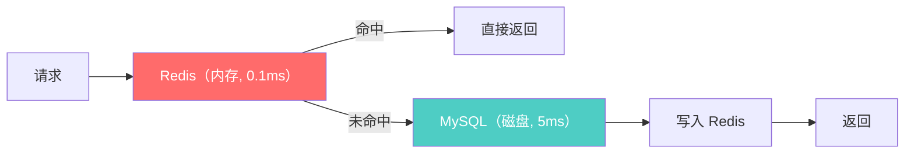
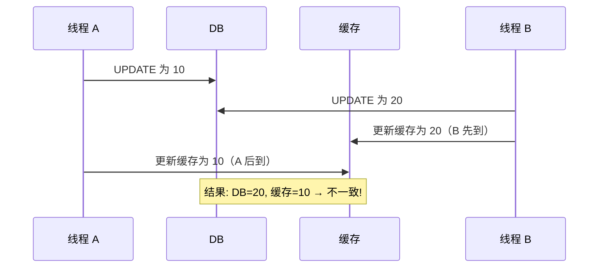
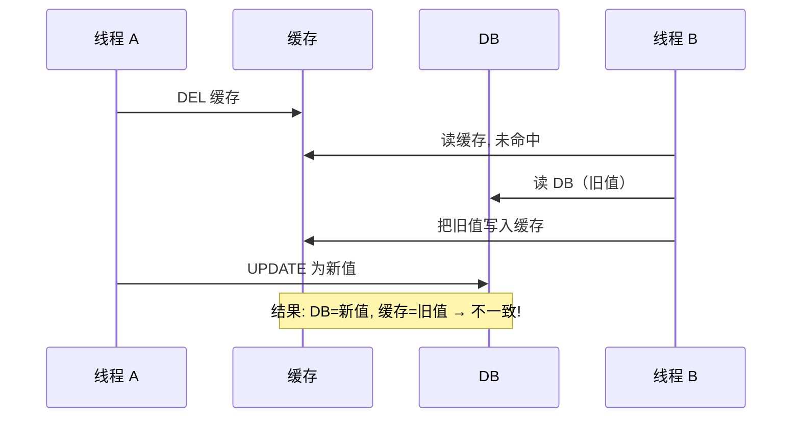
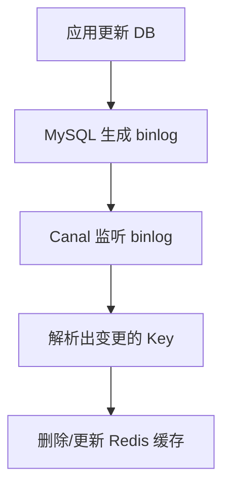
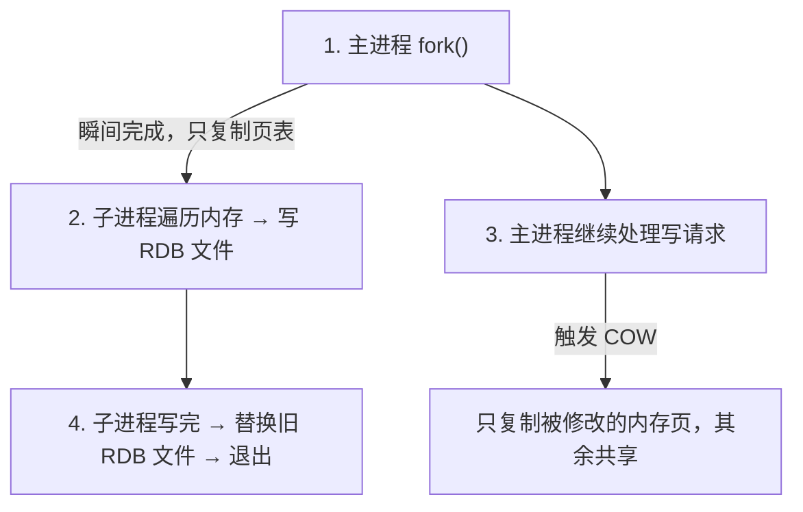
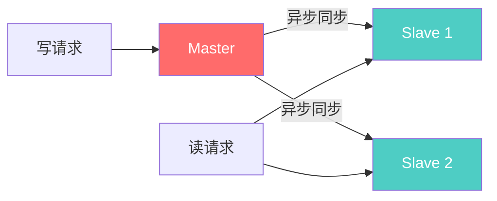
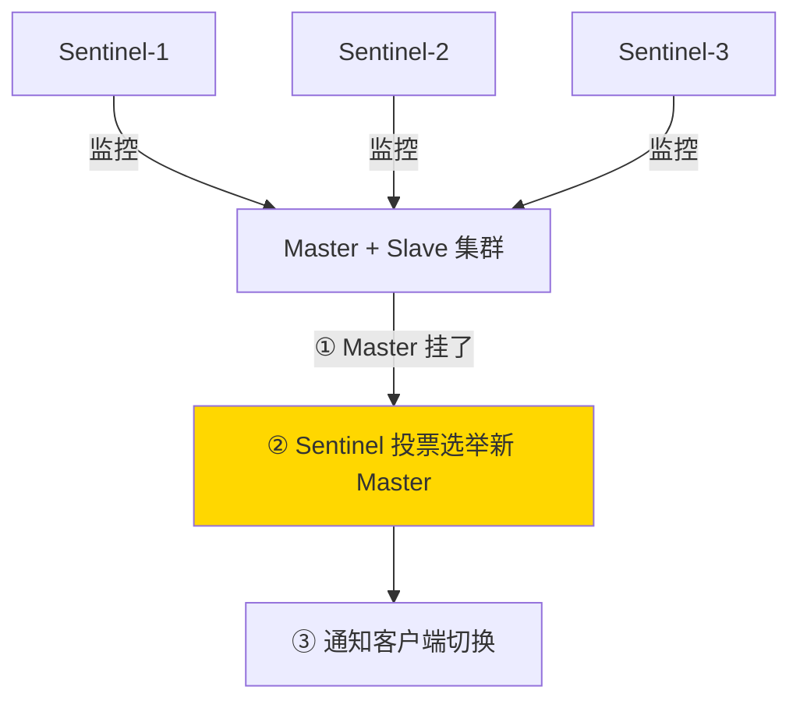
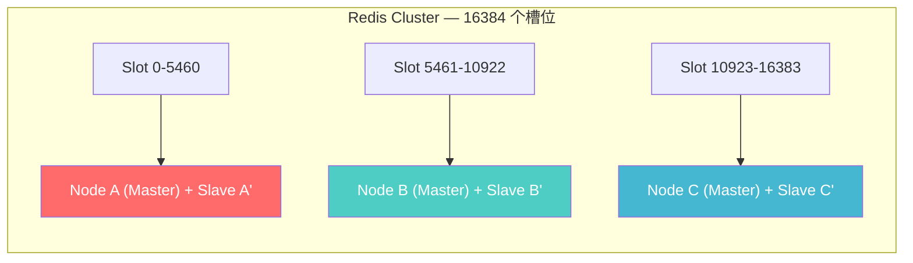
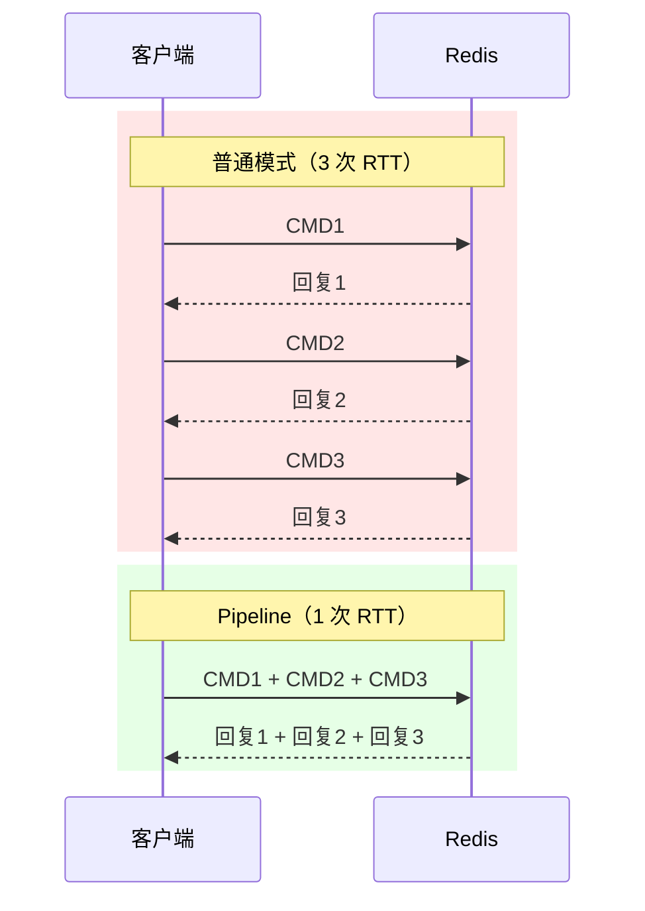

# 3.8 缓存与 Redis：为什么加个缓存就能快 10 倍，但也能让你丢数据

> 数据库查一次 5ms，**缓存查一次 0.1ms**——50 倍差距让缓存成为后端最朴素也最有效的优化手段。
> 但缓存不是免费午餐：**一致性、穿透、雪崩**三座大山，每一座都能让线上事故。
> 这一节把 Redis 核心数据结构、缓存经典问题、持久化、高可用架构一次讲透，面试高频考点逐个击破。

---

## 一、为什么用缓存？——从一次慢查询说起

假设你有一张 `user` 表，1000 万行。某个接口根据 `user_id` 查用户详情，SQL 本身不复杂，但每秒有 5000 次请求。MySQL 单机扛不住——不是 SQL 写得烂，而是**磁盘 IO 和网络开销在高并发下成为瓶颈**。

在数据库前面加一层 Redis 缓存后：



**本质是空间换时间，把热数据从磁盘前置到内存。**

### 缓存最适合的场景

| 场景特征 | 说明 |
|---------|------|
| **读多写少** | 写多则缓存频繁失效，命中率低 |
| **热数据集中** | 20% 的 Key 承载 80% 的请求（帕累托分布） |
| **对一致性容忍短暂延迟** | 能接受秒级的数据不一致 |

### 缓存的代价——不是加了就完事

| 代价 | 说明 |
|------|------|
| **一致性问题** | DB 更新了缓存还没更新，用户看到旧数据 |
| **内存成本** | Redis 是纯内存数据库，数据量大时成本不低 |
| **系统复杂度** | 引入穿透/击穿/雪崩等新问题，运维复杂度上升 |
| **缓存预热** | 冷启动时缓存为空，大量请求直接打到 DB |

---

## 二、Redis 核心数据结构（面试必考）

Redis 不只是一个 KV 缓存，它提供**五种基础数据类型**，每种类型底层有不同的编码实现。

### 2.1 五大数据类型 + 底层编码

| 类型 | 底层编码 | 说明 |
|------|---------|------|
| **String** | int（整数直接存）/ embstr（短字符串，<=44字节，一次内存分配）/ raw（长字符串） | 最基础，能存字符串、数字、序列化对象 |
| **Hash** | listpack（小数据量）/ hashtable（大数据量） | 类似 Java HashMap，适合存对象字段 |
| **List** | quicklist（ziplist + 双向链表的混合体） | 双端队列，支持 lpush/rpop |
| **Set** | intset（全是整数且量少）/ hashtable | 无序不重复集合 |
| **ZSet** | listpack（小数据量）/ skiplist + hashtable | 有序集合，每个元素有 score |

> **注意**：Redis 7.0 起，ziplist 已被 listpack 替代。面试时说 ziplist 或 listpack 都可以，但知道演进方向是加分项。

<details>
<summary><b>展开：embstr 的 emb 是什么意思？「一次内存分配」到底快在哪？</b></summary>

emb = **embedded（嵌入式）**。String 类型有三种底层编码，区别不是「是不是字符串」，而是**内存怎么分配**：

| 编码 | 内存布局 | malloc 次数 | 适用 |
|------|---------|------------|------|
| **int** | 直接在对象头里存一个 long 整数 | 0 次（不额外分配） | 值是整数且在 long 范围内 |
| **embstr** | `[redisObject │ SDS数据]` 连续一块内存 | **1 次** | 短字符串（≤44 字节） |
| **raw** | `[redisObject]` → 指针 → `[SDS数据]` 两块内存 | **2 次** | 长字符串（>44 字节） |

「一次内存分配」快在三个地方：① 分配快（一次 `malloc` vs 两次）；② 释放快（一次 `free`）；③ **缓存友好**——对象头和数据在内存里紧挨着，CPU 读对象头时顺便就把数据读进 L1 缓存了（缓存行命中），不用跟着指针再跳一次内存。

超过 44 字节为什么不能用 embstr？因为 Redis 的 `jemalloc` 内存分配器单次分配上限是 64 字节，减去 redisObject（16字节）和 SDS 头部（3字节）以及结尾 `\0`（1字节），刚好剩 44 字节给数据。再多就塞不进一块 64 字节的连续内存了。

</details>

<details>
<summary><b>展开：listpack 长什么样？和它替代的 ziplist 有什么区别？</b></summary>

listpack（紧凑列表）是 Redis 7.0 引入的，替代老的 ziplist。它的本质是**把多个元素紧挨着塞在一块连续内存里**，没有指针、没有链表节点——就是一串字节紧密排列：

```
┌────────┬────────────────────────────────────────────┬─────┐
│ 总字节数 │ [entry1][entry2][entry3] ... [entryN]       │ 0xFF │
└────────┴────────────────────────────────────────────┴─────┘

每个 entry 的内部结构：
┌──────────┬──────┬──────────┐
│ 编码类型   │ 数据  │ 本元素长度 │   ← 紧挨着，无指针，无间隙
└──────────┴──────┴──────────┘
```

**你不会直接操作 listpack**——它是 Redis 内部自动选择的底层编码。当你创建一个 Hash/Set/ZSet，如果元素少且每个元素小，Redis 自动用 listpack 存（省内存）；元素多了或单个元素大了，自动转换成 hashtable/skiplist（查找快）。转换阈值可配置（如 `hash-max-listpack-entries 128`）。

**为什么换掉 ziplist？** ziplist 有一个叫**连锁更新（cascade update）**的设计缺陷：ziplist 中每个 entry 存的是**前一个 entry 的长度**，修改中间一个元素导致它变长 → 后一个 entry 记录的「前一个长度」也要改 → 可能导致后一个 entry 自身也变长 → 连锁反应一路传下去，最坏 O(N²)。listpack 让每个 entry 记录的是**自己的长度**而非前一个的长度，彻底消除了连锁更新问题。

| | ziplist（已废弃） | listpack（7.0+） |
|--|------------------|-----------------|
| entry 记录谁的长度 | 前一个 entry 的长度 | 自己的长度 |
| 连锁更新风险 | 有（最坏 O(N²)） | 无 |
| 遍历方向 | 支持正向+反向 | 支持正向+反向 |
| 内存紧凑度 | 高 | 同样高 |

</details>

### 2.2 实际场景选型表

| 场景 | 推荐类型 | 命令示例 |
|------|---------|---------|
| 缓存用户信息 | String（JSON）或 Hash（字段级读写） | `SET user:1001 "{...}"` / `HSET user:1001 name "张三"` |
| 计数器（点赞/阅读量） | String | `INCR article:1001:views` |
| 排行榜 | ZSet | `ZADD rank 95.5 user:1001` / `ZREVRANGE rank 0 9` |
| 分布式锁 | String + Lua | `SET lock:order NX EX 30` |
| 延迟队列 | ZSet（score 为执行时间戳） | `ZADD delay_queue 1700000000 task:1` |
| 布隆过滤器 | RedisBloom 模块 / 位图手动实现 | `BF.ADD filter user:1001` |
| 消息队列（轻量） | Stream（Redis 5.0+） | `XADD mystream * key value` |

<details>
<summary><b>展开：跳表、红黑树、ZSet 选型——为什么 ZSet 用跳表而不用红黑树？</b></summary>

**跳表（Skip List）** 的本质是给有序链表加多层索引，让查找从 O(N) 降到 O(log N)。像书的目录一样，先从高层大步跳到大致位置，再逐层下沉精确定位。

**红黑树（Red-Black Tree）** 是自平衡二叉搜索树，通过给节点染色+旋转来防止退化成链表，保证高度始终 O(log N)。Java `TreeMap`、`HashMap`（链表 ≥ 8 转红黑树）都用它。

Redis ZSet 选跳表的核心原因：① 范围查询天然高效（底层就是有序链表）；② 实现简单，bug 少；③ 两者时间复杂度 O(log N) 没有本质差距。HashMap 选红黑树的原因相反：只需单点查找，不需要范围查询，红黑树更紧凑且最坏情况确定性更好。

> 详细的结构图解、插入机制、旋转原理、对比表、使用场景见 **[附录 A1：核心数据结构原理](./A1-核心数据结构原理.md)**

</details>

---

## 三、缓存三大问题：穿透、击穿、雪崩

这三个问题是缓存面试的「送命题」——名字容易混，但本质完全不同。

### 3.1 一张表区分三者

| 问题 | 定义 | 关键词 | 危害 |
|------|------|--------|------|
| **缓存穿透** | 查询的数据**缓存和 DB 中都不存在**，每次都穿透到 DB | 数据不存在 | 恶意攻击可瞬间打垮 DB |
| **缓存击穿** | **某个热点 Key 过期**的瞬间，大量并发请求同时打到 DB | 热 Key 过期 | DB 瞬间压力飙升 |
| **缓存雪崩** | **大量 Key 同时过期**（或 Redis 宕机），请求全部涌向 DB | 批量过期/宕机 | DB 被压垮，全站不可用 |

### 3.2 解决方案对比

**缓存穿透的解决方案**：

| 方案 | 原理 | 优点 | 缺点 |
|------|------|------|------|
| **缓存空值** | 查不到也往 Redis 写一个空值（如 `""`)，设短过期时间 | 简单 | 占用额外内存；如果是随机 Key 攻击则无效 |
| **布隆过滤器** | 在缓存前加一层布隆过滤器，不存在的 Key 直接拦截 | 内存占用极小，拦截效果好 | 有误判率（可能把存在的判为不存在），不支持删除 |
| **参数校验** | 在入口层校验请求参数合法性（如 ID 不能为负数） | 简单有效 | 只能拦截明显非法请求 |

**缓存击穿的解决方案**：

| 方案 | 原理 | 优点 | 缺点 |
|------|------|------|------|
| **互斥锁** | 缓存失效时，只让一个线程去查 DB 并回填缓存，其他线程等待 | 保证只有一次 DB 查询 | 等锁期间其他请求阻塞，影响吞吐 |
| **逻辑过期** | 不设 TTL，在 value 中存逻辑过期时间；发现过期后异步更新，先返回旧值 | 不阻塞，高可用 | 短暂返回旧数据，一致性稍差 |
| **热点 Key 永不过期** | 对热点数据不设过期时间，由后台任务主动更新 | 彻底避免击穿 | 需要额外维护更新机制 |

**缓存雪崩的解决方案**：

| 方案 | 原理 | 优点 | 缺点 |
|------|------|------|------|
| **过期时间加随机值** | 设置过期时间时加一个随机偏移（如 TTL = 30min + random(0,5min)） | 简单，避免同时过期 | 不能完全消除 |
| **多级缓存** | 本地缓存（Caffeine）+ Redis + DB 三级 | 即使 Redis 挂了还有本地缓存兜底 | 架构复杂，一致性更难保证 |
| **Redis 高可用** | Sentinel 或 Cluster，防止 Redis 整体宕机 | 从根本上避免 Redis 不可用 | 部署运维成本 |
| **熔断降级** | DB 压力过大时触发熔断，返回默认值或排队 | 保护 DB 不被打垮 | 降级期间用户体验下降 |

<details>
<summary><b>展开：布隆过滤器原理（面试高频追问）</b>（完整原理详见 <a href="./A1-核心数据结构原理.md#三布隆过滤器bloom-filter用-1-的误判换-99-的内存节省">A1 核心数据结构原理 · 第三章</a>）</summary>

**布隆过滤器（Bloom Filter）** 是一个**空间效率极高的概率型数据结构**，用于判断「一个元素**一定不存在**或**可能存在**」。

原理很直观：用一个位数组 + 多个哈希函数，插入时把多个位置置 1，查询时检查这些位是否全为 1。全为 1 → 可能存在（可能是其他元素顶的，即**误判**）；有任一位为 0 → **一定不存在**（100% 准确）。

核心特性：不支持删除（需要变体 Counting Bloom Filter）、误判率可控（1 亿元素 1% 误判只需 ~114MB）、空间极小。

在 Redis 中可通过 **RedisBloom 模块**（`BF.RESERVE` / `BF.ADD` / `BF.EXISTS`）或手动 Bitmap 实现。

> 详细的位数组图解、参数设计公式、变体对比（Counting/Cuckoo/Scalable）、应用场景表、Java 实战代码见 **[附录 A1：核心数据结构原理](./A1-核心数据结构原理.md)**

</details>

<details>
<summary><b>展开：互斥锁防缓存击穿的实现（Redis + SETNX）</b></summary>

```java
public String getWithMutex(String key) {
    // 1. 查缓存
    String value = redis.get(key);
    if (value != null) {
        return value;
    }

    // 2. 缓存未命中，尝试获取互斥锁
    String lockKey = "lock:" + key;
    boolean locked = redis.set(lockKey, "1", "NX", "EX", 10); // SETNX + 10s 超时

    if (locked) {
        try {
            // 3. 双重检查：拿到锁后再查一次缓存（可能其他线程已经回填了）
            value = redis.get(key);
            if (value != null) {
                return value;
            }

            // 4. 查 DB 并回填缓存
            value = db.query(key);
            redis.setex(key, 300, value); // 缓存 5 分钟
            return value;
        } finally {
            redis.del(lockKey); // 释放锁
        }
    } else {
        // 5. 没拿到锁，短暂等待后重试
        Thread.sleep(50);
        return getWithMutex(key); // 递归重试（生产环境应加重试上限）
    }
}
```

注意这里的锁必须设超时，防止持锁线程崩溃导致死锁。生产环境推荐用 Redisson 的分布式锁，自带看门狗续期机制。

</details>

---

## 四、缓存与数据库一致性（面试最爱追）

这是缓存面试中被追问最深的话题。核心矛盾：**数据同时存在于缓存和数据库两个地方，更新时先更新谁？**

### 4.1 Cache Aside Pattern（旁路缓存，业界标准）

**规则**：
- **读**：先读缓存，命中直接返回；未命中则读 DB，写入缓存。
- **写**：**先更新 DB，再删除缓存**（注意是**删除**不是更新）。


**为什么是「删除缓存」而不是「更新缓存」？**

因为更新缓存在并发场景下会产生**脏数据**：



删除缓存则没有这个问题——不管谁先删，下次读时都会从 DB 拿最新值回填。

### 4.2 先删缓存再更新 DB → 为什么不行



这个时间窗口比「先更新 DB 再删缓存」大得多（后者的不一致窗口只在 DB 更新完到缓存删除之间的极短时间）。

### 4.3 延迟双删

为了进一步缩小不一致窗口，在「先更新 DB 再删缓存」的基础上，**过一段时间再删一次缓存**：

```java
// 延迟双删伪代码
redis.del(key);                    // 第一次删
db.update(data);                   // 更新 DB
Thread.sleep(delayMs);             // 等待（通常 500ms ~ 1s）
redis.del(key);                    // 第二次删（兜底）
```

**延迟多久？** 通常设为「读业务逻辑的耗时 + 几百毫秒余量」。目的是等那些在第一次删除之后、DB 更新之前就已经开始读 DB 旧值的请求完成回填，然后用第二次删除把它们写入的旧缓存清掉。

**为什么延迟双删也不完美？**
- `Thread.sleep` 会阻塞当前线程（可以改为异步延迟任务，但增加复杂度）。
- 延迟时间难以精确计算，太短没效果，太长不一致窗口还是大。
- 第二次删除如果失败，依然会不一致。

### 4.4 最终一致性方案：binlog 订阅（Canal）

如果对一致性要求更高，可以用**订阅 MySQL binlog** 的方式：



**优点**：应用代码不需要关心缓存删除，解耦彻底；binlog 天然有序，不怕并发乱序。
**缺点**：引入了 Canal 组件，增加运维成本；有一定延迟（通常毫秒到秒级）。

### 4.5 各方案对比

| 方案 | 一致性 | 复杂度 | 适用场景 |
|------|--------|--------|---------|
| **Cache Aside（先更新 DB 再删缓存）** | 最终一致，极小窗口 | 低 | 大多数业务，首选 |
| **先删缓存再更新 DB** | 不一致窗口大 | 低 | 不推荐 |
| **延迟双删** | 优于 Cache Aside | 中 | 对一致性有一定要求的场景 |
| **binlog 订阅（Canal）** | 接近强一致 | 高 | 核心数据、金融级别 |
| **Read/Write Through** | 由缓存组件保证 | 依赖中间件 | 有专门缓存中间件的场景 |

<details>
<summary><b>展开：面试追问——先更新 DB 再删缓存就没问题吗？</b></summary>

严格来说，**Cache Aside 也有极小概率不一致**：

```
线程 A 读缓存未命中，读 DB 得到旧值（此时还没回填缓存）
线程 B 更新 DB 为新值
线程 B 删除缓存（此时缓存本来就是空的，删了个寂寞）
线程 A 把旧值写入缓存
结果：DB=新值，缓存=旧值
```

但这个场景发生的概率极低——需要「读 DB + 写缓存」的耗时 > 「写 DB + 删缓存」的耗时，而通常**写 DB 比读 DB 慢得多**，所以这个时序几乎不可能出现。

面试时能主动提出这个极端 case 再解释为什么概率极低，是明显加分项。

</details>

---

## 五、Redis 过期与淘汰策略

### 5.1 过期删除策略

Redis 对设了 TTL 的 Key，采用**两种策略配合删除**：

| 策略 | 原理 | 优缺点 |
|------|------|--------|
| **惰性删除** | 访问 Key 时才检查是否过期，过期则删除 | 对 CPU 友好（不主动扫），但可能有大量过期 Key 堆积在内存中 |
| **定期删除** | Redis 每隔 100ms（默认）随机抽取一批设了过期时间的 Key，删除其中已过期的 | 折中方案。每次抽检数量和时间有限制，不会耗太多 CPU |

**两者配合**：定期删除负责「兜底清理」，惰性删除负责「精准拦截」。即使如此，仍可能有部分过期 Key 既没被访问也没被抽到——这时就需要**内存淘汰策略**兜底。

### 5.2 八种内存淘汰策略

当 Redis 内存达到 `maxmemory` 上限时，新写入会触发淘汰策略：

| 策略 | 淘汰范围 | 淘汰算法 | 说明 |
|------|---------|---------|------|
| **noeviction** | — | 不淘汰 | 内存满了直接报错，不删任何 Key（默认策略） |
| **allkeys-lru** | 所有 Key | 近似 LRU | 淘汰最久未使用的 Key（**最常用**） |
| **volatile-lru** | 设了过期时间的 Key | 近似 LRU | 只在有 TTL 的 Key 中淘汰 |
| **allkeys-lfu** | 所有 Key | LFU | 淘汰使用频率最低的 Key（Redis 4.0+） |
| **volatile-lfu** | 设了过期时间的 Key | LFU | 只在有 TTL 的 Key 中按频率淘汰 |
| **allkeys-random** | 所有 Key | 随机 | 随机淘汰 |
| **volatile-random** | 设了过期时间的 Key | 随机 | 随机淘汰有 TTL 的 Key |
| **volatile-ttl** | 设了过期时间的 Key | TTL 最短优先 | 淘汰最快要过期的 Key |

> **面试推荐**：大多数场景选 `allkeys-lru`（缓存场景）或 `volatile-lru`（混合使用场景，部分 Key 不想被淘汰则不设 TTL）。如果有明显的冷热分布，`allkeys-lfu` 更精准。

<details>
<summary><b>展开：LRU vs LFU 区别？Redis 的近似 LRU 是怎么实现的？</b></summary>

**LRU（Least Recently Used）** vs **LFU（Least Frequently Used）**：

| | LRU | LFU |
|---|-----|-----|
| 淘汰依据 | 最近最少**使用**（按时间） | 最不经常**使用**（按频率） |
| 核心问题 | 偶尔被访问一次的冷数据也会被「保护」 | 历史高频但已不再热的数据不容易被淘汰（需要衰减） |
| 适合场景 | 通用缓存 | 有明显冷热分布的缓存 |

**Redis 为什么不用标准 LRU？**

标准 LRU 需要维护一个双向链表，每次访问都要移动节点到链表头部——对 Redis 这种高性能数据库来说开销太大。

Redis 用的是**近似 LRU**：每个 Key 的对象头中记录一个 24 位的时间戳（`lru` 字段，精度约 1 秒），记录最后一次被访问的时间。淘汰时**随机采样 N 个 Key**（默认 `maxmemory-samples=5`），从中淘汰 `lru` 值最小（最久未被访问）的那个。

采样数越大越接近真实 LRU，但 CPU 开销也越大。Redis 5.0 引入了「淘汰池」优化——每次采样后把候选 Key 放入一个按空闲时间排序的池子，下次淘汰时综合考虑，进一步接近真实 LRU。

**Redis 的 LFU 怎么实现？**（Redis 4.0+）

每个 Key 的对象头 24 位被拆成两部分：
- **高 16 位**：上次访问的时间戳（分钟级精度，用于衰减计算）
- **低 8 位**：`logc` 计数器（对数计数器，0~255，表示使用频率）

访问时 `logc` 按概率递增（值越大递增概率越低，防止溢出），同时根据距上次访问的时间间隔做**衰减**（间隔越久减得越多），解决「历史热 Key 但现在已冷」的问题。

</details>

---

## 六、Redis 持久化：RDB vs AOF

Redis 是内存数据库，重启数据就丢了。持久化机制保证数据不丢失。

### 6.1 RDB（Redis DataBase）——快照

**原理**：在某个时间点把内存中的所有数据生成一个**二进制快照文件**（`dump.rdb`）。

**生成方式**：
- `SAVE`：主线程执行，**阻塞所有请求**（生产环境不用）。
- `BGSAVE`：**fork 子进程**生成快照，主线程继续服务。

**fork + COW（Copy-On-Write）机制**（面试必问）：



| 优点 | 缺点 |
|------|------|
| 文件紧凑，恢复速度快 | 两次快照之间的数据可能丢失 |
| 适合备份和灾难恢复 | fork 时如果内存大，会短暂阻塞主进程 |
| 生成过程不阻塞主进程（COW） | 不适合对数据安全性要求极高的场景 |

### 6.2 AOF（Append Only File）

AOF 把每一条**写命令**以追加方式记录到日志文件。重启时重放这些命令恢复数据。

**三种刷盘策略**：

| 策略 | 行为 | 数据安全 | 性能 |
|------|------|---------|------|
| `always` | 每条命令都 fsync | 最高（最多丢 1 条命令） | 最慢 |
| `everysec` | 每秒 fsync 一次 | 较高（最多丢 1 秒数据） | **推荐**，折中 |
| `no` | 由 OS 决定何时 fsync | 最低 | 最快 |

AOF 有个问题：**文件会越来越大**。Redis 通过 **AOF 重写（rewrite）** 解决——用当前内存状态生成一份最小命令集，替换掉旧的 AOF 文件（比如 100 次 INCR 变成一条 SET）。

### 6.3 混合持久化（Redis 4.0+）

AOF 重写时，**先以 RDB 格式写入当前全量快照**，然后把重写期间产生的增量写命令以 AOF 格式追加到文件末尾。兼得两家之长：恢复快（RDB 部分）+ 数据更完整（AOF 增量部分）。

### 6.4 对比表

| 维度 | RDB | AOF | 混合持久化 |
|------|-----|-----|----------|
| 文件内容 | 二进制快照 | 文本写命令 | RDB 头 + AOF 尾 |
| 数据安全 | 可能丢两次快照间的数据 | 最多丢 1 秒（everysec） | 接近 AOF |
| 恢复速度 | 快（直接加载） | 慢（逐条重放） | 快 |
| 文件大小 | 紧凑 | 较大（重写后好些） | 适中 |
| **面试推荐回答** | 备份/灾恢用 RDB | 数据安全性高用 AOF | **生产环境建议开混合持久化** |

<details>
<summary><b>展开：面试追问「RDB 的 fork 会阻塞吗？COW 什么时候会有问题？」</b></summary>

- **fork 本身极快**（只复制页表），但如果 Redis 占用内存很大（如 20GB），页表也大，fork 耗时可达几十毫秒甚至上百毫秒，**这段时间主进程是阻塞的**。
- **COW 的坑**：如果 fork 后主进程有大量写操作，触发大量页复制，内存使用量可能短时间翻倍（最坏情况）。所以大内存实例做 RDB 时要监控内存。
- **面试加分**：提到可以在低峰期做 BGSAVE，或者用从节点做 RDB 备份，避免主节点 fork。

</details>

---

## 七、Redis 高可用架构

### 7.1 主从复制（Replication）



**同步过程**：

1. **全量同步**（首次连接 / 断线太久）：Master 执行 BGSAVE 生成 RDB → 发送给 Slave → Slave 加载 RDB → Master 再把期间的增量命令发过去
2. **增量同步**（正常运行中）：Master 把写命令通过 **repl_backlog** 缓冲区传播给 Slave

> **注意**：主从复制是**异步**的，Slave 的数据有延迟。如果 Master 宕机，可能丢失最后一小段数据。

### 7.2 Redis Sentinel（哨兵）

Sentinel 解决的核心问题：**Master 挂了，谁来自动切换？**



**故障检测**：
- **主观下线（SDOWN）**：单个 Sentinel 认为 Master 不可达
- **客观下线（ODOWN）**：超过 quorum 个 Sentinel 都认为 Master 不可达 → 触发故障转移

### 7.3 Redis Cluster（集群）

当数据量超过单机内存上限，需要**水平分片**：



**核心机制**：
- **16384 个槽位（Slot）**：每个 Key 通过 `CRC16(key) % 16384` 计算属于哪个槽
- **去中心化**：节点间通过 **[Gossip 协议](./10-分布式理论与一致性.md#七zab-与-gossip补充)**通信，无需中心协调节点（Gossip 与 Raft/ZAB/Paxos 等共识协议的对比见链接章节）
- **自动故障转移**：每个 Master 有 Slave，Master 挂了 Slave 自动提升

<details>
<summary><b>展开：面试追问「为什么是 16384 个槽？不是更多？」</b></summary>

作者 antirez 在 GitHub issue 中解释过，核心原因是**心跳包大小**。

**什么是心跳包？** Redis Cluster 中每个节点每秒会随机选几个节点发送一条「我还活着」的消息，这就是**心跳包（Heartbeat）**。但心跳包不只是“我在”，还会携带集群状态信息——包括「我负责哪些槽位」的 bitmap。这是 [Gossip 协议](./10-分布式理论与一致性.md#七zab-与-gossip补充) 的工作方式——节点互相交换信息，最终全网达成一致。

**为什么心跳包不能太大？** 因为心跳是**高频 + 广播式**的。假设 100 个节点，每个节点每秒向几个邻居发心跳，心跳包越大 → 集群内的“管理流量”越高 → 挤占真正的业务带宽。具体来说：

| 槽位数 | bitmap 大小 | 100 节点每秒心跳流量（估算） |
|--------|------------|---------------------------|
| 16384 | **2 KB** | ~百 KB 级，可接受 |
| 65536 | 8 KB | ~MB 级，纯开销太高 |

除了心跳包大小，还有两个原因：

1. **实际需求**：Redis Cluster 建议不超过 1000 个节点，16384 个槽完全够分。
2. **压缩效率**：槽位信息用 bitmap 传输时，16384 是一个合适的压缩平衡点。

</details>

<details>
<summary><b>展开：一致性 Hash 到底是什么？为什么普通 Hash 取模在扩容时会出大问题？</b></summary>

普通 `hash(key) % N` 的致命问题：节点数 N 一变，几乎所有 key 的映射都变 → 大量数据迁移 → 缓存雪崩。一致性 Hash 把哈希空间组成一个环，Key 顺时针找最近节点，加/减一个节点只影响约 1/N 的数据。虚拟节点解决数据倾斜，Redis Cluster 的 16384 个 Hash Slot 是一致性 Hash 思想的简化版。

> 完整的哈希环图解、虚拟节点机制、Redis Slot 对比表见 **[附录 A1：核心数据结构原理](./A1-核心数据结构原理.md)**

</details>

### 7.4 三种架构对比

| 维度 | 主从复制 | Sentinel | Cluster |
|------|---------|----------|---------|
| 解决什么问题 | 读写分离、数据备份 | 自动故障转移 | 水平扩容 + 高可用 |
| 数据分片 | 否（全量复制） | 否 | 是（16384 槽） |
| 自动故障转移 | 否（手动切换） | 是 | 是 |
| 适用场景 | 读多写少、数据量不大 | 中小规模、需要自动 HA | 大数据量、高并发、需要水平扩容 |
| 复杂度 | 低 | 中 | 高 |

---

## 八、Redis 性能优化与常见坑

### 8.1 大 Key 问题

**什么是大 Key**：一个 Key 对应的 Value 特别大（如 String > 10KB，集合元素 > 1 万个）。

| 危害 | 说明 |
|------|------|
| 阻塞 | 读写大 Key 耗时长，阻塞 Redis 主线程 |
| 网络 | 传输大 Value 占带宽，影响其他请求 |
| 内存 | 大 Key 过期或删除时，释放内存可能卡住主线程（DEL 大 Key 是 O(n)） |
| 集群倾斜 | 大 Key 所在的节点负载远高于其他节点 |

**发现**：`redis-cli --bigkeys`、`MEMORY USAGE key`

**解决**：
- 拆分：大 Hash 拆成多个小 Hash（如按用户 ID 分片）
- 压缩：Value 做 gzip 压缩后再存
- 删除：用 `UNLINK`（异步删除）代替 `DEL`（同步删除）

### 8.2 热 Key 问题

**什么是热 Key**：某个 Key 被高频访问（如热门商品详情），单节点扛不住。

**解决方案**：

| 方案 | 原理 |
|------|------|
| **本地缓存** | 在应用层加一层 Caffeine/Guava 缓存，命中就不打 Redis |
| **Key 分散** | 把 `hot_key` 拆成 `hot_key_1` ~ `hot_key_N`，随机读取，分散到不同节点 |
| **读写分离** | 热 Key 的读请求走 Slave 分摊 |

### 8.3 Pipeline 批量操作



Pipeline 把多条命令打包发送，减少网络往返。注意：Pipeline 不是原子操作，如果需要原子性用 Lua 脚本或 MULTI/EXEC 事务。

### 8.4 慢查询日志

```bash
# 设置慢查询阈值（微秒），超过 10ms 就记录
CONFIG SET slowlog-log-slower-than 10000
# 查看慢查询日志
SLOWLOG GET 10
```

常见慢查询元凶：`KEYS *`（全量扫描，生产禁用！用 `SCAN` 代替）、对大集合做 `SMEMBERS`/`HGETALL`、`SORT` 等高复杂度命令。

---

## 本篇小结

- **缓存的本质**是空间换时间、热数据前置，核心代价是一致性问题。
- Redis **五大数据结构**各有适用场景，ZSet 的跳表 vs 红黑树是高频面试题。
- 缓存三大问题：**穿透**（查不存在的 → 布隆过滤器/空值缓存）、**击穿**（热 Key 过期 → 互斥锁/永不过期）、**雪崩**（大批过期 → 随机过期/多级缓存）。
- 缓存一致性：**Cache Aside Pattern（先更新 DB 再删缓存）** 是主流，终极方案是 **binlog 订阅**。
- 过期删除用**惰性 + 定期**双策略，淘汰策略首选 **allkeys-lru** 或 **allkeys-lfu**。
- 持久化：生产环境推荐**混合持久化**（RDB 快照 + AOF 增量）。
- 高可用：小规模用 **Sentinel**，大数据量用 **Cluster**（16384 槽分片）。
- 性能优化：关注**大 Key 拆分**、**热 Key 分散**、**Pipeline 批量**、**禁用 KEYS *** 。

---

**相关章节**：

- [附录 A1：核心数据结构原理](./A1-核心数据结构原理.md)——跳表、红黑树、布隆过滤器、一致性 Hash 的完整图解与深度剖析
- [3.7 高可用架构](./07-高可用架构.md)——限流、熔断、降级等高可用手段，与 Redis 缓存配合构成完整的容错体系
- [3.10 分布式理论与一致性](./10-分布式理论与一致性.md)——理解缓存一致性问题的理论根基
- [3.1 并发体系](./01-并发体系.md)——Redis 单线程模型与 Java 并发模型的对比思考

---

> **下一步**：分布式理论（CAP/BASE）与分布式事务将在后续章节展开，届时你会看到缓存一致性问题其实是 CAP 不可能三角在工程中的一个具体表现。
