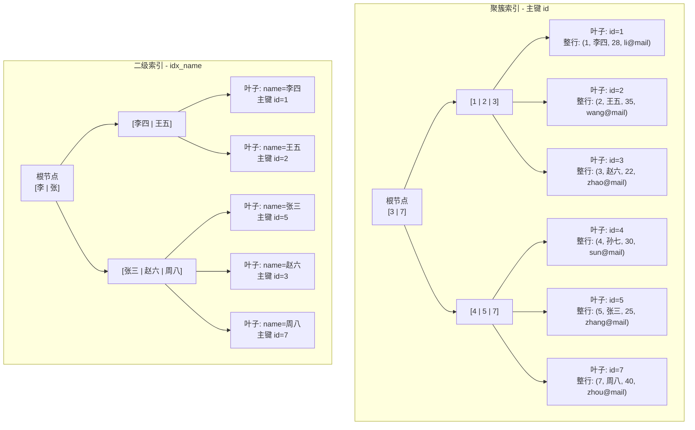
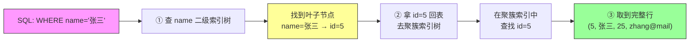
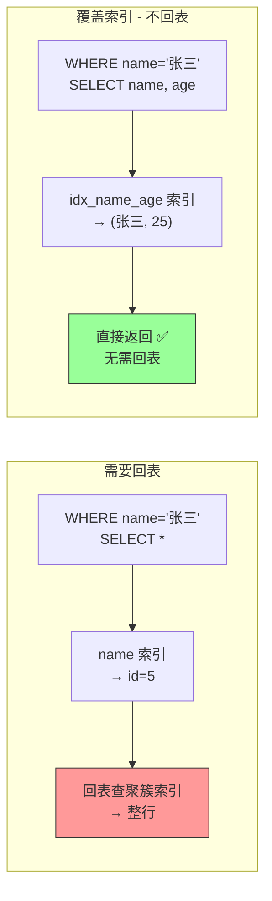
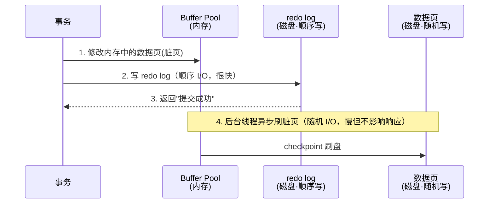
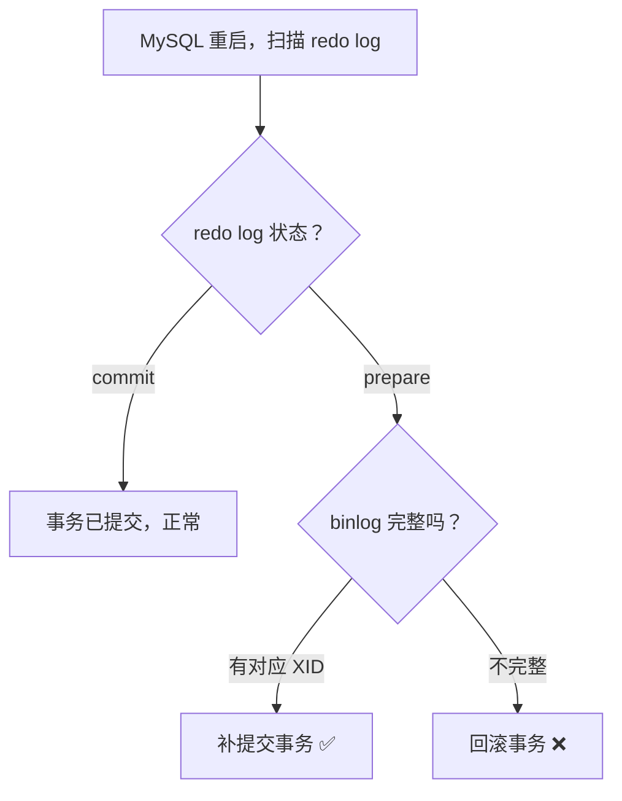

# 3.9 数据库 MySQL：为什么你的 SQL 慢、锁等待、数据不一致

> MySQL 是后端面试的**必考重镇**。不管你写 Java、Go 还是 Python，最终数据都要落到数据库。
> 面试官最爱的三板斧：**索引为什么快、事务怎么隔离、锁怎么加的**——答不好直接挂。
> 本篇从架构到优化，把 MySQL 的面试高频知识点一次打透。

---

## 一、MySQL 架构总览

你执行一条 `SELECT * FROM user WHERE id = 1`，MySQL 内部经历了什么？

```
客户端 → 连接层 → SQL 层（解析→优化→执行）→ 存储引擎层 → 磁盘
```

三层架构一句话：

| 层 | 职责 | 关键组件 |
|----|------|---------|
| **连接层** | 管理连接、鉴权 | 连接池、线程复用 |
| **SQL 层（Server 层）** | 解析 SQL、优化执行计划、调用引擎 | Parser、Optimizer、Executor |
| **存储引擎层** | 真正存取数据 | InnoDB、MyISAM、Memory 等（可插拔） |

### InnoDB vs MyISAM

面试只需一句话区分：**InnoDB 支持事务和行锁，MyISAM 不支持**。

| 维度 | InnoDB | MyISAM |
|------|--------|--------|
| 事务 | 支持（ACID） | 不支持 |
| 锁粒度 | 行锁 | 表锁 |
| 外键 | 支持 | 不支持 |
| 崩溃恢复 | 基于 redo log，安全 | 无日志，容易丢数据 |
| 全文索引 | 5.6+ 支持 | 支持 |
| 聚簇索引 | 有（数据和主键索引存一起） | 无（索引和数据分离） |
| 适用场景 | OLTP（线上业务首选） | 只读/分析型（已被淘汰） |

> MySQL 5.5 之后默认引擎就是 InnoDB，面试只聊 InnoDB 就够了。

---

## 二、索引（面试第一重镇）

### 2.1 B+ 树为什么适合数据库

数据库索引的本质是：**把随机 IO 变成顺序 IO，把全表扫描变成树搜索**。

B+ 树的三大优势：

1. **矮胖**：每个节点存很多 key（几百~上千），3-4 层就能覆盖千万级数据。树高矮 = 磁盘 IO 次数少。
2. **叶子节点链表串联**：范围查询只需找到起始叶子节点，然后顺序遍历链表——顺序 IO。
3. **非叶子节点只存 key 不存数据**：一个 16KB 的页能装更多 key，树更矮。

> B+ 树的结构图解、与 B 树/红黑树/跳表/Hash 的对比、查找过程演示、以及常见树结构总览（BST/AVL/红黑树/B树/B+树/跳表/Trie/堆）见 **[附录 A1：核心数据结构原理](./A1-核心数据结构原理.md)**

### 2.2 聚簇索引 vs 非聚簇索引

| 类型 | 叶子节点存什么 | 特点 |
|------|--------------|------|
| **聚簇索引**（主键索引） | 整行数据 | 数据和索引存在一起，一张表只能有一个 |
| **非聚簇索引**（二级索引） | 主键值 | 查到主键后还要**回表（Index Lookup / Bookmark Lookup）**去聚簇索引取完整行 |

**回表（Index Lookup / Bookmark Lookup）**：二级索引找到主键 → 拿着主键去聚簇索引再查一次 → 得到完整行。这就是为什么二级索引查询比主键查询慢。

```sql
-- 假设 name 上有索引
SELECT * FROM user WHERE name = '张三';
-- 流程：name 索引树 → 找到 id=5 → 回表到聚簇索引 → 拿到整行
```

<details>
<summary><b>展开：聚簇索引 vs 非聚簇索引——实际例子与图解</b></summary>

假设有一张 `user` 表：

```sql
CREATE TABLE user (
    id    INT PRIMARY KEY,
    name  VARCHAR(50),
    age   INT,
    email VARCHAR(100),
    INDEX idx_name (name),
    INDEX idx_name_age (name, age)
);
```

#### 1. 聚簇索引 vs 二级索引的 B+ 树结构差异



**关键区别**：聚簇索引的叶子节点存储**完整行数据**，二级索引的叶子节点只存储**主键 id 值**。

#### 2. 回表过程图解

执行 `SELECT * FROM user WHERE name = '张三'` 时：



回表 = **两次 B+ 树查找**：先查二级索引拿到主键，再查聚簇索引拿到整行。

#### 3. 覆盖索引避免回表的对比

```sql
-- 场景 A：需要回表（SELECT * 要的字段超出索引范围）
SELECT * FROM user WHERE name = '张三';
-- name 索引只存了 (name, id)，要 age/email 必须回表

-- 场景 B：覆盖索引，不需要回表
SELECT name, age FROM user WHERE name = '张三';
-- 联合索引 idx_name_age(name, age) 已经包含了 name 和 age
-- 直接从索引返回，EXPLAIN Extra 显示 "Using index"
```



#### 一句话总结

> 聚簇索引 = 新华字典正文（按拼音排的内容本身），二级索引 = 部首目录（查到拼音/页码后还要翻到正文去看）。

</details>

### 2.3 联合索引 + 最左前缀原则

联合索引 `(a, b, c)` 底层的 B+ 树是**先按 a 排序，a 相同按 b 排序，b 相同按 c 排序**。

```sql
-- 能用上索引的情况
WHERE a = 1                      -- 用到 a ✓
WHERE a = 1 AND b = 2            -- 用到 a, b ✓
WHERE a = 1 AND b = 2 AND c = 3  -- 用到 a, b, c ✓
WHERE a = 1 AND c = 3            -- 只用到 a ✓（c 用不上，中间断了）

-- 用不上索引的情况
WHERE b = 2                      -- 最左列 a 缺失 ✗
WHERE b = 2 AND c = 3            -- 最左列 a 缺失 ✗
```

> 口诀：**最左前缀不能断，遇到范围就停止**。`WHERE a > 1 AND b = 2`，a 用了范围查询后 b 就用不上索引了。

### 2.4 覆盖索引

如果一个查询需要的字段**全部在索引中**，就不需要回表——这叫覆盖索引。

```sql
-- 索引 (name, age)
SELECT name, age FROM user WHERE name = '张三';
-- name 和 age 都在索引里，直接返回，不回表
-- EXPLAIN 的 Extra 列会显示 "Using index"
```

覆盖索引是减少 IO 最有效的手段之一，面试必提。

### 2.5 索引失效的常见场景

| # | 场景 | 示例 | 原因 |
|---|------|------|------|
| 1 | 对索引列使用函数 | `WHERE YEAR(create_time) = 2024` | 函数包裹后无法走 B+ 树 |
| 2 | 隐式类型转换 | `WHERE phone = 13800138000`（phone 是 varchar） | MySQL 内部做了 CAST，等于加了函数 |
| 3 | LIKE 左模糊 | `WHERE name LIKE '%三'` | B+ 树只能从左到右匹配 |
| 4 | OR 连接非索引列 | `WHERE name = '张三' OR remark = 'x'` | remark 无索引导致全表 |
| 5 | 联合索引不满足最左前缀 | `WHERE b = 2`（索引是 `(a, b)`） | 跳过了最左列 |
| 6 | 使用 != 或 NOT IN | `WHERE status != 1` | 优化器认为扫描范围太大不如全表 |
| 7 | IS NULL / IS NOT NULL | `WHERE name IS NOT NULL`（视数据分布） | 优化器可能放弃索引 |

> 面试被问「索引失效有哪些情况」，至少答出 5 种 + 给出原因。

<details>
<summary><b>展开：面试追问「为什么不用 Hash 索引？为什么不用 B 树（非 B+ 树）？」</b></summary>

**Hash 索引的缺陷：**

- 只能做等值查询（`=`、`IN`），**不支持范围查询**（`>`、`<`、`BETWEEN`）。
- 无法利用索引排序。
- 存在 Hash 冲突，极端情况退化成链表。
- 不支持最左前缀匹配。

Memory 引擎默认用 Hash 索引，InnoDB 不用。

**B 树（不带 +）的缺陷：**

- B 树的非叶子节点也存数据 → 每个节点能存的 key 更少 → **树更高** → 磁盘 IO 更多。
- B 树叶子节点之间没有链表 → **范围查询需要中序遍历整棵树**，效率差。

B+ 树 = 非叶子节点只存 key（更矮）+ 叶子节点链表串联（范围查询快）。

</details>

---

## 三、事务与隔离级别

### 3.1 ACID

ACID 是数据库事务的四个基本保证，面试必考。名字本身是四个单词的首字母组合：

| 属性 | 含义 | 举例 | 靠什么实现 |
|------|------|------|-----------|
| **A**tomicity（原子性） | 事务要么**全部成功**，要么**全部回滚**，不存在“做一半” | 转账：A 扣钱 + B 加钱，必须同时成功或同时回滚 | **undo log**（回滚日志）——记录修改前的值，失败时按日志撤销 |
| **C**onsistency（一致性） | 事务前后，数据必须满足所有约束（唯一、外键、业务规则） | 转账前 A+B=1000，转账后 A+B 仍然=1000 | 不是单独的机制，而是 **AID 三者共同保证**的结果 |
| **I**solation（隔离性） | 并发事务之间**互不干扰**，一个事务看不到另一个事务未提交的中间状态 | A 在转账过程中，B 查余额不会看到“A 已扣但 B 未加”的中间态 | **锁 + MVCC**（下文详述） |
| **D**urability（持久性） | 事务提交后，即使数据库崩溃，数据也**不会丢失** | 提交成功后突然断电，重启后数据仍然在 | **redo log**（重做日志）——先写日志再写磁盘（WAL） |

> **后端类比**：ACID 就像你写代码时的 try-catch-finally——原子性是 try 块（要么全做），回滚是 catch 块（失败撤销），持久性是 finally 块（不管怎样都落盘），隔离性是 synchronized（并发不乱）。

### 3.2 四种隔离级别

隔离级别（Isolation Level）就是“并发事务之间能看到彼此多少”的程度。级别越高，看到的越少（越安全），但性能越低。这是安全性和性能的取舍：

| 隔离级别 | 中文名 | 含义 | 脏读 | 不可重复读 | 幻读 | 性能 |
|---------|--------|------|------|-----------|------|------|
| Read Uncommitted | 读未提交 | 能读到别人还没提交的数据 | 可能 | 可能 | 可能 | 最高（几乎没人用） |
| **Read Committed (RC)** | **读已提交** | 只能读到别人已提交的数据 | 解决 | 可能 | 可能 | 较高（Oracle 默认） |
| **Repeatable Read (RR)** | **可重复读** | 同一事务内多次读结果一致 | 解决 | 解决 | 可能* | 中等（**MySQL 默认**） |
| Serializable | 串行化 | 事务完全串行执行，不并发 | 解决 | 解决 | 解决 | 最低（基本不用） |

> \* InnoDB 的 RR 级别通过间隙锁 + MVCC 在大多数场景下也解决了幻读，但不是完全杜绝。

### 3.3 三种读异常的例子

**脏读**：事务 A 修改了一行但未提交，事务 B 读到了这个未提交的值 → A 回滚 → B 拿到的数据是假的。

**不可重复读**：事务 A 读了一行（余额 100），事务 B 修改并提交（余额变 200），事务 A 再读同一行发现变了 → 同一事务内两次读结果不一致。

**幻读**：事务 A 查 `WHERE age > 20` 得到 5 行，事务 B 插入了一行 age=25 并提交，事务 A 再查同样条件得到 6 行 → 多出一行"幽灵"。

### 3.4 MVCC 如何实现（InnoDB 的 RR 级别）

**MVCC 是什么？** MVCC（Multi-Version Concurrency Control，**多版本并发控制**）是数据库实现隔离性的核心机制。它的思路是：每次修改数据不是直接覆盖，而是**保留旧版本**，让不同事务看到不同时间点的「快照」。这样**读操作不需要加锁**，读写之间不阻塞，大幅提升并发性能。

> 后端类比：Git 就是一个典型的 MVCC 系统——每次 commit 保留一个版本快照，不同分支（事务）看到不同版本，互不影响。数据库的 MVCC 也是这个原理。

**实现的核心组件：**

1. **隐藏字段**：每行有 `DB_TRX_ID`（最后修改的事务 ID）和 `DB_ROLL_PTR`（指向 undo log 的指针）。
2. **Undo Log**：保存行的历史版本，形成版本链。
3. **ReadView**：事务第一次读时生成快照，记录当前活跃事务列表。

判断可见性的规则（简化版）：

- 如果行的 `TRX_ID` < ReadView 中最小活跃事务 ID → 已提交，**可见**。
- 如果行的 `TRX_ID` > ReadView 中最大事务 ID → 在我之后才开始，**不可见**。
- 如果 `TRX_ID` 在活跃列表中 → 还没提交，**不可见**（沿版本链往前找）。

> RC 和 RR 的区别：RC 每次 SELECT 都生成新 ReadView；RR 只在事务第一次 SELECT 时生成一次，后续复用。

<details>
<summary><b>展开：面试追问「RR 级别下 InnoDB 如何解决幻读？」</b></summary>

InnoDB 在 RR 级别下通过两个机制配合来解决幻读：

**1. 快照读（普通 SELECT）靠 MVCC：**

ReadView 在事务第一次读时固定，后续读都用同一个快照。即使别的事务插入了新行并提交，本事务的快照读也看不到——从快照角度"没有幻读"。

**2. 当前读（SELECT ... FOR UPDATE / INSERT / UPDATE / DELETE）靠间隙锁（Gap Lock）+ 临键锁（Next-Key Lock）：**

当前读需要读最新数据，此时 MVCC 帮不上忙。InnoDB 用 Next-Key Lock（Record Lock + Gap Lock）锁住查询范围内的间隙，阻止其他事务在这个间隙中插入新行。

```sql
-- 事务 A
SELECT * FROM user WHERE age > 20 FOR UPDATE;
-- InnoDB 不仅锁住 age>20 的已有行，还锁住 (20, +∞) 的间隙
-- 事务 B 想 INSERT age=25 → 被阻塞 → 无幻读
```

**注意**：RR 下仍有极端场景可能出现幻读（先快照读再当前读的混合场景），但对 99% 的业务来说已经够用。

</details>

---

## 四、锁机制

### 4.1 锁的粒度

| 锁类型 | 粒度 | 场景 |
|--------|------|------|
| **全局锁** | 整个数据库 | `FLUSH TABLES WITH READ LOCK`，全库逻辑备份 |
| **表锁** | 整张表 | `LOCK TABLES t READ/WRITE`，MyISAM 默认 |
| **行锁** | 单行/范围 | InnoDB 的核心优势，DML 语句自动加 |

> InnoDB 的行锁是加在**索引**上的。如果你的 WHERE 条件没走索引，行锁会退化成表锁！

### 4.2 InnoDB 行锁的三种形式

| 锁类型 | 锁住什么 | 场景 |
|--------|---------|------|
| **Record Lock** | 索引上的一条记录 | 精确等值查询（唯一索引） |
| **Gap Lock** | 两条记录之间的间隙（开区间） | 防止间隙中插入新行（防幻读） |
| **Next-Key Lock** | Record Lock + Gap Lock（左开右闭） | InnoDB 默认加锁方式（RR 级别） |

```sql
-- 假设表中 id 有 1, 5, 10 三行
SELECT * FROM t WHERE id = 5 FOR UPDATE;
-- 唯一索引等值：只加 Record Lock（锁 id=5 这一行）

SELECT * FROM t WHERE id > 5 FOR UPDATE;
-- 范围查询：对 (5, 10] 和 (10, +∞) 加 Next-Key Lock
```

### 4.3 死锁

**产生条件**（四个缺一不可）：

| 条件 | 含义 | 数据库场景举例 |
|------|------|-------------|
| **互斥** | 一个资源同一时间只能被**一个事务**持有（事务 A 锁了行 1，事务 B 就不能同时锁行 1） | 行锁的本质就是互斥——你加了写锁，别人就得等 |
| **占有且等待** | 事务已经持有一个锁，还想要另一个锁，但不释放已有的 | 事务 A 锁了行 1，又去请求锁行 2，同时不放行 1 |
| **不可抢占** | 事务已持有的锁不能被别的事务强制拿走，只能自己释放 | 事务 B 不能强行拿走事务 A 的锁，只能等 A 提交或回滚 |
| **循环等待** | A 等 B，B 等 A，形成环路 | A 锁行 1 等行 2，B 锁行 2 等行 1 → 死锁 |

> “互斥”指的是**事务与事务之间对同一资源（行/页）的独占访问**。这是行锁的基本特征，无法避免，所以破解死锁通常从其他三个条件入手（比如按相同顺序访问资源 → 破坏循环等待）。

**排查方法**：

```sql
-- 查看最近的死锁信息
SHOW ENGINE INNODB STATUS\G
-- 关注 LATEST DETECTED DEADLOCK 部分
```

**预防手段**：

1. 尽量让事务**按相同顺序**访问表和行。
2. 尽量使用**索引**访问数据（避免行锁升级为表锁）。
3. 事务尽量**短小**，减少持锁时间。
4. 设置 `innodb_lock_wait_timeout`（默认 50s），超时自动回滚。
5. 设置 `innodb_deadlock_detect = ON`（默认开启），主动检测死锁并回滚代价小的事务。

### 4.4 乐观锁 vs 悲观锁

| 维度 | 悲观锁 | 乐观锁 |
|------|--------|--------|
| 思想 | 总觉得会冲突，先锁再操作 | 乐观认为不冲突，提交时再验证 |
| 实现 | `SELECT ... FOR UPDATE` | 版本号（version）或 CAS |
| 加锁时机 | 读取时就加锁 | 更新时才检查 |
| 并发性能 | 低（阻塞等待） | 高（无锁竞争） |
| 冲突处理 | 等待/超时 | 重试 |
| 适用场景 | **写多读少**、冲突概率高 | **读多写少**、冲突概率低 |

```sql
-- 悲观锁
BEGIN;
SELECT stock FROM goods WHERE id = 1 FOR UPDATE;  -- 加行锁
UPDATE goods SET stock = stock - 1 WHERE id = 1;
COMMIT;

-- 乐观锁（版本号）
SELECT stock, version FROM goods WHERE id = 1;  -- version=3
UPDATE goods SET stock = stock - 1, version = version + 1
WHERE id = 1 AND version = 3;  -- 如果 version 变了说明被人改过，更新失败
```

<details>
<summary><b>展开：面试追问「意向锁是什么？加锁过程是怎样的？」</b></summary>

**意向锁（Intention Lock）**是表级锁，用来快速判断表中是否有行锁。

- **IS（意向共享锁）**：事务要对某行加 S 锁前，先对表加 IS 锁。
- **IX（意向排他锁）**：事务要对某行加 X 锁前，先对表加 IX 锁。

意向锁之间互相兼容，只和表级的 S/X 锁冲突。它的作用是：当你要对整张表加锁时，不需要逐行检查有没有行锁，只需看表上有没有意向锁就行。

**加锁过程（以 `SELECT ... FOR UPDATE` 为例）：**

1. 对表加 IX 锁（意向排他锁）。
2. 根据 WHERE 条件定位到索引记录。
3. 对命中的索引记录加 X 型 Record Lock / Next-Key Lock。
4. 如果需要回表（二级索引查询），还要对聚簇索引对应的主键记录加 Record Lock。

> 注意：加锁是加在索引上的！如果 WHERE 条件没有用到索引，InnoDB 会对聚簇索引的所有记录加 Next-Key Lock——相当于锁表。

</details>

---

## 五、日志体系：redo log / undo log / binlog

MySQL 的日志体系是保证 ACID 和主从复制的底层基石。先搞清楚每种日志「记的到底是什么」，再看它们的工作机制。

### 5.1 redo log——记的是什么？

redo log 是 InnoDB 引擎层的日志，记录的是**物理修改**：哪个数据页（Page）的哪个偏移位置（Offset）被改成了什么值。

```
-- 假设执行：
UPDATE account SET balance = 900 WHERE id = 1;

-- redo log 记录的内容（简化）：
页号=38, 偏移=120, 修改前长度=4, 修改后值=900
```

它不记录 SQL 语句，也不关心你的表叫什么名字——只关心磁盘上哪个位置的字节变了。这种「物理级别」的记录让它可以在崩溃后精确地重放修改，恢复数据。

> 一句话：redo log 是**给崩溃恢复用的**，保证的是 ACID 中的 **D（持久性）**。

### 5.2 undo log——记的是什么？

undo log 也是 InnoDB 引擎层的日志，记录的是**逻辑反向操作**：你做了什么操作，它记下"怎么撤销"。

```
-- 假设执行：
UPDATE account SET balance = 900 WHERE id = 1;  -- 原来 balance=1000

-- undo log 记录的内容（简化）：
把 id=1 的 balance 改回 1000

-- 假设执行：
INSERT INTO account (id, balance) VALUES (5, 500);

-- undo log 记录的内容（简化）：
删除 id=5 的那行
```

undo log 记的是「反向操作」——INSERT 对应 DELETE，UPDATE 对应"改回旧值"，DELETE 对应"把整行放回去"。这样事务回滚时只需要顺着 undo log 往回执行就行。

除了回滚，undo log 还有第二个关键用途：**MVCC 版本链**。前面 3.4 节讲过，每行数据的 `DB_ROLL_PTR` 指向 undo log 中的上一个版本，多个版本串成链，这就是 MVCC 读快照的数据来源。

> 一句话：undo log 是**给回滚和 MVCC 用的**，保证的是 ACID 中的 **A（原子性）** 和 **I（隔离性）** 的一部分。

### 5.3 binlog——记的是什么？

binlog 是 MySQL Server 层的日志（不是 InnoDB 独有），记录的是**逻辑变更**：所有导致数据变化的操作。

```
-- 假设执行：
UPDATE account SET balance = 900 WHERE id = 1;

-- binlog 记录的内容取决于格式：
-- statement 格式：记原始 SQL
  UPDATE account SET balance = 900 WHERE id = 1;

-- row 格式：记每行变更的前后值
  表=account, 修改行: id=1, balance: 1000→900
```

binlog 和 redo log 的核心区别：redo log 是引擎层的物理日志，循环写（固定大小会覆盖）；binlog 是 Server 层的逻辑日志，追加写（不会覆盖，可以保留完整历史）。

> 一句话：binlog 是**给主从复制和数据恢复用的**，它不保证单机的 crash-safe，而是保证从库能重放主库的所有变更。

### 5.4 三种日志对比

| 维度 | redo log | undo log | binlog |
|------|----------|----------|--------|
| **所属层级** | InnoDB 引擎层 | InnoDB 引擎层 | MySQL Server 层 |
| **记录内容** | 物理修改（页号+偏移+新值） | 逻辑反向操作（怎么撤销） | 逻辑变更（SQL 或行变更） |
| **写入方式** | 循环写（固定大小，写满覆盖） | 随事务生命周期写，提交后可清理 | 追加写（永不覆盖） |
| **保证的特性** | **持久性**（crash-safe） | **原子性**（回滚）+ MVCC | **复制** + 归档恢复 |
| **所有引擎都有？** | 否（InnoDB 独有） | 否（InnoDB 独有） | 是（Server 层，所有引擎通用） |

### 5.5 redo log 的 WAL 机制

搞清楚了 redo log 记什么之后，来看它的核心机制——WAL（Write-Ahead Logging）：**先写日志，再写磁盘数据页**。



WAL 的精髓在于：**把代价高的随机写变成了代价低的顺序写**。事务提交时只需要 redo log 顺序落盘就算成功，真正的数据页刷盘可以延后异步做。即使 crash，重启后靠 redo log 重放即可恢复。

redo log 是固定大小的**循环写**文件（如 4 个 1GB 文件首尾相连），写满了就触发 checkpoint 把脏页刷盘，腾出空间继续写。

### 5.6 binlog 的三种格式

| 格式 | 记录内容 | 优点 | 缺点 |
|------|---------|------|------|
| **statement** | 原始 SQL 语句 | 日志量小 | 非确定性函数（NOW()、RAND()）可能导致主从不一致 |
| **row** | 每行数据的变更前后值 | 精确，不会不一致 | 日志量大（批量 UPDATE 可能产生大量日志） |
| **mixed** | 自动选择：安全用 statement，不安全用 row | 折中 | 行为不够可预测 |

> 生产环境推荐使用 **row** 格式，数据安全最重要。

### 5.7 两阶段提交——日志（redo log 与 binlog 两个）怎么保持一致？

redo log 和 binlog 是两个独立的日志系统（一个在引擎层，一个在 Server 层），如何保证它们的一致性？用**两阶段提交（2PC）**。

需要先明确一点：两阶段提交的 prepare/commit 状态**只在 MySQL crash 后重启时才会被用到**。正常运行时，事务顺畅地走完 ④⑤⑥ 三步，prepare 状态在磁盘上只停留极短时间就变成 commit，没人会去读它。只有 crash 重启这一个场景下，恢复程序才需要扫描 redo log 文件，看每个事务"停在哪一步了"，然后裁决提交还是回滚。如果 MySQL 永远不 crash，prepare 状态永远不会被用到——但你不能赌它不 crash，所以必须有这个兜底机制。另外，crash 后未提交成功的事务不会被 MySQL 自动重新执行，重试是**应用层的责任**（这也是业务代码需要做重试机制和幂等设计的原因）。

```mermaid
sequenceDiagram
    participant Client as 客户端
    participant Server as MySQL Server 层
    participant Engine as InnoDB 引擎层
    participant Buffer as Buffer Pool<br/>(内存数据页)
    participant Undo as undo log<br/>(内存+磁盘)
    participant RedoBuf as redo log buffer<br/>(内存)
    participant Redo as redo log<br/>(磁盘)
    participant Bin as binlog<br/>(磁盘)
    participant Disk as 磁盘数据页<br/>(.ibd 文件)

    Client->>Server: BEGIN; UPDATE …; UPDATE …; COMMIT;

    rect rgb(240, 248, 255)
    Note over Server,RedoBuf: ── 阶段一：改内存 ──<br/>每条 SQL 同步做三件事，全部 SQL 执行完才进入阶段二

    Note over Engine: SQL-1: UPDATE account SET balance=900 WHERE id=1
    Engine->>Undo: 1a. 写 undo log（旧值 balance=1000）
    Engine->>Buffer: 1b. 改内存数据页（balance→900）
    Engine->>RedoBuf: 1c. 写 redo log 到 log buffer（内存）
    Note over Engine: ── 以上三步对每条 SQL 是同步完成的 ──

    Note over Engine: SQL-2: UPDATE account SET name='test' WHERE id=1
    Engine->>Undo: 2a. 写 undo log（旧值 name='old'）
    Engine->>Buffer: 2b. 改内存数据页（name→'test'）
    Engine->>RedoBuf: 2c. 写 redo log 到 log buffer（内存）

    Note over Buffer: 此时内存中数据已改，但磁盘数据页还是旧的
    end

    Note over Engine: ── 阶段一全部完成，才进入阶段二（严格串行） ──

    rect rgb(255, 248, 240)
    Note over Server,Bin: ── 阶段二：落日志（两阶段提交） ──<br/>保证两份日志写入完整，与数据页无关
    Engine->>Redo: ④ redo log buffer 刷盘（fsync），state=PREPARE
    Server->>Bin: ⑤ 写 binlog 并刷盘（fsync）
    Engine->>Redo: ⑥ redo log state 改为 COMMIT 并刷盘
    Note over Redo,Bin: ④⑤⑥ 全部完成 = 事务提交成功
    end

    Redo-->>Client: 返回"提交成功"

    rect rgb(240, 255, 240)
    Note over Buffer,Disk: ── 阶段三：异步落数据 ──<br/>后台线程独立运行，不等事务提交，甚至可能在阶段一就开始刷
    Buffer->>Disk: Page Cleaner 线程刷脏页到 .ibd 文件
    Note over Disk: crash 了也没关系，靠 redo log 重放 / undo log 回滚
    end
```

上面的时序图展示了一个事务从执行到提交的完整流程，核心是**三个阶段的串行/并行关系**：

**阶段一：改内存（全在内存）。** 每条 SQL 执行时，InnoDB 在同一个操作里同步完成三件事：写 undo log（记旧值）→ 改 Buffer Pool 数据页（写新值）→ 写 redo log 到 log buffer（内存缓冲区）。如果事务包含多条 SQL，就逐条重复这个过程。此时磁盘上的数据页还是旧的，所有修改都是可撤销的「草稿」。**阶段一全部执行完，才会进入阶段二，两者严格串行。**

**阶段二：落日志（两阶段提交）。** 步骤 ④⑤⑥ 把日志从内存刷到磁盘——redo log buffer fsync（PREPARE）→ binlog fsync → redo log（COMMIT）。这一阶段完成后事务才算「板上钉钉」，客户端收到提交成功。**两阶段提交保障的是两份日志的写入完整性，不是数据页的写入**。它确保两份日志要么都落盘、要么都不落盘。

**阶段三：异步落数据（与阶段一二完全解耦）。** Page Cleaner 后台线程是一个独立的异步循环，它**不关心事务处于什么阶段**——只要 Buffer Pool 有脏页就可能刷盘。所以阶段三不是"等阶段二完成后才开始"，而是随时可能发生，甚至可能在阶段一刚改完内存、阶段二还没开始时就把脏页刷到了磁盘。这就是为什么 crash 后即使事务未提交也需要用 undo log 回滚磁盘数据页。

> 总结：**阶段一 → 阶段二严格串行（先改内存再落日志）；阶段三与前两者完全异步解耦（随时可能刷脏页）**。事务的安全性靠的是日志落盘，不靠数据页落盘。这就是 WAL（Write-Ahead Logging）的核心思想——日志永远走在数据前面。

**刷盘（flush to disk）是什么？** 日志从内存写到磁盘其实分两步：第一步 `write()`，把数据从 InnoDB 的 log buffer 写到操作系统的**文件系统缓存**（OS page cache）——速度快，但数据仍在内存，断电会丢；第二步 `fsync()`，强制操作系统把 page cache 的数据写到物理磁盘——速度慢，但真正安全。通常说的「刷盘」指两步都完成，数据落到了物理介质上。

**prepare / commit 是什么？** 它们是 redo log 记录中的一个**状态字段（state）**，写在磁盘上的日志文件里。"标记为 prepare"就是把这条日志的 state 写成 `PREPARE` 并 fsync 落盘；"标记为 commit"就是把 state 改成 `COMMIT` 并再次 fsync。crash 重启后，InnoDB 扫描磁盘上的 redo log 文件，读到 state 字段就能判断每个事务走到了哪一步。

<details>
<summary><b>展开：innodb_flush_log_at_trx_commit 刷盘策略</b></summary>

MySQL 用 `innodb_flush_log_at_trx_commit` 参数控制 redo log 的刷盘时机，值不同安全性和性能差异很大：

| 值 | 行为 | 安全性 | 性能 |
|---|------|--------|------|
| **1**（默认） | 每次事务提交都 fsync | 最安全，不丢数据 | 最慢 |
| **2** | 每次提交只 write 到 OS 缓存，不 fsync | MySQL 崩了不丢，**OS 崩了丢最近 1 秒** | 较快 |
| **0** | 连 write 都不做，靠后台线程每秒刷一次 | MySQL 崩了也**丢最近 1 秒** | 最快 |

生产环境必须设为 **1**。只有在允许少量数据丢失的场景（如批量导入）才考虑临时改为 2。

</details>

crash 恢复时的判断逻辑：



<details>
<summary><b>展开：面试追问「为什么需要两阶段提交？不用会怎样？」</b></summary>

**如果不用两阶段提交，只按顺序写两个日志，无论谁先谁后都会出问题：**

**先写 redo log 再写 binlog**：redo log 写完、binlog 没写完时 crash → 主库用 redo log 恢复了数据（balance=900），但从库用 binlog 同步时少了这条变更（balance 还是 1000）→ **主从不一致**。

**先写 binlog 再写 redo log**：binlog 写完、redo log 没写完时 crash → 主库重启后数据丢失（redo log 没记录，balance 还是 1000），但从库已经同步了 binlog（balance=900）→ **主从不一致**。

所以必须引入两阶段提交，用 redo log 的 prepare/commit 状态把两份日志"原子绑定"。下面逐一分析两阶段提交下，**每个步骤 crash 后会怎样处理**：

**场景一：阶段一（改内存）执行过程中 crash**

redo log 还在 log buffer（内存），什么都没落盘。重启后内存全部丢失，redo log 没有任何记录，binlog 也没有 → **事务自动消失，无需处理**。Buffer Pool 中改过的脏页也随内存一起丢了，磁盘上的数据还是旧的。

**场景二：④ redo log prepare 写了一半 crash（prepare 不完整）**

重启后扫描 redo log，发现这条日志不完整（校验和不对）→ **直接丢弃，等同于事务没发生**。binlog 也没写，主从一致。重启后内存是从磁盘重新加载的，Buffer Pool 里的脏页早已随 crash 丢失，磁盘数据页还是旧值，所以数据页本身无需处理。

**场景三：④ redo log prepare 写完，⑤ binlog 还没写就 crash**

重启后扫描 redo log，发现 state=PREPARE → 去查 binlog，找不到对应的 XID → **回滚事务**。

这里的「回滚」具体指什么？重启后内存是从磁盘重新加载的，Buffer Pool 里的脏页随 crash 丢失了，那为什么还要回滚？因为回滚的目标不是内存，而是**磁盘上的数据页（.ibd 文件）**——它可能已经被改过了。后台 Page Cleaner 线程是异步的，它不管事务有没有提交，只要 Buffer Pool 有脏页就可能刷盘。如果 crash 前恰好后台线程把这个事务改过的脏页刷到了磁盘（balance 已经变成 900），那重启后从磁盘加载到内存的就是这个错误的值。所以恢复程序必须统一处理：**用 undo log 对磁盘数据页执行反向操作**（把 balance 从 900 改回 1000）。如果脏页恰好没刷过，磁盘上还是旧值 1000，undo log 再改一遍 1000→1000 等于没效果但也不会出错。不管刷没刷过都统一执行一遍，简单可靠。回滚的是磁盘数据页，不是重新执行事务。

主库数据回到旧值，从库的 binlog 里也没有这条变更 → **主从一致** ✅

**场景四：④ redo log prepare 写完，⑤ binlog 写了一半 crash（binlog 不完整）**

重启后扫描 redo log，发现 state=PREPARE → 去查 binlog，发现有记录但不完整（校验和/长度不对）→ **回滚事务**。效果同场景三 → **主从一致** ✅

**场景五：④ redo log prepare 写完，⑤ binlog 完整写完，⑥ redo log commit 还没写就 crash**

重启后扫描 redo log，发现 state=PREPARE → 去查 binlog，发现有完整的对应 XID → **补提交事务**（把 redo log 标记为 COMMIT）。为什么敢补提交？因为 binlog 已经完整落盘了，从库可能已经同步了这条变更，如果主库回滚就会造成主从不一致。所以此时必须提交 → **主从一致** ✅

**场景六：⑥ redo log commit 写完（全部完成）**

事务已提交，一切正常。即使此时 crash，重启后扫描 redo log 发现 state=COMMIT → **无需任何处理** ✅

| crash 时机 | redo log 状态 | binlog 状态 | 恢复策略 | 结果 |
|-----------|--------------|------------|---------|------|
| 阶段一执行中 | 不存在（还在内存） | 不存在 | 无需处理 | 事务消失 |
| ④ prepare 写一半 | 不完整 | 不存在 | 丢弃 | 事务消失 |
| ④ prepare 写完 | PREPARE | 不存在 | **回滚** | 主从一致 |
| ⑤ binlog 写一半 | PREPARE | 不完整 | **回滚** | 主从一致 |
| ⑤ binlog 写完 | PREPARE | 完整 | **补提交** | 主从一致 |
| ⑥ commit 写完 | COMMIT | 完整 | 无需处理 | 正常 |

> 可以看到，不管在哪个步骤 crash，两阶段提交都能保证 redo log 和 binlog 的逻辑一致——要么都算提交，要么都算没提交。这就是引入 prepare 状态的价值：它给了恢复程序一个"中间判断点"，让系统可以根据 binlog 是否完整来做最终裁决。

</details>

---

## 六、分库分表

### 6.1 为什么要分

单机 MySQL 的三个天花板：

| 瓶颈 | 阈值（经验值） | 表现 |
|------|--------------|------|
| 单表行数 | 2000 万~5000 万行 | B+ 树层数增加，查询变慢 |
| 单库容量 | 磁盘上限/备份困难 | 全量备份耗时过长 |
| 单机 QPS | 几千~1 万（复杂查询） | CPU/IO 打满 |

### 6.2 水平分片 vs 垂直分片

| 策略 | 做法 | 适用场景 |
|------|------|---------|
| **垂直分库** | 按业务拆（用户库、订单库、商品库） | 业务解耦、不同库独立扩容 |
| **垂直分表** | 把大字段拆到扩展表（主表只留常用字段） | 减小单行大小，提升查询效率 |
| **水平分表** | 同一张表按某个 key 拆到多张表/多个库 | **数据量大**是核心驱动力 |

### 6.3 分片键与分片策略

| 策略 | 做法 | 优点 | 缺点 |
|------|------|------|------|
| **Range** | 按时间/ID 范围分（0-100万、100-200万） | 扩容简单，天然支持范围查询 | 热点集中在最新分片 |
| **Hash** | `hash(分片键) % N` | 数据均匀 | 扩容时需要数据迁移 |
| **[一致性 Hash](./08-缓存与Redis.md)** | 虚拟节点环（原理详见 3.8 Redis Cluster 一致性 Hash 折叠块） | 扩容只迁移少量数据 | 实现复杂 |

> 分片键选择原则：**高频查询条件 + 数据均匀分布 + 避免跨片查询**。电商系统典型选 `user_id`。

### 6.4 分片后的麻烦事

| 问题 | 解决思路 |
|------|---------|
| **跨片 JOIN** | 尽量避免；冗余字段、应用层组装、全局表 |
| **分布式 ID** | Snowflake、Leaf、UUID、数据库号段 |
| **数据迁移** | 双写迁移、影子表切换 |
| **全局排序/分页** | 各分片取 Top N 再合并（性能差） |
| **事务一致性** | 柔性事务（TCC/Saga）或消息最终一致 |

### 6.5 常用中间件

| 中间件 | 类型 | 特点 |
|--------|------|------|
| **ShardingSphere** | 客户端 + 代理双模式 | Apache 顶级项目，生态好，Java 首选 |
| **MyCat** | 数据库代理 | 对应用透明，但性能有损耗 |
| **Vitess** | 代理 | YouTube 出品，适合大规模 MySQL 集群 |

---

## 七、SQL 优化实战

### 7.1 EXPLAIN 看懂执行计划

```sql
EXPLAIN SELECT * FROM user WHERE name = '张三' AND age > 20;
```

| 字段 | 含义 | 重点关注 |
|------|------|---------|
| **type** | 访问类型 | 从好到差：system > const > eq_ref > ref > range > index > **ALL**（全表扫描） |
| **key** | 实际使用的索引 | NULL 表示没用索引 |
| **rows** | 预估扫描行数 | 越小越好 |
| **Extra** | 额外信息 | `Using index`（覆盖索引好）、`Using filesort`（需优化）、`Using temporary`（需优化） |

> 面试被问「你怎么优化慢 SQL」，第一步永远是 `EXPLAIN`。

### 7.2 慢查询日志

```sql
-- 开启慢查询日志
SET GLOBAL slow_query_log = ON;
SET GLOBAL long_query_time = 1;  -- 超过 1 秒记录

-- 查看慢查询日志位置
SHOW VARIABLES LIKE 'slow_query_log_file';
```

配合 `mysqldumpslow` 或 `pt-query-digest` 工具分析 Top N 慢 SQL。

### 7.3 常见优化手段清单

| # | 手段 | 说明 |
|---|------|------|
| 1 | 选择合适索引 | 针对 WHERE/ORDER BY/GROUP BY 建索引，避免冗余 |
| 2 | 避免 SELECT * | 只取需要的列，减少 IO 和网络传输 |
| 3 | 分页优化 | 深分页用「游标法」代替 OFFSET |
| 4 | 批量操作 | INSERT 合并、IN 代替多次单条查询 |
| 5 | 避免在索引列上做运算 | 函数/计算导致索引失效 |
| 6 | 合理使用覆盖索引 | 减少回表 |
| 7 | JOIN 优化 | 小表驱动大表；JOIN 字段加索引 |
| 8 | 子查询改 JOIN | MySQL 对子查询优化有限 |
| 9 | 利用 LIMIT 提前终止 | 只需要少量数据时加 LIMIT |
| 10 | 读写分离 | 写走主库，读走从库，分摊压力 |

---

## 本篇小结

- MySQL 架构三层：连接层 → SQL 层 → 存储引擎层；InnoDB 是绝对主角（事务+行锁+MVCC）。
- 索引的核心是 **B+ 树**：矮胖、叶子有序链表、天然支持范围查询；面试必考联合索引最左前缀、覆盖索引、索引失效场景。
- 事务四大特性 ACID；InnoDB 默认 RR 隔离级别，通过 **MVCC（ReadView + Undo Log）** 实现快照读，通过 **间隙锁 + 临键锁** 解决幻读。
- 锁从粒度看：全局锁 > 表锁 > 行锁；行锁三种形式（Record/Gap/Next-Key）是理解死锁的关键。
- 日志三兄弟：redo log 保持久性（WAL）、undo log 保原子性（回滚+MVCC）、binlog 保复制/归档；两阶段提交保证三者一致。
- 分库分表是应对单机瓶颈的终极手段，但引入跨片 JOIN、分布式 ID、数据迁移等复杂度——能不分就不分。
- SQL 优化第一步永远是 **EXPLAIN**，看懂 type/key/rows/Extra 四个字段就能定位 80% 的慢查询。

---

**相关章节**：

- [3.7 高可用架构](./07-高可用架构.md)——数据库高可用（主从/MHA/读写分离）是高可用体系的核心环节
- [3.1 并发体系](./01-并发体系.md)——理解锁和并发控制的基础
- [3.6 网络 IO 模型](./06-网络IO模型.md)——连接池与数据库通信的底层原理

---

> **下一步**：Redis 缓存、分布式事务（2PC/TCC/Saga）将在后续章节展开。
