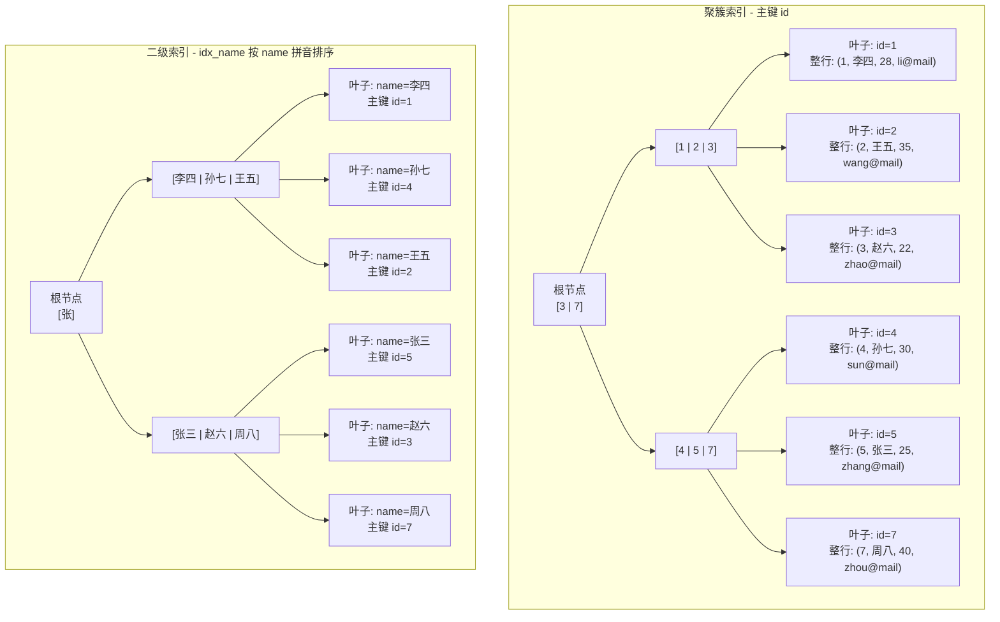
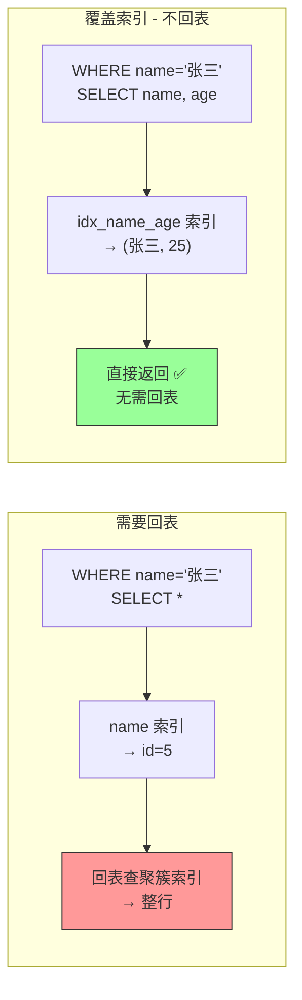
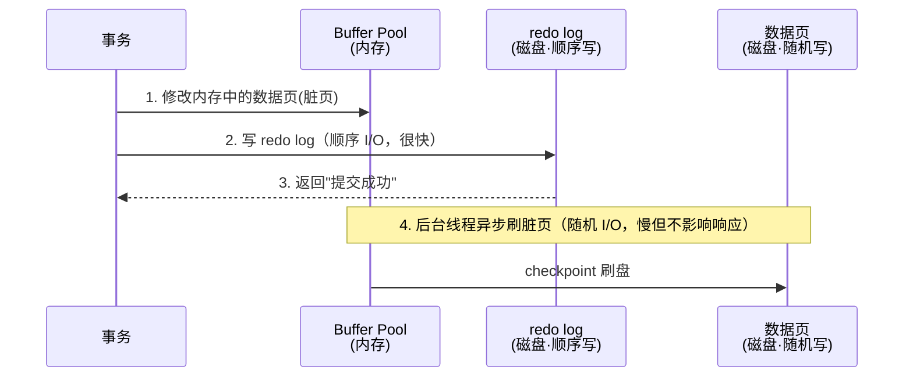

# 3.9 数据库 MySQL：为什么你的 SQL 慢、锁等待、数据不一致

> MySQL 是后端面试的**必考重镇**。不管你写 Java、Go 还是 Python，最终数据都要落到数据库。
> 面试官最爱的三板斧：**索引为什么快、事务怎么隔离、锁怎么加的**——答不好直接挂。
> 本篇从架构到优化，把 MySQL 的面试高频知识点一次打透。

---

## 一、MySQL 架构总览

你执行一条 `SELECT * FROM user WHERE id = 1`，MySQL 内部经历了什么？

```
客户端 → 连接层 → SQL 层（解析→优化→执行）→ 存储引擎层 → 磁盘
```

三层架构一句话：

| 层 | 职责 | 关键组件 |
|----|------|---------|
| **连接层** | 管理连接、鉴权 | 连接池、线程复用 |
| **SQL 层（Server 层）** | 解析 SQL、优化执行计划、调用引擎 | Parser、Optimizer、Executor |
| **存储引擎层** | 真正存取数据 | InnoDB、MyISAM、Memory 等（可插拔） |

### InnoDB vs MyISAM

面试只需一句话区分：**InnoDB 支持事务和行锁，MyISAM 不支持**。

| 维度 | InnoDB | MyISAM |
|------|--------|--------|
| 事务 | 支持（ACID） | 不支持 |
| 锁粒度 | 行锁 | 表锁 |
| 外键 | 支持 | 不支持 |
| 崩溃恢复 | 基于 redo log，安全 | 无日志，容易丢数据 |
| 全文索引 | 5.6+ 支持 | 支持 |
| 聚簇索引 | 有（数据和主键索引存一起） | 无（索引和数据分离） |
| 适用场景 | OLTP（线上业务首选） | 只读/分析型（已被淘汰） |

> MySQL 5.5 之后默认引擎就是 InnoDB，面试只聊 InnoDB 就够了。

### InnoDB 内存架构——数据在内存里怎么组织？

InnoDB 的内存由四个核心区域构成，理解它们是读懂性能调优和崩溃恢复的前提：

```
┌──────────────────────────────── InnoDB Memory ─────────────────────────────┐
│                                                                              │
│  ┌─────────────────────────────────────────────────────┐                   │
│  │              Buffer Pool（缓冲池，最核心）             │                   │
│  │  ┌──────────────────┐   ┌────────┐   ┌───────────┐  │                   │
│  │  │   Free List       │   │LRU List│   │Flush List │  │                   │
│  │  │  （空闲页链表）    │   │（冷热区）│   │（脏页链表） │  │                   │
│  │  └──────────────────┘   └────────┘   └───────────┘  │                   │
│  └─────────────────────────────────────────────────────┘                   │
│                                                                              │
│  ┌──────────────────┐   ┌──────────────────┐   ┌──────────────────┐        │
│  │  Change Buffer    │   │  Adaptive Hash   │   │   Log Buffer     │        │
│  │  （写缓冲）        │   │  Index（AHI）    │   │ （redo log 缓冲） │        │
│  └──────────────────┘   └──────────────────┘   └──────────────────┘        │
└──────────────────────────────────────────────────────────────────────────┘
```

#### Buffer Pool——InnoDB 最核心的内存结构

Buffer Pool 是 InnoDB 访问磁盘数据的"中转站"。所有的读写操作都先经过 Buffer Pool：读操作把磁盘页加载进来缓存（避免重复 IO）；写操作直接修改内存中的缓存页（修改后的页叫**脏页**），由后台线程异步刷回磁盘。

Buffer Pool 内部用三条链表管理所有缓存页：

**Free List（空闲链表）**：存放所有还没有被使用的空白页。读新数据时从 Free List 取一个空闲页，如果 Free List 为空就触发 LRU 淘汰。

**LRU List（冷热分区链表）**：存放所有已加载的数据页，按冷热分为两个区：

```
LRU List
┌───────────────────────────────────────────────────┐
│← 热区 Young（5/8）│ 冷区 Old（3/8）              →│
│  最近频繁访问的页  │ 新进来的页先放这里            │
└───────────────────────────────────────────────────┘
         ↑ 在 Old 区超过 1s 再次被访问 → 晋升到 Young 区头部
         ↑ Old 区满了 → 从尾部淘汰（LRU 驱逐）
```

**为什么要冷热分区？** 防止全表扫描把热点数据挤出缓存（"缓存污染"）。没有分区的标准 LRU 中，全表扫描会把大量只用一次的页装入，把真正的热点数据挤到尾部淘汰。InnoDB 的解法：新读入的页**先进 Old 区**，只有在 Old 区停留超过 `innodb_old_blocks_time`（默认 1000ms）后再次被访问才晋升到 Young 区。全表扫描的页在 1 秒内不会被访问第二次，所以永远停留在 Old 区，扫完自然被淘汰，不污染热点数据。

> 源码依据：`buf0lru.cc`，老区比例由 `innodb_old_blocks_pct` 控制，默认值 37（即 37%），对应 `BUF_LRU_OLD_RATIO_DEF = 3/8`。

**Flush List（脏页链表）**：存放所有被修改过但还没落盘的脏页，后台 Page Cleaner 线程按 LSN 顺序刷盘并推进 checkpoint。

> 面试常问：**为什么不直接把数据写磁盘，而是先改 Buffer Pool？** 磁盘随机写很慢（数据页分散在各处），改 Buffer Pool 是内存操作，极快；真正的数据页刷盘由后台线程批量、顺序地做，IO 效率高得多。这就是 WAL 机制（先写 redo log 记录变更，再异步刷数据页）的根本意义。

#### Change Buffer——写缓冲，二级索引写入的性能杀手

Change Buffer 解决的是一个具体痛点：修改**非唯一二级索引**时，目标索引页往往不在 Buffer Pool 里，如果每次都把索引页从磁盘读进来再修改，IO 代价极高。

Change Buffer 的做法：如果目标索引页不在 Buffer Pool 中，**把变更操作先记到 Change Buffer 里**（Change Buffer 本身也会持久化到系统表空间，所以不怕 crash）。等到该索引页因其他查询被读进 Buffer Pool 时，再把 Change Buffer 中的变更合并（merge）进去——这叫 **merge 操作**。

```
写入非唯一二级索引：
  ├─ 索引页已在 Buffer Pool → 直接修改，无需 IO
  └─ 索引页不在 Buffer Pool
       ├─ 无 Change Buffer：读磁盘 → 修改 → 随机 IO（慢）
       └─ 有 Change Buffer：记到 Change Buffer → 延迟合并（避免立即 IO）
```

**为什么只对非唯一二级索引有效？** 唯一索引在写入时必须判断唯一性（查有没有重复值），必须把索引页读进来才能检查，无法绕过这次 IO，所以不能用 Change Buffer 缓冲。

> 源码依据：`ibuf0ibuf.cc`，默认 `ibuf_use = IBUF_USE_ALL`，可通过 `innodb_change_buffering` 配置（none/inserts/deletes/changes/all）。Change Buffer 最大占用 Buffer Pool 的 25%，通过 `innodb_change_buffer_max_size` 控制。

> 面试常问：**什么时候应该关小 Change Buffer？** 写入后立即查询的场景（写完马上读同一行）——此时 merge 会被立即触发，Change Buffer 没有起到延迟 IO 的作用，反而增加了 merge 的开销。

#### 自适应哈希索引（AHI）——InnoDB 自动加速的"小彩蛋"

InnoDB 会监控索引页的访问模式，如果某个 B+ 树上的某个查询条件被**非常频繁地**重复执行，InnoDB 会自动为这个查询在内存中建立一个哈希索引，让下次相同条件的查询可以直接走哈希 O(1) 定位，跳过 B+ 树的多层遍历。

这个行为完全自动，无需人工干预（通过 `innodb_adaptive_hash_index` 开关，默认 ON）。你不需要主动建哈希索引，InnoDB 会根据实际热点自己决定。

> 一句话：AHI 是 B+ 树之上的"热点缓存"，InnoDB 发现你总走同一条路，就帮你在路口立个直达指示牌。

#### Log Buffer——redo log 在内存里的暂存区

Log Buffer 是 redo log 在内存中的缓冲区（默认 16MB，`innodb_log_buffer_size`）。事务执行过程中产生的 redo log 先写到 Log Buffer，提交时再根据 `innodb_flush_log_at_trx_commit` 的配置决定何时 write + fsync 到磁盘——这个参数的细节在 5.8 节详述。

---

## 二、索引（面试第一重镇）

### 2.1 InnoDB 的索引规则——先记住结论

在开始理解索引细节之前，先记住 InnoDB 的三条铁律：

1. **每张表有且只有一棵聚簇索引（Clustered Index），就是主键**。你建表时写了 `PRIMARY KEY (id)`，InnoDB 就自动把所有行数据按 id 排序，存储在这棵树的叶子节点上。数据和索引物理上存在一起——这就是"聚簇"（Clustered，聚在一块）的含义。
2. **你额外创建的所有索引，全部都是二级索引（Secondary Index）**，不管是单列的 `INDEX (name)` 还是联合的 `INDEX (name, age)`。二级索引的叶子节点只存主键值，不存完整行。
3. **索引的排序是自动的**。创建索引时 InnoDB 自动按索引列的值构建有序的 B+ 树，排序规则由表的 collation（排序规则）决定，比如 `utf8mb4_0900_ai_ci`（MySQL 8.0 默认）按 Unicode 9.0 标准排。插入、删除数据时树结构自动调整保持有序。

> 一句话：**主键 = 聚簇索引 = 数据本身的存储顺序。其他索引 = 二级索引 = 只存主键的"目录"**。这不是你选的，是 InnoDB 的固定实现。

### 2.2 聚簇索引——数据就存在索引树上

理解了规则 1，聚簇索引就很直观了：它的 B+ 树叶子节点直接存储**整行数据**。用主键查找时，沿着 B+ 树从根节点往下走，找到叶子节点就拿到了完整的一行——只需一次树搜索。

类比：聚簇索引就像新华字典的正文——内容本身就是按拼音排好序的，你查到拼音就直接看到了释义。

### 2.3 二级索引与回表——为什么比主键查询慢

理解了规则 2，二级索引的代价也就清楚了：它的叶子节点只存主键值，不存完整行。所以用二级索引查询时，要走两步：

```sql
-- 假设 name 上有索引
SELECT * FROM user WHERE name = '张三';
-- 第一步：在 name 索引树上找到 name='张三' → 拿到主键 id=5
-- 第二步：拿着 id=5 去聚簇索引树再查一次 → 拿到整行 (5, 张三, 25, zhang@mail)
```

这个"**拿着主键去聚簇索引再查一次**"的过程叫**回表（Index Lookup / Bookmark Lookup）**。回表 = 两次 B+ 树查找，所以二级索引查询天然比主键查询慢。

类比：二级索引就像字典的部首目录——你查到了这个字在第几页（主键），但还得翻到那一页去看内容（回表）。

<details>
<summary><b>展开：聚簇索引 vs 二级索引——B+ 树结构差异图解</b></summary>

假设有一张 `user` 表：

```sql
CREATE TABLE user (
    id    INT PRIMARY KEY,
    name  VARCHAR(50),
    age   INT,
    email VARCHAR(100),
    INDEX idx_name (name),
    INDEX idx_name_age (name, age)
);
```

#### 1. 两棵树的结构对比



聚簇索引的叶子节点存储**完整行数据**，二级索引的叶子节点只存储**主键 id 值**。注意二级索引按 name 的拼音排序：李四(L) → 孙七(S) → 王五(W) → 张三(Z) → 赵六(Z) → 周八(Z)，根节点的分界值 `[张]` 把它们分成两组——这个排序和分组都是 InnoDB 按 collation 规则自动维护的。

#### 2. 回表过程图解

执行 `SELECT * FROM user WHERE name = '张三'` 时：


</details>

### 2.4 索引的两个分类维度

索引有两个独立的分类维度，不要混淆：

| 维度 | 分类 | 区分依据 | 谁决定的 |
|------|------|---------|---------|
| **存储方式** | 聚簇索引 vs 二级索引 | 叶子节点存整行数据还是只存主键 | InnoDB 固定规则（主键=聚簇，其余=二级） |
| **列数** | 单列索引 vs 联合索引 | 索引建在一个列上还是多个列上 | 你的 DDL 决定 |

两个维度可以自由组合——联合索引绝大多数情况下是二级索引，比如 `INDEX (name, age)` 就是一个联合的二级索引。理论上聚簇索引也可以是"联合"的：如果主键是 `PRIMARY KEY (order_id, item_id)`，那聚簇索引就按这两列排序，叶子节点存完整行。只不过联合主键在实践中较少见，所以提到"联合索引"时默认指二级索引。

### 2.5 联合索引 + 最左前缀原则

联合索引 `(a, b, c)` 底层的 B+ 树是**先按 a 排序，a 相同按 b 排序，b 相同按 c 排序**。

```sql
-- 能用上索引的情况
WHERE a = 1                      -- 用到 a ✓
WHERE a = 1 AND b = 2            -- 用到 a, b ✓
WHERE a = 1 AND b = 2 AND c = 3  -- 用到 a, b, c ✓
WHERE a = 1 AND c = 3            -- 只用到 a ✓（c 用不上，中间断了）

-- 用不上索引的情况
WHERE b = 2                      -- 最左列 a 缺失 ✗
WHERE b = 2 AND c = 3            -- 最左列 a 缺失 ✗
```

> 口诀：**最左前缀不能断，遇到范围就停止**。`WHERE a > 1 AND b = 2`，a 用了范围查询后 b 就用不上索引了。

### 2.6 覆盖索引——避免回表的利器

如果一个查询需要的字段**全部在索引中**，就不需要回表——这叫覆盖索引。

```sql
-- 索引 (name, age)
SELECT name, age FROM user WHERE name = '张三';
-- name 和 age 都在索引里，直接返回，不回表
-- EXPLAIN 的 Extra 列会显示 "Using index"
```

覆盖索引是减少 IO 最有效的手段之一，面试必提。

<details>
<summary><b>展开：回表 vs 覆盖索引——对比图解</b></summary>

```sql
-- 场景 A：需要回表（SELECT * 要的字段超出索引范围）
SELECT * FROM user WHERE name = '张三';
-- name 索引只存了 (name, id)，要 age/email 必须回表

-- 场景 B：覆盖索引，不需要回表
SELECT name, age FROM user WHERE name = '张三';
-- 联合索引 idx_name_age(name, age) 已经包含了 name 和 age
-- 直接从索引返回，EXPLAIN Extra 显示 "Using index"
```



</details>

### 2.7 索引失效的常见场景

| # | 场景 | 示例 | 原因 |
|---|------|------|------|
| 1 | 对索引列使用函数 | `WHERE YEAR(create_time) = 2024` | 函数包裹后无法走 B+ 树 |
| 2 | 隐式类型转换 | `WHERE phone = 13800138000`（phone 是 varchar） | MySQL 内部做了 CAST，等于加了函数 |
| 3 | LIKE 左模糊 | `WHERE name LIKE '%三'` | B+ 树只能从左到右匹配 |
| 4 | OR 连接非索引列 | `WHERE name = '张三' OR remark = 'x'` | remark 无索引导致全表 |
| 5 | 联合索引不满足最左前缀 | `WHERE b = 2`（索引是 `(a, b)`） | 跳过了最左列 |
| 6 | 使用 != 或 NOT IN | `WHERE status != 1` | 优化器认为扫描范围太大不如全表 |
| 7 | IS NULL / IS NOT NULL | `WHERE name IS NOT NULL`（视数据分布） | 优化器可能放弃索引 |

> 面试被问「索引失效有哪些情况」，至少答出 5 种 + 给出原因。

<details>
<summary><b>展开：B+ 树为什么适合数据库？为什么不用 Hash / B 树？</b></summary>

理解了上面的索引用法之后，你可能会好奇：为什么 InnoDB 选择 B+ 树作为索引的底层数据结构？

数据库索引的本质是**把随机 IO 变成顺序 IO，把全表扫描变成树搜索**。B+ 树恰好满足这三点：**矮胖**——每个节点存几百~上千个 key，3-4 层就能覆盖千万级数据，树高矮意味着磁盘 IO 次数少；**叶子节点链表串联**——范围查询只需找到起始叶子节点，然后顺序遍历链表，走的是顺序 IO；**非叶子节点只存 key 不存数据**——一个 16KB 的页能装更多 key，树更矮。

**Hash 索引的缺陷**：只能做等值查询（`=`、`IN`），不支持范围查询（`>`、`<`、`BETWEEN`）；无法利用索引排序；存在 Hash 冲突，极端情况退化成链表；不支持最左前缀匹配。Memory 引擎默认用 Hash 索引，InnoDB 不用。

**B 树（不带 +）的缺陷**：非叶子节点也存数据，导致每个节点能存的 key 更少，树更高，磁盘 IO 更多；叶子节点之间没有链表，范围查询需要中序遍历整棵树，效率差。

> B+ 树的结构图解、插入/查找过程演示、与 B 树/红黑树/跳表/Hash 的完整对比，以及常见树结构总览（BST/AVL/红黑树/B树/B+树/跳表/Trie/堆）见 **[附录 A1：核心数据结构原理](./A1-核心数据结构原理.md)**

</details>

### 2.8 索引条件下推（ICP）——减少回表次数

ICP（Index Condition Pushdown）是 MySQL 5.6 引入的优化，思路是把 WHERE 条件中**能用索引列过滤的部分**下推到存储引擎层执行，而不是等回表之后再在 Server 层过滤。

没有 ICP 时的流程：

```
索引扫描 → 找到所有满足索引前缀条件的行 → 逐行回表取完整记录 → Server 层用剩余条件过滤
```

有 ICP 时的流程：

```
索引扫描 → 在索引层就用剩余条件过滤（不回表）→ 只对通过过滤的行回表
```

举个例子：表有联合索引 `(name, age)`，执行 `WHERE name LIKE '张%' AND age > 20`。

```sql
-- 没有 ICP：
-- 引擎按 name LIKE '张%' 扫描索引，把所有"张"开头的行全部回表
-- 然后 Server 层再用 age > 20 过滤 → 回表次数多

-- 有 ICP（EXPLAIN Extra 显示 "Using index condition"）：
-- 引擎扫描索引时，同时用 age > 20 在索引层过滤
-- 只有同时满足两个条件的行才回表 → 回表次数大幅减少
```

> 源码依据：`ha_innodb.cc:21051 ha_innobase::idx_cond_push()`。ICP 默认开启，可用 `SET optimizer_switch='index_condition_pushdown=off'` 关闭。

### 2.9 MRR（Multi-Range Read）——把随机 IO 变顺序 IO

二级索引的范围查询会产生大量回表操作，而回表是按**主键顺序乱序**访问聚簇索引的，这些回表 IO 是随机 IO，非常慢。MRR 的优化思路是：先把范围扫描到的主键值**收集起来排序**，再批量按顺序回表，把随机 IO 变成顺序 IO。

```
没有 MRR：
索引扫描 → 主键 [5, 3, 9, 1, 7] → 按这个顺序一条条回表 → 随机 IO

有 MRR（EXPLAIN Extra 显示 "Using MRR"）：
索引扫描 → 主键 [5, 3, 9, 1, 7] → 先排序 [1, 3, 5, 7, 9] → 顺序回表 → 顺序 IO（快）
```

MRR 默认开启（`optimizer_switch='mrr=on,mrr_cost_based=on'`），在范围查询 + 大量回表的场景下收益明显。与 BKA（Batched Key Access）JOIN 算法配合时效果更好——BKA 会把驱动表的多行 key 批量收集后用 MRR 方式访问被驱动表。

---

## 三、事务与隔离级别

### 3.1 ACID

ACID 是数据库事务的四个基本保证，面试必考。名字本身是四个单词的首字母组合：

| 属性 | 含义 | 举例 | 靠什么实现 |
|------|------|------|-----------|
| **A**tomicity（原子性） | 事务要么**全部成功**，要么**全部回滚**，不存在“做一半” | 转账：A 扣钱 + B 加钱，必须同时成功或同时回滚 | **undo log**（回滚日志）——记录修改前的值，失败时按日志撤销 |
| **C**onsistency（一致性） | 事务前后，数据必须满足所有约束（唯一、外键、业务规则） | 转账前 A+B=1000，转账后 A+B 仍然=1000 | 不是单独的机制，而是 **AID 三者共同保证**的结果 |
| **I**solation（隔离性） | 并发事务之间**互不干扰**——通过控制可见性，让事务读不到不该看的数据，从源头避免基于错误数据做出错误决策 | A 在转账过程中，B 查余额不会看到"A 已扣但 B 未加"的中间态 | **锁 + MVCC**（下文详述） |
| **D**urability（持久性） | 事务提交后，即使数据库崩溃，数据也**不会丢失** | 提交成功后突然断电，重启后数据仍然在 | **redo log**（重做日志）——先写日志再写磁盘（WAL） |

> **后端类比**：ACID 就像你写代码时的 try-catch-finally——原子性是 try 块（要么全做），回滚是 catch 块（失败撤销），持久性是 finally 块（不管怎样都落盘），隔离性是 synchronized（并发不乱）。

为什么隔离性是必须的？你可能会想：一个事务看到了另一个事务的数据，自己不用不就行了？问题在于**数据库里不存在"只看不用"的读操作**——每次 SELECT 的结果要么进了应用层的 IF 判断，要么进了 SQL 自己的 WHERE / JOIN 条件，读到的值会直接驱动后续的业务决策。数据库没办法控制"你读到了但别拿去做判断"，所以 Isolation 的策略是**从源头控制可见性**：不该看的数据直接不让你看到，你自然不会基于错误数据做出错误决策。MVCC 就是这个思路的典型实现——不是加锁不让你读，而是给你看一个"快照版本"，别人中间怎么改你都感知不到。

### 3.2 四种隔离级别

隔离级别（Isolation Level）就是“并发事务之间能看到彼此多少”的程度。级别越高，看到的越少（越安全），但性能越低。这是安全性和性能的取舍：

| 隔离级别 | 中文名 | 含义 | 脏读 | 不可重复读 | 幻读 | 性能 |
|---------|--------|------|------|-----------|------|------|
| Read Uncommitted | 读未提交 | 能读到别人还没提交的数据 | 可能 | 可能 | 可能 | 最高（几乎没人用） |
| **Read Committed (RC)** | **读已提交** | 只能读到别人已提交的数据 | 解决 | 可能 | 可能 | 较高（Oracle 默认） |
| **Repeatable Read (RR)** | **可重复读** | 同一事务内多次读结果一致 | 解决 | 解决 | 可能* | 中等（**MySQL 默认**） |
| Serializable | 串行化 | 事务完全串行执行，不并发 | 解决 | 解决 | 解决 | 最低（基本不用） |

> \* InnoDB 的 RR 级别通过间隙锁 + MVCC 在大多数场景下也解决了幻读，但不是完全杜绝。

### 3.3 三种读异常的例子

**脏读**：事务 A 修改了一行但未提交，事务 B 读到了这个未提交的值 → A 回滚 → B 拿到的数据是假的。

**不可重复读**：事务 A 读了一行（余额 100），事务 B 修改并提交（余额变 200），事务 A 再读同一行发现变了 → 同一事务内两次读结果不一致。

**幻读**：事务 A 查 `WHERE age > 20` 得到 5 行，事务 B 插入了一行 age=25 并提交，事务 A 再查同样条件得到 6 行 → 多出一行"幽灵"。

### 3.4 MVCC 如何实现（InnoDB 的 RR 级别）

**MVCC 是什么？** MVCC（Multi-Version Concurrency Control，**多版本并发控制**）是数据库实现隔离性的核心机制。它的思路是：每次修改数据不是直接覆盖，而是**保留旧版本**，让不同事务看到不同时间点的「快照」。这样**读操作不需要加锁**，读写之间不阻塞，大幅提升并发性能。

> 后端类比：Git 就是一个典型的 MVCC 系统——每次 commit 保留一个版本快照，不同分支（事务）看到不同版本，互不影响。数据库的 MVCC 也是这个原理。

**实现的核心组件：**

1. **隐藏字段**：每行有 `DB_TRX_ID`（最后修改的事务 ID）和 `DB_ROLL_PTR`（指向 undo log 的指针）。
2. **Undo Log**：保存行的历史版本，形成版本链。
3. **ReadView**：读操作时生成的快照，记录当前活跃事务列表（生成时机因隔离级别不同而不同，见下方说明）。

判断可见性的规则（简化版）：

- 如果行的 `TRX_ID` < ReadView 中最小活跃事务 ID → 已提交，**可见**。
- 如果行的 `TRX_ID` > ReadView 中最大事务 ID → 在我之后才开始，**不可见**。
- 如果 `TRX_ID` 在活跃列表中 → 还没提交，**不可见**（沿版本链往前找）。

> RC 和 RR 的区别：RC 每次 SELECT 都生成新 ReadView；RR 只在事务第一次 SELECT 时生成一次，后续复用。

<details>
<summary><b>展开：面试追问「RR 级别下 InnoDB 如何解决幻读？」</b></summary>

InnoDB 在 RR 级别下通过两个机制配合来解决幻读：

**1. 快照读（普通 SELECT）靠 MVCC：**

ReadView 在事务第一次读时固定，后续读都用同一个快照。即使别的事务插入了新行并提交，本事务的快照读也看不到——从快照角度"没有幻读"。

**2. 当前读（SELECT ... FOR UPDATE / INSERT / UPDATE / DELETE）靠间隙锁（Gap Lock）+ 临键锁（Next-Key Lock）：**

当前读需要读最新数据，此时 MVCC 帮不上忙。InnoDB 用 Next-Key Lock（Record Lock + Gap Lock）锁住查询范围内的间隙，阻止其他事务在这个间隙中插入新行。

```sql
-- 事务 A
SELECT * FROM user WHERE age > 20 FOR UPDATE;
-- InnoDB 不仅锁住 age>20 的已有行，还锁住 (20, +∞) 的间隙
-- 事务 B 想 INSERT age=25 → 被阻塞 → 无幻读
```

**注意**：RR 下仍有极端场景可能出现幻读（先快照读再当前读的混合场景），但对 99% 的业务来说已经够用。

</details>

---

## 四、锁机制

### 4.1 锁的粒度

| 锁类型 | 粒度 | 场景 |
|--------|------|------|
| **全局锁** | 整个数据库 | `FLUSH TABLES WITH READ LOCK`，全库逻辑备份 |
| **表锁** | 整张表 | `LOCK TABLES t READ/WRITE`，MyISAM 默认 |
| **行锁** | 单行/范围 | InnoDB 的核心优势，DML 语句自动加 |

> InnoDB 的行锁是加在**索引**上的。如果你的 WHERE 条件没走索引，InnoDB 会对聚簇索引的**每一条记录**都加 Next-Key Lock，效果等同于锁全表——注意这仍是行锁（Next-Key Lock），而非表级锁（TABLE LOCK），但代价一样高。

### 4.2 InnoDB 行锁的三种形式

| 锁类型 | 锁住什么 | 场景 |
|--------|---------|------|
| **Record Lock** | 索引上的一条记录 | 精确等值查询（唯一索引） |
| **Gap Lock** | 两条记录之间的间隙（开区间） | 防止间隙中插入新行（防幻读） |
| **Next-Key Lock** | Record Lock + Gap Lock（左开右闭） | InnoDB 默认加锁方式（RR 级别） |

```sql
-- 假设表中 id 有 1, 5, 10 三行
SELECT * FROM t WHERE id = 5 FOR UPDATE;
-- 唯一索引等值：只加 Record Lock（锁 id=5 这一行）

SELECT * FROM t WHERE id > 5 FOR UPDATE;
-- 范围查询：对 (5, 10] 和 (10, +∞) 加 Next-Key Lock
```

### 4.3 死锁

**产生条件**（四个缺一不可）：

| 条件 | 含义 | 数据库场景举例 |
|------|------|-------------|
| **互斥** | 一个资源同一时间只能被**一个事务**持有（事务 A 锁了行 1，事务 B 就不能同时锁行 1） | 行锁的本质就是互斥——你加了写锁，别人就得等 |
| **占有且等待** | 事务已经持有一个锁，还想要另一个锁，但不释放已有的 | 事务 A 锁了行 1，又去请求锁行 2，同时不放行 1 |
| **不可抢占** | 事务已持有的锁不能被别的事务强制拿走，只能自己释放 | 事务 B 不能强行拿走事务 A 的锁，只能等 A 提交或回滚 |
| **循环等待** | A 等 B，B 等 A，形成环路 | A 锁行 1 等行 2，B 锁行 2 等行 1 → 死锁 |

> “互斥”指的是**事务与事务之间对同一资源（行/页）的独占访问**。这是行锁的基本特征，无法避免，所以破解死锁通常从其他三个条件入手（比如按相同顺序访问资源 → 破坏循环等待）。

**排查方法**：

```sql
-- 查看最近的死锁信息
SHOW ENGINE INNODB STATUS\G
-- 关注 LATEST DETECTED DEADLOCK 部分
```

**预防手段**：

1. 尽量让事务**按相同顺序**访问表和行。
2. 尽量使用**索引**访问数据（避免行锁升级为表锁）。
3. 事务尽量**短小**，减少持锁时间。
4. 设置 `innodb_lock_wait_timeout`（默认 50s），超时自动回滚。
5. 设置 `innodb_deadlock_detect = ON`（默认开启），主动检测死锁并回滚代价小的事务。

### 4.4 乐观锁 vs 悲观锁

| 维度 | 悲观锁 | 乐观锁 |
|------|--------|--------|
| 思想 | 总觉得会冲突，先锁再操作 | 乐观认为不冲突，提交时再验证 |
| 实现 | `SELECT ... FOR UPDATE` | 版本号（version）或 CAS |
| 加锁时机 | 读取时就加锁 | 更新时才检查 |
| 并发性能 | 低（阻塞等待） | 高（无锁竞争） |
| 冲突处理 | 等待/超时 | 重试 |
| 适用场景 | **写多读少**、冲突概率高 | **读多写少**、冲突概率低 |

```sql
-- 悲观锁
BEGIN;
SELECT stock FROM goods WHERE id = 1 FOR UPDATE;  -- 加行锁
UPDATE goods SET stock = stock - 1 WHERE id = 1;
COMMIT;

-- 乐观锁（版本号）
SELECT stock, version FROM goods WHERE id = 1;  -- version=3
UPDATE goods SET stock = stock - 1, version = version + 1
WHERE id = 1 AND version = 3;  -- 如果 version 变了说明被人改过，更新失败
```

<details>
<summary><b>展开：面试追问「意向锁是什么？加锁过程是怎样的？」</b></summary>

**意向锁（Intention Lock）**是表级锁，用来快速判断表中是否有行锁。

- **IS（意向共享锁）**：事务要对某行加 S 锁前，先对表加 IS 锁。
- **IX（意向排他锁）**：事务要对某行加 X 锁前，先对表加 IX 锁。

意向锁之间互相兼容，只和表级的 S/X 锁冲突。它的作用是：当你要对整张表加锁时，不需要逐行检查有没有行锁，只需看表上有没有意向锁就行。

**加锁过程（以 `SELECT ... FOR UPDATE` 为例）：**

1. 对表加 IX 锁（意向排他锁）。
2. 根据 WHERE 条件定位到索引记录。
3. 对命中的索引记录加 X 型 Record Lock / Next-Key Lock。
4. 如果需要回表（二级索引查询），还要对聚簇索引对应的主键记录加 Record Lock。

> 注意：加锁是加在索引上的！如果 WHERE 条件没有用到索引，InnoDB 会对聚簇索引的所有记录加 Next-Key Lock——相当于锁表。

</details>

### 4.5 自增主键与自增锁

自增主键（`AUTO_INCREMENT`）在高并发写入时涉及锁竞争。InnoDB 提供三种模式（`innodb_autoinc_lock_mode`），是性能和安全的折中：

| 模式 | 值 | 行为 | 适用场景 |
|------|----|------|---------|
| **传统模式** | 0 | 整个 INSERT 期间持有表级 AUTO-INC 锁，并发写入完全串行 | 几乎不用（性能差） |
| **连续模式** | 1（**5.7 默认**） | 普通单行 INSERT 用轻量互斥锁（语句结束即释放）；批量 INSERT（INSERT ... SELECT）仍用表级锁 | binlog 用 statement/mixed 格式时安全 |
| **交错模式** | 2 | 所有 INSERT 都用轻量锁，完全不阻塞，并发最高 | **binlog 必须用 row 格式**，8.0 起默认 |

**为什么自增 ID 会不连续（出现空洞）？** 模式 1 和 2 下，批量插入会预先分配一批 ID，如果事务中途回滚，已分配的 ID 不会归还——这是设计取舍，保留 ID 比归还锁的代价更低。

> 源码依据：`ha_innodb.cc:143` 的三个常量 `AUTOINC_OLD_STYLE_LOCKING / NEW_STYLE / NO_LOCKING`，默认值 `AUTOINC_NEW_STYLE_LOCKING = 1`。

### 4.6 死锁检测：等待图（Wait-For Graph）

InnoDB 使用**有向图**检测死锁：图的节点是事务，边表示"等待关系"（A 等 B 持有的锁 → A→B 有一条边）。死锁检测就是在这张图里寻找**环路**。

```
事务 A 持有行1的锁，等待行2 → A→B
事务 B 持有行2的锁，等待行1 → B→A
                              → 形成环 A→B→A，死锁！
```

发现环路后，InnoDB 选择**回滚代价最小的事务**（即 undo log 量最少的那个，`trx_weight_ge()` 函数比较），让另一个事务继续执行。被选中回滚的事务会收到 `ERROR 1213: Deadlock found`。

> 死锁检测由 `innodb_deadlock_detect`（默认 ON）控制。超高并发场景下（如秒杀），死锁检测本身会占用大量 CPU（等待图遍历的复杂度随并发事务数增加），可以考虑关闭检测 + 设置较小的 `innodb_lock_wait_timeout`（默认 50s），让超时自动回滚来替代死锁检测。

---

## 五、日志体系：redo log / undo log / binlog

MySQL 的日志体系是保证 ACID 和主从复制的底层基石。先搞清楚每种日志「记的到底是什么」，再看它们的工作机制。

### 5.1 redo log——记的是什么？

redo log 是 InnoDB 引擎层的日志，记录的是**物理修改**：哪个数据页（Page）的哪个偏移位置（Offset）被改成了什么值。

```
-- 假设执行：
UPDATE account SET balance = 900 WHERE id = 1;

-- redo log 记录的内容（简化）：
页号=38, 偏移=120, 修改前长度=4, 修改后值=900
```

它不记录 SQL 语句，也不关心你的表叫什么名字——只关心磁盘上哪个位置的字节变了。这种「物理级别」的记录让它可以在崩溃后精确地重放修改，恢复数据。

> 一句话：redo log 是**给崩溃恢复用的**，保证的是 ACID 中的 **D（持久性）**。

### 5.2 undo log——记的是什么？

undo log 也是 InnoDB 引擎层的日志，记录的是**逻辑反向操作**：你做了什么操作，它记下"怎么撤销"。

```
-- 假设执行：
UPDATE account SET balance = 900 WHERE id = 1;  -- 原来 balance=1000

-- undo log 记录的内容（简化）：
把 id=1 的 balance 改回 1000

-- 假设执行：
INSERT INTO account (id, balance) VALUES (5, 500);

-- undo log 记录的内容（简化）：
删除 id=5 的那行
```

undo log 记的是「反向操作」——INSERT 对应 DELETE，UPDATE 对应"改回旧值"，DELETE 对应"把整行放回去"。这样事务回滚时只需要顺着 undo log 往回执行就行。

除了回滚，undo log 还有第二个关键用途：**MVCC 版本链**。前面 3.4 节讲过，每行数据的 `DB_ROLL_PTR` 指向 undo log 中的上一个版本，多个版本串成链，这就是 MVCC 读快照的数据来源。

> 一句话：undo log 是**给回滚和 MVCC 用的**，保证的是 ACID 中的 **A（原子性）** 和 **I（隔离性）** 的一部分。

### 5.3 binlog——记的是什么？

binlog 是 MySQL Server 层的日志（不是 InnoDB 独有），记录的是**逻辑变更**：所有导致数据变化的操作。

```
-- 假设执行：
UPDATE account SET balance = 900 WHERE id = 1;

-- binlog 记录的内容取决于格式：
-- statement 格式：记原始 SQL
  UPDATE account SET balance = 900 WHERE id = 1;

-- row 格式：记每行变更的前后值
  表=account, 修改行: id=1, balance: 1000→900
```

binlog 和 redo log 的核心区别：redo log 是引擎层的物理日志，循环写（固定大小会覆盖）；binlog 是 Server 层的逻辑日志，追加写（不会覆盖，可以保留完整历史）。

> 一句话：binlog 是**给主从复制和数据恢复用的**，它不保证单机的 crash-safe，而是保证从库能重放主库的所有变更。

### 5.4 三种日志对比

| 维度 | redo log | undo log | binlog |
|------|----------|----------|--------|
| **所属层级** | InnoDB 引擎层 | InnoDB 引擎层 | MySQL Server 层 |
| **记录内容** | 物理修改（页号+偏移+新值） | 逻辑反向操作（怎么撤销） | 逻辑变更（SQL 或行变更） |
| **写入方式** | 循环写（固定大小，写满覆盖） | 随事务生命周期写，提交后可清理 | 追加写（永不覆盖） |
| **保证的特性** | **持久性**（crash-safe） | **原子性**（回滚）+ MVCC | **复制** + 归档恢复 |
| **所有引擎都有？** | 否（InnoDB 独有） | 否（InnoDB 独有） | 是（Server 层，所有引擎通用） |

### 5.5 redo log 的 WAL 机制

搞清楚了 redo log 记什么之后，来看它的核心机制——WAL（Write-Ahead Logging）：**先写日志，再写磁盘数据页**。



WAL 的精髓在于：**把代价高的随机写变成了代价低的顺序写**。事务提交时只需要 redo log 顺序落盘就算成功，真正的数据页刷盘可以延后异步做。即使 crash，重启后靠 redo log 重放即可恢复。

redo log 是固定大小的**循环写**文件（如 4 个 1GB 文件首尾相连）。checkpoint 是**持续滚动推进**的——后台 Page Cleaner 线程不断将脏页刷盘并推进 checkpoint 位点，write pos（写入位置）和 checkpoint 之间的区间就是可继续写入的空闲空间。只有当 write pos 追上 checkpoint、空闲空间耗尽时，才会**阻塞用户线程**等待 checkpoint 推进后再写——这才是"写满"的真实含义，而不是 checkpoint 被动等到满了才触发。

### 5.6 binlog 的三种格式

| 格式 | 记录内容 | 优点 | 缺点 |
|------|---------|------|------|
| **statement** | 原始 SQL 语句 | 日志量小 | 非确定性函数（NOW()、RAND()）可能导致主从不一致 |
| **row** | 每行数据的变更前后值 | 精确，不会不一致 | 日志量大（批量 UPDATE 可能产生大量日志） |
| **mixed** | 自动选择：安全用 statement，不安全用 row | 折中 | 行为不够可预测 |

> 生产环境推荐使用 **row** 格式，数据安全最重要。

### 5.7 两阶段提交——日志（redo log 与 binlog 两个）怎么保持一致？

redo log 和 binlog 是两个独立的日志系统（一个在引擎层，一个在 Server 层），如何保证它们的一致性？用**两阶段提交（2PC）**，核心流程分为 Prepare 和 Commit 两个阶段：

**Phase 1 — Prepare（InnoDB 引擎侧）：**
InnoDB 将事务的 undo log 状态从 `TRX_UNDO_ACTIVE` 改为 `TRX_UNDO_PREPARED`，同时把这个状态变更写入 redo log buffer（**注意：此时不 fsync，不立即落盘**）。这是 MySQL 5.6+ 引入的 **Group Prepare** 优化——InnoDB 故意将 redo log 的 fsync 推迟，由后续 binlog 的 Group Commit 批量完成，避免每个事务单独 fsync redo log 的开销。源码中通过设置 `thd->durability_property = HA_IGNORE_DURABILITY` 通知 InnoDB 跳过 prepare 阶段的 fsync（`binlog.cc: MYSQL_BIN_LOG::prepare()`）。

**Phase 2 — Commit（Binlog Group Commit，BGC 三阶段）：**
MySQL 将并发提交的多个事务聚合成一个 group，依次经历三个子阶段：

1. **Flush 阶段**：将每个事务的 binlog cache 写入 binlog 文件（OS page cache），同时在此阶段**批量 fsync InnoDB redo log**（Group Prepare 的 redo 落盘就在这里完成）。写入 binlog 的内容包含 `Xid_log_event`，里面记录的 XID 与 InnoDB undo log 中的 XID 相同，这是崩溃恢复时两份日志对账的纽带。
2. **Sync 阶段**：调用 `fdatasync()` 将 binlog 文件落盘。**binlog sync 完成是事务持久化的关键点**——此后即使 crash，凭借 binlog 中的 XID 就能确定事务应该提交。
3. **Commit 阶段**：调用 `ha_commit_low → innobase_commit`，完成 InnoDB 引擎侧的真正提交（标记 undo log 已完成、释放行锁、事务状态置为 NOT_STARTED）。

BGC 的 Leader/Follower 机制：并发提交的线程竞争进入各阶段队列，队列为空时第一个进入的线程成为 **Leader**，代表整个 batch 执行该阶段操作，其余线程作为 **Follower** 阻塞等待，Leader 完成后统一唤醒（`Stage_manager::signal_done()`）。

**崩溃恢复裁决规则：**

| 崩溃时刻 | InnoDB undo 状态 | binlog 有 XID | 恢复动作 |
|----------|-----------------|--------------|---------|
| Prepare 之前 | ACTIVE | 无 | InnoDB 回滚 |
| Prepare 之后、binlog sync 之前 | PREPARED | 无 | InnoDB 回滚 |
| **binlog sync 之后** | PREPARED | **有** | InnoDB **提交**（XID 匹配） |
| Commit 完成后 | NOT_STARTED | 有 | 正常，无需操作 |

这样 crash 后恢复程序扫描 binlog 中已 sync 的 XID 集合，凡是 InnoDB 中 PREPARED 状态且 XID 在集合里的事务，一律提交；不在集合里的，回滚。

一个事务从执行到提交分为三个阶段：**改内存（全在内存）→ 落日志（两阶段提交，保证 redo log 与 binlog 一致）→ 异步落数据（后台线程刷脏页，与前两阶段完全解耦）**。阶段一和阶段二严格串行；阶段三随时可能发生（Page Cleaner 不关心事务阶段），这也是为什么 crash 后即使事务未提交也需要用 undo log 回滚磁盘数据页。

> 两阶段提交的完整时序图、三阶段的串行/并行关系、刷盘机制（write + fsync）、prepare/commit 状态字段的含义、六种 crash 场景的逐一分析，以及分布式 2PC 和 Flink 2PC 的对比，见 **[附录 A3：两阶段提交](./A3-两阶段提交.md)**。

### 5.8 双参数刷盘配置——性能与安全的取舍

redo log 和 binlog 各自都有一个控制刷盘时机的参数，两者的组合决定了数据库在极端 crash 下的安全程度。

**`innodb_flush_log_at_trx_commit`**（控制 redo log 刷盘）：

| 值 | write 时机 | fsync 时机 | 风险 |
|----|-----------|-----------|------|
| **0** | 每秒一次 | 每秒一次 | 机器 crash 丢最多 1 秒的 redo log |
| **1（默认）** | 每次提交 | 每次提交 | 不丢（完全 crash-safe） |
| **2** | 每次提交（到 OS page cache） | 每秒一次 | OS crash 不丢；断电丢最多 1 秒 |

> 源码依据（`trx0trx.cc:1796`）：`case 0` 什么也不做，`case 1` 调 `log_write_up_to(lsn, flush=true)`（write + fsync），`case 2` 调 `log_write_up_to(lsn, flush=false)`（只 write，不 fsync）。

**`sync_binlog`**（控制 binlog 刷盘）：

| 值 | fsync 时机 | 风险 |
|----|-----------|------|
| **0** | 由 OS 决定（不主动 fsync） | OS crash 可能丢多个事务的 binlog |
| **1（推荐）** | 每次提交都 fsync | 不丢 |
| **N** | 每 N 次提交 fsync 一次 | 最多丢 N-1 个事务的 binlog |

**"双 1 配置"（生产推荐）**：`innodb_flush_log_at_trx_commit=1` + `sync_binlog=1`——每次事务提交都保证 redo log 和 binlog 双双落盘，任何 crash 场景均不丢数据。代价是每次提交多两次 fsync，高并发写入时会是性能瓶颈（通过 BGC 批量合并 fsync 来缓解，见 5.7 节）。

> 面试常问：**`innodb_flush_log_at_trx_commit=2` 和 `=1` 的区别是什么？** 区别在于断电（OS 崩溃后数据在 page cache 里丢失）vs 进程崩溃（MySQL 进程挂掉，数据在 page cache 里仍在）。对于部署在物理机 RAID 卡有电容保护的生产环境，设为 2 可以在安全性和性能间取得较好平衡。

### 5.9 undo log 的 Purge 机制——版本链为什么不会无限增长

前面说过 MVCC 靠 undo log 维护版本链，但历史版本不能永久保留，否则 undo log 会无限膨胀。InnoDB 的解法是 **Purge**：由后台 purge 线程定期清理不再需要的旧版本。

**什么时候一个旧版本"不再需要"？** 当系统中所有活跃事务的 ReadView 都不再需要这个版本时——即没有任何活跃事务的快照时间点在这个版本之后。purge 线程会维护一个全局最小活跃事务 ID，早于这个 ID 产生的版本可以安全清理。

**长事务是 undo log 膨胀的元凶**：一个运行时间很长的事务，它的 ReadView 会一直存在，导致 purge 线程无法清理这个事务启动时间点之后所有其他事务产生的旧版本——整个期间所有行的历史版本都被迫保留，undo log 大量堆积，`ibdata1`（系统表空间）持续膨胀。

```sql
-- 排查是否有长事务
SELECT trx_id, trx_started, NOW() - trx_started AS duration_sec, trx_query
FROM information_schema.INNODB_TRX
WHERE NOW() - trx_started > 60  -- 超过 60 秒的事务
ORDER BY trx_started;
```

> 最佳实践：线上禁止使用大事务和长事务；ORM 框架注意关闭自动开启的空闲事务（如 Spring `@Transactional` 方法中的耗时外部调用）；`innodb_max_purge_lag` 超标时会限速 DML，是 undo 积压的报警信号。

### 5.10 双写缓冲（Doublewrite Buffer）——防止页撕裂

InnoDB 数据页大小是 **16KB**，而操作系统通常以 4KB（甚至 512B）为单位写磁盘。如果 MySQL 在写一个 16KB 数据页到一半时 crash，磁盘上就有一个只写了一半的损坏页——这叫**页撕裂（Torn Page）**。

redo log 无法修复损坏页，因为 redo log 重放的前提是"以一个完整的旧页为基础进行增量恢复"，如果页本身就已经损坏，重放结果也是错的。

**双写缓冲的解决方案**（`buf0dblwr.cc`）：

```
脏页刷盘时：
  ① 先把脏页顺序写到系统表空间中连续的"双写区"（2 × 1MB）并 fsync
                     ↓
  ② 再把脏页写到真实的数据文件位置（分散的随机写）
```

崩溃恢复时，若发现数据文件中某页损坏，从双写区找到完整的备份页，覆盖损坏页，再重放 redo log——这样总能恢复到一致状态。

> 双写缓冲引入了一次额外的顺序 IO（写双写区），但顺序 IO 成本远低于随机 IO，对性能影响通常在 5~10% 以内。对于底层使用 ZFS 文件系统或支持原子写的存储（如部分 NVMe SSD），可以通过 `innodb_doublewrite=OFF` 关闭，因为这些存储本身保证了 16KB 写的原子性。

---

## 六、分库分表

### 6.1 为什么要分

单机 MySQL 的三个天花板：

| 瓶颈 | 阈值（经验值） | 表现 |
|------|--------------|------|
| 单表行数 | 2000 万~5000 万行 | B+ 树层数增加，查询变慢 |
| 单库容量 | 磁盘上限/备份困难 | 全量备份耗时过长 |
| 单机 QPS | 几千~1 万（复杂查询） | CPU/IO 打满 |

### 6.2 水平分片 vs 垂直分片

| 策略 | 做法 | 适用场景 |
|------|------|---------|
| **垂直分库** | 按业务拆（用户库、订单库、商品库） | 业务解耦、不同库独立扩容 |
| **垂直分表** | 把大字段拆到扩展表（主表只留常用字段） | 减小单行大小，提升查询效率 |
| **水平分表** | 同一张表按某个 key 拆到多张表/多个库 | **数据量大**是核心驱动力 |

### 6.3 分片键与分片策略

| 策略 | 做法 | 优点 | 缺点 |
|------|------|------|------|
| **Range** | 按时间/ID 范围分（0-100万、100-200万） | 扩容简单，天然支持范围查询 | 热点集中在最新分片 |
| **Hash** | `hash(分片键) % N` | 数据均匀 | 扩容时需要数据迁移 |
| **[一致性 Hash](./08-缓存与Redis.md)** | 虚拟节点环（原理详见 3.8 Redis Cluster 一致性 Hash 折叠块） | 扩容只迁移少量数据 | 实现复杂 |

> 分片键选择原则：**高频查询条件 + 数据均匀分布 + 避免跨片查询**。电商系统典型选 `user_id`。

### 6.4 分片后的麻烦事

| 问题 | 解决思路 |
|------|---------|
| **跨片 JOIN** | 尽量避免；冗余字段、应用层组装、全局表 |
| **分布式 ID** | Snowflake、Leaf、UUID、数据库号段 |
| **数据迁移** | 双写迁移、影子表切换 |
| **全局排序/分页** | 各分片取 Top N 再合并（性能差） |
| **事务一致性** | 柔性事务（TCC/Saga）或消息最终一致 |

### 6.5 常用中间件

| 中间件 | 类型 | 特点 |
|--------|------|------|
| **ShardingSphere** | 客户端 + 代理双模式 | Apache 顶级项目，生态好，Java 首选 |
| **MyCat** | 数据库代理 | 对应用透明，但性能有损耗 |
| **Vitess** | 代理 | YouTube 出品，适合大规模 MySQL 集群 |

---

## 七、SQL 优化实战

### 7.1 EXPLAIN 看懂执行计划

```sql
EXPLAIN SELECT * FROM user WHERE name = '张三' AND age > 20;
```

| 字段 | 含义 | 重点关注 |
|------|------|---------|
| **type** | 访问类型 | 从好到差：system > const > eq_ref > ref > range > index > **ALL**（全表扫描） |
| **key** | 实际使用的索引 | NULL 表示没用索引 |
| **rows** | 预估扫描行数 | 越小越好 |
| **Extra** | 额外信息 | `Using index`（覆盖索引好）、`Using filesort`（需优化）、`Using temporary`（需优化） |

> 面试被问「你怎么优化慢 SQL」，第一步永远是 `EXPLAIN`。

### 7.2 慢查询日志

```sql
-- 开启慢查询日志
SET GLOBAL slow_query_log = ON;
SET GLOBAL long_query_time = 1;  -- 超过 1 秒记录

-- 查看慢查询日志位置
SHOW VARIABLES LIKE 'slow_query_log_file';
```

配合 `mysqldumpslow` 或 `pt-query-digest` 工具分析 Top N 慢 SQL。

### 7.3 常见优化手段清单

| # | 手段 | 说明 |
|---|------|------|
| 1 | 选择合适索引 | 针对 WHERE/ORDER BY/GROUP BY 建索引，避免冗余 |
| 2 | 避免 SELECT * | 只取需要的列，减少 IO 和网络传输 |
| 3 | 分页优化 | 深分页用「游标法」代替 OFFSET |
| 4 | 批量操作 | INSERT 合并、IN 代替多次单条查询 |
| 5 | 避免在索引列上做运算 | 函数/计算导致索引失效 |
| 6 | 合理使用覆盖索引 | 减少回表 |
| 7 | JOIN 优化 | 小表驱动大表；JOIN 字段加索引 |
| 8 | 子查询改 JOIN | MySQL 对子查询优化有限 |
| 9 | 利用 LIMIT 提前终止 | 只需要少量数据时加 LIMIT |
| 10 | 读写分离 | 写走主库，读走从库，分摊压力 |

### 7.4 JOIN 的三种执行算法——小表驱动大表的本质

MySQL 的 JOIN 底层根据被驱动表是否有索引，选择不同算法：

**NLJ（Nested-Loop Join，嵌套循环 Join）**：被驱动表上有索引时使用。

```
for 每一行 in 驱动表:
    用驱动表的值 → 走被驱动表的索引 → 取出匹配行
```

驱动表每一行对应被驱动表的一次索引查找，IO 次数 = 驱动表行数。**被驱动表有索引是 NLJ 的前提**，这就是 JOIN 字段必须加索引的根本原因。

**BNL（Block Nested-Loop Join，块嵌套循环 Join）**：被驱动表上**没有索引**时使用。

```
将驱动表的行批量放入 join_buffer（默认 256KB）
for 每一批驱动表数据 in join_buffer:
    全表扫描被驱动表，逐行与 join_buffer 中的数据比较
```

BNL 通过批量加载驱动表减少了被驱动表的全表扫描次数，但本质上还是全表扫描——被驱动表越大，性能越差。`EXPLAIN` Extra 显示 `Using join buffer (Block Nested Loop)`。

**BKA（Batched Key Access）**：NLJ 的升级版，结合 MRR 使用。

```
收集驱动表多行的 JOIN key → 排序 → 用 MRR 批量查询被驱动表索引（顺序 IO）
```

BKA 默认关闭，需要显式开启：`SET optimizer_switch='mrr=on,mrr_cost_based=off,batched_key_access=on'`。

| 算法 | 被驱动表是否有索引 | IO 模式 | EXPLAIN Extra |
|------|--------------------|---------|--------------|
| NLJ | 有 | 索引随机读 | — |
| BNL | 无 | 全表扫描 | `Using join buffer (Block Nested Loop)` |
| BKA | 有 | 批量顺序读（MRR） | `Using join buffer (Batched Key Access)` |

> **"小表驱动大表"的本质**：BNL 中，外层循环（驱动表）走几次，被驱动表就要全表扫描几次。驱动表行数越少，被驱动表扫描次数越少，总 IO 越少。所以永远让行数少的表做驱动表。

### 7.5 InnoDB 行格式——数据页里的行长什么样

InnoDB 支持四种行格式，5.7 默认是 **DYNAMIC**：

| 行格式 | 大字段处理方式 | 说明 |
|--------|---------------|------|
| **REDUNDANT** | 行内存储前 768 字节前缀 + 溢出页指针 | 最老格式，冗余存储列长度，效率低 |
| **COMPACT** | 行内存储前 768 字节前缀 + 溢出页指针 | 5.0 引入，比 REDUNDANT 节省约 20% 空间 |
| **DYNAMIC** | 完全不存前缀，行内只存 20 字节指针 | **5.7 默认**，大字段全在溢出页，行更紧凑 |
| **COMPRESSED** | 同 DYNAMIC + zlib 压缩 | 节省空间但 CPU 消耗高，SSD 时代优势减弱 |

> 源码依据：`dict0mem.h:117-119`，`row0upd.cc:2078-2083`——DYNAMIC/COMPRESSED 格式行内完全不存大字段前缀（"In DYNAMIC or COMPRESSED format, there is no prefix stored"），而 REDUNDANT/COMPACT 则存 768 字节前缀。

**为什么行格式影响索引？** 索引页中需要存储索引列的值，如果索引列是 VARCHAR/TEXT，COMPACT 格式下单列索引前缀最长 767 字节（utf8mb3 下是 255 字符，utf8mb4 下是 191 字符）。启用 `innodb_large_prefix`（5.7 默认开启）后 DYNAMIC 格式支持最长 3072 字节的索引前缀，大幅提升了长字段的索引能力。

---

## 本篇小结

**架构与内存**：MySQL 三层架构（连接→SQL→存储引擎），InnoDB 是唯一选择。InnoDB 内存由 Buffer Pool（核心，冷热 LRU 防缓存污染）、Change Buffer（非唯一二级索引写缓冲）、AHI（自动热点哈希加速）、Log Buffer（redo log 暂存）四部分构成，理解这四块是读懂所有 InnoDB 性能问题的基础。

**索引**：核心是 **B+ 树**，矮胖结构保证低 IO，叶子链表支持范围查询。面试必考：联合索引最左前缀、覆盖索引消除回表、索引失效七大场景。进阶：**ICP** 把 WHERE 过滤下推到引擎层减少回表；**MRR** 把回表 IO 从随机变顺序。

**事务**：ACID 四特性；InnoDB 默认 RR 隔离级别，**MVCC**（隐藏字段 + Undo Log 版本链 + ReadView 可见性判断）实现快照读，**间隙锁 + 临键锁**防幻读。RC 每次 SELECT 生成新 ReadView；RR 事务内只生成一次。

**锁**：粒度由大到小：全局锁 → 表锁 → 行锁（Record/Gap/Next-Key）。WHERE 无索引时对聚簇索引全行加 Next-Key Lock 效果等同锁表。自增锁三种模式（`innodb_autoinc_lock_mode` 0/1/2）决定并发 INSERT 的性能；死锁检测靠**等待图找环路**，回滚代价最小的事务。

**日志**：redo log（持久性/WAL）、undo log（原子性/MVCC 版本链）、binlog（复制/归档）各司其职。两阶段提交（Prepare → BGC 三阶段 Flush/Sync/Commit）保证 redo log 与 binlog 一致。"**双 1 配置**"（`flush_log_at_trx_commit=1` + `sync_binlog=1`）是生产最安全的刷盘配置。**undo purge** 后台清理旧版本，长事务是 undo 膨胀的元凶。**双写缓冲**防止 16KB 数据页写一半 crash 造成的页撕裂。

**SQL 优化**：JOIN 算法三档——NLJ（有索引）/ BNL（无索引，全表扫描）/ BKA（有索引 + MRR 批量顺序读）；小表驱动大表的本质是减少 BNL 外层循环次数。行格式 DYNAMIC（5.7 默认）大字段完全走溢出页，行更紧凑。EXPLAIN 的 type/key/rows/Extra 四字段定位 80% 慢查询。

**分库分表**：单机容量/QPS 到天花板时的终极手段，但引入跨片 JOIN、分布式 ID、数据迁移等复杂度——能不分就不分。

---

**相关章节**：

- [附录 A3：两阶段提交](./A3-两阶段提交.md)——MySQL 内部 2PC 的完整时序图、六种 crash 场景分析、分布式 2PC 和 Flink 2PC 的对比
- [3.11 分布式事务](./11-分布式事务.md)——2PC/TCC/Saga/本地消息表等跨服务事务方案
- [3.7 高可用架构](./07-高可用架构.md)——数据库高可用（主从/MHA/读写分离）是高可用体系的核心环节
- [3.1 并发体系](./01-并发体系.md)——理解锁和并发控制的基础
- [3.6 网络 IO 模型](./06-网络IO模型.md)——连接池与数据库通信的底层原理

---

> **下一步**：Redis 缓存、分布式事务（2PC/TCC/Saga）将在后续章节展开。
