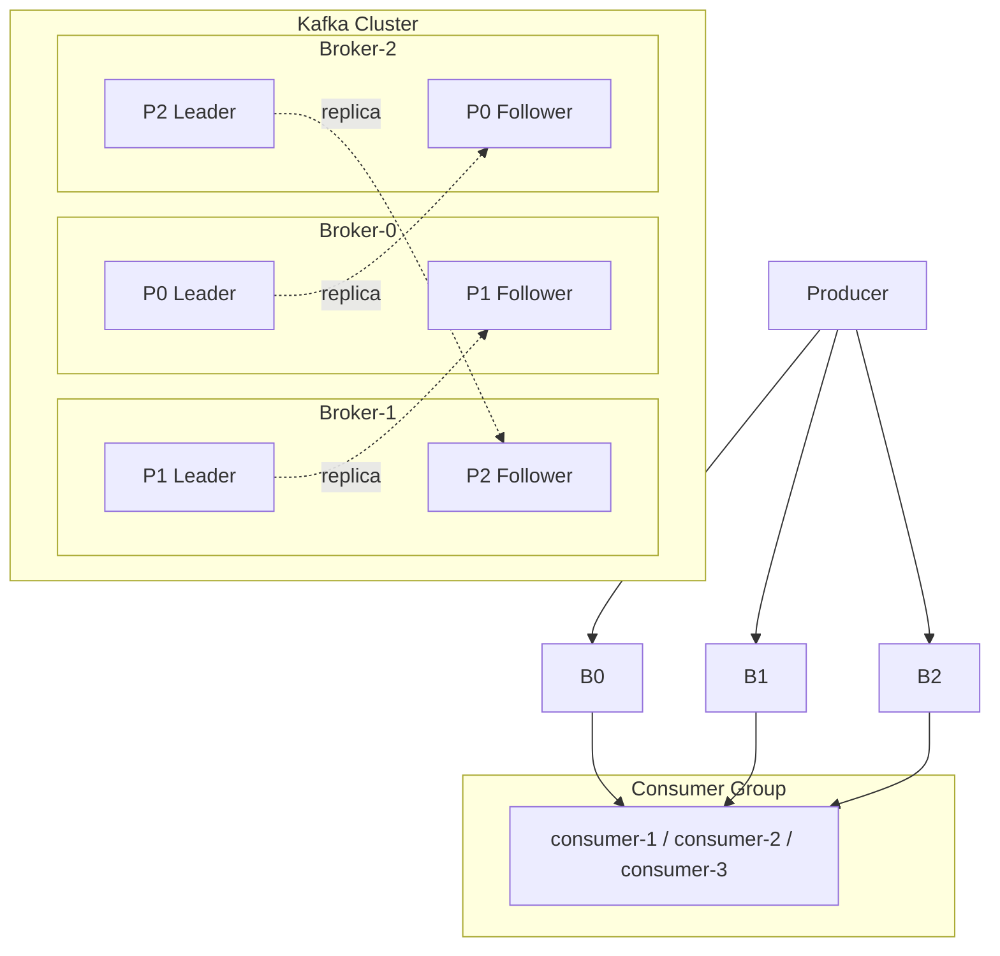

# 3.12 消息队列：削峰、解耦、异步的银弹与代价

> 你的订单服务每次下单要同步调用库存、积分、通知、风控四个下游——任何一个慢了，整条链路就卡住。
> **消息队列（MQ）** 是分布式架构中解决这类问题的核心基础设施：异步、解耦、削峰三板斧，几乎所有中大型系统都会用到。
> 但它不是银弹——引入 MQ 后你必须面对**消息丢失、重复消费、顺序性、积压**等一系列新挑战。
> 这一节把 Kafka、RocketMQ 核心原理讲透，面试高频问题逐个击破。

---

## 一、为什么用消息队列？——三板斧

你在面试中被问到"为什么引入 MQ"，回答三个词就够了：**异步、解耦、削峰**。但你得能展开讲清楚每个词背后的场景。

### 1.1 异步：同步变异步，快速返回

同步调用链路：

```
用户下单 → 扣库存(50ms) → 加积分(30ms) → 发短信(200ms) → 返回(280ms)
```

引入 MQ 后：

```
用户下单 → 扣库存(50ms) → 发消息到 MQ(5ms) → 返回(55ms)
                              ↓
              积分服务异步消费 / 通知服务异步消费
```

用户感知的响应时间从 280ms 降到 55ms——**非核心链路异步化，主链路快速返回**。

### 1.2 解耦：上游不关心下游有几个消费者

没有 MQ 时，订单服务要硬编码调用积分、通知、风控……每加一个下游就改一次代码。

有了 MQ，订单服务只管往 Topic 里扔消息，下游谁想消费谁自己订阅——**上游和下游彻底解耦**。新增一个数据分析服务？加个 Consumer Group 就行，订单服务一行代码不用改。

### 1.3 削峰：高峰流量暂存，下游按自己节奏消费

秒杀场景：瞬间 10 万请求涌入，数据库只能扛 5000 QPS。

```
请求 → MQ（暂存 10 万条消息）→ 下游按 5000/s 的速率消费
```

MQ 充当**蓄水池**，把尖峰流量拉平成下游能承受的速率。

### 1.4 引入 MQ 的代价——不是免费午餐

| 代价 | 说明 |
|------|------|
| **可用性降低** | 系统多了一个依赖组件，MQ 挂了整个链路就断了 |
| **一致性问题** | 消息发了但下游没消费成功，数据不一致 |
| **系统复杂度** | 需要处理消息丢失、重复、顺序、积压等问题 |
| **排查难度** | 异步链路出问题比同步调用更难追踪 |

> **面试口诀**：用 MQ 之前先想清楚——你能不能接受异步带来的最终一致性？如果业务要求强一致，MQ 不是答案。

---

## 二、Kafka 核心架构（面试第一重点）

Kafka 是大数据生态中最重要的消息系统，也是面试考察最密集的 MQ。你需要对它的架构了如指掌。

### 2.1 核心概念一览

| 概念 | 说明 |
|------|------|
| **Broker** | Kafka 集群中的一台服务器，负责存储消息和处理读写请求 |
| **Topic** | 逻辑上的消息类别，类比"频道" |
| **Partition** | Topic 的物理分片，是并行度和顺序性的基本单位 |
| **Replica** | Partition 的副本，分 Leader 和 Follower |
| **Consumer Group** | 一组消费者共同消费一个 Topic，每条消息只被组内一个消费者处理 |
| **Offset** | 消费者在 Partition 中的消费位置（类似书签） |

### 2.2 架构图



### 2.3 Kafka 的定位与竞品对比

Kafka 最初的定位是**分布式日志系统（Distributed Commit Log）**，不是传统消息队列。LinkedIn 开发它是为了收集和处理海量日志数据，但因为发布-订阅模式天然适配消息场景，后来被广泛当作 MQ 使用。它的同类竞品主要有三个：**RocketMQ**（阿里开源，专为业务消息设计）、**RabbitMQ**（传统消息中间件，AMQP 协议）、**Pulsar**（雅虎开源，计算存储分离架构）。

#### 性能实测对比

以下数据综合 Confluent 2023 年基准测试和社区实测结果（同等硬件条件，3 节点集群，消息体 1KB）：

| 指标 | Kafka | RocketMQ | Pulsar | RabbitMQ |
|------|-------|----------|--------|----------|
| **峰值吞吐** | **605 MB/s** | ~120 MB/s | ~305 MB/s | ~38 MB/s |
| **消息速率** | ~100 万 msg/s | ~10 万 msg/s | ~50 万 msg/s | ~5 万 msg/s |
| **vs Kafka** | 基准 | 1/5 | 1/2 | **1/15** |
| **P99 延迟（高负载）** | ~5ms（@200MB/s） | ~1.3ms | ~25ms（@200MB/s） | 低负载 <1ms，高负载急剧上升 |

Kafka 的吞吐量是 RabbitMQ 的 **15 倍**、Pulsar 的 **2 倍**、RocketMQ 的 **5 倍**。但 RocketMQ 在延迟上反超 Kafka（P99 仅 1.3ms），RabbitMQ 在低负载下延迟最低（微秒级）。

#### 为什么 Kafka 吞吐碾压？——四大法宝

| 技术 | Kafka 怎么做 | 竞品怎么做 | 差异影响 |
|------|------------|-----------|---------|
| **顺序写磁盘** | 追加写日志文件，不做随机写 | RocketMQ ✅ 追加写 CommitLog；RabbitMQ ❌ Erlang Mnesia 随机写 | Kafka/RocketMQ 磁盘顺序写 ~600MB/s，RabbitMQ 随机写慢 10 倍以上 |
| **零拷贝** | sendfile 系统调用，数据从磁盘直接到网卡 | RocketMQ ✅ mmap；RabbitMQ ❌ 不支持 | 减少 2 次数据拷贝 + 2 次内核态切换 |
| **批量处理** | 默认攒一批再发（linger.ms + batch.size） | RocketMQ ⚠️ 支持但默认单条；RabbitMQ ❌ 单条发送 | Kafka 用"攒批"换来了更高吞吐，代价是增加了毫秒级延迟 |
| **分区并行** | 多个 Partition 并行读写 | RocketMQ ✅ MessageQueue 并行；RabbitMQ ❌ Queue 级别串行 | Kafka/RocketMQ 可水平扩展，RabbitMQ 受限于单 Queue 串行 |

> Kafka 吞吐碾压的根本原因：它把消息当**日志**处理——只追加不修改、批量攒够再发、分区并行读写，四项全部拉满。RocketMQ 用了前两项（顺序写 + 零拷贝）所以吞吐也不低，但默认单条发送导致不如 Kafka。RabbitMQ 四项一个都没用，所以吞吐差了一个数量级。代价是 Kafka 牺牲了部分消息特性（延迟队列、消息优先级等需要额外方案实现）。

#### 选型建议

| 场景 | 推荐 | 原因 |
|------|------|------|
| 日志采集、大数据管道、流处理 | **Kafka** | 吞吐量碾压，天然适配大数据生态（Flink/Spark/Hive） |
| 电商交易、金融业务消息 | **RocketMQ** | 延迟低、事务消息原生支持、延迟队列开箱即用 |
| 中小规模、复杂路由需求 | **RabbitMQ** | 路由规则最灵活（Exchange/Binding）、协议标准（AMQP） |
| 多租户、计算存储分离 | **Pulsar** | 存算分离架构，Broker 无状态易扩缩 |

<details>
<summary><b>展开：分布式日志系统的完整竞品图谱——Kafka 真的最快吗？</b></summary>

上面的对比主要是"消息队列"视角。如果从 Kafka 的本来定位——**分布式日志系统（Distributed Commit Log）**——来看，同赛道的竞品还有几个值得了解：

| 系统 | 出身 | 核心特点 | vs Kafka |
|------|------|---------|---------|
| **Pulsar** | 雅虎 → Apache | 计算存储分离（Broker 无状态 + BookKeeper 存储） | 吞吐约 Kafka 的 1/2，但弹性扩缩容远超 Kafka——加减 Broker 无需迁移 Partition |
| **Redpanda** | Redpanda Inc. | C++ 重写 Kafka 协议，API 100% 兼容 Kafka 客户端 | 官方宣称单机吞吐比 Kafka 高 10 倍（去掉 JVM GC 开销 + 线程亲和性），独立测试差距没这么大但确实更快 |
| **Pravega** | Dell/EMC → CNCF | 流存储引擎，Segment 自动伸缩 | **在 5000+ Partition 极端场景下反超 Kafka**：Pravega 稳定维持 250 MB/s，Kafka 掉到不足 100 MB/s（因 Partition 越多随机 IO 越严重） |
| **NATS JetStream** | CNCF | Go 单二进制，极致轻量 | 吞吐量与 Kafka 不在一个量级，定位偏轻量消息通信和 IoT |

**结论**：在常规场景（Topic/Partition 数量适中）下，Kafka 吞吐确实最强。但在特定维度上有被超越的情况——Pravega 在超大规模 Partition 下更稳定（Kafka 的"每个 Partition 一个日志文件"设计导致 Partition 过多时退化为随机 IO），Redpanda 在单机性能上可能更快（去掉了 JVM 开销），Pulsar 在弹性扩缩容上更灵活（Broker 无状态）。Kafka 的"最快"是有前提条件的。

</details>

### 2.4 Partition 与 Consumer Group 的对应关系

这是 Kafka 消费模型的核心规则：

- **一个 Partition 只能被同一 Consumer Group 内的一个 Consumer 消费**
- 一个 Consumer 可以消费多个 Partition
- Consumer 数量 > Partition 数量 → 多余的 Consumer 空闲
- Consumer 数量 < Partition 数量 → 部分 Consumer 负责多个 Partition

```
Partition-0 ──→ Consumer-A
Partition-1 ──→ Consumer-B
Partition-2 ──→ Consumer-B   ← B 负责两个 Partition
Consumer-C ──→ （空闲，没有 Partition 分配给它）
```

**所以**：想提高消费并行度，先加 Partition，再加 Consumer。

### 2.5 ISR 机制 + Leader 选举

**ISR（In-Sync Replicas）**：与 Leader 保持同步的副本集合。

- Follower 定期从 Leader 拉取数据，如果落后太多（时间或条数）就被踢出 ISR
- Leader 宕机时，从 ISR 中选举新 Leader（保证数据不丢）
- 如果 ISR 为空（极端情况），取决于配置 `unclean.leader.election.enable`：
  - `true`：允许非 ISR 副本当 Leader（可能丢数据，但保证可用）
  - `false`：Partition 不可用，等待 ISR 副本恢复

<details><summary><b>展开：面试追问——Kafka 为什么用磁盘还这么快？</b></summary>

很多人有个误区：磁盘一定比内存慢。但这取决于**访问模式**：

| 访问模式 | 速度 |
|---------|------|
| 内存随机读写 | 快 |
| 磁盘随机读写 | 非常慢（寻道时间 10ms） |
| **磁盘顺序读写** | **接近内存速度（600MB/s+）** |

Kafka 只做**追加写**（Append-Only），永远不修改已有数据，所以能充分利用磁盘顺序写的性能。加上操作系统的 Page Cache 机制，热数据实际上就在内存里。

**零拷贝**的本质：

传统方式：磁盘 → 内核缓冲区 → 用户缓冲区 → Socket 缓冲区 → 网卡（4 次拷贝）

零拷贝（sendfile）：磁盘 → 内核缓冲区 → 网卡（2 次拷贝，跳过用户态）

Kafka 的 Consumer 拉取数据时，就是用 `sendfile` 系统调用直接把磁盘数据发到网络，省掉了用户态的两次拷贝。

</details>

---

## 三、RocketMQ 核心特性

RocketMQ 是阿里开源的消息中间件，定位于**业务消息**场景，和 Kafka 的日志流场景有明显差异。

### 3.1 核心架构

| 组件 | 职责 |
|------|------|
| **NameServer** | 轻量级注册中心，Broker 在此注册路由信息（无状态，可集群部署） |
| **Broker** | 消息存储和转发，分 Master/Slave |
| **Producer** | 消息生产者，从 NameServer 获取路由后直连 Broker |
| **Consumer** | 消息消费者，支持 Push/Pull 两种模式 |

```
Producer → NameServer（获取路由）→ Broker（发送消息）
Consumer → NameServer（获取路由）→ Broker（拉取消息）
```

> **和 Kafka 的区别**：Kafka 用 ZooKeeper/KRaft 做协调，重量级；RocketMQ 用 NameServer，无状态轻量级，不做选举。

### 3.2 与 Kafka 的定位区别

| 维度 | Kafka | RocketMQ |
|------|-------|----------|
| **定位** | 日志流、大数据管道 | 业务消息、电商交易 |
| **延迟** | ms 级（批量攒消息带来的延迟） | ms 级（长轮询，实时性更好） |
| **事务消息** | 支持（0.11+，较复杂） | 原生支持（半消息 + 回查，更成熟） |
| **延迟消息** | 不原生支持 | 原生支持（18 个延迟级别） |
| **消息回溯** | 按 Offset 回溯 | 按时间点回溯 |
| **运维复杂度** | 依赖 ZK/KRaft | NameServer 轻量 |

### 3.3 事务消息（半消息 + 回查机制）

这是 RocketMQ 最核心的特性之一，面试高频。

**场景**：下单时要扣减库存，需要本地事务和消息发送保持一致。

**流程**：

```
1. Producer 发送"半消息"（Half Message）到 Broker
2. Broker 存储半消息，但对 Consumer 不可见
3. Producer 执行本地事务（扣库存）
4. 本地事务成功 → 发送 Commit，半消息变为可消费
   本地事务失败 → 发送 Rollback，半消息删除
5. 如果 Broker 迟迟收不到 Commit/Rollback → 主动回查 Producer
```

**本质**：用 MQ 做分布式事务的协调者，保证"本地事务"和"消息发送"的原子性。

### 3.4 其他核心特性

| 特性 | 说明 |
|------|------|
| **延迟消息** | 消息发送后不立即投递，延迟指定时间后才可消费（如下单 30 分钟未支付关闭） |
| **顺序消息** | 同一业务 Key 的消息保证有序（通过 MessageQueueSelector 指定队列） |
| **死信队列（DLQ）** | 消费失败超过重试次数的消息进入死信队列，等待人工处理 |
| **消息过滤** | 支持 Tag 过滤和 SQL92 语法过滤 |

---

## 四、可靠投递——消息怎么保证不丢？（面试必问三环节）

消息从生产到消费，经过**三个环节**，每个环节都可能丢消息：

| 环节 | 丢失场景 | 解决方案 |
|------|---------|---------|
| **生产端** | 发送失败、网络超时 | 同步发送 + 重试 / 事务消息 |
| **Broker 端** | Broker 宕机、磁盘损坏 | 同步刷盘 + 多副本（ISR, acks=all） |
| **消费端** | 消费后处理失败但已提交 Offset | 手动 ACK（先处理业务再提交 Offset） |

### 4.1 生产端：确保消息发出去

```java
// Kafka 生产者 - 同步发送 + 重试
Properties props = new Properties();
props.put("acks", "all");           // 等待所有 ISR 副本确认
props.put("retries", 3);            // 失败重试 3 次
props.put("retry.backoff.ms", 100); // 重试间隔

producer.send(record).get();        // .get() 同步等待结果
```

### 4.2 Broker 端：确保消息存下来

- **同步刷盘**：消息写入磁盘后才返回 ACK（RocketMQ `flushDiskType=SYNC_FLUSH`）
- **多副本同步**：Kafka `acks=all` + `min.insync.replicas=2`，至少 2 个副本写入成功才算成功

### 4.3 消费端：确保消息处理完

```java
// Kafka 消费者 - 手动提交 Offset
props.put("enable.auto.commit", "false"); // 关闭自动提交

while (true) {
    ConsumerRecords<String, String> records = consumer.poll(Duration.ofMillis(100));
    for (ConsumerRecord<String, String> record : records) {
        processMessage(record);  // 先处理业务
    }
    consumer.commitSync();       // 处理完再提交 Offset
}
```

**关键原则**：先处理业务，再提交 Offset。如果处理失败但已提交 Offset，消息就"丢"了。

<details><summary><b>展开：面试追问——acks=0/1/all 分别什么含义？</b></summary>

| acks 值 | 含义 | 可靠性 | 性能 |
|---------|------|--------|------|
| **0** | Producer 发出去就不管了，不等任何确认 | 最低（可能丢） | 最高 |
| **1** | 等 Leader 写入成功就返回 | 中等（Leader 挂了可能丢） | 中等 |
| **all / -1** | 等所有 ISR 副本都写入成功才返回 | 最高（ISR 全挂才丢） | 最低 |

配合 `min.insync.replicas` 使用：

- `acks=all` + `min.insync.replicas=2`：至少 2 个副本确认。如果 ISR 只剩 1 个，Producer 会收到异常，拒绝写入（宁可不可用也不丢数据）。

**面试要点**：acks=all 不是"所有副本"，而是"所有 ISR 副本"。如果 ISR 只有 Leader 一个，acks=all 退化为 acks=1。

</details>

---

## 五、幂等消费——消息重复了怎么办？

### 5.1 为什么会重复？

在 at-least-once 语义下，以下场景都会导致重复消费：

| 场景 | 原因 |
|------|------|
| **网络抖动** | Producer 发送成功但没收到 ACK，重发 → Broker 存了两条 |
| **Consumer Rebalance** | 消费者挂了/加入，Partition 重新分配，部分消息被重复消费 |
| **手动提交失败** | 消息处理完了但 Offset 提交失败，重启后从旧 Offset 开始 |

### 5.2 幂等方案

**核心思路：消费端做幂等，保证同一条消息处理多次效果等同于处理一次。**

| 方案 | 适用场景 | 实现 |
|------|---------|------|
| **唯一消息 ID + 去重表** | 通用 | 消费前查 DB 是否已处理过该 msgId |
| **数据库唯一约束** | 插入场景 | 唯一索引保证不会插入重复数据 |
| **Redis Set 去重** | 高并发场景 | `SETNX msgId` 成功才处理 |
| **状态机** | 有状态流转的业务 | 当前状态不允许重复流转 |

```java
// 去重表方案伪代码
public void consume(Message msg) {
    String msgId = msg.getMsgId();
    // 1. 查去重表
    if (deduplicationDao.exists(msgId)) {
        return; // 已处理过，直接跳过
    }
    // 2. 处理业务
    doBusiness(msg);
    // 3. 写去重表（和业务在同一个事务里）
    deduplicationDao.insert(msgId);
}
```

### 5.3 Kafka 生产端幂等

Kafka 0.11+ 引入了 Producer 幂等性：

- 每个 Producer 分配一个 **PID（Producer ID）**
- 每条消息带一个 **Sequence Number**（单调递增）
- Broker 对 `<PID, Partition, SeqNum>` 去重，相同 SeqNum 的消息只保存一次

```java
props.put("enable.idempotence", "true"); // 开启生产者幂等
```

> 注意：这只保证**单分区、单会话**的幂等。Producer 重启后 PID 变了，跨会话需要用 Kafka 事务。

### 5.4 Exactly-once 语义：Kafka 事务

Kafka 事务 = Producer 幂等 + 跨分区原子写入 + Consumer "read_committed"。

```java
producer.initTransactions();
try {
    producer.beginTransaction();
    producer.send(record1);
    producer.send(record2);
    producer.sendOffsetsToTransaction(offsets, groupId); // 消费位移也纳入事务
    producer.commitTransaction();
} catch (Exception e) {
    producer.abortTransaction();
}
```

适用于 **Kafka Streams** 这类"consume-transform-produce"的流处理场景。

---

## 六、顺序消费——消息乱序了怎么办？

### 6.1 全局有序 vs 分区有序

| 类型 | 实现 | 代价 |
|------|------|------|
| **全局有序** | 只用 1 个 Partition | 完全失去并行度，吞吐极低 |
| **分区有序** | 同一业务 Key 发到同一 Partition | 在保证局部有序的前提下兼顾并行 |

绝大多数场景要的是**分区有序**——同一个订单的消息有序就行，不同订单之间不需要有序。

### 6.2 Kafka 的顺序保证

```java
// 同一订单 ID 的消息发到同一 Partition
producer.send(new ProducerRecord<>(
    "order-topic",
    orderId,     // Key：订单ID
    message      // Value：消息内容
));
// Kafka 对 Key 做 hash % partitionCount，同一 Key 固定到同一 Partition
```

**单 Partition 内消息是有序的**——这是 Kafka 的核心保证。

### 6.3 RocketMQ 的顺序保证

```java
// MessageQueueSelector 指定队列
producer.send(msg, new MessageQueueSelector() {
    @Override
    public MessageQueue select(List<MessageQueue> mqs, Message msg, Object arg) {
        Long orderId = (Long) arg;
        int index = (int) (orderId % mqs.size());
        return mqs.get(index);
    }
}, orderId);
```

消费端需要使用 `MessageListenerOrderly`（单线程顺序消费），而不是 `MessageListenerConcurrently`（并发消费）。

<details><summary><b>展开：面试追问——消费失败重试后还能保证顺序吗？</b></summary>

这是个好问题。答案是**看实现方式**：

**Kafka**：
- 消费失败后不提交 Offset，下次 poll 还会拉到这条消息
- 但如果你把失败消息扔到重试队列再消费，顺序就被打破了
- 严格顺序场景：失败就阻塞（暂停该 Partition 的消费），直到成功

**RocketMQ**：
- `MessageListenerOrderly` 模式下，消费失败会在本地重试（不会跳过）
- 重试次数超过阈值 → 消息进入死信队列，后续消息继续消费
- 进入死信的那条和后续消息之间的顺序实际上已经被打破

**结论**：严格顺序 + 失败重试本身就是矛盾的。实际工程中的做法：
1. 有限重试（3 次），成功就继续
2. 超过重试次数，记录日志 + 告警，人工介入
3. 如果业务允许，跳过失败消息继续消费（放弃严格顺序）

</details>

---

## 七、消息积压——消费太慢怎么办？

消息积压（Consumer Lag）是生产环境最常见的 MQ 问题——生产速度 > 消费速度，消息越堆越多。

### 7.1 监控 Consumer Lag

```bash
# Kafka 查看消费者组的 Lag
kafka-consumer-groups.sh --bootstrap-server localhost:9092 \
  --describe --group my-consumer-group
```

输出中的 `LAG` 列就是积压量。超过阈值就该告警了。

### 7.2 处理方案（由快到慢）

| 方案 | 适用场景 | 操作 |
|------|---------|------|
| **优化消费逻辑** | 消费逻辑本身有性能问题 | 减少 DB 查询、批量处理、异步化 |
| **扩 Consumer** | Consumer 数量 < Partition 数量 | 直接加消费者实例 |
| **扩 Partition** | Consumer 已经和 Partition 数量一样多 | 增加 Partition + 增加 Consumer |
| **临时转发** | 紧急情况，积压严重 | 写一个临时 Consumer 把消息转发到新 Topic（更多 Partition），再用大量 Consumer 消费 |
| **丢弃非关键消息** | 业务允许 | 消费时判断消息时间戳，超过 N 分钟的直接跳过 |

### 7.3 临时扩容方案详解

```
原 Topic (3 Partitions)
      │
      ▼
临时 Consumer（不做业务，只转发）
      │
      ▼
临时 Topic (30 Partitions)
      │
      ▼
30 个 Consumer 并行消费（处理真正的业务逻辑）
```

这是**治标**的方案——积压消化完后要恢复原来的拓扑，并根治消费慢的问题。

### 7.4 根治思路

| 根因 | 解决方式 |
|------|---------|
| 消费逻辑太重（查 DB、调 RPC） | 批量化、异步化、本地缓存 |
| Partition 太少限制并行度 | 创建 Topic 时就规划好 Partition 数量 |
| 下游系统瓶颈 | 优化下游（加索引、扩容、限流降级） |
| 消费者频繁 Rebalance | 调大 `session.timeout.ms`，减少无效 Rebalance |

---

## 八、MQ 选型对比

> 性能数据（吞吐量、延迟、竞品图谱）和选型建议见 [2.3 Kafka 的定位与竞品对比](#23-kafka-的定位与竞品对比)，这里补充**功能维度**的差异——面试最后一问经常是"这几种 MQ 你怎么选"，性能只是一个维度，功能特性往往才是决定因素。

| 维度 | Kafka | RocketMQ | RabbitMQ |
|------|-------|----------|----------|
| **可靠性** | 高（副本 + ISR） | 高（同步刷盘 + 主从） | 高（镜像队列） |
| **事务消息** | 支持（0.11+） | 原生支持（成熟） | 不支持 |
| **延迟消息** | 不原生支持 | 原生支持 | 支持（TTL + 死信） |
| **顺序消息** | 分区级有序 | 队列级有序 | 不保证 |
| **消息回溯** | 支持（按 Offset） | 支持（按时间） | 不支持（消费即删） |
| **协议** | 自定义协议 | 自定义协议 | AMQP |
| **语言** | Scala/Java | Java | Erlang |
| **社区/生态** | Apache 顶级项目，生态最丰富 | Apache 顶级项目，国内社区活跃 | 老牌，文档完善 |

<details><summary><b>展开：面试追问——如果让你设计一个 MQ，你会考虑哪些问题？</b></summary>

这是一个开放性问题，考察你对 MQ 本质的理解。回答框架：

1. **存储模型**：消息存在哪里？内存还是磁盘？怎么持久化？
2. **消费模型**：Push 还是 Pull？Consumer Group 怎么协调？
3. **可靠性**：怎么保证不丢？副本策略？刷盘策略？
4. **性能**：怎么做到高吞吐低延迟？批量？压缩？零拷贝？
5. **高可用**：Broker 挂了怎么办？Leader 选举？
6. **消费语义**：at-most-once / at-least-once / exactly-once 怎么实现？
7. **功能特性**：延迟消息？事务消息？死信队列？

</details>

---

## 本篇小结

| 主题 | 一句话总结 |
|------|----------|
| 为什么用 MQ | 异步、解耦、削峰——但引入可用性和一致性代价 |
| Kafka 架构 | Partition 并行 + 顺序写 + 零拷贝 = 百万级吞吐 |
| RocketMQ 特性 | 事务消息、延迟消息、顺序消息——面向业务场景 |
| 消息不丢 | 生产端重试 + Broker 同步刷盘/副本 + 消费端手动 ACK |
| 消息不重复 | 唯一 ID + 去重表，或 Kafka 幂等生产者 |
| 消息有序 | 同 Key 同 Partition + 单线程消费 |
| 消息积压 | 扩 Partition + 扩 Consumer + 优化消费逻辑 |
| MQ 选型 | 日志流选 Kafka，业务消息选 RocketMQ，轻量路由选 RabbitMQ，进程间通信选 ZeroMQ |

---

## 九、ZeroMQ — 不是消息队列的"消息队列"

前面讲的 Kafka/RocketMQ/RabbitMQ 都是**Broker 架构**——消息经过中间件存储转发。ZeroMQ（ZMQ）完全不同：它是 **Brokerless 的并发通信库**，本质是一个高性能的 Socket 增强层，没有 Broker、没有持久化、没有消息确认机制。

### 9.1 ZeroMQ 是什么？

ZeroMQ 不是传统意义上的消息队列，而是一个**并发通信框架**。它提供了类似 Socket 的 API，但在传输层之上叠加了消息帧、多路复用、自动重连等能力。你可以把它理解为"加了超能力的 TCP Socket"。

**核心特征：**

| 特征 | ZeroMQ | Kafka/RocketMQ |
|------|--------|----------------|
| 架构 | Brokerless（点对点直连） | Broker-based（存储转发） |
| 持久化 | 无（纯内存） | 有（磁盘持久化） |
| 消息确认 | 无（fire-and-forget） | 有（ACK 机制） |
| 消息回溯 | 不可能 | 支持（按 Offset/时间） |
| 部署复杂度 | 极低（库，不需要部署） | 高（需要部署 Broker 集群） |
| 延迟 | 微秒级（进程间通信） | 毫秒级（网络 + 磁盘） |
| 吞吐 | 极高（无 Broker 开销） | 高（受 Broker 限制） |
| 适用场景 | 进程间通信、低延迟实时 | 异步解耦、削峰、大数据管道 |

### 9.2 ZeroMQ 的 Socket 模式

ZeroMQ 提供了多种 Socket 模式，覆盖常见的分布式通信模式：

| 模式 | 说明 | 典型场景 |
|------|------|---------|
| **REQ-REP** | 请求-回复，同步双工 | RPC 调用、心跳检测 |
| **PUB-SUB** | 发布-订阅，单向广播 | 事件广播、日志推送 |
| **PUSH-PULL** | 推-拉，单向流水线 | 任务分发、负载均衡 |
| **ROUTER-DEALER** | 异步路由，双向多路 | 多客户端服务、消息路由 |
| **PAIR** | 专有通道，1对1双向 | 线程间通信 |

这些模式是理解 Notebook 通信架构的基础——Jupyter 和 marimo 都是基于 ZeroMQ 的 Socket 模式构建通信通道。

### 9.3 Jupyter Notebook 中的 ZeroMQ（实战案例）

Jupyter 的 Kernel 通信完全基于 ZeroMQ，使用了 5 个 Socket 通道：

| 通道 | ZMQ 模式 | 用途 |
|------|----------|------|
| shell | ROUTER-DEALER | 代码执行请求/回复（双向异步） |
| iopub | PUB-SUB | 输出广播（一个 Kernel，多个前端订阅） |
| stdin | ROUTER-DEALER | input() 调用 |
| control | ROUTER-DEALER | 中断信号（优先级高于 shell） |
| heartbeat | REP-REQ | 存活检测（PING-PONG） |

为什么 Jupyter 选 ZeroMQ 而不是 Kafka/RabbitMQ？因为 Kernel 是一个**本地进程**，需要的是进程间低延迟通信，不是跨网络的消息队列。ZeroMQ 的 brokerless 架构天然适合——不需要部署额外的 Broker，直接在进程间建立 ZMQ Socket 连接。延迟在微秒级，而 Kafka/RabbitMQ 至少毫秒级。

marimo 也用 ZeroMQ，但通道设计不同——用 6 个 PUSH-PULL 通道（单向）替代 Jupyter 的 ROUTER-DEALER（双向），用 MessagePack 二进制序列化替代 JSON。详见 [8.2 通信协议全景对比](../part8-notebook-platform/02-通信协议全景对比.md)。

### 9.4 ZeroMQ vs 传统 MQ — 选型建议

| 场景 | 推荐 | 原因 |
|------|------|------|
| 进程间通信（IPC） | **ZeroMQ** | 微秒级延迟，无需 Broker |
| 实时流式输出推送 | **ZeroMQ PUB-SUB** | 低延迟广播，不需要持久化 |
| 大数据管道、日志收集 | **Kafka** | 需要持久化、回溯、高吞吐 |
| 电商交易消息 | **RocketMQ** | 需要事务消息、延迟消息、ACK |
| Notebook Kernel 通信 | **ZeroMQ** | 进程间低延迟，5 通道分离关注点 |

> **面试要点**：ZeroMQ 不是 Kafka/RabbitMQ 的替代品，它们解决不同层次的问题。ZeroMQ 解决的是"进程间如何低延迟通信"，Kafka/RocketMQ 解决的是"分布式系统如何异步解耦"。Jupyter 选 ZeroMQ 是因为 Kernel 是本地进程，需要的是 IPC 级别的延迟，不是消息队列的存储转发能力。如果 Notebook 部署为多租户云服务（如 JupyterHub + Enterprise Gateway），网关到远程 Kernel 的通信通常会替换为 WebSocket 或 gRPC，因为 ZeroMQ 不适合跨网络通信。

---

## 相关章节

- [3.7 高可用架构](./07-高可用架构.md)——限流熔断、集群容灾与 MQ 高可用的关系
- [3.10 分布式理论与一致性](./10-分布式理论与一致性.md)——CAP/BASE 理论，理解 MQ 在一致性中的角色
- [3.8 缓存与 Redis](./08-缓存与Redis.md)——缓存 + MQ 的异步更新方案
- [8.2 通信协议全景对比](../part8-notebook-platform/02-通信协议全景对比.md)——Notebook 系统中 ZeroMQ / gRPC / Thrift / WebSocket 的协议选型分析
