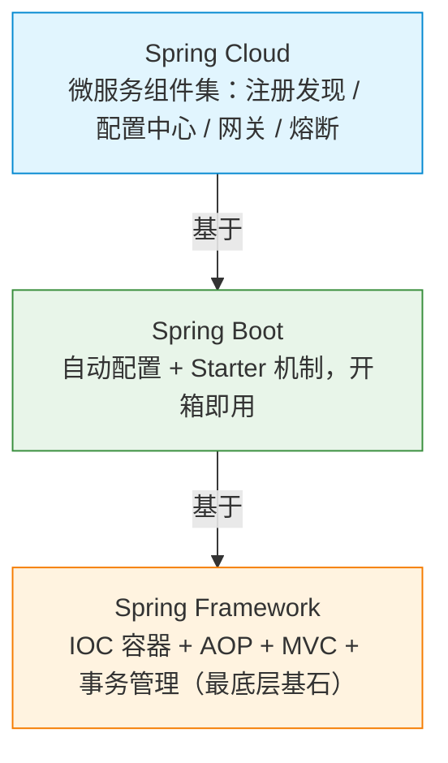
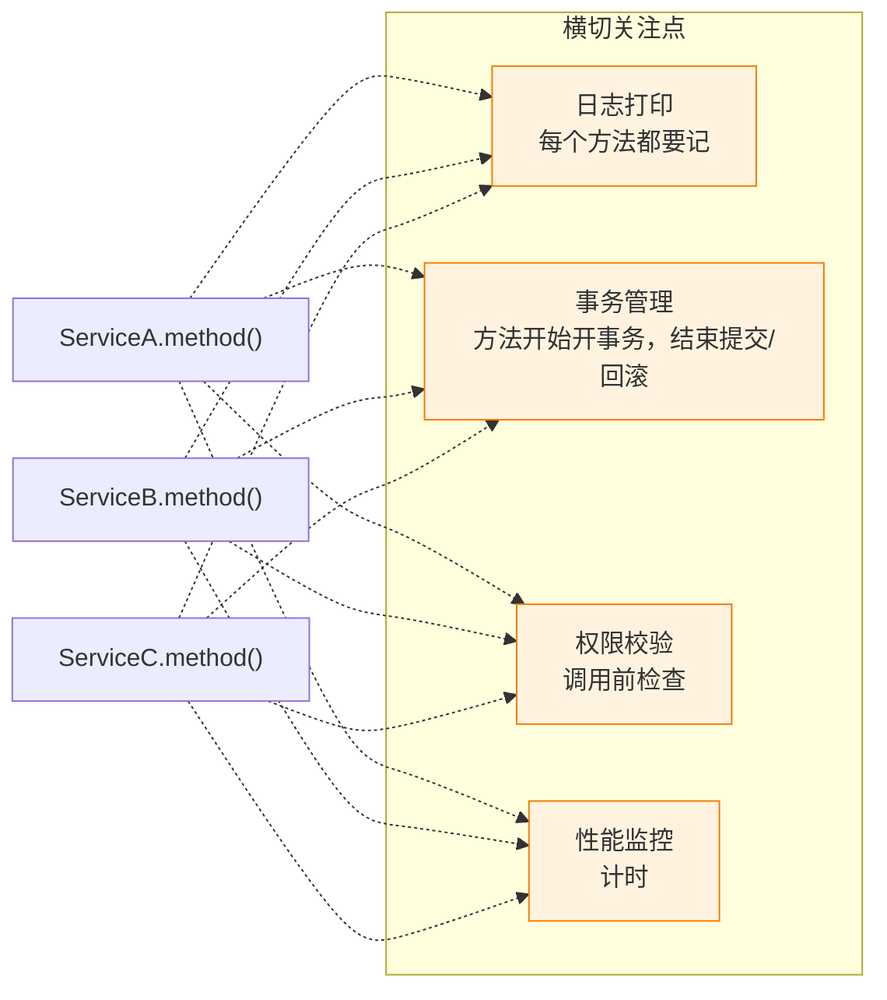
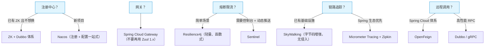

# 3.13 Spring 全家桶：为什么 Java 后端绕不开它

> 「Spring 和 Spring Boot 什么关系？」「IOC 到底在干嘛？」「Bean 的生命周期说一遍？」——Java 后端面试里，Spring 是出镜率最高的框架。不是因为它最新最炫，而是它用**控制反转 + 约定大于配置**把整个 Java 后端生态黏合成了一个整体。理解 Spring，你才能真正看懂 Java 后端项目的骨架。

---

## 一、Spring 生态全景

先建立一张地图：Spring 不是单一框架，而是一组**从底层容器到上层微服务**的分层体系。



| 层级 | 解决什么问题 | 一句话 |
|------|-------------|--------|
| **Spring Framework** | 对象管理、依赖注入、切面编程 | 骨架 |
| **Spring Boot** | 自动配置、内嵌容器、约定优先 | 省心 |
| **Spring Cloud** | 微服务治理：注册/配置/网关/熔断 | 分布式全家桶 |

### 为什么 Java 后端 ≈ Spring？

1. **生态垄断**：几乎所有主流中间件都提供了 Spring 集成（MyBatis-Spring、Spring Data Redis、Spring Kafka……），不用 Spring 你就等着自己造轮子。
2. **约定大于配置**：Boot 把 80% 的模板配置默认好了，你只需要关注业务代码。
3. **开箱即用**：一个 `@SpringBootApplication` + `main` 方法，服务就跑起来了，不需要额外的 Tomcat 部署。
4. **社区/招聘市场**：后端岗位 JD 里"熟练使用 Spring / Spring Boot"是标配。

---

## 二、IOC 容器（面试必问）

IOC 全称 **Inversion of Control（控制反转）**，与之配套的概念是 **DI（Dependency Injection，依赖注入）**——DI 是 IOC 的具体实现方式。

先厘清两个概念：**容器（Container）** 和 **对象（Bean）** 不是一个层次的东西。对象就是你平时用的那些实例——`UserService`、`OrderDao`、`DataSource`。容器是管理这些对象的"大管家"——Spring 启动时创建一个 `ApplicationContext`（这就是"容器"），它内部维护了一个类似 `Map<String, Object>` 的结构，所有被 `@Component`、`@Service`、`@Bean` 标记的类都会被它实例化后放进去。当你声明 `@Autowired UserDao userDao` 时，容器从这个 Map 里找到对应的实例塞给你。所以"控制反转"说的就是：以前对象的创建和组装由你的业务代码控制，现在由容器控制。

### 2.1 什么是控制反转 / 依赖注入

"控制反转"这个名字说的不是"自动创建实例"，而是**控制权翻转了**——以前是你的代码控制要用哪个对象（你 `new` 谁、什么时候 `new`、传什么参数），现在这个控制权反转给了容器。你只声明「我需要一个 UserDao」，至于用哪个实现类、什么时候创建、是单例还是多例、销毁时做什么——全部由容器说了算。一个简单的工厂方法也能"自动创建实例"，但工厂的行为还是你代码定义的；IOC 容器则是你连工厂逻辑都不写，完全交给框架按注解/配置来决定。

```java
// ❌ 传统写法：你亲手 new，耦合死
public class OrderService {
    private UserDao userDao = new UserDaoMysqlImpl(); // 想换实现？改代码重新编译
}

// ✅ Spring IOC：声明依赖，容器注入
@Service
public class OrderService {
    private final UserDao userDao; // 接口类型

    @Autowired // 容器帮你找到 UserDao 的实现注进来
    public OrderService(UserDao userDao) {
        this.userDao = userDao;
    }
}
```

| 维度 | 传统 new | IOC 注入 |
|------|---------|---------|
| 依赖关系 | 硬编码在类里 | 外部（容器）管理 |
| 切换实现 | 改源码重新编译 | 改配置或换 @Qualifier |
| 可测试性 | 难 mock | 构造器传 mock 即可 |
| 谁控制对象生命周期 | 调用方 | Spring 容器 |

### 2.2 BeanFactory vs ApplicationContext

| 特性 | BeanFactory | ApplicationContext |
|------|-------------|-------------------|
| 定位 | Spring 最底层容器接口 | BeanFactory 的超集（日常用这个） |
| Bean 加载时机 | 懒加载（getBean 时才创建） | 预加载（启动时创建所有单例 Bean） |
| 额外功能 | 无 | 事件发布、国际化、AOP 自动代理、Environment 等 |
| 适用场景 | 资源极受限的嵌入式 | 99.9% 的生产应用 |

> 面试简答：「ApplicationContext 继承了 BeanFactory，在其基础上增加了 AOP、事件、国际化等企业级功能，并在启动时预创建单例 Bean。」

### 2.3 Bean 的作用域

| 作用域 | 实例数量 | 使用场景 |
|--------|---------|---------|
| **singleton**（默认） | 容器内唯一 | 无状态 Service / DAO |
| **prototype** | 每次 getBean 新建 | 有状态对象 |
| **request** | 每个 HTTP 请求一个 | Web 应用的请求级数据 |
| **session** | 每个 HTTP Session 一个 | 用户会话数据 |

**怎么设置作用域**：

```java
// 方式一：注解（最常用）
@Component
@Scope("prototype")  // 或 @Scope(ConfigurableBeanFactory.SCOPE_PROTOTYPE)
public class ShoppingCart { ... }

// 方式二：@Bean 方法上指定
@Configuration
public class AppConfig {
    @Bean
    @Scope("prototype")
    public ShoppingCart shoppingCart() {
        return new ShoppingCart();
    }
}

// 方式三：XML（老项目）
// <bean id="cart" class="com.example.ShoppingCart" scope="prototype"/>
```

**singleton + prototype 混用的坑**：

```java
@Service  // 默认 singleton
public class OrderService {
    @Autowired
    private ShoppingCart cart;  // prototype Bean 注入到 singleton 中
    // ❌ 问题：cart 只会在 OrderService 创建时注入一次，之后永远是同一个实例
    //    prototype 的"每次新建"语义失效了！

    // ✅ 解决方案一：注入 ObjectProvider
    @Autowired
    private ObjectProvider<ShoppingCart> cartProvider;
    
    public void process() {
        ShoppingCart cart = cartProvider.getObject(); // 每次调用都新建
    }

    // ✅ 解决方案二：@Scope + proxyMode
    // 在 ShoppingCart 上加：
    // @Scope(value = "prototype", proxyMode = ScopedProxyMode.TARGET_CLASS)
    // Spring 会注入一个 CGLIB 代理，每次调用代理方法时自动新建实例
}
```

> 面试坑：把有状态 Bean 设为 singleton → 并发数据污染。

### 2.4 三种注入方式

```java
// ① 构造器注入（官方推荐）
@Service
public class OrderService {
    private final UserDao userDao;

    public OrderService(UserDao userDao) { // 不可变 + 完整性强
        this.userDao = userDao;
    }
}

// ② Setter 注入
@Service
public class OrderService {
    private UserDao userDao;

    @Autowired
    public void setUserDao(UserDao userDao) {
        this.userDao = userDao;
    }
}

// ③ 字段注入（最简洁但不推荐）
@Service
public class OrderService {
    @Autowired
    private UserDao userDao; // 无法 final，难单测
}
```

| 方式 | 优点 | 缺点 | 推荐度 |
|------|------|------|--------|
| **构造器注入** | 不可变、强制完整性、易单测 | 参数多时构造器长 | ⭐⭐⭐⭐⭐ |
| Setter 注入 | 可选依赖友好 | 对象可能处于不完整状态 | ⭐⭐⭐ |
| 字段注入 | 代码少 | 无法 final、难 mock、隐藏依赖 | ⭐⭐ |

字段注入的两个缺点展开说：**无法 final** 是因为字段注入是在对象创建之后由 Spring 通过反射赋值的，而 Java 的 `final` 字段要求必须在构造器执行完之前赋值，所以字段注入和 `final` 互斥。**难单测** 是因为字段是 `private` 的、没有构造器参数、没有 setter，你在测试代码里没有正常途径把 mock 对象塞进去——要么启动整个 Spring 容器（变成集成测试，慢），要么用反射强行设值（丑陋且脆弱）。构造器注入则没有这个问题：`new OrderService(mockUserDao)` 直接传 mock 就行。

> **结论**：Spring 官方从 4.3 起推荐构造器注入；字段注入只剩「写得少」这一个优点，面试别说“我用 @Autowired 加字段”。

<details>
<summary><b>展开：循环依赖怎么解决？三级缓存是什么？</b></summary>

**场景**：A 依赖 B，B 又依赖 A。如果都是构造器注入 → 直接报错（Spring 无法解决构造器循环依赖）。

**Spring 对 singleton + 字段/Setter 注入的解决方案——三级缓存**：

| 缓存 | 名称 | 存什么 |
|------|------|--------|
| 一级缓存 | `singletonObjects` | 完全初始化好的 Bean |
| 二级缓存 | `earlySingletonObjects` | 提前暴露的半成品 Bean（属性还没填） |
| 三级缓存 | `singletonFactories` | Bean 的 ObjectFactory（可生成代理） |

**流程简述**：
1. 创建 A → 实例化 A（空壳）→ 把 A 的 ObjectFactory 放入三级缓存
2. 填充 A 属性 → 发现需要 B → 去创建 B
3. 创建 B → 实例化 B → 填充 B 属性 → 发现需要 A
4. 从三级缓存拿到 A 的 ObjectFactory → 调用它拿到 A 的早期引用（可能是代理）→ 放入二级缓存
5. B 拿到 A 的引用 → B 创建完成 → 放入一级缓存
6. 回来继续填充 A → A 创建完成

**面试答题口诀**：「三级缓存的核心目的是在 Bean 还没初始化完时就把它的引用暴露出来；三级缓存（而不是二级）的额外价值是延迟代理对象的创建。」

> 注意：Spring Boot 2.6+ 默认**禁止循环依赖**（`spring.main.allow-circular-references=false`），官方立场是从设计上消灭循环依赖。

</details>

---

## 三、AOP（Aspect-Oriented Programming，面向切面编程）

### 3.1 什么问题用 AOP 解决

想象每个 Service 方法都要加日志、事务、权限校验——这些逻辑跟业务无关却散落各处，就是**横切关注点（Cross-Cutting Concerns）**。“Cross-Cutting”直译是“横着切过去的”——想象你的代码是一根根竖着的柱子（每个 Service 方法从上到下执行），日志、事务这些逻辑不属于任何一根柱子，而是横着穿过所有柱子，每根都要经过——这就是“横切”的含义。

AOP 的思路：把横切逻辑**抽到切面里**，运行时自动织入目标方法。“切面（Aspect）”这个名字取的是“横截面”的含义，不是“方面”——想象一棵树，竖着看是一层层年轮（业务调用栈），横着切一刀，看到的那个截面（cross section）就是“切面”，这一刀切下去所有年轮都被它穿透了。“业务代码不感知”的意思是：你通过 Pointcut 表达式指定要切哪些方法，被切的方法完全不知道自己被切了——代码里没有任何日志、事务相关的代码，它们是运行时被自动织入的，你可以随时改 Pointcut 来选择切不同的方法，业务代码一行不动。



### 3.2 核心概念

| 概念 | 英文 | 大白话 |
|------|------|--------|
| **切面 Aspect** | Aspect | 横切逻辑的模块（一个类） |
| **切点 Pointcut** | Pointcut | "在哪些方法上切"（表达式） |
| **通知 Advice** | Advice | "在切点处做什么"（前置/后置/环绕…） |
| **织入 Weaving** | Weaving | 把通知应用到目标对象的过程 |
| **连接点 JoinPoint** | JoinPoint | 程序执行中可以插入切面的点（Spring 只支持方法级） |

通知类型：

| 注解 | 时机 | 典型用途 |
|------|------|---------|
| `@Before` | 方法执行前 | 参数校验、权限检查 |
| `@After` | 方法执行后（无论是否异常） | 资源清理 |
| `@AfterReturning` | 方法正常返回后 | 结果日志 |
| `@AfterThrowing` | 方法抛异常后 | 异常告警 |
| `@Around` | 环绕（最强大，可控制是否执行目标方法） | 事务、耗时统计 |

### 3.3 JDK 动态代理 vs CGLIB 代理

| 维度 | JDK 动态代理 | CGLIB |
|------|-------------|-------|
| 原理 | 基于接口，生成实现了同接口的代理类 | 基于继承，生成目标类的子类 |
| 要求 | 目标类必须实现接口 | 目标类不能是 final |
| 性能 | 调用略快（JDK 新版已优化） | 生成代理略慢，方法调用通过 FastClass |
| Spring 默认 | 有接口用 JDK 代理 | 无接口用 CGLIB |
| Spring Boot 2.x+ 默认 | — | **统一使用 CGLIB**（`proxyTargetClass=true`） |

> 面试简答：「Spring Boot 默认 CGLIB。因为 JDK 代理要求接口，开发者经常忘了写接口导致注入失败，统一 CGLIB 更省心。」

### 3.4 @Transactional 就是 AOP

Spring 的声明式事务本质是通过 AOP 在方法前后织入 `开启事务 / 提交 / 回滚` 逻辑：

```java
@Service
public class OrderService {

    @Transactional(rollbackFor = Exception.class)
    public void createOrder(OrderDTO dto) {
        // 1. 扣库存
        // 2. 创建订单
        // 3. 扣余额
        // 任何一步抛异常 → 自动回滚
    }
}
```

<details>
<summary><b>展开：@Transactional 失效的常见场景</b></summary>

| 场景 | 原因 | 解决 |
|------|------|------|
| **同类内部调用** | `this.method()` 不走代理 | 注入自身 / 抽出到另一个 Bean |
| **方法不是 public** | Spring AOP 默认只代理 public 方法 | 改为 public |
| **异常被 catch 吞掉** | 代理看不到异常，不触发回滚 | 抛出去或手动 `setRollbackOnly` |
| **rollbackFor 没配** | 默认只回滚 RuntimeException | 加 `rollbackFor = Exception.class` |
| **数据库引擎不支持事务** | 如 MySQL 的 MyISAM（参考 → [3.9 数据库 MySQL — InnoDB vs MyISAM](./09-数据库MySQL.md#innodb-vs-myisam)） | 换 InnoDB |
| **多数据源/非 Spring 管理的连接** | 事务管理器不匹配 | 指定 `transactionManager` |

**面试必背的第一条**：同类调用失效——因为 `@Transactional` 是 AOP 实现，AOP 通过代理对象拦截，`this` 调用绕过了代理。

</details>

---

## 四、Bean 生命周期（面试高频）

### 4.1 完整流程

```
实例化(Instantiation)
    ↓
属性填充(Populate Properties) —— 依赖注入
    ↓
Aware 接口回调 —— BeanNameAware / BeanFactoryAware / ApplicationContextAware
    ↓
BeanPostProcessor#postProcessBeforeInitialization
    ↓
初始化 —— @PostConstruct / InitializingBean#afterPropertiesSet / init-method
    ↓
BeanPostProcessor#postProcessAfterInitialization  ← AOP 代理在这里生成！
    ↓
Bean 就绪，放入容器供使用
    ↓
销毁 —— @PreDestroy / DisposableBean#destroy / destroy-method
```

### 4.2 各阶段做什么（对比表）

| 阶段 | 做什么 | 你能介入的接口/注解 |
|------|--------|-------------------|
| **实例化** | 在堆上分配内存，调用构造器创建对象（空壳，所有依赖字段还是 null） | 构造方法 |
| **属性填充** | 把**本 Bean 依赖的其他 Bean** 注入进来（容器从 Map 里找到依赖的实例，塞进 `@Autowired` 字段） | @Autowired / @Value |
| **Aware 回调** | 让 Bean 感知容器信息（容器主动调用 Bean 实现的 Aware 方法） | BeanNameAware, ApplicationContextAware |
| **前置处理** | 初始化之前拦截（对 Bean 做"二次加工"） | BeanPostProcessor#postProcessBeforeInitialization |
| **初始化** | 执行你自定义的初始化逻辑（如预加载缓存、建立连接） | @PostConstruct / InitializingBean / init-method |
| **后置处理** | 初始化之后拦截（**AOP 代理在这里生成，"偷梁换柱"替换原始 Bean**） | BeanPostProcessor#postProcessAfterInitialization |
| **使用** | 业务调用 | — |
| **销毁** | 释放资源 | @PreDestroy / DisposableBean / destroy-method |

**容易混淆的术语——"初始化"不是"创建对象"**。日常说"初始化"你会想到"创建出来"，但在 Spring 生命周期中，"初始化（Initialization）"是一个特定阶段的专有名词，指的是执行 `@PostConstruct` 等**你自定义的初始化逻辑**。"创建对象"那一步叫"实例化（Instantiation）"。初始化排在第五步而不是第一步，是因为你的自定义逻辑往往依赖前面的属性注入——如果依赖还没注入进来，你在 `@PostConstruct` 方法里调 `this.userDao.loadCache()` 就会空指针。

**Aware 回调**这一步需要特别解释。Aware 直译是"感知到的"——正常情况下 Bean 是不知道自己在容器里的（不知道自己叫什么名字、不知道容器是谁），这是 IOC 的设计初衷。但有时候你确实需要拿到这些信息，Aware 接口就是 Spring 留的"后门"：你的 Bean 实现某个 Aware 接口，Spring 在创建过程中就会**主动回调你实现的方法，把信息传给你**——不是你去问容器要（`bean.getName()`），而是容器主动告诉你（回调 `setBeanName()`）。BeanNameAware 不是一个对象或管理者，而是一个接口，调用方始终是容器。

| Aware 接口 | 容器告诉你什么 | 回调方法 |
|-----------|--------------|---------|
| `BeanNameAware` | 你在容器里叫什么名字 | `setBeanName(String name)` |
| `BeanFactoryAware` | 创建你的工厂是谁 | `setBeanFactory(BeanFactory factory)` |
| `ApplicationContextAware` | 你所在的容器是谁 | `setApplicationContext(ApplicationContext ctx)` |
| `EnvironmentAware` | 当前的环境配置是什么 | `setEnvironment(Environment env)` |

<details>
<summary><b>展开：BeanPostProcessor——Bean 的"二次加工"机制</b></summary>

**BeanPostProcessor（Bean 后置处理器）** 是 Spring 最核心的扩展点之一。它的两个方法 `postProcessBeforeInitialization` 和 `postProcessAfterInitialization` 卡在"初始化"前后，对容器内的**所有 Bean** 都会生效——每有一个 Bean 走到这个阶段，这两个方法就被调用一次。

关键机制是**"偷梁换柱"**：这两个方法都必须返回一个 Object，你可以原封不动返回收到的 bean，也可以创建一个全新的代理对象返回。如果你返回了新对象，容器最终注册和使用的就是你的新对象，原始 Bean 被替换掉了。

**典型应用**：

- **AOP 动态代理**（最经典）：`AbstractAutoProxyCreator` 在 `postProcessAfterInitialization` 阶段检查 Bean 是否匹配切面，匹配就用 JDK 动态代理或 CGLIB 生成代理对象替换原始 Bean。`@Transactional` 能生效就是因为这个机制。
- **注解驱动注入**：`AutowiredAnnotationBeanPostProcessor` 处理 `@Autowired` / `@Value`，`CommonAnnotationBeanPostProcessor` 处理 `@PostConstruct` / `@PreDestroy` / `@Resource`。
- **自定义加工**：监控 Bean 创建耗时、对敏感字段解密、实现自定义注解处理。

**与 BeanFactoryPostProcessor 的区别**：BeanFactoryPostProcessor 操作的是 Bean 的**配置元数据**（BeanDefinition），此时 Bean 还没被创建出来（未实例化）；BeanPostProcessor 操作的是**已经实例化出来的 Bean 实例对象**。

**特殊情况——循环依赖**：如果发生循环依赖，代理会提前在三级缓存的 `getEarlyBeanReference` 中创建（通过 `SmartInstantiationAwareBeanPostProcessor#getEarlyBeanReference`），不再等到后置处理阶段。

</details>

---

## 五、Spring Boot 自动配置原理

### 5.1 @SpringBootApplication 拆解

```java
@SpringBootApplication
// 等价于：
@SpringBootConfiguration    // 本质就是 @Configuration
@ComponentScan              // 扫描当前包及子包
@EnableAutoConfiguration    // 核心：开启自动配置
public class Application {
    public static void main(String[] args) {
        SpringApplication.run(Application.class, args);
    }
}
```

### 5.2 自动配置加载流程

```
@EnableAutoConfiguration
    ↓
@Import(AutoConfigurationImportSelector.class)
    ↓
读取 META-INF/spring.factories（Spring Boot 2.x）
或 META-INF/spring/org.springframework.boot.autoconfigure.AutoConfiguration.imports（3.x）
    ↓
获取所有自动配置类的全限定名列表
    ↓
通过条件注解过滤（@ConditionalOnXxx）
    ↓
满足条件的配置类被加载 → 注册 Bean
```

### 5.3 条件装配注解

条件装配注解用在**自动配置类（`@Configuration` 类）**或其内部的 **`@Bean` 方法**上，控制"这个配置/Bean 在什么条件下才生效"。

**标注位置**：

```java
// ① 标注在自动配置类上 → 整个配置类是否生效
@Configuration
@ConditionalOnClass(DataSource.class)  // 类路径上有 DataSource 才加载这个配置类
public class DataSourceAutoConfiguration {

    // ② 标注在 @Bean 方法上 → 单个 Bean 是否创建
    @Bean
    @ConditionalOnMissingBean  // 容器中没有 DataSource Bean 时才创建默认的
    public DataSource dataSource() {
        return new HikariDataSource();
    }

    @Bean
    @ConditionalOnProperty(name = "app.cache.enabled", havingValue = "true")
    public CacheManager cacheManager() {  // 配置文件里 app.cache.enabled=true 才创建
        return new RedisCacheManager();
    }
}
```

**谁会用这些注解**：
- **Spring Boot 官方的 AutoConfiguration 类**（`spring-boot-autoconfigure` 包里几百个 `XxxAutoConfiguration`）
- **你自己写的自定义 Starter** 中的配置类
- 普通业务代码中偶尔也会用（比如根据环境变量决定是否注册某个 Bean）

| 注解 | 含义 | 典型场景 |
|------|------|---------|
| `@ConditionalOnClass` | 类路径上有指定 class 才生效 | 引入了 Redis jar 才配 Redis |
| `@ConditionalOnMissingBean` | 容器中没有该 Bean 才创建（让你可以覆盖默认） | 用户自定义了 DataSource 就不用默认的 |
| `@ConditionalOnProperty` | 配置文件中有指定属性才生效 | `app.feature.x=true` 才开启功能 |
| `@ConditionalOnWebApplication` | 当前是 Web 应用才生效 | 非 Web 项目不注册 DispatcherServlet |
| `@ConditionalOnBean` | 容器中已有指定 Bean 才生效 | 有了 DataSource 才配 JdbcTemplate |

**一句话总结**：`@ConditionalOnXxx` 注解标注在 `@Configuration` 类或 `@Bean` 方法上，是 Spring Boot 自动配置的"开关"——决定某个配置类/Bean 在当前环境下是否应该被加载。

### 5.4 Starter 机制

Starter = 依赖聚合 + 自动配置。引入一个 jar 就配好一切：

```xml
<!-- 引入 starter-web：自动配好 Tomcat + DispatcherServlet + Jackson -->
<dependency>
    <groupId>org.springframework.boot</groupId>
    <artifactId>spring-boot-starter-web</artifactId>
</dependency>
```

**"自动配置"具体做了什么**：

```java
// 自动配置 = 读取配置变量 + 创建 Bean（核心是创建 Bean）

// ① 绑定配置变量（application.yml → Java 对象）
@ConfigurationProperties(prefix = "spring.datasource")
public class DataSourceProperties {
    private String url;        // spring.datasource.url
    private String username;   // spring.datasource.username
    private String password;   // spring.datasource.password
}

// ② 用配置变量创建 Bean（这才是最终目的）
@Configuration
@EnableConfigurationProperties(DataSourceProperties.class)
public class DataSourceAutoConfiguration {

    @Bean
    @ConditionalOnMissingBean
    public DataSource dataSource(DataSourceProperties props) {
        HikariDataSource ds = new HikariDataSource();
        ds.setJdbcUrl(props.getUrl());
        ds.setUsername(props.getUsername());
        ds.setPassword(props.getPassword());
        return ds;  // 最终产物是一个可用的 Bean
    }
}
```

**类比**：你去餐厅点了一份套餐（Starter），厨房（自动配置）根据你的口味偏好（配置变量：少盐、微辣）自动做好了一桌菜（Bean）端上来。配置变量是调味参数，Bean 才是最终产物。

| Starter | 自动配好什么（创建了哪些 Bean） |
|---------|-------------------------------|
| `starter-web` | 内嵌 Tomcat + DispatcherServlet + Jackson 消息转换器 |
| `starter-webflux` | 内嵌 Netty + WebFlux（响应式） |
| `starter-data-redis` | RedisTemplate + Lettuce 连接池 |
| `starter-data-jpa` | Hibernate + DataSource + EntityManager |

> 呼应 [3.6 网络 IO 模型](./06-网络IO模型.md)：`starter-web` 底层是 Servlet（BIO/NIO 同步模型），`starter-webflux` 底层是 Reactor + Netty（全异步非阻塞）。选哪个取决于你的 IO 模型诉求。

---

## 六、Spring MVC（Model-View-Controller）请求处理流程

### 6.1 核心流程图

```
客户端请求
    ↓
DispatcherServlet（前端控制器，入口）
    ↓
HandlerMapping（找到哪个 Controller 处理这个 URL）
    ↓
HandlerAdapter（适配调用，处理参数绑定）
    ↓
Controller 方法执行 → 返回结果
    ↓
ViewResolver（视图解析，前后端分离时直接返回 JSON）
    ↓
响应客户端
```

### 6.2 开发者写什么 vs 框架做什么

**关键问题**：上面这么多组件，开发者实际写的是哪部分？

```
┌─────────────────────────────────────────────────────────────────┐
│  Spring 框架自动处理（对开发者透明）                               │
│                                                                   │
│  DispatcherServlet ← 框架内置，你不需要写                         │
│       ↓                                                           │
│  HandlerMapping ← 框架根据 @RequestMapping 注解自动构建映射表      │
│       ↓                                                           │
│  HandlerAdapter ← 框架自动处理参数绑定（JSON→对象、路径变量等）     │
│       ↓                                                           │
├───────────────────────────────────────────────────────────────────┤
│  开发者写的代码（业务逻辑）                                        │
│                                                                   │
│  Controller 方法 ← 你写的！接收请求、调用 Service、返回结果        │
│       ↓                                                           │
├───────────────────────────────────────────────────────────────────┤
│  Spring 框架自动处理（对开发者透明）                               │
│                                                                   │
│  ViewResolver ← 框架内置，不是用户写的业务类                       │
│       ↓                                                           │
│  响应序列化 ← Jackson 自动把对象转 JSON                           │
└─────────────────────────────────────────────────────────────────┘
```

**逐个澄清**：

| 组件 | 谁写的 | 开发者需要关心吗 |
|------|--------|----------------|
| **DispatcherServlet** | Spring 框架内置 | ❌ 完全透明，你甚至不知道它存在 |
| **HandlerMapping** | Spring 框架自动构建 | ❌ 你只需要写 `@GetMapping("/orders")`，框架自动注册映射 |
| **HandlerAdapter** | Spring 框架内置 | ❌ 参数绑定（`@RequestBody`、`@PathVariable`）自动完成 |
| **Controller** | **开发者写** | ✅ 这是你的业务入口 |
| **ViewResolver** | Spring 框架内置 | ❌ 不是业务类，不是 Controller 调用的 |

**ViewResolver 到底是什么**：

```java
// ViewResolver 不是用户写的业务类！它是框架内部的组件，负责"把返回值变成响应"

// 场景一：传统 JSP 项目（已过时）
@Controller
public class PageController {
    @GetMapping("/home")
    public String home() {
        return "home";  // 返回视图名 → ViewResolver 找到 /WEB-INF/views/home.jsp 渲染
    }
}
// 这里 ViewResolver 把字符串 "home" 解析为一个 JSP 文件路径

// 场景二：前后端分离（当前主流）
@RestController  // = @Controller + @ResponseBody
public class OrderController {
    @GetMapping("/api/orders/{id}")
    public Order getOrder(@PathVariable Long id) {
        return orderService.findById(id);  // 返回对象 → 直接序列化为 JSON
    }
}
// 前后端分离时，ViewResolver 基本不参与
// @ResponseBody 告诉框架：不要找视图，直接把返回对象用 Jackson 转成 JSON 写入响应体
```

**一句话总结**：开发者日常只写 Controller（+ Service + DAO），Controller 之前的所有组件（DispatcherServlet、HandlerMapping、HandlerAdapter）和之后的 ViewResolver 都是 Spring 框架内置的，对开发者完全透明。前后端分离项目中 ViewResolver 几乎不存在感——`@RestController` 直接返回 JSON，不经过视图解析。

### 6.3 与 Servlet 规范的关系

#### Servlet 到底是什么？

Servlet **不是框架，不是具体的实现包，而是一套 Java 官方定义的"规范"（Specification）**——它规定了"Java Web 应用应该长什么样"，具体来说就是一组接口和抽象类。

```
Servlet 的三层理解：

① 规范（Specification）
   → Java EE / Jakarta EE 官方定义的一套标准
   → 规定了 Web 请求怎么接收、怎么处理、怎么响应
   → 文档：Jakarta Servlet 6.0 Specification

② 接口（Interface / Abstract Class）
   → javax.servlet.Servlet（最顶层接口）
   → javax.servlet.http.HttpServlet（处理 HTTP 请求的抽象类）
   → 这些接口定义在 javax.servlet-api.jar（或 jakarta.servlet-api.jar）中
   → 这个 jar 只有接口定义，没有实现！

③ 实现（Implementation）= Servlet 容器
   → Tomcat、Jetty、Undertow 是 Servlet 规范的具体实现
   → 它们实现了"接收 HTTP 请求 → 调用你的 Servlet → 返回响应"这套机制
```

**类比**：
```
Servlet 规范 ≈ JDBC 规范
  → JDBC 定义了 Connection、Statement、ResultSet 等接口
  → MySQL Driver、PostgreSQL Driver 是 JDBC 的具体实现
  → 你写代码面向 JDBC 接口，不关心底层是哪个数据库

Servlet 规范也一样：
  → Servlet 定义了 HttpServlet、HttpServletRequest、HttpServletResponse 等接口
  → Tomcat、Jetty 是 Servlet 的具体实现（Servlet 容器）
  → 你写代码面向 Servlet 接口，不关心底层是 Tomcat 还是 Jetty
```

**在项目中的体现**：

```xml
<!-- 这个依赖只有接口定义（编译时用），运行时由 Tomcat 提供实现 -->
<dependency>
    <groupId>jakarta.servlet</groupId>
    <artifactId>jakarta.servlet-api</artifactId>
    <version>6.0.0</version>
    <scope>provided</scope>  <!-- provided = 编译时有，运行时由容器提供 -->
</dependency>
```

```java
// Servlet 规范定义的核心接口（你不需要直接实现，Spring 帮你封装了）
public interface Servlet {
    void init(ServletConfig config);
    void service(ServletRequest req, ServletResponse res);  // 处理请求
    void destroy();
}

// HttpServlet 是 Servlet 的 HTTP 特化版本（抽象类）
public abstract class HttpServlet extends GenericServlet {
    protected void doGet(HttpServletRequest req, HttpServletResponse resp) { ... }
    protected void doPost(HttpServletRequest req, HttpServletResponse resp) { ... }
}

// Spring 的 DispatcherServlet 就是继承了 HttpServlet
public class DispatcherServlet extends FrameworkServlet {  // → HttpServletBean → HttpServlet
    // Spring MVC 的所有魔法都在这里面
}
```

#### Spring MVC 和 Servlet 的关系

```
没有 Spring 的时代（原始 Servlet 开发）：
  → 每个 URL 对应一个 Servlet 类
  → 你要手动解析参数、手动转 JSON、手动路由
  → 非常繁琐

有了 Spring MVC：
  → 只有一个 Servlet：DispatcherServlet（前端控制器模式）
  → 它接管所有请求，内部按 @RequestMapping 分发到你的 Controller
  → 参数绑定、JSON 序列化、异常处理全自动
  → 你只需要写 Controller 方法
```

`DispatcherServlet` 本质是一个 `HttpServlet`（继承自 `FrameworkServlet` → `HttpServletBean` → `HttpServlet`），它注册在 Servlet 容器（Tomcat）里，接管所有请求后按 Spring MVC 的策略分发。

所以 Spring MVC = Servlet 规范上的**更高层抽象**。你用 `@RequestMapping` 写的 Controller，最终还是跑在 Servlet 容器里。

### 6.3 常用注解速查

| 注解 | 作用 | 示例 |
|------|------|------|
| `@Controller` | 标记 MVC 控制器（返回视图名） | 传统 JSP 项目 |
| `@RestController` | `@Controller` + `@ResponseBody`（返回 JSON） | REST API |
| `@RequestMapping` | 映射 URL 到方法 | `@RequestMapping("/api/orders")` |
| `@GetMapping` / `@PostMapping` | 语义化的 HTTP 方法映射 | `@GetMapping("/{id}")` |
| `@RequestBody` | 把请求体 JSON 反序列化为对象 | `public R create(@RequestBody OrderDTO dto)` |
| `@PathVariable` | 取 URL 路径变量 | `@GetMapping("/{id}")` → `@PathVariable Long id` |
| `@RequestParam` | 取查询参数 | `?page=1` → `@RequestParam int page` |
| `@ResponseBody` | 方法返回值直接写入响应体 | 返回 JSON 而不是视图 |

---

## 七、Spring Cloud 核心组件

> 这一节不深展开实现细节，重在让你知道微服务治理有哪些领域、每个领域主流选型是什么，面试时能画出全景图。

### 7.1 全景对比

| 治理领域 | Netflix 时代（已停更） | 当前主流 | 作用 |
|---------|----------------------|---------|------|
| 服务注册发现 | Eureka | **Nacos** | 服务实例注册、发现、健康检查 |
| 配置中心 | Spring Cloud Config | **Nacos Config** / Apollo | 统一管理配置、热更新 |
| API 网关 | Zuul 1.x | **Spring Cloud Gateway** | 路由、鉴权、限流、灰度 |
| 负载均衡 | Ribbon | **Spring Cloud LoadBalancer** | 客户端负载均衡策略 |
| 熔断限流 | Hystrix | **Sentinel** / Resilience4j | 熔断降级、流控、系统保护 |
| 链路追踪 | Sleuth + Zipkin | **Micrometer Tracing** + Zipkin / SkyWalking | 分布式调用链可视化 |
| 远程调用 | Feign | **OpenFeign** | 声明式 HTTP 客户端 |
| 分布式事务 | — | **Seata** | 跨服务事务一致性 |

### 7.2 各组件一句话说明

- **Nacos**：既做注册中心又做配置中心，阿里开源，国内使用率最高。
- **Spring Cloud Gateway**：基于 WebFlux（Netty），非阻塞，替代了阻塞式的 Zuul 1.x。
- **Sentinel**：阿里开源的流控组件，支持熔断/限流/系统自适应保护，控制台可视化配置。与 [3.7 高可用架构](./07-高可用架构.md) 中的熔断限流思路一脉相承。
- **OpenFeign**：像调本地方法一样调远程 HTTP 接口，底层自动集成负载均衡。
- **Seata**：分布式事务中间件，支持 AT/TCC/Saga 等模式。

<details>
<summary><b>展开：微服务选型决策树（国内 Java 后端）</b></summary>



</details>

---

## 本篇小结

| 知识点 | 面试频率 | 关键词 |
|--------|---------|--------|
| IOC / DI | ⭐⭐⭐⭐⭐ | 控制反转、构造器注入、三级缓存 |
| AOP | ⭐⭐⭐⭐⭐ | 动态代理、CGLIB、@Transactional 失效 |
| Bean 生命周期 | ⭐⭐⭐⭐⭐ | 八步流程、BeanPostProcessor、代理生成时机 |
| 自动配置原理 | ⭐⭐⭐⭐ | spring.factories、条件装配、Starter |
| Spring MVC 流程 | ⭐⭐⭐⭐ | DispatcherServlet → HandlerMapping → Controller |
| Spring Cloud 组件 | ⭐⭐⭐ | Nacos、Gateway、Sentinel、Seata |

> 掌握前四个（IOC + AOP + 生命周期 + 自动配置）足以应对 90% 的 Spring 面试题。Spring Cloud 部分知道全景、能说出选型理由即可。

---

## 相关章节链接

- [3.6 网络 IO 模型](./06-网络IO模型.md)——starter-web（Servlet 同步）vs starter-webflux（Reactor 异步）的底层 IO 差异
- [3.7 高可用架构](./07-高可用架构.md)——Sentinel 熔断限流的设计思路与实践
- [3.10 分布式理论与一致性](./10-分布式理论与一致性.md)——Seata 分布式事务的理论基础（CAP / BASE）
