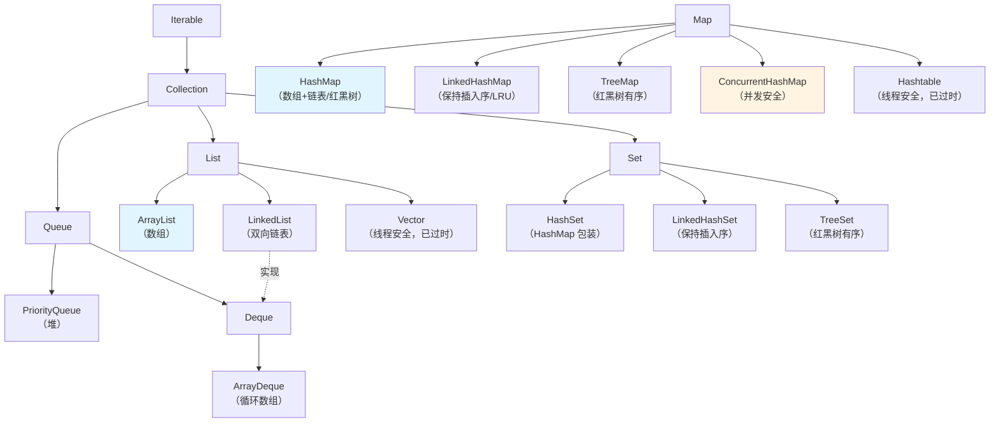

# 3.15 Java 集合框架：源码级理解才能扛住追问

> **一句话定位**：集合框架是 Java 工程师每天都在用的基础设施，但面试考的不是"会用 ArrayList"，而是"**ArrayList 扩容时为什么是 1.5 倍而不是 2 倍**""**HashMap 为什么链表长度到 8 转红黑树**"这种源码级的 why。本章从整体框架出发，逐个击破源码细节。

---

## 一、集合框架全景图——先看清家族关系

Java 集合框架由两棵接口树构成：`Collection`（单列）和 `Map`（键值对），所有具体实现都挂在这两棵树下。



> **面试口诀**：List 有序可重复、Set 无序不重复、Queue 先进先出、Map 键值对。但这只是 API 层面，源码层面每个实现的底层数据结构完全不同，性能特征天差地别。

### 1.1 集合选型速查表

| 场景 | 推荐 | 理由 |
|------|------|------|
| 随机访问多、增删少 | `ArrayList` | 数组连续内存，按索引 O(1) |
| 频繁头尾插删 | `ArrayDeque` | 循环数组，比 LinkedList 缓存友好 |
| 需要去重 | `HashSet` | 底层 HashMap，O(1) 判重 |
| 需要有序去重 | `TreeSet` | 红黑树，O(log N) |
| 键值存取 | `HashMap` | 最通用，O(1) 平均 |
| 键值有序 | `TreeMap` | 红黑树，按 key 排序 |
| 并发场景 | `ConcurrentHashMap` | 分段锁 / CAS + synchronized |
| LRU 缓存 | `LinkedHashMap` | accessOrder=true，重写 removeEldestEntry |
| 优先级任务 | `PriorityQueue` | 小顶堆，O(log N) 入队出队 |

---

## 二、ArrayList 源码解析

### 2.1 底层结构：一个可自动扩容的数组

`ArrayList` 的核心就是一个 `Object[]` 数组，加上一个 `size` 字段记录实际元素个数。

```java
// JDK 源码简化
public class ArrayList<E> {
    transient Object[] elementData;  // 底层数组
    private int size;                // 实际元素个数（≤ elementData.length）
}
```

### 2.2 扩容机制：为什么是 1.5 倍？

```java
// 扩容核心逻辑（JDK 8+）
private void grow(int minCapacity) {
    int oldCapacity = elementData.length;
    int newCapacity = oldCapacity + (oldCapacity >> 1);  // 1.5 倍（右移1位 = 除以2）
    if (newCapacity < minCapacity)
        newCapacity = minCapacity;
    elementData = Arrays.copyOf(elementData, newCapacity);
}
```

为什么选 1.5 倍而不是 2 倍？这是**空间浪费率和扩容频率的权衡**：2 倍扩容浪费最多 50% 空间，1.5 倍最多浪费 33%。而且 1.5 倍用位运算（`>> 1`）即可计算，性能好。

### 2.3 增删改查复杂度

| 操作 | 时间复杂度 | 说明 |
|------|-----------|------|
| `get(i)` / `set(i, e)` | O(1) | 数组按索引直接访问 |
| `add(e)`（尾部追加） | 均摊 O(1) | 偶尔触发扩容拷贝 |
| `add(i, e)`（中间插入） | O(N) | 需要 `System.arraycopy` 移动后续元素 |
| `remove(i)` | O(N) | 同上，需要移动元素 |
| `contains(o)` | O(N) | 遍历查找 |

<details>
<summary><b>展开：ArrayList vs LinkedList 的真实性能——为什么几乎不该用 LinkedList</b></summary>

理论上 LinkedList 中间插入是 O(1)（修改指针），但这有个前提：**你已经拿到了要插入位置的节点引用**。而实际使用中，你通常只有索引，LinkedList 按索引查找是 O(N)——先遍历到那个位置，再插入。所以"LinkedList 中间插入快"在实际场景中几乎不成立。

更关键的是 **CPU 缓存友好性（Cache Locality）**：ArrayList 底层是连续内存数组，遍历时 CPU 缓存行（Cache Line, 64 字节）一次能预加载多个元素；LinkedList 的节点散落在堆的各处，每次访问下一个节点都可能触发缓存未命中（Cache Miss）。在现代 CPU 上，缓存未命中的代价（去主存取数据）比计算本身大 100 倍以上。

**实测结论**：除了"需要频繁在头部插入/删除"这一个场景（用 `ArrayDeque` 也更好），ArrayList 在几乎所有场景下都优于 LinkedList。这也是为什么 Java 官方文档都建议"大多数情况下使用 ArrayList"。

> **面试加分项**：如果面试官问"什么时候用 LinkedList"，最好的回答是"几乎没有——需要双端队列用 ArrayDeque，需要链表结构用于算法题时才会用 LinkedList"。

</details>

---

## 三、HashMap 源码解析（面试超高频）

### 3.1 底层结构演进

```
JDK 7：数组 + 链表（头插法）
JDK 8：数组 + 链表 / 红黑树（尾插法）
```

JDK 8 的改进是为了解决**链表过长导致查找退化为 O(N)** 的问题——当链表长度 ≥ 8 且数组长度 ≥ 64 时，链表转为红黑树，查找从 O(N) 优化到 O(log N)。

### 3.2 核心参数

| 参数 | 默认值 | 含义 |
|------|--------|------|
| `DEFAULT_INITIAL_CAPACITY` | 16 | 数组初始长度，必须是 2 的幂 |
| `DEFAULT_LOAD_FACTOR` | 0.75f | 负载因子——元素数量/数组长度超过此值就扩容 |
| `TREEIFY_THRESHOLD` | 8 | 链表转红黑树的阈值 |
| `UNTREEIFY_THRESHOLD` | 6 | 红黑树退化为链表的阈值 |
| `MIN_TREEIFY_CAPACITY` | 64 | 链表转红黑树时数组的最小长度（不满足则先扩容） |

### 3.3 put 流程（JDK 8）

```
① 计算 key 的 hash：hash = key.hashCode() ^ (key.hashCode() >>> 16)  ← 高位扰动
② 定位桶：index = (n - 1) & hash    ← 等价于 hash % n（当 n 是 2 的幂时）
③ 桶为空 → 直接放入新节点
④ 桶不为空：
   ├─ 头节点 key 相同 → 覆盖 value
   ├─ 头节点是 TreeNode → 走红黑树的插入逻辑
   └─ 头节点是链表 → 尾插法遍历：
       ├─ 找到相同 key → 覆盖
       └─ 没找到 → 尾部追加新节点
           └─ 插入后链表长度 ≥ 8 → treeifyBin()（数组 < 64 则扩容，否则转红黑树）
⑤ 检查是否超过阈值（capacity × loadFactor）→ 是则 resize() 扩容为原来 2 倍
```

### 3.4 hash 扰动函数——为什么要异或高 16 位？

```java
static final int hash(Object key) {
    int h;
    return (key == null) ? 0 : (h = key.hashCode()) ^ (h >>> 16);
}
```

因为定位桶用的是 `(n-1) & hash`，当数组长度 n 较小时（比如 16），只有低 4 位参与运算，高位完全被忽略。高位异或低位是为了让**高位信息也参与到桶的定位中**，减少碰撞。

### 3.5 扩容机制（resize）

扩容时数组长度翻倍（`newCap = oldCap << 1`），所有元素需要重新计算桶位置。JDK 8 的优化：不需要重新 hash，只需要看原 hash 值在新增的那一位上是 0 还是 1——是 0 就留在原位，是 1 就移到 `原位 + oldCap`。

<details>
<summary><b>展开：为什么 HashMap 容量必须是 2 的幂？</b></summary>

因为定位桶的公式是 `index = (n - 1) & hash`。当 n 是 2 的幂时，`n - 1` 的二进制全是 1（比如 16-1 = 1111），与 hash 做按位与等价于取模（`hash % n`），但位运算比取模快得多。

如果 n 不是 2 的幂，`n - 1` 的二进制会有 0 位，导致某些桶永远不会被映射到，分布不均匀，碰撞增加。

这也是为什么你传入一个非 2 的幂的初始容量时，HashMap 会自动向上取到最近的 2 的幂（`tableSizeFor()` 方法）。

</details>

<details>
<summary><b>展开：为什么链表长度到 8 才转红黑树？为什么退化阈值是 6？</b></summary>

**为什么是 8？** HashMap 源码注释里给出了数学解释：在随机 hash 的情况下，桶中链表长度服从泊松分布（Poisson Distribution）。当负载因子为 0.75 时，链表长度达到 8 的概率只有约 0.00000006（千万分之一）。也就是说，正常使用下几乎不会触发树化——红黑树是为了应对**极端 hash 碰撞**（比如恶意构造 key）的防护机制，不是常态。

**为什么退化阈值是 6 而不是 8？** 如果树化和退化都是 8，当元素数量在 8 附近反复增删时，就会在链表和红黑树之间频繁切换（抖动）。设一个"缓冲区"（8 转树，6 退链表），避免抖动。

</details>

---

## 四、ConcurrentHashMap 源码解析

### 4.1 演进路线

```
JDK 7：Segment 分段锁（每个 Segment 是一个 ReentrantLock + HashEntry 数组）
JDK 8：CAS + synchronized（锁粒度细化到单个桶）
```

JDK 8 的改进使得锁粒度从"一段"缩小到"一个桶"，并发度大幅提升。

### 4.2 JDK 8 put 流程

```
① 计算 hash
② 定位桶
③ 桶为空 → CAS 写入（无锁）
④ 桶不为空 → synchronized(桶头节点) {
       链表/红黑树的插入逻辑（和 HashMap 类似）
   }
⑤ 检查是否需要扩容
```

关键点：**空桶用 CAS（无锁），非空桶用 synchronized 锁桶头节点**。大多数写操作命中空桶的概率很高，所以大部分时候是无锁的。

### 4.3 size() 怎么算？

`ConcurrentHashMap` 的 `size()` 不能简单加锁——那样并发性就没了。JDK 8 用 `baseCount` + `CounterCell[]` 的分散计数方案（类似 `LongAdder`）：写入时分散到不同 cell 累加，读取时汇总。这是用空间换时间、降低竞争的典型思路。

<details>
<summary><b>展开：ConcurrentHashMap 的 key 和 value 为什么不能为 null？</b></summary>

`HashMap` 允许 key 和 value 为 null，但 `ConcurrentHashMap` 禁止。原因是**二义性问题**：

在并发环境中，`map.get(key)` 返回 null 时，你无法区分"key 存在但 value 是 null"还是"key 不存在"。在单线程的 `HashMap` 中你可以用 `containsKey()` 再检查一次，但在并发环境中，两次调用之间状态可能已经变了，判断结果不可靠。

Doug Lea（JUC 作者）的设计哲学是：**在并发容器中不应该引入任何需要"两步操作"才能判断的歧义**。所以直接禁止 null。

</details>

---

## 五、其他重要集合

### 5.1 LinkedHashMap——HashMap + 双向链表

`LinkedHashMap` 继承自 `HashMap`，在每个节点上额外维护了 `before` 和 `after` 指针，形成一条贯穿所有节点的双向链表。

两种顺序模式（由构造器参数 `accessOrder` 控制）：

| 模式 | `accessOrder` | 迭代顺序 | 典型用途 |
|------|--------------|---------|---------|
| 插入顺序 | `false`（默认） | 按 put 的先后顺序 | 保持插入顺序的 Map |
| 访问顺序 | `true` | 每次 get/put 把节点移到链表尾部 | **LRU 缓存** |

```java
// 用 LinkedHashMap 实现 LRU 缓存（面试经典题）
class LRUCache<K, V> extends LinkedHashMap<K, V> {
    private final int capacity;

    public LRUCache(int capacity) {
        super(capacity, 0.75f, true);  // accessOrder = true
        this.capacity = capacity;
    }

    @Override
    protected boolean removeEldestEntry(Map.Entry<K, V> eldest) {
        return size() > capacity;  // 超过容量就移除最久未访问的
    }
}
```

### 5.2 TreeMap——红黑树实现的有序 Map

底层是红黑树（[A1 附录](./A1-核心数据结构原理.md) 有详细原理），key 必须实现 `Comparable` 或者构造时传入 `Comparator`。所有操作 O(log N)。

适用场景：需要按 key 排序遍历、范围查询（`subMap`/`headMap`/`tailMap`）、找最近的 key（`floorKey`/`ceilingKey`）。

### 5.3 PriorityQueue——堆

底层是**小顶堆**（用数组实现的完全二叉树）。`peek()`/`poll()` 取出的是最小元素（自然排序或自定义 Comparator）。

| 操作 | 时间复杂度 |
|------|-----------|
| `offer(e)` / `add(e)` | O(log N) |
| `peek()` | O(1) |
| `poll()` | O(log N) |
| `remove(o)` | O(N)（遍历查找） |

> 注意：`PriorityQueue` 不是线程安全的。并发场景用 `PriorityBlockingQueue`。

---

## 六、面试深度剖析：大厂高频考点

### 考点 1：HashMap 线程不安全的具体表现

> **面试官**：「HashMap 线程不安全，具体会出什么问题？」

JDK 7：并发 put 触发扩容时，链表采用头插法重新分配，可能形成**环形链表**，导致 `get()` 死循环，CPU 飙到 100%。

JDK 8：改为尾插法，解决了环形链表问题，但仍然有**数据丢失**（两个线程同时写同一个桶，一个覆盖另一个）和 **`size` 不准确**的问题。

### 考点 2：fail-fast vs fail-safe

> **面试官**：「什么是 fail-fast？ConcurrentHashMap 是 fail-safe 吗？」

**fail-fast**（快速失败）：`ArrayList`、`HashMap` 等非并发集合，在遍历时如果发现集合被修改了（`modCount` 变了），立刻抛 `ConcurrentModificationException`。这是一种**提前暴露问题**的保护机制，而不是并发安全保证。

**fail-safe**（安全失败）：`ConcurrentHashMap`、`CopyOnWriteArrayList` 等并发集合，遍历时基于集合的某个"快照"或允许并发修改，不抛异常。代价是遍历期间看到的数据可能不是最新的。

### 考点 3：Collections.synchronizedMap vs ConcurrentHashMap

> **面试官**：「我用 `Collections.synchronizedMap(new HashMap<>())` 不行吗？」

能用，但性能差很多。`synchronizedMap` 给**每个方法**都加了同一把锁（`mutex` 对象），任意时刻只有一个线程能操作 map。`ConcurrentHashMap` 锁粒度是单个桶，不同桶可以并行读写。

### 考点 4：HashMap 的 key 需要满足什么条件？

> **面试官**：「自定义对象做 HashMap 的 key 有什么要求？」

必须正确重写 `hashCode()` 和 `equals()`，并且遵守契约：如果 `a.equals(b)` 为 true，则 `a.hashCode() == b.hashCode()` 必须为 true。反过来不要求（hash 碰撞是允许的）。

如果只重写 `equals()` 不重写 `hashCode()`，两个"相等"的对象可能落到不同的桶里，`get()` 找不到之前 `put` 的值。

> **面试加分项**：key 最好是**不可变对象**（如 String、Integer）。如果 key 是可变对象，put 之后修改了 key 的字段导致 hashCode 变化，这个 entry 就"丢失"了——按新的 hashCode 找不到，按旧的桶位也找不到。

---

## 七、多语言钩子

Java 集合框架的设计思路——**接口与实现分离、通过泛型保证类型安全、提供线程安全和非线程安全两套实现**——在其他语言中各有对应：

- **Go**：没有泛型集合框架（Go 1.18 才引入泛型），内置 `slice`（动态数组）和 `map`（哈希表），并发安全用 `sync.Map` → [3.3 Java→Go](../part4-multilang-compare/03-Java到Go.md)
- **Rust**：标准库提供 `Vec`、`HashMap`、`BTreeMap`，通过所有权系统在编译期保证线程安全 → [4.4 Java→Rust](../part4-multilang-compare/04-Java到Rust.md)
- **JavaScript/TypeScript**：`Array`、`Map`、`Set` 内置，但没有并发安全问题（单线程）→ [4.2 Java→JS/TS](../part4-multilang-compare/02-Java到JS-TS.md)

---

[← 3.14 微服务治理与分布式锁](./14-微服务与分布式锁.md) | [返回本章目录](./README.md) | [3.16 Java 8+ 新特性 →](./16-Java8+新特性.md)
