# 3.17 设计模式：23 种经典模式与 Spring 中的实战

> **一句话定位**：设计模式不是"高级语法"，而是**前人总结的面向对象设计经验**——面对反复出现的设计问题，用经过验证的解决方案来组织代码，让系统更灵活、更可维护。面试中设计模式是"体现思维深度"的加分项，日常开发中 Spring 框架本身就是设计模式的百科全书。

---

## 一、先建立宏观认知：为什么需要设计模式？

### 1.1 设计的本质诉求

软件设计的核心矛盾是：**需求会变，但代码不想重写**。设计模式解决的核心问题就是**如何让代码在需求变化时只改最少的地方**。

这引出了面向对象设计的两个核心原则：

- **封装变化**：把可能变化的部分隔离出来，不让它影响不变的部分
- **面向接口编程**：依赖抽象而非具体实现，这样替换实现时调用方不用改

### 1.2 SOLID 原则——设计模式的理论地基

所有 23 种设计模式背后都遵循 SOLID 原则（详见 [A6 代码规范与设计原则](./A6-代码规范与设计原则.md)）：

| 原则 | 全称 | 一句话 | 违反时的症状 |
|------|------|--------|------------|
| **S** | Single Responsibility | 一个类只负责一件事 | 改一个功能要动好几个不相关的地方 |
| **O** | Open-Closed | 对扩展开放，对修改关闭 | 加新功能就得改老代码 |
| **L** | Liskov Substitution | 子类必须能替代父类 | 父类引用换成子类后行为意外 |
| **I** | Interface Segregation | 接口要小而精 | 实现类被迫实现一堆用不到的方法 |
| **D** | Dependency Inversion | 高层不依赖低层，都依赖抽象 | 换一个数据库就要改业务层代码 |

### 1.3 三大类 · 23 种模式总览

```mermaid
graph TD
    A["23 种设计模式"] --> B["创建型（5 种）<br/>怎么创建对象"]
    A --> C["结构型（7 种）<br/>怎么组合对象"]
    A --> D["行为型（11 种）<br/>对象之间怎么交互"]

    B --> B1["单例 Singleton"]
    B --> B2["工厂方法 Factory Method"]
    B --> B3["抽象工厂 Abstract Factory"]
    B --> B4["建造者 Builder"]
    B --> B5["原型 Prototype"]

    C --> C1["代理 Proxy"]
    C --> C2["适配器 Adapter"]
    C --> C3["装饰器 Decorator"]
    C --> C4["外观 Facade"]
    C --> C5["桥接 Bridge"]
    C --> C6["组合 Composite"]
    C --> C7["享元 Flyweight"]

    D --> D1["策略 Strategy"]
    D --> D2["模板方法 Template Method"]
    D --> D3["观察者 Observer"]
    D --> D4["责任链 Chain of Responsibility"]
    D --> D5["状态 State"]
    D --> D6["命令 Command"]
    D --> D7["迭代器 Iterator"]
    D --> D8["中介者 Mediator"]
    D --> D9["备忘录 Memento"]
    D --> D10["访问者 Visitor"]
    D --> D11["解释器 Interpreter"]

    style B fill:#e1f5ff
    style C fill:#fff4e1
    style D fill:#f0ffe0
```



---

## 二、创建型模式——怎么创建对象

### 2.1 单例模式（Singleton）

**一句话**：保证一个类在整个 JVM 中只有一个实例。

**五种写法对比**：

| 写法 | 线程安全 | 懒加载 | 防反射 | 防反序列化 | 推荐度 |
|------|---------|--------|--------|-----------|--------|
| 饿汉式（static final） | ✅ | ❌ | ❌ | ❌ | ★★★ |
| 懒汉式（synchronized 方法） | ✅ | ✅ | ❌ | ❌ | ★ |
| DCL（双重检查 + volatile） | ✅ | ✅ | ❌ | ❌ | ★★★ |
| 静态内部类 | ✅ | ✅ | ❌ | ❌ | ★★★★ |
| **枚举** | ✅ | ❌ | ✅ | ✅ | ★★★★★ |

```java
// 推荐：枚举单例（Effective Java 推荐）
public enum Singleton {
    INSTANCE;
    public void doSomething() { }
}

// 经典：DCL 双重检查（面试常考）
public class Singleton {
    private static volatile Singleton instance;  // volatile 必须有！详见 3.2 JMM
    private Singleton() { }
    public static Singleton getInstance() {
        if (instance == null) {                  // 第一次检查（无锁）
            synchronized (Singleton.class) {
                if (instance == null) {           // 第二次检查（有锁）
                    instance = new Singleton();
                }
            }
        }
        return instance;
    }
}
```

> **DCL 为什么需要 volatile？** → 详见 [3.2 JMM](./02-内存模型JMM.md) 中的 DCL 分析。`new Singleton()` 不是原子操作，分为三步：分配内存 → 初始化 → 赋值给引用。没有 volatile，指令重排可能让另一个线程拿到"已赋值但未初始化"的对象。

**Spring 中的单例**：Spring Bean 默认就是单例（`@Scope("singleton")`），但它的单例不是通过私有构造器，而是由 IOC 容器管理——容器保证每个 Bean 定义只创建一个实例。

### 2.2 工厂方法模式（Factory Method）

**一句话**：把对象的创建延迟到子类决定。

```java
// 定义创建接口
public interface LoggerFactory {
    Logger createLogger();
}
// 不同实现
public class FileLoggerFactory implements LoggerFactory {
    public Logger createLogger() { return new FileLogger(); }
}
public class ConsoleLoggerFactory implements LoggerFactory {
    public Logger createLogger() { return new ConsoleLogger(); }
}
```

**Spring 中的工厂**：`FactoryBean` 接口就是工厂方法的应用。你实现 `getObject()` 来自定义 Bean 的创建逻辑。

### 2.3 抽象工厂模式（Abstract Factory）

**一句话**：创建一族相关的对象，而不是单个对象。

典型场景：跨数据库支持——MySQL 工厂创建 MySQL 的 Connection/Statement/ResultSet，PostgreSQL 工厂创建 PG 的对应组件。JDBC 的 `DriverManager` 就是抽象工厂的应用。

### 2.4 建造者模式（Builder）

**一句话**：分步构建复杂对象，避免"伸缩构造器"。

```java
User user = User.builder()
    .name("张三")
    .age(25)
    .email("zhangsan@example.com")
    .build();
```

Lombok 的 `@Builder` 注解就是自动生成建造者模式的代码。`StringBuilder` 也是建造者模式的典型应用。

### 2.5 原型模式（Prototype）

**一句话**：通过复制已有对象来创建新对象，避免重复初始化。

Java 中通过 `Cloneable` 接口 + `clone()` 方法实现。注意区分**浅拷贝**（只复制引用）和**深拷贝**（递归复制所有对象）。

---

## 三、结构型模式——怎么组合对象

### 3.1 代理模式（Proxy）

**一句话**：给目标对象提供一个替身，在不修改目标代码的前提下增强功能。

这是 Spring AOP 的核心实现机制（详见 [3.13 Spring 全家桶](./13-Spring全家桶.md)）：

| 代理类型 | 实现方式 | 限制 |
|---------|---------|------|
| JDK 动态代理 | 基于接口，运行时生成代理类 | 目标类必须实现接口 |
| CGLIB 代理 | 基于继承，生成目标类的子类 | 目标类不能是 final |

### 3.2 适配器模式（Adapter）

**一句话**：把一个接口转换成客户期望的另一个接口。

典型应用：`InputStreamReader`（字节流→字符流）、`Arrays.asList()`（数组→List）、Spring MVC 的 `HandlerAdapter`。

### 3.3 装饰器模式（Decorator）

**一句话**：动态给对象添加职责，比继承更灵活。

典型应用：Java IO 流（`BufferedInputStream` 装饰 `FileInputStream`）、`Collections.synchronizedList()` 给 List 加同步装饰。

> **代理 vs 装饰器**：代理控制对目标的**访问**（客户端可能不知道代理的存在），装饰器增强目标的**功能**（客户端知道装饰的存在）。结构几乎一样，意图不同。

### 3.4 外观模式（Facade）

**一句话**：为一组复杂子系统提供一个简单的统一入口。

典型应用：SLF4J 是日志框架的外观、Spring 的 `JdbcTemplate` 是 JDBC 的外观。

### 3.5 其他结构型模式简述

| 模式 | 一句话 | 典型应用 |
|------|--------|---------|
| 桥接 Bridge | 把抽象和实现分离，两者独立变化 | JDBC 的 Driver/Connection 分离 |
| 组合 Composite | 把对象组成树形结构，统一处理叶子和容器 | 文件系统（文件/文件夹）、菜单 |
| 享元 Flyweight | 共享大量细粒度对象，节省内存 | `Integer.valueOf()` 缓存 -128~127、`String` 常量池 |

---

## 四、行为型模式——对象之间怎么交互

### 4.1 策略模式（Strategy）

**一句话**：定义一组算法，把它们各自封装起来，让它们可以互相替换。

```java
// 消除 if-else 的典型手段
public interface DiscountStrategy {
    BigDecimal calculate(BigDecimal price);
}
public class VipDiscount implements DiscountStrategy {
    public BigDecimal calculate(BigDecimal price) { return price.multiply(new BigDecimal("0.8")); }
}
public class NormalDiscount implements DiscountStrategy {
    public BigDecimal calculate(BigDecimal price) { return price; }
}

// 使用
Map<String, DiscountStrategy> strategies = Map.of(
    "VIP", new VipDiscount(),
    "NORMAL", new NormalDiscount()
);
BigDecimal finalPrice = strategies.get(userType).calculate(originalPrice);
```

**Spring 中的策略**：`Resource` 接口的多种实现（ClassPathResource/FileSystemResource/UrlResource）就是策略模式。

### 4.2 模板方法模式（Template Method）

**一句话**：在父类中定义算法骨架，把可变步骤延迟到子类实现。

```java
public abstract class AbstractOrderProcessor {
    // 模板方法——定义流程骨架
    public final void process(Order order) {
        validate(order);
        calculatePrice(order);
        pay(order);          // 可变步骤
        notify(order);       // 可变步骤
    }
    protected abstract void pay(Order order);
    protected abstract void notify(Order order);
}
```

**Spring 中的模板方法**：`JdbcTemplate`、`RestTemplate`、`AbstractApplicationContext.refresh()` 都是模板方法模式。

> **策略 vs 模板方法**：策略是组合（has-a），在运行时替换算法；模板方法是继承（is-a），在编译时确定算法骨架。偏好策略模式（组合优于继承）。

### 4.3 观察者模式（Observer）

**一句话**：一对多依赖——当被观察者状态变化时，自动通知所有观察者。

**Spring 中的观察者**：`ApplicationEvent` + `ApplicationListener` / `@EventListener` 就是观察者模式的实现。`ApplicationContext.publishEvent()` 发布事件，所有监听该事件的 Bean 自动收到通知。

### 4.4 责任链模式（Chain of Responsibility）

**一句话**：把请求沿着处理者链条传递，直到有人处理为止。

典型应用：Servlet Filter 链、Spring Interceptor 链、Netty 的 ChannelPipeline。

### 4.5 其他行为型模式简述

| 模式 | 一句话 | 典型应用 |
|------|--------|---------|
| 状态 State | 对象行为随内部状态改变而改变 | 订单状态机（待支付/已支付/已发货） |
| 命令 Command | 将请求封装为对象，支持撤销/队列 | `Runnable`、`Callable` |
| 迭代器 Iterator | 统一遍历不同集合结构的方式 | `java.util.Iterator`、增强 for 循环 |
| 中介者 Mediator | 用一个中介者封装多个对象的交互 | MVC 中的 Controller |
| 备忘录 Memento | 保存对象状态以便恢复 | 撤销操作、版本管理 |
| 访问者 Visitor | 在不修改类的前提下增加新操作 | ASM 字节码操作、编译器语法树遍历 |
| 解释器 Interpreter | 定义语言的语法表示和解释器 | 正则表达式、SpEL 表达式 |

---

## 五、Spring 框架中的设计模式速查

| 设计模式 | Spring 中的应用 |
|---------|----------------|
| 单例 | Bean 默认 `singleton` 作用域 |
| 工厂方法 | `FactoryBean`、`BeanFactory` |
| 代理 | AOP（JDK 动态代理 / CGLIB） |
| 模板方法 | `JdbcTemplate`、`RestTemplate`、`AbstractApplicationContext.refresh()` |
| 观察者 | `ApplicationEvent` + `@EventListener` |
| 策略 | `Resource` 接口多实现、`HandlerMapping` 多实现 |
| 适配器 | `HandlerAdapter`（不同 Controller 适配统一调用） |
| 责任链 | `Filter` 链、`Interceptor` 链 |
| 装饰器 | `BeanWrapper`、`HttpServletRequestWrapper` |
| 建造者 | `BeanDefinitionBuilder`、`UriComponentsBuilder` |
| 外观 | `JdbcTemplate`（JDBC 的外观）、`SLF4J`（日志外观） |
| 组合 | `CompositeCacheManager`、`CompositeHealthIndicator` |

---

## 六、面试深度剖析：大厂高频考点

### 考点 1：Spring 用了哪些设计模式？

> **面试官**：「说说 Spring 框架用到了哪些设计模式？」

参见上面的速查表。重点能说出 4-5 个并解释具体怎么用的（比如 AOP 用代理、Bean 生命周期用模板方法、事件机制用观察者），就足够了。

### 考点 2：策略模式怎么消除 if-else？

> **面试官**：「代码里有大量 if-else 判断不同类型走不同逻辑，怎么优化？」

用策略模式：定义接口 → 每个分支逻辑封装为一个策略实现类 → 用 Map 或 Spring 自动注入（`Map<String, Strategy>`）来路由。新增分支只需加一个实现类，不改现有代码。

### 考点 3：代理模式、装饰器模式、适配器模式怎么区分？

> **面试官**：「这三个结构都差不多，怎么区分？」

结构确实相似（都是包一层），**区分靠意图**：代理控制访问（如权限检查、延迟加载），装饰器增强功能（如加缓冲、加加密），适配器转换接口（如把圆孔变方孔）。

---

[← 3.16 Java 8+ 新特性](./16-Java8+新特性.md) | [返回本章目录](./README.md) | [附录 A1 核心数据结构 →](./A1-核心数据结构原理.md)
