# 附录 A1：核心数据结构原理——面试必考的底层结构

> 跳表、红黑树、布隆过滤器、一致性 Hash——这些数据结构不仅在 [Redis](./08-缓存与Redis.md) 里出现，在 Java 标准库、分布式系统、[数据库](./09-数据库MySQL.md)、[高可用架构](./07-高可用架构.md) 中也反复出现。
> 本章把它们从各自的应用场景中抽离出来，集中讲透原理，方便你在任何面试问到时都能从容作答。

---

## 目录

- [一、跳表（Skip List）](#一跳表skip-list给链表加目录) —— 1.1 为什么需要 · 1.2 结构图解 · 1.3 查找过程 · 1.4 复杂度分析 · 1.5 插入与随机化 · 1.6 对比 · 1.7 应用场景
- [二、红黑树（Red-Black Tree）](#二红黑树red-black-tree最坏情况下也不慌的平衡术) —— 2.1 BST 退化问题 · 2.2 五条规则 · 2.3 旋转和变色 · 2.4 vs AVL · 2.5 应用场景 · 2.6 ZSet 为什么用跳表
- [三、布隆过滤器（Bloom Filter）](#三布隆过滤器bloom-filter用-1-的误判换-99-的内存节省) —— 3.1 是什么 · 3.2 原理图解 · 3.3 参数设计 · 3.4 应用场景 · 3.5 变体 · 3.6 Redis 中使用
- [四、一致性 Hash（Consistent Hashing）](#四一致性hashconsistent-hashing节点增减时的最小搬迁) —— 4.1 普通 Hash 的问题 · 4.2 哈希环 · 4.3 虚拟节点 · 4.4 Redis Hash Slot
- [五、HashMap](#五hashmapjava-面试出现频率最高的数据结构) —— 5.1 整体结构 · 5.2 哈希扰动 · 5.3 put 流程 · 5.4 扩容 rehash · 5.5 线程不安全 · 5.6 核心参数
- [六、B+ 树](#六b-树数据库索引为什么选它) —— 6.1 从二叉树到 B+ 树 · 6.2 结构 · 6.3 查找过程 · 6.4 为什么不用红黑树/Hash
- [七、常见树结构总览](#七常见树结构总览一张表理清关系) —— 一张表理清 BST/AVL/红黑树/B树/B+树/跳表/Trie/堆
- [八、MinHash 与 SimHash](#八minhash-与-simhash文档去重的概率算法) —— 8.1 MinHash（n-gram / 签名 / LSH） · 8.2 SimHash · 8.3 对比 · 8.4 应用场景
- [九、HyperLogLog（HLL）](#九hyperlogloghll用-12kb-估算亿级基数) —— 9.1 基数估计 · 9.2 分桶原理 · 9.3 误差率 · 9.4 稀疏/稠密 · 9.5 HLL++ · 9.6 应用 · 9.7 对比
- [十、Count-Min Sketch（CMS）](#十count-min-sketchcms用固定空间估算频率) —— 10.1 频率估算 · 10.2 原理 · 10.3 误差保证 · 10.4 应用 · 10.5 对比

---

## 一、跳表（Skip List）——给链表加目录

### 1.1 为什么需要跳表？

有序链表最大的痛点是查找慢——要找值为 50 的节点，只能从头一个个遍历：1→5→12→20→35→50，走了 6 步。节点越多越慢，O(N)。

数组可以二分查找 O(log N)，但插入/删除需要移动元素。有没有办法让链表也能「跳着查」？

跳表的做法很朴素：**给链表加多层索引**，让查找可以从高层大步跳过，再逐层下沉精确定位。

### 1.2 结构图解——每个节点有 right 和 down 两个指针

跳表里被「提升」到高层的节点，**在每一层都有一个副本**。每个副本有两个指针：

- **right 指针** → 指向同层的下一个节点
- **down 指针** → 指向下一层的**同一个值**的副本

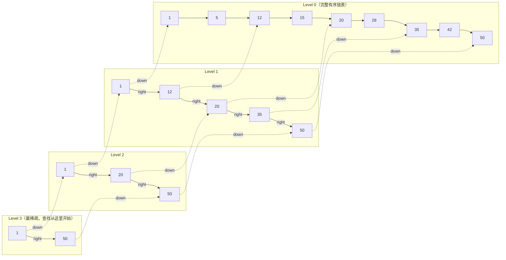

以节点 20 为例：它在 Level 2、Level 1、Level 0 各有一个副本。Level 2 的 20 有 right→50 和 down→Level 1 的 20；Level 1 的 20 有 right→35 和 down→Level 0 的 20。**「下沉」就是沿 down 指针走到下一层同一个值的副本，然后继续用 right 指针往右比较。**

### 1.3 查找过程——以查找 35 为例

查找的规则只有两条：**right 的值 ≤ 目标 → 走 right（实线）；right 的值 > 目标 → 走 down/下沉（虚线）。**

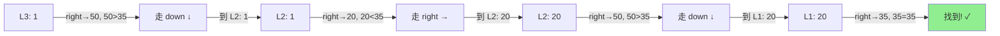

总共 4 步（2 次 right + 2 次 down），而从头遍历 Level 0 需要 7 步。

规律：每多一层索引，搜索范围减半——这和二分查找的原理一模一样，所以时间复杂度是 **O(log N)**。

### 1.4 O(log N) 是怎么算出来的？

先回忆一下 **log（对数）** 是什么：log 就是「反复除」。log₂N 的意思是「N 反复除以 2，除到 1 需要几次」。比如 N = 1024，1024 → 512 → 256 → 128 → 64 → 32 → 16 → 8 → 4 → 2 → 1，除了 10 次，所以 log₂1024 = 10。同理 log₄N 就是「反复除以 4 几次」，log₄1024 = 5（因为 4⁵ = 1024）。**凡是「每一步排除一半/一大块」的算法，复杂度都是 O(log N)**——二分查找、平衡树、跳表都是这个原理。

以提升概率 p = 1/2（最直观的情况）为例推导跳表：

底层 Level 0 有 N 个节点。每个节点有 50% 概率被提升到 Level 1，所以 Level 1 期望有 N/2 个节点。同理 Level 2 有 N/4 个，Level 3 有 N/8 个……Level k 有 N/2^k 个。每层砍半，什么时候砍到只剩 1 个？N/2^k = 1 → **k = log₂N**，这就是层数。

每层最多走多少步？两个相邻的上层节点之间，下层最多夹 1/p 个节点（p = 1/2 时最多 2 个）。所以每下沉一层，水平方向最多走 1/p 步（常数）。

总步数 = 层数 × 每层步数 = **log₂N × 常数 = O(log N)**。

Redis 用 p = 1/4（25% 概率提升）。每层砍到 1/4 → 层数变成 log₄N（更少层），但每层水平最多走约 4 步（更多步）。总步数 = log₄N × 4，仍然是 O(log N)，只是常数项不同。选 1/4 而不是 1/2 是**空间和时间的折中**——层数更少意味着每个节点的指针更少，省内存。

| 提升概率 p | 期望层数 | 每层水平步数 | 总步数量级 | 空间（指针数/节点） |
|-----------|---------|------------|-----------|------------------|
| 1/2 | log₂N | ~2 | O(log N) | 2（指针多，费内存） |
| **1/4（Redis）** | log₄N | ~4 | O(log N) | **1.33（省内存）** |
| 1/e | logₑN | ~e≈2.7 | O(log N) | ~1.58（理论最优） |

**关键区别：跳表的 O(log N) 是「期望值」，不是「最坏保证」**

跳表的层数是随机抛硬币决定的，所以 O(log N) 是大量操作的**平均表现**。理论上存在一种极端情况：所有节点抛硬币都是反面，全部只在 Level 0，退化成普通链表 O(N)。但这个概率是指数级下降的——就像连续抛 N 次硬币全是反面，概率是 2⁻ᴺ。N = 100 时概率约 10⁻³⁰，比连中一百期彩票还小。

红黑树不一样，它的 O(log N) 是**最坏情况保证**——通过旋转变色的确定性规则，数学上保证每一次操作都不超过 O(log N)，不存在退化可能。

| 维度 | 跳表 | 红黑树 |
|------|------|--------|
| O(log N) 的含义 | 期望值（概率保证） | 最坏情况（确定性保证） |
| 极端退化 | 理论存在但概率 ≈ 0 | 不可能退化 |
| 工程影响 | 无——退化概率比硬件故障还低 | 无——本来就不退化 |

所以你说的没错——**跳表的复杂度确实是由插入时抛硬币的概率「期望」出来的**。但「期望 O(log N)」和「最坏 O(log N)」在工程实践中几乎没有差别，这也是 Redis 作者说「性能相当」的底气。

### 1.5 插入与层数决定——随机化的巧妙设计

跳表的插入不需要像红黑树那样做旋转变色，它用一种非常优雅的方式维持平衡——**抛硬币**：

1. 先用标准查找定位到插入位置，在 Level 0 插入新节点
2. 然后「抛硬币」：正面就把这个节点提升到上一层，再抛，再正面再提升……直到反面为止
3. 通常 Redis 中用 p = 0.25（即每次有 25% 概率提升），期望每个节点 1.33 层

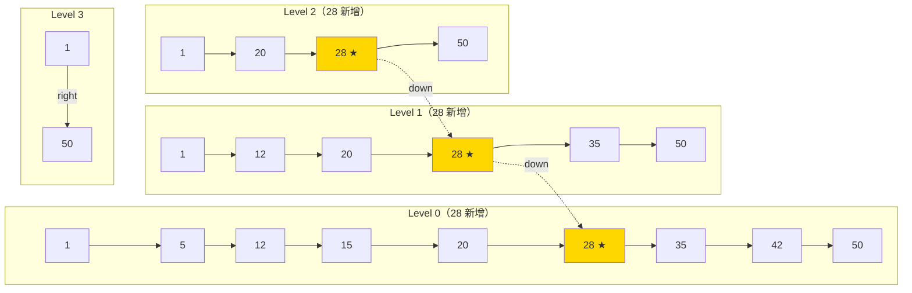

插入 28，抛硬币结果：正、正、反 → 提升到 Level 2。金色节点是新增的 28 在各层的副本。

这种随机化设计的好处是：**不需要全局重新平衡**，插入操作只影响局部。

### 1.6 复杂度与对比

| 维度 | 有序链表 | 跳表 | 平衡二叉树（红黑树/AVL） |
|------|---------|------|------------------------|
| 查找 | O(N) | O(log N) 期望 | O(log N) 最坏 |
| 插入 | O(1)（已知位置） | O(log N) | O(log N) |
| 删除 | O(1)（已知位置） | O(log N) | O(log N) |
| 范围查询 | 顺序遍历，高效 | 同样高效——底层就是有序链表 | 需要中序遍历，实现更复杂 |
| 实现复杂度 | 极简单 | **简单**（核心逻辑百行代码） | 复杂（旋转/变色逻辑） |
| 平衡方式 | 无 | 概率性（随机层数） | 确定性（旋转保证） |
| 空间开销 | O(N) | O(N)（多层指针，约 1.33N） | O(N)（左右孩子+颜色） |

> **后端类比**：跳表就像**书的目录**——目录是索引层，正文是底层链表。你不会从第 1 页翻到第 500 页找某章，而是先看目录跳到大概位置，再细找。

### 1.7 跳表在哪里被使用？

| 使用方 | 场景 | 为什么选跳表 |
|--------|------|------------|
| **Redis ZSet** | 有序集合的底层实现 | 范围查询友好 + 实现简单 |
| **LevelDB / RocksDB** | MemTable（内存中的有序表） | 高效的并发写入 + 范围扫描 |
| **Java ConcurrentSkipListMap** | 并发有序 Map | 无锁实现比红黑树的锁粒度更细 |
| **Apache HBase** | MemStore | 类似 LevelDB 的理由 |

---

## 二、红黑树（Red-Black Tree）——最坏情况下也不慌的平衡术

### 2.1 从二叉搜索树（BST）说起——退化问题

二叉搜索树的规则很简单：左子节点 < 父节点 < 右子节点。但如果插入的数据是有序的（1, 2, 3, 4, 5），BST 就会退化成链表：

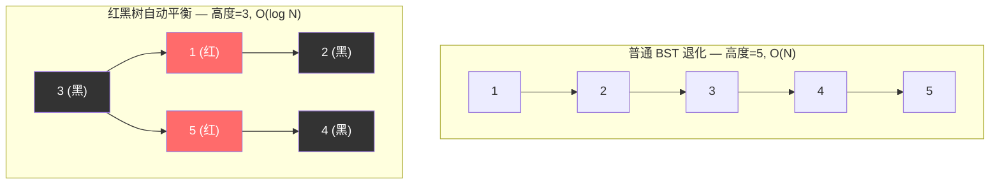

红黑树通过**给节点染色 + 旋转操作**来防止退化，保证树高始终是 O(log N)。

### 2.2 红黑树的五条规则

1. 每个节点要么**红色**要么**黑色**
2. **根节点**是黑色
3. **叶子节点**（NIL/空节点）是黑色
4. **红色节点的两个子节点必须是黑色**（不能连续两个红）
5. **从任意节点到其所有叶子路径上，黑色节点数量相同**（黑高相等）

规则 4 和 5 共同保证了一个关键性质：**最长路径不超过最短路径的 2 倍**。最短路径是全黑节点，最长路径是红黑交替（因为不能连续红），所以树高严格 ≤ **2log(N+1)**。

### 2.3 当规则被打破时——旋转和变色

插入或删除节点可能破坏上述规则（最常见的是规则 4：出现了连续红色）。修复方法有两种：

**变色**：把节点从红变黑或黑变红——最轻量的修复手段，能解决就不旋转。

**旋转**：当变色不够时，通过左旋或右旋调整树的结构。旋转不改变 BST 的有序性（中序遍历结果不变），只是改变了谁是谁的父子关系，让树变矮：

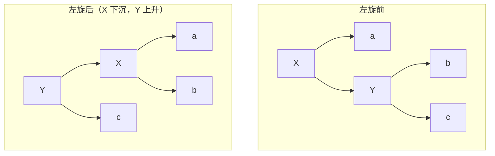

右旋是左旋的镜像。旋转前后中序遍历结果不变（都是 a-X-b-Y-c），只是父子关系变了。

红黑树的插入最多旋转 **2 次**，删除最多旋转 **3 次**——这是它比 AVL 树更适合频繁写入的关键原因。

### 2.4 红黑树 vs AVL 树

| 维度 | 红黑树 | AVL 树 |
|------|--------|--------|
| 平衡条件 | 宽松（黑高相等） | 严格（左右子树高度差 ≤ 1） |
| 查找 | O(log N) | O(log N)，因为更矮所以常数项略小 |
| 插入旋转次数 | 最多 2 次 | 最多 2 次（差不多） |
| 删除旋转次数 | 最多 **3 次** | 最多 **O(log N) 次**（逐层回溯） |
| 适用场景 | **读写混合**（频繁插入删除） | **读多写少**（查找性能极致） |
| 典型使用 | Java TreeMap、HashMap、Linux CFS 调度器 | 数据库索引（某些实现）、Windows 内核 |

一句话：红黑树牺牲了一点查找效率（树可能略高于 AVL），换取了**插入/删除时更少的旋转**。这对 Java 集合框架这类增删频繁的场景更划算。

### 2.5 红黑树在哪里被使用？

| 使用方 | 场景 | 说明 |
|--------|------|------|
| **Java TreeMap / TreeSet** | 有序映射/集合 | 基于红黑树实现，key 按自然顺序或 Comparator 排序 |
| **Java HashMap** | 链表→树退化优化 | 同一个桶内链表长度 ≥ 8 时，转为红黑树避免 O(N) 查找 |
| **Linux CFS 调度器** | 进程调度 | 用红黑树按虚拟运行时间排序，O(log N) 找到下一个应调度的进程 |
| **C++ std::map / std::set** | 标准库有序容器 | 大多数实现底层是红黑树 |
| **Nginx timer 管理** | 定时器事件 | 红黑树存储定时器，快速找到最近的超时事件 |

### 2.6 面试高频——ZSet 为什么用跳表而不用红黑树？

这是大厂面试的经典问题，Redis 作者 antirez 本人也回答过。核心原因有三：

**范围查询友好**：跳表天然有序且支持高效的范围查询（`ZRANGEBYSCORE`），只需找到起点后沿底层链表顺序遍历即可。红黑树做范围查询需要中序遍历，实现更复杂。

**实现简单**：跳表的插入删除逻辑比红黑树的旋转变色简单得多，代码量小，bug 少，易于调试。antirez 原话大意是「跳表实现起来更直观，且性能相当」。

**内存局部性和灵活性**：跳表可以通过调整层数来平衡时间和空间，且不需要像红黑树那样存左右孩子指针和颜色标记。

**时间复杂度对比**：两者查找/插入/删除都是 O(log N)，性能上没有本质差距。

**延伸追问——HashMap 为什么用红黑树而不用跳表？**

Java HashMap 在链表长度 >= 8 时转红黑树，原因相反：HashMap 的 TreeNode 需要在**固定桶位**内组织，红黑树是紧凑的树结构，不需要跳表那样的多层指针开销。HashMap 不需要范围查询（只需单点查找），且红黑树在最坏情况下高度严格保证 ≤ 2log(N+1)，而跳表是概率性的。

> 一句话：**跳表赢在范围查询和实现简单，红黑树赢在空间紧凑和最坏情况确定性。** Redis 需要前者，HashMap 需要后者。

---

## 三、布隆过滤器（Bloom Filter）——用 1% 的误判换 99% 的内存节省

### 3.1 什么是布隆过滤器？

布隆过滤器是一个**空间效率极高的概率型数据结构**，用于判断「一个元素**一定不存在**或**可能存在**」。

注意这两个判断的不对称性——这正是它的核心特征。

### 3.2 原理图解

1. 初始化一个长度为 m 的**位数组**（bit array），所有位置 0
2. 插入元素时，用 k 个不同的哈希函数对元素计算，得到 k 个位置，将这些位置置 1
3. 查询时，同样计算 k 个哈希值，检查对应位置是否全为 1

```
位数组:  [0, 0, 0, 0, 0, 0, 0, 0, 0, 0]  (m=10)

插入 "apple"  → hash1=2, hash2=5, hash3=8
位数组:  [0, 0, 1, 0, 0, 1, 0, 0, 1, 0]

查询 "banana" → hash1=2, hash2=6, hash3=8
                 位2=1 ✓, 位6=0 ✗ → 一定不存在 ✓

查询 "cherry" → hash1=2, hash2=5, hash3=8（恰好和 apple 相同）
                 全为1 → 可能存在（但实际不存在 → 误判！）
```

- **全为 1** → 元素**可能存在**（可能是其他元素把这些位置顶了，即**误判/假阳性**）
- **有任一位为 0** → 元素**一定不存在**（这一点 100% 准确，**无假阴性**）

### 3.3 参数设计——三个关键数字

布隆过滤器的性能由三个参数决定，它们之间有数学关系：

| 参数 | 含义 | 经验公式 |
|------|------|---------|
| **n** | 预计插入元素数量 | 业务预估 |
| **p** | 期望误判率（假阳性率） | 通常 0.01（1%）或 0.001（0.1%） |
| **m** | 位数组大小（bit 数） | m = -(n × ln(p)) / (ln2)² ≈ **-1.44 × n × log₂(p)** |
| **k** | 哈希函数个数 | k = (m/n) × ln2 ≈ **0.693 × (m/n)** |

**实际计算举例**：

| 预计元素数 n | 误判率 p | 位数组大小 m | 哈希函数数 k | 内存 |
|-------------|---------|-------------|-------------|------|
| 1 亿 | 1% | 9.58 亿 bit | 7 | **~114 MB** |
| 1 亿 | 0.1% | 14.4 亿 bit | 10 | ~172 MB |
| 1000 万 | 1% | 9580 万 bit | 7 | ~11.4 MB |

对比：如果用 HashSet 存 1 亿个 64 字节的 Key，需要约 **6 GB** 内存。布隆过滤器用 114 MB 达到 99% 的准确率。

### 3.4 实际应用场景

| 场景 | 怎么用 | 为什么用布隆过滤器 |
|------|--------|-------------------|
| **缓存穿透拦截** | 把所有合法 Key 加入过滤器，请求先过滤 → 不存在直接拒绝 | 用极小内存拦截海量非法请求，保护 DB |
| **爬虫 URL 去重** | 已爬过的 URL 加入过滤器 → 新 URL 先查 → 已存在则跳过 | 上亿 URL 用 HashSet 存不下 |
| **邮件/消息去重** | 消息 ID 入过滤器 → 重复消息直接丢弃 | 海量消息场景下空间效率远超 Set |
| **推荐系统已读过滤** | 已推荐内容 ID 入过滤器 → 新推荐先检查 | 每个用户一个过滤器，内存可控 |
| **黑名单/风控** | IP/设备指纹入过滤器 → 命中则触发风控策略 | 百万级黑名单用 Set 太占内存 |
| **数据库查询优化** | HBase/Cassandra 用布隆过滤器快速判断某行是否在某个 SSTable 中 | 避免无谓的磁盘 IO |

### 3.5 布隆过滤器的变体

标准布隆过滤器有两个限制：不支持删除，不支持计数。变体解决这些问题：

| 变体 | 解决什么问题 | 原理 | 代价 |
|------|------------|------|------|
| **Counting Bloom Filter** | 支持删除 | 每个位置用 4-bit 计数器替代 1-bit，删除时计数器减 1 | 内存是标准版的 4 倍 |
| **Cuckoo Filter** | 支持删除 + 更低误判率 | 基于布谷鸟哈希（Cuckoo Hashing），存指纹而非只置位 | 实现更复杂，但综合性能更好 |
| **Scalable Bloom Filter** | 动态扩容 | 元素数超过预期时自动加一层新的过滤器 | 多层查询略慢 |
| **Quotient Filter** | 支持删除 + 合并 | 用商和余数编码存储，支持两个过滤器合并 | 空间效率略低于标准版 |

### 3.6 在 Redis 中使用布隆过滤器

Redis 原生不支持布隆过滤器，有两种方式：

**方式一：RedisBloom 模块**（推荐）—— Redis 官方提供的扩展模块：

```bash
# 创建过滤器：预期 100 万元素，1% 误判率
BF.RESERVE user_filter 0.01 1000000
# 添加
BF.ADD user_filter user:1001
# 批量添加
BF.MADD user_filter user:1002 user:1003
# 查询（0 = 一定不存在，1 = 可能存在）
BF.EXISTS user_filter user:9999
# 批量查询
BF.MEXISTS user_filter user:1001 user:9999
```

**方式二：手动 Bitmap 实现**——用 `SETBIT`/`GETBIT` 操作 Redis 位图，客户端做多次哈希。灵活但需要自行维护。

<details>
<summary><b>展开：Java + Redis 布隆过滤器实战代码</b></summary>

使用 Redisson 客户端（封装了 RedisBloom）：

```java
// 方式一：Redisson 内置布隆过滤器（推荐）
RBloomFilter<String> bloomFilter = redisson.getBloomFilter("user_filter");
// 初始化：预期 100 万元素，1% 误判率
bloomFilter.tryInit(1_000_000L, 0.01);

// 添加
bloomFilter.add("user:1001");

// 查询
if (!bloomFilter.contains("user:9999")) {
    // 一定不存在 → 直接返回，不查 DB
    return null;
}
// 可能存在 → 继续查缓存/DB
return queryFromCacheOrDB("user:9999");
```

手动 Bitmap 方式（不依赖 RedisBloom 模块）：

```java
// 方式二：手动 Bitmap（适合无法安装 RedisBloom 的场景）
public class ManualBloomFilter {
    private static final int[] SEEDS = {3, 5, 7, 11, 13, 31, 37}; // 7 个哈希种子
    private final long bitSize;
    private final StringRedisTemplate redis;

    public void add(String key, String value) {
        for (int seed : SEEDS) {
            long offset = hash(value, seed) % bitSize;
            redis.opsForValue().setBit(key, offset, true);
        }
    }

    public boolean mightContain(String key, String value) {
        for (int seed : SEEDS) {
            long offset = hash(value, seed) % bitSize;
            if (!Boolean.TRUE.equals(redis.opsForValue().getBit(key, offset))) {
                return false; // 有一位不为 1 → 一定不存在
            }
        }
        return true; // 全为 1 → 可能存在
    }
}
```

</details>

> **面试一句话总结**：布隆过滤器的核心价值是**用极小的空间代价换取「一定不存在」的确定性判断**，适合所有「宁可误判存在、不能漏判不存在」的场景。

---

## 四、一致性 Hash（Consistent Hashing）——节点增减时的最小搬迁

一致性 Hash 在 [缓存分片](./08-缓存与Redis.md)、[负载均衡](./07-高可用架构.md)、[分库分表](./09-数据库MySQL.md) 三个场景都会考到，是分布式系统的基础概念。

### 4.1 普通 Hash 取模的致命问题

假设你有 3 台 Redis，用 `hash(key) % 3` 决定数据存哪台。现在加一台变 4 台 → `hash(key) % 4` → **几乎所有 key 的计算结果都变了** → 大量数据迁移 → 缓存失效 → 请求全打到数据库 → 雪崩。

减少一台也一样。**节点数一变，整个映射关系几乎全部打乱。**

### 4.2 一致性 Hash 怎么解决？—— 哈希环

把整个哈希值空间想象成一个环（0 ~ 2³²-1 首尾相连），节点和 Key 都哈希到环上，数据**顺时针找到最近的节点**存储：

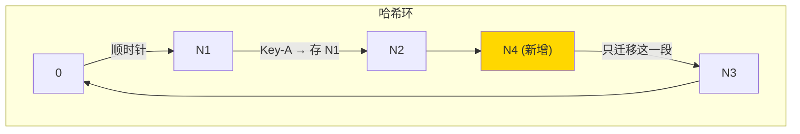

加一个节点 N4，它落在 N2 和 N3 之间 → **只有 N4 和 N3 之间这一小段的 key 需要迁移到 N4**，其他所有数据纹丝不动。

| 操作 | 普通 Hash 取模 | 一致性 Hash |
|------|---------------|------------|
| 加/减一个节点 | **~100% 数据需要迁移** | **只有 ~1/N 的数据需要迁移** |
| 3→4 节点 | 75% key 映射变化 | 只有约 25% key 需要移动 |

### 4.3 虚拟节点——解决数据倾斜

如果真实节点少（比如只有 3 台），它们在环上的分布可能不均匀 → 大量 key 都落到同一个节点 → 热点。

解决办法：给每个真实节点创建多个**虚拟节点**（比如每台创建 150 个虚拟节点），均匀散布在环上。查到虚拟节点后映射回真实节点即可。

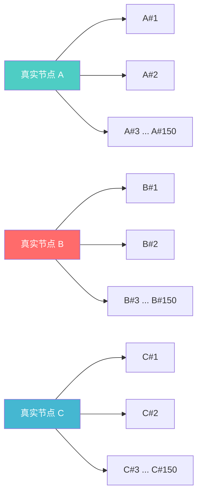

3 台真实节点 × 150 个虚拟节点 = 环上 450 个虚拟节点，数据分布自然均匀。

### 4.4 Redis Cluster 的 Hash Slot 方案

**Redis Cluster 用的不是一致性 Hash，而是 Hash Slot（哈希槽）**。16384 个固定槽位，通过 `CRC16(key) % 16384` 计算每个 Key 属于哪个槽，每个节点负责一部分槽。

这本质上是一致性 Hash 思想的**简化版**——槽数量固定不变，节点增减时只需要把部分槽（及其数据）从一个节点迁移到另一个节点。效果和一致性 Hash 类似，但实现更简单、槽位分配更可控。

| 维度 | 一致性 Hash | Redis Hash Slot |
|------|------------|-----------------|
| 哈希空间 | 0 ~ 2³² 连续环 | 0 ~ 16383 固定槽 |
| 节点映射 | 顺时针找最近节点 | 槽→节点的映射表 |
| 数据倾斜 | 需要虚拟节点 | 手动/自动平衡槽分配 |
| 扩容 | 自动，只迁移 1/N | 需要手动/工具迁移槽 |
| 适用场景 | 通用分布式缓存（如 Memcached） | Redis Cluster 专用 |

> **一句话总结**：普通取模「牵一发动全身」，一致性 Hash「只动邻居」。核心价值是**节点增减时最小化数据迁移量**。

---

## 五、HashMap——Java 面试出现频率最高的数据结构

HashMap 几乎是 Java 面试的必考题，它把数组、链表、红黑树、哈希函数四个概念组合到了一起。理解了它的结构和 put 流程，前面讲的红黑树、hashCode/equals 契约就全部串起来了。

### 5.1 整体结构——数组 + 链表 + 红黑树

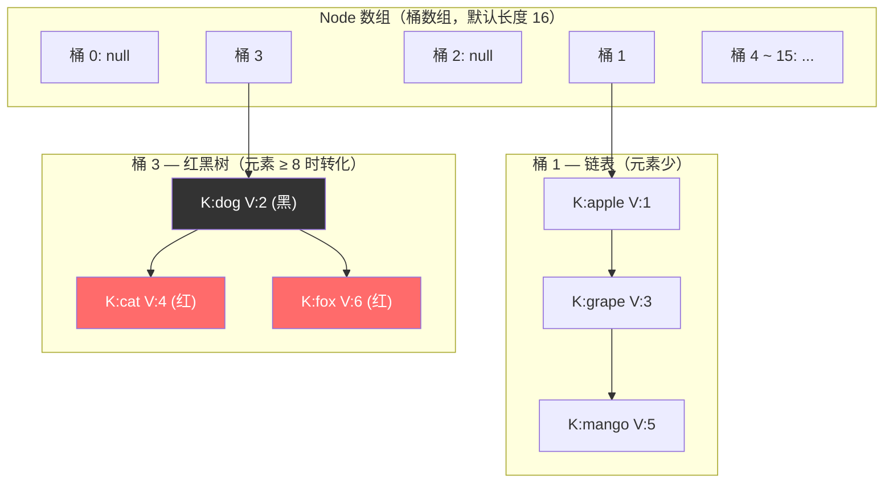

底层是一个 **Node 数组**（也叫桶数组，bucket array），默认初始长度 16。每个桶里存的是一条链表（或红黑树）。当同一个桶里的链表长度 **≥ 8** 且数组长度 **≥ 64** 时，链表会转成红黑树；当红黑树节点数 **≤ 6** 时会退化回链表。

> 后端类比：你可以把它想象成一个有 16 个格子的快递柜。每个包裹（Key-Value）根据收件人手机号的哈希值被分配到某个格子。如果某个格子堆了太多包裹（哈希冲突），就从无序的一堆换成有序排列（红黑树），方便查找。

### 5.2 哈希扰动函数——为什么不直接用 hashCode？

`put(key, value)` 第一步要算 key 应该落在哪个桶。朴素做法是 `hashCode % 数组长度`，但有个问题：如果数组长度是 16，`hashCode % 16` 实际上只看了 hashCode 的**低 4 位**（因为 16 = 2⁴），高位信息完全浪费了 → 冲突率高。

JDK 8 的做法是**把高 16 位异或到低 16 位**（扰动），让高位也参与桶定位：

```java
// HashMap.hash() 源码（JDK 8）
static final int hash(Object key) {
    int h;
    return (key == null) ? 0 : (h = key.hashCode()) ^ (h >>> 16);
    //                          原始hashCode    异或    高16位右移到低16位
}
// 定位桶：(n - 1) & hash   等价于 hash % n（n 是 2 的幂时）
```

为什么用 `(n - 1) & hash` 而不用 `hash % n`？因为 n 是 2 的幂时，`n - 1` 的二进制全是 1（如 16-1 = 1111），按位与（&）的效果和取模一样，但**位运算比取模快得多**。这也是 HashMap 容量必须是 2 的幂的根本原因。

### 5.3 put 流程——面试最爱画的流程图

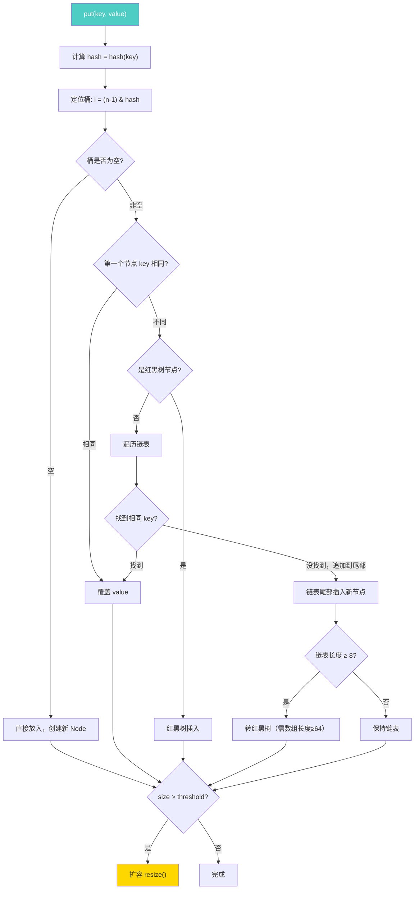

用文字走一遍：① 算 hash → ② 定位桶 → ③ 桶空则直接放 → ④ 桶非空则看第一个节点 key 是否相同（先比 hash 再比 equals），相同就覆盖 → ⑤ 不同则看是链表还是红黑树，分别遍历/树查找 → ⑥ 找到相同 key 就覆盖，没找到就插入尾部 → ⑦ 链表插入后检查长度是否 ≥ 8，是就树化 → ⑧ 最后检查总元素数是否超过阈值（容量 × 负载因子），超过就扩容。

### 5.4 扩容 rehash——容量翻倍的巧妙迁移

当元素数 > 容量 × 负载因子（默认 0.75）时触发扩容，数组长度翻倍（16 → 32 → 64 → ...）。

扩容最关键的问题是：**老桶里的节点该放到新数组的哪个桶？** JDK 8 用了一个巧妙的优化——不需要重新计算 hash % 新容量，只需要看 hash 值**新增的那一位**（即原容量对应的 bit 位）是 0 还是 1：

| hash 新增位 | 新桶位置 | 说明 |
|------------|---------|------|
| 0 | 不动，还在原位 i | 低位没变，位置不变 |
| 1 | 移到 i + 老容量 | 多了高位的 1，位置偏移刚好是老容量 |

举例：老容量 16（10000），桶位 = hash & 1111。新容量 32（100000），桶位 = hash & 11111。多看了一位，这一位是 0 就原地不动，是 1 就搬到 i + 16。**一次按位与就决定去留，不需要重新取模**。

### 5.5 线程不安全——为什么不能多线程用 HashMap？

HashMap 是**非线程安全**的，多线程并发操作会出严重问题：

**JDK 7 的致命 bug——链表成环**：JDK 7 扩容时用头插法迁移链表，两个线程同时扩容可能导致链表形成环形引用 → `get()` 时死循环 → CPU 100%。这是线上真实出过的事故。

**JDK 8 改成了尾插法**，解决了成环问题，但仍然不安全：两个线程同时 put 可能覆盖对方的数据（丢数据）、size 计数不准、扩容时节点丢失等。

**正确做法**：并发场景用 `ConcurrentHashMap`（见 [3.1 并发体系](./01-并发体系.md) 考点 7）。

### 5.6 核心参数速查

| 参数 | 默认值 | 含义 |
|------|--------|------|
| **初始容量** | 16 | 桶数组的初始长度，必须是 2 的幂 |
| **负载因子** | 0.75 | 元素数 / 容量 > 0.75 时触发扩容 |
| **树化阈值** | 8 | 链表长度 ≥ 8 时转红黑树（数组还需 ≥ 64） |
| **退化阈值** | 6 | 红黑树节点 ≤ 6 时退化回链表 |
| **最大容量** | 2³⁰ | 约 10 亿，够用了 |

>> 为什么树化阈值是 8？泊松分布计算显示，负载因子 0.75 时，同一个桶出现 8 个元素的概率约为千万分之六（0.00000006）。换句话说，绝大多数情况下链表就够了，红黑树只是极端情况的兜底。

---

## 六、B+ 树——数据库索引为什么选它

### 6.1 从二叉树到 B+ 树的演进

前面讲了 BST → 红黑树 → 跳表，它们都是在**内存中**工作的数据结构。但数据库的数据量远超内存容量，索引要落在**磁盘**上。磁盘的特点是：**随机 IO 极慢**（寻道 ~10ms），**顺序 IO 还行**。所以数据库索引的核心诉求是：**尽可能少做磁盘 IO**。

红黑树的问题是**太瘦高**——存 1000 万条数据需要约 23 层（log₂10⁷ ≈ 23），每层一次磁盘 IO，23 次磁盘寻道需要约 230ms，太慢了。

B 树（B-Tree）的思路是**把节点撑胖**——每个节点不是存 1 个 key，而是存几百上千个 key，这样同样 1000 万条数据只需要 3-4 层。树从「瘦高」变成「矮胖」，磁盘 IO 次数从 23 次降到 3-4 次。

B+ 树是 B 树的进化版，做了两个关键改动：

### 6.2 B+ 树的结构

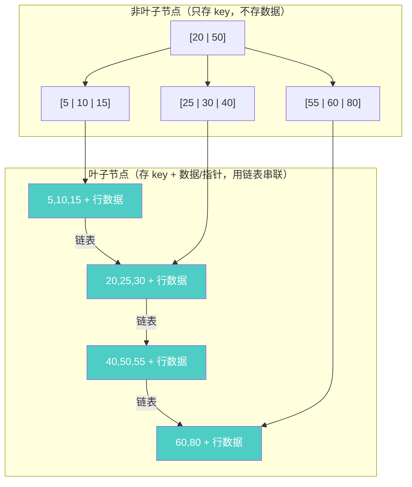

**和 B 树的两个关键区别**：

| 区别 | B 树 | B+ 树 |
|------|------|-------|
| **数据存在哪** | 所有节点都存数据 | **只有叶子节点存数据**，非叶子只存 key |
| **叶子节点** | 互不相连 | **用链表串联** |

这两个改动带来了巨大的实际收益：

**改动 1 的收益**：非叶子节点不存数据 → 一个节点（通常 16KB，即 MySQL 的一个页）能装更多 key → 树更矮 → IO 更少。具体算一下：假设 key 是 bigint（8 字节），指针 6 字节，一个 16KB 页能装 16384 / (8+6) ≈ **1170 个 key**。三层 B+ 树能索引 1170 × 1170 × 叶子节点行数 ≈ **千万级数据，只需要 3 次 IO**。

**改动 2 的收益**：叶子节点用链表串联 → 范围查询（`WHERE age BETWEEN 20 AND 30`）只需找到起始叶子，然后**顺着链表扫**——这是顺序 IO，极快。B 树做范围查询需要反复回到父节点再下来，效率低得多。

### 6.3 B+ 树的查找过程

以查找 key = 30 为例：


从根节点开始，每层做一次**二分查找**定位到下一层的指针，直到叶子节点。3 层树 = 3 次磁盘 IO，实际上根节点和第二层通常被缓存在内存中（InnoDB Buffer Pool），所以真正的磁盘 IO 往往只有 **1-2 次**。

### 6.4 为什么不用红黑树/跳表/Hash 做数据库索引？

| 候选结构 | 致命问题 | 说明 |
|---------|---------|------|
| **红黑树** | 太瘦高 | 二叉结构，1000 万数据需 ~23 层 = 23 次磁盘 IO |
| **跳表** | 层数太多 | 与红黑树类似，且概率性平衡不适合持久化 |
| **Hash 索引** | 不支持范围查询 | `WHERE age > 20` 无法使用，只能精确匹配 |
| **B 树** | 范围查询慢 | 非叶子也存数据 → 节点更胖 → 装的 key 少 → 树更高 |
| **B+ 树** | ✅ 最优选择 | 矮胖 + 叶子链表 = 最少 IO + 高效范围查询 |

> **一句话总结**：数据库索引选 B+ 树的本质原因是**磁盘 IO 是瓶颈**。B+ 树的「矮胖结构」最大限度减少了磁盘访问次数，「叶子链表」让范围查询变成顺序 IO。

---

## 七、常见树结构总览——一张表理清关系

前面分散讲了很多树，这里用一张表把它们的关系和使用场景理清：

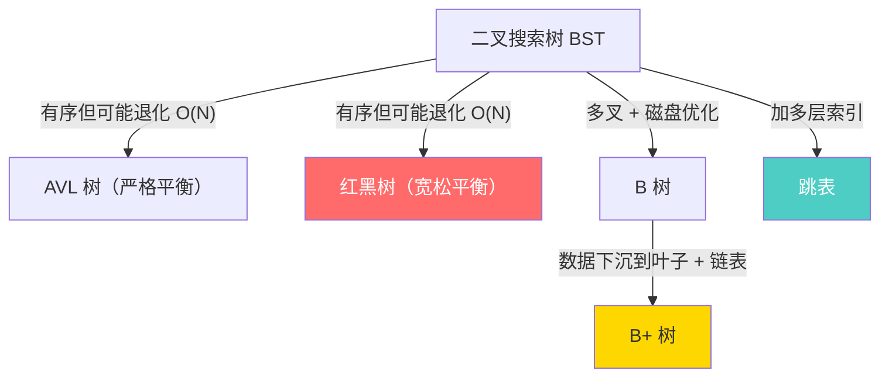

| 树结构 | 核心特点 | 时间复杂度 | 适用场景 | 典型使用 |
|--------|---------|-----------|---------|---------|
| **BST（二叉搜索树）** | 左 < 父 < 右 | O(log N) 平均，O(N) 最坏 | 教学用，实际不直接使用 | 理解其他树的基础 |
| **AVL 树** | 严格平衡（高度差 ≤ 1） | O(log N) 最坏，查找最快 | **读多写少** | 部分数据库索引实现、Windows 内核 |
| **红黑树** | 宽松平衡（黑高相等） | O(log N) 最坏，增删更快 | **读写均衡** | Java TreeMap/HashMap、Linux CFS、Nginx |
| **B 树** | 多叉，所有节点存数据 | O(log N) | 磁盘存储（已被 B+ 树取代） | MongoDB（WiredTiger 的一种模式） |
| **B+ 树** | 多叉，数据仅在叶子 + 叶子链表 | O(log N)，范围查询极快 | **数据库索引** | MySQL InnoDB、PostgreSQL、Oracle |
| **跳表** | 多层索引链表，随机平衡 | O(log N) 期望 | **内存有序集合** | Redis ZSet、LevelDB MemTable |
| **Trie（前缀树）** | 按字符分叉，共享前缀 | O(L)，L 为字符串长度 | **前缀匹配/自动补全** | 路由表、搜索引擎、IP 查找 |
| **堆（Heap）** | 完全二叉树，父 ≥ 子（大顶堆） | 插入/删除 O(log N)，取极值 O(1) | **优先级队列/Top-K** | Java PriorityQueue、定时器、调度 |

> **选型口诀**：内存里读写均衡选**红黑树**，内存里要范围查询选**跳表**，磁盘上选**B+ 树**，只要精确匹配选**Hash**，字符串前缀选**Trie**，取最大最小选**堆**。

---

## 八、MinHash 与 SimHash——文档去重的概率算法

> MinHash 和 SimHash 是两种经典的**近似相似度**算法，本质上和布隆过滤器一样属于「概率数据结构」——用少量的信息损失换取巨大的性能提升。它们的应用场景包括搜索引擎网页去重、爬虫去重、抄袭检测、大模型预训练数据去重等。

### 8.1 MinHash——近似 Jaccard 相似度

MinHash 的数学基础：两个集合 A、B 的 Jaccard 相似度 J(A,B) = |A∩B| / |A∪B|。MinHash 定理证明：随机哈希函数下两个集合最小哈希值相等的概率恰好等于 Jaccard 相似度。

**第一步：为什么要拆成 n-gram？**

直接比较两篇文档是否相似，最朴素的办法是逐字逐句对比——但这样无法处理"局部修改"（转载后改了几个词）。n-gram 的思路是把文档拆成大量重叠的短片段，用**片段集合的重叠程度**衡量文档相似度。即使文档被修改了一部分，未修改的部分仍会产生大量相同的 n-gram。

```
n-gram 示例（以 3-gram 为例，即连续 3 个字符的滑动窗口）：

文档 A = "今天天气真好"

滑动窗口逐字移动，每次取 3 个字符：
  位置 1: "今天天"
  位置 2: "天天气"
  位置 3: "天气真"
  位置 4: "气真好"

A 的 3-gram 集合 = {"今天天", "天天气", "天气真", "气真好"}   ← 共 4 个

文档 B = "今天天气不错"

B 的 3-gram 集合 = {"今天天", "天天气", "天气不", "气不错"}   ← 共 4 个

交集 = {"今天天", "天天气"}                                 ← 2 个相同
并集 = {"今天天", "天天气", "天气真", "气真好", "天气不", "气不错"}  ← 6 个

Jaccard 相似度 = |交集| / |并集| = 2/6 ≈ 0.33

n 的选择：
  n 太小（如 2-gram）→ 太多碰巧相同的片段，相似度虚高
  n 太大（如 10-gram）→ 稍有改动就完全不同，相似度偏低
  实践中通常选 5-gram 或 13-gram（字符级），或 1-3 gram（词级）
```

**第二步：MinHash 签名——用哈希近似 Jaccard**

Jaccard 相似度需要取交集和并集，对 PB 级数据做所有文档两两比较不可行（10 亿文档 × 10 亿文档 = 10^18 次比较）。MinHash 的核心思路是：把每个文档的 n-gram 集合**压缩成一个短签名**（如 128 个数字），通过比较签名来近似 Jaccard 相似度。

```
MinHash 签名计算（数值示例，k=3 个哈希函数，实际用 128 个）：

文档 A 的 3-gram 集合 = {"今天天", "天天气", "天气真", "气真好"}

用 3 个不同的哈希函数分别对每个 n-gram 计算哈希值：

              h1()    h2()    h3()
  "今天天"     12      78      45
  "天天气"     56      23      91
  "天气真"     34      89      67
  "气真好"     78      45      12

h1 取最小值: min(12, 56, 34, 78) = 12
h2 取最小值: min(78, 23, 89, 45) = 23
h3 取最小值: min(45, 91, 67, 12) = 12

A 的 MinHash 签名 = [12, 23, 12]

文档 B 的 3-gram 集合 = {"今天天", "天天气", "天气不", "气不错"}

              h1()    h2()    h3()
  "今天天"     12      78      45     ← 相同的 n-gram，哈希值也相同
  "天天气"     56      23      91     ← 同上
  "天气不"     23      56      34
  "气不错"     89      12      78

h1 取最小值: min(12, 56, 23, 89) = 12  ← 和 A 相同！
h2 取最小值: min(78, 23, 56, 12) = 12  ← 和 A 不同
h3 取最小值: min(45, 91, 34, 78) = 34  ← 和 A 不同

B 的 MinHash 签名 = [12, 12, 34]

比较签名：
  位置 1: A=12, B=12  → 相同 ✓
  位置 2: A=23, B=12  → 不同 ✗
  位置 3: A=12, B=34  → 不同 ✗

签名相似度 = 1/3 ≈ 0.33 ≈ 真实 Jaccard 相似度 0.33 ✓

为什么这能工作？
  MinHash 定理：两个集合在同一个哈希函数下最小值相等的概率
  恰好等于它们的 Jaccard 相似度。k 个哈希函数就是 k 次独立采样，
  k 越大近似越准（实际用 k=128~256，签名比较就很准了）。
```

**第三步：LSH 加速**

即使有了签名，10 亿文档两两比较签名仍然是 O(n²)。LSH 的思路是：只比较"有可能相似"的文档对。

```
LSH（Locality-Sensitive Hashing）加速：

把 128 维签名分成 b 个 band（如 b=16，每个 band r=8 维）
每个 band 内做 hash → 同一个 hash bucket 的文档是候选重复对
只对候选对计算精确相似度

效果：真正相似的文档大概率会在至少一个 band 中落入同一个 bucket，
不相似的文档几乎不会。这样把 O(n²) 的全量比较降到了接近 O(n)。
```

### 8.2 SimHash——海明距离近似

SimHash 是另一种常用的去重算法，原理不同于 MinHash。它把文档映射为一个固定长度（如 64-bit）的指纹，两个指纹的海明距离（不同 bit 数）越小说明文档越相似。

```
SimHash 工作流程：

① 分词 + 加权
   对文档分词，用 TF-IDF（Term Frequency-Inverse Document Frequency，词频-逆文档频率，
     衡量一个词对当前文档的重要程度：在本文档中出现多但在其他文档中少见 = 高权重）给每个词一个权重
   "今天"(0.3)  "天气"(0.5)  "真好"(0.8)

② 每个词计算哈希值（如 64-bit）
   "今天" → 1010 0110 ...（64 位）
   "天气" → 0111 1001 ...（64 位）

③ 加权合并
   每一位：hash 值为 1 → 加权重，为 0 → 减权重
   所有词加权后得到 64 维的向量

④ 二值化
   向量每一位 > 0 → 1，≤ 0 → 0
   得到 64-bit 的 SimHash 指纹

⑤ 比较
   两个文档指纹的海明距离 ≤ 3 → 判定为近似重复
```

### 8.3 MinHash vs SimHash 对比

| 维度 | MinHash | SimHash |
|------|---------|---------|
| 相似度度量 | Jaccard（集合交并比） | 余弦相似度（加权特征） |
| 指纹大小 | 较大（128+ 个 hash 值） | 固定（64-bit 或 128-bit） |
| 适合场景 | 集合比较（n-gram 集合） | 加权特征比较（TF-IDF） |
| 精度 | 高（k 越大越准） | 中等（64-bit 信息有损） |
| 业界使用 | 主流方案（大模型预训练数据去重、搜索引擎） | Google 搜索引擎网页去重 |

### 8.4 应用场景

MinHash 和 SimHash 与布隆过滤器一样，是「概率换性能」思想的典型代表。常见应用场景包括：搜索引擎网页去重（Google 用 SimHash）、爬虫去重（避免重复抓取近似页面）、抄袭/洗稿检测（学术论文查重、新闻去重）、大模型预训练数据去重（Dolma、FineWeb、RedPajama 均使用 MinHash + LSH）。在大模型预训练数据处理中的具体使用方式，详见 [6.8 大模型数据工程](../part6-bigdata/08-大模型数据工程.md) 的去重章节。

---

## 九、HyperLogLog（HLL）——用 12KB 估算亿级基数

### 9.1 什么是基数估计？为什么需要 HLL？

**基数（Cardinality）** 是指一个集合中不同元素的数量。比如网站一天有 1000 万次访问，但其中只有 300 万个不同的用户——这 300 万就是"日活 UV"的基数。

精确去重的朴素方案是维护一个 `HashSet`，把所有元素都存下来再统计大小。问题在于**内存**：

| 方案 | 1 亿 UV | 10 亿 UV | 是否支持精确 |
|------|---------|----------|-------------|
| **HashSet**（存 8 字节 hash） | ~800 MB | ~8 GB | 精确 |
| **HashSet**（存原始 userId 字符串，~32 字节） | ~3.2 GB | ~32 GB | 精确 |
| **HyperLogLog**（标准 16384 桶） | **~12 KB** | **~12 KB** | 近似（误差 ~0.81%） |

注意 HLL 的内存是**固定的**——不管你是 1 万 UV 还是 10 亿 UV，都是 12KB。这种「以固定空间估算任意规模基数」的能力，是 HLL 的核心价值。

> 一句话：**精确去重的空间是 O(n)，HLL 的空间是 O(1)（固定 12KB），代价是 ~1% 的误差。** 对于 UV 统计这种不需要精确到个位的场景，这笔交易非常划算。

### 9.2 核心原理：分桶 + 前导零位计数

HLL 的原理可以拆成三步：**哈希 → 分桶 → 前导零计数**。

#### 第一步：哈希

对每个元素计算一个均匀分布的哈希值（64-bit）。哈希的目的是把原始元素映射为均匀随机的比特串。

#### 第二步：分桶

取哈希值的前 p 位作为桶号，把元素分配到 `2^p` 个桶中的一个。Redis 标准实现用 `p = 14`，即 `2^14 = 16384` 个桶。

#### 第三步：前导零位计数

对哈希值剩余的 `64 - p` 位，统计**前导零的最大长度**（即从最高位开始连续出现了多少个 0），记为 `ρ`。每个桶维护到目前为止看到的最大 `ρ` 值。

**数值示例**：

```
假设 p = 4（2^4 = 16 个桶），哈希值为 32-bit

元素 A 的 hash = 0010 1101 0011 1010 ...
                  │││
                  ││└─ 后 28 位: 101 0011 1010 ...
                  │└── 用来计算前导零 → ρ = 2（前面有 2 个 0）
                  │     实际看的是去掉前 4 位后的剩余部分的前导零
                  └── 前 4 位: 0010 → 桶号 = 2

桶 2 记录: max_rho = max(旧值, 2)

元素 B 的 hash = 0010 0001 1110 0101 ...
                 前 4 位 = 0010 → 桶号 = 2（同一个桶）
                 后 28 位 = 0001 1110 ... → ρ = 3（3 个前导零）

桶 2 更新: max_rho = max(2, 3) = 3
```

#### 直观类比：抛硬币

把哈希值的每一位看作一次抛硬币——0 是正面，1 是反面。**「前导零的长度」= 连续抛出正面的次数**。

直觉告诉我们：如果做了 N 次实验（N 个元素），那么「连续正面最长次数」大约是 `log₂(N)`。反过来说，如果我们观测到最长连续正面 k 次，就可以估算 `N ≈ 2^k`。

这就是 HLL 的核心思想——**用前导零的最大长度来估算每个桶的基数，再综合所有桶得出总体估计**。

#### 调和平均 vs 算术平均

每个桶估算出一个 `2^ρ` 值后，需要把它们综合起来。直觉上取算术平均即可，但算术平均会被极端值（某个桶恰好碰到极长前导零）严重拉高。HLL 使用**调和平均数**：

```
算术平均:  ā = (1/m) × Σ 2^ρᵢ
估计值:    n̂ = α × m × ā          ← 极端值会暴涨

调和平均:  HM = m / Σ(1 / 2^ρᵢ)
估计值:    n̂ = α × m² × HM        ← 对极端值更鲁棒
```

其中 `α` 是偏差修正常数（`α ≈ 0.7213 / (1 + 1.079/m)`）。

调和平均的优势在于：当某个 `ρᵢ` 很大时，`1/2^ρᵢ` 会变得极小，不会像算术平均那样被单个极端值主导。**这让估计结果更稳定**。

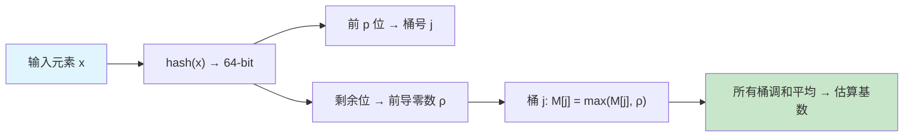

### 9.3 误差率公式

HLL 的标准误差公式为：

```
标准误差 ≈ 1.04 / √m
```

其中 `m = 2^p` 是桶的数量。

| 桶数 m | p | 标准误差 | 内存 |
|--------|---|---------|------|
| 1024 | 10 | ~3.25% | ~6 KB |
| 4096 | 12 | ~1.63% | ~8 KB |
| **16384** | **14** | **~0.81%** | **~12 KB** |
| 65536 | 16 | ~0.41% | ~16 KB |

Redis 使用 `p = 14`（16384 个桶，每桶 6 bit），总内存约 `16384 × 6 / 8 = 12288 字节 ≈ 12KB`，标准误差约 0.81%。这个精度对 UV 统计完全够用。

> 面试一句话：**HLL 的误差只和桶数有关，和数据量无关。16384 个桶 → 0.81% 误差 → 12KB 固定空间。**

### 9.4 稀疏 / 稠密表示切换

当数据量很少时（比如只有几百个元素），用完整的 16384 个桶（每个 6 bit）是浪费的——大部分桶都是 0。HLL 的工程实现引入了**稀疏表示**：

| 表示方式 | 适用场景 | 存储方式 | 内存 |
|---------|---------|---------|------|
| **稀疏表示** | 基数较小（通常 < 2^p × 某阈值） | 只存非零桶的 `(桶号, ρ值)` 对，用变长编码压缩 | 远小于 12KB |
| **稠密表示** | 基数较大 | 固定数组，每桶 6 bit | 固定 12KB |

**切换机制**：随着元素不断加入，稀疏表示的体积逐渐增长。当稀疏表示的内存超过稠密表示（12KB）时，自动转换为稠密表示。此后一直保持稠密模式。

这个优化使得 HLL 在数据量从 0 增长的过程中，不会一开始就浪费 12KB，而是按需扩展。Redis 和 Google HLL++ 都实现了这一机制。

### 9.5 HyperLogLog++ 改进（Google 论文）

Google 在 2013 年发表了 [HyperLogLog in Practice](https://research.google/pubs/pub40671/) 论文，提出了 **HLL++**，主要改进包括：

| 改进点 | 标准 HLL | HLL++ |
|--------|---------|-------|
| **小基数偏差修正** | 小基数时估计偏差大 | 引入经验修正表，对 `n̂ < 5m` 的情况做线性插值修正 |
| **稀疏模式** | 基本稀疏表示 | 更高效的编码（用 `encode pair` + `runs`），延迟切换到稠密 |
| **64-bit 哈希** | 32-bit 哈希，基数上限 ~10⁹ | 64-bit 哈希，支持到 ~10¹⁸ 基数 |
| **动态切换阈值** | 固定阈值 | 根据稀疏表示实际大小动态决定何时切换 |

HLL++ 是目前工程实践中最常用的 HLL 变体。Presto/Trino 的 `approx_distinct`、Flink 的 `APPROX_COUNT_DISTINCT` 底层均基于 HLL++ 实现。

### 9.6 应用场景

| 场景 | 工具 / 命令 | 说明 |
|------|------------|------|
| **Redis UV 统计** | `PFADD` / `PFCOUNT` / `PFMERGE` | 底层就是 HLL，12KB 固定空间 |
| **Flink 实时去重** | `APPROX_COUNT_DISTINCT(user_id)` | SQL 内置函数，基于 HLL++ |
| **Presto/Trino** | `approx_distinct(column)` | 查询引擎层面近似去重 |
| **ClickHouse** | `uniq()` / `uniqHLL12()` / `uniqCombined()` | 多种精度可选 |
| **Spark** | `approxCountDistinct()` / `HyperLogLogPlus` | 大规模离线 UV |
| **大数据 UV** | 日志分析、实时大屏 | 亿级 UV 用 12KB 估算 |

**Redis 命令示例**：

```bash
# 记录用户访问（每来一个 userId 执行一次）
PFADD page:uv:20240101 "user:1001"
PFADD page:uv:20240101 "user:1002"
PFADD page:uv:20240101 "user:1003"

# 查询近似 UV
PFCOUNT page:uv:20240101
# (integer) 3

# 合并多天 UV（如计算月活）
PFADD page:uv:20240102 "user:1001"
PFADD page:uv:20240102 "user:1004"
PFMERGE page:uv:202401 page:uv:20240101 page:uv:20240102
PFCOUNT page:uv:202401
# (integer) 4  （user:1001 只算一次）
```

**Flink SQL 示例**：

```sql
-- 实时计算每小时的近似 UV（误差约 1%）
SELECT
    window_start,
    window_end,
    APPROX_COUNT_DISTINCT(user_id) AS approx_uv
FROM TABLE(
    TUMBLE(TABLE access_log, DESCRIPTOR(event_time), INTERVAL '1' HOUR)
)
GROUP BY window_start, window_end;

-- 对比精确 UV（需要维护大 State，成本高）
-- COUNT(DISTINCT user_id)  ← 1000 万 UV 需要 ~800MB State
```

### 9.7 对比：精确去重 vs Bloom Filter vs HyperLogLog

| 维度 | MapState / HashSet | Bloom Filter | HyperLogLog |
|------|-------------------|--------------|-------------|
| **解决的问题** | 精确计数 + 判断存在 | 判断元素是否存在 | 估算不同元素的数量（基数） |
| **空间复杂度** | O(n) | O(n)（但常数极小） | **O(1)（固定 12KB）** |
| **能否判断单个元素是否存在** | 能（精确） | 能（可能有假阳性） | **不能**（只给总数，不存元素） |
| **能否精确计数** | 能 | 不能（只有是/否） | 不能（近似 ±0.81%） |
| **误差方向** | 无误差 | 只有假阳性（说存在可能不存在） | 双向误差（可能偏高或偏低） |
| **支持删除** | 支持 | 标准 BF 不支持（Counting BF 支持） | 不支持 |
| **支持合并** | 需要全量合并 | 支持（OR 运算） | **支持（PFMERGE）** |
| **典型内存（1 亿元素）** | ~800 MB+ | ~114 MB（1% 误判） | **~12 KB** |

> 面试一句话：**Bloom Filter 回答「这个元素存在吗」，HLL 回答「总共有多少个不同元素」。两者都省内存，但解决的问题完全不同，不能互相替代。**

---

## 十、Count-Min Sketch（CMS）——用固定空间估算频率

### 10.1 什么问题？

HyperLogLog 解决的是「有多少个不同元素」的基数估计问题。但有时候我们关心的是另一个问题：**某个元素出现了多少次？**

典型场景：
- **Top-K 热点 key**：线上 Redis 哪些 key 访问最频繁？需要统计每个 key 的访问次数
- **热点检测**：DDoS 防护中找出访问量异常飙升的 IP
- **流量分析**：统计每个 API 的调用频次，发现限流对象

精确方案是维护一个 `HashMap<key, count>`，但 key 的数量可能上亿，内存扛不住。**Count-Min Sketch** 用固定大小的二维计数器数组来**近似估算频率**。

### 10.2 原理

CMS 的结构非常简洁：一个 `d × w` 的二维计数器数组，配合 `d` 个独立的哈希函数。

```
结构示意（d=3, w=5）:

         列 →  0   1   2   3   4
哈希函数 h1 →  [0,  0,  0,  0,  0]
哈希函数 h2 →  [0,  0,  0,  0,  0]
哈希函数 h3 →  [0,  0,  0,  0,  0]

插入元素 "apple"（计 1 次）:
  h1("apple") = 2 → 第1行第2列 +1
  h2("apple") = 0 → 第2行第0列 +1
  h3("apple") = 4 → 第3行第4列 +1

         列 →  0   1   2   3   4
哈希函数 h1 →  [0,  0,  1,  0,  0]
哈希函数 h2 →  [1,  0,  0,  0,  0]
哈希函数 h3 →  [0,  0,  0,  0,  1]

查询 "apple" 的估算频率:
  h1 → count[1][2] = 1
  h2 → count[2][0] = 1
  h3 → count[3][4] = 1
  取最小值 → 估计频率 = 1  ✓
```

**为什么取最小值？** 因为哈希冲突只会让计数**偏高**（别的元素也往同一个格子里加了计数），永远不会偏低。取 `d` 个哈希结果中的最小值，就是取受冲突影响最小的那个。

> 核心特性：**Count-Min Sketch 只会高估，不会低估**——这和 Bloom Filter 只有假阳性、没有假阴性是完全对称的。

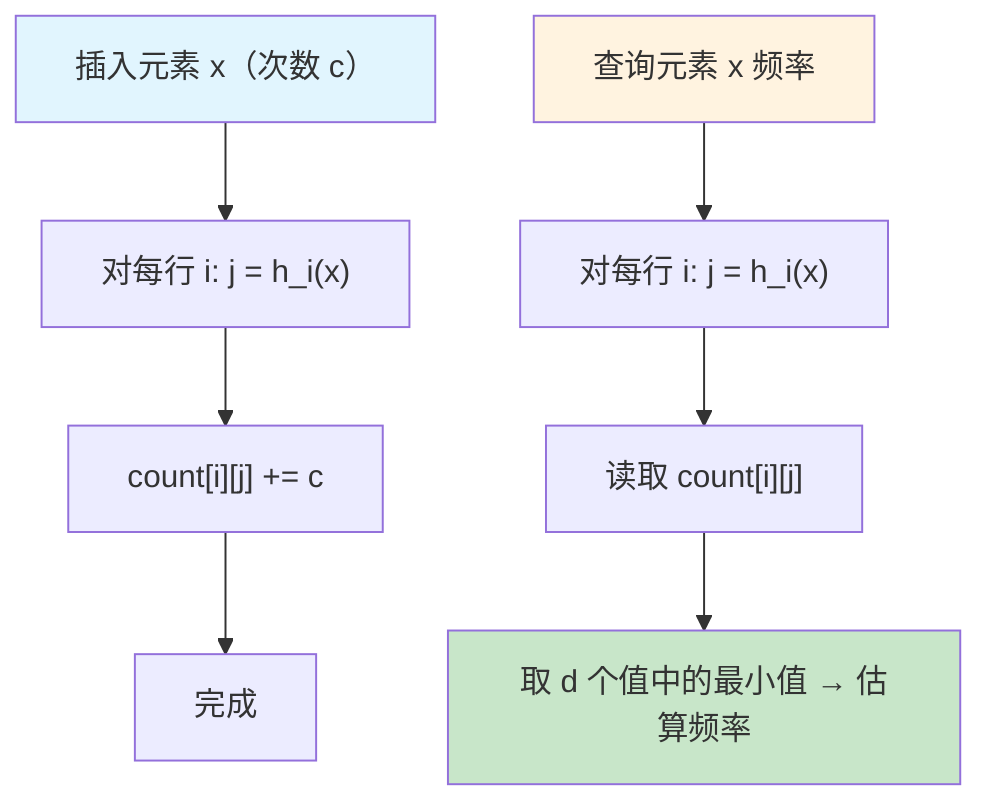

### 10.3 误差保证

CMS 提供 **ε-δ 近似保证**：

> 以至少 `1 - δ` 的概率，频率估计值 `ĉ` 与真实值 `f` 的误差不超过 `ε × N`（N 是所有元素的总频率）。

即：`Pr[ĉ - f > εN] ≤ δ`

参数选择公式：
- **列数 w** = ⌈e / ε⌉ = ⌈2.718 / ε⌉
- **行数 d** = ⌈ln(1/δ)⌉

**实际计算举例**：

| 误差参数 ε | 置信度 1-δ | 列数 w | 行数 d | 总计数器数 | 内存（每计数器 4 字节） |
|-----------|-----------|--------|--------|-----------|---------------------|
| 0.01（误差 ≤ 1% × N） | 99%（δ=0.01） | 272 | 5 | 1360 | ~5.3 KB |
| 0.001（误差 ≤ 0.1% × N） | 99% | 2719 | 5 | 13595 | ~53 KB |
| 0.01 | 99.9%（δ=0.001） | 272 | 7 | 1904 | ~7.4 KB |

注意：误差是相对于**总频率 N** 的，不是相对单个元素频率。如果某个元素真实频率很小但 N 很大，相对误差可能很高。所以 CMS 适合**高频元素**（Top-K）的估算，不适合低频长尾。

### 10.4 应用场景

| 场景 | 怎么用 | 为什么用 CMS |
|------|--------|-------------|
| **Top-K 热点 key 检测** | 用 CMS 统计 key 频率 + 最小堆维护 Top-K | 百亿级 key 中找热点，精确 HashMap 存不下 |
| **DDoS / 异常流量检测** | 实时统计 IP/请求频率，超阈值告警 | 固定内存，高吞吐写入 |
| **数据库查询优化** | PostgreSQL / Spark 用 CMS 估算列值频率分布 | 生成统计信息辅助查询计划选择 |
| **限流 / 配额管理** | 近似统计 API 调用次数 | 不需要精确计数，节省内存 |
| **流式计算频繁项集** | Flink/Storm 中维护 CMS 做 Heavy Hitters | 窗口内热点元素追踪 |

**Java 示例（使用 Guava / StreamLib）**：

```java
// 使用 Apache DataSketches（推荐）
import org.apache.datasketches.theta.Sketch;

// Count-Min Sketch 简化实现思路
public class CountMinSketch {
    private int d;          // 哈希函数数量（行数）
    private int w;          // 每行列数
    private int[][] table;  // d × w 计数器数组
    private HashFunction[] hashes;  // d 个哈希函数

    public void add(String key, int count) {
        for (int i = 0; i < d; i++) {
            int j = hashes[i].hash(key) % w;
            table[i][j] += count;  // 只加不减
        }
    }

    public int estimate(String key) {
        int min = Integer.MAX_VALUE;
        for (int i = 0; i < d; i++) {
            int j = hashes[i].hash(key) % w;
            min = Math.min(min, table[i][j]);  // 取最小值
        }
        return min;
    }
}
```

**Redis 中的使用**（RedisBloom 模块）：

```bash
# 创建一个 CMS
CMS.INITBYPROB cm 0.01 0.001    # ε=0.01, δ=0.001

# 增加计数
CMS.INCRBY cm "hot_key_1" 1
CMS.INCRBY cm "hot_key_1" 1
CMS.INCRBY cm "hot_key_2" 1

# 查询估算频率
CMS.QUERY cm "hot_key_1"
# (integer) 2  （精确或高估）
```

### 10.5 vs HLL vs Bloom Filter 对比

| 维度 | Bloom Filter | HyperLogLog | Count-Min Sketch |
|------|-------------|-------------|-----------------|
| **回答的问题** | 元素 x 存在吗？ | 有多少个不同元素？ | 元素 x 出现了多少次？ |
| **输出类型** | 布尔（是/否） | 一个数字（基数估计） | 一个数字（频率估计） |
| **误差方向** | 只有假阳性（可能误报存在） | 双向偏差 | **只会高估** |
| **空间** | O(n)，依赖误判率 | **固定 ~12KB** | 固定（依赖 ε、δ） |
| **支持合并** | 支持（OR） | 支持（PFMERGE） | 支持（对应位置相加） |
| **支持删除** | 标准 BF 不支持 | 不支持 | 支持 Count-Min Sketch 的变体（Counting Sketch 支持减法） |
| **典型应用** | 缓存穿透、去重 | UV 统计、基数去重 | Top-K 热点、频率统计 |

> 面试一句话：**Bloom Filter 判存在、HLL 算基数、CMS 估频率——三个概率型数据结构各管一件事，都是用「近似」换「固定空间」。选择哪个取决于你的问题：要布尔答案用 BF，要基数用 HLL，要频率用 CMS。**

---

## 本篇小结

| 数据结构 | 核心特征 | 时间复杂度 | 典型使用 |
|---------|---------|-----------|---------|
| **跳表** | 多层索引链表，随机化平衡 | 查找/插入/删除 O(log N) 期望 | Redis ZSet、LevelDB、ConcurrentSkipListMap |
| **红黑树** | 自平衡 BST，染色+旋转 | 查找/插入/删除 O(log N) 最坏 | Java TreeMap/HashMap、Linux CFS、Nginx |
| **布隆过滤器** | 概率型存在性判断，极省空间 | 插入/查询 O(k)，k 为哈希函数数 | 缓存穿透、URL 去重、HBase/Cassandra |
| **一致性 Hash** | 哈希环，最小化迁移 | 查找 O(log N)（虚拟节点排序） | 分布式缓存分片、负载均衡 |
| **HashMap** | 数组+链表+红黑树，哈希扰动 | 查找/插入 O(1) 平均，O(log N) 最坏 | Java HashMap/LinkedHashMap、几乎所有业务代码 |
| **B+ 树** | 多叉矮胖树，叶子链表串联 | 查找 O(log N)，范围查询极快 | MySQL InnoDB、PostgreSQL、Oracle 索引 |
| **MinHash** | n-gram 集合 → 多哈希最小值签名 | 签名计算 O(n·k)，LSH 近邻 ≈ O(n) | 大模型数据去重、搜索引擎、抄袭检测 |
| **SimHash** | TF-IDF 加权 → 64-bit 指纹 | 指纹计算 O(n)，海明比较 O(1) | Google 网页去重、新闻去重 |
| **HyperLogLog** | 分桶 + 前导零计数，调和平均 | 插入 O(1)，估算 O(1)，合并 O(m) | Redis PFADD、Flink APPROX_COUNT_DISTINCT、UV 统计 |
| **Count-Min Sketch** | d×w 计数器数组，多哈希取最小值 | 插入 O(d)，查询 O(d)，合并 O(d×w) | Top-K 热点 key、流量分析、数据库统计 |

> 这些结构的共同点：**都是在某个维度上用「巧妙的空间/概率换取」来解决朴素方案的性能瓶颈**。跳表用空间（多层指针）换时间，布隆过滤器用误判率换空间，红黑树用颜色标记换平衡，一致性 Hash 用虚拟节点换均匀性，HashMap 用数组随机访问 + 链表/树解决冲突，B+ 树用多叉矮胖结构换最少磁盘 IO，MinHash 用哈希签名换集合比较效率，SimHash 用定长指纹换文档比较效率，HyperLogLog 用固定 12KB 空间 + ~1% 误差换亿级基数估算能力，Count-Min Sketch 用固定二维计数器 + 只高估不低估换频率估算能力。

---

**相关章节**：

- [3.8 缓存与 Redis](./08-缓存与Redis.md)——跳表/红黑树/布隆过滤器的 Redis 应用场景
- [3.7 高可用架构](./07-高可用架构.md)——一致性 Hash 在负载均衡中的应用
- [3.9 数据库 MySQL](./09-数据库MySQL.md)——B+ 树索引、一致性 Hash 在分库分表中的应用
- [3.1 并发体系](./01-并发体系.md)——ConcurrentHashMap 演进、ConcurrentSkipListMap 等并发数据结构
- [3.4 类型系统](./04-类型系统.md)——hashCode/equals 契约、为什么重写 equals 必须重写 hashCode
- [6.8 大模型数据工程](../part6-bigdata/08-大模型数据工程.md)——MinHash + LSH 在预训练数据去重中的应用
- [6.x Flink 大 State 专题](../part6-bigdata/xx-flink-state.md)——HyperLogLog / Count-Min Sketch 在流计算中的 State 优化实践

---

## 十一、LSM-Tree 与 SST 文件——写优化存储引擎的通用原理

> **为什么放在这里**：LSM-Tree 是 RocksDB（Flink State Backend）、Doris BE、HBase、Cassandra、LevelDB 等多个系统的底层存储引擎原理。书中 Flink、Doris 章节都会引用这个概念，统一在此讲清楚，避免重复。

### 11.1 核心问题：为什么需要 LSM-Tree？

传统 B+ 树（MySQL InnoDB）的写入是**随机写**——每次写入都要找到对应的叶子节点并原地修改，磁盘随机写性能极差（HDD 约 100~200 IOPS，SSD 约 10K~100K IOPS）。

LSM-Tree（Log-Structured Merge-Tree）的核心思路是：**把随机写转化为顺序写**。

```
B+ 树写入：
  写 key=100 → 找到磁盘上对应的 page → 原地修改 → 随机写磁盘
  写 key=500 → 找到另一个 page → 原地修改 → 随机写磁盘
  → 每次写都是随机 I/O，HDD 上极慢

LSM-Tree 写入：
  写 key=100 → 追加到内存 MemTable
  写 key=500 → 追加到内存 MemTable
  写 key=200 → 追加到内存 MemTable
  → MemTable 写满 → 整体顺序刷盘为一个 SST 文件
  → 磁盘写入全部是顺序 I/O，比随机写快 10~100 倍
```

**代价**：写入快了，但读取变慢（需要查多个层次），且存在写放大、读放大、空间放大三种问题。

### 11.2 SST 文件是什么

SST（Sorted String Table，有序字符串表）是 LSM-Tree 的磁盘存储单元。

```
SST 文件的内部结构：

┌─────────────────────────────────────────┐
│  Data Blocks（数据块）                   │
│  按 key 有序排列的 key-value 对           │
│  [key1:val1][key2:val2]...[keyN:valN]   │
├─────────────────────────────────────────┤
│  Index Block（索引块）                   │
│  每个 Data Block 的最大 key + 偏移量      │
│  用于二分查找定位目标 Data Block          │
├─────────────────────────────────────────┤
│  Bloom Filter（布隆过滤器）               │
│  快速判断"某个 key 是否在这个文件里"       │
│  命中率 ~99%，避免无效的磁盘读取           │
├─────────────────────────────────────────┤
│  Footer（元数据）                        │
│  Index Block 和 Bloom Filter 的偏移量    │
└─────────────────────────────────────────┘

关键特性：
  ① 不可变（Immutable）：SST 文件一旦写入就不再修改，只能被 Compaction 合并后删除
  ② 有序：文件内部 key 有序，支持二分查找和范围扫描
  ③ 分层：多个 SST 文件按层（L0/L1/L2...）组织，层间有序性不同
```

**"分层"怎么理解？——单个文件内部 vs 多个文件之间**

上面的结构图描述的是**一个 SST 文件内部**的组织方式（Data Block + Index Block + Bloom Filter）。而"分层"是**多个 SST 文件之间**的组织方式——这是两个不同维度：

```
维度 1：单个 SST 文件内部（微观）
  ┌─────────────────────────┐
  │ Data Blocks（有序 KV 对）│
  │ Index Block（索引）      │
  │ Bloom Filter（快速判存） │
  │ Footer（元数据）         │
  └─────────────────────────┘
  → 这是一个"文件格式"问题，类似 .parquet 文件的列组织方式

维度 2：多个 SST 文件的分层组织（宏观）
  ┌─────────────────────────────────────────────────────────────┐
  │ L0 层：[sst-1] [sst-2] [sst-3] [sst-4]                     │
  │   特点：每个文件是一次 MemTable flush 的产物                  │
  │   文件之间 key 范围可能重叠（因为各 MemTable 独立 flush）      │
  │   读取时必须查所有 L0 文件（不知道 key 在哪个文件里）          │
  ├─────────────────────────────────────────────────────────────┤
  │ L1 层：[sst-5] [sst-6] [sst-7]                             │
  │   特点：由 L0 Compaction 合并而来                            │
  │   文件之间 key 范围不重叠（全局有序）                         │
  │   读取时可以二分查找定位到唯一的文件                          │
  │   目标大小：256MB                                           │
  ├─────────────────────────────────────────────────────────────┤
  │ L2 层：[sst-8] [sst-9] [sst-10] [sst-11] [sst-12]         │
  │   特点：由 L1 Compaction 合并而来                            │
  │   文件之间 key 范围不重叠                                    │
  │   目标大小：2.5GB（L1 的 10 倍）                             │
  ├─────────────────────────────────────────────────────────────┤
  │ L3 层：目标大小 25GB（L2 的 10 倍）                          │
  │ L4 层：目标大小 250GB ...                                   │
  └─────────────────────────────────────────────────────────────┘
  → 这是一个"文件管理"问题，类似 Git 的 pack 文件分代管理
```

**为什么要分层？** 如果所有 SST 文件都平铺在一起（不分层），读取一个 key 需要查遍所有文件——文件越多越慢。分层后：

```
不分层（所有文件平铺）：
  读 key=X → 查 sst-1 → 查 sst-2 → ... → 查 sst-100
  → 最坏查 100 个文件，读放大极高

分层后：
  读 key=X → 查 L0 的 4 个文件（必须全查，因为 L0 内 key 可能重叠）
           → 查 L1 的 1 个文件（二分定位，因为 L1 内 key 不重叠）
           → 查 L2 的 1 个文件（同理）
           → 查 L3 的 1 个文件（同理）
  → 最坏查 4 + 1 + 1 + 1 = 7 个文件，读放大大幅降低
```

**L0 为什么特殊？** L0 是 MemTable 直接 flush 的产物，每个 MemTable 包含的 key 范围是随机的（取决于那段时间写入了什么数据），所以 L0 的多个文件之间 key 范围会重叠。从 L1 开始，Compaction 会把重叠的文件合并排序，保证同一层内文件之间 key 不重叠——这就是为什么 L0 读取最慢（必须全查），L1+ 读取快（可以二分定位）。

**Compaction 的本质就是"把 L0 的无序变成 L1+ 的有序"**——代价是写放大（数据被反复读写搬运），收益是读放大降低（每层只查一个文件）。

**SST 的 key 由谁来定？**

SST 本身不关心 key 的语义，它只负责"给我一堆 KV 对，我按 key 排好序存起来"。key 的含义完全由上层系统定义：

```
使用方          key 的构成                          value
──────────────────────────────────────────────────────────────────
RocksDB 裸用    任意字节串（用户自定义）              任意字节串

Flink State     keyGroup + 业务key + state名称       State值的序列化字节
（RocksDB后端）  + namespace 的字节拼接
                例：[group=42]["user_001"]["click-count"][VoidNS]  → [Long:158]

HBase           RowKey + ColumnFamily                单元格的值
（HFile=SST）   + Qualifier + Timestamp + Type
                例：["user_001"+"behavior"+"click"+时间戳+Put]    → JSON字符串

Doris BE        ORDER BY 列的值（建表时指定）         其余列的值
（Segment文件）  例：[dt="2024-01-01"][user_id=10001]             → [city,amount,...]
```

**如果你用 RocksDB 存"一段段落（大 string）"，key 怎么设计？**

```
场景：存文章段落，value 是一大段文本内容

方案 1：自增 ID（最简单）
  key = "para_000001", "para_000002" ...
  → 按插入顺序排列，但无法按文章查询

方案 2：业务语义复合 key（最推荐）
  key = "article_001:para_003"（文章ID + 段落序号）
  → 同一篇文章的段落在 SST 中物理相邻
  → 查"文章001的所有段落"：scan("article_001:", "article_001:~") 顺序读，极快

方案 3：内容 hash（去重场景）
  key = SHA256(段落内容)
  → 相同内容只存一份，天然去重
  → 但 hash 值无序，无法范围查询

方案 4：时间戳前缀（时序场景）
  key = "20240101_120000_para_001"
  → 按时间有序，方便查某段时间内的段落
```

**key 设计的核心原则**：SST 内部按 key 字节序排列，相关数据的 key 越相近，物理存储越相邻，范围查询越快。这和 MySQL 主键设计原则完全一致——UUID 主键导致随机插入和慢范围查询，自增 ID 或有序复合 key 则相反。

### 11.3 完整写入流程：MemTable → SST → Compaction

```
写入路径（全部是顺序写，极快）：

用户写入 key=X
    │
    ▼
① WAL（Write-Ahead Log）
   先顺序追加到 WAL 文件（防止 MemTable 数据丢失）
    │
    ▼
② MemTable（内存，跳表结构）
   数据写入内存跳表，按 key 有序
   同时支持快速读取（O(log N)）
    │
    ▼（MemTable 写满，默认 64MB）
③ Immutable MemTable
   当前 MemTable 变为只读，新写入开一个新 MemTable
    │
    ▼（后台线程 flush）
④ L0 层 SST 文件（磁盘）
   Immutable MemTable 顺序写入磁盘，生成一个 SST 文件
   L0 层的多个 SST 文件之间 key 范围可能重叠（因为每个 MemTable 独立 flush）
    │
    ▼（L0 文件数达阈值，默认 4 个）
⑤ Compaction：L0 → L1
   读取 L0 的所有文件 + L1 中 key 范围重叠的文件
   合并排序，写入 L1（L1 层文件之间 key 不重叠）
    │
    ▼（L1 总大小超过目标，默认 256MB）
⑥ Compaction：L1 → L2 → ... → LN
   每层比上一层大 10 倍（L1=256MB, L2=2.5GB, L3=25GB...）
   数据逐层向下 Compaction，最终稳定在最深层
```

### 11.4 读取流程：为什么比 B+ 树慢

```
读取 key=X 的路径：

① 查 MemTable（内存跳表，O(log N)）
   → 找到，直接返回（最新数据）

② 查 Immutable MemTable（如果存在）
   → 找到，返回

③ 查 L0 层所有 SST 文件（L0 文件间 key 可能重叠，必须全查）
   → 每个文件先查 Bloom Filter（O(1)，~99% 准确）
   → Bloom Filter 说"可能有" → 读 Index Block → 定位 Data Block → 读数据
   → Bloom Filter 说"肯定没有" → 跳过这个文件

④ 查 L1、L2...LN 层（每层最多查一个文件，因为层内 key 不重叠）
   → 二分查找定位目标 SST 文件 → 查 Bloom Filter → 读数据

最坏情况：key 不存在，需要查遍所有层的所有文件
→ 读放大 = 需要读取的 SST 文件数（Bloom Filter 大幅缓解）
```

### 11.5 三种放大效应

LSM-Tree 用写入性能换来了三种代价：

| 放大类型 | 含义 | 典型倍数 | 缓解手段 |
|---------|------|---------|---------|
| **写放大（Write Amplification）** | 用户写 1 字节，实际磁盘写 N 字节（Compaction 反复读写） | 10~30× | 减少 Compaction 层数、调大 L1 目标大小 |
| **读放大（Read Amplification）** | 读 1 条数据，需要查 N 个文件 | 最坏 = 层数 × 每层文件数 | Bloom Filter、Block Cache 缓存热点 |
| **空间放大（Space Amplification）** | 同一个 key 的旧版本在 Compaction 前同时存在多份 | 1.1~2× | 加快 Compaction 频率、Full Compaction |

```
写放大的直觉理解：
  一条数据从 L0 被 Compaction 到 L1，再到 L2，再到 L3...
  每经过一层就被读一次、写一次
  6 层结构 → 这条数据被写磁盘约 6 次
  加上 Compaction 时需要读取同层其他文件 → 实际写放大 10~30 倍

空间放大的直觉理解：
  key=X 被更新了 3 次：v1 → v2 → v3
  v1 在 L3，v2 在 L2，v3 在 MemTable
  Compaction 完成前，v1 和 v2 都还在磁盘上占空间
  → 实际存储量 > 逻辑数据量
```

### 11.6 各系统的 LSM-Tree 实现对比

| 系统 | MemTable 结构 | 磁盘文件名 | Compaction 策略 | 特殊优化 |
|------|-------------|-----------|----------------|---------|
| **RocksDB**（Flink/TiKV） | 跳表 | SST（.sst） | Level / Universal | Column Family、Bloom Filter per key |
| **LevelDB**（RocksDB 前身） | 跳表 | SST（.ldb） | Level Compaction | 无 Column Family |
| **HBase** | MemStore（跳表） | HFile | Minor/Major Compaction | HDFS 存储，Region 分片 |
| **Cassandra** | Memtable | SSTable（.db） | Size-Tiered / Leveled | 无中心节点，一致性 Hash 分片 |
| **Doris BE** | MemTable | Segment 文件 | Cumulative / Base Compaction | 列式存储，向量化执行 |

> **Doris 的 Segment 文件**：Doris BE 的存储引擎（Rowset/Segment）借鉴了 LSM-Tree 思想——新数据写入内存 MemTable，flush 后生成 Segment 文件（类似 SST），多个 Segment 通过 Compaction 合并。但 Doris 是列式存储，Segment 内部按列组织（而非 RocksDB 的行式 key-value），并且有 Cumulative Compaction（合并小 Segment）和 Base Compaction（合并大 Segment）两种策略。

### 11.7 Block Cache 与 MemTable 的内存分工

这是理解 RocksDB 性能调优的关键：

```
RocksDB 的两块核心内存：

┌─────────────────────────────────────────────────────┐
│  MemTable（写缓冲区）                                 │
│  大小：write_buffer_size × max_write_buffer_number   │
│  作用：缓冲写入，积累到阈值后顺序刷盘                  │
│  影响：写性能、Compaction 频率                        │
│  类比：工厂的生产线缓冲区，攒够一批再出货              │
├─────────────────────────────────────────────────────┤
│  Block Cache（读缓存）                               │
│  大小：block_cache_size                              │
│  作用：缓存热点 SST 数据块，避免重复磁盘读取           │
│  影响：读性能（Cache 命中率决定延迟）                  │
│  类比：工厂的成品仓库，常用商品放在近处快速取用         │
└─────────────────────────────────────────────────────┘

关键结论：
  MemTable 大 → 写性能好、Compaction 少，但不影响读性能
  Block Cache 大 → 读性能好（热点命中率高），但不影响写性能
  两者共享 Managed Memory 预算，调大一个会挤压另一个

性能瓶颈的触发条件：
  写瓶颈：写入 QPS 高 → MemTable 频繁写满 → flush/Compaction 堆积 → 写停顿（Write Stall）
  读瓶颈：热点工作集 > Block Cache → Cache Miss 率高 → 大量磁盘 I/O → 读延迟上升

  注意：State 总量大 ≠ 性能差
  State 100GB，热点工作集只有 500MB → Block Cache 1GB 就够，性能完全正常
  State 10GB，热点 key 均匀分布在全部 10GB → Block Cache 再大也不够，每次都走磁盘
```

> **在 Flink 中的对应参数**（详见 [Flink 大 State 专题](../part6-bigdata/05-Flink-大State专题.md)）：
> - MemTable 大小：`state.backend.rocksdb.writebuffer.size`（默认 64MB）
> - Block Cache 大小：`state.backend.rocksdb.block.cache-size`（默认由 Managed Memory 自动分配）
> - 两者总量受 `taskmanager.memory.managed.fraction` 控制（默认 0.4）

---

**本节小结**：LSM-Tree 是"用写入性能换读取性能"的存储引擎设计，SST 文件是其磁盘存储单元。理解 MemTable（写缓冲）和 Block Cache（读缓存）的分工，是调优 RocksDB 类存储系统的基础。
