# 附录 A1：核心数据结构原理——面试必考的底层结构

> 跳表、红黑树、布隆过滤器、一致性 Hash——这些数据结构不仅在 [Redis](./08-缓存与Redis.md) 里出现，在 Java 标准库、分布式系统、[数据库](./09-数据库MySQL.md)、[高可用架构](./07-高可用架构.md) 中也反复出现。
> 本章把它们从各自的应用场景中抽离出来，集中讲透原理，方便你在任何面试问到时都能从容作答。

---

## 一、跳表（Skip List）——给链表加目录

### 1.1 为什么需要跳表？

有序链表最大的痛点是查找慢——要找值为 50 的节点，只能从头一个个遍历：1→5→12→20→35→50，走了 6 步。节点越多越慢，O(N)。

数组可以二分查找 O(log N)，但插入/删除需要移动元素。有没有办法让链表也能「跳着查」？

跳表的做法很朴素：**给链表加多层索引**，让查找可以从高层大步跳过，再逐层下沉精确定位。

### 1.2 结构图解——每个节点有 right 和 down 两个指针

跳表里被「提升」到高层的节点，**在每一层都有一个副本**。每个副本有两个指针：

- **right 指针** → 指向同层的下一个节点
- **down 指针** → 指向下一层的**同一个值**的副本

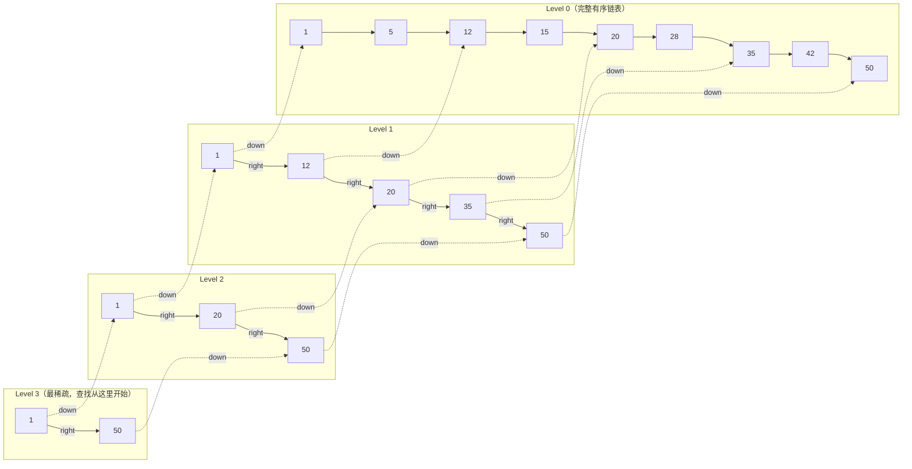

以节点 20 为例：它在 Level 2、Level 1、Level 0 各有一个副本。Level 2 的 20 有 right→50 和 down→Level 1 的 20；Level 1 的 20 有 right→35 和 down→Level 0 的 20。**「下沉」就是沿 down 指针走到下一层同一个值的副本，然后继续用 right 指针往右比较。**

### 1.3 查找过程——以查找 35 为例

查找的规则只有两条：**right 的值 ≤ 目标 → 走 right（实线）；right 的值 > 目标 → 走 down/下沉（虚线）。**

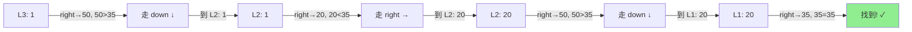

总共 4 步（2 次 right + 2 次 down），而从头遍历 Level 0 需要 7 步。

规律：每多一层索引，搜索范围减半——这和二分查找的原理一模一样，所以时间复杂度是 **O(log N)**。

### 1.4 O(log N) 是怎么算出来的？

先回忆一下 **log（对数）** 是什么：log 就是「反复除」。log₂N 的意思是「N 反复除以 2，除到 1 需要几次」。比如 N = 1024，1024 → 512 → 256 → 128 → 64 → 32 → 16 → 8 → 4 → 2 → 1，除了 10 次，所以 log₂1024 = 10。同理 log₄N 就是「反复除以 4 几次」，log₄1024 = 5（因为 4⁵ = 1024）。**凡是「每一步排除一半/一大块」的算法，复杂度都是 O(log N)**——二分查找、平衡树、跳表都是这个原理。

以提升概率 p = 1/2（最直观的情况）为例推导跳表：

底层 Level 0 有 N 个节点。每个节点有 50% 概率被提升到 Level 1，所以 Level 1 期望有 N/2 个节点。同理 Level 2 有 N/4 个，Level 3 有 N/8 个……Level k 有 N/2^k 个。每层砍半，什么时候砍到只剩 1 个？N/2^k = 1 → **k = log₂N**，这就是层数。

每层最多走多少步？两个相邻的上层节点之间，下层最多夹 1/p 个节点（p = 1/2 时最多 2 个）。所以每下沉一层，水平方向最多走 1/p 步（常数）。

总步数 = 层数 × 每层步数 = **log₂N × 常数 = O(log N)**。

Redis 用 p = 1/4（25% 概率提升）。每层砍到 1/4 → 层数变成 log₄N（更少层），但每层水平最多走约 4 步（更多步）。总步数 = log₄N × 4，仍然是 O(log N)，只是常数项不同。选 1/4 而不是 1/2 是**空间和时间的折中**——层数更少意味着每个节点的指针更少，省内存。

| 提升概率 p | 期望层数 | 每层水平步数 | 总步数量级 | 空间（指针数/节点） |
|-----------|---------|------------|-----------|------------------|
| 1/2 | log₂N | ~2 | O(log N) | 2（指针多，费内存） |
| **1/4（Redis）** | log₄N | ~4 | O(log N) | **1.33（省内存）** |
| 1/e | logₑN | ~e≈2.7 | O(log N) | ~1.58（理论最优） |

**关键区别：跳表的 O(log N) 是「期望值」，不是「最坏保证」**

跳表的层数是随机抛硬币决定的，所以 O(log N) 是大量操作的**平均表现**。理论上存在一种极端情况：所有节点抛硬币都是反面，全部只在 Level 0，退化成普通链表 O(N)。但这个概率是指数级下降的——就像连续抛 N 次硬币全是反面，概率是 2⁻ᴺ。N = 100 时概率约 10⁻³⁰，比连中一百期彩票还小。

红黑树不一样，它的 O(log N) 是**最坏情况保证**——通过旋转变色的确定性规则，数学上保证每一次操作都不超过 O(log N)，不存在退化可能。

| 维度 | 跳表 | 红黑树 |
|------|------|--------|
| O(log N) 的含义 | 期望值（概率保证） | 最坏情况（确定性保证） |
| 极端退化 | 理论存在但概率 ≈ 0 | 不可能退化 |
| 工程影响 | 无——退化概率比硬件故障还低 | 无——本来就不退化 |

所以你说的没错——**跳表的复杂度确实是由插入时抛硬币的概率「期望」出来的**。但「期望 O(log N)」和「最坏 O(log N)」在工程实践中几乎没有差别，这也是 Redis 作者说「性能相当」的底气。

### 1.5 插入与层数决定——随机化的巧妙设计

跳表的插入不需要像红黑树那样做旋转变色，它用一种非常优雅的方式维持平衡——**抛硬币**：

1. 先用标准查找定位到插入位置，在 Level 0 插入新节点
2. 然后「抛硬币」：正面就把这个节点提升到上一层，再抛，再正面再提升……直到反面为止
3. 通常 Redis 中用 p = 0.25（即每次有 25% 概率提升），期望每个节点 1.33 层

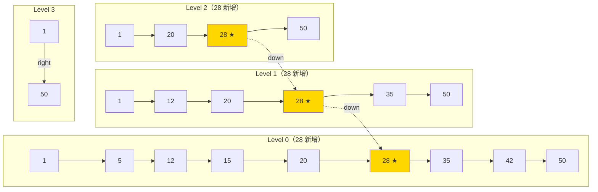

插入 28，抛硬币结果：正、正、反 → 提升到 Level 2。金色节点是新增的 28 在各层的副本。

这种随机化设计的好处是：**不需要全局重新平衡**，插入操作只影响局部。

### 1.6 复杂度与对比

| 维度 | 有序链表 | 跳表 | 平衡二叉树（红黑树/AVL） |
|------|---------|------|------------------------|
| 查找 | O(N) | O(log N) 期望 | O(log N) 最坏 |
| 插入 | O(1)（已知位置） | O(log N) | O(log N) |
| 删除 | O(1)（已知位置） | O(log N) | O(log N) |
| 范围查询 | 顺序遍历，高效 | 同样高效——底层就是有序链表 | 需要中序遍历，实现更复杂 |
| 实现复杂度 | 极简单 | **简单**（核心逻辑百行代码） | 复杂（旋转/变色逻辑） |
| 平衡方式 | 无 | 概率性（随机层数） | 确定性（旋转保证） |
| 空间开销 | O(N) | O(N)（多层指针，约 1.33N） | O(N)（左右孩子+颜色） |

> **后端类比**：跳表就像**书的目录**——目录是索引层，正文是底层链表。你不会从第 1 页翻到第 500 页找某章，而是先看目录跳到大概位置，再细找。

### 1.7 跳表在哪里被使用？

| 使用方 | 场景 | 为什么选跳表 |
|--------|------|------------|
| **Redis ZSet** | 有序集合的底层实现 | 范围查询友好 + 实现简单 |
| **LevelDB / RocksDB** | MemTable（内存中的有序表） | 高效的并发写入 + 范围扫描 |
| **Java ConcurrentSkipListMap** | 并发有序 Map | 无锁实现比红黑树的锁粒度更细 |
| **Apache HBase** | MemStore | 类似 LevelDB 的理由 |

---

## 二、红黑树（Red-Black Tree）——最坏情况下也不慌的平衡术

### 2.1 从二叉搜索树（BST）说起——退化问题

二叉搜索树的规则很简单：左子节点 < 父节点 < 右子节点。但如果插入的数据是有序的（1, 2, 3, 4, 5），BST 就会退化成链表：

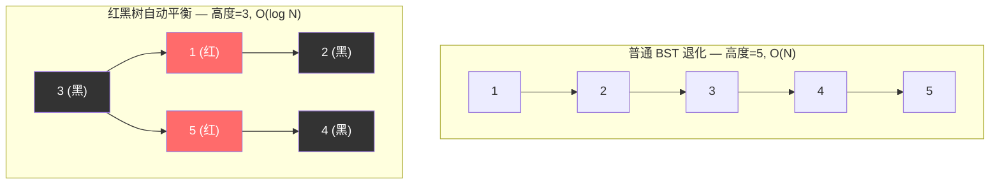

红黑树通过**给节点染色 + 旋转操作**来防止退化，保证树高始终是 O(log N)。

### 2.2 红黑树的五条规则

1. 每个节点要么**红色**要么**黑色**
2. **根节点**是黑色
3. **叶子节点**（NIL/空节点）是黑色
4. **红色节点的两个子节点必须是黑色**（不能连续两个红）
5. **从任意节点到其所有叶子路径上，黑色节点数量相同**（黑高相等）

规则 4 和 5 共同保证了一个关键性质：**最长路径不超过最短路径的 2 倍**。最短路径是全黑节点，最长路径是红黑交替（因为不能连续红），所以树高严格 ≤ **2log(N+1)**。

### 2.3 当规则被打破时——旋转和变色

插入或删除节点可能破坏上述规则（最常见的是规则 4：出现了连续红色）。修复方法有两种：

**变色**：把节点从红变黑或黑变红——最轻量的修复手段，能解决就不旋转。

**旋转**：当变色不够时，通过左旋或右旋调整树的结构。旋转不改变 BST 的有序性（中序遍历结果不变），只是改变了谁是谁的父子关系，让树变矮：

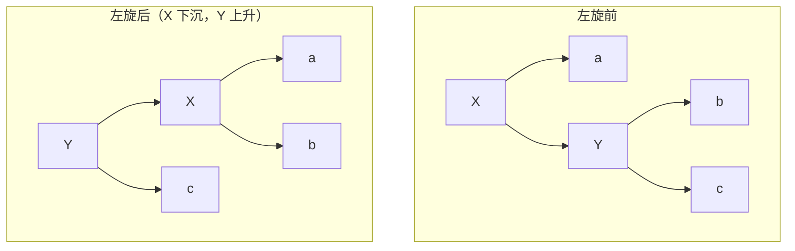

右旋是左旋的镜像。旋转前后中序遍历结果不变（都是 a-X-b-Y-c），只是父子关系变了。

红黑树的插入最多旋转 **2 次**，删除最多旋转 **3 次**——这是它比 AVL 树更适合频繁写入的关键原因。

### 2.4 红黑树 vs AVL 树

| 维度 | 红黑树 | AVL 树 |
|------|--------|--------|
| 平衡条件 | 宽松（黑高相等） | 严格（左右子树高度差 ≤ 1） |
| 查找 | O(log N) | O(log N)，因为更矮所以常数项略小 |
| 插入旋转次数 | 最多 2 次 | 最多 2 次（差不多） |
| 删除旋转次数 | 最多 **3 次** | 最多 **O(log N) 次**（逐层回溯） |
| 适用场景 | **读写混合**（频繁插入删除） | **读多写少**（查找性能极致） |
| 典型使用 | Java TreeMap、HashMap、Linux CFS 调度器 | 数据库索引（某些实现）、Windows 内核 |

一句话：红黑树牺牲了一点查找效率（树可能略高于 AVL），换取了**插入/删除时更少的旋转**。这对 Java 集合框架这类增删频繁的场景更划算。

### 2.5 红黑树在哪里被使用？

| 使用方 | 场景 | 说明 |
|--------|------|------|
| **Java TreeMap / TreeSet** | 有序映射/集合 | 基于红黑树实现，key 按自然顺序或 Comparator 排序 |
| **Java HashMap** | 链表→树退化优化 | 同一个桶内链表长度 ≥ 8 时，转为红黑树避免 O(N) 查找 |
| **Linux CFS 调度器** | 进程调度 | 用红黑树按虚拟运行时间排序，O(log N) 找到下一个应调度的进程 |
| **C++ std::map / std::set** | 标准库有序容器 | 大多数实现底层是红黑树 |
| **Nginx timer 管理** | 定时器事件 | 红黑树存储定时器，快速找到最近的超时事件 |

### 2.6 面试高频——ZSet 为什么用跳表而不用红黑树？

这是大厂面试的经典问题，Redis 作者 antirez 本人也回答过。核心原因有三：

**范围查询友好**：跳表天然有序且支持高效的范围查询（`ZRANGEBYSCORE`），只需找到起点后沿底层链表顺序遍历即可。红黑树做范围查询需要中序遍历，实现更复杂。

**实现简单**：跳表的插入删除逻辑比红黑树的旋转变色简单得多，代码量小，bug 少，易于调试。antirez 原话大意是「跳表实现起来更直观，且性能相当」。

**内存局部性和灵活性**：跳表可以通过调整层数来平衡时间和空间，且不需要像红黑树那样存左右孩子指针和颜色标记。

**时间复杂度对比**：两者查找/插入/删除都是 O(log N)，性能上没有本质差距。

**延伸追问——HashMap 为什么用红黑树而不用跳表？**

Java HashMap 在链表长度 >= 8 时转红黑树，原因相反：HashMap 的 TreeNode 需要在**固定桶位**内组织，红黑树是紧凑的树结构，不需要跳表那样的多层指针开销。HashMap 不需要范围查询（只需单点查找），且红黑树在最坏情况下高度严格保证 ≤ 2log(N+1)，而跳表是概率性的。

> 一句话：**跳表赢在范围查询和实现简单，红黑树赢在空间紧凑和最坏情况确定性。** Redis 需要前者，HashMap 需要后者。

---

## 三、布隆过滤器（Bloom Filter）——用 1% 的误判换 99% 的内存节省

### 3.1 什么是布隆过滤器？

布隆过滤器是一个**空间效率极高的概率型数据结构**，用于判断「一个元素**一定不存在**或**可能存在**」。

注意这两个判断的不对称性——这正是它的核心特征。

### 3.2 原理图解

1. 初始化一个长度为 m 的**位数组**（bit array），所有位置 0
2. 插入元素时，用 k 个不同的哈希函数对元素计算，得到 k 个位置，将这些位置置 1
3. 查询时，同样计算 k 个哈希值，检查对应位置是否全为 1

```
位数组:  [0, 0, 0, 0, 0, 0, 0, 0, 0, 0]  (m=10)

插入 "apple"  → hash1=2, hash2=5, hash3=8
位数组:  [0, 0, 1, 0, 0, 1, 0, 0, 1, 0]

查询 "banana" → hash1=2, hash2=6, hash3=8
                 位2=1 ✓, 位6=0 ✗ → 一定不存在 ✓

查询 "cherry" → hash1=2, hash2=5, hash3=8（恰好和 apple 相同）
                 全为1 → 可能存在（但实际不存在 → 误判！）
```

- **全为 1** → 元素**可能存在**（可能是其他元素把这些位置顶了，即**误判/假阳性**）
- **有任一位为 0** → 元素**一定不存在**（这一点 100% 准确，**无假阴性**）

### 3.3 参数设计——三个关键数字

布隆过滤器的性能由三个参数决定，它们之间有数学关系：

| 参数 | 含义 | 经验公式 |
|------|------|---------|
| **n** | 预计插入元素数量 | 业务预估 |
| **p** | 期望误判率（假阳性率） | 通常 0.01（1%）或 0.001（0.1%） |
| **m** | 位数组大小（bit 数） | m = -(n × ln(p)) / (ln2)² ≈ **-1.44 × n × log₂(p)** |
| **k** | 哈希函数个数 | k = (m/n) × ln2 ≈ **0.693 × (m/n)** |

**实际计算举例**：

| 预计元素数 n | 误判率 p | 位数组大小 m | 哈希函数数 k | 内存 |
|-------------|---------|-------------|-------------|------|
| 1 亿 | 1% | 9.58 亿 bit | 7 | **~114 MB** |
| 1 亿 | 0.1% | 14.4 亿 bit | 10 | ~172 MB |
| 1000 万 | 1% | 9580 万 bit | 7 | ~11.4 MB |

对比：如果用 HashSet 存 1 亿个 64 字节的 Key，需要约 **6 GB** 内存。布隆过滤器用 114 MB 达到 99% 的准确率。

### 3.4 实际应用场景

| 场景 | 怎么用 | 为什么用布隆过滤器 |
|------|--------|-------------------|
| **缓存穿透拦截** | 把所有合法 Key 加入过滤器，请求先过滤 → 不存在直接拒绝 | 用极小内存拦截海量非法请求，保护 DB |
| **爬虫 URL 去重** | 已爬过的 URL 加入过滤器 → 新 URL 先查 → 已存在则跳过 | 上亿 URL 用 HashSet 存不下 |
| **邮件/消息去重** | 消息 ID 入过滤器 → 重复消息直接丢弃 | 海量消息场景下空间效率远超 Set |
| **推荐系统已读过滤** | 已推荐内容 ID 入过滤器 → 新推荐先检查 | 每个用户一个过滤器，内存可控 |
| **黑名单/风控** | IP/设备指纹入过滤器 → 命中则触发风控策略 | 百万级黑名单用 Set 太占内存 |
| **数据库查询优化** | HBase/Cassandra 用布隆过滤器快速判断某行是否在某个 SSTable 中 | 避免无谓的磁盘 IO |

### 3.5 布隆过滤器的变体

标准布隆过滤器有两个限制：不支持删除，不支持计数。变体解决这些问题：

| 变体 | 解决什么问题 | 原理 | 代价 |
|------|------------|------|------|
| **Counting Bloom Filter** | 支持删除 | 每个位置用 4-bit 计数器替代 1-bit，删除时计数器减 1 | 内存是标准版的 4 倍 |
| **Cuckoo Filter** | 支持删除 + 更低误判率 | 基于布谷鸟哈希（Cuckoo Hashing），存指纹而非只置位 | 实现更复杂，但综合性能更好 |
| **Scalable Bloom Filter** | 动态扩容 | 元素数超过预期时自动加一层新的过滤器 | 多层查询略慢 |
| **Quotient Filter** | 支持删除 + 合并 | 用商和余数编码存储，支持两个过滤器合并 | 空间效率略低于标准版 |

### 3.6 在 Redis 中使用布隆过滤器

Redis 原生不支持布隆过滤器，有两种方式：

**方式一：RedisBloom 模块**（推荐）—— Redis 官方提供的扩展模块：

```bash
# 创建过滤器：预期 100 万元素，1% 误判率
BF.RESERVE user_filter 0.01 1000000
# 添加
BF.ADD user_filter user:1001
# 批量添加
BF.MADD user_filter user:1002 user:1003
# 查询（0 = 一定不存在，1 = 可能存在）
BF.EXISTS user_filter user:9999
# 批量查询
BF.MEXISTS user_filter user:1001 user:9999
```

**方式二：手动 Bitmap 实现**——用 `SETBIT`/`GETBIT` 操作 Redis 位图，客户端做多次哈希。灵活但需要自行维护。

<details>
<summary><b>展开：Java + Redis 布隆过滤器实战代码</b></summary>

使用 Redisson 客户端（封装了 RedisBloom）：

```java
// 方式一：Redisson 内置布隆过滤器（推荐）
RBloomFilter<String> bloomFilter = redisson.getBloomFilter("user_filter");
// 初始化：预期 100 万元素，1% 误判率
bloomFilter.tryInit(1_000_000L, 0.01);

// 添加
bloomFilter.add("user:1001");

// 查询
if (!bloomFilter.contains("user:9999")) {
    // 一定不存在 → 直接返回，不查 DB
    return null;
}
// 可能存在 → 继续查缓存/DB
return queryFromCacheOrDB("user:9999");
```

手动 Bitmap 方式（不依赖 RedisBloom 模块）：

```java
// 方式二：手动 Bitmap（适合无法安装 RedisBloom 的场景）
public class ManualBloomFilter {
    private static final int[] SEEDS = {3, 5, 7, 11, 13, 31, 37}; // 7 个哈希种子
    private final long bitSize;
    private final StringRedisTemplate redis;

    public void add(String key, String value) {
        for (int seed : SEEDS) {
            long offset = hash(value, seed) % bitSize;
            redis.opsForValue().setBit(key, offset, true);
        }
    }

    public boolean mightContain(String key, String value) {
        for (int seed : SEEDS) {
            long offset = hash(value, seed) % bitSize;
            if (!Boolean.TRUE.equals(redis.opsForValue().getBit(key, offset))) {
                return false; // 有一位不为 1 → 一定不存在
            }
        }
        return true; // 全为 1 → 可能存在
    }
}
```

</details>

> **面试一句话总结**：布隆过滤器的核心价值是**用极小的空间代价换取「一定不存在」的确定性判断**，适合所有「宁可误判存在、不能漏判不存在」的场景。

---

## 四、一致性 Hash（Consistent Hashing）——节点增减时的最小搬迁

一致性 Hash 在 [缓存分片](./08-缓存与Redis.md)、[负载均衡](./07-高可用架构.md)、[分库分表](./09-数据库MySQL.md) 三个场景都会考到，是分布式系统的基础概念。

### 4.1 普通 Hash 取模的致命问题

假设你有 3 台 Redis，用 `hash(key) % 3` 决定数据存哪台。现在加一台变 4 台 → `hash(key) % 4` → **几乎所有 key 的计算结果都变了** → 大量数据迁移 → 缓存失效 → 请求全打到数据库 → 雪崩。

减少一台也一样。**节点数一变，整个映射关系几乎全部打乱。**

### 4.2 一致性 Hash 怎么解决？—— 哈希环

把整个哈希值空间想象成一个环（0 ~ 2³²-1 首尾相连），节点和 Key 都哈希到环上，数据**顺时针找到最近的节点**存储：

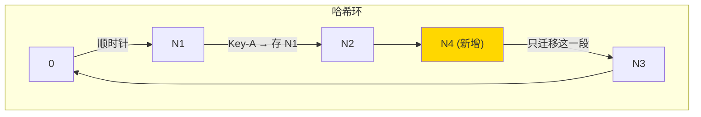

加一个节点 N4，它落在 N2 和 N3 之间 → **只有 N4 和 N3 之间这一小段的 key 需要迁移到 N4**，其他所有数据纹丝不动。

| 操作 | 普通 Hash 取模 | 一致性 Hash |
|------|---------------|------------|
| 加/减一个节点 | **~100% 数据需要迁移** | **只有 ~1/N 的数据需要迁移** |
| 3→4 节点 | 75% key 映射变化 | 只有约 25% key 需要移动 |

### 4.3 虚拟节点——解决数据倾斜

如果真实节点少（比如只有 3 台），它们在环上的分布可能不均匀 → 大量 key 都落到同一个节点 → 热点。

解决办法：给每个真实节点创建多个**虚拟节点**（比如每台创建 150 个虚拟节点），均匀散布在环上。查到虚拟节点后映射回真实节点即可。

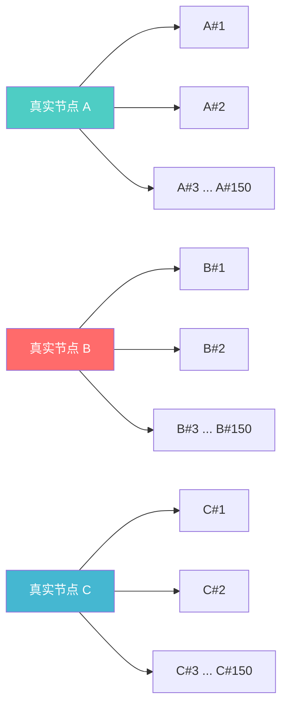

3 台真实节点 × 150 个虚拟节点 = 环上 450 个虚拟节点，数据分布自然均匀。

### 4.4 Redis Cluster 的 Hash Slot 方案

**Redis Cluster 用的不是一致性 Hash，而是 Hash Slot（哈希槽）**。16384 个固定槽位，通过 `CRC16(key) % 16384` 计算每个 Key 属于哪个槽，每个节点负责一部分槽。

这本质上是一致性 Hash 思想的**简化版**——槽数量固定不变，节点增减时只需要把部分槽（及其数据）从一个节点迁移到另一个节点。效果和一致性 Hash 类似，但实现更简单、槽位分配更可控。

| 维度 | 一致性 Hash | Redis Hash Slot |
|------|------------|-----------------|
| 哈希空间 | 0 ~ 2³² 连续环 | 0 ~ 16383 固定槽 |
| 节点映射 | 顺时针找最近节点 | 槽→节点的映射表 |
| 数据倾斜 | 需要虚拟节点 | 手动/自动平衡槽分配 |
| 扩容 | 自动，只迁移 1/N | 需要手动/工具迁移槽 |
| 适用场景 | 通用分布式缓存（如 Memcached） | Redis Cluster 专用 |

> **一句话总结**：普通取模「牵一发动全身」，一致性 Hash「只动邻居」。核心价值是**节点增减时最小化数据迁移量**。

---

## 五、HashMap——Java 面试出现频率最高的数据结构

HashMap 几乎是 Java 面试的必考题，它把数组、链表、红黑树、哈希函数四个概念组合到了一起。理解了它的结构和 put 流程，前面讲的红黑树、hashCode/equals 契约就全部串起来了。

### 5.1 整体结构——数组 + 链表 + 红黑树

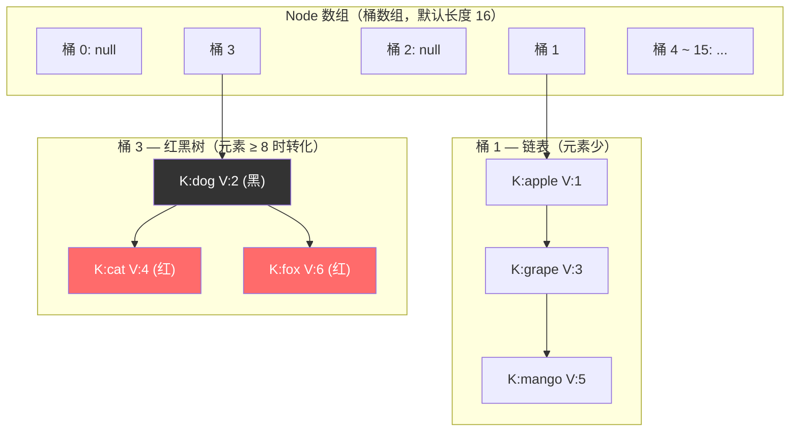

底层是一个 **Node 数组**（也叫桶数组，bucket array），默认初始长度 16。每个桶里存的是一条链表（或红黑树）。当同一个桶里的链表长度 **≥ 8** 且数组长度 **≥ 64** 时，链表会转成红黑树；当红黑树节点数 **≤ 6** 时会退化回链表。

> 后端类比：你可以把它想象成一个有 16 个格子的快递柜。每个包裹（Key-Value）根据收件人手机号的哈希值被分配到某个格子。如果某个格子堆了太多包裹（哈希冲突），就从无序的一堆换成有序排列（红黑树），方便查找。

### 5.2 哈希扰动函数——为什么不直接用 hashCode？

`put(key, value)` 第一步要算 key 应该落在哪个桶。朴素做法是 `hashCode % 数组长度`，但有个问题：如果数组长度是 16，`hashCode % 16` 实际上只看了 hashCode 的**低 4 位**（因为 16 = 2⁴），高位信息完全浪费了 → 冲突率高。

JDK 8 的做法是**把高 16 位异或到低 16 位**（扰动），让高位也参与桶定位：

```java
// HashMap.hash() 源码（JDK 8）
static final int hash(Object key) {
    int h;
    return (key == null) ? 0 : (h = key.hashCode()) ^ (h >>> 16);
    //                          原始hashCode    异或    高16位右移到低16位
}
// 定位桶：(n - 1) & hash   等价于 hash % n（n 是 2 的幂时）
```

为什么用 `(n - 1) & hash` 而不用 `hash % n`？因为 n 是 2 的幂时，`n - 1` 的二进制全是 1（如 16-1 = 1111），按位与（&）的效果和取模一样，但**位运算比取模快得多**。这也是 HashMap 容量必须是 2 的幂的根本原因。

### 5.3 put 流程——面试最爱画的流程图

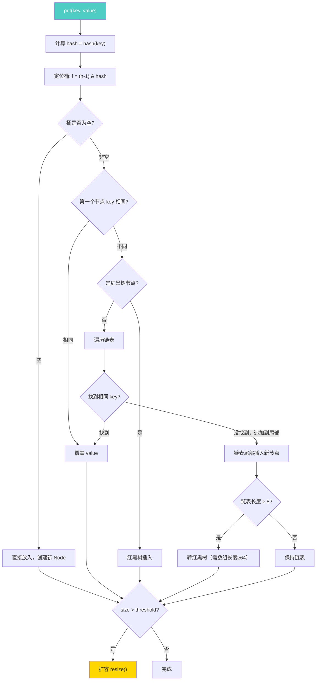

用文字走一遍：① 算 hash → ② 定位桶 → ③ 桶空则直接放 → ④ 桶非空则看第一个节点 key 是否相同（先比 hash 再比 equals），相同就覆盖 → ⑤ 不同则看是链表还是红黑树，分别遍历/树查找 → ⑥ 找到相同 key 就覆盖，没找到就插入尾部 → ⑦ 链表插入后检查长度是否 ≥ 8，是就树化 → ⑧ 最后检查总元素数是否超过阈值（容量 × 负载因子），超过就扩容。

### 5.4 扩容 rehash——容量翻倍的巧妙迁移

当元素数 > 容量 × 负载因子（默认 0.75）时触发扩容，数组长度翻倍（16 → 32 → 64 → ...）。

扩容最关键的问题是：**老桶里的节点该放到新数组的哪个桶？** JDK 8 用了一个巧妙的优化——不需要重新计算 hash % 新容量，只需要看 hash 值**新增的那一位**（即原容量对应的 bit 位）是 0 还是 1：

| hash 新增位 | 新桶位置 | 说明 |
|------------|---------|------|
| 0 | 不动，还在原位 i | 低位没变，位置不变 |
| 1 | 移到 i + 老容量 | 多了高位的 1，位置偏移刚好是老容量 |

举例：老容量 16（10000），桶位 = hash & 1111。新容量 32（100000），桶位 = hash & 11111。多看了一位，这一位是 0 就原地不动，是 1 就搬到 i + 16。**一次按位与就决定去留，不需要重新取模**。

### 5.5 线程不安全——为什么不能多线程用 HashMap？

HashMap 是**非线程安全**的，多线程并发操作会出严重问题：

**JDK 7 的致命 bug——链表成环**：JDK 7 扩容时用头插法迁移链表，两个线程同时扩容可能导致链表形成环形引用 → `get()` 时死循环 → CPU 100%。这是线上真实出过的事故。

**JDK 8 改成了尾插法**，解决了成环问题，但仍然不安全：两个线程同时 put 可能覆盖对方的数据（丢数据）、size 计数不准、扩容时节点丢失等。

**正确做法**：并发场景用 `ConcurrentHashMap`（见 [3.1 并发体系](./01-并发体系.md) 考点 7）。

### 5.6 核心参数速查

| 参数 | 默认值 | 含义 |
|------|--------|------|
| **初始容量** | 16 | 桶数组的初始长度，必须是 2 的幂 |
| **负载因子** | 0.75 | 元素数 / 容量 > 0.75 时触发扩容 |
| **树化阈值** | 8 | 链表长度 ≥ 8 时转红黑树（数组还需 ≥ 64） |
| **退化阈值** | 6 | 红黑树节点 ≤ 6 时退化回链表 |
| **最大容量** | 2³⁰ | 约 10 亿，够用了 |

>> 为什么树化阈值是 8？泊松分布计算显示，负载因子 0.75 时，同一个桶出现 8 个元素的概率约为千万分之六（0.00000006）。换句话说，绝大多数情况下链表就够了，红黑树只是极端情况的兜底。

---

## 六、B+ 树——数据库索引为什么选它

### 6.1 从二叉树到 B+ 树的演进

前面讲了 BST → 红黑树 → 跳表，它们都是在**内存中**工作的数据结构。但数据库的数据量远超内存容量，索引要落在**磁盘**上。磁盘的特点是：**随机 IO 极慢**（寻道 ~10ms），**顺序 IO 还行**。所以数据库索引的核心诉求是：**尽可能少做磁盘 IO**。

红黑树的问题是**太瘦高**——存 1000 万条数据需要约 23 层（log₂10⁷ ≈ 23），每层一次磁盘 IO，23 次磁盘寻道需要约 230ms，太慢了。

B 树（B-Tree）的思路是**把节点撑胖**——每个节点不是存 1 个 key，而是存几百上千个 key，这样同样 1000 万条数据只需要 3-4 层。树从「瘦高」变成「矮胖」，磁盘 IO 次数从 23 次降到 3-4 次。

B+ 树是 B 树的进化版，做了两个关键改动：

### 6.2 B+ 树的结构

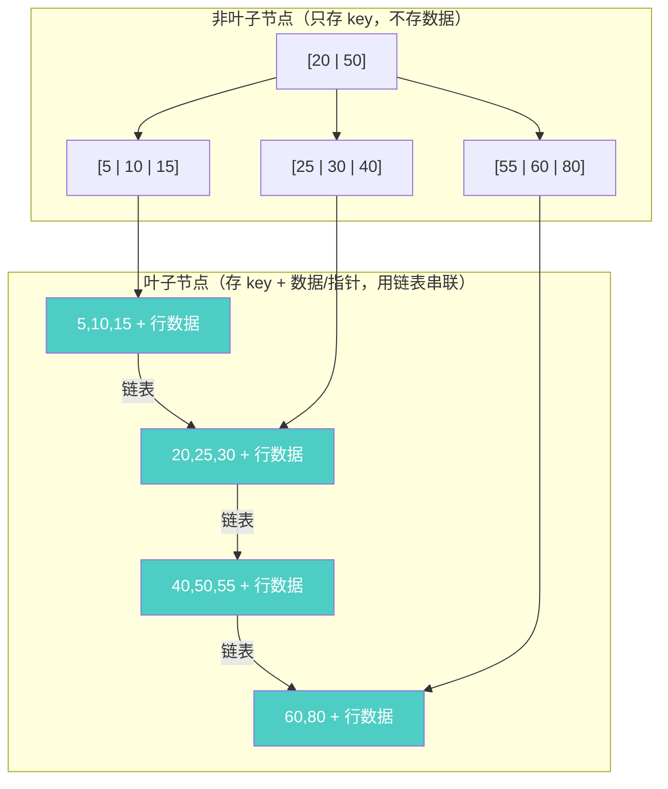

**和 B 树的两个关键区别**：

| 区别 | B 树 | B+ 树 |
|------|------|-------|
| **数据存在哪** | 所有节点都存数据 | **只有叶子节点存数据**，非叶子只存 key |
| **叶子节点** | 互不相连 | **用链表串联** |

这两个改动带来了巨大的实际收益：

**改动 1 的收益**：非叶子节点不存数据 → 一个节点（通常 16KB，即 MySQL 的一个页）能装更多 key → 树更矮 → IO 更少。具体算一下：假设 key 是 bigint（8 字节），指针 6 字节，一个 16KB 页能装 16384 / (8+6) ≈ **1170 个 key**。三层 B+ 树能索引 1170 × 1170 × 叶子节点行数 ≈ **千万级数据，只需要 3 次 IO**。

**改动 2 的收益**：叶子节点用链表串联 → 范围查询（`WHERE age BETWEEN 20 AND 30`）只需找到起始叶子，然后**顺着链表扫**——这是顺序 IO，极快。B 树做范围查询需要反复回到父节点再下来，效率低得多。

### 6.3 B+ 树的查找过程

以查找 key = 30 为例：


从根节点开始，每层做一次**二分查找**定位到下一层的指针，直到叶子节点。3 层树 = 3 次磁盘 IO，实际上根节点和第二层通常被缓存在内存中（InnoDB Buffer Pool），所以真正的磁盘 IO 往往只有 **1-2 次**。

### 6.4 为什么不用红黑树/跳表/Hash 做数据库索引？

| 候选结构 | 致命问题 | 说明 |
|---------|---------|------|
| **红黑树** | 太瘦高 | 二叉结构，1000 万数据需 ~23 层 = 23 次磁盘 IO |
| **跳表** | 层数太多 | 与红黑树类似，且概率性平衡不适合持久化 |
| **Hash 索引** | 不支持范围查询 | `WHERE age > 20` 无法使用，只能精确匹配 |
| **B 树** | 范围查询慢 | 非叶子也存数据 → 节点更胖 → 装的 key 少 → 树更高 |
| **B+ 树** | ✅ 最优选择 | 矮胖 + 叶子链表 = 最少 IO + 高效范围查询 |

> **一句话总结**：数据库索引选 B+ 树的本质原因是**磁盘 IO 是瓶颈**。B+ 树的「矮胖结构」最大限度减少了磁盘访问次数，「叶子链表」让范围查询变成顺序 IO。

---

## 七、常见树结构总览——一张表理清关系

前面分散讲了很多树，这里用一张表把它们的关系和使用场景理清：

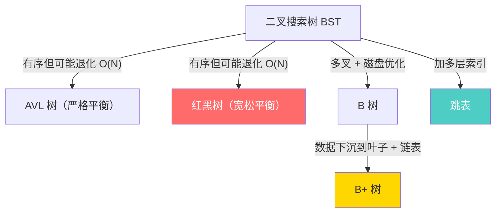

| 树结构 | 核心特点 | 时间复杂度 | 适用场景 | 典型使用 |
|--------|---------|-----------|---------|---------|
| **BST（二叉搜索树）** | 左 < 父 < 右 | O(log N) 平均，O(N) 最坏 | 教学用，实际不直接使用 | 理解其他树的基础 |
| **AVL 树** | 严格平衡（高度差 ≤ 1） | O(log N) 最坏，查找最快 | **读多写少** | 部分数据库索引实现、Windows 内核 |
| **红黑树** | 宽松平衡（黑高相等） | O(log N) 最坏，增删更快 | **读写均衡** | Java TreeMap/HashMap、Linux CFS、Nginx |
| **B 树** | 多叉，所有节点存数据 | O(log N) | 磁盘存储（已被 B+ 树取代） | MongoDB（WiredTiger 的一种模式） |
| **B+ 树** | 多叉，数据仅在叶子 + 叶子链表 | O(log N)，范围查询极快 | **数据库索引** | MySQL InnoDB、PostgreSQL、Oracle |
| **跳表** | 多层索引链表，随机平衡 | O(log N) 期望 | **内存有序集合** | Redis ZSet、LevelDB MemTable |
| **Trie（前缀树）** | 按字符分叉，共享前缀 | O(L)，L 为字符串长度 | **前缀匹配/自动补全** | 路由表、搜索引擎、IP 查找 |
| **堆（Heap）** | 完全二叉树，父 ≥ 子（大顶堆） | 插入/删除 O(log N)，取极值 O(1) | **优先级队列/Top-K** | Java PriorityQueue、定时器、调度 |

> **选型口诀**：内存里读写均衡选**红黑树**，内存里要范围查询选**跳表**，磁盘上选**B+ 树**，只要精确匹配选**Hash**，字符串前缀选**Trie**，取最大最小选**堆**。

---

## 本篇小结

| 数据结构 | 核心特征 | 时间复杂度 | 典型使用 |
|---------|---------|-----------|---------|
| **跳表** | 多层索引链表，随机化平衡 | 查找/插入/删除 O(log N) 期望 | Redis ZSet、LevelDB、ConcurrentSkipListMap |
| **红黑树** | 自平衡 BST，染色+旋转 | 查找/插入/删除 O(log N) 最坏 | Java TreeMap/HashMap、Linux CFS、Nginx |
| **布隆过滤器** | 概率型存在性判断，极省空间 | 插入/查询 O(k)，k 为哈希函数数 | 缓存穿透、URL 去重、HBase/Cassandra |
| **一致性 Hash** | 哈希环，最小化迁移 | 查找 O(log N)（虚拟节点排序） | 分布式缓存分片、负载均衡 |
| **HashMap** | 数组+链表+红黑树，哈希扰动 | 查找/插入 O(1) 平均，O(log N) 最坏 | Java HashMap/LinkedHashMap、几乎所有业务代码 |
| **B+ 树** | 多叉矮胖树，叶子链表串联 | 查找 O(log N)，范围查询极快 | MySQL InnoDB、PostgreSQL、Oracle 索引 |

> 这些结构的共同点：**都是在某个维度上用「巧妙的空间/概率换取」来解决朴素方案的性能瓶颈**。跳表用空间（多层指针）换时间，布隆过滤器用误判率换空间，红黑树用颜色标记换平衡，一致性 Hash 用虚拟节点换均匀性，HashMap 用数组随机访问 + 链表/树解决冲突，B+ 树用多叉矮胖结构换最少磁盘 IO。

---

**相关章节**：

- [3.8 缓存与 Redis](./08-缓存与Redis.md)——跳表/红黑树/布隆过滤器的 Redis 应用场景
- [3.7 高可用架构](./07-高可用架构.md)——一致性 Hash 在负载均衡中的应用
- [3.9 数据库 MySQL](./09-数据库MySQL.md)——B+ 树索引、一致性 Hash 在分库分表中的应用
- [3.1 并发体系](./01-并发体系.md)——ConcurrentHashMap 演进、ConcurrentSkipListMap 等并发数据结构
- [3.4 类型系统](./04-类型系统.md)——hashCode/equals 契约、为什么重写 equals 必须重写 hashCode
