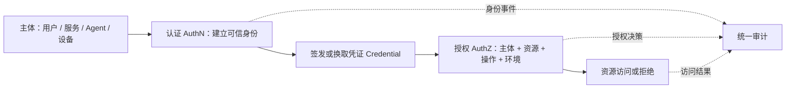
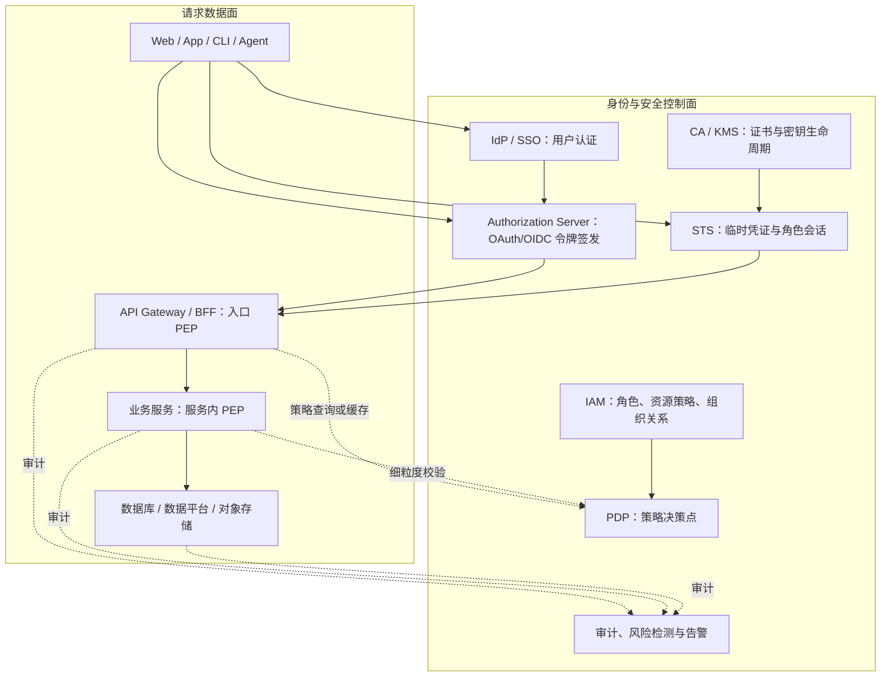
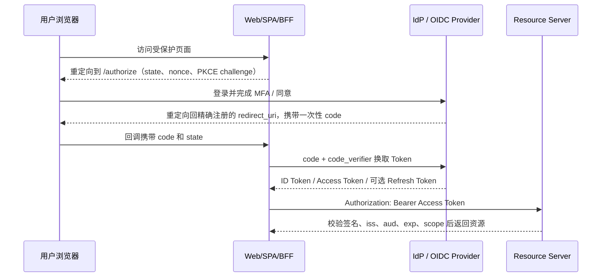
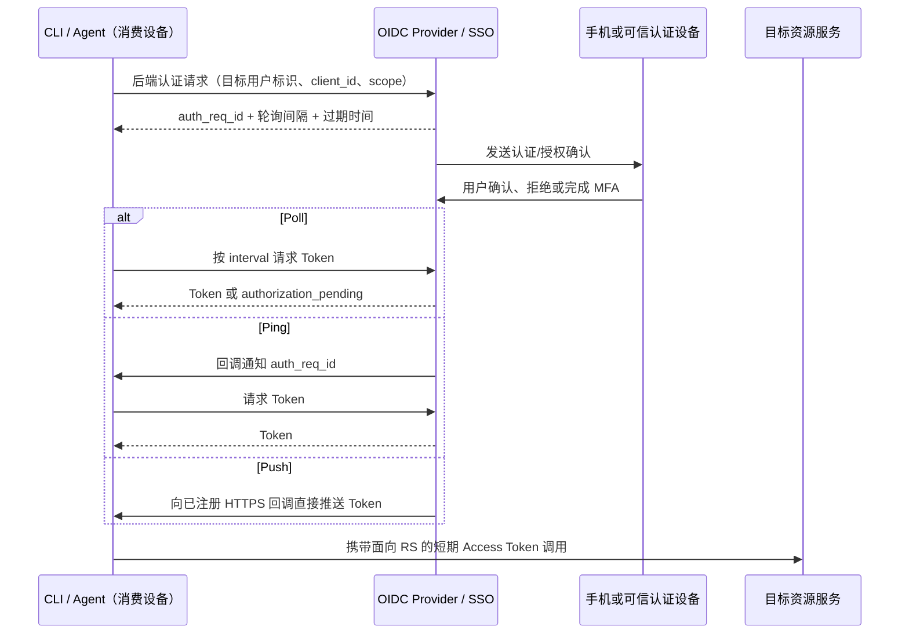
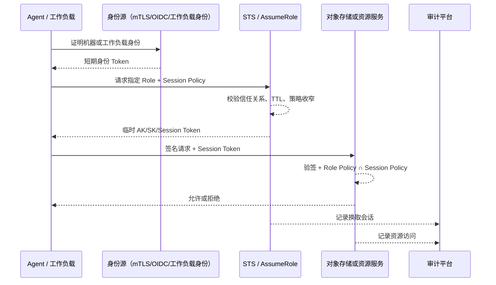

# 附录 A10：认证、授权与凭证安全——从 SSO、OAuth 到 STS、CIBA 的统一架构

> **一句话定位**：认证解决“你是谁”，授权解决“你能做什么”，凭证解决“你如何证明自己”。本篇把用户登录、服务间访问、CLI/Agent、对象存储等看似分散的鉴权问题，统一到一套身份、令牌、策略和审计架构中。

---

## 一、先把四个容易混淆的概念分开

日常常说“鉴权”，但这个词经常把几件不同的事混在一起。设计方案或排查线上问题前，必须先明确是在解决哪一层。

| 概念 | 英文 | 回答的问题 | 典型产物 | 示例 |
|---|---|---|---|---|
| 身份认证 | Authentication / AuthN | 你是谁？ | 身份主体（Subject） | 员工 SSO 登录、服务出示 mTLS 证书 |
| 访问授权 | Authorization / AuthZ | 你能做什么？ | Allow / Deny 决策 | 是否能读某 Bucket、调用某 API |
| 凭证 | Credential | 你拿什么证明自己？ | Cookie、Token、证书、AK/SK | JWT、Refresh Token、X.509 证书 |
| 审计与追责 | Auditing / Accountability | 谁在何时因何理由做了什么？ | 审计事件、关联 ID | 某 Agent 读取了哪个对象、使用哪个角色 |

一个常见错误是“用户已登录，所以能访问所有资源”。登录只能完成 **AuthN**，并不会自动带来业务权限。正确链路应当是：主体先完成认证，授权服务或资源服务再结合主体、资源、操作和环境做授权决策，最后写入可关联的审计记录。



### 1.1 主体不只有“用户”

企业系统至少应把以下主体作为一等公民建模：人类用户（employee/customer）、应用或工作负载（workload/service）、设备或机器（device/machine）、自动化 Agent，以及代表他人执行操作的委托主体（delegated actor）。

这一区分决定凭证选型。浏览器中的员工用户适合 OIDC/SSO；Kubernetes 中的订单服务适合工作负载身份和 mTLS；受限输入的 CLI 或 Agent 适合 CIBA 或 Device Authorization；需要访问对象存储的 Agent 则适合 STS 临时凭证，而不是复制一份长期 AK/SK。

### 1.2 身份、角色、权限、策略之间的关系

可以将授权建模为：

```text
Subject（主体）
  └─ 具有 Claims（部门、租户、设备、风险等级、认证强度……）
       └─ 获得 Role / Scope / Entitlement（角色、范围、授权项）
            └─ 在 Policy 中对 Resource + Action + Context 求值
                 └─ 得到 Allow / Deny，并记录审计证据
```

例如，“张三属于华北运营组”是身份或组织属性；“运营分析师”是角色；`order:read` 是权限范围；“仅工作日 9:00–18:00 可查看华北订单且手机号须脱敏”才是一条完整的策略。

---

## 二、统一鉴权架构：控制面与数据面分离

单体系统中，登录、验 Token、判断权限、管理密钥往往都写在一个服务里；当系统演化成多端、多服务、Agent 和数据平台后，这种做法会导致重复实现、策略漂移和审计断裂。

更稳健的架构是把“颁发身份与制定策略”放在 **控制面**，把“每次请求快速执行校验”放在 **数据面**。



这里的术语有三个重点：PEP（Policy Enforcement Point，策略执行点）通常在网关、服务或存储引擎；PDP（Policy Decision Point，策略决策点）负责对策略求值；PIP（Policy Information Point）向 PDP 提供组织、资源标签、设备状态、风险分等属性。不要把所有判断都远程调用 PDP，否则授权服务故障会扩大成全站故障；常见做法是将稳定策略、JWKS、公钥和短期决策缓存下沉到 PEP，同时保留策略实时撤销和高风险操作的在线校验通道。

### 2.1 三条不能省的边界

第一，**认证中心不直接替业务决定所有权限**。SSO 只证明身份，具体业务仍需决定某个用户能否删除订单、读取某个文件或触发一次支付。

第二，**Token 不是权限数据库**。Token 中应放稳定、最小且有时效的 Claims，例如 `sub`、`aud`、`scope`、`tenant_id`、`exp`。频繁变化的大型角色树、黑名单、资源 ACL 不适合无限塞进 JWT；它们应由策略服务或资源服务校验。

第三，**控制面要高可用，数据面要可降级**。在验签型 JWT 场景，资源服务可使用缓存的 JWKS 离线验签；在高敏感、必须即时撤销的操作上，则可使用短 Token、Token Introspection、撤销列表或二次在线授权。不同风险等级不应共用一条“非黑即白”的链路。

---

## 三、凭证家族：不是“哪个安全”而是“谁、在哪、代表谁”

### 3.1 常见凭证对比

| 凭证类型 | 本质 | 最适用主体 | 优点 | 主要风险与约束 |
|---|---|---|---|---|
| Session Cookie | 服务端 Session 的浏览器索引 | Web 用户 | 服务端可即时撤销，浏览器体验成熟 | CSRF、Session 存储与跨域设计 |
| JWT Access Token | 自包含、签名保护的声明 | API 调用方 | 无需每次回中心查会话，横向扩展好 | 泄露后在过期前可被重放；不能把敏感数据明文放入 Payload |
| Opaque Token | 随机引用，资源端内省或查缓存 | 高撤销要求 API | 便于即时禁用和集中控制 | 增加在线依赖与延迟 |
| API Key | 标识调用应用的静态秘密 | 低风险开发者 API | 接入简单 | 往往是长期 Bearer 凭证，不能替代细粒度用户授权 |
| AK/SK + 请求签名 | Access Key 标识 + Secret Key HMAC 签名 | 对象存储、云 API | 可验证请求完整性，SK 不随请求传输 | 长期 SK 泄露窗口长；必须配合轮换和临时化 |
| X.509 / mTLS 证书 | 私钥持有证明与证书身份 | 服务、设备、机器 | 抗冒用，适合工作负载身份 | CA、轮换、吊销、网关透传等运维复杂度 |
| 短期 STS 凭证 | 有效期受限的 AK/SK/Token 会话 | Agent、临时任务、跨账号访问 | 爆炸半径小，天然到期，可承载会话策略 | 需要可靠身份源、续签与审计链路 |
| Refresh Token | 换取新 Access Token 的高价值凭证 | 用户授权客户端 | 降低用户重复登录 | 必须安全存储、轮换、撤销和绑定客户端 |

凭证选型的首要问题不是“JWT 还是 Session”，而是：调用发生在哪个环境？主体能否安全保存秘密？是否代表用户？需要多快撤销？是否需要跨系统委托？能否记录到具体机器或 Agent？

### 3.2 Bearer Token 与 Sender-Constrained Token

普通 Bearer Token 的语义是“谁拿到谁能用”。这足以满足大量常规 API，但 Token 被日志、浏览器扩展、内存转储或代理截获时，攻击者可在过期前重放。

Sender-Constrained Token 则要求调用方额外证明持有某个私钥或证书：

- **mTLS Certificate-Bound Access Token**：Token 绑定到客户端 TLS 证书，请求时必须完成对应的双向 TLS 握手。
- **DPoP（Demonstrating Proof of Possession）**：客户端为每次请求生成含 HTTP 方法、目标 URI、时间和唯一 ID 的签名证明，资源服务验证证明与 Token 的公钥绑定。

这两类机制不能取代 TLS、XSS 防护或终端安全；它们的作用是降低 Token 被复制到另一台机器后直接重放的风险。DPoP 特别需要限制证明有效期、处理 `jti` 重放，并确保仅允许安全的非对称签名算法。

---

## 四、用户认证与单点登录：Session、SAML、OAuth 2.0、OIDC

### 4.1 SSO 不是一个单独协议

SSO（Single Sign-On）是一种体验和架构目标：用户在统一身份提供方完成一次认证后，多个受信应用能够建立各自会话。它可以由 SAML、CAS、OIDC 等协议实现。

| 方案 | 典型载体 | 更适合 | 特点 |
|---|---|---|---|
| 同根域 Cookie SSO | Cookie + 共享 Session | 少量同域旧系统 | 实现简单，但不能自然跨域 |
| SAML 2.0 | XML Assertion + 浏览器重定向 | 企业 SaaS、遗留系统 | 企业生态成熟，但协议和 XML 签名处理较重 |
| OIDC | JSON/JWT + OAuth 2.0 | Web、SPA、移动端、API | 现代、API 友好，既能认证又能授权 |
| CAS / 自研票据 | 服务票据 | 内部已有体系 | 与现存生态兼容，但应明确票据受众和生命周期 |

OAuth 2.0 本身是一个**授权框架**，定义应用如何获得访问资源的许可；OIDC（OpenID Connect）在它之上引入 `id_token`、`userinfo` 和标准 Claims，补足“用户是谁”的认证语义。不要拿 Access Token 当作前端展示身份信息的唯一依据，也不要把 ID Token 直接当作任意资源服务器都能接受的 API 通行证。

### 4.2 认证因子、MFA 与认证强度

认证协议解决“票据如何流转”，认证因子解决“用户最初如何证明自己”。成熟的 IdP 应将认证强度（例如密码登录、短信或 TOTP 二次验证、硬件安全密钥、Passkey）作为可消费的 Claims 或会话属性，而不是只返回一个笼统的“已登录”。高风险资源可要求更高的 `acr`（认证上下文等级）或最近认证时间 `auth_time`。

| 认证方式 | 安全特性 | 常见问题 | 推荐定位 |
|---|---|---|---|
| 密码 | 普适、成本低 | 钓鱼、撞库、重用；服务端绝不能可逆保存 | 使用 Argon2id/bcrypt 加盐哈希，配合限速与泄露密码检测 |
| 短信 / 邮箱 OTP | 覆盖广 | SIM Swap、邮箱被控、社工攻击 | 过渡性二次验证，不宜作为最高等级因子 |
| TOTP | 离线可用 | 仍可能被实时钓鱼代理转发 | 常规 MFA 的兼容方案 |
| Push 确认 | 体验好 | 疲劳轰炸、误点同意 | 展示操作上下文，限制频率，避免纯“同意/拒绝”盲点 |
| FIDO2 / WebAuthn / Passkey | 私钥按站点绑定，抗钓鱼 | 设备兼容和恢复流程需要设计 | 高价值登录和敏感操作的优先选择 |

MFA 并非所有操作一律多一步。更合理的做法是风险分级：新设备、异地、异常 IP、导出敏感数据、修改收款账户、创建高权限角色等场景触发 step-up authentication；低风险、近期已完成强认证的会话可减少干扰。无论哪种方式，验证码、恢复码和用户密码都不能进入日志、埋点和客服工单。

### 4.3 推荐的 Web 登录：Authorization Code + PKCE

对于有浏览器交互的 Web、SPA 和移动端，新系统应优先采用 **授权码模式（Authorization Code）+ PKCE**。授权码短时、单次使用；客户端再用 `code_verifier` 兑换 Token。PKCE 将授权码和发起请求的客户端绑定，可降低授权码截获后的兑换风险。



`state` 用于关联请求并防御 CSRF，`nonce` 用于约束 ID Token 的重放，`code_verifier` 不能写入日志或泄露给前端脚本。授权服务器应对 `redirect_uri` 做**精确匹配**，不要用宽泛通配符；回调页不应加载第三方资源，避免授权码或状态通过 Referer 泄露。

### 4.4 BFF：浏览器场景的安全边界

对于 SPA，常见且更稳健的实践是 BFF（Backend for Frontend）：浏览器只持有 `HttpOnly`、`Secure`、合适 `SameSite` 的业务会话 Cookie，Access/Refresh Token 保留在服务端。BFF 代表浏览器调用下游 API，从而减少 Token 直接暴露给 XSS 的机会。

BFF 不是免疫 XSS 的魔法：攻击脚本仍可能以用户会话发起操作。因此还需要 CSP、输入输出编码、CSRF Token 或 SameSite 策略、敏感操作二次确认和审计。

### 4.5 身份生命周期：开户、变更、离职与会话终止

统一登录不等于统一身份治理。企业内的人员入职、转岗、外包到期、离职和组织调整，应通过 HR 主数据、目录服务和 SCIM 等供应链同步到 IdP、应用角色和资源权限中。对离职或高风险账号，必须能撤销会话、Refresh Token、证书、API Key 和临时角色，而不是只禁用某一个系统账户。

身份生命周期至少需要记录：身份来源、主体类型、所属租户/组织、账号状态、角色授予来源、有效期、审批单与最近认证时间。对于机器身份，部署完成、工作负载销毁或证书到期也应触发同样的回收链路。

### 4.6 不建议用于新系统的模式

隐式模式会在前端跳转中直接返回 Token，现代实践已被 Authorization Code + PKCE 替代。资源所有者密码凭证模式要求应用接触用户密码，破坏了身份提供方隔离和 MFA/风控能力，也不应在新系统使用。遗留系统迁移时，应以替换为授权码模式、服务端会话或受控 Token Exchange 为目标，而不是继续扩大使用面。

---

## 五、OAuth/OIDC 授权模式与选型

| 模式 | 是否代表用户 | 适用场景 | 核心限制 |
|---|---|---|---|
| Authorization Code + PKCE | 是 | Web、SPA、移动应用 | 需要浏览器/系统浏览器可交互 |
| Client Credentials | 否，代表应用自身 | 服务到服务、后台任务 | 不能冒充用户；应配合 mTLS/private_key_jwt/工作负载身份 |
| Device Authorization | 是 | TV、终端、无键盘设备 | 用户需在另一可信设备输入码或扫码确认 |
| CIBA | 是 | CLI、Agent、客服终端、后台发起认证 | 必须有带外可信确认与明确用户意图 |
| Refresh Token | 延续既有用户授权 | 长会话客户端 | 高价值凭证，必须轮换、绑定、可撤销 |
| Token Exchange | 有条件地委托 | BFF→下游、跨服务受众切换 | 新 Token 必须收窄 audience 与 scope，不能无限转授 |
| STS Assume Role / 临时会话 | 可代表工作负载或被委托身份 | 对象存储、云资源、短任务 | 需要角色信任关系、会话时限和策略交集 |

### 5.1 Client Credentials：服务身份不是用户身份

服务间调用常见的错误是复用某个员工的长期 Token，或在配置文件写一个永不过期的 `client_secret`。正确做法是让服务使用自己的工作负载身份，通过 Client Credentials、mTLS、私钥 JWT 或云原生 Workload Identity 获得短期 Access Token。

资源服务必须区分 `sub`（主体）、`client_id`（客户端）、`azp`（授权方）和 `act`（代理执行者）等语义，避免把“服务 A 有权限”误解为“服务 A 可以以任意用户身份调用”。

### 5.2 Token Exchange：把“已登录”转换成“面向目标资源的票据”

Token Exchange 的价值在于把一张泛化或上游 Token 换成一张**受众更窄、权限更小、有效期更短**的下游 Token。典型链路是：BFF 或 Agent 已验证用户身份后，向授权服务器申请 `aud=order-service`、`scope=order:read` 的 Token；订单服务拒绝任何 `aud` 不匹配的票据。

```text
用户基础身份凭证
  → Token Exchange
  → audience = 目标服务、scope = 最小需要权限、短 TTL 的访问票据
  → 目标资源服务验证并执行本地授权
```

换票不等于绕过授权。授权服务器必须验证发起方是否有委托资格、原始 Token 是否仍有效、新票据的权限是否不超过原权限，并在审计中同时记录原始主体和代理主体。

---

## 六、无浏览器与 Agent 场景：CIBA、Device Flow、SSO

### 6.1 为什么 CLI/Agent 不能照搬浏览器跳转

本地 CLI、远程服务器上的 Agent 或沙箱可能没有可用浏览器，也不应该让用户把密码粘贴给脚本。此时需要让“发起使用服务的设备”和“完成用户认证的设备”分离。

- **Device Authorization Flow**：客户端展示验证码或二维码，用户在另一台可交互设备打开验证页完成登录。
- **CIBA（Client-Initiated Backchannel Authentication）**：客户端已知目标用户的受控标识，通过后端通道向身份提供方发起认证请求；用户在独立认证设备上确认，结果异步返回。

### 6.2 CIBA 的三个角色与三种交付方式

CIBA 中的 Consumption Device 是用户使用服务的设备，例如 CLI、Agent 或客服终端；Authentication Device 是用户完成认证与确认的设备，通常是手机；OP（OpenID Provider）是身份提供方。



Poll 简单，适合不能接收外部回调的 CLI；Ping 由 OP 提醒客户端再去取 Token；Push 直接回调投递结果，体验更实时，但要求回调端点有严格的 TLS、来源认证、幂等与重放防护。CIBA 客户端的回调地址应预注册并使用 HTTPS，不能把“收到一条回调”直接等同于“可以信任 Token”。

### 6.3 CIBA 的安全边界

CIBA 解决的是“无前台浏览器时如何获得用户确认”，不是“仅凭用户 ID 就获得用户全部权限”。设计时要做到：

- 用户确认界面必须清楚展示请求应用、目标资源、操作范围和过期时间；高风险操作应做交易绑定或再次认证。
- `login_hint`、MIS、手机号等只是定位目标用户的线索，不应被当作可直接授权的秘密；避免在日志、URL 和不可信消息中暴露。
- 客户端应遵从 OP 返回的 `interval`，设置总超时并处理 `authorization_pending`、`slow_down`、`access_denied`、`expired_token` 等状态。
- Token 必须绑定目标 audience 与最小 scope；客户端缓存必须按用户、客户端、资源和权限范围隔离。
- CIBA 获得的是用户身份凭证，资源服务仍必须执行自己的业务授权，例如数据范围、租户隔离和操作级校验。

### 6.4 SSO、CIBA、Token Exchange 的一句话边界

SSO 负责让用户在身份中心完成认证；CIBA 是没有浏览器跳转时获取该用户认证与同意的一种 OIDC 流程；Token Exchange 将已有身份或委托凭证换成面向具体下游服务的最小权限票据。三者可以串联，但不互相替代。

---

## 七、机器与对象存储：从长期 AK/SK 到 STS 临时凭证

### 7.1 长期 AK/SK 为什么不适合 Agent

AK 标识调用方，SK 用于计算 HMAC 签名；正确的请求签名协议不会在网络上直接发送 SK。但只要长期 SK 被写进环境变量、镜像层、日志、配置仓库或 Agent 工作目录，攻击者就能在密钥轮换前持续伪造合法签名。

Agent 特别不适合保存长期密钥：它会执行工具调用、读取第三方输入、产生中间文件，且可能运行在多台临时机器或沙箱中。共享一对 AK/SK 还会让审计无法分辨“究竟是哪台机器、哪个 Agent、代表哪个用户执行了操作”。

### 7.2 STS 的基本模型

STS（Security Token Service）接收可信的初始身份证明，签发带有效期的临时会话凭证。以对象存储为例，临时凭证通常是 `AccessKeyId + SecretAccessKey + SessionToken + Expiration`；调用方使用临时 SK 做请求签名，同时携带 Session Token。资源服务验证签名、会话有效期和授权策略后再执行请求。



关键原则是**权限只能收窄，不能在会话中扩权**：实际可用权限应为 `Role Policy ∩ Session Policy`。例如角色长期拥有 `bucket-a/reports/*` 的读写权限，而本次任务只需要写 `bucket-a/reports/2026-09/`，会话策略应进一步限制到该前缀和 `PutObject` 动作。

### 7.3 两跳 STS：认证能力与业务临时授权解耦

在大型组织内，机器身份 mTLS、证书轮换、信任链验证往往已有统一 STS 或身份基础设施。对象存储、数据平台等业务系统不必各自实现一套 mTLS 服务端。

可采用两跳设计：工作负载先通过机器证书 mTLS 向统一 STS 换取 `aud=业务 STS` 的短期 JWT；业务 STS 再本地验签该 JWT，根据角色和会话策略签发兼容目标协议的临时凭证。这样将“复杂的机器身份认证”复用给统一基础设施，将“对象存储业务权限与临时 AK/SK 生成”留在资源域。

```text
机器证书 / 工作负载身份
  └─ mTLS → 统一 STS：签发短期 JWT（aud = s3-sts）
       └─ JWT → 业务 STS：签发临时 AK/SK/Session Token
            └─ SigV4 + Session Token → 对象存储
```

这不是让 Token 多跳越多越安全。每一跳都必须绑定 audience、限制 TTL、验证签发方与签名、明确委托链并完整审计；如果新增一跳没有缩小权限或复用安全边界，只会增加故障点和排障成本。

### 7.4 临时凭证的工程要求

临时化不是“把过期时间设短”就结束了。客户端 SDK 需要在过期前带抖动续签，避免大量实例整点刷新；续签失败应有明确降级策略，不能静默退回长期密钥；缓存键必须包含主体、角色、资源受众、scope/策略和租户；Token、AK/SK、证书私钥永远不可输出到日志、错误信息或指标标签中。

对象存储还应单独为 Agent 建立隔离 Bucket 或受限前缀，授予最小动作集合（例如只写任务产物、不允许列举或删除业务原始数据），并把 Agent 身份、机器身份、委托用户、会话 ID、Role、对象路径和结果统一写入审计。

---

## 八、服务到服务的鉴权：网关不等于最后一道防线

### 8.1 三层防线

```text
外部请求
  → 网关：粗粒度身份校验、限流、路由、协议终止
  → BFF / 业务服务：业务动作、租户、资源所有权校验
  → 数据库 / 对象存储：行列权限、资源策略、最终数据边界
```

网关验过 JWT 只能说明请求进入了可信边界。业务服务仍要检查“这位用户是否能修改这张订单”“当前 tenant_id 是否与资源一致”；数据库和对象存储再做表、行、列、前缀等最终限制。只在网关做鉴权，内部服务一旦被绕过或误暴露，就可能出现横向越权。

### 8.2 Token 传递与再签发

简单场景中，网关可将原 Access Token 透传给下游；但多个服务不应该盲目信任一张面向网关的票据。更好的原则是：资源服务只接受 `aud` 指向自己的 Token，跨服务调用使用服务身份或 Token Exchange 获取面向下游的短期票据。

若网关把用户 Claims 转成内部 Header，例如 `X-User-Id`，必须在网络和代理层确保客户端不能伪造该 Header，并在网关处删除外部同名 Header 后重新注入。对于高价值服务，更推荐让服务自己验证 Token 或通过 mTLS 建立内部调用身份，而不是只相信可被任意中间层修改的 Header。

### 8.3 Java / Spring Resource Server 的最小落地

Spring Security 能完成 JWT 的基础资源服务接入，但“能验签”不等于“业务授权已完成”。至少应配置可信 issuer/JWK 来源，并在业务层将 `scope`、租户、资源归属和操作上下文一起纳入判断。

```java
@Configuration
@EnableMethodSecurity
class SecurityConfig {

    @Bean
    SecurityFilterChain api(HttpSecurity http) throws Exception {
        return http
            .csrf(csrf -> csrf.disable()) // 仅适用于纯 Bearer Token API；浏览器 Cookie 场景不能直接关闭
            .authorizeHttpRequests(auth -> auth
                .requestMatchers("/actuator/health").permitAll()
                .requestMatchers(HttpMethod.GET, "/api/orders/**").hasAuthority("SCOPE_order:read")
                .requestMatchers(HttpMethod.POST, "/api/orders/**").hasAuthority("SCOPE_order:write")
                .anyRequest().authenticated())
            .oauth2ResourceServer(oauth2 -> oauth2.jwt(Customizer.withDefaults()))
            .build();
    }
}
```

生产配置中还要验证 `iss`、`aud`、`exp`、`nbf`，限制可接受算法，按 `kid` 安全轮换 JWK，设置合理时钟偏差，并拒绝算法降级或 `alg=none`。`@PreAuthorize` 适合接口级表达式控制，但对象级授权（“只能编辑自己所属租户的订单”）应在领域服务中结合数据库查询和资源属性处理，不应只依赖 URL 规则。

---

## 九、授权模型：RBAC、ABAC、ReBAC 与资源策略协作

### 9.1 四种常见模型

| 模型 | 决策依据 | 优势 | 局限 | 典型场景 |
|---|---|---|---|---|
| RBAC | 用户—角色—权限 | 容易管理和审计 | 角色容易爆炸 | 后台菜单、团队权限 |
| ABAC | 主体、资源、环境属性 | 动态、细粒度 | 策略调试较复杂 | 租户、区域、时间、风险控制 |
| ReBAC | 主体与资源的关系图 | 表达“属于/协作/分享”自然 | 图关系与一致性复杂 | 文档分享、项目协作 |
| PBAC / Resource Policy | 声明式策略 | 资源拥有者可就近管理 | 需要统一策略语言和评估器 | Bucket、Topic、数据资产 |

现实中通常是组合而非单选：RBAC 提供粗粒度岗位权限，ABAC 增加租户、地域和设备条件，ReBAC 处理文档共享关系，资源策略负责对象存储、消息 Topic、数据表等资源边界。数据平台的行列级权限、脱敏、Ranger 策略等内容可继续阅读 [6.17 多租户与权限体系](../part6-bigdata/17-多租户与权限体系.md)。

### 9.2 默认拒绝与显式拒绝优先

策略系统应遵循“默认拒绝（default deny）”。当存在冲突规则时，高风险系统通常采用“显式 Deny 优先于 Allow”；策略解释结果应返回命中的规则 ID、资源、动作和上下文摘要，便于排查“为什么被拒绝”，但不得向无权调用方泄露敏感策略细节。

---

## 十、密钥、证书与 Token 的生命周期治理

凭证安全不是签发时的一次性动作，而是一条生命周期：创建、分发、使用、轮换、撤销、过期、审计和销毁。KMS、信封加密、密钥层级与轮换的密码基础可参考 [10.2 密码基础设施全景](../part10-case-crypto-kms-quantum/02-密码基础设施全景.md)。

### 10.1 生命周期检查表

| 阶段 | 必须回答的问题 | 推荐做法 |
|---|---|---|
| 创建 | 谁批准、面向哪个主体、最小权限是什么？ | 角色审批、策略模板、用途标签 |
| 存储 | 秘密是否会落入仓库、镜像、日志？ | KMS/Secrets Manager/Vault，禁止明文配置 |
| 分发 | 如何证明接收方是目标机器或应用？ | mTLS、工作负载身份、短期 Token |
| 使用 | 是否绑定 audience、scope、请求或证书？ | 最小权限、短 TTL、Sender Constraint |
| 轮换 | 轮换会不会造成全量故障？ | 双密钥窗口、`kid`/版本、灰度验证 |
| 撤销 | 泄露后多久能阻断？ | 短 Access Token、Refresh Token 轮换、证书吊销、黑名单/内省 |
| 审计 | 能否关联人、应用、机器、角色和资源？ | 统一 request_id / session_id / actor chain |
| 销毁 | 临时文件、缓存、备份是否清理？ | 安全擦除、到期回收、最短保留期 |

### 10.2 不要把这些东西写进日志

密码、Client Secret、私钥、Session Token、Access Token、Refresh Token、AK/SK、完整 Authorization Header、Cookie 和完整 JWT 都属于敏感数据。调试时最多记录 Token 指纹（如安全哈希前缀）、`kid`、`iss`、`aud`、过期时间和请求关联 ID；日志脱敏规则要在网关、应用、SDK、异常链路和 APM 全部生效。

---

## 十一、常见失败模式与排查顺序

| 症状 | 常见根因 | 优先排查 |
|---|---|---|
| 401 Unauthorized | Token 缺失、过期、签名/issuer/audience 不合法 | `exp`、`iss`、`aud`、JWK 的 `kid`、服务时钟 |
| 403 Forbidden | 身份有效但权限不足 | scope、角色、资源所有权、租户、显式 Deny |
| 同一用户访问不同系统仍需换票 | Token audience 被收窄 | 是否需要 Token Exchange，而不是复用旧票据 |
| CIBA 一直 pending | 用户未确认、轮询过快、模式/回调配置错误 | `auth_req_id` 有效期、interval、Poll/Ping/Push 配置 |
| STS 获取成功但访问对象存储被拒绝 | 会话策略收窄、Role Policy 不包含动作/前缀 | Role Policy ∩ Session Policy、对象路径、签名时间 |
| mTLS 握手失败 | 证书链、SAN、私钥、时间或代理终止问题 | CA 信任链、证书有效期、SNI、代理是否透传客户端证书 |
| JWT 通过网关但业务越权 | 只做了入口鉴权 | 服务层对象级授权、数据层租户/行列级隔离 |

排查时不要把完整 Token 发到群聊或工单。先收集经过脱敏的 `request_id`、主体 ID、client_id、audience、scope、策略决策 ID、证书序列号或 Token 指纹，再从认证、换票、资源授权、审计四段定位。

---

## 十二、方案选型决策树

```text
调用者是谁？
├─ 人类用户
│  ├─ 有浏览器交互 → OIDC Authorization Code + PKCE；Web 优先考虑 BFF
│  ├─ 无浏览器 / CLI / Agent → CIBA 或 Device Authorization
│  └─ 企业对接或遗留 SaaS → SAML / OIDC Federation，逐步统一到现代协议
├─ 服务或工作负载
│  ├─ 可使用证书 / 工作负载身份 → mTLS + Client Credentials / private_key_jwt
│  └─ 仅有静态 secret → 作为迁移过渡，尽快接入 Secret Manager 与短期票据
├─ Agent 访问对象存储或云资源
│  ├─ 可证明机器/工作负载身份 → STS 临时凭证 + Role + Session Policy
│  └─ 无可信身份源 → 先补机器身份，不要下发长期 AK/SK
└─ 第三方开发者 API
   ├─ 代表用户 → OAuth/OIDC + scope + 用户授权
   └─ 代表应用 → API Key 仅作低风险识别；更高风险使用 OAuth Client Credentials / mTLS
```

任何路径最终都要回到四个问题：凭证是否短期且可撤销？权限是否最小并绑定资源受众？主体链路是否可审计？资源服务是否自己执行了最后一道业务授权？

---

## 十三、面试深度剖析：高频追问链

### 13.1 “OAuth 2.0、OIDC、SSO 三者是什么关系？”

标准回答是：OAuth 2.0 解决应用如何获得资源访问授权；OIDC 建立在 OAuth 2.0 上，新增 ID Token 和标准 Claims，解决用户身份认证；SSO 是用户一次认证后可访问多个关联应用的架构体验，OIDC 或 SAML 都可以实现它。不能把 OAuth 2.0 本身简单说成登录协议。

追问“为什么还要业务系统自己授权？”时，要答：IdP 只证明身份并授予通用 scope，业务资源的归属、租户、数据范围和风控上下文只有业务系统最清楚，因此 PEP 必须落在网关、业务服务和数据资源层。

### 13.2 “JWT 是不是无状态，所以永远不需要查数据库？”

不是。JWT 可以让资源服务离线验证签名和基础 Claims，降低中心会话查询压力；但即时撤销、动态权限、对象归属、风险控制和大规模 ACL 仍可能需要查缓存、策略服务或数据库。合理做法是短期 Access Token + 必要的在线授权，不是把所有用户信息和权限塞进 JWT。

### 13.3 “CIBA 和扫码登录有什么区别？”

扫码只是用户交互形式之一；CIBA 的协议本质是客户端经后端通道发起认证，用户在独立认证设备上确认，客户端通过 Poll、Ping 或 Push 异步获得结果。它适用于无浏览器或不便重定向的 CLI、Agent 和后台终端。仅知道用户 ID 不代表已授权，必须有受信设备确认、客户端认证、最小 scope 和目标 audience。

### 13.4 “为什么对象存储不应该给 Agent 长期 AK/SK？”

长期密钥泄露窗口长，难以识别具体机器和 Agent，轮换成本高。STS 让 Agent 基于机器或工作负载身份申请短期 AK/SK/Session Token；权限由 Role Policy 与 Session Policy 取交集，过期自动失效，并可在审计中关联机器、角色、会话与对象路径。最重要的是：Agent 本身不保存长期根密钥。

### 13.5 “mTLS、JWT、STS 是替代关系吗？”

不是，它们作用在不同层：mTLS 证明客户端机器或服务身份；JWT 是可签名、可携带 Claims 的 Token 格式；STS 是临时凭证签发服务。一个常见组合是工作负载先用 mTLS 向统一 STS 证明身份，获得短期 JWT，再向业务 STS 换取目标资源所需的临时凭证。关键是每一步都收窄 audience、scope 和有效期。

---

## 十四、参考资料与延伸阅读

本篇的协议边界与安全建议优先参考 [OAuth 2.0 Security Best Current Practice（RFC 9700）](https://www.rfc-editor.org/rfc/rfc9700.html)、[OpenID Connect Core 1.0](https://openid.net/specs/openid-connect-core-1_0.html)、[OIDC CIBA Core 1.0](https://openid.net/specs/openid-client-initiated-backchannel-authentication-core-1_0.html)、[OAuth mTLS 与证书绑定 Token（RFC 8705）](https://www.rfc-editor.org/rfc/rfc8705.html)、[DPoP（RFC 9449）](https://www.rfc-editor.org/rfc/rfc9449.html) 和 [AWS STS API Reference](https://docs.aws.amazon.com/STS/latest/APIReference/welcome.html)。

内部实践可进一步阅读 [Agent 访问 S3 最佳实践](https://km.sankuai.com/collabpage/2760843313)、[S3Plus STS 临时授权方案](https://km.sankuai.com/collabpage/2759044317)、[SSO 鉴权、CIBA 与 Token Exchange 关系梳理](https://km.sankuai.com/collabpage/2776160203)、[SSO 认证体系：OAuth2、OIDC、CIBA 与内部实践](https://km.sankuai.com/collabpage/2753972637) 及 [CIBA 接入](https://km.sankuai.com/collabpage/2732221228)。内部文档用于理解具体接入与组织内实践；协议通用语义仍应以公开标准和目标平台的最新官方文档为准。

---

[← 返回第三章](./README.md) | [数据平台细粒度权限 →](../part6-bigdata/17-多租户与权限体系.md) | [密码基础设施与 KMS →](../part10-case-crypto-kms-quantum/02-密码基础设施全景.md) | [返回全书目录](../README.md)
