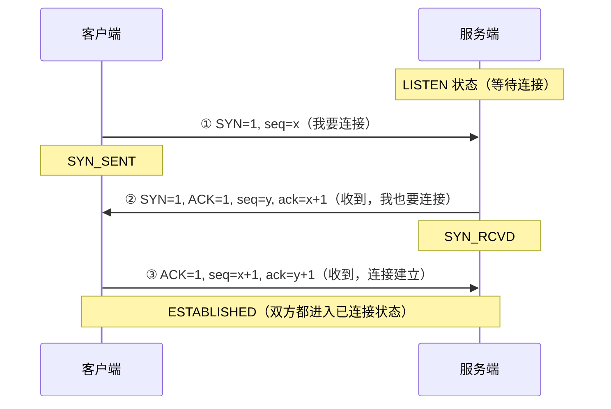
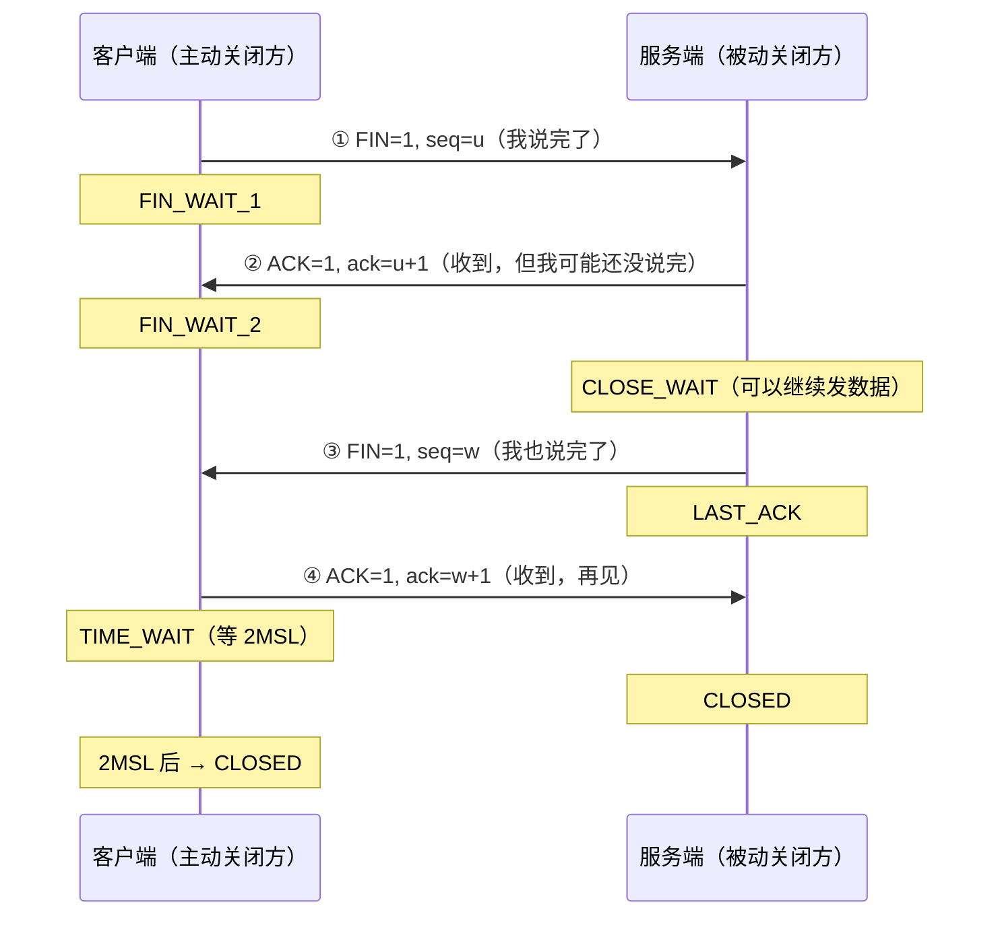
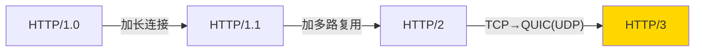
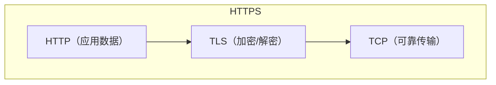
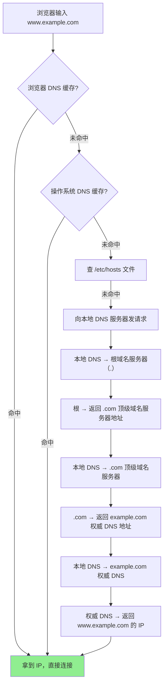
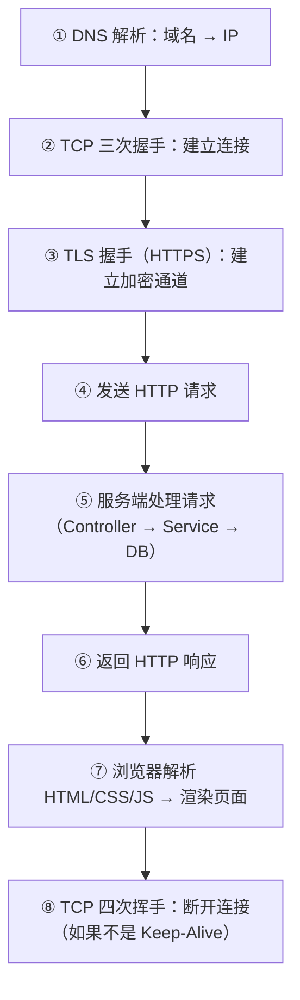

# 附录 A2：网络协议基础——面试必考的协议与分层

> TCP 三次握手、四次挥手、HTTP 状态码——这些是后端面试的基础题，几乎每轮都会问到。
> 本章集中讲透网络协议的核心知识点，被 [网络 IO 模型](./06-网络IO模型.md)、[缓存与 Redis](./08-缓存与Redis.md)、[高可用架构](./07-高可用架构.md)、[微服务](./14-微服务与分布式锁.md) 等多个章节引用。

---

## 一、网络分层模型——先搞清「谁在哪一层干什么」

面试经常问「OSI 七层 vs TCP/IP 四层」，其实只需要记住 TCP/IP 四层就够了，OSI 七层是理论模型，实际没人按七层实现。

| TCP/IP 四层 | 对应 OSI 层 | 职责 | 典型协议 | 后端类比 |
|------------|-----------|------|---------|---------|
| **应用层** | 应用+表示+会话 | 定义数据格式和业务语义 | HTTP、HTTPS、DNS、gRPC、Redis 协议 | 你写的 Controller 层 |
| **传输层** | 传输层 | 端到端可靠传输（或不可靠） | TCP、UDP | 快递公司（保证送到 or 尽力而为） |
| **网络层** | 网络层 | 寻址和路由（IP 地址） | IP、ICMP | 导航系统（规划路线） |
| **网络接口层** | 数据链路+物理层 | 物理传输（网卡、网线、Wi-Fi） | Ethernet、ARP | 公路和卡车（实际运输） |

> 一句话：**应用层定义「说什么」，传输层保证「送到」，网络层负责「怎么走」，接口层负责「实际跑」**。

---

## 二、TCP 三次握手——建立连接

### 2.1 为什么要握手？

TCP 是**面向连接**的协议——通信前双方必须先建立连接，确认彼此都能收发数据。这就像打电话，你不会对着话筒直接说事情，而是先确认「喂，能听到吗？」「能听到，你呢？」「我也能听到，开始说吧」。

### 2.2 三次握手流程



| 步骤 | 谁发 | 发什么 | 确认了什么 |
|------|------|--------|-----------|
| ① | 客户端 → 服务端 | SYN（同步序列号） | 客户端的发送能力 |
| ② | 服务端 → 客户端 | SYN + ACK | 服务端的收发能力 |
| ③ | 客户端 → 服务端 | ACK | 客户端的接收能力 |

三次之后，双方都确认了：**自己能发、对方能收；对方能发、自己能收**——四个方向都通了。

### 2.3 为什么是三次，不是两次？

两次握手的问题：**防止历史连接**。

假设客户端发了一个 SYN（连接请求），但这个包在网络中走了很久才到达服务端（可能客户端早就断线重连了）。如果只有两次握手，服务端收到这个过期的 SYN 就直接建立连接 → 白白浪费资源。

三次握手的第三步就是客户端告诉服务端：「这个连接请求确实是我刚刚发的，不是过期的旧包」。如果是旧包，客户端不会发第三步 ACK → 服务端超时释放 → 问题解决。

<details>
<summary><b>展开：面试追问——三次握手能携带数据吗？</b></summary>

前两次（SYN、SYN+ACK）**不能**携带应用数据——因为连接还没建立，携带数据会被恶意利用（SYN Flood 攻击时服务端还要存数据就更惨了）。

第三次（ACK）**可以**携带数据——此时客户端已经确认连接建立了，带点数据过去没问题。实际上 TCP Fast Open（TFO）就是利用这一点来减少延迟的。

</details>

---

## 三、TCP 四次挥手——断开连接

### 3.1 为什么断开需要四次？

建立连接是双方同时同意，但断开连接可以**一方先断**——你说完了，但对方可能还没说完。这就产生了**半关闭（Half-Close）** 状态：一个方向已关闭，另一个方向还在传数据。

### 3.2 四次挥手流程



关键在于步骤 ②③ 没有合并——服务端收到 FIN 后只是说"知道了"（ACK），但自己可能还有数据要发。等发完了，才发自己的 FIN（步骤③）。所以是 4 次而不是 3 次。

### 3.3 TIME_WAIT——为什么要等 2MSL？

MSL（Maximum Segment Lifetime）是报文在网络中的最大生存时间，Linux 上通常是 60 秒，所以 2MSL = 120 秒。

等待 2MSL 的原因有两个：

**原因 1：确保最后一个 ACK 到达**。如果客户端发的最后一个 ACK（步骤④）丢了，服务端会重发 FIN → 客户端在 TIME_WAIT 期间还能收到并重发 ACK。如果不等就直接关了，服务端会一直重发 FIN 没人理。

**原因 2：确保旧连接的残留包消失**。等 2MSL 保证网络中属于这次连接的所有包都已经过期消失了，这样新建的连接不会收到旧包的干扰。

<details>
<summary><b>展开：线上常见问题——大量 TIME_WAIT 怎么办？</b></summary>

高并发短连接场景下（比如 HTTP 1.0 每次请求都新建连接），**主动关闭方**会产生大量 TIME_WAIT 状态的连接，占用端口和内存。

常见应对手段：

| 方案 | 做法 | 风险 |
|------|------|------|
| **使用长连接** | HTTP 1.1 默认 Keep-Alive，连接复用 | 最佳方案，无风险 |
| **连接池** | 数据库/Redis 连接池复用连接 | 最佳方案，无风险 |
| `net.ipv4.tcp_tw_reuse=1` | 允许复用 TIME_WAIT 的端口（需开启 TCP 时间戳） | 风险低，推荐 |
| `net.ipv4.tcp_tw_recycle=1` | 快速回收 TIME_WAIT | **NAT 环境下会丢包，Linux 4.12 已移除，不要用** |
| 缩短 `tcp_fin_timeout` | 减少 FIN_WAIT_2 的等待时间 | 不影响 TIME_WAIT，常被误解 |

> 面试一句话：大量 TIME_WAIT 首选**长连接/连接池**，内核参数优先用 `tw_reuse`，**绝对不要用 `tw_recycle`**。

</details>

---

## 四、TCP vs UDP

| 维度 | TCP | UDP |
|------|-----|-----|
| 连接 | 面向连接（三次握手） | 无连接（直接发） |
| 可靠性 | 可靠（确认、重传、排序） | 不可靠（发了就不管） |
| 有序性 | 保证顺序 | 不保证顺序 |
| 速度 | 较慢（握手 + 确认开销） | 快（无额外开销） |
| 传输方式 | 字节流 | 数据报（一个包一个单位） |
| 头部大小 | 20 字节 | 8 字节 |
| 适用场景 | 网页、文件传输、数据库连接 | 视频直播、游戏、DNS 查询 |
| 典型协议 | HTTP/HTTPS、FTP、MySQL 协议、Redis 协议 | DNS、DHCP、RTP（实时音视频） |

> 一句话：**要可靠选 TCP，要快选 UDP**。大多数后端场景都用 TCP（HTTP/数据库/缓存），实时音视频和游戏用 UDP。

---

## 五、HTTP 协议

### 5.1 HTTP 请求结构

一个 HTTP 请求由三部分组成：

```
POST /api/users HTTP/1.1          ← 请求行（方法 + 路径 + 版本）
Host: example.com                 ← 请求头（一堆 Key: Value）
Content-Type: application/json
Authorization: Bearer xxx

{"name": "张三", "age": 28}       ← 请求体（POST/PUT 才有）
```

对 Java 后端来说：请求行 → `@PostMapping("/api/users")`，请求头 → `@RequestHeader`，请求体 → `@RequestBody`。

### 5.2 HTTP 版本演进

| 版本 | 关键特性 | 解决的问题 |
|------|---------|-----------|
| **HTTP/1.0** | 每次请求新建 TCP 连接 | 无（基础版本） |
| **HTTP/1.1** | **Keep-Alive 长连接**（默认）、管道化、分块传输、Host 头 | 减少 TCP 握手开销 |
| **HTTP/2** | **多路复用**（一个 TCP 连接并行传多个请求）、头部压缩（HPACK）、服务端推送、二进制帧 | 解决 1.1 的队头阻塞 |
| **HTTP/3** | 基于 **QUIC**（UDP 上实现可靠传输）、0-RTT 建连 | 解决 TCP 本身的队头阻塞 |



面试最常问的是 **HTTP/1.1 → 2 的多路复用**：HTTP/1.1 虽然有长连接，但同一连接上的请求是串行的（第一个请求没回来，第二个就得等），这叫**队头阻塞（Head-of-Line Blocking）**。HTTP/2 把请求拆成二进制帧，多个请求的帧可以交错在同一个 TCP 连接上传输，互不阻塞。

### 5.3 HTTPS = HTTP + TLS

HTTPS 就是在 HTTP 和 TCP 之间加了一层 **TLS（Transport Layer Security）** 加密：



TLS 握手的核心流程（简化版）：客户端发起 → 服务端发证书（含公钥）→ 客户端验证证书、用公钥加密一个随机数发回 → 双方用这个随机数生成对称密钥 → 后续通信都用对称加密。**非对称加密交换密钥，对称加密传输数据**——兼顾安全和性能。

### 5.4 HTTP 状态码速查

| 状态码 | 含义 | 后端开发常见场景 |
|--------|------|----------------|
| **200** | OK，请求成功 | 正常返回 |
| **201** | Created，资源已创建 | POST 创建成功 |
| **204** | No Content，成功但无返回体 | DELETE 成功 |
| **301** | 永久重定向 | 旧域名跳新域名 |
| **302** | 临时重定向 | 登录后跳转 |
| **304** | Not Modified，使用缓存 | 浏览器缓存命中 |
| **400** | Bad Request，请求参数错误 | 参数校验失败 |
| **401** | Unauthorized，未认证 | 没有登录/Token 过期 |
| **403** | Forbidden，无权限 | 已登录但权限不够 |
| **404** | Not Found，资源不存在 | URL 写错、资源被删 |
| **405** | Method Not Allowed | GET 接口用了 POST |
| **500** | Internal Server Error | 代码抛异常没捕获 |
| **502** | Bad Gateway | Nginx 转发到后端，后端挂了 |
| **503** | Service Unavailable | 服务过载/维护中 |
| **504** | Gateway Timeout | Nginx 转发到后端，后端超时 |

> 面试口诀：**2xx 成功、3xx 重定向、4xx 客户端错误、5xx 服务端错误**。

### 5.5 WebSocket——基于 TCP 的全双工长连接

HTTP 是「请求-响应」模型：客户端不问，服务端就不能主动推数据。轮询（Polling）虽然能凑合，但每次都要重新建连、带完整头部，延迟高、开销大。WebSocket 就是为了解决这个问题而设计的。

**协议定位**：WebSocket 是一个**应用层协议**，传输层跑在 **TCP** 之上（和 HTTP 同级，不是 HTTP 的子集）。它的协议标识是 `ws://`（明文）和 `wss://`（TLS 加密，对应 HTTPS）。

**握手过程**——借 HTTP 的壳升级协议：

```
客户端发送 HTTP 请求，带升级头：
GET /chat HTTP/1.1
Host: server.example.com
Upgrade: websocket          ← 请求升级到 WebSocket
Connection: Upgrade
Sec-WebSocket-Key: dGhlIHNhbXBsZSBub25jZQ==

服务端同意升级，返回 101：
HTTP/1.1 101 Switching Protocols   ← 101 = 协议切换成功
Upgrade: websocket
Connection: Upgrade
Sec-WebSocket-Accept: s3pPLMBiTxaQ9kYGzzhZRbK+xOo=
```

握手完成后，这条 TCP 连接就**不再走 HTTP 协议**，变成 WebSocket 帧格式的全双工通道——客户端和服务端可以随时互发消息，不需要等对方先说话。

**WebSocket vs HTTP Keep-Alive vs 短连接**：

| 特性 | HTTP 短连接 | HTTP Keep-Alive | WebSocket |
|------|-----------|----------------|-----------|
| 连接生命周期 | 一次请求后关闭 | 多次请求复用同一条 TCP | 持续保持直到一方关闭 |
| 通信方向 | 单向（客户端→服务端） | 单向（客户端→服务端） | **双向**（全双工） |
| 服务端能否主动推送 | 不能 | 不能 | **能** |
| 头部开销 | 每次完整 HTTP 头 | 每次完整 HTTP 头 | 握手后仅 2-14 字节帧头 |
| 适用场景 | 简单查询 | 普通网页浏览 | 实时推送、聊天、行情 |

Keep-Alive 解决的是「TCP 连接复用」——省了反复三次握手的开销，但通信模型仍然是客户端发一个请求、服务端回一个响应，服务端不能主动推。WebSocket 彻底打破了这个限制。

**典型使用场景**：在线聊天（微信网页版）、股票/加密货币实时行情、多人协同编辑（如在线文档）、游戏实时同步、服务端日志推送。

<details>
<summary><b>展开：WebSocket 的帧格式与心跳机制</b></summary>

WebSocket 连接建立后，数据以**帧（Frame）**为单位传输，每个帧有一个极小的头部（最少 2 字节），包含 opcode（文本帧 0x1 / 二进制帧 0x2 / 关闭帧 0x8 / Ping 0x9 / Pong 0xA）、负载长度、掩码等字段。相比 HTTP 每次请求都带几百字节的头部，WebSocket 的帧头开销几乎可以忽略。

**心跳机制**：TCP 连接如果长时间没有数据传输，中间的 NAT/防火墙/负载均衡器可能会把它当作死连接而关闭。WebSocket 协议内置了 Ping/Pong 帧来保活——一方发 Ping，另一方必须回 Pong。如果一方在超时时间内没收到 Pong，就认为连接已断，触发重连逻辑。

**与 SSE（Server-Sent Events）的对比**：SSE 也能实现服务端主动推送，但它是基于 HTTP 的单向推送（只有服务端→客户端），且只支持文本格式。如果只需要服务端单向推送（如新闻推送、通知），SSE 更简单；如果需要双向通信，WebSocket 是唯一选择。

</details>

---

## 六、DNS 解析——从域名到 IP

你在浏览器输入 `www.example.com`，到底怎么找到服务器 IP 的？



查找顺序：**浏览器缓存 → 系统缓存 → hosts 文件 → 本地 DNS → 根域名 → 顶级域名 → 权威 DNS**。实际中大部分请求在前几层就命中缓存了，不会真的走到根域名服务器。

---

## 七、经典面试题：从输入 URL 到页面展示发生了什么？

这是一道综合题，把上面所有知识串起来：



面试时按这个顺序说，每一步都能展开聊。DNS 对应本章第六节，TCP 握手对应第二节，HTTP 对应第五节，浏览器渲染对应 [01-三件套速成](../part2-frontend-core/01-三件套速成.md) 中的浏览器渲染流水线。

---

## 本篇小结

| 知识点 | 核心要点 | 面试频率 |
|--------|---------|---------|
| **TCP 三次握手** | SYN → SYN+ACK → ACK，防历史连接 | ★★★★★ |
| **TCP 四次挥手** | FIN → ACK → FIN → ACK，半关闭状态 | ★★★★★ |
| **TIME_WAIT** | 等 2MSL，确保 ACK 到达 + 旧包消失 | ★★★★ |
| **TCP vs UDP** | 可靠/不可靠，连接/无连接 | ★★★★ |
| **HTTP 版本** | 1.0 短连接 → 1.1 长连接 → 2 多路复用 → 3 QUIC | ★★★★★ |
| **HTTPS** | HTTP + TLS，非对称换密钥 + 对称传数据 | ★★★★ |
| **状态码** | 2xx 成功/3xx 重定向/4xx 客户端/5xx 服务端 | ★★★★★ |
| **DNS** | 域名 → 缓存 → 根 → 顶级 → 权威 → IP | ★★★ |
| **网络分层** | 应用/传输/网络/接口四层 | ★★★ |

---

**相关章节**：

- [3.6 网络 IO 模型](./06-网络IO模型.md)——TCP 连接建立后，如何高效读写数据（BIO/NIO/epoll/Reactor）
- [3.7 高可用架构](./07-高可用架构.md)——超时/重试/熔断等机制都建立在 TCP 连接之上
- [3.8 缓存与 Redis](./08-缓存与Redis.md)——Redis 协议基于 TCP，Pipeline 减少 RTT
- [3.14 微服务与分布式锁](./14-微服务与分布式锁.md)——gRPC（HTTP/2）、服务间通信选型
- [2.1 三件套速成](../part2-frontend-core/01-三件套速成.md)——浏览器渲染流水线（URL 到页面的最后一步）
