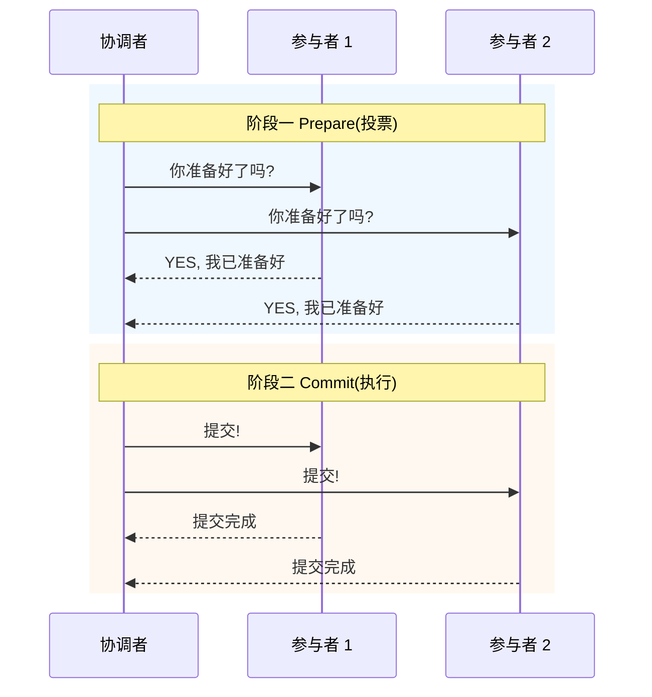
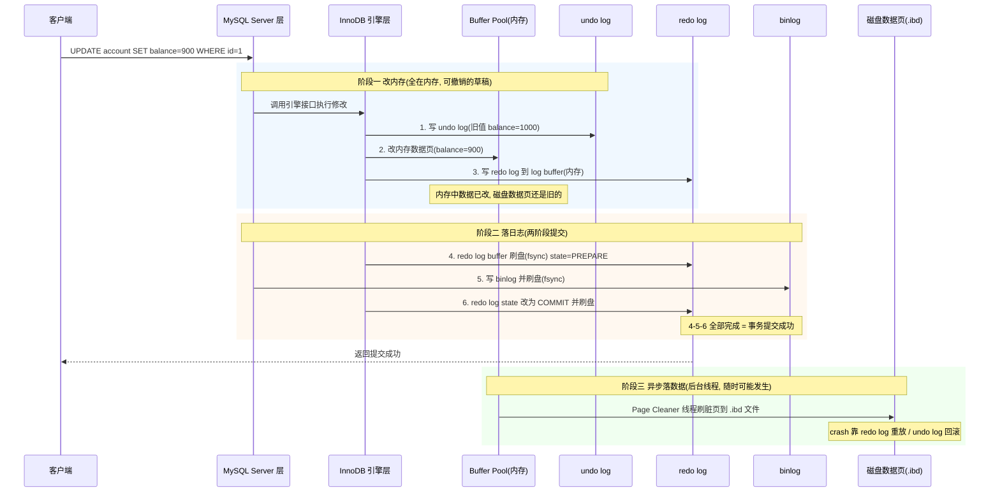
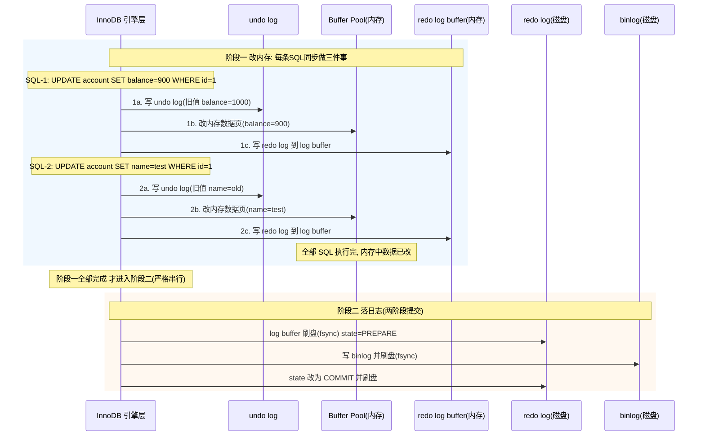
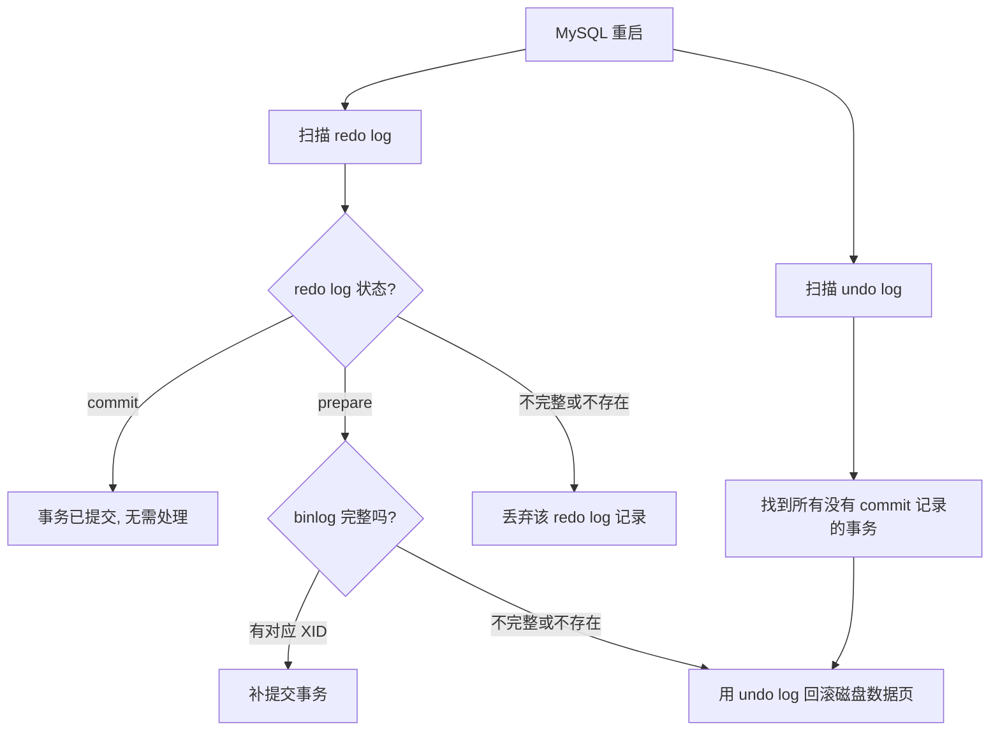
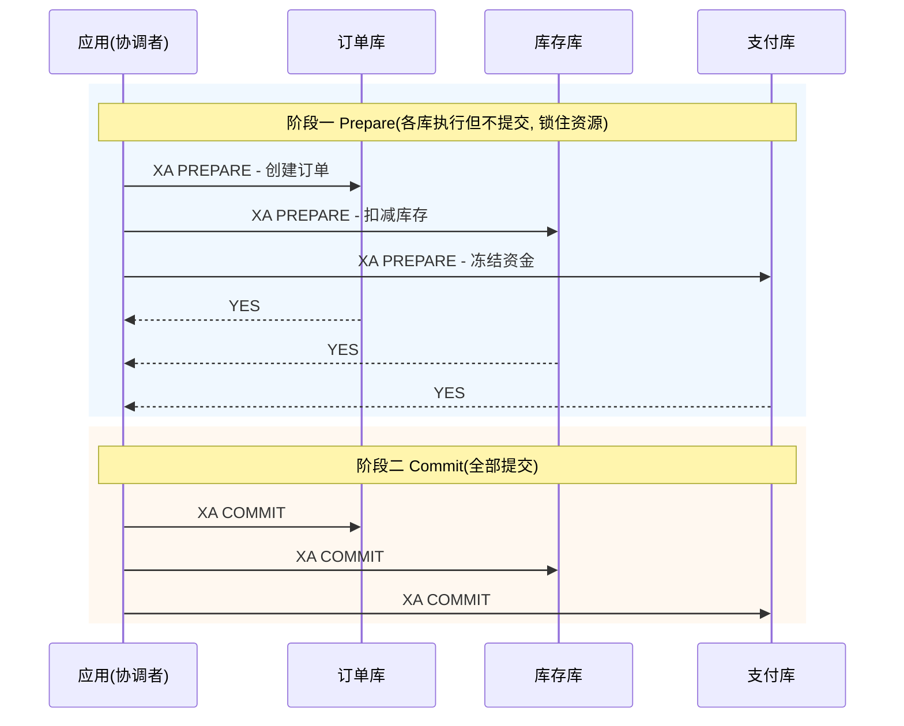
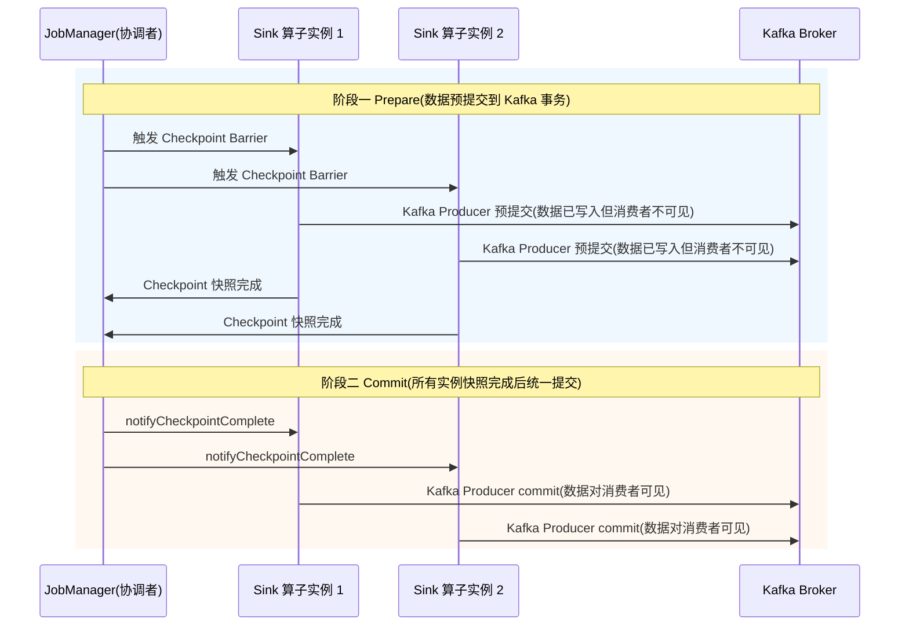

# 附录 A3：两阶段提交（2PC）——一个思想，三个战场

> **两阶段提交**（Two-Phase Commit, 2PC）不是某个具体技术的专利——它是一种**通用的协调协议**：先让所有参与者准备好（Prepare），确认都准备好了再统一提交（Commit）。这个思想在数据库内部、分布式系统、流计算引擎中反复出现，只是「参与者」不同、「准备」的含义不同。

---

## 一、2PC 的核心思想：先投票，再执行

不管应用在什么场景，2PC 的骨架永远是两步：



如果阶段一有任何参与者回复 NO（或超时），协调者就通知所有人回滚。关键约束是：**参与者在回复 YES 之后、收到 Commit/Rollback 之前，必须保持"准备好"的状态不变**——资源已锁定、日志已落盘、随时可以提交也可以回滚。

这个骨架在三个战场上的具体表现如下。

---

## 二、战场一：MySQL 内部——redo log 与 binlog 的一致性

### 2.1 为什么 MySQL 内部需要 2PC？

MySQL 有两个独立的日志系统：InnoDB 引擎层的 **redo log** 和 Server 层的 **binlog**。redo log 保证单机 crash-safe（持久性），binlog 保证主从复制。这两份日志必须保持一致——要么都算提交，要么都算没提交。否则主库用 redo log 恢复的数据和从库用 binlog 同步的数据就会不一致。

### 2.2 谁是协调者？谁是参与者？

| 角色 | 对应组件 |
|------|---------|
| 协调者 | MySQL Server 层（事务提交流程的控制者） |
| 参与者 1 | InnoDB 引擎（redo log） |
| 参与者 2 | MySQL Server 层自身（binlog） |

### 2.3 完整流程：改内存 → 落日志 → 异步落数据

一个事务从执行到提交分为三个阶段。阶段一和阶段二严格串行，阶段三与前两者完全异步解耦：



如果一个事务包含**多条 SQL**，阶段一内部每条 SQL 同步做三件事（写 undo → 改数据页 → 写 redo log buffer），全部 SQL 执行完才进入阶段二：



### 2.4 两阶段提交只在 crash 恢复时生效

需要明确一点：prepare/commit 状态**只在 MySQL crash 后重启时才会被用到**。正常运行时事务顺畅走完 4→5→6 三步，prepare 状态只在磁盘上停留极短时间。只有 crash 重启时恢复程序才需要扫描 redo log 看每个事务"停在哪一步了"，然后裁决提交还是回滚。crash 后未提交成功的事务不会被 MySQL 自动重新执行，重试是**应用层的责任**。

### 2.5 刷盘与 prepare/commit 状态

**刷盘（flush to disk）** 分两步：第一步 `write()`，把数据从 log buffer 写到 OS page cache（还在内存，断电丢失）；第二步 `fsync()`，强制写到物理磁盘（安全）。通常说的"刷盘"指两步都完成。

**prepare / commit** 是 redo log 记录中的一个**状态字段（state）**，写在磁盘上的日志文件里。crash 重启后 InnoDB 扫描 redo log 文件，读到 state 字段就能判断每个事务走到了哪一步。

<details>
<summary><b>展开：innodb_flush_log_at_trx_commit 刷盘策略</b></summary>

MySQL 用 `innodb_flush_log_at_trx_commit` 参数控制 redo log 的刷盘时机：

| 值 | 行为 | 安全性 | 性能 |
|---|------|--------|------|
| **1**（默认） | 每次事务提交都 fsync | 最安全，不丢数据 | 最慢 |
| **2** | 每次提交只 write 到 OS 缓存，不 fsync | MySQL 崩了不丢，**OS 崩了丢最近 1 秒** | 较快 |
| **0** | 连 write 都不做，靠后台线程每秒刷一次 | MySQL 崩了也**丢最近 1 秒** | 最快 |

生产环境必须设为 **1**。只有在允许少量数据丢失的场景（如批量导入）才考虑临时改为 2。

</details>

### 2.6 crash 恢复：六种场景逐一分析

恢复程序有两条并行路径：扫描 redo log 处理 PREPARE/COMMIT 状态，以及扫描 undo log 兜底清理未提交事务。



下面逐一分析每个步骤 crash 后会怎样处理：

**场景一：阶段一（改内存）执行过程中 crash**

redo log 还在 log buffer（内存），什么都没落盘。恢复程序扫描 redo log 时根本找不到这个事务——在 redo log 视角它「不存在」。但 Page Cleaner 后台线程可能已经把脏页刷到了磁盘。怎么办？恢复程序还有第二条路：**扫描 undo log，找到所有「没有对应 redo log commit 记录」的事务，统一用 undo log 回滚磁盘数据页**。这是一个兜底机制，不依赖 redo log 是否存在。如果脏页恰好没刷过，磁盘本身就是旧值，回滚等于没效果但也不会出错。

**场景二：redo log prepare 写了一半 crash（prepare 不完整）**

重启后扫描 redo log，发现这条日志不完整（校验和不对）→ 丢弃这条 redo log 记录，在 redo log 视角这个事务同样「不存在」。数据页的恢复走的和场景一一样的兜底路径：**扫描 undo log → 发现这个事务没有 commit 记录 → 用 undo log 回滚磁盘数据页**。

注意场景一、二和场景三、四的**判断路径不同**：场景一二的 redo log 不完整或不存在，恢复程序是通过 undo log 兜底扫描发现未提交事务的；场景三四的 redo log prepare 是完整的，恢复程序能读到 PREPARE 状态，会主动去查 binlog 来裁决提交还是回滚。但最终的数据页处理方式是一样的——都是用 undo log 执行反向操作。undo log 在阶段一执行时就已经落盘（它本身的持久化也是通过 redo log 保护的），所以 crash 后 undo log 是完整可用的。

**场景三：redo log prepare 写完，binlog 还没写就 crash**

重启后扫描 redo log，发现 state=PREPARE → 去查 binlog，找不到对应的 XID → **回滚事务**。

这里的「回滚」回滚的是**磁盘上的数据页（.ibd 文件）**——它可能已经被 Page Cleaner 刷过了。后台线程不管事务有没有提交，只要 Buffer Pool 有脏页就可能刷盘。恢复程序必须统一处理：**用 undo log 对磁盘数据页执行反向操作**（把 balance 从 900 改回 1000）。如果脏页恰好没刷过，磁盘上还是旧值 1000，undo log 再改一遍 1000→1000 等于没效果但也不会出错。不管刷没刷过都统一执行一遍，简单可靠。

主库数据回到旧值，从库的 binlog 里也没有这条变更 → **主从一致** ✅

**场景四：redo log prepare 写完，binlog 写了一半 crash（binlog 不完整）**

重启后扫描 redo log，发现 state=PREPARE → 去查 binlog，发现有记录但不完整（校验和/长度不对）→ **回滚事务**。效果同场景三 → **主从一致** ✅

**场景五：redo log prepare 写完，binlog 完整写完，redo log commit 还没写就 crash**

重启后扫描 redo log，发现 state=PREPARE → 去查 binlog，发现有完整的对应 XID → **补提交事务**（把 redo log 标记为 COMMIT）。为什么敢补提交？因为 binlog 已经完整落盘了，从库可能已经同步了这条变更，如果主库回滚就会造成主从不一致。所以此时必须提交 → **主从一致** ✅

**场景六：redo log commit 写完（全部完成）**

事务已提交，一切正常。即使此时 crash，重启后扫描 redo log 发现 state=COMMIT → **无需任何处理** ✅

| crash 时机 | redo log 状态 | binlog 状态 | 恢复策略 | 结果 |
|-----------|--------------|------------|---------|------|
| 阶段一执行中 | 不存在（还在内存） | 不存在 | **undo log 回滚**（脏页可能已刷盘） | 主从一致 |
| prepare 写一半 | 不完整 | 不存在 | **undo log 回滚**（脏页可能已刷盘） | 主从一致 |
| prepare 写完 | PREPARE | 不存在 | **回滚** | 主从一致 |
| binlog 写一半 | PREPARE | 不完整 | **回滚** | 主从一致 |
| binlog 写完 | PREPARE | 完整 | **补提交** | 主从一致 |
| commit 写完 | COMMIT | 完整 | 无需处理 | 正常 |

> 不管在哪个步骤 crash，两阶段提交都能保证 redo log 和 binlog 的逻辑一致——要么都算提交，要么都算没提交。prepare 状态的价值在于：给恢复程序一个"中间判断点"，让系统可以根据 binlog 是否完整来做最终裁决。

<details>
<summary><b>展开：面试追问「如果不用两阶段提交，只按顺序写两个日志会怎样？」</b></summary>

**先写 redo log 再写 binlog**：redo log 写完、binlog 没写完时 crash → 主库用 redo log 恢复了数据（balance=900），但从库用 binlog 同步时少了这条变更（balance 还是 1000）→ **主从不一致**。

**先写 binlog 再写 redo log**：binlog 写完、redo log 没写完时 crash → 主库重启后数据丢失（redo log 没记录，balance 还是 1000），但从库已经同步了 binlog（balance=900）→ **主从不一致**。

所以必须引入两阶段提交，用 redo log 的 prepare/commit 状态把两份日志"原子绑定"——要么都算提交，要么都算没提交。

</details>

---

## 三、战场二：分布式系统——跨服务的事务协调

### 3.1 为什么分布式系统需要 2PC？

微服务拆分后，一个"下单"操作可能横跨订单服务（order_db）、库存服务（inventory_db）、支付服务（payment_db）三个独立数据库。你没法用一个 `BEGIN...COMMIT` 把它们包起来了。2PC 在这里的作用是：引入一个协调者，让三个数据库"要么一起提交，要么一起回滚"。

### 3.2 谁是协调者？谁是参与者？

| 角色 | 对应组件 |
|------|---------|
| 协调者 | 事务管理器（如 Seata TC、应用服务器的 JTA 实现） |
| 参与者 | 各个数据库实例（通过 XA 协议参与） |

### 3.3 完整流程



如果阶段一有任何一个库回复 NO（比如库存不足），协调者就通知所有库 XA ROLLBACK。

### 3.4 与 MySQL 内部 2PC 的对比

| 维度 | MySQL 内部 2PC | 分布式 2PC |
|------|---------------|-----------|
| **协调的对象** | 同一个 MySQL 实例内的两个日志系统 | 跨网络的多个独立数据库 |
| **通信方式** | 进程内函数调用（极快） | 网络 RPC（有延迟、有丢包） |
| **Prepare 的含义** | redo log 落盘并标记 state=PREPARE | 各数据库执行事务但不提交，锁住行/资源 |
| **最大风险** | crash 后通过日志恢复，影响范围是单机 | 协调者挂了 → 参与者不知道提交还是回滚 → 资源被无限期锁定 |
| **阻塞问题** | 不存在（单进程内部同步完成） | 严重——Prepare 到 Commit 之间所有参与者持锁等待 |

### 3.5 分布式 2PC 的致命问题

| 问题 | 说明 |
|------|------|
| **同步阻塞** | Prepare 到 Commit 之间，所有参与者持有锁不释放，其他事务被阻塞 |
| **协调者单点** | 协调者挂了，参与者不知道该提交还是回滚，资源一直锁着 |
| **数据不一致** | 网络分区时，部分参与者收到 Commit、部分没收到 → 脑裂 |

这些问题催生了 TCC、Saga、本地消息表等"弱化版"方案，详见 [3.11 分布式事务](./11-分布式事务.md)。

<details>
<summary><b>展开：面试追问——协调者 Prepare 后挂了怎么办？</b></summary>

**场景**：协调者发完 Prepare 收到所有 YES，准备发 Commit，这时候挂了。

**后果**：参与者已经执行了事务、锁住了资源，但不知道该提交还是回滚。参与者互相之间不通信，谁也不知道别人的投票结果。资源被无限期锁定，系统卡死。

**缓解手段**（不是完美解决）：超时机制（参与者等待超时后自行回滚，但如果其他参与者已提交就不一致了）；协调者持久化日志（恢复后根据日志继续流程）；选举新协调者（通过一致性协议接管，但这本身又是一个分布式问题）。

这正是 2PC 的致命伤——**协调者是单点，一旦在关键时刻挂了，整个协议陷入不确定状态**。3PC 试图用超时机制缓解这个问题，但仍不完美，工程中很少使用。

</details>

---

## 四、战场三：Flink——Exactly-Once 的端到端保证

### 4.1 为什么 Flink 需要 2PC？

Flink 做流计算时，数据从 Source（如 Kafka）读入 → 经过算子处理 → 写到 Sink（如 Kafka/MySQL/文件系统）。Flink 内部通过 **Checkpoint 机制**保证状态的精确一次（Exactly-Once）。但如果 Sink 端不配合，可能出现：Flink 内部状态已回滚到 checkpoint，但 Sink 端的数据已经写出去了 → 数据重复。

2PC 在这里的作用是：让 Sink 端的写入和 Flink 的 Checkpoint "原子绑定"——要么都算提交，要么都算没提交。

### 4.2 谁是协调者？谁是参与者？

| 角色 | 对应组件 |
|------|---------|
| 协调者 | Flink 的 Checkpoint Coordinator（JobManager 中） |
| 参与者 | 各个 Sink 算子实例（如 Kafka Producer、JDBC Writer） |

### 4.3 完整流程：以 Kafka Sink 为例



### 4.4 Flink 的 TwoPhaseCommitSinkFunction

Flink 提供了一个抽象类 `TwoPhaseCommitSinkFunction`，封装了 2PC 的骨架，你只需要实现四个方法：

| 方法 | 阶段 | 职责 |
|------|------|------|
| `beginTransaction()` | 准备阶段开始 | 开启一个新的事务（如创建 Kafka 事务） |
| `preCommit()` | 阶段一 Prepare | 预提交——数据已写入但不可见（如 Kafka flush） |
| `commit()` | 阶段二 Commit | 正式提交——数据可见（如 Kafka commitTransaction） |
| `abort()` | 回滚 | 中止事务——丢弃预提交的数据 |

```java
// 伪代码：Kafka Exactly-Once Sink 的核心逻辑
public class KafkaExactlyOnceSink
    extends TwoPhaseCommitSinkFunction<String, KafkaTransaction, Void> {

    @Override
    protected KafkaTransaction beginTransaction() {
        // 创建新的 Kafka Producer 事务
        producer.beginTransaction();
        return new KafkaTransaction(producer);
    }

    @Override
    protected void preCommit(KafkaTransaction txn) {
        // 刷出所有缓冲的消息到 Kafka（但消费者还看不到）
        txn.getProducer().flush();
    }

    @Override
    protected void commit(KafkaTransaction txn) {
        // Checkpoint 完成后，正式提交 Kafka 事务
        txn.getProducer().commitTransaction();
    }

    @Override
    protected void abort(KafkaTransaction txn) {
        // Checkpoint 失败，中止 Kafka 事务
        txn.getProducer().abortTransaction();
    }
}
```

### 4.5 与 MySQL 内部 2PC、分布式 2PC 的对比

Flink 的 2PC 有一个关键不同：**它依赖外部系统的事务能力**。Kafka 0.11+ 才支持事务（事务 Producer），如果 Sink 端不支持事务（比如普通文件系统），就无法用 2PC 保证 Exactly-Once。

---

## 五、三个战场的统一对比

| 维度 | MySQL 内部 2PC | 分布式 2PC (XA) | Flink 2PC |
|------|---------------|----------------|-----------|
| **协调者** | MySQL Server 层 | 事务管理器（Seata TC / JTA） | Checkpoint Coordinator |
| **参与者** | redo log + binlog | 多个数据库实例 | 多个 Sink 算子实例 |
| **Prepare 含义** | redo log 落盘，state=PREPARE | 各库执行事务但不提交，锁住资源 | Sink 预提交数据（写入但不可见） |
| **Commit 含义** | redo log state=COMMIT | 各库正式 COMMIT | Sink 正式提交（数据可见） |
| **通信方式** | 进程内函数调用 | 网络 RPC | TaskManager 间 Barrier + RPC |
| **阻塞问题** | 无（单进程内部） | 严重（全局锁） | 较轻（Barrier 对齐有延迟） |
| **失败恢复** | 扫描 redo log + undo log | 协调者日志恢复 / 超时回滚 | 从 Checkpoint 恢复 + abort 预提交 |
| **解决的问题** | 两份日志的一致性 | 跨库的数据一致性 | 端到端 Exactly-Once |
| **典型实现** | InnoDB 内部 | MySQL XA / Seata XA / JTA | TwoPhaseCommitSinkFunction |

> **一句话总结**：2PC 的本质永远是"先让所有人准备好，确认都准备好了再统一提交"。MySQL 内部用它保证两份日志一致，分布式系统用它保证跨库一致，Flink 用它保证端到端 Exactly-Once。不同的只是参与者和通信方式。

---

## 本篇小结

| 你需要记住的 | 一句话 |
|-------------|--------|
| 2PC 的核心 | 先 Prepare（投票），全部 YES 再 Commit（执行） |
| MySQL 内部 2PC | redo log + binlog 两份日志的原子绑定，只在 crash 恢复时生效 |
| 分布式 2PC | 跨库事务的强一致方案，有同步阻塞和协调者单点问题 |
| Flink 2PC | Checkpoint + Sink 事务的原子绑定，保证端到端 Exactly-Once |
| 共同的弱点 | 都依赖协调者，协调者失败时都需要额外机制兜底 |
| 选型原则 | 单机用 MySQL 内部 2PC（自动的）；跨库优先考虑 TCC/Saga（2PC 阻塞太重）；流计算看 Sink 是否支持事务 |

---

**相关章节**：

- [3.9 数据库 MySQL](./09-数据库MySQL.md)——日志体系（redo log / undo log / binlog）的完整介绍
- [3.11 分布式事务](./11-分布式事务.md)——TCC、Saga、本地消息表等 2PC 的替代方案
- [3.12 消息队列](./12-消息队列.md)——Kafka 事务消息与 Exactly-Once
- [3.10 分布式理论与一致性](./10-分布式理论与一致性.md)——CAP/BASE 是分布式事务的理论基础
- [附录 A1：核心数据结构原理](./A1-核心数据结构原理.md)——一致性 Hash 等数据结构
