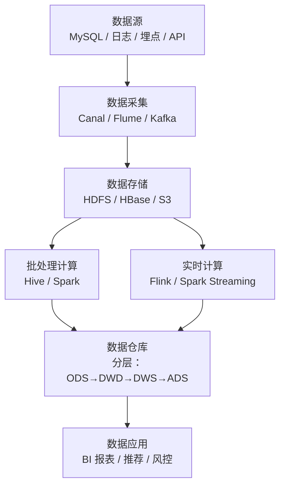

# 附录 A4：SQL 语言与数据处理——从查询优化到大数据入门

> **一句话定位**：[3.9 MySQL](./09-数据库MySQL.md) 讲的是数据库引擎的内部原理（索引、事务、锁），本附录聚焦**SQL 语言本身**——怎么写出正确、高效的 SQL，以及当数据量超出单机 MySQL 承载能力时，数据处理的技术栈如何演进。对于 Java 后端开发者来说，SQL 既是日常工具也是面试必考项，而大数据基础知识则是数据研发岗和高级后端岗的加分能力。

---

## 一、SQL 基础语法速查

### 1.1 SQL 执行顺序——和你写的顺序不一样

这是 SQL 最容易被忽视的知识点：SQL 的**书写顺序**和**逻辑执行顺序**完全不同。

```
书写顺序：SELECT → FROM → WHERE → GROUP BY → HAVING → ORDER BY → LIMIT
执行顺序：FROM → WHERE → GROUP BY → HAVING → SELECT → ORDER BY → LIMIT
```

```
① FROM + JOIN      确定数据来源（产生笛卡尔积后过滤 ON 条件）
② WHERE            行级过滤（在分组之前，不能用聚合函数）
③ GROUP BY         分组
④ HAVING           组级过滤（在分组之后，可以用聚合函数）
⑤ SELECT           选择列、计算表达式、去重 DISTINCT
⑥ ORDER BY         排序（可以用 SELECT 中的别名）
⑦ LIMIT            限制返回行数
```

> **面试意义**：理解执行顺序能解释很多"奇怪"的现象——比如 WHERE 中不能用 SELECT 的别名（因为 WHERE 在 SELECT 之前执行），但 ORDER BY 可以（因为 ORDER BY 在 SELECT 之后）。

### 1.2 JOIN 全家福

```
INNER JOIN      两边都有匹配才返回
LEFT JOIN       左表全部返回，右表没匹配的填 NULL
RIGHT JOIN      右表全部返回，左表没匹配的填 NULL
FULL OUTER JOIN 两边都全部返回（MySQL 不直接支持，用 UNION 模拟）
CROSS JOIN      笛卡尔积（M × N 行）
SELF JOIN       表和自己 JOIN
```

<details>
<summary><b>展开：JOIN 的底层实现——Nested Loop / Hash Join / Sort Merge Join</b></summary>

MySQL 的 JOIN 实现主要有三种算法：

**Nested Loop Join（嵌套循环）**：对外表的每一行，遍历内表找匹配。复杂度 O(M×N)。MySQL 默认使用的算法，但有优化变体（Block Nested-Loop Join，把外表数据批量加载到 join buffer 中减少内表扫描次数）。

**Hash Join（哈希连接，MySQL 8.0.18+）**：对较小的表建哈希表，然后扫描较大的表做探测。适合等值连接、无索引时，复杂度 O(M+N)。

**Sort Merge Join（排序合并）**：先对两张表按 JOIN key 排序，然后同时扫描合并。适合两张表都已按 JOIN key 排好序的场景。MySQL 原生不直接使用此算法，但在 ORDER BY + JOIN 的场景下优化器可能选择类似策略。

</details>

### 1.3 子查询 vs JOIN

面试常问："子查询和 JOIN 哪个快？"答案不绝对，但有经验规则：在 MySQL 中，**关联子查询（Correlated Subquery）通常比 JOIN 慢**，因为关联子查询对外表每一行都要执行一次内层查询。非关联子查询（独立子查询）优化器可能会转成 JOIN，性能差不多。

经验法则：能用 JOIN 就用 JOIN，避免关联子查询。

### 1.4 窗口函数（Window Functions）

窗口函数是 SQL 数据分析的利器，MySQL 8.0 开始支持。

```sql
-- 每个部门内按薪资排名
SELECT 
    name, department, salary,
    ROW_NUMBER() OVER (PARTITION BY department ORDER BY salary DESC) as rank_in_dept,
    RANK() OVER (PARTITION BY department ORDER BY salary DESC) as rank_with_ties,
    SUM(salary) OVER (PARTITION BY department) as dept_total
FROM employees;
```

| 函数 | 作用 |
|------|------|
| `ROW_NUMBER()` | 连续排名（1,2,3,4） |
| `RANK()` | 并列排名，跳号（1,1,3,4） |
| `DENSE_RANK()` | 并列排名，不跳号（1,1,2,3） |
| `LAG(col, n)` / `LEAD(col, n)` | 取前/后 n 行的值 |
| `SUM/AVG/COUNT() OVER(...)` | 窗口内聚合（不合并行） |
| `NTILE(n)` | 将结果均分为 n 组 |

---

## 二、SQL 查询优化——慢 SQL 排查实战

### 2.1 EXPLAIN 执行计划

`EXPLAIN` 是 SQL 优化的第一步——看优化器到底怎么执行你的 SQL。

```sql
EXPLAIN SELECT * FROM orders WHERE user_id = 100 AND status = 'paid';
```

| EXPLAIN 列 | 含义 | 关注什么 |
|------------|------|---------|
| `type` | 访问类型 | `ALL`（全表扫描）→ `index` → `range` → `ref` → `eq_ref` → `const`，越往右越好 |
| `key` | 实际使用的索引 | NULL 说明没走索引 |
| `rows` | 预估扫描行数 | 越少越好 |
| `Extra` | 附加信息 | `Using filesort`（额外排序）、`Using temporary`（临时表）是性能警报 |
| `filtered` | 过滤后剩余比例 | 越高说明索引选择性越好 |

### 2.2 索引失效六大场景

详见 [3.9 MySQL · 索引失效](./09-数据库MySQL.md)，这里做速查汇总：

```
① 在索引列上做函数/计算：WHERE YEAR(create_time) = 2024
② 隐式类型转换：WHERE varchar_col = 123（字符串列用数字匹配）
③ LIKE 左模糊：WHERE name LIKE '%三'
④ 联合索引不满足最左前缀：(a,b,c) 索引只查 b
⑤ OR 条件中有非索引列
⑥ 不等于（!=, <>）、IS NULL（视优化器判断）
```

### 2.3 慢 SQL 排查流程

```
① 开启慢查询日志：slow_query_log = ON, long_query_time = 1
② 定位慢 SQL：mysqldumpslow 分析日志
③ EXPLAIN 看执行计划
④ 优化思路：
   ├─ 加索引 / 调整联合索引顺序
   ├─ 改写 SQL（子查询 → JOIN、避免 SELECT *）
   ├─ 拆大查询（分页、分批处理）
   └─ 业务层优化（缓存、异步、读写分离）
⑤ 验证：再次 EXPLAIN + 实际执行时间对比
```

<details>
<summary><b>展开：深分页问题与优化方案</b></summary>

**问题**：`SELECT * FROM orders ORDER BY id LIMIT 1000000, 10` 看起来只取 10 条，实际上 MySQL 要扫描前 1000010 条然后丢弃前 100 万条，非常慢。

**方案一：游标分页（推荐）**

```sql
-- 记住上一页最后一条的 id，下次从它开始
SELECT * FROM orders WHERE id > 上一页最后id ORDER BY id LIMIT 10;
```

**方案二：延迟关联**

```sql
-- 先查 id（走索引覆盖，快），再回表取数据
SELECT o.* FROM orders o
INNER JOIN (SELECT id FROM orders ORDER BY id LIMIT 1000000, 10) AS t
ON o.id = t.id;
```

**方案三：业务限制**——限制最大翻页深度（Google 搜索结果也只显示约 30 页）。

</details>

---

## 三、SQL 实战高频题型

### 3.1 TopN 问题

```sql
-- 每个部门薪资前 3 的员工
SELECT * FROM (
    SELECT *, ROW_NUMBER() OVER (PARTITION BY dept_id ORDER BY salary DESC) as rn
    FROM employees
) t WHERE t.rn <= 3;
```

### 3.2 连续问题

```sql
-- 连续登录 3 天以上的用户
SELECT user_id FROM (
    SELECT user_id, login_date,
           login_date - INTERVAL ROW_NUMBER() OVER (PARTITION BY user_id ORDER BY login_date) DAY as grp
    FROM user_logins
) t
GROUP BY user_id, grp
HAVING COUNT(*) >= 3;
```

### 3.3 行转列 / 列转行

```sql
-- 行转列：CASE WHEN + 聚合
SELECT student_id,
    MAX(CASE WHEN subject = '数学' THEN score END) as math,
    MAX(CASE WHEN subject = '英语' THEN score END) as english
FROM scores GROUP BY student_id;
```

---

## 四、从 MySQL 到大数据——数据处理技术栈演进

### 4.1 为什么需要大数据技术？

当数据量增长到单机 MySQL 无法承载时（通常是亿级以上），需要分布式计算和存储：

| 瓶颈 | MySQL 的极限 | 大数据的解法 |
|------|-------------|-------------|
| 存储容量 | 单机磁盘上限 | HDFS 分布式文件系统，理论上无限扩展 |
| 查询速度 | 单表超 5000 万行开始变慢 | MapReduce / Spark 并行计算 |
| 实时处理 | 不适合流式数据 | Flink / Kafka Streams 实时计算 |
| 复杂分析 | SQL 能力有限 | Hive（SQL on Hadoop）、Spark SQL |

### 4.2 核心技术栈全景



### 4.3 数据仓库分层模型

| 层级 | 全称 | 作用 | 数据特点 |
|------|------|------|---------|
| **ODS** | Operational Data Store | 原始数据层，从业务库同步的原始数据 | 不做清洗，保留原貌 |
| **DWD** | Data Warehouse Detail | 明细数据层，清洗和标准化 | 一行一条业务事实 |
| **DWS** | Data Warehouse Summary | 汇总数据层，轻度聚合 | 按主题汇总（日活、GMV） |
| **ADS** | Application Data Service | 应用数据层，直接给报表/API 用 | 面向具体需求的宽表 |

### 4.4 核心组件简介

| 组件 | 定位 | 一句话 |
|------|------|--------|
| **HDFS** | 分布式文件系统 | 把大文件切成 128MB 块，分散存储到多台机器 |
| **Hive** | SQL on Hadoop | 用 SQL 查询 HDFS 上的数据，底层转成 MapReduce/Spark 任务 |
| **Spark** | 通用计算引擎 | 内存计算，比 MapReduce 快 10-100 倍 |
| **Flink** | 实时计算引擎 | 事件驱动、毫秒级延迟的流处理（也支持批处理） |
| **Kafka** | 消息队列/数据管道 | 详见 [3.12 消息队列](./12-消息队列.md) |
| **HBase** | 分布式列式数据库 | 十亿级行、百万级列的实时读写 |
| **ClickHouse** | 列式分析数据库 | OLAP 场景下极致的查询速度 |

<details>
<summary><b>展开：Hive SQL vs MySQL SQL 的主要差异</b></summary>

Hive SQL 语法和 MySQL SQL 高度相似，但底层完全不同（分布式计算 vs 单机数据库），有几个关键差异：

**数据类型差异**：Hive 支持复杂类型 `ARRAY`、`MAP`、`STRUCT`，MySQL 不支持。Hive 没有 `AUTO_INCREMENT`。

**执行方式**：MySQL 的 SQL 秒级返回，Hive 的 SQL 提交为 MapReduce/Spark 任务，可能要分钟级甚至更久。

**事务支持**：MySQL 完整 ACID 事务，Hive 3.0+ 有限支持 ACID（ORC 格式 + 分桶表）。

**索引**：MySQL 依赖 B+ 树索引，Hive 几乎不用传统索引（靠分区裁剪 + 列式存储 + 统计信息）。

**分区（PARTITION）**：Hive 的分区是物理目录（`/year=2024/month=06/`），查询时通过分区裁剪跳过无关数据，是 Hive 最重要的优化手段。

</details>

---

## 五、面试深度剖析：SQL 高频考点

### 考点 1：SQL 执行顺序

> **面试官**：「WHERE 里能用 SELECT 的别名吗？HAVING 呢？」

不能在 WHERE 中用 SELECT 的别名，因为执行顺序是 WHERE → SELECT。HAVING 在一些数据库中可以（MySQL 允许，PostgreSQL 不允许），但标准 SQL 不推荐。ORDER BY 一定可以用别名。

### 考点 2：GROUP BY 与 HAVING

> **面试官**：「WHERE 和 HAVING 有什么区别？」

WHERE 在分组前过滤行，不能用聚合函数；HAVING 在分组后过滤组，可以用聚合函数。执行顺序：WHERE → GROUP BY → HAVING。

### 考点 3：EXISTS vs IN

> **面试官**：「EXISTS 和 IN 哪个快？」

取决于内外表大小。经验规则：外表小、内表大用 `EXISTS`（外表驱动，每行检查内表有无匹配，内表有索引时很快）；外表大、内表小用 `IN`（内表结果集小，哈希查找快）。

### 考点 4：索引优化实战

> **面试官**：「给一个慢 SQL，你怎么优化？」

EXPLAIN → 看 type 是不是 ALL（全表扫描）→ 看 key 有没有走索引 → 看 rows 多不多 → 看 Extra 有没有 filesort/temporary → 针对性加索引/改写 SQL → 再 EXPLAIN 验证。

---

[← 附录 A3 两阶段提交](./A3-两阶段提交.md) | [返回本章目录](./README.md) | [附录 A5 ElasticSearch →](./A5-ElasticSearch.md)
