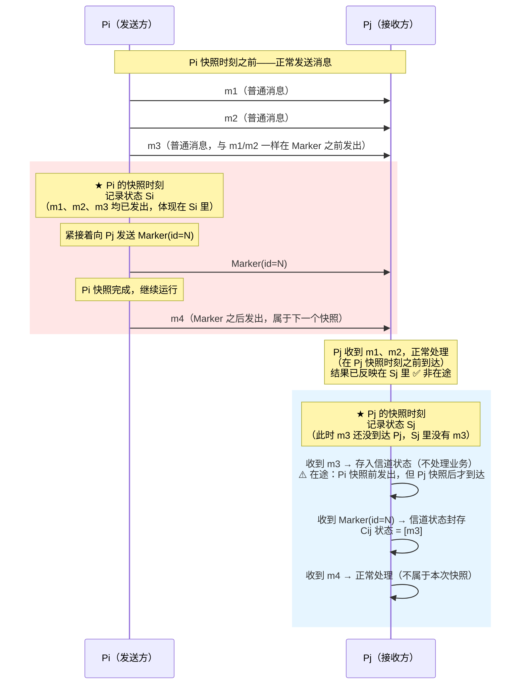
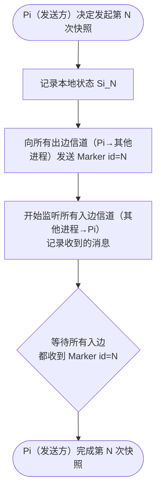
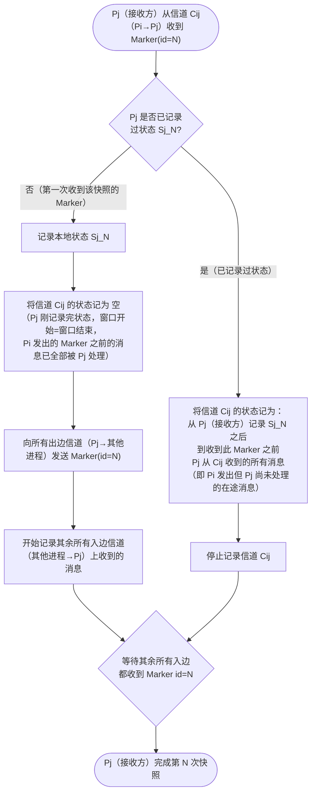
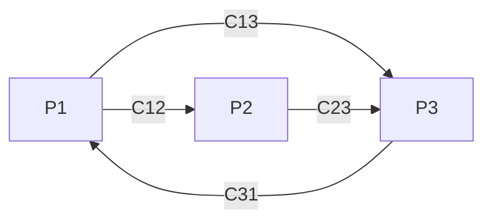
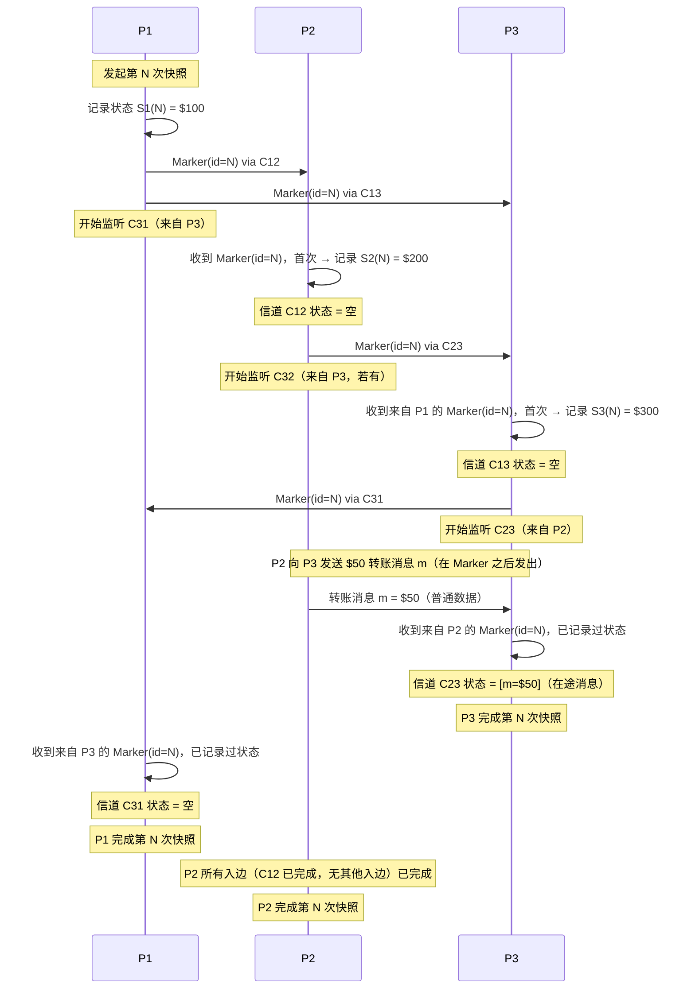

# A9 Chandy-Lamport 分布式快照算法

> **一句话定位**：Chandy-Lamport 算法解决的核心问题是——在一个持续运行、消息不断流动的分布式系统中，如何在**不暂停任何进程、没有全局时钟**的前提下，拍一张全局因果一致的"快照"。它是 Flink Checkpoint、分布式死锁检测、全局状态检测的理论基础。

> **📖 推荐学习顺序**
>
> 如果你是第一次接触这个算法，建议**先看 §7（Flink Barrier 机制）**，再回头看 §1–§6 的原始算法。
>
> 原因：Flink 的 DAG 是有向无环图，数据流方向固定，Barrier 从 Source 注入后自然流向所有算子，逻辑非常直观。原始 Chandy-Lamport 面对的是任意拓扑（可以有环），需要"收到 Marker 后主动转发给所有出边"来覆盖全图，理解起来更抽象。
>
> **先建立 Flink 的直觉，再理解原始算法为什么要那样设计，会顺畅很多。**

---

## 目录

- [一、问题背景：为什么需要全局快照](#一问题背景为什么需要全局快照)
- [二、关键概念澄清](#二关键概念澄清)
  - [2.1 没有"全局快照时刻"](#21-没有全局快照时刻)
  - [2.2 进程状态 Sj 是什么](#22-进程状态-sj-是什么)
  - [2.3 信道是什么，为什么有状态](#23-信道是什么为什么有状态)
  - [2.4 Marker(id=N) 消息](#24-markerid=n-消息)
  - [2.5 多个发起者并发时怎么办](#25-多个发起者并发时怎么办)
- [三、算法前提条件](#三算法前提条件)
- [四、算法步骤](#四算法步骤)
  - [4.1 发起者规则](#41-发起者规则)
  - [4.2 接收者规则](#42-接收者规则)
  - [4.3 快照何时完成](#43-快照何时完成)
- [五、完整示例（三节点演示）](#五完整示例三节点演示)
- [六、算法正确性分析](#六算法正确性分析)
- [七、Flink 的改进：Barrier 机制](#七flink-的改进barrier-机制)
- [八、与其他快照方案对比](#八与其他快照方案对比)
- [九、应用场景](#九应用场景)
- [十、参考资料](#十参考资料)

---

## 一、问题背景：为什么需要全局快照

分布式系统中，多个进程并发运行、通过消息通信。我们经常需要知道系统的"全局状态"，例如：

- **故障恢复**：系统崩溃后从某个一致的历史状态重启
- **死锁检测**：检查是否存在循环等待
- **垃圾回收**：检测分布式对象是否还有引用
- **调试诊断**：观察某一时刻的全局状态

**难点**：各节点没有共享时钟，无法在同一物理时刻"同时暂停"所有进程拍照。如果各自独立记录状态，可能出现**不一致快照**：

```
进程 P1 记录状态：已发送消息 M（余额 $50）
进程 P2 记录状态：未收到消息 M（余额 $200，未加上那 $50）
→ 快照中 M "凭空消失"，$50 不翼而飞，不一致！
```

Chandy-Lamport 算法（1985 年，K. Mani Chandy & Leslie Lamport）给出了一个优雅的解法：**用 Marker 消息在数据流中划出边界，让每个进程在自己的时间线上各自记录，最终拼出一张因果一致的全局快照**。

---

## 二、关键概念澄清

### 2.1 没有"全局快照时刻"

这是理解算法最容易出错的地方。

> **口语化说法说明**：后文偶尔会用"快照时刻"这个词，含义是"某个进程收到第一个 `Marker(id=N)` 、触发记录自己状态的那一刻"——每个进程各有各的时刻，**不是全局同步点**。

**Chandy-Lamport 算法不存在一个统一的"全局快照时刻"**——它的精妙之处恰恰是：各个进程在**不同的物理时间**各自记录自己的状态，没有全局同步点。

```
物理时间轴：
  P1: ──────[记录 S1, 10:00:01.003]──────────────────────────
  P2: ──────────────────[记录 S2, 10:00:01.017]──────────────
  P3: ──────────────────────────[记录 S3, 10:00:01.031]──────
```

三个进程记录状态的时间点完全不同，但算法保证这三份状态拼在一起是**因果一致的**（见第六节）。

**快照的开始与结束：**

| 阶段 | 触发方式 |
|------|----------|
| **开始** | 发起者（协调者）向所有出边信道发送 `Marker(id=N)`，第 N 次快照正式启动 |
| **进行中** | `Marker(id=N)` 在系统中传播，每个进程收到后记录自己的状态，并继续转发 |
| **结束** | 每个进程的所有入边信道都收到了 `Marker(id=N)` 后，该进程完成本次快照；协调者收到所有进程的完成通知，宣布第 N 次快照完成 |

多次快照（如 Flink 每分钟一次 Checkpoint）是多次独立运行的算法，产生独立的快照 N、N+1、N+2……

---

### 2.2 进程状态 Sj 是什么

**单次快照内，每个进程只记录一个状态 Sj**——即进程 Pj 收到第一个 `Marker(id=N)` 那一刻，自己内存中的完整状态（变量、计数器、缓冲区内容等）。

- **Sj 由 Pj 自己管理**：进程知道自己的状态是什么，算法只是触发"现在把状态记下来"这个动作
- **记录后冻结**：Sj 记录完毕后就不再更新，进程继续正常运行，但 Sj 代表的是那一刻的快照
- **多次快照产生多个版本**：第 N 次快照产生 Sj(N)，第 N+1 次产生 Sj(N+1)，彼此独立

> **类比**：Git commit 只记录那一刻的文件状态，之后继续开发不影响已有的 commit。多次 commit 产生多个版本，但每次 commit 本身只有一个快照。

---

### 2.3 信道是什么，为什么有状态

**信道（Channel）是一个抽象概念**，对应进程间的通信连接，物理上可以是：

- TCP socket 的发送/接收缓冲区
- 消息队列（如 Kafka topic partition）
- Unix pipe

**信道本身不是进程，也不主动维护状态**。所谓"信道 Cij 的状态"，是由**接收方 Pj 来记录的**——Pj 在特定时间窗口内，把从这条信道收到的消息记下来，这份记录就是"信道状态"。

> **角色约定**：本节及全文中，**Pi（发送方）** 是消息的发出进程，**Pj（接收方）** 是消息的接收进程，**信道 Cij** 是从 Pi 到 Pj 的单向通信链路。每次出现 Pi/Pj 时均遵循此约定。

**为什么需要记录信道状态？**

分布式系统的全局状态 = 所有进程的状态 + 所有**在途消息**。

这里"在途"是一个**快照语义上的概念**，不是说消息物理上永远在网络中飞：

> **在途消息** = 在 **Pi（发送方）的快照时刻**已经发出（反映在 Si 里），但在 **Pj（接收方）的快照时刻**还没被 Pj 处理（不在 Sj 里）的消息。

这些消息物理上**会到达 Pj（接收方）**，Pj 收到后把它们**存档为信道状态**，而不是直接处理。恢复时再重新消费，保证不丢不重。

用下面的时序图理解在途消息与非在途消息的区别（信道 Cij，Pi 为发送方，Pj 为接收方）：

> **关键结论**：m1、m2、m3 都是在 Pi 快照时刻**之前**发出的（Marker 之前发出），区分在途 vs 非在途的唯一标准是 **Pj 收到该消息的时刻** 相对于 **Pj 自己的快照时刻** 的先后。



**三类消息对比总结：**

| 消息 | Pi 发出时刻 | Pj 收到并处理的时刻 | 归属 |
|------|------------|-------------------|------|
| m1、m2 | Pi 快照**之前** | Pj 快照**之前** | 已在 Sj 里，**非在途** |
| **m3** | Pi 快照**之前** | Pj 快照**之后** | **在途**，存入信道状态 Cij |
| m4 | Pi 快照**之后** | — | 属于下一个快照，不记录 |

> **m1/m2/m3 都在 Marker 之前发出**，它们的区别不在 Pi 侧，而在 Pj 侧：m1/m2 在 Pj 快照前到达，m3 在 Pj 快照后到达。FIFO 保证了 Marker 之前发出的消息一定在 Marker 之前到达——所以 Pj 只需要看 Marker 有没有到，就能精确划分边界，不需要知道每条消息的物理到达时刻。

如果只记录进程状态、忽略信道状态，m3 就会凭空消失：

```
Pi=P2（发送方）在快照前发出 $50 转账消息 m3，Pj=P3（接收方）在快照后才收到
P2 快照 S2：余额 $150（已扣款，m3 已发出，反映在 S2 里）
P3 快照 S3：余额 $300（m3 在 P3 快照后才到达，S3 里没有 m3）
→ 如果不记录信道状态，$50 凭空消失！

正确做法：
S2 = $150，S3 = $300，信道 C23（P2→P3）状态 = [m3=$50]
→ 总量守恒：$150 + $300 + $50 = $600 ✅
恢复时 P3（接收方）重新消费 m3=$50，最终 P2=$150，P3=$350
```

**Pj（接收方）如何知道哪些消息属于信道状态？靠 FIFO + Marker 位置：**

- m1、m2（Marker **之前**到达 Pj）：Pj 正常处理，结果已反映在 Sj 里
- m3（Marker **之后**到达 Pj）：Pj 收到后**存入信道状态**，不更新业务状态
- m4（Pi 快照后发出，同样在 Marker 之后到达）：属于下一个快照，不属于本次信道状态
- 收到 Marker(id=N) 后停止记录，信道状态封存

---

### 2.4 Marker(id=N) 消息

`Marker(id=N)` 是一种**特殊的控制消息**，混在普通数据消息流中传输：

- **不携带业务数据**，只携带快照编号 N
- **作为快照边界的分隔符**：Marker 之前的消息属于第 N 次快照，之后的属于第 N+1 次
- **每次快照编号唯一**：同一次快照的所有 Marker 编号相同（都是 N），不同次快照编号不同（N、N+1、N+2……）
- **为什么需要编号**：系统可能并发发起多次快照，进程收到 Marker 时需要知道"这是哪次快照的边界"才能正确归档

```
信道: ... [数据A] [数据B] [Marker(id=5)] [数据C] [数据D] [Marker(id=6)] ...
                               ↑                              ↑
                         第5次快照边界                   第6次快照边界
```

### 2.5 多个发起者并发时怎么办？

原始 Chandy-Lamport 允许**任意进程**发起快照，因此完全可能出现多个进程几乎同时发起不同 id 的快照。

**信道里会同时存在多个不同 id 的 Marker：**

```
信道 C12: ... [数据] [Marker(id=N)] [数据] [Marker(id=M)] ...
信道 C21: ... [数据] [Marker(id=M)] [数据] [Marker(id=N)] ...
```

**处理规则：按 id 独立归档，互不干扰。**

每个进程为每个活跃的快照 id 各自维护一套独立的状态：

```
进程 Pj 的快照状态表（并发时）：
  id=N → { 本地状态 Sj(N), 各信道状态 Cij(N), 已收到Marker的入边集合 }
  id=M → { 本地状态 Sj(M), 各信道状态 Cij(M), 已收到Marker的入边集合 }
```

- 收到 `Marker(id=N)` → 触发/参与第 N 次快照的逻辑
- 收到 `Marker(id=M)` → 触发/参与第 M 次快照的逻辑
- 两套逻辑**并行运行，互不干扰**

**id 如何保证全局唯一？**

原始论文中，发起者用"进程号 + 本地序列号"组合生成 id（如 P1 发起的第 1 次 → `(P1, 1)`，P2 发起的第 1 次 → `(P2, 1)`），天然不冲突。

**Flink 的简化：**

Flink 只允许 JobManager 一个发起者，Checkpoint ID 由 JobManager 统一分配并单调递增，不存在多发起者竞争问题。

---

## 三、算法前提条件

| 条件 | 说明 | 为什么必要 |
|------|------|-----------|
| **FIFO 信道** | 同一信道上的消息按发送顺序到达，不乱序 | 保证 Marker 之前发出的消息一定在 Marker 之前到达，信道状态记录才正确 |
| **可靠传递** | 消息不丢失、不重复 | Marker 必须可靠到达，否则某些进程永远无法完成快照 |
| **强连通图** | 任意两个进程之间存在有向路径 | 保证 Marker(id=N) 能传播到所有节点 |
| **进程不崩溃** | 快照过程中进程正常运行 | 容错恢复是上层应用的事，算法本身不处理崩溃 |

---

## 四、算法步骤

### 4.1 发起者规则

任意一个进程 `Pi`（**发送方**，即本次快照的发起者）可以发起第 N 次快照：

```
1. 记录自己的本地状态 Si(N)
2. 向所有出边信道（Pi 到其他进程的信道）发送 Marker(id=N)
3. 开始记录所有入边信道（其他进程到 Pi 的信道）上收到的消息（用于后续记录信道状态）
```



### 4.2 接收者规则

进程 `Pj`（**接收方**）从信道 `Cij`（Pi→Pj 的单向信道）收到 `Marker(id=N)` 时，分两种情况：



### 4.3 快照何时完成

- **单个进程**：其所有入边信道都收到了 `Marker(id=N)` 后，该进程完成本次快照
- **全局快照**：所有进程都完成后，协调者收集所有 `Sj(N)` 和所有信道状态，合并为完整的全局快照 N

---

## 五、完整示例（三节点演示）

**系统拓扑**（所有信道均为 FIFO）：



**初始状态**：P1 有 $100，P2 有 $200，P3 有 $300，总计 $600。

**快照过程时序**（第 N 次快照）：



**全局快照结果**：

| 组成部分 | 内容 |
|----------|------|
| P1 状态 S1(N) | $100 |
| P2 状态 S2(N) | $200（发出 $50 之前的状态） |
| P3 状态 S3(N) | $300 |
| 信道 C12 状态 | 空 |
| 信道 C13 状态 | 空 |
| 信道 C23 状态 | [$50]（在途转账） |
| 信道 C31 状态 | 空 |

**守恒验证**：$100 + $200 + $300 + $50（在途）= $650？

> 注意：P2 记录状态时余额是 $200，之后才发出 $50 转账，所以 P2 的快照是 $200（发出前），那笔 $50 被记录在信道 C23 的状态里。恢复时 P3 会重新收到这笔 $50，总量守恒：P2 最终 $150，P3 最终 $350，合计仍是 $600。

---

## 六、算法正确性分析

### 一致性（Consistency）

快照满足**因果一致性**：如果快照包含了"事件 e 的结果"，那么也一定包含了"导致 e 发生的所有前因"。

形式化：对于任意消息 M，
- 若快照包含"M 被接收"，则必然包含"M 被发送"
- 若快照不包含"M 被发送"，则必然不包含"M 被接收"

**FIFO 是保证一致性的关键**：正是因为 FIFO，Marker 之前发出的消息一定在 Marker 之前到达，所以接收方记录状态之前的消息都已被处理（反映在 Sj 里），不会出现"消息凭空消失"。

### 终止性（Termination）

由于信道可靠且系统强连通，`Marker(id=N)` 最终会传播到所有进程，所有进程的所有入边都会收到 Marker，算法必然终止。

### 不干扰性（Non-intrusive）

算法不需要暂停任何进程，进程在快照过程中可以继续正常处理消息。这是 Chandy-Lamport 相比 Stop-the-World 方案的核心优势。

---

## 七、Flink 的改进：Barrier 机制

Flink 将 Chandy-Lamport 算法适配到流处理场景，`Marker(id=N)` 对应 Flink 中的 `Barrier(checkpointId=N)`：

| 维度 | 原始 Chandy-Lamport | Flink Barrier |
|------|---------------------|---------------|
| **Marker 注入者** | 任意进程可发起 | 仅 JobManager 统一注入（从 Source 开始） |
| **信道类型** | 点对点有向信道（TCP/消息队列） | 数据流 DAG（有向无环图） |
| **多输入处理** | 每条入边独立记录信道状态 | **Barrier 对齐**：等所有输入流的 Barrier 都到达后再保存状态 |
| **信道状态** | 由接收方记录在途消息 | 对齐模式：信道状态为空（对齐后无在途消息）；非对齐模式：缓冲区数据入快照 |
| **状态存储** | 由应用自定义 | State Backend（Memory / RocksDB）+ 外部存储（HDFS/S3） |
| **快照编号** | 快照 id=N | Checkpoint ID（单调递增 long） |

### 为什么 Flink 比原始算法更简单

原始 Chandy-Lamport 中，**任意进程都可以发起快照**，发起者只向自己的出边发 Marker，然后靠"收到 Marker 的进程再转发给自己的出边"这一规则，让 Marker 在图中扩散，最终覆盖全图。这个转发逻辑是必要的，因为原始算法面对的是**任意拓扑**（可以有环、有任意连接方式），发起者不知道全局拓扑，只能靠 Marker 自己"病毒式"传播。

Flink 的 DAG 是**有向无环图**，数据只从 Source 流向 Sink，方向固定、无环。JobManager 只需在所有 Source 注入 Barrier，Barrier 就会沿着固定的数据流方向自动传播到所有算子——**不需要任何"扩散"逻辑，也不需要算子主动转发给"所有出边"，因为数据流本身就是唯一的传播路径**。

| 维度 | 原始 Chandy-Lamport | Flink |
|------|---------------------|-------|
| 图结构 | 任意拓扑，可有环 | DAG，无环，方向固定 |
| Marker 注入点 | 任意进程（发起者） | 仅 Source（由 JobManager 触发） |
| Marker 传播方式 | 收到后主动转发给所有出边（病毒式扩散） | 沿数据流方向自然流动，无需额外转发逻辑 |
| 发起者数量 | 多个（并发快照需 id 区分） | 仅 JobManager，id 单调递增，无并发竞争 |

> **一句话**：原始算法的"收到 Marker 后再转发"是为了应对任意拓扑；Flink 的 DAG 结构天然保证了从 Source 注入就能覆盖全图，所以这一步可以省掉。

### Barrier 对齐 vs 非对齐

> **Checkpoint(i) 是"结束点"，不是"开始点"**
>
> Checkpoint(i) 的语义是：**"我已经处理完了 Barrier(i) 之前的所有数据，这是当前状态的封存"**。
> 换句话说，Barrier(i) 之前的所有数据都属于 Checkpoint(i) 的"输入范围"，Checkpoint(i) 是这段处理的终点。
>
> ```
> 时间线：
>   ...Barrier(i-1) 到达，Checkpoint(i-1) 完成...
>   [处理 d1, d2, d3, d4, d5...]   ← 这些数据属于 Checkpoint(i) 的输入范围
>   ...Barrier(i) 到达...
>   → 保存快照 = Checkpoint(i)     ← 结束点/封存点
>   [处理 d6, d7...]               ← 这些属于 Checkpoint(i+1) 的输入范围
> ```

用同一个例子对比两种模式，设算子有两个输入流：

```
输入流 a：[Barrier(i-1)] [d4][d5][d6] [Barrier(i)] [d7]...
输入流 b：[Barrier(i-1)] [e4][e5][e6][e7][e8] [Barrier(i)] [e9]...
```

---

#### 对齐模式（默认）

**规则：收到某个输入流的 Barrier(i) 后，暂停该输入流（缓冲后续数据），等所有输入流的 Barrier(i) 都到达，再保存状态。**

```
Step 1：输入流 a 的 Barrier(i) 先到达
  → 算子暂停处理输入流 a，缓冲 d7（Barrier 之后的数据）
  → 继续正常处理输入流 b 的 e4/e5/e6/e7/e8

Step 2：输入流 b 的 Barrier(i) 到达，对齐完成
  → 算子已处理完 d4/d5/d6 + e4/e5/e6/e7/e8，结果全在算子状态里
  → 保存算子状态 → Checkpoint(i) 完成，上报 JobManager

Step 3：继续处理缓冲区里的 d7，以及 e9...
```

**Checkpoint(i) 内容：**

| 组成 | 内容 |
|------|------|
| 算子状态 | 已处理 d4/d5/d6 + e4/e5/e6/e7/e8 后的状态 |
| 信道状态 a | 空（Barrier(i) 到达时 a 的数据已全部处理完） |
| 信道状态 b | 空（对齐后 b 的数据也已全部处理完） |

**代价**：等待对齐期间，输入流 a 的数据积压在缓冲区。反压严重时，等待时间可能很长，拖慢整体吞吐。

---

#### 非对齐模式（Flink 1.11+）

**规则：收到第一个输入流的 Barrier(i) 就立即触发，不等其他输入流。把所有缓冲区中的在途数据一并存入快照（即信道状态）。**

```
Step 1：输入流 a 的 Barrier(i) 先到达
  → 立即触发 Checkpoint(i)，此时输入流 b 的 Barrier(i) 还没到
  → 保存：
      ① 算子当前状态（已处理 d4/d5/d6 + e4/e5/e6 中已到达的部分）
      ② 信道状态 a = [d7]（a 的 Barrier(i) 之后、还未处理的数据）
      ③ 信道状态 b = [e7][e8]（b 的 Barrier(i) 之前、还在缓冲区未处理的数据）
  → 算子继续正常运行，不暂停任何输入流

Step 2：输入流 b 的后续数据 e7/e8 到达
  → 它们在 Barrier(i) 之前，追加存入信道状态 b

Step 3：输入流 b 的 Barrier(i) 到达
  → 信道状态 b 封存：[e7][e8]
  → Checkpoint(i) 完整收集完毕，上报 JobManager
```

**Checkpoint(i) 内容：**

| 组成 | 内容 |
|------|------|
| 算子状态 | 已处理 d4/d5/d6 + e4/e5/e6 后的状态 |
| 信道状态 a | [d7]（在途数据，a 的 Barrier 之后） |
| 信道状态 b | [e7][e8]（在途数据，b 的 Barrier 之前未处理） |

**从 Checkpoint(i) 恢复时**：恢复算子状态，把 d7 重新注入输入流 a，把 e7/e8 重新注入输入流 b，算子重新处理，语义正确。

> **注意**：d4/d5/d6 和 e4/e5/e6 **不存入**快照——它们在 Barrier(i) 到达之前就已被算子正常处理，结果已反映在算子状态里。存入快照的只是**还没被处理的在途数据**。

---

#### 两种模式的本质对比

> **关键结论：两种模式的"完成时刻"完全相同——都是所有输入流的 Barrier(i) 全部到达的那一刻，Checkpoint(i) 才上报 JobManager 完成。**
>
> 区别只在于这段等待期间算子的行为：
> - 对齐：等待期间暂停先到的输入流，信道状态为空，快照小
> - 非对齐：等待期间继续处理所有数据，把在途数据存入信道状态，快照大但不受反压阻塞

| 维度 | 对齐模式 | 非对齐模式 |
|------|---------|-----------|
| 触发时机 | 所有 Barrier(i) 到达后 | 第一个 Barrier(i) 到达即触发 |
| 等待期间行为 | 暂停先到的输入流，缓冲数据 | 继续处理所有输入流 |
| 信道状态 | 空 | 非空（在途数据） |
| 快照大小 | 小 | 大 |
| 完成时刻 | 所有 Barrier(i) 到达 ✅ | 所有 Barrier(i) 到达 ✅ |
| 适用场景 | 正常情况（推荐） | 反压严重、对齐超时 |
| 与原始 Chandy-Lamport 的关系 | 信道状态永远为空的简化版 | 完整还原信道状态语义 |

**选择建议**：
- 正常情况用**对齐**（快照小，恢复快）
- 反压严重、对齐超时时用**非对齐**（快照大，但不受反压影响）

---

## 八、与其他快照方案对比

| 方案 | 原理 | 是否暂停 | 一致性 | 适用场景 |
|------|------|:--------:|:------:|----------|
| **Chandy-Lamport** | Marker(id=N) 消息划分边界，各进程独立记录 | ❌ 不暂停 | 因果一致 | 通用分布式系统 |
| **Stop-the-World** | 暂停所有进程后统一拍照 | ✅ 全部暂停 | 强一致 | 简单系统、可接受停顿 |
| **Coordinated Checkpoint** | 协调者通知所有节点同时保存 | 部分暂停 | 强一致 | MPI 并行计算 |
| **Flink Barrier（对齐）** | Chandy-Lamport 变体，Barrier 对齐后保存 | ❌ 不暂停 | 因果一致 | 流处理 Exactly-Once |
| **Flink Barrier（非对齐）** | 不等对齐，缓冲区数据入快照 | ❌ 不暂停 | 因果一致 | 反压严重的流处理 |
| **Spark Checkpoint** | 全量写 RDD/状态到 HDFS，同步执行 | 部分暂停 | 最终一致 | 批处理/Structured Streaming |

---

## 九、应用场景

| 场景 | 说明 |
|------|------|
| **流处理容错**（Flink/Kafka Streams） | 定期快照，故障后从快照恢复，实现 Exactly-Once |
| **分布式死锁检测** | 快照全局等待图，检测是否有环 |
| **分布式垃圾回收** | 快照对象引用图，回收无引用对象 |
| **分布式调试** | 记录某时刻全局状态，离线分析 |
| **银行账户守恒检测** | 快照所有账户余额 + 在途转账，验证总量守恒 |

---

## 十、参考资料

- Chandy, K. M., & Lamport, L. (1985). *Distributed Snapshots: Determining Global States of Distributed Systems*. ACM Transactions on Computer Systems, 3(1), 63–75.
- Flink 官方文档：Checkpointing — https://nightlies.apache.org/flink/flink-docs-stable/docs/dev/datastream/fault-tolerance/checkpointing/
- [6.5 Flink 大 State 专题](../part6-bigdata/05-Flink-大State专题.md)
- [6.4 Flink 主文档 §4.1 Checkpoint](../part6-bigdata/05-Flink.md#41-checkpoint检查点)
