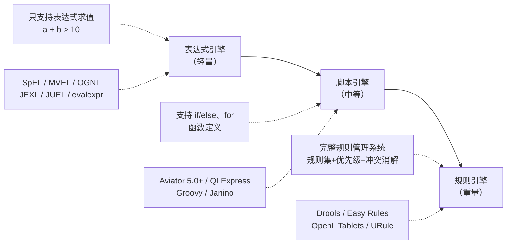
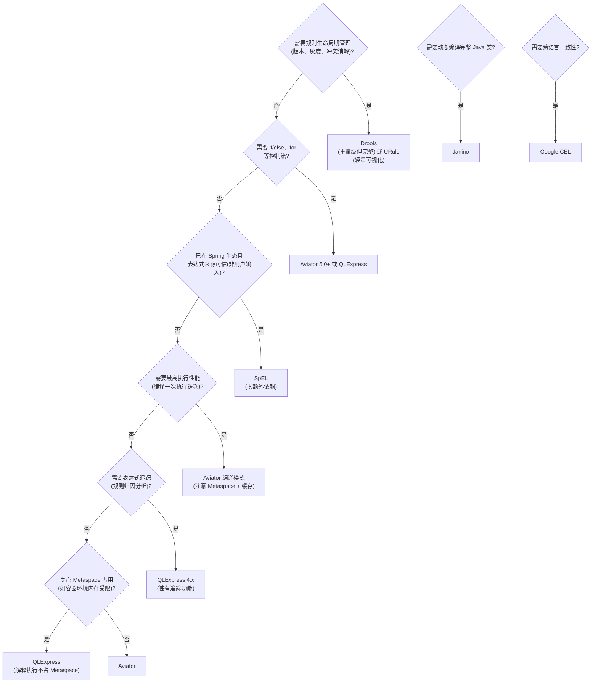

# 附录 A9：表达式引擎与规则引擎——动态规则配置化

> **一句话定位**：当业务规则频繁变更、硬编码 if-else 满天飞时，你需要一种"规则和代码分离"的能力。表达式引擎和规则引擎就是把这个能力工程化的技术方案。本附录覆盖 Java 生态主流方案（Aviator / QLExpress / SpEL / Drools）以及跨语言方案（Go / Python / Rust / 通用 CEL），从选型对比到底层机制到安全防护一站式梳理。

---

## 一、为什么需要"配置化规则"

传统开发中，业务规则写死在 Java 代码里（`if (age > 18 && city.equals("BJ"))`）。当规则变更——运营要加一个"周末且雨天展示补贴"的条件——就得走完整的开发、测试、发版流程，响应速度以天甚至周计。

表达式引擎 / 规则引擎的核心价值是把"业务规则"从"程序代码"中分离出来，变成运行时可动态加载、修改的**数据**（配置），而不是需要重新编译部署的**代码**。

```
传统模式：  运营提需求 → 开发改代码 → QA 测试 → 发版上线（3-5 天）
配置化模式：运营在后台配置规则 → 引擎热加载 → 立即生效（分钟级）
```

> **与 [11.4 领域知识](../part11-case-tag-strategy-platform/04-领域知识.md) 的关系**：第十一章在标签策略平台案例中讲了规则引擎的三种设计模式（决策表、规则链、表达式引擎）和上层架构。本附录从技术选型角度深入到底层实现机制、跨语言方案和安全防护。

---

## 二、全景分类：三层递进

动态规则执行方案从轻到重分为三层：



三层不是替代关系，而是复杂度递进。简单场景用表达式引擎，需要控制流用脚本引擎，需要规则生命周期管理用规则引擎。

---

## 三、Java 生态主流方案

### 3.1 全景信息表

| 引擎 | 来源 | 最新版本 | JAR 大小 | 执行方式 | 语法风格 | 维护状态 |
|------|------|---------|---------|---------|---------|---------|
| **Aviator** | 阿里(个人) | 5.4.3 (2024-06) | ~1.3MB | ASM 字节码编译 | 类 Java + 函数式 | 活跃 |
| **QLExpress** | 阿里巴巴 | 4.1.0 (2025-02) | ~250KB | 解释执行→ANTLR4+VM(4.x) | 类 Java + 弱类型 | 活跃 |
| **MVEL** | 社区 | 2.5.0 / 3.0-alpha | ~500KB | 混合编译 | 类 Java | 活跃 |
| **SpEL** | Spring/VMware | 6.1.x | 随 Spring | 解释执行 | `#{...}` 表达式 | 非常活跃 |
| **OGNL** | 社区 | 3.4.2 | — | 解释执行 | 属性导航式 | 活跃 |
| **JEXL** | Apache | 3.3 | — | 解释执行 | 类 JS | 活跃 |
| **Janino** | 社区 | v3.1.6 (2021-07) | ~300KB | Java 源码即时编译 | 纯 Java | 维护中 |

<details>
<summary><b>展开：三种执行机制的本质差异</b></summary>

这是最核心的技术区分——同样是"动态执行表达式"，底层实现路线完全不同：

**路线一：字节码编译（Aviator、Janino、fel、Groovy）**

```
表达式字符串 → 词法分析 → AST → ASM 生成字节码 → ClassLoader 动态加载 → JVM 直接执行

优点：执行速度最快（接近原生 Java）
缺点：每个表达式生成匿名类，占用 Metaspace
     → 必须开启缓存，否则频繁编译导致 Metaspace OOM
```

**路线二：解释执行（QLExpress 3.x、JEXL、SpEL、OGNL）**

```
表达式字符串 → 词法分析 → AST → 树遍历解释器逐节点执行

优点：不占用 Metaspace，部署轻量
缺点：执行速度慢于编译模式（约 10-20 倍差距）
     → 可开启缓存避免重复解析 AST
```

**路线三：自定义 VM 指令集（QLExpress 4.x）**

```
表达式字符串 → ANTLR4 词法/语法分析 → AST → 编译为自定义指令序列 → 栈式 VM 执行

优点：性能介于编译和解释之间，可做表达式追踪
缺点：实现复杂
```

</details>

### 3.2 性能对比（来自多源基准测试，仅供参考）

```
Java 原生代码:          ~45 ns/op   （基准线）
Aviator（编译模式）:    ~67 ns/op    ← 最快，接近原生 Java
MVEL:                  ~445 ns/op   （约 Aviator 的 6.6 倍）
QLExpress 3.x（解释）: ~1034 ns/op  （约 Aviator 的 15 倍）
SpEL:                  ~1456 ns/op  （约 Aviator 的 22 倍）

注意：
  ① 具体数字因测试环境、表达式复杂度、JIT 预热情况而异
  ② Aviator 深度嵌套（>10 层）时性能衰减明显（+300%）
  ③ QLExpress 4.x 性能相比 3.x 提升 2-3 倍
  ④ 编译型引擎的首次编译有额外开销，优势在"编译一次、执行多次"场景
```

### 3.3 各引擎特色功能

**Aviator**

```
核心机制：ASM 字节码编译
  表达式字符串 → ExpressionLexer 词法分析 → ExpressionParser 语法分析生成 AST
  → CodeGenerator 通过 ASM 生成字节码 → ClassLoader 动态加载 → 执行

5.0+ 从纯表达式升级为脚本语言（支持 if/else、for/while、lambda）

LRU 缓存：避免重复编译，支持缓存淘汰策略
  → 开启方式：AviatorEvaluator.getInstance().setOption(Options.USE_USER_FUNCTION_ONLY, true)
  → 缓存 FutureTask 对象，避免重复编译同一表达式

自定义函数：
  继承 AbstractVariadicFunction，实现 variadicCall() 方法
  在表达式解析前通过 addFunction 注册

数值类型限制：整数只能是 Long，浮点数只能是 Double

Metaspace 问题：
  每个编译后的表达式生成匿名类（2~5KB）
  高频场景不开启缓存 → Metaspace 持续增长 → OOM
  监控指标：jvm.memory.metaspace.used
```

**QLExpress**

```
核心机制：
  3.x：自研 LL(*) 解析器 + 解释执行（不占 Metaspace）
  4.x：ANTLR4 重写 + 栈式 VM 指令 + 表达式追踪

独有功能——表达式计算追踪：
  规则：isVip && 未登录10天以上
  追踪结果：{ isVip: true, 未登录10天以上: false, 最终结果: false }
  → 可追溯是哪个条件拦截了用户，用于规则归因分析

安全沙箱：
  默认不允许与应用代码交互
  可预防死循环、限制高危 API 调用
  → 脚本默认不持有应用上下文，需手动开放

其他特性：
  线程安全（临时变量使用 ThreadLocal）
  原生支持 JSON 数据结构
  兼容类 Java 语法，Java 程序员零学习成本
  弱类型（类似 Groovy/JavaScript）
```

**SpEL（Spring Expression Language）**

```
语法：#{...} 表达式，与 Spring 生态深度集成
  @Value("#{systemProperties['user.home']}")          // 注解方式
  #{T(java.lang.Runtime).getRuntime().exec('calc')}   // T() 运算符（危险！）

特色：
  上下文感知：可直接访问 ApplicationContext 中的 Bean
  T(Type) 运算符：引用类的静态方法和字段
  集合操作：#{users.?[age > 18]}  筛选集合元素
  类型转换：内置 ConversionService

安全风险最大（见安全章节）：
  T() 运算符可调用任意 Java 静态方法 → RCE
  防御：使用 SimpleEvaluationContext（禁用 T()、构造函数调用）
```

**Janino**

```
定位：不是表达式引擎，而是轻量级 Java 编译器
  可编译完整的 Java 类、方法体、表达式
  内存中编译，不产生 .class 文件，直接 ClassLoader 加载
  无需 JDK，仅需 JRE

三大组件：
  Parser：解析 Java 源码 → AST
  UnParser：AST → Java 源码（逆向）
  Evaluator：直接执行表达式

使用者：
  Apache Commons JCL、JBoss Rules/Drools、Flink 代码生成
  适合需要"动态生成 Java 类"的场景（如 Spark whole-stage code generation 类似技术）
```

<details>
<summary><b>展开：Drools——唯一的重量级规则引擎</b></summary>

Drools 是唯一基于 Rete 算法的重量级规则引擎，理解它的架构有助于理解"规则引擎"和"表达式引擎"的本质区别：

```
Drools 核心架构：

  Working Memory（工作内存）
    ↓ 插入 Fact（JavaBean 对象）
  Pattern Matcher（模式匹配器）
    ↓ 将所有规则与 Fact 进行模式匹配
  Agenda（议程）
    ↓ 存放被激活的规则，按优先级（salience）排序
  执行规则动作（then 部分）

Rete 算法的核心思想：
  不是每次 Fact 变更都重新匹配所有规则
  而是将规则条件编译成一个网络（Rete Network）
  Fact 在网络中流动，只在受影响的节点重新匹配
  → 大量规则（几百上千条）时比线性遍历快几个数量级
```

两种推理模式：

```
正向推理（Forward Chaining）—— Drools 默认模式
  数据驱动：Fact 变更 → 匹配规则 → 执行动作 → 可能触发新 Fact → 继续推理
  适合"从已知条件推导结论"

反向推理（Backward Chaining）
  目标驱动：从结论出发，查找能证明结论的规则，检查条件是否满足
  适合"是否应该批准这笔贷款"这类目标明确的判断
```

Drools vs Easy Rules 对比：

| 维度 | Drools | Easy Rules |
|------|--------|-----------|
| 设计理念 | 功能全面的 BRMS | 轻量级、简单直接 |
| 算法 | Rete/ReteOO | 线性遍历 |
| 规则定义 | DRL 文件 + Excel 决策表 | 注解 + MVEL |
| 可视化 | KIE Workbench | 无 |
| 学习曲线 | 陡峭 | 平缓 |
| 内存占用 | 高（>10MB） | 低 |
| 适用场景 | 企业级复杂规则（金融风控） | 简单规则、原型验证 |

</details>

---

## 四、跨语言方案

不局限于 Java，其他语言生态也有成熟的表达式/规则引擎方案。

### 4.1 全景对比

| 语言 | 表达式引擎 | 脚本引擎 | 规则引擎 | 跨语言方案 |
|------|-----------|---------|---------|-----------|
| **Java** | SpEL / MVEL / OGNL / JEXL | Aviator / QLExpress / Groovy / Janino | Drools / Easy Rules / URule | CEL (cel-java) |
| **Go** | govaluate / expr | — | grule / gengine / RuleGo | CEL (cel-go) / GoRules(ZEN) |
| **Python** | eval() / compile() | exec() / AST 模块 | — | CEL (cel-python) |
| **Rust** | evalexpr | — | GoRules(ZEN, Rust 核心) | — |
| **JavaScript** | eval() / new Function() | vm 模块 | json-logic-js | CEL (cel-js) |

### 4.2 Go 生态

Go 生态在云原生和微服务场景中规则引擎需求旺盛，形成了四个层次：

```
govaluate：纯表达式求值，最轻量
  → 适合风控白名单、优惠券门槛、工单分派（表达式为主、动作极少）
  → 注意：不支持嵌套结构（user.Address.City 会报错），只接受 flat map
  → 务必缓存 *EvaluableExpression 实例，别每次都 New

expr：支持 struct 绑定 + 类型安全
  → 能直接绑定 struct 变量（User{Level: 3}），表达式写 User.Level > 2
  → 默认开放 exec.Command 等危险函数 → 生产必须 expr.DisableAllBuiltins()
  → 禁用后需手动注册必要函数（now、len 等）

grule：类 Drools DSL，支持优先级（salience）
  → 规则可给产品/运营直接看、改
  → salience 控制顺序但不是硬约束，需在 when 里加排他条件兜底
  → 热重载需监听文件变化 + 调用 knowledgebase.LoadFromBytes()

gengine：AST 解析 + 多执行模式
  → 支持优先级调度和热更新
  → 三种执行模式：串行（SortedModel）、并发（ConcurrentModel）、混合（MixedModel）
  → 规则语法：rule "name" "desc" salience 10 begin ... end

RuleGo：组件编排式规则引擎
  → 轻量级、高性能、嵌入式
  → 规则链 + 组件化，支持动态编排（不重启替换业务逻辑）
  → 适合 IoT 边缘计算、数据集成、自动化场景
```

### 4.3 Python 生态

Python 的"表达式引擎"能力内置在语言中，无需第三方库：

```python
# eval()：表达式求值（返回结果）
result = eval("2 + 3 * 4")          # → 14
result = eval("a * b + 8", {'a': 10, 'b': 5})  # → 58，可传入命名空间

# compile()：预编译（类似 Aviator 的编译缓存）
code_obj = compile("a * b + 8", "<string>", "eval")  # 编译一次
result = eval(code_obj, {'a': 10, 'b': 5})            # 多次执行

# exec()：执行代码块（支持 if/else、for 等）
exec("for i in range(3): print(i)")
```

```
Python 方案的特点：
  优点：无需引入任何依赖，eval/compile/exec 是内置函数
  缺点：安全性极差——eval 可执行任意 Python 代码
  → eval("__import__('os').system('rm -rf /')")  ← RCE

  安全替代方案：
  ① ast.literal_eval()：只解析字面量（数字、字符串、列表、字典），不执行代码
  ② 自定义 AST 遍历器：compile() → 遍历 AST 节点 → 白名单检查 → 执行
  ③ 使用 RestrictedPython 等沙箱库
```

### 4.4 Rust 生态

```
evalexpr：轻量表达式求值 crate
  → 无外部依赖，零成本抽象
  → use evalexpr::*;
  → assert_eq!(eval("1 + 2 + 3"), Ok(Value::from_int(6)))
  → 适合嵌入式场景、WASM 环境

GoRules ZEN Engine：跨语言规则引擎（Rust 核心）
  → Rust 编写核心引擎，提供 Go / Node.js / Python 本地绑定
  → 从 JSON 加载和执行 JSON 决策模型（JDM）
  → 开源 React 编辑器用于可视化规则配置
  → 跨语言一致性：不同语言调用同一套规则，结果一致
```

### 4.5 Google CEL（Common Expression Language）

CEL 是一个跨语言的通用表达式语言，由 Google 开源，用于在应用中安全地嵌入表达式求值：

```
设计理念：
  一种语法，多语言实现（Go / Java / Python / JavaScript / C++）
  安全沙箱：不支持循环、不支持副作用、不可调用任意函数
  轻量：编译器和运行时加起来不到几百 KB

适用场景：
  Kubernetes 准入控制策略
  API 请求条件路由
  权限策略表达式
  配置验证规则

示例：
  request.principal == "user:alice@example.com"
  resource.labels["env"] == "prod" && request.method == "GET"
```

<details>
<summary><b>展开：跨语言方案对比小结</b></summary>

| 维度 | Java 方案 | Go 方案 | Python 方案 | CEL |
|------|-----------|---------|-----------|-----|
| 性能 | Aviator 最快（~67ns） | expr 接近 Go 原生 | eval 较慢但够用 | 编译+VM，中等 |
| 安全 | QLExpress 沙箱好 | expr 需手动禁用 | 极差（需 AST 白名单） | 天然安全（无副作用） |
| 生态成熟度 | 最高（Drools 全家桶） | 成长中 | 内置无需依赖 | 云原生标配 |
| 跨语言一致性 | 仅 Java | 仅 Go | 仅 Python | 多语言统一 |
| 适用场景 | 企业级规则系统 | 微服务/云原生 | 数据科学/原型 | API 网关/K8s |

选型建议：
- 已在 Java 技术栈 → Aviator 或 QLExpress
- 已在 Go 技术栈 → expr（表达式）或 grule（规则）
- 需要跨语言一致性 → CEL
- 需要可视化规则编辑 → GoRules ZEN（React 编辑器 + 多语言绑定）
- 安全优先 → CEL（天然沙箱）或 QLExpress（Java 沙箱）

</details>

---

## 五、DSL 编译器工具

当现成的表达式引擎不够用、需要自建 DSL（领域特定语言）时，有两个主流工具链：

### 5.1 ANTLR4

```
工作流程：
  .g4 语法规则文件 → ANTLR4 → 自动生成 Lexer + Parser
  → Parse Tree → Listener / Visitor 遍历 → 语义分析 / 代码生成

特点：
  LL(*) 解析策略，能处理大多数上下文无关文法
  解决了左递归问题（ANTLR4）
  多语言目标：Java、Python、C++、Go、C#
  可视化调试：ANTLR Works / IntelliJ 插件
  智能错误恢复机制

使用者：
  Spark SQL、Hive、Presto、Groovy、Debezium
  Drools（ANTLR3）
  QLExpress4（ANTLR4）
```

### 5.2 JavaCC

```
特点：
  类似 ANTLR，但社区较小
  多语言支持不如 ANTLR
  调试功能较简单
  Aviator 的词法分析使用 JavaCC
```

### 5.3 JFlex + Bison/Yacc

```
传统学术路线：
  JFlex 生成词法分析器（Lexer）
  Bison/Yacc 生成语法分析器（Parser）

特点：
  更学术化，源自编译原理课程
  灵活性不如 ANTLR4
  适合已有编译器基础知识的团队
```

<details>
<summary><b>展开：三种工具对比</b></summary>

| 维度 | ANTLR4 | JavaCC | JFlex + Bison |
|------|--------|--------|---------------|
| 解析算法 | LL(*) | LL(k) | LALR(1) |
| 左递归 | 自动处理 | 不支持 | 不支持 |
| 多语言 | Java/Go/Python/C++/C# | 仅 Java | C/Java |
| 社区 | 最大（Twitter、Hive 使用） | 中等 | 学术为主 |
| 调试工具 | ANTLR Works + IntelliJ 插件 | 较弱 | 命令行为主 |
| 学习曲线 | 中等（.g4 语法文件） | 中等 | 陡峭（编译原理） |
| 适合场景 | 自建 DSL、SQL 解析器 | Java 内嵌 DSL | 学术研究 |

结论：优先选 ANTLR4，除非团队已有 JavaCC 或 JFlex 经验。

</details>

---

## 六、安全问题——表达式注入

表达式引擎能执行"类代码"逻辑，如果用户输入未经过滤直接拼入表达式，就等于 RCE（远程代码执行）。这是生产环境最容易被忽视的问题。

### 6.1 SpEL 注入（最危险）

```java
// 危险代码：用户输入直接拼入 SpEL
String userInput = request.getParameter("name");
String expression = "user.name == '" + userInput + "'";  // 注入点！

// 攻击者输入：' + T(java.lang.Runtime).getRuntime().exec('calc') + '
// 实际执行的 SpEL：
//   user.name == '' + T(java.lang.Runtime).getRuntime().exec('calc') + ''
//   → 执行系统命令

// 防御：使用 SimpleEvaluationContext（禁用 T() 运算符、构造函数调用）
EvaluationContext context = SimpleEvaluationContext.forReadOnlyDataBinding().build();
// 而不是 StandardEvaluationContext（默认，允许一切）
```

实际 CVE 案例：CVE-2026-22738 Spring AI SimpleVectorStore SpEL 注入导致 RCE。

### 6.2 各引擎安全特性

| 引擎 | 安全特性 | 风险等级 |
|------|---------|---------|
| SpEL | T() 运算符可调用任意静态方法 | 高（默认不安全） |
| OGNL | 可访问任意 Java 类 | 高（Struts2 历史 CVE） |
| Groovy | 可调用任意 Java 代码 | 高（需手动限制） |
| Python eval | 可执行任意 Python 代码 | 高（需 AST 白名单） |
| Aviator | 无副作用设计，不支持系统调用 | 低 |
| QLExpress | 默认沙箱，禁止应用交互，防死循环 | 低 |
| CEL | 天然安全（无副作用、无循环） | 低 |

### 6.3 防御原则

```
① 不要将用户输入直接拼入表达式字符串
② 必须拼接时，使用白名单校验 + 字符转义
③ 使用安全上下文（如 SpEL 的 SimpleEvaluationContext）
④ 禁用危险功能（T() 运算符、构造函数调用、反射方法）
⑤ 沙箱隔离：限制可访问的类和方法白名单
⑥ 超时控制：防止恶意表达式导致死循环
⑦ Go 生态特别注意：expr 默认开放 exec.Command → 必须先 DisableAllBuiltins()
```

---

## 七、选型决策树



<details>
<summary><b>展开：按场景的选型推荐</b></summary>

| 场景 | 推荐方案 | 原因 |
|------|---------|------|
| 风控规则（几百条，有优先级） | Drools | Rete 算法大量规则时优势明显 |
| 优惠券门槛判断 | Aviator / govaluate | 纯表达式，轻量高效 |
| 搜索排序特征计算 | Aviator + jcc 扩展 | 编译模式性能最优 |
| 用户行为序列特征 | 自研 DAG + 双表达式 | 依赖管理 + IO 批量合并 |
| 标签策略平台 | Aviator 或 QLExpress | 配合规则链/决策表使用 |
| Spring Boot 配置注入 | SpEL | 零额外依赖，原生集成 |
| API 网关条件路由 | CEL | 跨语言、安全沙箱 |
| Kubernetes 准入控制 | CEL | K8s 原生支持 |
| 运营可视化规则配置 | GoRules ZEN | React 编辑器 + 多语言绑定 |
| 需要规则归因分析 | QLExpress 4.x | 独有表达式追踪功能 |
| 容器环境内存受限 | QLExpress | 解释执行不占 Metaspace |
| 需要动态生成 Java 类 | Janino | 唯一支持完整 Java 编译 |

</details>

---

## 八、总结：三种技术路线对比

| 维度 | 字节码编译型 | 解释执行型 | VM 指令集型 |
|------|-----------|-----------|-----------|
| 代表 | Aviator、Janino | QLExpress 3.x、SpEL、JEXL | QLExpress 4.x |
| 执行方式 | 编译为 JVM 字节码 | AST 树遍历 | 编译为自定义指令 |
| 性能 | 最快（~67ns） | 最慢（~1000ns+） | 中等 |
| Metaspace | 占用（匿名类） | 不占用 | 不占用 |
| 缓存要求 | 必须（避免重复编译） | 可选（缓存 AST） | 必须（缓存指令集） |
| 安全性 | 取决于实现 | 取决于实现 | 可加沙箱层 |
| 实现复杂度 | 高（需 ASM） | 低 | 中高（需自研 VM） |
| 适用场景 | 高频执行、性能优先 | 低频、部署轻量 | 需要追踪和调试 |

> **一句话总结**：选型的核心不是"哪个引擎最好"，而是"你的业务规则变更频率有多高、规则数量有多少、对性能和安全的约束是什么"。先看场景，再看引擎。
