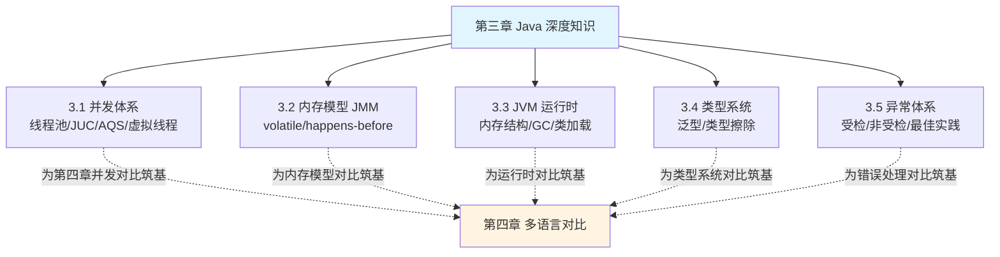

# 第三章 Java 深度知识：夯实你的主场，为多语言对比筑基

> 前两章我们「向外」走，从后端思维迁移到前端世界。这一章我们「向内」深挖，回到你的主场——**Java**。
> 但这不是普通的 Java 教程，而是**为后面的多语言对比打地基**。

---

## 为什么要单独深挖 Java

你可能会问：「我是 Java 工程师，Java 还要你教？」

这一章的定位不是「教你 Java」，而是**把你日常会用、但未必讲得透的 Java 深层机制彻底讲清楚**，原因有三：

1. **它是你的「度量衡」**。第四章要拿 Java 和 Go/Rust/Python/JS 对比并发、内存、类型、错误处理。如果你对 Java 自己的并发模型、内存模型只是「会用」而非「懂原理」，对比就无从谈起。**Java 是你丈量其他语言的尺子，这把尺子必须足够精确。**

2. **它暴露了「语言设计的权衡」**。当你深入理解「Java 为什么这样设计线程模型 / 内存模型 / 类型系统」，你才能在第四章看懂「Go 为什么换了一种设计」「Rust 为什么走了第三条路」。**每一个语言特性背后都是权衡，先看懂 Java 的权衡。**

3. **AI Coding 时代的「锚点」更重要**。AI 能帮你写任何语言的代码，但**判断它写得对不对、好不好**，依赖你对底层原理的理解。Java 深层机制是你最扎实的判断锚点。

> **面试导向加强**：考虑到 Java 深度知识也是大厂面试的核心战场，本章每一节在「原理筑基 + 多语言钩子」之外，都额外增设了一个 **「面试深度剖析：大厂高频考点」** 大节。它以面试官真实的「**层层追问链**」组织内容（`面试官：「……」` → 标准答法要点 → 常见陷阱 → 加分项），把线程池七参数、锁升级、DCL/volatile、GC 三色标记、线上 OOM/CPU 排查、类型擦除、finally 与 return 等高频考点逐一拆透。**既能当原理书读，也能当面经刷。**

---

## 本章地图

每一节都会做两件事：**讲透 Java 的机制原理**，并在结尾**埋下「钩子」**，预告它将在第四章和哪门语言的什么特性对比。

---

## 各节导读

**[3.1 Java 并发体系](./01-并发体系.md)** —— 从线程的本质（OS 线程的薄封装）讲到线程池、`java.util.concurrent`、AQS 同步器原理，最后讲 JDK 21 虚拟线程（Project Loom）如何改变游戏规则。这是后面对比 Go 协程、Rust async、Node 事件循环的基准。*面试剖析覆盖：线程池七参数与拒绝策略、synchronized 锁升级、CAS 与 ABA、ThreadLocal 内存泄漏、ConcurrentHashMap 演进。*

**[3.2 Java 内存模型 JMM](./02-内存模型JMM.md)** —— 为什么多线程下「看起来对的代码」会出错？讲清 JMM、可见性、有序性、`volatile`、happens-before 原则。这是理解一切并发安全的根基。*面试剖析覆盖：DCL 双重检查为何需 volatile、内存屏障与 MESI、as-if-serial vs happens-before、并发工具选型。*

**[3.3 JVM 运行时](./03-JVM运行时.md)** —— 你的代码从 `.java` 到运行经历了什么。讲运行时内存结构、垃圾回收、类加载机制。这是后面对比 Go/Rust「无 GC 或不同 GC」的基准。*面试剖析覆盖：内存区域 OOM/SOF、对象创建过程、可达性分析与四种引用、三色标记与漏标、GC 选型调优、线上 OOM/CPU 排查命令链、破坏双亲委派。*

**[3.4 Java 类型系统](./04-类型系统.md)** —— 泛型到底是什么、类型擦除的真相与坑、协变逆变。呼应 [1.3 类型光谱](../part1-mindset-shift/03-从强类型到类型光谱.md)，并为对比 TS/Rust 类型系统筑基。*面试剖析覆盖：反射突破类型擦除、桥接方法、自动装箱与 Integer 缓存池、String 不可变与常量池/intern、equals 与 hashCode 契约。*

**[3.5 Java 异常体系](./05-异常体系.md)** —— 受检异常 vs 非受检异常的设计哲学与争议、异常最佳实践。这是后面对比 Go 的 `error` 返回值、Rust 的 `Result`、JS 的 `try/catch` 的基准。*面试剖析覆盖：finally 与 return 执行顺序、try-with-resources 编译原理与抑制异常、异常性能开销、Spring 全局异常处理与事务回滚、异常链与日志规范。*

---

## 阅读建议

如果你 Java 功底扎实，可以快速浏览，**重点看每节结尾的「钩子」段落**——那里点明了将在第四章对比的关键差异。如果某些机制你只是「会用没深究」，建议精读，这些正是你与其他语言对比时的「丈量尺度」。

**如果你正在准备大厂面试**，可以直接跳到每节的「面试深度剖析」大节按追问链过一遍，再回头精读对应的原理小节夯实细节——这样既有「标准答法」又有「为什么」，面试时才扛得住连环追问。

读完本章，你将带着一把精确的「Java 尺子」，进入第四章的多语言对比。

---

[← 返回第二章](../part2-frontend-core/04-工程化.md) | [返回全书目录](../README.md) | [开始 3.1 并发体系 →](./01-并发体系.md)
