# 第三章 Java 深度知识：夯实你的主场，为多语言对比筑基

> 前两章我们「向外」走，从后端思维迁移到前端世界。这一章我们「向内」深挖，回到你的主场——**Java**。
> 但这不是普通的 Java 教程，而是**为后面的多语言对比打地基**。

---

## 为什么要单独深挖 Java

你可能会问：「我是 Java 工程师，Java 还要你教？」

这一章的定位不是「教你 Java」，而是**把你日常会用、但未必讲得透的 Java 深层机制彻底讲清楚**，原因有三：

1. **它是你的「度量衡」**。第四章要拿 Java 和 Go/Rust/Python/JS 对比并发、内存、类型、错误处理。如果你对 Java 自己的并发模型、内存模型只是「会用」而非「懂原理」，对比就无从谈起。**Java 是你丈量其他语言的尺子，这把尺子必须足够精确。**

2. **它暴露了「语言设计的权衡」**。当你深入理解「Java 为什么这样设计线程模型 / 内存模型 / 类型系统」，你才能在第四章看懂「Go 为什么换了一种设计」「Rust 为什么走了第三条路」。**每一个语言特性背后都是权衡，先看懂 Java 的权衡。**

3. **AI Coding 时代的「锚点」更重要**。AI 能帮你写任何语言的代码，但**判断它写得对不对、好不好**，依赖你对底层原理的理解。Java 深层机制是你最扎实的判断锚点。

> **面试导向加强**：考虑到 Java 深度知识也是大厂面试的核心战场，本章每一节在「原理筑基 + 多语言钩子」之外，都额外增设了一个 **「面试深度剖析：大厂高频考点」** 大节。它以面试官真实的「**层层追问链**」组织内容（`面试官：「……」` → 标准答法要点 → 常见陷阱 → 加分项），把线程池七参数、锁升级、DCL/volatile、GC 三色标记、线上 OOM/CPU 排查、类型擦除、finally 与 return 等高频考点逐一拆透。**既能当原理书读，也能当面经刷。**

---

## 本章地图

```mermaid
graph TD
    A[第三章 Java 深度知识] --> B[3.1 并发体系<br/>线程池/JUC/AQS/虚拟线程]
    A --> C[3.2 内存模型 JMM<br/>volatile/happens-before]
    A --> D[3.3 JVM 运行时<br/>内存结构/GC/类加载]
    A --> E[3.4 类型系统<br/>泛型/类型擦除]
    A --> F[3.5 异常体系<br/>受检/非受检/最佳实践]
    A --> H[3.6 网络 IO 模型<br/>BIO/NIO/AIO/Reactor]
    A --> I[3.7 高可用架构<br/>限流/熔断/降级/幂等]
    A --> J[3.8 缓存与 Redis<br/>穿透/击穿/雪崩/一致性]
    A --> K[3.9 数据库 MySQL<br/>索引/事务/锁/分库分表]
    A --> L[3.10 分布式理论<br/>CAP/BASE/Raft]
    A --> M[3.11 分布式事务<br/>2PC/TCC/Saga]
    A --> N[3.12 消息队列<br/>Kafka/RocketMQ]
    A --> O[3.13 Spring 全家桶<br/>IOC/AOP/Boot/Cloud]
    A --> P[3.14 微服务与分布式锁<br/>注册发现/锁/链路追踪]
    A --> P2[3.15 Java 集合框架<br/>ArrayList/HashMap/ConcurrentHashMap]
    A --> P3[3.16 Java 8+ 新特性<br/>Lambda/Stream/Optional/Record]
    A --> P4[3.17 设计模式<br/>23种模式/SOLID/Spring实战]
    A --> R[附录 A1 核心数据结构<br/>跳表/红黑树/布隆过滤器/B+树]
    A --> S[附录 A2 网络协议基础<br/>TCP握手/HTTP/DNS]

    B -.为第四章并发对比筑基.-> G[第四章 多语言对比]
    C -.为内存模型对比筑基.-> G
    D -.为运行时对比筑基.-> G
    E -.为类型系统对比筑基.-> G
    F -.为错误处理对比筑基.-> G
    H -.为并发/IO 模型对比筑基.-> G

    I -.高可用实践.-> Q[面试体系化]
    J -.中间件.-> Q
    K -.数据层.-> Q
    L -.理论基础.-> Q
    M -.一致性方案.-> Q
    N -.异步架构.-> Q
    O -.框架生态.-> Q
    P -.治理实战.-> Q
    P2 -.集合源码.-> Q
    P3 -.语言演进.-> G
    P4 -.设计思维.-> Q

    style A fill:#e1f5ff
    style G fill:#fff4e1
    style Q fill:#f0ffe0
```

每一节都会做两件事：**讲透 Java 的机制原理**，并在结尾**埋下「钩子」**，预告它将在第四章和哪门语言的什么特性对比。

---

## 各节导读

**[3.1 Java 并发体系](./01-并发体系.md)** —— 从线程的本质（OS 线程的薄封装）讲到线程池、`java.util.concurrent`、AQS 同步器原理，最后讲 JDK 21 虚拟线程（Project Loom）如何改变游戏规则。这是后面对比 Go 协程、Rust async、Node 事件循环的基准。*面试剖析覆盖：线程池七参数与拒绝策略、synchronized 锁升级、CAS 与 ABA、ThreadLocal 内存泄漏、ConcurrentHashMap 演进。*

**[3.2 Java 内存模型 JMM](./02-内存模型JMM.md)** —— 为什么多线程下「看起来对的代码」会出错？讲清 JMM、可见性、有序性、`volatile`、happens-before 原则。这是理解一切并发安全的根基。*面试剖析覆盖：DCL 双重检查为何需 volatile、内存屏障与 MESI、as-if-serial vs happens-before、并发工具选型。*

**[3.3 JVM 运行时](./03-JVM运行时.md)** —— 你的代码从 `.java` 到运行经历了什么。讲运行时内存结构、垃圾回收、类加载机制。这是后面对比 Go/Rust「无 GC 或不同 GC」的基准。*面试剖析覆盖：内存区域 OOM/SOF、对象创建过程、可达性分析与四种引用、三色标记与漏标、GC 选型调优、线上 OOM/CPU 排查命令链、破坏双亲委派。*

**[3.4 Java 类型系统](./04-类型系统.md)** —— 泛型到底是什么、类型擦除的真相与坑、协变逆变。呼应 [1.3 类型光谱](../part1-mindset-shift/03-从强类型到类型光谱.md)，并为对比 TS/Rust 类型系统筑基。*面试剖析覆盖：反射突破类型擦除、桥接方法、自动装箱与 Integer 缓存池、String 不可变与常量池/intern、equals 与 hashCode 契约。*

**[3.5 Java 异常体系](./05-异常体系.md)** —— 受检异常 vs 非受检异常的设计哲学与争议、异常最佳实践。这是后面对比 Go 的 `error` 返回值、Rust 的 `Result`、JS 的 `try/catch` 的基准。*面试剖析覆盖：finally 与 return 执行顺序、try-with-resources 编译原理与抑制异常、异常性能开销、Spring 全局异常处理与事务回滚、异常链与日志规范。*

**[3.6 Java 网络 IO 模型](./06-网络IO模型.md)** —— 从 BIO（一连接一线程）到 NIO（Selector + epoll 多路复用）再到 AIO，讲透网络 IO 的两阶段本质、Reactor 模式、回调地狱，以及虚拟线程如何「用同步写法拿异步吞吐」。这是理解 Netty、Node 事件循环的共同地基。*面试剖析覆盖：BIO/NIO/AIO 区别、select/poll/epoll、零拷贝、为何需要 Netty。*

**[3.7 高可用架构](./07-高可用架构.md)** —— 系统不是「永远不出问题」，而是出了问题能快速恢复。SLA 量化、限流四算法（固定窗口/滑动窗口/漏桶/令牌桶）、熔断三态、降级策略、超时重试幂等、冗余与故障转移、容灾多活、故障演练。*面试剖析覆盖：限流算法对比与临界突刺、熔断判定指标、幂等方案选型、七步回答高可用设计题。*

**[3.8 缓存与 Redis](./08-缓存与Redis.md)** —— 为什么加个缓存就能快 10 倍，但也能让你丢数据。Redis 五大数据结构与底层编码、缓存穿透/击穿/雪崩三大经典问题、缓存与数据库一致性四种方案、过期淘汰策略、RDB/AOF 持久化、Redis 高可用（Sentinel/Cluster）。*面试剖析覆盖：ZSet 跳表 vs 红黑树、布隆过滤器原理、延迟双删、LRU vs LFU、大 Key/热 Key。*

**[3.9 数据库 MySQL](./09-数据库MySQL.md)** —— 你的 SQL 为什么慢、锁为什么等待、数据为什么不一致。B+ 树索引、聚簇/非聚簇索引与回表、联合索引最左前缀、事务隔离级别与 MVCC、行锁/间隙锁/死锁、redo/undo/binlog 日志体系、分库分表。*面试剖析覆盖：索引失效 6 种场景、RR 如何解决幻读、两阶段提交、EXPLAIN 执行计划。*

**[3.10 分布式理论与一致性](./10-分布式理论与一致性.md)** —— CAP 不是三选二那么简单。CAP 定理的正确理解、BASE 理论、一致性级别光谱（强→线性→顺序→因果→最终）、Paxos 协议、Raft 协议（选举/日志复制/安全性）、ZAB 与 Gossip、分布式时间与逻辑时钟。*面试剖析覆盖：CP vs AP 举例、Raft 脑裂处理、为什么不能依赖物理时钟。*

**[3.11 分布式事务](./11-分布式事务.md)** —— 跨服务的数据一致性怎么保证。2PC/3PC、TCC（Try-Confirm-Cancel）、Saga 模式、本地消息表、最大努力通知——五种方案的原理/优劣/适用场景全维度对比，以及 Seata 框架。*面试剖析覆盖：2PC 协调者挂了怎么办、TCC 空回滚与悬挂、Saga 无隔离性的代价。*

**[3.12 消息队列](./12-消息队列.md)** —— 削峰、解耦、异步的银弹与代价。Kafka 核心架构（Partition/ISR/零拷贝）、RocketMQ 事务消息、可靠投递三环节（生产/Broker/消费）、幂等消费、顺序消费、消息积压处理。*面试剖析覆盖：Kafka 为什么用磁盘还快、acks=0/1/all、消费失败后还能保证顺序吗。*

**[3.13 Spring 全家桶](./13-Spring全家桶.md)** —— 为什么 Java 后端绕不开它。IOC 容器与依赖注入、AOP 原理（JDK 动态代理 vs CGLIB）、Bean 生命周期、Spring Boot 自动配置原理（spring.factories + 条件装配）、Spring MVC 请求处理流程、Spring Cloud 核心组件选型。*面试剖析覆盖：循环依赖三级缓存、@Transactional 失效场景、BeanPostProcessor 时机。*

**[3.14 微服务治理与分布式锁](./14-微服务与分布式锁.md)** —— 从单体到微服务后多出来的麻烦。服务注册与发现、配置中心、分布式锁三种实现（Redis/ZooKeeper/MySQL）、链路追踪、服务网关、服务间通信选型。*面试剖析覆盖：Redis 分布式锁主从切换丢锁/RedLock 争议、Redisson 看门狗、ZK 临时顺序节点。*

**[3.15 Java 集合框架](./15-Java集合框架.md)** —— ArrayList 扩容机制、LinkedList 为何几乎不该用、HashMap 源码全解（hash 扰动/红黑树转换/扩容 rehash）、ConcurrentHashMap（JDK 7 分段锁 → JDK 8 CAS + synchronized）、LinkedHashMap 实现 LRU、TreeMap、PriorityQueue。*面试剖析覆盖：HashMap 线程不安全的具体表现、fail-fast vs fail-safe、synchronizedMap vs ConcurrentHashMap、key 的 hashCode/equals 契约。*

**[3.16 Java 8+ 新特性](./16-Java8+新特性.md)** —— Lambda 与函数式接口、Stream API（惰性求值/flatMap/Collectors）、Optional 正确用法与反模式、新日期 API（java.time）、JDK 9-21 关键特性速览（var/Record/Sealed Class/Pattern Matching/虚拟线程）。*面试剖析覆盖：Stream vs for 循环性能、Lambda 捕获变量限制、parallelStream 陷阱、orElse vs orElseGet。*

**[3.17 设计模式](./17-设计模式.md)** —— 先宏观（SOLID 原则 → 三大类 23 种模式），再逐个击破。创建型（单例 5 种写法/工厂/建造者）、结构型（代理/适配器/装饰器/外观）、行为型（策略/模板方法/观察者/责任链）。每种模式一句话定义 + Java/Spring 实战应用 + 代码骨架。*面试剖析覆盖：Spring 用了哪些设计模式、策略模式消除 if-else、代理 vs 装饰器 vs 适配器区分。*

**[附录 A1：核心数据结构原理](./A1-核心数据结构原理.md)** —— 跳表、红黑树、布隆过滤器、一致性 Hash、HashMap、B+ 树——这些被多个章节引用的通用数据结构集中讲透。结构图解、插入/查找过程、复杂度对比、变体与参数设计、Java/Redis 实战用法、常见树结构总览（BST/AVL/红黑树/B树/B+树/跳表/Trie/堆），面试时任何场景问到都能从容作答。

**[附录 A2：网络协议基础](./A2-网络协议基础.md)** —— TCP 三次握手/四次挥手、TIME_WAIT、TCP vs UDP、HTTP 版本演进（1.0→1.1→2→3）、HTTPS/TLS、状态码速查、DNS 解析流程、网络分层模型、从输入 URL 到页面展示。后端面试网络基础题的一站式速查。

**[附录 A3：两阶段提交](./A3-两阶段提交.md)** —— 一个思想，三个战场。MySQL 内部 2PC（redo log + binlog 的一致性保证，三阶段时序图，六种 crash 场景逐一分析）、分布式 2PC（XA 协议，协调者单点问题）、Flink 2PC（Checkpoint + Sink 事务的 Exactly-Once），统一对比表帮你理清 2PC 在不同场景下的具体含义。

**[附录 A4：SQL 语言与数据处理](./A4-SQL语言与数据处理.md)** —— SQL 执行顺序（和书写顺序不一样）、JOIN 全家福与底层实现、窗口函数、EXPLAIN 执行计划、索引失效速查、慢 SQL 排查流程、深分页优化、SQL 实战高频题型（TopN/连续登录/行转列）。后半部分从 MySQL 延伸到大数据技术栈全景（HDFS/Hive/Spark/Flink）和数据仓库分层模型（ODS→DWD→DWS→ADS）。

**[附录 A5：ElasticSearch](./A5-ElasticSearch.md)** —— 倒排索引原理、ES 核心概念与 MySQL 类比、分词器、集群架构（分片/副本/近实时原理）、DSL 查询入门（match/term/bool/aggs）、ES 与 MySQL 的互补关系。附 NoSQL 家族速览（MongoDB 文档型数据库简介）。*面试剖析覆盖：ES 为什么快、深分页问题、MySQL-ES 数据一致性方案。*

**[附录 A6：代码规范与设计原则](./A6-代码规范与设计原则.md)** —— SOLID 五原则逐一拆解（每个原则一句话 + Java 正例/反例）、阿里巴巴 Java 编码规范精选要点（命名/异常处理/集合/并发/日志）、代码坏味道速查表。

**[附录 A7：开发工具链](./A7-开发工具链.md)** —— Git 进阶（分支策略/rebase vs merge/cherry-pick/bisect/stash）、Maven 生命周期与依赖冲突排查、Maven vs Gradle、CI/CD 概念与工具选型、Linux 运维命令速查（文件/进程/网络/线上排查组合拳）。

---

## 阅读建议

如果你 Java 功底扎实，可以快速浏览，**重点看每节结尾的「钩子」段落**——那里点明了将在第四章对比的关键差异。如果某些机制你只是「会用没深究」，建议精读，这些正是你与其他语言对比时的「丈量尺度」。

**如果你正在准备大厂面试**，可以直接跳到每节的「面试深度剖析」大节按追问链过一遍，再回头精读对应的原理小节夯实细节——这样既有「标准答法」又有「为什么」，面试时才扛得住连环追问。

读完本章，你将带着一把精确的「Java 尺子」，进入第四章的多语言对比。

---

[← 返回第二章](../part2-frontend-core/04-工程化.md) | [返回全书目录](../README.md) | [开始 3.1 并发体系 →](./01-并发体系.md)
