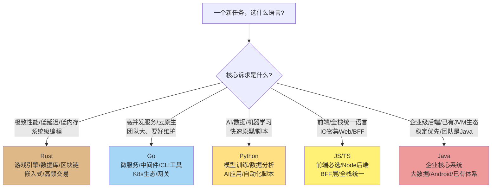
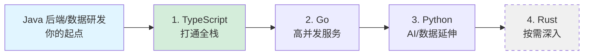

# 4.7 语言选型决策树：什么场景该用谁

> 这是第四章的**收口章节**。前面六节我们把五门语言拆开对比，这一节合起来回答最实际的问题：
> **面对一个具体任务，我该用哪门语言？** 给你一棵可操作的决策树，而不是「都好都行」的废话。

---

## 一、先破除一个误区：没有「最好的语言」

每门语言都是在特定约束下的**权衡产物**，前面几节已经反复印证：

- Rust 用陡峭的学习曲线换极致的性能和安全（[4.4](./04-Java到Rust.md)）。
- Go 用刻意的极简换大团队的可维护性和并发易用性（[4.3](./03-Java到Go.md)）。
- Python 用运行时性能换开发速度和无敌的 AI 生态（[4.5](./05-Java到Python.md)）。
- JS/TS 用单线程模型换全栈语言统一和 IO 密集的高效（[4.2](./02-Java到JS-TS.md)）。
- Java 用 JVM 的「重」换成熟生态、稳定性和虚拟线程后的并发体验（[第三章](../part3-java-deep/README.md)）。

**选型的本质，是把任务的约束和语言的权衡对齐。** 下面给你对齐的方法。

---

## 二、选型决策树

---

## 三、按场景的具体建议

| 场景 | 首选 | 备选 | 理由 |
|------|------|------|------|
| 前端（Web/移动 H5） | **JS/TS** | — | 没得选，浏览器只跑 JS |
| 高并发 API 网关/微服务 | **Go** | Java(虚拟线程) | goroutine 轻量、启动快、部署简单 |
| 企业级核心业务系统 | **Java** | Go | 生态成熟、人才多、稳定性验证充分 |
| AI/LLM 应用、数据分析 | **Python** | — | 生态垄断，几乎绕不开 |
| 极致性能（数据库/引擎/系统组件） | **Rust** | C++ | 无 GC、内存安全、零成本抽象 |
| BFF（前端的后端聚合层） | **JS/TS(Node)** | Go | 与前端同语言，IO 密集场景高效 |
| CLI 命令行工具 | **Go / Rust** | — | 编译成单个无依赖二进制，分发方便 |
| 大数据处理（Spark/Flink） | **Java/Scala** | Python | 大数据生态以 JVM 为主 |
| 快速验证原型/脚本 | **Python** | JS | 写得最快，不计较性能 |
| 对延迟极敏感（金融/实时） | **Rust** | Java(ZGC) | 无 STW、延迟可预测 |

---

## 四、给「数据研发 / Java 后端转全栈」的专属路线

结合本书读者的背景（[第一章](../part1-mindset-shift/README.md) 的定位），给一条**最高性价比的语言学习与应用路线**：

**第一优先：TypeScript**
你要做全栈，前端绕不开 JS/TS，而 TS 对 Java 工程师最友好（[4.2](./02-Java到JS-TS.md)）。学会它，你能写前端、能用 Node 写 BFF，**全栈版图直接打通**。投入产出比最高。

**第二优先：Go**
当你要写独立的高并发后端服务、中间件、CLI 工具时，Go 是 Java 之外最该掌握的（[4.3](./03-Java到Go.md)）。转型平滑（几天上手），云原生时代用得极广。

**第三优先：Python**
如果你的全栈版图要延伸到 **AI / 数据**（[4.5](./05-Java到Python.md)），Python 必学。好在它语法简单，配合 AI Coding 工具上手极快。对数据研发背景的你，Python 的数据生态本就是熟悉领域。

**按需了解：Rust**
除非你要做性能极致的系统组件，否则 Rust 可以「了解原理、需要时再深入」（[4.4](./04-Java到Rust.md)）。它的所有权思想值得学习（能提升你对内存和并发的理解），但学习成本高，不必一开始就投入。

---

## 五、AI Coding 时代的选型新思路

最后一个关键认知，呼应全书主线，也引出 [第五章](../part5-ai-coding-method/README.md)：

**在 AI Coding 时代，「会不会写某语言的语法」不再是选型的主要约束。** AI 能帮你写任何语言的代码。这反而让选型回归到更本质的层面：

- **选最适合任务的语言**，而不是「我只会的语言」——因为 AI 帮你跨越了语法门槛。
- **选生态最好的语言**——AI 帮你写胶水代码，但成熟的库、框架、社区是 AI 替代不了的。
- **你的核心价值变成「判断力」**——判断 AI 选的语言对不对、写的代码地道不地道。这需要本章建立的**多语言立体认知**作为基础。

换句话说：**本章教你的不是「记住五门语言的语法」，而是建立「判断该用谁、为什么」的能力。** 在 AI 时代，这种判断力比语法记忆值钱一百倍。如何用 AI 把这种判断力转化为生产力，正是 [第五章](../part5-ai-coding-method/README.md) 的主题。

---

## 本章小结

- **没有最好的语言**，只有「任务约束」与「语言权衡」的对齐。
- 选型决策树：性能极致→Rust，高并发云原生→Go，AI/数据→Python，前端/全栈统一→JS/TS，企业级/已有生态→Java。
- **数据研发/Java 后端转全栈的专属路线**：TypeScript（打通全栈）→ Go（高并发服务）→ Python（AI/数据延伸）→ Rust（按需深入）。
- **AI Coding 时代**，选型回归本质：选最适合任务、生态最好的语言，而你的核心价值是**判断力**——这正是 [第五章](../part5-ai-coding-method/README.md) 要把它变成生产力的地方。

至此第四章完结。你已建立起对五门语言的立体认知和选型判断力。接下来第五章，我们讲如何用 AI Coding 把这一切转化为真正的全栈战斗力。

---

[← 上一节：4.6 错误处理对比](./06-错误处理对比.md) | [返回第四章导读](./README.md) | [进入第五章：AI Coding 方法论 →](../part5-ai-coding-method/README.md)
