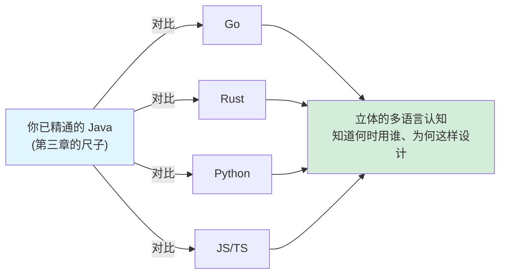
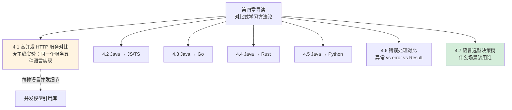

# 第四章 多语言对比：用 Java 这把尺子丈量世界

> 这是全书的**重头戏**。前三章是积累，这一章是爆发。
> 我们以你最熟悉的 **Java 为锚点**，把同一个问题（高并发、内存、类型、错误处理）在 Go、Rust、Python、JS/TS 里如何解决，**放在一起对比**，让你在一两天内建立对多门语言的「立体认知」。

---

## 这一章的方法论：对比式学习

成年工程师学新语言，最高效的方式不是「从头学语法」，而是**「拿已知锚定未知」**——把新语言的每个特性，对应到你已经精通的 Java 概念上，看清「相同点」和「关键差异」。

**对比维度**（也是第三章埋的钩子的兑现）：

- **并发模型**：Java 线程/虚拟线程 vs Go goroutine vs Rust async vs Node 事件循环 vs Python GIL
- **内存管理**：Java GC vs Go GC vs Rust 所有权（无 GC）
- **类型系统**：Java 名义类型/擦除 vs TS 结构类型 vs Rust 单态化
- **错误处理**：Java 异常 vs Go error vs Rust Result vs JS try-catch

---

## 本章地图

---

## 各节导读

**[4.1 高并发 HTTP 服务对比](./01-高并发HTTP服务对比.md)** —— 本章主线实验。用**同一个高并发 HTTP 服务**这个具体需求，给出 Java（虚拟线程）、Go、Rust、Node、Python 五种完整可运行实现，横向对比代码风格、并发模型、性能特征。涉及各语言并发细节时，用「钩子链接」跳到[并发模型引用库](../concurrency-models/README.md)深读。

**[4.2 Java → JS/TS](./02-Java到JS-TS.md)** —— 从 Java 视角快速掌握 TypeScript：结构类型 vs 名义类型、类型擦除的异同、`async/await`、生态对照。兑现 [3.4](../part3-java-deep/04-类型系统.md) 的钩子。

**[4.3 Java → Go](./03-Java到Go.md)** —— Go 的「少即是多」哲学：goroutine + channel（CSP）、`error` 返回值、组合优于继承、无 GC 焦虑的轻量 GC。兑现 [3.1](../part3-java-deep/01-并发体系.md)、[3.2](../part3-java-deep/02-内存模型JMM.md) 的钩子。

**[4.4 Java → Rust](./04-Java到Rust.md)** —— Rust 的「零成本抽象 + 内存安全」：所有权/借用/生命周期（无 GC）、`Result`、单态化泛型、`async`。兑现 [3.3](../part3-java-deep/03-JVM运行时.md)、[3.4](../part3-java-deep/04-类型系统.md) 的钩子。

**[4.5 Java → Python](./05-Java到Python.md)** —— Python 的动态哲学与 GIL 真相：鸭子类型、为什么 Python 多线程跑不满多核、asyncio。兑现 [1.3](../part1-mindset-shift/03-从强类型到类型光谱.md) 的钩子。

**[4.6 错误处理对比](./06-错误处理对比.md)** —— 同一个「读文件并解析」场景，四种语言四种错误处理哲学的完整实现对比。兑现 [3.5](../part3-java-deep/05-异常体系.md) 的钩子。

**[4.7 语言选型决策树](./07-语言选型决策树.md)** —— 收口章节。什么场景该用什么语言？给出可操作的决策树和真实场景建议。

---

## 阅读建议

强烈建议**先读 [4.1 高并发主线实验](./01-高并发HTTP服务对比.md)**，它用一个具体需求把五种语言「拉到同一张桌子上」，建立整体感。然后按需精读各语言专章。每当遇到并发模型的细节钩子，跳到[并发模型引用库](../concurrency-models/README.md)深入。最后用 [4.7 选型决策树](./07-语言选型决策树.md) 收口。

读完本章，你不会成为五门语言的专家，但你会拥有一件更宝贵的东西：**判断力**——知道每门语言擅长什么、为什么这样设计、什么场景该选谁。在 AI Coding 时代，这种判断力比记住语法重要一百倍。

---

[← 返回第三章](../part3-java-deep/05-异常体系.md) | [返回全书目录](../README.md) | [开始 4.1 高并发主线实验 →](./01-高并发HTTP服务对比.md)
