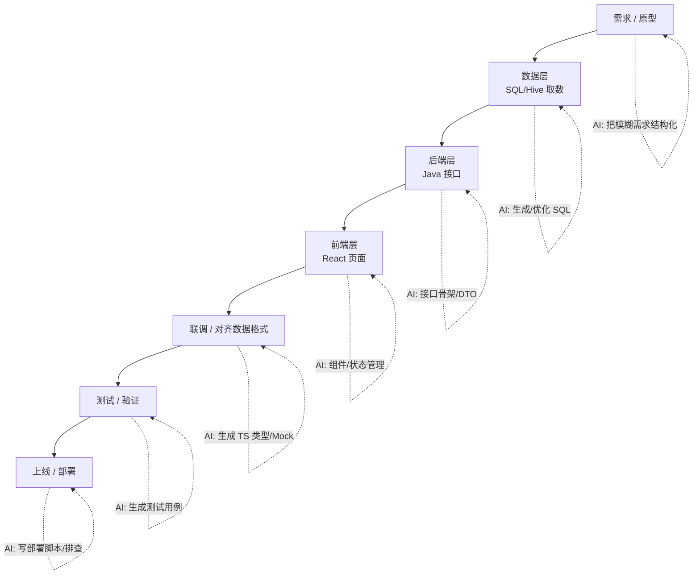

# 5.2 AI 辅助的全栈工作流：前后端一把梭

> 上一节讲「怎么学」，这一节讲「怎么干」——从需求到上线，AI 在全栈每个环节怎么帮你。

---

## 一、全栈的真正难点不是技术，是「上下文切换」

一个 Java 后端工程师转全栈，最大的痛苦不是「学不会 React」，而是**一天要在多个心智模式之间反复横跳**：

```
早上: 写 SQL/Hive 跑数据 (数据思维)
上午: 写 Java Service/接口 (后端思维, 强类型/JVM)
下午: 写 React 页面 (前端思维, 事件驱动/声明式 UI ── 第一章)
傍晚: 调样式、联调接口、改 Bug (又要切回数据格式对齐)
```

每次切换都要重新加载一套心智模型（[第一章讲的思维转变](../part1-mindset-shift/README.md)），这种「上下文切换税」才是全栈最累的地方。

**AI 的核心价值就是帮你扛住这个切换成本**——它不知疲倦，能在你切换到前端时立刻补上前端上下文，切回后端时立刻切回去。

---

## 二、全栈链路上 AI 的介入点

把一个完整功能（比如「做一个数据看板页面」）从需求到上线拆开，看 AI 在每一环怎么帮你：



### 各环节具体玩法

**① 数据层（你的主场）**：AI 帮你写复杂 SQL、做查询优化、解释执行计划。这是你最强的地方，AI 是锦上添花。

**② 后端层（你的主场）**：AI 生成接口骨架、DTO、参数校验、异常处理（[第三章异常体系](../part3-java-deep/05-异常体系.md)）。让它按你的规范产出，你审查。

**③ 前端层（你的弱项，AI 价值最大）**：这是全栈转型的主战场。AI 帮你：
- 生成 React/Vue 组件（[第二章框架](../part2-frontend-core/02-现代框架.md)）
- 配置状态管理（[第二章状态管理](../part2-frontend-core/03-状态管理.md)）
- 搭工程化脚手架（[第二章工程化](../part2-frontend-core/04-工程化.md)）

但**别当甩手掌柜**——你要能看懂它生成的代码，否则出 Bug 你束手无策。这就是为什么第二章要系统补前端知识：**AI 放大的是你的能力，不是替代你的理解。**

**④ 前后端联调（全栈的高频痛点）**：AI 的杀手锏——**根据你的 Java DTO 自动生成对应的 TypeScript 类型**，保证前后端数据契约一致（[第二章类型/4.2 类型对比](../part4-multilang-compare/02-Java到JS-TS.md)）。还能帮你生成 Mock 数据，让前端不依赖后端就能开发。

**⑤ 测试**：AI 生成单元测试、边界用例。

**⑥ 上线**：AI 帮你写部署脚本、解读 CI 报错、排查线上问题。

---

## 三、关键技巧：让 AI 维持「全栈一致性」

全栈最容易出 Bug 的地方是**前后端不一致**——后端字段叫 `userId`，前端写成 `userID`；后端返回 `Long`，前端按 `number` 处理结果精度丢失（JS 大数问题，[4.2](../part4-multilang-compare/02-Java到JS-TS.md)）。

用 AI 时，把**前后端上下文一起喂给它**：

```
这是我的 Java DTO:
record UserVO(Long id, String name, BigDecimal balance) {}

请：
1. 生成对应的 TypeScript interface；
2. 提醒我跨语言传输时哪些字段有坑（如 Long 精度、BigDecimal 序列化）；
3. 生成前端调用这个接口的 fetch 封装和类型守卫。
```

AI 会一次性帮你打通前后端类型契约，并主动提示 [JS 数字精度](../part4-multilang-compare/02-Java到JS-TS.md) 这类跨语言陷阱。

---

## 四、工作流的「黄金分工」

哪些交给 AI，哪些自己把关，原则很清晰：

| 环节 | 主导方 | 说明 |
|------|-------|------|
| 重复样板代码（DTO/CRUD/组件骨架） | **AI 主导** | 你审查 |
| 你不熟的前端实现细节 | **AI 主导** | 你要看懂 |
| 业务逻辑、核心算法 | **你主导** | AI 辅助 |
| 架构决策、技术选型 | **你主导** | 参考 [4.7 选型决策树](../part4-multilang-compare/07-语言选型决策树.md) |
| 并发/安全/数据一致性等关键逻辑 | **你主导 + 强验证** | AI 易出错，见 [5.3](./03-验证与避坑.md) |
| 数据格式对齐、跨语言契约 | AI 生成 + **你验证** | 高频 Bug 区 |

一句话：**AI 负责「广度」（帮你覆盖你不熟的领域），你负责「深度」（核心逻辑和最终决策）。**

---

## 五、一个端到端示例：3 小时做完一个数据看板

需求：「展示团队近 30 天的接口调用量趋势图」。

```
① 数据层(30min): 描述需求 → AI 给 Hive SQL → 你优化分区裁剪 → 跑通
② 后端层(40min): AI 生成 Spring 接口骨架 + DTO → 你填业务逻辑 + 缓存
③ 类型契约(10min): 把 DTO 喂 AI → 生成 TS 类型 + 提示 Long 精度坑
④ 前端层(60min): AI 生成 React 页面 + ECharts 折线图组件
                  + Zustand 管状态(第二章) → 你调样式、对齐交互
⑤ 联调(20min):   AI 生成 Mock 数据先跑通前端 → 接真实接口
⑥ 验证(20min):   AI 生成测试 → 你 review → 自己跑通核心路径(5.3)
```

3 小时，一个 Java 工程师独立交付了一个完整的全栈数据看板。这在 AI 之前可能要两三天，且前端部分要反复查文档踩坑。

---

## 本节小结

- 全栈最大的成本是**上下文切换税**，AI 的核心价值是帮你扛住「数据↔后端↔前端」的反复横跳。
- AI 在全栈链路**每个环节都能介入**，但价值最大的是你最弱的**前端层**和最易出 Bug 的**前后端联调**。
- 杀手锏：让 AI 根据 **Java DTO 自动生成 TS 类型**，打通前后端契约并提示跨语言陷阱（如 [Long 精度](../part4-multilang-compare/02-Java到JS-TS.md)）。
- **黄金分工**：AI 负责广度（你不熟的领域、样板代码），你负责深度（核心逻辑、架构决策、关键验证）。
- AI 放大的是你的能力，不替代你的理解——这正是为什么前四章的地基不可省。

---

[← 上一节：5.1 用 AI 快速进入陌生语言](./01-用AI快速进入陌生语言.md) | [下一节：5.3 验证与避坑 →](./03-验证与避坑.md)
