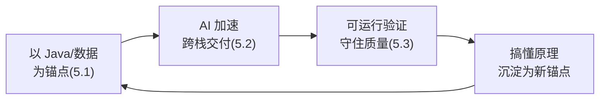

# 5.3 验证与避坑：AI 生成代码的信任边界

> 前两节让你「跑得快」，这一节让你「不翻车」。这是全书的收尾，也是最该刻进肌肉记忆的一节。

---

## 一、AI 会「自信地胡说」——这是它的本质特征

最危险的认知误区是：**把 AI 当成永远正确的权威。**

AI 生成代码的本质是「预测最可能的下一段文本」，它会：

- **编造不存在的 API**（幻觉）：信誓旦旦地调用一个根本不存在的方法或库。
- **给出能编译但逻辑错误的代码**：尤其在你不熟悉的语言里，你看不出错。
- **在并发、安全、边界条件上犯错**：这些恰恰是最难测出、后果最严重的地方。
- **用过时的写法**：训练数据有时滞，可能给你已废弃的 API。

对一个 Java 工程师，类比来理解：**AI 像一个知识极广但偶尔不负责任的实习生**——它什么都敢写，但你必须 Code Review，绝不能直接 merge。

---

## 二、信任边界：什么能信，什么必须验

按「出错概率 × 后果严重性」给 AI 输出分级，决定你的验证投入：

```
                出错后果严重 →
        高 ┌─────────────┬─────────────┐
        │  │ 谨慎使用      │ 必须严格验证   │
   出   │  │ (前端样式/    │ (并发/安全/   │
   错   │  │  工具脚本)    │  钱/数据一致性) │
   概   │  ├─────────────┼─────────────┤
   率   │  │ 可较放心      │ 重点验证      │
        │  │ (样板代码/    │ (核心业务逻辑/ │
        低 │  CRUD/DTO)   │  跨语言契约)   │
        └─────────────┴─────────────┘
```

| 区域 | 例子 | 策略 |
|------|------|------|
| 低风险低后果 | DTO、CRUD、组件骨架、格式转换 | 快速扫一眼即可 |
| 高频但后果有限 | 前端样式、工具脚本 | 跑起来看效果 |
| 核心业务逻辑 | 计费、状态流转、数据聚合 | 逐行读懂 + 写测试 |
| **高危区** | **并发（[第三章/并发库](../concurrency-models/README.md)）、安全、资金、数据一致性** | **绝不盲信，必须可运行验证 + 边界测试** |

---

## 三、四道验证防线

把验证做成固定动作，而不是凭感觉：

### 防线 1：能不能跑起来（最低门槛）

AI 给的代码**先跑通再说**。跑不起来的代码连讨论价值都没有。这能立刻筛掉幻觉 API、语法错误。本书每篇都坚持「可运行代码」就是这个道理。

### 防线 2：读懂每一行（不留黑盒）

```
不要接受任何你看不懂的代码。
看不懂 → 问 AI："逐行解释这段代码，特别是 X 这行为什么这么写"
        → 直到你能自己讲清楚为止
```

你看不懂的代码，出了 Bug 你无法排查，等于给自己埋雷。这也是为什么[第二章](../part2-frontend-core/README.md)要系统补前端——**没有知识地基，你连"看懂"都做不到。**

### 防线 3：边界与异常测试（重灾区）

AI 最容易在边界条件翻车。主动测：空值、超大值、并发、超时、异常路径。

- 数字：[JS 大整数精度](../part4-multilang-compare/02-Java到JS-TS.md)、除零、溢出
- 并发：竞态、死锁、goroutine/线程泄漏（[并发模型库](../concurrency-models/README.md)）
- 错误处理：异常有没有被吞掉（[第三章异常](../part3-java-deep/05-异常体系.md)、[4.6 错误处理对比](../part4-multilang-compare/06-错误处理对比.md)）

### 防线 4：交叉验证（高危逻辑）

对资金、安全、数据一致性这种高危逻辑，**用第二个信息源交叉验证**：查官方文档、问另一个 AI、找资深同事 review。单一来源不可信。

---

## 四、转型者最容易踩的坑（针对性提醒）

作为 Java/数据研发转全栈，你有一些**特定的盲区**，AI 不会主动替你兜底：

**坑 1：用 Java 直觉读其他语言的代码。** 比如以为 [Go 的 error 一定会被处理](../part4-multilang-compare/03-Java到Go.md)（其实容易被忽略）、以为 [JS 的 `==`](../part4-multilang-compare/02-Java到JS-TS.md) 和 Java 一样、以为 [Python 多线程能并行](../concurrency-models/python-gil-asyncio.md)（GIL）。这些「假朋友」AI 给的代码可能正确，但你 review 时会用错的直觉判断。

**坑 2：前端状态管理的心智没跟上。** AI 给你一段 React 代码，你按 Java 的「命令式改值」直觉去改，结果违反了[声明式 UI](../part1-mindset-shift/README.md) 和[状态不可变](../part2-frontend-core/03-状态管理.md)原则，引发诡异 Bug。

**坑 3：过度依赖导致能力空心化。** 如果你永远只是复制 AI 的代码而不理解，半年后你"会用"很多技术，但**没有一样真正掌握**，遇到 AI 也搞不定的问题就彻底卡死。

**应对**：把 AI 当「加速器」而非「替代品」。每次用 AI 解决一个你不懂的问题，花 5 分钟搞懂原理——这 5 分钟的复利，决定了你是「真全栈」还是「AI 复读机」。

---

## 五、收尾：可持续的全栈成长方式

把这本书的方法论收束成一个闭环：



每转一圈，你的「锚点知识」就更厚一层，下一次学新东西更快、验证更准。这是一个正向复利循环——**AI 让你跑得快，验证让你跑得稳，原理沉淀让你越跑越快。**

---

## 本节小结

- AI 会「自信地胡说」（幻觉 API、逻辑错误、并发/安全坑）——把它当**需要 Code Review 的实习生**，绝不直接 merge。
- 按「出错概率 × 后果」分级信任：样板代码可放心，**并发/安全/资金/数据一致性是高危区，必须严格验证**。
- **四道防线**：能跑起来 → 读懂每一行 → 边界异常测试 → 高危逻辑交叉验证。
- 转型者特定坑：用 Java 直觉误读其他语言（[假朋友](../part4-multilang-compare/README.md)）、前端状态心智没跟上、过度依赖导致能力空心化。
- 可持续成长闭环：**锚点 → AI 加速 → 验证守质量 → 搞懂原理沉淀为新锚点**，循环复利。

---

## 全书完 🎓

你已经走完了从「数据/Java 后端」到「AI 时代全栈工程师」的完整路径：

[换脑子](../part1-mindset-shift/README.md) → [补前端](../part2-frontend-core/README.md) → [夯实 Java](../part3-java-deep/README.md) → [打通多语言](../part4-multilang-compare/README.md) → [用 AI 加速](./README.md)。

现在，带着你的锚点知识和 AI 这个加速器，去交付真实的产品吧。

---

[← 上一节：5.2 AI 辅助的全栈工作流](./02-AI辅助的全栈工作流.md) | [返回全书首页](../README.md)
