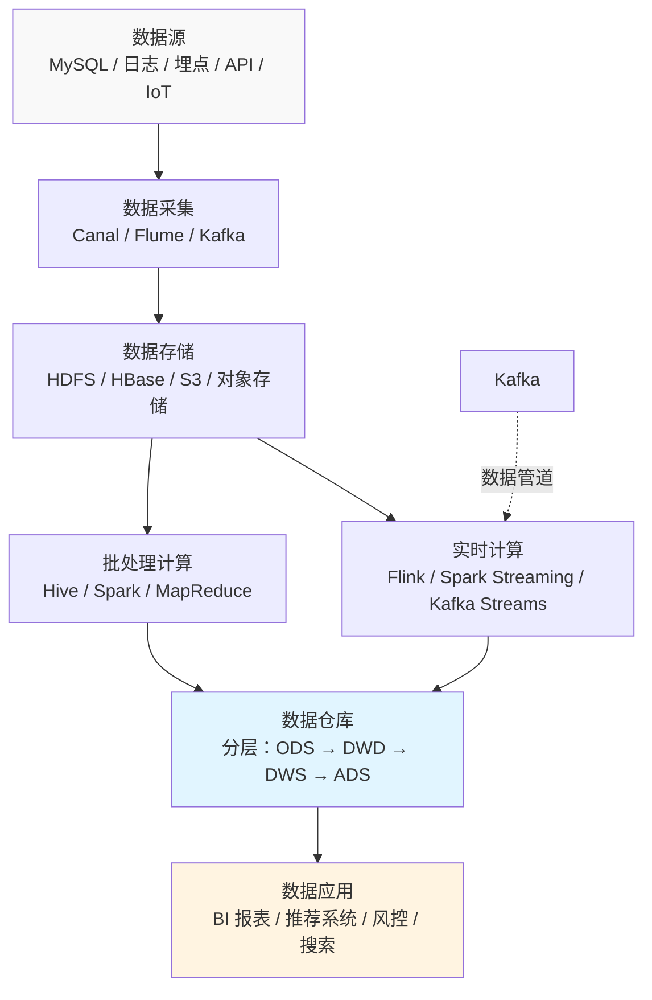
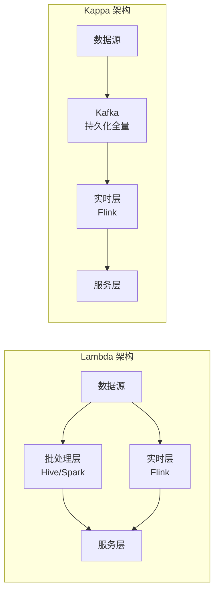

# 6.1 大数据技术栈全景——从 MySQL 到分布式数据处理

> **一句话定位**：当数据量增长到单机 MySQL 扛不住时（亿级以上），你需要另一套技术体系来存储和计算。本章从后端开发者熟悉的 MySQL 出发，讲清楚大数据技术栈的全景、各组件的定位、数仓分层的设计思路，以及批处理和实时计算的区别。

---

## 一、为什么需要大数据技术？

### 1.1 MySQL 的三大天花板

| 瓶颈 | MySQL 的极限 | 大数据的解法 |
|------|-------------|-------------|
| **存储容量** | 单机磁盘上限，分库分表也有管理复杂度天花板 | HDFS 分布式文件系统，理论上无限水平扩展 |
| **查询速度** | 单表超过 5000 万行查询开始变慢，复杂分析查询更甚 | MapReduce / Spark 把计算分发到多台机器并行执行 |
| **实时处理** | 不适合流式数据（日志、埋点、IoT 传感器每秒百万条） | Flink / Kafka Streams 实时计算引擎 |

> 这不是说大数据"更好"。MySQL 和大数据是**不同场景的最优解**——MySQL 擅长事务、精确查询、低延迟 CRUD；大数据擅长海量存储、批量分析、流式处理。详见 [3.9 MySQL](../part3-java-deep/09-数据库MySQL.md) 和 [A5 ElasticSearch](../part3-java-deep/A5-ElasticSearch.md) 中的对比。

### 1.2 OLTP vs OLAP

理解大数据的起点是区分两种数据处理模式：

| 维度 | OLTP（联机事务处理） | OLAP（联机分析处理） |
|------|-------------------|-------------------|
| 核心操作 | INSERT / UPDATE / DELETE | SELECT（复杂聚合查询） |
| 数据量 | 单次操作涉及少量行 | 单次查询扫描百万到亿级行 |
| 延迟要求 | 毫秒级 | 秒级到分钟级可接受 |
| 典型系统 | MySQL、PostgreSQL | Hive、Spark、ClickHouse |
| 典型场景 | 用户下单、修改密码 | 统计昨日 GMV、分析用户留存 |

**MySQL 是 OLTP 的王者，但做 OLAP 力不从心**。大数据技术栈主要解决的是 OLAP 场景。

---

## 二、核心技术栈全景

### 2.1 数据流转全景图



### 2.2 Hadoop 生态——大数据的基石

在展开各组件之前，先理解一个绑定关系：**Hadoop 不是某一个软件，而是一个生态**。它由三个核心组件组成，几乎所有大数据技术栈都在它的基础上构建。

```
Hadoop 生态三件套：
  HDFS   = 分布式文件系统（数据放哪）     → 详见 6.2 HDFS
  MapReduce = 分布式计算框架（数据怎么算） → 已被 Spark 大量取代
  YARN   = 集群资源管理器（谁来分配 CPU/内存）→ Spark/Flink/Hive 都可以跑在 YARN 上
```

后端开发者可以这样理解：HDFS 类似一个"超大号的分布式磁盘"，YARN 类似 Kubernetes（负责调度容器和分配资源），MapReduce / Spark / Flink 类似跑在 K8s 上的"计算应用"。你日常接触最多的是 HDFS（数仓表的底层存储）和 YARN（提交 Spark/Hive 任务时的资源调度器），MapReduce 作为计算引擎已经被 Spark 取代，但它的"先 Map 再 Reduce"的编程模型仍然是理解所有分布式计算的基础。

### 2.3 核心组件速查

大数据技术栈的组件按职责可以分为五类：存储引擎负责"数据放哪"，计算引擎负责"数据怎么算"，查询引擎负责"怎么用 SQL 查"，数据采集负责"数据怎么进来"，数据管道负责"数据怎么流转"。

**存储——数据放哪**

存储技术按数据模型可以分为四大类。不同类型的存储解决不同的问题，实际架构中通常多种共存、各司其职。

| 分类 | 组件 | 数据模型 | 一句话 | 典型场景 |
|------|------|---------|--------|---------|
| **关系型（SQL）** | MySQL / PostgreSQL | 表、行、列，强 Schema | ACID 事务 + 精确查询，详见 [3.9 MySQL](../part3-java-deep/09-数据库MySQL.md) | 订单、用户、支付等核心业务数据 |
| | TiDB / CockroachDB | 兼容 MySQL 协议的分布式 SQL | 水平扩展的关系型数据库，解决单机 MySQL 容量瓶颈 | 单表过亿但仍需事务和 SQL 的场景 |
| **NoSQL** | Redis | Key-Value | 内存存储，微秒级读写，详见 [3.8 Redis](../part3-java-deep/08-缓存与Redis.md) | 缓存、会话、排行榜、分布式锁 |
| | MongoDB | 文档（JSON/BSON） | 灵活 Schema，嵌套结构，详见 [A5 NoSQL 速览](../part3-java-deep/A5-ElasticSearch.md) | 内容管理、用户画像、IoT |
| | HBase | 列族（Column Family） | 十亿级行的实时随机读写，跑在 HDFS 之上 | 用户行为明细、消息存储、时序数据 |
| | Cassandra | 宽列（Wide Column） | 去中心化、高可用写入，AP 架构 | 日志、IoT、跨数据中心场景 |
| **搜索引擎** | ElasticSearch | 倒排索引 + JSON 文档 | 全文检索 + 聚合分析，详见 [A5 ES](../part3-java-deep/A5-ElasticSearch.md) | 搜索框、日志分析、实时监控 |
| **分布式文件/对象存储** | HDFS | 文件块（128MB） | 大文件切块分散存储，3 副本容灾 | 数仓底层存储、批处理数据源 |
| | S3 / 对象存储 | 对象（Key-Blob） | 云上无限容量，按量付费 | 存算分离架构的底座（AWS S3 / 阿里 OSS） |

> 关系型数据库擅长事务和精确查询（OLTP），但海量数据分析（OLAP）力不从心；HDFS/S3 擅长海量存储但不支持随机查询；NoSQL 各有专长但牺牲了 SQL 的灵活性。**没有万能存储，只有场景匹配。**

**计算引擎——数据怎么算**

| 组件 | 一句话 | 关键特点 |
|------|--------|---------|
| **MapReduce** | 先 Map（拆分+处理）再 Reduce（汇总） | Hadoop 原生计算引擎，磁盘 IO 重，已被 Spark 大量取代 |
| **Spark** | 内存计算，比 MapReduce 快 10-100 倍 | 支持 SQL / ML / Graph / Streaming，批处理主流选择 |
| **Flink** | 事件驱动、毫秒级延迟的流处理 | 也支持批处理，实时场景首选（实时大盘/风控/推荐） |

**查询引擎——怎么用 SQL 查**

| 组件 | 一句话 | 关键特点 |
|------|--------|---------|
| **Hive** | 用 SQL 查询 HDFS 上的数据 | 底层转成 MapReduce/Spark 任务，后端开发者最容易上手的入口 |
| **ClickHouse** | OLAP 场景极致查询速度 | 列式存储 + 向量化执行，适合实时 BI 看板 |
| **Presto / Trino** | 跨数据源的交互式 SQL 查询 | 内存计算，秒级响应，可同时查 Hive + MySQL + ES |

**数据采集——数据怎么进来**

| 组件 | 一句话 | 关键特点 |
|------|--------|---------|
| **Canal** | 伪装成 MySQL 从库，监听 Binlog 实时同步 | MySQL → Kafka / ES / 数仓的标准方案 |
| **Flume** | 日志采集，从服务器收集日志写入 HDFS/Kafka | 适合海量日志文件的批量采集 |
| **Flink CDC** | 基于 Flink 的变更数据捕获（CDC = Change Data Capture） | 支持 MySQL/PostgreSQL/MongoDB，全增量一体化 |

> **什么是 CDC？** CDC（Change Data Capture，变更数据捕获）是一种通过监听数据库变更日志（MySQL Binlog / PostgreSQL WAL 等）实时捕获增删改操作的技术。相比定时调接口或 SELECT 轮询同步，CDC 的核心优势是：**低延迟**（秒级，而非小时/天级）、**对源库几乎无压力**（只读日志，不执行查询）、**不丢变更**（能捕获两次轮询之间的所有中间状态，包括 DELETE）。常见实现包括 Flink CDC、Debezium、Canal 等，其中 **Flink CDC 是当前最主流的方案**——它支持全增量一体（先全量快照再无缝切增量）、无需 Kafka 中转、基于 Checkpoint 保证 Exactly-Once。详见 [6.16 数据接入与数据集成](./16-数据接入与数据集成.md) 第三章。

**数据管道——数据怎么流转**

| 组件 | 一句话 | 关键特点 |
|------|--------|---------|
| **Kafka** | 分布式提交日志 | 大数据的"血管"，连接采集层和计算层，详见 [3.12 消息队列](../part3-java-deep/12-消息队列.md) |
| **Airflow / DolphinScheduler** | 任务调度系统 | 定义 ETL 任务的执行顺序和依赖关系，定时触发 |

---

## 三、数据仓库分层模型

数据仓库不是把原始数据堆在一起就完了——它有严格的分层设计，每一层有明确的职责，就像软件工程里的分层架构一样。

### 3.1 四层模型

| 层级 | 全称 | 作用 | 数据特点 | 类比 |
|------|------|------|---------|------|
| **ODS** | Operational Data Store | 原始数据层，从业务库/日志同步的原始数据 | 不做清洗，保留原貌 | 原始食材进仓库 |
| **DWD** | Data Warehouse Detail | 明细数据层，清洗、去重、标准化 | 一行一条业务事实 | 食材洗干净切好 |
| **DWS** | Data Warehouse Summary | 汇总数据层，轻度聚合 | 按主题汇总（日活/GMV/留存） | 半成品预制菜 |
| **ADS** | Application Data Service | 应用数据层，直接给报表/API 使用 | 面向具体需求的宽表 | 最终上桌的菜 |

### 3.2 为什么要分层？

和代码分层的道理一样——**解耦和复用**。

**如果不分层**：每个报表需求都从原始数据开始算，重复计算量巨大，逻辑散落各处，改一个指标口径要改 N 个地方。

**分层之后**：ODS 负责"搬运"，DWD 负责"清洗"（只做一次），DWS 负责"聚合"（多个报表复用同一个汇总表），ADS 负责"出口"（直接对接 BI/API）。修改指标口径只需要改 DWD→DWS 的某一条 ETL，下游自动更新。

### 3.3 ETL 是什么？

ETL = **Extract（抽取）→ Transform（转换）→ Load（加载）**。就是"从数据源取数据 → 清洗转换 → 写入目标表"的过程。大数据领域的 ETL 任务通常用 Hive SQL 或 Spark SQL 编写，由调度系统（如 Airflow、DolphinScheduler）定时触发。

---

## 四、批处理 vs 实时计算

### 4.1 两种计算模式

| 维度 | 批处理 | 实时计算（流处理） |
|------|--------|-----------------|
| 数据特点 | 有界数据集（昨天的日志、上个月的订单） | 无界数据流（持续产生的日志、埋点） |
| 延迟 | 分钟~小时 | 毫秒~秒 |
| 典型引擎 | Hive、Spark | Flink、Kafka Streams |
| 典型场景 | T+1 日报、历史数据分析 | 实时大盘、风控、推荐 |

### 4.2 Lambda 架构 vs Kappa 架构

这是大数据系统设计的两种经典架构：

**Lambda 架构**：批处理层（跑全量，结果准确但慢）+ 实时层（增量更新，速度快但可能有误差）+ 服务层（合并两者结果提供给应用）。问题是要维护两套代码逻辑。

**Kappa 架构**：只保留实时层，用 Kafka 持久化全量数据，需要重算时从 Kafka 回放。更简洁，但对实时引擎的可靠性要求更高。



---

## 五、Hive SQL vs MySQL SQL——后端开发者最容易踩的坑

Hive SQL 语法和 MySQL SQL 高度相似（都是 SQL），后端开发者上手很快，但底层完全不同（分布式计算 vs 单机数据库），有几个关键差异需要注意：

| 维度 | MySQL | Hive |
|------|-------|------|
| 执行速度 | 秒级返回 | 提交为 MapReduce/Spark 任务，分钟级甚至更久 |
| 事务 | 完整 ACID | 3.0+ 有限支持（ORC 格式 + 分桶表） |
| 索引 | B+ 树索引是核心优化手段 | 几乎不用传统索引，靠**分区裁剪**优化 |
| 数据类型 | 标准关系型 | 支持复杂类型 `ARRAY`、`MAP`、`STRUCT` |
| UPDATE/DELETE | 原生支持 | 有限支持（需要事务表） |
| 分区 | 按日期/范围分区（逻辑分区） | 物理目录分区（`/year=2024/month=06/`），是**最重要的优化手段** |

<details>
<summary><b>展开：Hive 分区裁剪示例</b></summary>

```sql
-- Hive 表按天分区
CREATE TABLE user_events (
    user_id BIGINT,
    event_type STRING,
    event_time TIMESTAMP
) PARTITIONED BY (dt STRING)  -- dt 是分区字段
STORED AS ORC;

-- 查询时指定分区，只扫描 2024-06-29 这一天的数据目录
-- 而不是扫描全部历史数据
SELECT user_id, COUNT(*) 
FROM user_events 
WHERE dt = '2024-06-29'  -- 分区裁剪：只读 /dt=2024-06-29/ 目录
GROUP BY user_id;
```

如果不加 `WHERE dt = ...`，Hive 会扫描**所有分区**（可能是几年的数据），这是 Hive 查询慢的首要原因。在 MySQL 中漏写 WHERE 条件只是全表扫描，在 Hive 中漏写分区条件可能意味着扫描 PB 级数据。

</details>

---

## 六、大数据与后端的协作模式

作为后端开发者，你通常不需要自己搭建大数据集群，但需要理解和数据团队的协作方式：

| 协作场景 | 你（后端）做什么 | 数据团队做什么 |
|---------|---------------|--------------|
| **数据同步** | 维护 MySQL 表结构，确保 Binlog 开启 | 用 Canal/Flink CDC 把 MySQL 数据同步到数仓 |
| **埋点接入** | 按规范发送埋点事件到 Kafka | 消费 Kafka 数据写入数仓 |
| **数据服务** | 从 ADS 层/ClickHouse 读取数据提供 API | 建设 DWD→DWS→ADS 链路 |
| **实时风控** | 提供交易事件到 Kafka | Flink 实时计算风险分，结果写回 Redis/MySQL |
| **A/B 实验** | 按实验分组参数走不同逻辑 | 分析实验指标，输出报告 |

> **核心认知**：后端和大数据的边界通常在 **Kafka**——后端负责把业务数据/事件投递到 Kafka，大数据负责从 Kafka 消费并处理。Kafka 是两个领域之间的"接口"。

---

## 七、面试深度剖析

### 考点 1：什么场景用大数据？

> **面试官**：「你们什么时候决定引入大数据技术的？」

当 MySQL 在以下场景力不从心时：单表数据量过亿且复杂聚合查询超时、需要实时处理流式数据（日志/埋点）、需要跨多个业务库的全局分析报表。不是数据量大了就上大数据——如果只是单表大，分库分表或者 TiDB 可能就够了。

### 考点 2：数仓分层的意义

> **面试官**：「数仓为什么要分层？不能直接在原始数据上算吗？」

解耦和复用。分层后每层职责清晰，修改指标口径只改一处，多个报表复用同一个汇总表避免重复计算。类比代码分层：Controller/Service/DAO 的逻辑。

### 考点 3：Flink vs Spark

> **面试官**：「Flink 和 Spark 有什么区别？」

核心区别是**计算模型**：Spark 本质是批处理引擎（微批次模拟流），Flink 本质是流处理引擎（也能做批）。Flink 在实时性上更有优势（毫秒级 vs 秒级），Spark 在批处理生态和 ML 方面更成熟。简单说：实时场景选 Flink，批处理场景选 Spark。

---

[返回本章目录](./README.md) | [返回全书目录](../README.md)
