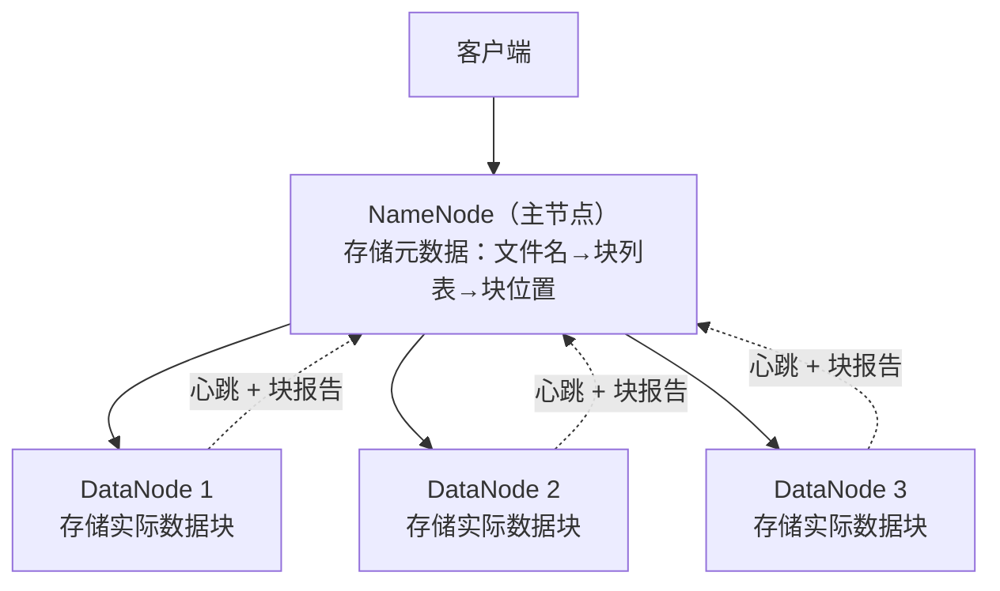

# 6.2 HDFS——分布式文件系统的基石

> **一句话定位**：HDFS（Hadoop Distributed File System）是大数据存储的地基——Hive 的表数据存在 HDFS 上，Spark 从 HDFS 读数据，HBase 底层也跑在 HDFS 上。理解 HDFS 的架构和读写流程，是理解整个 Hadoop 生态的起点。

---

## 一、设计思路——为什么不用普通文件系统？

普通文件系统（ext4、NTFS）跑在单机上，容量受限于一块磁盘。HDFS 要解决的问题是：**把成百上千台机器的磁盘组合成一个逻辑上的"超大文件系统"**，对外提供统一的读写接口。

HDFS 的设计基于三个假设：硬件会坏（所以要多副本），文件很大（所以切成大块），读多写少（所以优化顺序读，不支持随机修改）。

---

## 二、核心架构——NameNode + DataNode



| 角色 | 职责 | 数量 | 存什么 |
|------|------|------|--------|
| **NameNode** | 管理元数据（文件目录树、文件→块映射、块→DataNode 映射） | 1 个 Active + 1 个 Standby（HA） | 元数据存内存，持久化到 FsImage + EditLog |
| **DataNode** | 存储实际的数据块，定期向 NameNode 发心跳和块报告 | 成百上千个 | 磁盘上的数据块文件（默认 128MB/块） |
| **Secondary NameNode** | 定期合并 FsImage 和 EditLog，减轻 NameNode 重启负担 | 1 个 | 不是 NameNode 的热备！名字有误导性 |

### 2.1 数据分块（Block）

一个大文件被切成固定大小的**块（Block）**，默认 128MB（Hadoop 2.x+，1.x 是 64MB）。每个块独立存储在不同 DataNode 上，默认 3 副本。**在 DataNode 的本地磁盘上，每个 Block 就是一个独立的本地文件**（存储在 `dfs/data/` 目录下，文件名类似 `blk_1073741825`，附带一个 `.meta` 校验文件）。逻辑上一个 HDFS 文件 = 多个 Block 的有序组合，物理上每个 Block 是完全独立的文件，可以分散在不同机器上。

```
文件 app.log（300MB）
  → Block 0（128MB）→ 副本在 DN1, DN3, DN5
  → Block 1（128MB）→ 副本在 DN2, DN4, DN6
  → Block 2（44MB） → 副本在 DN1, DN2, DN4
```

> **为什么块这么大（128MB）？** 和 MySQL 的 16KB 页相比，HDFS 块大得多。这里的"页"（Page）是 InnoDB 在磁盘和内存之间交换数据的最小单位——磁盘上的 `.ibd` 文件由 16KB 的页顺序排列组成，读到内存（Buffer Pool）里还是 16KB 的页，格式完全一样，不是"只存在于内存"或"只存在于磁盘"。MySQL 用 16KB 小页是因为它要做**细粒度的行级随机读写**；HDFS 用 128MB 大块是因为它针对**顺序读大文件**优化——块越大，寻址（找到块的位置）占总耗时的比例越小，吞吐量越高。如果块设成 4KB 像普通文件系统一样，一个 1GB 文件要管理 26 万个块的元数据，NameNode 内存会爆。
>
> **"顺序读"是什么意思？** 顺序读是指按磁盘地址从前往后连续读取，和"随机读"（跳着读，磁头频繁寻址）相对。HDFS 的设计假设是你会从头到尾把一个大文件（或一个 Block）连续读完，而不是跳到中间某个位置读几个字节。所以 Block 设成 128MB 这么大——一次寻址后可以连续读很久，摊薄了寻址开销；同时 HDFS 不支持随机修改（只能追加写），保证数据在磁盘上保持连续排列不碎片化。
>
> **为什么恰好是 128MB，而不是 64MB 或 256MB？** 这是一个工程权衡。经验法则是：**让磁盘寻址时间占数据传输时间的 1% 左右**。机械硬盘寻址约 10ms，顺序读吞吐约 100MB/s，要让寻址占比 ≤1%，传输时间需 ≥1s，即块大小 ≥ 100MB，取 2 的幂就是 128MB。64MB 时寻址占比偏高（~1.5%），吞吐不够优；256MB 时吞吐更好，但单个 Map 任务处理时间变长，容易出现尾部效应（最慢的任务拖住整个 Job），且故障恢复粒度变粗。128MB 是"磁盘吞吐最大化"和"计算并行度"之间的平衡点。实际生产中可根据硬件调整——SSD/NVMe 时代寻址时间降到 <0.1ms，很多公司已将 Block 调到 256MB 甚至 512MB。

### 2.2 副本放置策略

3 副本不是随便放的，有明确的策略来平衡可靠性和性能：

```
第 1 副本：写入客户端所在的 DataNode（本地写，最快）
第 2 副本：另一个机架（Rack）的某个 DataNode（跨机架容灾）
第 3 副本：和第 2 副本同机架的不同 DataNode（同机架内复制快）
```

这样即使整个机架断电，另一个机架上还有副本。

---

## 三、读写流程

### 3.1 写入流程

```
① 客户端请求 NameNode 创建文件
② NameNode 检查权限和路径，返回可写的 DataNode 列表
③ 客户端把数据发给第 1 个 DataNode
④ DataNode 之间以 Pipeline 方式接力复制（DN1 → DN2 → DN3）
⑤ 所有副本写完后，DN 向 NameNode 确认
⑥ NameNode 更新元数据
```

关键点：客户端只和第 1 个 DataNode 通信，副本复制是 DataNode 之间的 Pipeline，不经过客户端。

### 3.2 读取流程

```
① 客户端请求 NameNode "我要读文件 X"
② NameNode 返回文件各个块的 DataNode 位置列表（按距离排序）
③ 客户端直接连接最近的 DataNode 读取数据
④ 读完一个块，读下一个块（可能在不同 DataNode 上）
```

关键点：NameNode 只参与元数据查询，**实际数据不经过 NameNode**——这避免了 NameNode 成为 IO 瓶颈。

---

## 四、NameNode 高可用（HA）

NameNode 是单点——如果它挂了，整个 HDFS 不可用。Hadoop 2.x 引入了 HA 方案：

```
Active NameNode ←→ Standby NameNode
        ↓                    ↓
   共享 EditLog（JournalNode 集群 / NFS）
```

Active 和 Standby 通过共享 EditLog 保持元数据同步。Active 挂了，Standby 自动接管（通过 ZooKeeper 做故障检测和切换）。

<details>
<summary><b>展开：HDFS Federation——解决 NameNode 内存瓶颈</b></summary>

单个 NameNode 的元数据全放内存，当集群规模极大（数十亿文件）时，内存会成为瓶颈。HDFS Federation 允许多个独立的 NameNode 各管一部分命名空间（Namespace），共享底层的 DataNode。每个 NameNode 只管自己那部分目录树的元数据，水平扩展了元数据容量。

</details>

---

## 五、面试深度剖析

### 考点 1：HDFS 适合什么场景？不适合什么？

> **面试官**：「HDFS 有什么局限性？」

**适合**：大文件的顺序读写（日志、数据仓库、批处理输入）。**不适合**：小文件（每个文件至少占 NameNode 150 字节元数据内存，百万小文件会吃掉 NameNode 内存）；随机读写（不支持随机修改文件内容，只能追加）；低延迟访问（寻址开销大，毫秒级读取用 HBase 或 Redis）。

### 考点 2：NameNode 的单点问题怎么解决？

> **面试官**：「NameNode 挂了怎么办？」

HA 方案：Active + Standby 双 NameNode，共享 EditLog（JournalNode 集群），ZooKeeper 做故障检测和自动切换。Standby 定期从 JournalNode 拉取 EditLog 保持同步，切换时间秒级。

### 考点 3：HDFS 的小文件问题

> **面试官**：「HDFS 为什么怕小文件？怎么解决？」

NameNode 元数据全在内存，每个文件/块约占 150 字节。1 亿个小文件 ≈ 15GB 内存，而且 MapReduce 每个小文件至少启动一个 Map 任务，任务调度开销远大于实际计算。解决方案：合并小文件（HAR 归档、SequenceFile 合并）、使用 CombineFileInputFormat 让一个 Map 处理多个小文件。

### 考点 4：Block 大小为什么是 128MB？

> **面试官**：「HDFS 块大小为什么不设小一点？」

块越大，寻址时间占比越小，吞吐量越高。但块太大会导致负载不均衡（一个 Map 任务处理一个块，块太大则任务耗时差异大）。128MB 是吞吐量和并行度的平衡点。可以根据场景调整（比如 256MB 甚至 512MB）。

---

## 六、分布式存储的两种范式：HDFS vs 对象存储（S3/MinIO）

HDFS 是文件系统语义（目录树 + 文件路径），适合 Hadoop/Spark 生态的大数据分析。但在实际工程中，很多场景需要另一种存储范式——对象存储。

### 6.1 对象存储（S3/MinIO）

S3（Amazon Simple Storage Service）已成为对象存储的事实标准 API。核心数据模型是扁平的——Bucket（桶）+ Object Key（对象键），没有目录树层级。每个 Object 是一个不可变文件（写入后不能修改，只能覆盖或删除）。

S3 API 的核心操作：PutObject（上传，限制单次 5GB）、GetObject（下载）、Multipart Upload（分片上传——把大文件分成多个 Part 并行上传，每片最大 5GB，总共最大 5TB，支持断点续传——某片失败只需重传该片）、ListObjects（列出桶内对象，支持前缀过滤）。

MinIO 是开源的 S3 兼容对象存储，用 Go 实现。核心特性是纠删码（Erasure Coding）存储——数据分成 N 个数据块 + M 个校验块，分散存储在不同节点上。任一节点故障，只要剩余数据块 + 校验块数 ≥ N 就能恢复数据。比三副本（HDFS 的策略）节省约 50% 存储空间。MinIO 是去中心化架构——没有像 HDFS NameNode 那样的中心元数据服务器，每个节点既存数据又做网关。

### 6.2 HDFS vs 对象存储选型

| 维度 | HDFS | S3/MinIO |
|------|------|----------|
| 数据模型 | 目录树 + 文件路径 | Bucket + Key，扁平命名空间 |
| 元数据管理 | NameNode 集中管理 | 去中心化，无中心元数据服务器 |
| 文件修改 | 支持追加，不支持随机修改 | 不可变，只能覆盖或删除 |
| 副本策略 | 三副本（200% 空间开销） | 纠删码（约 50% 空间开销） |
| 小文件 | 性能差（NameNode 内存瓶颈） | 无此问题（没有集中元数据） |
| 生态集成 | Hadoop/Spark 原生 | S3A 连接器接入 Hadoop 生态 |
| 适用场景 | 大文件分析、数据仓库 | 大文件存储、备份归档、云原生应用 |

实际工程中两者经常共存——对象存储存原始大文件（传感器数据、日志、镜像），HDFS 存处理后的结构化数据（Parquet/ORC 列存表、分析结果）。

---

## 七、HBase 与 LSM Tree：海量时序 KV 存储

HDFS 适合大文件分析，但不适合海量小记录的快速读写——比如自动驾驶场景中每辆车的每帧传感器元数据（数十亿条记录，需要毫秒级按车辆 + 时间范围查询）。HBase 解决这个问题。

### 7.1 LSM Tree 原理

> 本节是 HBase 语境下的简要介绍。LSM-Tree 的完整深入讲解（SST 文件内部结构、分层 Compaction、三种放大效应、各系统实现对比等）见 [A1 核心数据结构原理 · 第十一章](../part3-java-deep/A1-核心数据结构原理.md#十一lsm-tree-与-sst-文件写优化存储引擎的通用原理)。

HBase 的存储引擎是 LSM Tree（Log-Structured Merge-Tree），跟 MySQL 的 B+ Tree 是两种不同的存储引擎哲学。B+ Tree 优化读性能（有序结构，二分查找快）但写性能受限（随机写——每次插入可能触发页分裂和磁盘随机 IO）。LSM Tree 优化写性能——写入流程是顺序写 WAL（Write-Ahead Log，保证持久性）→ 写 MemTable（内存中的有序跳表/红黑树）→ MemTable 满了刷盘成 SSTable（Sorted String Table，磁盘上的有序文件）。所有写入都是顺序的，没有随机磁盘 IO。

读取需要合并查询 MemTable + 多层 SSTable——先查 MemTable（内存中最新数据），再逐层查 SSTable（磁盘上历史数据）。为了加速读取，用布隆过滤器（参见 A1 核心数据结构原理）判断某个 key 是否在某个 SSTable 中，避免无效的磁盘读取。后台 Compaction 定期合并多层 SSTable，清理已删除和已覆盖的数据，减少读取时的合并层数。

核心 trade-off：LSM Tree 牺牲读性能（需要合并多层数据）换取写性能（纯顺序写）。适合写多读少的场景——时序数据、日志、传感器数据。B+ Tree 牺牲写性能（随机写 + 页分裂）换取读性能（单层查找）。适合读多写少的场景——用户信息、订单记录、配置数据。

### 7.2 HBase 核心架构

HBase 的核心概念：RowKey 是唯一的索引——所有查询都走 RowKey（或 RowKey 前缀扫描），没有二级索引。RowKey 设计是 HBase 性能的决定因素。Region 是按 RowKey 范围分区的数据分片——数据按 RowKey 排序存储，当 Region 太大时自动分裂（Split）。RegionServer 负责管理一个或多个 Region 的读写请求。HMaster 负责 Region 分配和负载均衡。

RowKey 设计实践——时序场景的经典模式是 `entity_id + reverse_timestamp`。比如自动驾驶场景的 RowKey 是 `vehicle_id + (Long.MAX_VALUE - timestamp)`——按车辆分区（同一辆车的数据在相邻 Region），按时间倒序排列（最新数据在最前面），通过 RowKey 前缀扫描快速查询某辆车某段时间的数据。避免热点问题——如果只用时间戳做 RowKey，所有写入都打到同一个 Region（因为时间戳递增，新数据总在最后），需要加随机前缀打散写入。

---

[← 6.1 大数据技术栈全景](./01-大数据技术栈全景.md) | [返回本章目录](./README.md) | [6.3 Hive →](./03-Hive.md)
