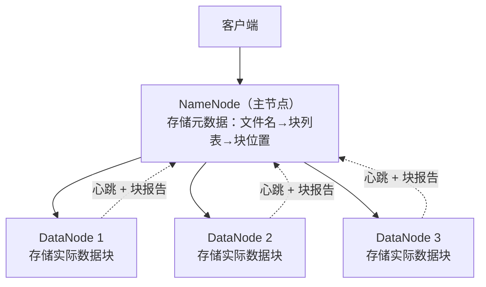

# 6.2 HDFS——分布式文件系统的基石

> **一句话定位**：HDFS（Hadoop Distributed File System）是大数据存储的地基——Hive 的表数据存在 HDFS 上，Spark 从 HDFS 读数据，HBase 底层也跑在 HDFS 上。理解 HDFS 的架构和读写流程，是理解整个 Hadoop 生态的起点。

---

## 一、设计思路——为什么不用普通文件系统？

普通文件系统（ext4、NTFS）跑在单机上，容量受限于一块磁盘。HDFS 要解决的问题是：**把成百上千台机器的磁盘组合成一个逻辑上的"超大文件系统"**，对外提供统一的读写接口。

HDFS 的设计基于三个假设：硬件会坏（所以要多副本），文件很大（所以切成大块），读多写少（所以优化顺序读，不支持随机修改）。

---

## 二、核心架构——NameNode + DataNode



| 角色 | 职责 | 数量 | 存什么 |
|------|------|------|--------|
| **NameNode** | 管理元数据（文件目录树、文件→块映射、块→DataNode 映射） | 1 个 Active + 1 个 Standby（HA） | 元数据存内存，持久化到 FsImage + EditLog |
| **DataNode** | 存储实际的数据块，定期向 NameNode 发心跳和块报告 | 成百上千个 | 磁盘上的数据块文件（默认 128MB/块） |
| **Secondary NameNode** | 定期合并 FsImage 和 EditLog，减轻 NameNode 重启负担 | 1 个 | 不是 NameNode 的热备！名字有误导性 |

### 2.1 数据分块（Block）

一个大文件被切成固定大小的**块（Block）**，默认 128MB（Hadoop 2.x+，1.x 是 64MB）。每个块独立存储在不同 DataNode 上，默认 3 副本。

```
文件 app.log（300MB）
  → Block 0（128MB）→ 副本在 DN1, DN3, DN5
  → Block 1（128MB）→ 副本在 DN2, DN4, DN6
  → Block 2（44MB） → 副本在 DN1, DN2, DN4
```

> **为什么块这么大（128MB）？** 和 MySQL 的 16KB 页相比，HDFS 块大得多。原因是 HDFS 针对**顺序读大文件**优化——块越大，寻址（找到块的位置）占总耗时的比例越小，吞吐量越高。如果块设成 4KB 像普通文件系统一样，一个 1GB 文件要管理 26 万个块的元数据，NameNode 内存会爆。

### 2.2 副本放置策略

3 副本不是随便放的，有明确的策略来平衡可靠性和性能：

```
第 1 副本：写入客户端所在的 DataNode（本地写，最快）
第 2 副本：另一个机架（Rack）的某个 DataNode（跨机架容灾）
第 3 副本：和第 2 副本同机架的不同 DataNode（同机架内复制快）
```

这样即使整个机架断电，另一个机架上还有副本。

---

## 三、读写流程

### 3.1 写入流程

```
① 客户端请求 NameNode 创建文件
② NameNode 检查权限和路径，返回可写的 DataNode 列表
③ 客户端把数据发给第 1 个 DataNode
④ DataNode 之间以 Pipeline 方式接力复制（DN1 → DN2 → DN3）
⑤ 所有副本写完后，DN 向 NameNode 确认
⑥ NameNode 更新元数据
```

关键点：客户端只和第 1 个 DataNode 通信，副本复制是 DataNode 之间的 Pipeline，不经过客户端。

### 3.2 读取流程

```
① 客户端请求 NameNode "我要读文件 X"
② NameNode 返回文件各个块的 DataNode 位置列表（按距离排序）
③ 客户端直接连接最近的 DataNode 读取数据
④ 读完一个块，读下一个块（可能在不同 DataNode 上）
```

关键点：NameNode 只参与元数据查询，**实际数据不经过 NameNode**——这避免了 NameNode 成为 IO 瓶颈。

---

## 四、NameNode 高可用（HA）

NameNode 是单点——如果它挂了，整个 HDFS 不可用。Hadoop 2.x 引入了 HA 方案：

```
Active NameNode ←→ Standby NameNode
        ↓                    ↓
   共享 EditLog（JournalNode 集群 / NFS）
```

Active 和 Standby 通过共享 EditLog 保持元数据同步。Active 挂了，Standby 自动接管（通过 ZooKeeper 做故障检测和切换）。

<details>
<summary><b>展开：HDFS Federation——解决 NameNode 内存瓶颈</b></summary>

单个 NameNode 的元数据全放内存，当集群规模极大（数十亿文件）时，内存会成为瓶颈。HDFS Federation 允许多个独立的 NameNode 各管一部分命名空间（Namespace），共享底层的 DataNode。每个 NameNode 只管自己那部分目录树的元数据，水平扩展了元数据容量。

</details>

---

## 五、面试深度剖析

### 考点 1：HDFS 适合什么场景？不适合什么？

> **面试官**：「HDFS 有什么局限性？」

**适合**：大文件的顺序读写（日志、数据仓库、批处理输入）。**不适合**：小文件（每个文件至少占 NameNode 150 字节元数据内存，百万小文件会吃掉 NameNode 内存）；随机读写（不支持随机修改文件内容，只能追加）；低延迟访问（寻址开销大，毫秒级读取用 HBase 或 Redis）。

### 考点 2：NameNode 的单点问题怎么解决？

> **面试官**：「NameNode 挂了怎么办？」

HA 方案：Active + Standby 双 NameNode，共享 EditLog（JournalNode 集群），ZooKeeper 做故障检测和自动切换。Standby 定期从 JournalNode 拉取 EditLog 保持同步，切换时间秒级。

### 考点 3：HDFS 的小文件问题

> **面试官**：「HDFS 为什么怕小文件？怎么解决？」

NameNode 元数据全在内存，每个文件/块约占 150 字节。1 亿个小文件 ≈ 15GB 内存，而且 MapReduce 每个小文件至少启动一个 Map 任务，任务调度开销远大于实际计算。解决方案：合并小文件（HAR 归档、SequenceFile 合并）、使用 CombineFileInputFormat 让一个 Map 处理多个小文件。

### 考点 4：Block 大小为什么是 128MB？

> **面试官**：「HDFS 块大小为什么不设小一点？」

块越大，寻址时间占比越小，吞吐量越高。但块太大会导致负载不均衡（一个 Map 任务处理一个块，块太大则任务耗时差异大）。128MB 是吞吐量和并行度的平衡点。可以根据场景调整（比如 256MB 甚至 512MB）。

---

[← 6.1 大数据技术栈全景](./01-大数据技术栈全景.md) | [返回本章目录](./README.md) | [6.3 Hive →](./03-Hive.md)
