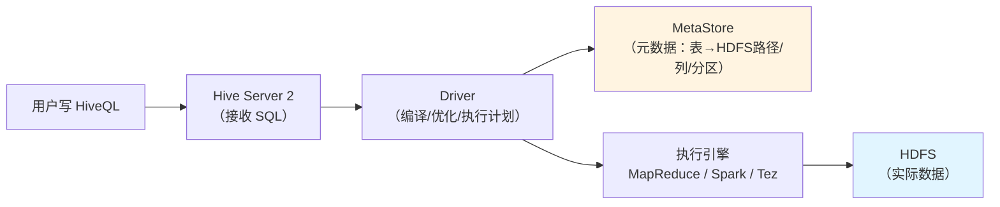

# 6.3 Hive——用 SQL 查大数据

> **一句话定位**：Hive 是大数据世界里后端开发者最容易上手的入口——你写 SQL，Hive 帮你翻译成 MapReduce / Spark 任务跑在 Hadoop 集群上。它不是数据库，而是一个**SQL 翻译器 + 元数据管理器**。

---

## 一、Hive 的本质——SQL → 分布式计算任务

后端开发者的第一个认知陷阱是把 Hive 当 MySQL 用。两者的 SQL 语法高度相似，但底层完全不同：

| 维度 | MySQL | Hive |
|------|-------|------|
| 定位 | 关系型数据库（OLTP） | SQL on Hadoop（OLAP） |
| 数据存储 | 自己的存储引擎（InnoDB） | **HDFS**（Hive 只管元数据，不管数据本身） |
| SQL 执行 | 内置执行引擎，毫秒~秒级返回 | 翻译成 MapReduce/Spark/Tez 任务，分钟级甚至更久 |
| 事务 | 完整 ACID | 有限支持（ORC + 分桶表，3.0+） |
| 索引 | B+ 树索引是核心优化手段 | 几乎不用传统索引，靠**分区裁剪 + 列式存储内置过滤**优化（见下文详解） |
| UPDATE/DELETE | 原生支持 | 有限支持（需事务表，性能差） |

### 1.1 架构



**MetaStore** 是 Hive 的核心组件——它用关系型数据库（通常是 MySQL）存储"表长什么样、数据在 HDFS 哪个目录、分区信息、列类型"等元数据。Hive 的表只是 HDFS 目录的一层"皮"。

---

## 二、核心概念

### 2.1 内部表 vs 外部表

| 类型 | 创建语法 | DROP 时 | 适用场景 |
|------|---------|---------|---------|
| **内部表（Managed Table）** | `CREATE TABLE ...` | 删除元数据 **+ 删除 HDFS 数据** | 临时表、中间表 |
| **外部表（External Table）** | `CREATE EXTERNAL TABLE ...` | 只删除元数据，**HDFS 数据保留** | 原始数据层（ODS），多个表共享同一份数据 |

> **生产经验**：ODS 层几乎都用外部表——数据是共享资产，不能因为误删表就丢了。DWD/DWS 可以用内部表。

### 2.2 分区（Partition）——Hive 最重要的优化手段

分区的本质是**HDFS 子目录**。按某个字段（通常是日期）把数据物理分割到不同目录：

```
/user/hive/warehouse/user_events/
    ├── dt=2024-06-27/    ← 一个分区 = 一个目录
    │   ├── 000000_0      ← 实际数据文件
    │   └── 000001_0
    ├── dt=2024-06-28/
    └── dt=2024-06-29/
```

查询时指定分区条件，Hive 只读对应目录的数据，跳过其他分区——这就是**分区裁剪（Partition Pruning）**。

```sql
-- 只扫描 2024-06-29 这一天的数据
SELECT user_id, COUNT(*) FROM user_events
WHERE dt = '2024-06-29'   -- 分区裁剪
GROUP BY user_id;
```

如果不加 `WHERE dt = ...`，Hive 会扫描**所有分区**（可能是几年的数据），这是 Hive 查询慢的首要原因。

### 2.3 分桶（Bucket）

分桶是在分区内部的进一步切分——按某个字段的 hash 值把数据分散到固定数量的文件中。

```sql
CREATE TABLE user_events (user_id BIGINT, event_type STRING)
PARTITIONED BY (dt STRING)
CLUSTERED BY (user_id) INTO 32 BUCKETS  -- 按 user_id hash 分成 32 个桶
STORED AS ORC;
```

分桶的好处：JOIN 时两表同字段同桶数可以做 **Bucket Map Join**（每个桶和对应桶直接 JOIN，避免 shuffle）；采样查询可以只读部分桶。

### 2.4 文件格式

| 格式 | 类型 | 压缩 | 特点 |
|------|------|------|------|
| **TextFile** | 行存储 | 可选 | 默认格式，可读性好，性能差 |
| **ORC** | 列存储 | 内置（Zlib/Snappy） | Hive 官方推荐，压缩率高，查询快 |
| **Parquet** | 列存储 | 内置（Snappy/Gzip） | Spark 生态首选，跨引擎兼容性好 |
| **Avro** | 行存储 | 内置 | Schema 演进友好，适合数据交换 |

> **生产经验**：数仓表一律用 **ORC**（Hive 生态）或 **Parquet**（Spark 生态）。列式存储 + 压缩可以让存储缩小 5-10 倍，查询只读需要的列，IO 大幅减少。

### 2.5 为什么 Hive 不用传统索引？——存储与查询模型的根本差异

后端开发者的直觉是"查询慢就加索引"，但 Hive 几乎不用传统 B+ 树索引（Hive 0.7 曾引入 Bitmap Index，后来在 3.0 被废弃），这不是偷懒，而是由三层原因共同决定的。

**第一层：HDFS 不支持随机读——索引"定位到某一行"的前提不存在**

MySQL 的 B+ 树索引之所以有效，是因为 InnoDB 可以**随机 IO 定位到某个 page 的某一行**。HDFS 是为**顺序读高吞吐**设计的——数据被切成 128MB 的 Block 分散在多台机器上。即便索引告诉你"目标数据在这个 Block 的第 83712 行"，HDFS 也没有"跳到第 83712 行只读这一行"的能力，它只能把整个 Block 顺序读出来。索引最核心的价值——"跳过不需要的行"——在 HDFS 上没有用武之地。

```
MySQL 索引读取路径：
  B+ 树定位 → 直接跳到第 N 个 page → 读 1 行 → 返回
  ↑ 随机 IO，只读需要的那一行

HDFS "索引"读取路径（假设有的话）：
  索引定位 → 找到 Block → 顺序读完整个 128MB Block → 过滤出目标行
  ↑ 还是全量读 Block，索引只省了"找到在哪个 Block"这一步
```

**第二层：查询模式是全量扫描 + 聚合，不是"按主键查一行"**

数仓的典型查询是 `SELECT department, SUM(sales) FROM orders WHERE dt = '2024-06-29' GROUP BY department`——需要扫描分区内**所有行**做聚合。这和 OLTP 的 `SELECT * FROM users WHERE id = 42`（只取一行）完全不同。在全量扫描的查询模式下，索引不仅帮不上忙，还会增加额外的写入开销（每次导入数据都要维护索引），得不偿失。

**第三层：列式存储已经内置了比传统索引更适合分析场景的过滤机制**

ORC / Parquet 的内部结构自带多级过滤，效果已经覆盖了传统索引在分析场景下的用途：

| 过滤机制 | 原理 | 效果 |
|---------|------|------|
| **min/max 统计信息** | 每个 Stripe（行组，约 25 万行）记录每列的最小值/最大值 | `WHERE amount > 10000` 可以跳过 max < 10000 的整个 Stripe |
| **Bloom Filter** | 对高基数列（如 user_id）建布隆过滤器 | 快速判断某个值"一定不在"这个 Stripe 中 |
| **Predicate Pushdown** | 把 WHERE 条件下推到文件读取层 | 不满足条件的行组直接不读入内存 |
| **列裁剪** | 只读 SELECT 中出现的列 | `SELECT name FROM users` 只读 name 这一列的数据，跳过其他列 |

这些机制不需要额外维护，是文件格式自带的。它们虽然粒度没有 B+ 树那么细（Stripe 级 vs 行级），但在全量扫描 + 聚合的查询模式下，已经是最优的平衡。

> **总结**：分区裁剪是第一道过滤（目录级），列式存储的内置统计信息是第二道过滤（行组级），列裁剪是第三道过滤（列级）。三道过滤加起来，已经把传统索引能做的事情覆盖了，而且不需要额外的写入和维护成本。

---

## 三、SQL 差异速查——后端开发者最容易踩的坑

| 场景 | MySQL | Hive |
|------|-------|------|
| 字符串拼接 | `CONCAT(a, b)` | `CONCAT(a, b)` 相同 |
| 日期格式化 | `DATE_FORMAT(dt, '%Y-%m')` | `date_format(dt, 'yyyy-MM')` 注意大小写 |
| LIMIT 优化 | 走索引可以很快 | 仍需全量计算后截取，不会提前终止 |
| INSERT | `INSERT INTO ... VALUES (...)` | `INSERT INTO ... SELECT ...`（通常从别的表 SELECT） |
| 子查询别名 | 可省略 | **必须有别名**，否则报错 |
| NULL 处理 | `IFNULL(col, default)` | `NVL(col, default)` 或 `COALESCE(col, default)` |
| 复杂类型 | 不支持 | 支持 `ARRAY`、`MAP`、`STRUCT` |

---

## 四、性能优化要点

### 4.1 优化清单

```
① 分区裁剪：WHERE 条件必须包含分区字段
② 列式存储：使用 ORC / Parquet 格式
③ 避免数据倾斜：GROUP BY / JOIN 时某个 key 数据量远超其他 key
④ Map Join：小表 JOIN 大表时，把小表加载到内存（自动或 /*+ MAPJOIN(小表) */）
⑤ 合理设置 Map/Reduce 数量
⑥ 开启压缩：中间结果和最终输出都压缩
```

### 4.2 数据倾斜——Hive 性能杀手

数据倾斜 = 某个 key 的数据量远大于其他 key，导致一个 Reducer 处理 90% 的数据，其他 Reducer 空闲。

```
典型场景：
  GROUP BY user_id，某个爬虫用户有 1 亿条记录
  JOIN 时 ON 条件的 key 存在大量 NULL

解决方案：
  ① set hive.groupby.skewindata = true;  -- 两阶段聚合
  ② 手动加随机前缀打散 → 聚合 → 去前缀再聚合
  ③ NULL 值单独处理或赋随机 key
  ④ 大表 JOIN 大表时用 Bucket Map Join
```

---

## 五、面试深度剖析

### 考点 1：Hive 和数据库的区别

> **面试官**：「Hive 是数据库吗？」

不是。Hive 是 SQL 翻译器 + 元数据管理器。它自己不存数据（数据在 HDFS），不做计算（计算交给 MapReduce/Spark），只负责把 SQL 翻译成分布式计算任务。延迟高（分钟级），不支持事务（有限支持），不适合 OLTP。

### 考点 2：内部表和外部表的区别

> **面试官**：「什么时候用外部表？」

外部表 DROP 时只删元数据不删数据，适合原始数据层（数据是共享资产）。内部表 DROP 时连数据一起删，适合自己的中间计算表。

### 考点 3：数据倾斜怎么解决

> **面试官**：「Hive 跑得很慢，发现一个 Reducer 卡住了，怎么排查？」

先看是哪个 key 数据量异常大（EXPLAIN + 日志），然后对症下药：两阶段聚合（先加随机前缀打散 → 局部聚合 → 去前缀 → 全局聚合）、NULL 值特殊处理、小表用 Map Join。

### 考点 4：ORC 和 Parquet 怎么选

> **面试官**：「列式存储为什么比行式快？ORC 和 Parquet 有什么区别？」

列式存储只读需要的列（行式要读整行），IO 减少；同一列数据类型相同，压缩率更高。ORC 是 Hive 原生优化的格式（支持 ACID、索引信息更丰富），Parquet 是跨引擎标准（Spark/Flink/Impala 都原生支持）。纯 Hive 场景用 ORC，混合引擎场景用 Parquet。

---

[← 6.2 HDFS](./02-HDFS.md) | [返回本章目录](./README.md) | [6.4 Spark →](./04-Spark.md)
