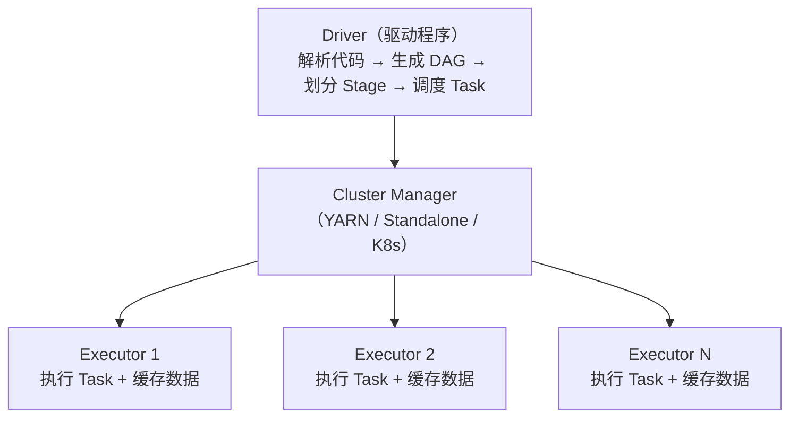

# 6.4 Spark——内存计算引擎

> **一句话定位**：Spark 是 MapReduce 的替代者——同样做分布式批处理，但把中间结果放内存而非磁盘，快 10-100 倍。同时它还统一了批处理（Spark SQL）、流处理（Structured Streaming）、机器学习（MLlib）、图计算（GraphX）四大场景，是目前大数据批处理的事实标准。

---

## 一、为什么比 MapReduce 快？

MapReduce 的致命问题是**每个阶段的结果都要写磁盘**。一个复杂查询翻译成多轮 MapReduce，每轮的中间结果都落盘再读回来，IO 成本极高。

Spark 的核心改进是**内存计算**：把中间结果缓存在内存中，下一步直接从内存读，避免反复磁盘 IO。只有内存放不下时才溢写到磁盘。

```
MapReduce：Map → 写磁盘 → Reduce → 写磁盘 → Map → 写磁盘 → Reduce
Spark：    Map → 内存 → Reduce → 内存 → Map → 内存 → Reduce → 写磁盘
```

---

## 二、核心抽象——RDD

### 2.1 RDD 是什么

RDD（Resilient Distributed Dataset，弹性分布式数据集）是 Spark 最基础的数据抽象——一个**不可变的、分区的、可并行计算的**数据集合。

| 特性 | 含义 |
|------|------|
| **分布式** | 数据分散在集群的多个节点上 |
| **不可变** | RDD 创建后不能修改，每次操作生成新 RDD |
| **弹性容错** | 通过 **血缘（Lineage）** 记录转换链路，丢失分区可以从上游重算恢复 |
| **惰性求值** | Transformation 只构建执行计划，遇到 Action 才真正执行 |

### 2.2 Transformation vs Action

| 类型 | 做什么 | 是否触发计算 | 常见操作 |
|------|--------|------------|---------|
| **Transformation** | 从一个 RDD 生成新 RDD | 不触发（惰性） | `map`、`filter`、`flatMap`、`groupByKey`、`reduceByKey`、`join` |
| **Action** | 返回结果给 Driver 或写存储 | **触发计算** | `collect`、`count`、`reduce`、`saveAsTextFile`、`foreach` |

> 这和 Java Stream 的惰性求值是同一个思路（详见 [3.16 Java 8+ 新特性](../part3-java-deep/16-Java8+新特性.md)）。

#### Action 的两种归宿：回 Driver 还是写存储

Action 分为两大类，区别在于计算结果去哪里：

```
① 返回结果给 Driver（数据回收到 Driver 进程的内存中）
   collect()        → 把所有数据拉回 Driver（最危险，容易 OOM）
   count()          → 返回一个 Long 数字（极轻量）
   take(n)          → 返回前 n 条（有上限，相对安全）
   first()          → 返回第一条（等价于 take(1)）
   reduce()         → 返回一个聚合后的单一值（极轻量）
   aggregate()      → 返回一个聚合后的单一值
   countByKey()     → 返回 Map[K, Long]（key 多时也不小）
   top(n)           → 返回最大的 n 条（有上限）
   collectAsMap()   → 返回 Map[K, V]（数据多时危险）

② 写到外部存储 / 副作用（不回 Driver）
   saveAsTextFile()       → 写 HDFS/S3
   write.format().save()  → DataFrame API 写存储
   foreach()              → 对每条数据执行副作用（如写 MySQL）
   foreachPartition()     → 按分区执行副作用
```

#### 为什么 Action 的结果要返回给 Driver

理解这个问题的关键在于 Spark 的编程模型——**用户代码跑在 Driver 上，Executor 只是被派去干活的工人。**

```
你写的代码（在 Driver 上执行）：
  long total = rdd.count();        ← 这行代码在 Driver 上跑
  if (total > 10000) {              ← 这行也在 Driver 上跑
      rdd.filter(...).saveAsTextFile("/output");
  }

执行过程：
  Driver: "我需要 count，各 Executor 去数自己分区的行数"
  Executor 1: "我的分区有 3000 行"  ──→ 回传给 Driver
  Executor 2: "我的分区有 5000 行"  ──→ 回传给 Driver
  Executor 3: "我的分区有 4000 行"  ──→ 回传给 Driver
  Driver: 汇总 3000+5000+4000 = 12000，赋值给 total
  Driver: if (12000 > 10000) 成立，继续执行 filter + saveAsTextFile
```

每个 Executor 只看得到自己那一个分区的数据，没有任何一个 Executor 知道全局总数。只有 Driver 能把所有 Executor 的部分结果汇总成最终值。而你写的 `if (total > 10000)` 这样的判断逻辑是在 Driver 上跑的——Executor 不做决策，只执行被分配的 Task。

> **类比**：Driver 是项目经理，Executor 是流水线工人。项目经理说"帮我统计总产量"，每个工人只能报自己工位的产量，汇总和决策只能由项目经理完成。如果你不需要总产量这个数字，那就不要调用 `count()`——Action 的存在意义就是"Driver 需要这个结果"。

#### 交互式查询的结果流程

在 Spark Shell 或 Notebook（Jupyter / Zeppelin）中跑 Spark 时，**Shell 进程本身就是 Driver**。你在 Shell 里输入的每一行代码，都是 Driver 在执行：

```
你在 Spark Shell 输入: rdd.filter(_._2 > 100).collect()

→ Driver（Spark Shell 进程）解析这行代码，构建 DAG
→ Driver 把 Task 分发给各个 Executor
→ Executor 各自计算自己分区的过滤结果
→ Executor 把结果通过网络回传给 Driver
→ Driver（Spark Shell）收到数据，在终端打印出来给你看
```

所以结果不是"先到 Driver 再到 Shell"，而是 Driver 就是 Shell 本身。在生产环境中，Driver 通常是你提交的 `spark-submit` 应用进程。

#### 什么场景需要返回数据给 Driver

核心场景就一句话：**Spark 任务跑完后，Driver 需要拿到结果去做"Spark 之外的事"。**

```
场景 1：交互式查询看结果
  Spark Shell / Notebook 中分析数据，需要把结果显示给人看
  → collect() 或 show() 把数据拉回来打印
  ⚠ 生产环境绝不能对大结果集 collect()，会直接 Driver OOM

场景 2：聚合统计只需要一个数字
  count() 算总行数、reduce() 算总和，结果只有一个标量值
  → 回 Driver 完全没有压力，这是最安全的 Action

场景 3：拿结果做后续非 Spark 的决策
  Spark 算出各商品点击量，拉回 Driver 后用 Java 代码做排序、写缓存等
  ⚠ 更好的做法是直接在 Spark 里做完，或用 write 写到数据库

场景 4：收集小表用于广播
  先 collect() 一张小表到 Driver，再 broadcast() 到所有 Executor
  → 前提是小表真的小（通常 < 10MB）

场景 5：取少量样本调试
  take(n) 或 takeSample() 取几条数据看 schema、验证逻辑
  → 数据量有上限，安全
```

> **生产环境最佳实践**：能用 `write` 写存储就不用 `collect()` 回 Driver。数据量大时，结果直接写到 HDFS/S3/MySQL/Kafka，Driver 只负责提交任务和接收"成功/失败"的状态，不碰实际数据。Driver OOM 的头号原因就是 `collect()` 拉了过大结果集（详见 [6.6 OOM 排查](#65-oom-排查)）。

### 2.3 宽依赖 vs 窄依赖

| 类型 | 定义 | 是否产生 Shuffle | 示例 |
|------|------|-----------------|------|
| **窄依赖** | 父 RDD 的每个分区只被子 RDD 的一个分区使用 | 否 | `map`、`filter`、`union` |
| **宽依赖** | 父 RDD 的一个分区被子 RDD 的多个分区使用 | **是** | `groupByKey`、`reduceByKey`、`join` |

**Shuffle 是 Spark 最昂贵的操作**——很多人以为 Shuffle 慢是因为"网络传输太慢"，但网络只是四个原因之一。Shuffle 之所以昂贵，是因为它同时踩中了**四个性能地雷**：

```
① 磁盘 I/O（往往比网络更慢）
   Shuffle 数据不是直接从上游内存传到下游内存的——中间必须落盘
   上游 Executor 把数据写成本地磁盘文件（Shuffle Write）
   下游 Executor 再从这些文件里读取（Shuffle Read）
   磁盘读写是随机 I/O，尤其机械磁盘上极慢
   即使 SSD，大量小文件的随机读也远慢于顺序内存操作

② 网络传输
   数据要从上游节点通过网络传到下游节点，受带宽限制
   万兆网卡理论 10Gbps，但集群中多任务竞争带宽，单任务分到的更少
   传输的是序列化后的二进制字节流，不是原始内存对象

③ 序列化 / 反序列化开销
   内存中的 Java 对象不能直接传输，必须序列化成字节流
   （Spark 默认用 Java 序列化或 Kryo）
   到下游再反序列化回对象——CPU 密集型操作
   数据量大时，序列化本身消耗大量 CPU 时间

④ 同步屏障——最容易被忽视但影响最大
   Shuffle 是 Stage 的边界，上游 Stage 的所有 Task 必须全部完成
   下游 Stage 的 Task 才能开始，打破了流水线
```

其中第 4 点——同步屏障——是 Shuffle 和普通 Transformation 最本质的区别：

```
无 Shuffle 时（流水线执行，窄依赖）：
  Task 1: [map → filter → map] → 完成，Task 2 立即开始
  Executor 可以连续处理，不用等任何人，数据全程在内存中流式传递

有 Shuffle 时（屏障等待，宽依赖）：
  Stage 1: Task 1 ✓  Task 2 ✓  Task 3 ✓ ... Task 200 ✓  ← 必须全部完成！
              ↓↓↓ 等待屏障（最慢的 Task 决定等待时间）↓↓↓
  Stage 2: Task 1 开始  Task 2 开始 ...

  如果 199 个 Task 都在 1 分钟内完成，但 Task 200 跑了 10 分钟（数据倾斜）
  整个 Stage 2 都要等 10 分钟才能启动
  → 这就是为什么数据倾斜对 Shuffle 的伤害特别大
```

Shuffle 数据落盘的完整流程：

```
Executor 1: [处理数据] → 序列化 → 写本地磁盘文件（Shuffle Write）
Executor 2: [处理数据] → 序列化 → 写本地磁盘文件
Executor 3: [处理数据] → 序列化 → 写本地磁盘文件
                    ↓ 网络传输（拉取远程文件）
Executor 4: 读磁盘文件 → 反序列化 → [继续处理]（Shuffle Read）
Executor 5: 读磁盘文件 → 反序列化 → [继续处理]
Executor 6: 读磁盘文件 → 反序列化 → [继续处理]
```

> **类比**：窄依赖就像流水线——上一步做完直接递给下一步，全程在内存里。Shuffle 就像工厂之间的物流——产品要先打包（序列化）、装车（写磁盘）、运输（网络）、卸货（读磁盘）、拆包（反序列化），而且必须等上一家工厂的货全部到齐才能开工（同步屏障）。

宽依赖触发 Shuffle，也触发 Stage 的划分。

---

## 三、执行架构



| 组件 | 职责 |
|------|------|
| **Driver** | 运行用户代码的 main 方法，创建 SparkContext，生成执行计划（DAG），划分 Stage 和 Task |
| **Executor** | 集群节点上的 JVM 进程，负责执行 Task 和缓存 RDD 数据 |
| **Task** | 最小执行单元，一个 Task 处理一个 RDD 分区 |

### 3.1 Job → Stage → Task 的划分

```
包含关系：1 Job ⊃ 若干 Stage ⊃ 若干 Task

Job：     一个 Action 触发一个 Job
            例：collect()、count()、saveAsTextFile() 各触发一个 Job
Stage：   以 Shuffle 为边界划分（宽依赖切分 Stage）
            例：map → filter → reduceByKey → filter → collect()
                Stage 0: map → filter → reduceByKey（Shuffle 前）
                Stage 1: filter → collect（Shuffle 后）
Task：    一个 Stage 内，RDD 的每个数据分区对应一个 Task
            例：RDD 有 200 个分区 → 这个 Stage 生成 200 个 Task
                Task 1 处理分区 0 的数据，Task 2 处理分区 1 的数据 ...
```

> **分区是谁的？** 这里的"分区"是 **RDD / DataFrame 的数据分区**，不是 Stage 自己拥有的分区。Stage 是执行计划的概念，分区是数据的概念——数据被切成 N 份（N 个分区），Stage 就生成 N 个 Task，每个 Task 处理其中 1 份。分区数量由 `numPartitions` 参数、Shuffle 后的分区数、或 `repartition()` 决定，跟 Stage 本身无关。

#### 一个 Stage 内有多个 RDD，Task 怎么划分

一个 Stage 内的多个 RDD 通过窄依赖串联（map、filter 等），形成一条流水线。窄依赖保证父子 RDD 分区一一对应，所以 Spark 只看**最后一个 RDD（最终 RDD）的分区数**来决定 Task 数——中间 RDD 的分区数不影响：

```
Stage 0 内的流水线（窄依赖，不产生 Shuffle）：
  RDD_A (3 分区) → map → RDD_B (3 分区) → filter → RDD_C (3 分区)

  窄依赖：父分区 1 → 子分区 1，一一对应，不改变分区数
  所以 RDD_A、RDD_B、RDD_C 都是 3 个分区

  → 生成 3 个 Task：
    Task 1: 读 RDD_A 分区 0 → map → RDD_B 分区 0 → filter → RDD_C 分区 0
    Task 2: 读 RDD_A 分区 1 → map → RDD_B 分区 1 → filter → RDD_C 分区 1
    Task 3: 读 RDD_A 分区 2 → map → RDD_B 分区 2 → filter → RDD_C 分区 2

  每个 Task 内部是一条流水线，数据在内存中依次流过 map → filter，不落盘
  Task 不需要知道上游 RDD 有几个分区——它只拿自己对应的那一份
```

> **类比**：Stage 内的多个 RDD 就像工厂流水线上的多道工序——原材料进来，经过切割（map）、质检（filter）、包装（map），全程在同一条传送带上，不需要中途换车间。Task 就是这条传送线上的一名工人，只负责自己那段材料。

#### 分区 → Task → Executor 的对应关系

```
分区 → Task：    一对一（一个 Task 处理一个分区）
Task → Executor：多对一（一个 Executor 同时运行多个 Task，受核数限制）
Executor → 分区：多对多（一个 Executor 可以持有多个分区的数据）

具体例子：
  集群有 5 个 Executor，每个 Executor 4 个核
  RDD 有 200 个分区
  → 生成 200 个 Task
  → 同时运行 5 × 4 = 20 个 Task（并行度 = 20）
  → 剩余 180 个 Task 排队，前面的完成一批就调度下一批
  → 每个 Executor 同时跑 4 个 Task（每个核跑一个 Task）
  → 一个 Executor 可能持有多个分区的数据（缓存 + 正在处理）
```

> **关键**：分区数决定了 Task 数（并行度的上限），Executor 核数决定了同时能跑多少个 Task（实际并行度）。如果分区数远大于总核数，Task 会分批调度；如果分区数小于总核数，有些核会空闲——所以分区数通常建议设为总核数的 2-3 倍。

#### Executor、Task、Container 到底是什么——进程、线程还是资源配额

上面的描述用了"核"和"Executor"等概念，这里把它们的物理形态说清楚：

```
一个 Spark 应用的进程/线程结构（从外到内）：

YARN Container（资源隔离单位，cgroup 限制 CPU/内存）
  └── Executor（JVM 进程，就是 java -Xmx8G ... 启动的普通 JVM）
        ├── 核 0 / slot 0 → Task 线程 A（正在处理分区 0）
        ├── 核 1 / slot 1 → Task 线程 B（正在处理分区 1）
        ├── 核 2 / slot 2 → Task 线程 C（正在处理分区 2）
        ├── 核 3 / slot 3 → Task 线程 D（正在处理分区 3）
        └── 共享 JVM 堆内存（所有 Task 线程共用）
              ├── RDD 缓存数据
              ├── Shuffle 数据
              └── 广播变量等
```

各概念的物理形态：

| 概念 | 本质 | 生命周期 |
|------|------|---------|
| **Container** | YARN 的**资源配额**（不是进程），通过 cgroup 限制 CPU/内存 | 绑定 Executor |
| **Executor** | 一个 **JVM 进程**（`java -cp ...` 启动） | 绑定整个 Application |
| **Task** | Executor JVM 内的一个**线程** | 秒到分钟级，完成即销毁 |
| **slot / core** | **逻辑概念**，表示"能同时跑几个 Task"的配额 | 随 Executor 存在 |

#### 四个常见疑问——逐个说清楚

**Q1：Executor 是什么？**

Executor 是一个实实在在的 **JVM 进程**，就是通过 `java -cp ... -Xmx8G ...` 启动的普通 Java 进程。它不是虚拟容器、不是线程、不是抽象概念——你用 `jps` 命令能在进程列表里看到它，用 `top` 能看到它占用的 CPU 和内存。在 YARN 模式下，YARN NodeManager 在物理机上启动这个 JVM 进程并把它关进 cgroup 里做资源限制。

**Q2：Task 是进程还是线程？**

Task 是 Executor JVM 进程内的一个**线程**，不是独立进程。这是 Spark 和 MapReduce 最大的架构差异——MapReduce 每个 Task 启动一个独立 JVM 进程，启动开销几秒钟，短任务甚至启动比计算还慢。Spark 让 Executor 常驻、Task 以线程方式运行，启动几乎零开销，而且同一个 Executor 内的 Task 共享 JVM 堆内存，RDD 缓存可以被复用，不用每个 Task 重新加载。

**Q3：核跟 Task 是一对一吗？**

是的。这里的"核"是 `spark.executor.cores` 配置的逻辑 slot，不是物理 CPU 核。一个 Executor 配了 4 个 core 就有 4 个 slot，可以同时跑 4 个 Task 线程。每个 slot 同一时刻只跑一个 Task，Task 完成后 slot 空出来给下一个排队的 Task。注意 4 个 Task 线程是并发执行（分到不同物理核的时间片），不是并行（不绑定物理核）。

**Q4：核跟进程是一对一吗？**

不是。一个 Executor（进程）可以有多个核。`spark.executor.cores=4` 表示一个 JVM 进程有 4 个逻辑 slot，可以同时跑 4 个 Task 线程。核是进程内部的并发配额，不是进程数。

**Executor 的生命周期**：Executor 绑定整个 Spark Application，不绑定某一批 Task。一批 Task 跑完后 Executor 不关闭，而是向 Driver 汇报"我空闲了"，Driver 继续分配下一批 Task。只有三种情况 Executor 会结束：Application 正常完成、被 kill、或因 OOM/心跳超时被 Driver 移除。

```
Application 生命周期内的时间线：

Driver 启动 → 向资源管理器申请 Executor
  → Executor 1 启动（JVM 进程，一直活着）
  → Executor 2 启动（JVM 进程，一直活着）
  → Executor 3 启动（JVM 进程，一直活着）

  Stage 0: Executor 1 跑 Task A,B,C,D
    → Task 完成 → Executor 不关闭，汇报"我空了"
  Stage 1: Executor 1 跑 Task E,F,G,H（复用同一个 JVM）
    → Task 完成 → 继续等待
  ...
  Application 结束 → 所有 Executor 关闭
```

**一台物理机上多个 Executor 的隔离**：在 YARN 模式下，每个 Executor 运行在独立的 YARN Container 中，YARN 用 cgroup 限制每个 Container 的 CPU 和内存——同一台物理机上的两个 Executor 互相隔离，CPU 时间片按配额分配，内存不能越界。Standalone 模式下隔离较弱，主要靠操作系统进程级隔离，没有 cgroup 级别的资源硬限制。

> **cgroup 是什么？** cgroup 是 Linux 内核的资源隔离机制，通过虚拟文件系统（`/sys/fs/cgroup/`）配置，写入数字就能限制进程的 CPU/内存/磁盘 I/O。它不是 shell 命令也不是进程监控，而是 VFS 回调机制——写文件时内核直接修改调度参数，立刻生效。cgroup 限制的是整个进程的物理内存，和 JVM 的 `-Xmx`（只管堆内存）是两层不同的限制。完整原理（VFS 回调机制、权限模型、内核执行方式、与 Docker/YARN 的关系）详见 **[附录 A8 · Linux 操作系统基础](../part3-java-deep/A8-Linux操作系统基础.md)**。

**slot 是 Spark 的概念吗？** 严格来说 slot 是 YARN/Mesos 的概念。Spark 自己的概念是 `spark.executor.cores`，表示一个 Executor 能同时运行多少个 Task。在 YARN 部署模式下，YARN 给 Container 分配的 vcore 数对应 Spark 的 executor.cores，两个概念在实际使用中经常混用：

```
概念对应关系：

YARN 层：       Container（vcore=4, memory=8GB）
                           ↓ 启动
Spark 层：      Executor（executor.cores=4, executor.memory=8GB）
                           ↓ 分配
Task 层：       4 个 task slot，同时跑 4 个 Task 线程

OS 层：         1 个 JVM 进程，4 个工作线程，受 cgroup 约束
```

> **一个 slot 对应一个物理核吗？** 不对应。slot 是逻辑概念，对应 vcore（虚拟核），vcore 和物理核没有绑定关系。一台 32 物理核的机器，YARN 可以配 40 个 vcore（超分）或 16 个 vcore（欠分）。Task 线程跑在哪个物理核上由操作系统调度器决定，Spark 和 YARN 都不关心。

---

## 四、Spark SQL——最常用的模块

Spark SQL 是在 RDD 之上封装的结构化数据处理接口，提供 DataFrame / Dataset API 和标准 SQL 语法。

### 4.1 RDD vs DataFrame vs Dataset——三层 API 的区别与选型

Spark 有三层 API，从底到高分别是 RDD、DataFrame、Dataset。理解它们的区别是选型的基础：

```
三层 API 的演进：

RDD（Spark 1.0）          → 最底层，面向对象，无 Schema
  ↓ 加上 Schema + 优化器
DataFrame（Spark 1.3）     → 结构化数据，有 Schema，有 Catalyst 优化
  ↓ 加上强类型
Dataset（Spark 1.6）       = DataFrame + 强类型（Scala/Java 专属）
```

| 维度 | RDD | DataFrame | Dataset |
|------|-----|-----------|---------|
| **数据类型** | Java/Python 对象，无 Schema | Row 对象，有 Schema（列名+类型） | 强类型对象（Case Class），有 Schema |
| **类型安全** | 编译时检查 | 运行时检查（列名写错到运行才报错） | 编译时检查（Scala/Java） |
| **优化器** | 无，开发者自己负责 | **Catalyst 优化器**（自动谓词下推、列裁剪等） | Catalyst 优化器 |
| **序列化** | Java/Kryo 序列化整个对象 | **Tungsten 二进制格式**（堆外内存，极高效） | Tungsten 二进制格式 |
| **语言支持** | Scala/Java/Python/R | Scala/Java/Python/R | **仅 Scala/Java**（Python 不支持） |
| **API 风格** | 函数式（map/filter/reduce） | SQL 风格（select/where/agg） | 两者混合 |
| **性能** | 最低（无优化） | **最高**（Catalyst + Tungsten） | 高（和 DataFrame 接近） |

> **DataFrame 和 Dataset 的关系**：在 Scala/Java 中，`DataFrame` 就是 `Dataset[Row]` 的类型别名——Dataset 是通用版本，DataFrame 是 Dataset 的一个特例（每行是弱类型的 Row）。Python 只有 DataFrame，没有 Dataset。

**什么场景选什么：**

```
选 RDD：
  ① 处理非结构化数据（纯文本、二进制流、自定义解析逻辑）
  ② 需要精确控制底层分区和 Shuffle（如自定义 Partitioner）
  ③ 需要复用旧的 RDD 代码，不想迁移
  → 本质：RDD 是"手动挡"，你什么都要自己管，但什么都能控制

选 DataFrame：
  ① 结构化数据分析（有明确列和类型的数据）——这是 90% 的场景
  ② 写 SQL 或类 SQL 的链式 API
  ③ 用 Python / R 开发（这两个语言只有 DataFrame，没有 Dataset）
  ④ 追求最佳性能（Catalyst + Tungsten 自动优化）
  → 本质：DataFrame 是"自动挡"，Catalyst 帮你优化，你专注业务逻辑

选 Dataset（仅 Scala/Java）：
  ① 需要编译时类型安全（列名拼错在编译阶段就报错，不用等到运行）
  ② 数据处理逻辑复杂，用对象操作比用 Row 取列更清晰
  ③ 对性能有要求但又不放弃类型安全
  → 本质：Dataset 是"手自一体"，既有 DataFrame 的优化，又有 RDD 的类型安全
```

> **实际项目中的建议**：绝大多数场景用 DataFrame（或直接写 SQL）。只有遇到非结构化数据或需要精细控制分区时才退回 RDD。Dataset 在 Scala 项目中可以替代 DataFrame 获得类型安全，但 Python 项目没得选。

#### 为什么 Dataset 性能比 DataFrame 低——lambda 反序列化陷阱

对比表里写的是 DataFrame "最高"、Dataset "高（接近）"，这个"接近"而非"等于"的差距来自一个核心问题：**Dataset 的强类型操作会打破 Tungsten 的优化闭环**。

```
DataFrame 全流程（Tungsten 优化闭环）：
  二进制格式 → filter（生成的代码直接操作二进制）→ select → 输出
  数据全程以 Tungsten 二进制格式在内存中传递，不反序列化成 Java 对象

Dataset 使用 SQL 风格 API（和 DataFrame 一样快）：
  dataset.filter($"age" > 18).select($"name")   ← 等价于 DataFrame，无开销

Dataset 使用 lambda 风格 API（性能下降）：
  dataset.filter(p => p.age > 18).map(p => p.name)
                    ↑              ↑
                    这两个 lambda 对 Catalyst 是黑盒！

  执行过程：
  二进制格式 → 反序列化成 Person 对象 → 执行 lambda → 序列化回二进制格式
               ↑ overhead              ↑ 黑盒        ↑ overhead
```

| API 风格 | Catalyst 能否优化 | 反序列化开销 | 性能 |
|---------|-----------------|------------|------|
| DataFrame / Dataset SQL 风格（`$"age" > 18`） | 能 | 无 | 最高 |
| Dataset lambda 风格（`p => p.age > 18`） | **不能**（lambda 是黑盒） | 每条记录都要 | 下降 |
| RDD（`map` / `filter`） | 不能 | 全程都是对象 | 最低 |

> **本质**：DataFrame 的 `filter($"age" > 18)` 是声明式的——你告诉 Catalyst "我要 age > 18"，它来决定怎么执行。Dataset 的 `filter(p => p.age > 18)` 是命令式的——你告诉 Catalyst "执行这段代码"，它不知道代码里在做什么，无法优化，只能老老实实反序列化出对象、执行你的 lambda、再序列化回去。

#### Tungsten 是什么——Spark 的性能引擎

Tungsten 是 Spark 1.5（2015 年）启动的性能优化项目（Project Tungsten），名字来自钨（Tungsten）——最硬的金属，寓意"极致性能"。它的核心思想是：**把 Spark 的内存管理从 JVM 手中接管过来，绕过 GC 和 Java 对象的开销**。

```
Tungsten 的三大支柱：

① 堆外内存管理（Off-Heap Memory）
   不在 JVM 堆里分配内存，而是直接用 Unsafe API 向操作系统申请
   → 不受 GC 管理，没有 GC 停顿
   → 没有 Java 对象头开销（每个 Java 对象有 12-16 字节头）
   → 内存可以精确控制释放，不依赖 GC 回收

② 二进制行格式（Unsafe Row）
   把一整行数据序列化为紧凑的字节数组
   → 一个 Person{name:String, age:Int} 在 Java 对象里占 ~40 字节
     （对象头 + 引用 + String 对象头 + char[] + int + 对齐填充）
   → 在 Tungsten 格式里只占 ~12 字节（4 字节长度 + 4 字节 String 偏移 + 4 字节 int）
   → 缓存友好：连续内存，CPU 缓存命中率高

③ 全阶段代码生成（Whole-Stage Code Generation，Spark 2.0）
   把多个算子（filter → map → agg）融合成一个编译好的 Java 函数
   → 消除虚方法调用（RDD 每条记录都要多态分发）
   → 消除中间数据结构（不需要在算子之间传递 Row 对象）
   → 类似于把解释执行变成编译执行
```

```
没有 Tungsten（RDD 模式）：
  每条记录：反序列化 → 调 filter.isMatch() → 调 map.call() → 调 agg.update()
  每一步都是虚方法调用 + 对象创建，CPU 分支预测失败率高

有 Tungsten（DataFrame 模式）：
  全阶段代码生成后：
  for (int i = 0; i < numRows; i++) {
      if (row.getInt(age_offset) > 18) {        // filter 被内联
          result.setString(row.getString(name_offset));  // map 被内联
          aggBuffer.add(row.getInt(age_offset));         // agg 被内联
      }
  }
  一个紧凑循环，没有虚方法调用，没有中间对象
```

> **版本时间线**：Tungsten 在 Spark 1.5 引入（堆外内存 + 二进制格式），Spark 2.0 引入全阶段代码生成（Whole-Stage CodeGen），Spark 3.0 进一步增强（AQE 运行时优化配合 Tungsten）。现在 Tungsten 是 Spark SQL 的默认执行引擎，无需手动开启。

#### Dataset 的编译时类型安全是怎么实现的

Dataset 通过 Scala 的 **Case Class + Encoder** 机制实现编译时类型安全：

```
① 定义 Case Class（编译时）
   case class Person(name: String, age: Int)

② 创建 Dataset（编译时，隐式 Encoder 被注入）
   val ds: Dataset[Person] = spark.read.json("people.json").as[Person]
                                                    ↑
                                          这里需要一个隐式 Encoder[Person]

③ Encoder 是什么（编译时通过宏生成）
   Encoder[Person] 在编译时通过 Scala 宏自动生成
   它告诉 Spark：Person 有两个字段，name 是 String（偏移 0），age 是 Int（偏移 4）
   → 本质是一个 Schema 描述器，但类型信息在编译时就确定了

④ 编译时类型检查
   ds.map(p => p.nme)   // ✗ 编译报错：Person 没有 nme 字段
   ds.map(p => p.name)  // ✓ 编译通过
   df.select("nme")     // 编译通过，运行时报错 AnalysisException

⑤ 运行时
   Encoder 知道如何在 Tungsten 二进制格式和 Person 对象之间转换
   → 这就是为什么 Dataset lambda 需要反序列化：Encoder 把二进制转成 Person 对象
```

对比 DataFrame 的类型安全：

| 维度 | DataFrame（`Dataset[Row]`） | Dataset（`Dataset[Person]`） |
|------|---------------------------|------------------------------|
| **字段访问** | `row.getAs[String]("name")` | `person.name` |
| **字段名拼错** | 编译通过，**运行时报错** | **编译报错** |
| **类型不匹配** | 编译通过，**运行时 ClassCastException** | **编译报错** |
| **底层原理** | 运行时反射 + Schema 查找 | 编译时宏生成 Encoder |

#### Row 取列 vs 对象操作——具体代码对比

选型建议里说"数据处理逻辑复杂，用对象操作比用 Row 取列更清晰"，下面是具体例子：

```scala
// 场景：从订单数据中，筛选有 VIP 优惠的商品，计算折后价（原价 × 折扣 - 优惠券）

// Case Class 定义
case class Order(orderId: String, items: Seq[Item], coupon: Double, isVip: Boolean)
case class Item(productId: String, name: String, price: Double, category: String)

// ===== DataFrame 写法（Row 操作，逻辑复杂时很痛苦）=====
val result = df
  .filter($"isVip" === true && $"coupon" > 0)
  .withColumn("discountedItems", explode(
    expr("filter(items, x -> x.price > 100 AND x.category != 'books')")
  ))
  .withColumn("finalPrice",
    $"discountedItems.price" * lit(0.8) - $"coupon" / size($"discountedItems")
  )
  .select($"orderId", $"discountedItems.name", $"finalPrice")
// 问题：字段名是字符串，IDE 不能自动补全，拼错只有运行时才发现
// 问题：嵌套结构操作需要用 expr / filter 函数，可读性差

// ===== Dataset 写法（对象操作，逻辑清晰）=====
val result = ds
  .filter(o => o.isVip && o.coupon > 0)           // 直接访问字段，编译时检查
  .flatMap { order =>
    val shareCoupon = order.coupon / order.items.size  // 提前算好每件分摊的优惠券
    order.items
      .filter(i => i.price > 100 && i.category != "books")  // 普通 Scala 集合操作
      .map(item => (order.orderId, item.name, item.price * 0.8 - shareCoupon))
  }
  .toDF("orderId", "productName", "finalPrice")
// 优势：字段名自动补全，拼错编译报错
// 优势：嵌套结构用普通 Scala 代码操作，逻辑一目了然
// 代价：filter 和 map 是 lambda，触发反序列化，性能比 DataFrame 写法低
```

> **选择建议**：如果数据处理逻辑简单（select / where / agg），用 DataFrame，性能最好。如果逻辑复杂（多层嵌套、条件判断、集合操作），用 Dataset 的 lambda 写法可读性好很多，性能损失在可接受范围内——特别是当你的瓶颈在 I/O（读 HDFS）而不是 CPU 时，lambda 的反序列化开销可能根本不是瓶颈。

```python
# DataFrame API（Python）
df = spark.read.parquet("/data/orders")
result = df.filter(df.amount > 1000) \
           .groupBy("user_id") \
           .agg({"amount": "sum"}) \
           .orderBy("sum(amount)", ascending=False)

# 等价 SQL
spark.sql("""
    SELECT user_id, SUM(amount) as total
    FROM orders
    WHERE amount > 1000
    GROUP BY user_id
    ORDER BY total DESC
""")
```

**Catalyst 优化器**：Spark SQL 的查询会经过 Catalyst 优化器（逻辑优化 → 物理优化），类似 MySQL 的查询优化器。它能在**部分场景下**自动做谓词下推、列裁剪、Join 策略选择等优化——但"自动"不等于"万能"。Catalyst 在 INNER JOIN 下表现良好（过滤条件写在 WHERE 还是 ON 里效果一样），但在**外连接（LEFT/RIGHT JOIN）场景下存在明显局限**：右表的过滤条件写在 WHERE 中不会被下推（因为下推会把 LEFT JOIN 变成 INNER JOIN，改变语义）。此外，分区字段被函数包裹、隐式类型转换、视图遮挡底层分区字段等情况，Catalyst 也无法自动处理。这些需要开发者手动优化的场景，详见下文 [6.1 分区裁剪失效六大场景](#61-减少数据量)。

---

## 五、Spark 版本演进与新特性

Spark 从 2014 年的 1.0 到如今的 3.x / 4.x，核心架构保持稳定（RDD + DAG + Catalyst），但每个大版本都引入了对性能和易用性有重大影响的新特性。面试中经常会问"你用的哪个版本、了解哪些新特性"，这里按影响从大到小梳理。

### 5.1 AQE——Adaptive Query Execution（Spark 3.0，最重要的新特性）

AQE 是 Spark 3.0 引入的**运行时自适应优化**——在查询执行过程中，根据已经产生的真实数据统计信息（而非编译期的估算），动态调整执行计划。

传统 Catalyst 优化器的问题是：它在**编译期**根据表的统计信息（行数、大小）决定执行计划，但统计信息经常不准（表没有 ANALYZE、分区被过滤后实际数据量远小于统计值）。AQE 把这个决策推迟到**运行时**——Shuffle 写完后，Spark 拿到了每个分区的真实数据量，再决定下一步怎么做。

AQE 包含三个核心能力：

```
① 自动合并小分区（Coalescing Post-Shuffle Partitions）
   Shuffle 后如果很多分区数据量很小（比如 1MB），AQE 自动合并成更大的分区
   → 减少 Task 数量，降低调度开销
   SET spark.sql.adaptive.coalescePartitions.enabled=true;

② 动态切换 JOIN 策略（Converting Sort-Merge Join to Broadcast Join）
   编译期估算小表 100MB 选了 SortMergeJoin，但运行时发现过滤后只有 5MB
   → AQE 自动切换为 BroadcastHashJoin，省掉一次 Shuffle
   SET spark.sql.adaptive.autoBroadcastJoinThreshold=100MB;

③ 自动处理倾斜 JOIN（Optimizing Skew Joins）
   Shuffle 后发现某个分区数据量远大于其他分区
   → AQE 自动把大分区拆成多个小分区，并行处理
   SET spark.sql.adaptive.skewJoin.enabled=true;
```

> **实际影响**：AQE 是 Spark 3.x 对 ETL 任务最大的性能提升——很多之前需要手动调 shuffle.partitions、手动加 Broadcast hint、手动处理数据倾斜的场景，开启 AQE 后 Spark 自己就能处理。Spark 3.2+ 默认开启 AQE。

### 5.2 Spark 3.x 其他关键改进

| 版本 | 特性 | 说明 |
|------|------|------|
| **3.0** | AQE | 运行时自适应优化（见上文） |
| **3.0** | Dynamic Partition Pruning（DPP） | 星型模型查询中，先扫描维度表获取过滤后的 Key 集合，再用这些 Key 裁剪事实表分区——解决了"维度表 WHERE 条件无法传递给事实表分区过滤"的痛点 |
| **3.1** | Shuffle Hash Join 改进 | 支持 Full Outer Join 的 Shuffle Hash Join，之前只能走 Sort Merge Join |
| **3.2** | AQE 默认开启 | `spark.sql.adaptive.enabled` 默认值从 false 变为 true |
| **3.2** | RocksDB State Store | Structured Streaming 状态存储从内存迁移到 RocksDB，支持更大状态 |
| **3.3** | Join Hint 增强 | 支持 `/*+ MERGE(t) */`、`/*+ SHUFFLE_HASH(t) */` 等细粒度 Join 策略提示 |
| **3.4** | Python UDF 性能提升 | Apache Arrow 批量数据传输，Python UDF 性能提升 2-5 倍 |
| **3.5** | CONNECT 协议 | 新增 Spark Connect 架构，客户端通过 gRPC 连接远端 Spark 集群，解耦客户端和服务端版本 |

### 5.3 Spark 4.x 前瞻

| 特性 | 说明 |
|------|------|
| **Spark Connect GA**（GA = Generally Available，正式发布） | 正式版 Spark Connect，支持多语言客户端（Python/Scala/Go/Rust）远程连接 Spark 集群 |
| **ANSI SQL 默认开启** | 更严格的 SQL 语义（如溢出报错而非截断），减少隐式类型转换带来的数据质量问题 |
| **Variant 数据类型** | 原生支持半结构化数据（JSON-like），比 `get_json_object` 快数倍 |
| **Collation 支持** | 字符串排序和比较支持指定排序规则（大小写不敏感比较等） |
| **String 索引优化** | STRING 类型的 UTF-8 处理全面优化，性能提升显著 |

<details>
<summary><b>展开：面试常问——AQE 和手动调参的关系</b></summary>

**问**：有了 AQE 是不是就不用手动调参了？

**答**：不完全是。AQE 解决了**运行时**能感知到的问题（分区合并、JOIN 策略切换、倾斜处理），但以下场景 AQE 无能为力：

分区裁剪失效（AQE 管不了数据读取阶段的问题）、分区字段被函数包裹（这是 SQL 写法问题）、CTE 重复计算（AQE 不会自动缓存中间结果）、memory.fraction 配置偏低（这是 JVM 层的内存分配，不是 SQL 执行计划的范畴）。

所以正确的关系是：**AQE 是保底机制**——即使你的参数没调到最优，AQE 也能在运行时做一定程度的弥补。但最佳实践仍然是"先在 SQL 和参数层面做好优化，再让 AQE 兜底"。

</details>

---

## 六、性能优化要点

Spark ETL 任务优化可以从三个维度系统思考：**减少数据量**（让引擎处理更少的数据）、**优化计算逻辑**（让同样的数据处理得更快）、**调整计算资源**（给引擎更合适的硬件配置）。下面按这三个维度展开。

### 6.1 减少数据量

#### 输入数据量——分区裁剪与列裁剪

分区裁剪（Partition Pruning）是大数据查询的第一道优化——让 Spark 只读需要的分区目录，跳过其他分区。列裁剪是第二道——只读 SELECT 中出现的列（ORC/Parquet 列式存储下，少读一列就少一列的 IO）。

但分区裁剪在实际开发中很容易失效，以下是六种常见的失效场景：

```
分区裁剪失效六大场景：

① 函数包裹分区字段：WHERE to_date(dt) = '2024-06-29'
   → 修复：WHERE dt = '2024-06-29'（直接字面量比较）

② 隐式类型转换：WHERE dt = 20240629（数字 vs 字符串）
   → 修复：WHERE dt = '20240629'（加引号保持类型一致）

③ 分区条件写在 JOIN ON 而非 WHERE：
   → 修复：将分区条件移到 WHERE 子句

④ OR 条件导致裁剪失效：
   → 修复：拆分为 UNION ALL，各子查询带分区条件

⑤ 视图穿透失效：查询视图时，底层物理表的分区字段未透传
   → 修复：直接查物理表，显式加分区过滤条件

⑥ 谓词下推失效：过滤条件在外层子查询，内层未下推
   → 修复：将过滤条件移入子查询内部
```

验证分区裁剪是否生效：在 Spark UI 的 SQL 详情页查看 `PartitionFilters` 字段——有值且非空则生效，空列表或缺失则失效。也可以用 `EXPLAIN EXTENDED <SQL>` 查看物理执行计划中 `Filter` 算子是否在 `FileScan` 节点内部。

#### 谓词下推在外连接中的行为——Catalyst 不能自动优化的盲区

后端开发者习惯了"把过滤条件写在 WHERE 里就行，优化器会处理"，但外连接下这个直觉是错的。LEFT JOIN 场景下，过滤条件写在不同位置，Catalyst 的行为完全不同：

| 条件位置 | LEFT JOIN 中左表条件 | LEFT JOIN 中右表条件 |
|---------|---------------------|---------------------|
| 写在 **JOIN ON** 中 | 不下推（ON 中只影响匹配，不影响左表输出） | **下推** ✓ |
| 写在 **WHERE** 中 | **下推** ✓ | **不下推** ✗（会把 LEFT 变 INNER） |

```sql
-- ✗ 错误写法：右表过滤条件在 WHERE 中，Catalyst 不会下推
-- Spark 会先 LEFT JOIN 全量数据，再过滤 → 无效数据参与了 Shuffle
SELECT a.*, b.value
FROM big_table a
LEFT JOIN small_table b ON a.id = b.id
WHERE b.dt = '2024-06-29';

-- ✓ 正确写法：右表过滤条件移到子查询内部，读数据时就过滤
SELECT a.*, b.value
FROM big_table a
LEFT JOIN (
    SELECT * FROM small_table WHERE dt = '2024-06-29'
) b ON a.id = b.id;
```

> **经验法则**：INNER JOIN 可以放心把条件写在 WHERE 里，Catalyst 能处理。但 LEFT/RIGHT JOIN 一定要手动检查：右表（或 LEFT JOIN 的非保留表）的过滤条件，要写在子查询内部或 JOIN ON 中，别指望 Catalyst 替你下推。

#### 中间数据量——数据膨胀问题

Spark 任务中一个隐蔽的性能杀手是**中间数据膨胀**——原始数据量不大，但经过某些操作后数据量暴增几十甚至上百倍。

两个最常见的膨胀源：

**count(distinct) 膨胀**：当 SQL 中有多个 `count(distinct col)` 时，Spark 会通过 Expand 算子把每行数据复制 N 份（N = distinct 字段数），然后对每份数据分别做去重。3 个 count(distinct) 意味着数据量膨胀 3 倍，6 个就是 6 倍。

```sql
-- 膨胀方案（3 个 count distinct → 数据量膨胀 3 倍）
SELECT dt,
       count(distinct customer_id),
       count(distinct sku_id),
       count(distinct concat(customer_id, '-', sku_id))
FROM orders GROUP BY dt;

-- 优化方案一：size + collect_set 避免膨胀
SELECT dt,
       size(collect_set(customer_id)),
       size(collect_set(sku_id)),
       size(collect_set(concat(customer_id, '-', sku_id)))
FROM orders GROUP BY dt;
-- 注意：collect_set 会把所有不同值收集到内存，数据量极大时可能 OOM

-- 优化方案二：拆分为多个小查询 UNION ALL
SELECT dt, count(distinct customer_id), count(distinct sku_id), null
FROM orders GROUP BY dt
UNION ALL
SELECT dt, null, null, count(distinct concat(customer_id, '-', sku_id))
FROM orders GROUP BY dt;
-- 虽然多扫一次表，但每次膨胀倍数更小，单 Task 压力大幅降低
```

**grouping sets 膨胀**：`GROUP BY GROUPING SETS ((a), (a,b), (a,b,c))` 等价于对数据做 3 次不同粒度的聚合再 UNION，数据量随组合数线性膨胀。

优化手段：在 grouping sets 之前先做一次预聚合，只保留需要的维度和指标字段，输入最少的数据进入膨胀阶段。

### 6.2 优化计算逻辑

#### Spark JOIN 策略全景——五种物理 JOIN

Spark SQL 的 Catalyst 优化器在生成物理执行计划时，会根据数据大小、JOIN 类型、是否有 Hint 等因素，从五种物理 JOIN 策略中选择一种。理解这五种策略的触发条件和适用场景，是优化 JOIN 性能的基础。

| 策略 | 是否 Shuffle | 是否排序 | 适用场景 | 触发条件 |
|------|------------|---------|---------|---------|
| **BroadcastHashJoin** | 否（小表广播） | 否 | 大表 JOIN 小表 | 小表 < `autoBroadcastJoinThreshold`（默认 10MB）或使用 `/*+ BROADCAST(t) */` |
| **SortMergeJoin** | 是 | 是 | 大表 JOIN 大表（等值 JOIN） | 两表都超过广播阈值，JOIN key 可排序（默认策略） |
| **ShuffleHashJoin** | 是 | 否 | 大表 JOIN 中等表（等值 JOIN） | 需设置 `spark.sql.join.preferSortMergeJoin=false`，或使用 `/*+ SHUFFLE_HASH(t) */` |
| **CartesianJoin** | 是 | 否 | 笛卡尔积（无 JOIN 条件） | CROSS JOIN 或 INNER JOIN 无 ON 条件 |
| **BroadcastNestedLoopJoin** | 否（小表广播） | 否 | 非等值 JOIN（如 `a.price > b.min_price`） | 小表可广播 + 非等值条件 |

```
Spark 选择 JOIN 策略的决策树（简化版）：

  有 JOIN Hint？
  ├── /*+ BROADCAST(t) */ → BroadcastHashJoin
  ├── /*+ SHUFFLE_HASH(t) */ → ShuffleHashJoin
  ├── /*+ MERGE(t) */ → SortMergeJoin
  └── 无 Hint → 自动判断 ↓

  是等值 JOIN？
  ├── 是 → 小表 < 广播阈值？
  │         ├── 是 → BroadcastHashJoin
  │         └── 否 → SortMergeJoin（默认）
  └── 否 → 小表可广播？
            ├── 是 → BroadcastNestedLoopJoin
            └── 否 → CartesianJoin（慎用，性能极差）
```

**BroadcastHashJoin** 是性能最优的策略——小表被序列化后广播到每个 Executor 内存中，构建 Hash 表，大表流式探测。完全避免 Shuffle，适合维度表 JOIN 事实表的星型模型场景。

```sql
-- 使用 MAPJOIN hint 强制广播（MAPJOIN / BROADCAST / BROADCASTJOIN 三个 hint 等价）
SELECT /*+ BROADCAST(dim) */
    fact.order_id, fact.amount, dim.category_name
FROM fact_order fact
JOIN dim_product dim ON fact.prod_key = dim.prod_key;
```

广播表大小的判断标准：Spark UI 执行计划中各 Scan 节点的实际大小（注意 ORC/Parquet 解压后会膨胀 2-3 倍），小于 60MB 可直接广播，60-200MB 需要评估 Driver 内存是否充足，超过 200MB 不建议广播。

也可以通过 AQE 动态广播：`SET spark.sql.adaptive.autoBroadcastJoinThreshold=100MB`，让 Spark 在运行时根据实际数据量自动决定是否广播。

**SortMergeJoin 和 ShuffleHashJoin 的深入对比**

这两种策略的第一步都是 Shuffle——按 JOIN key 重新分区，让相同 key 的数据落到同一个分区。区别在于 Shuffle 之后怎么在分区内做匹配。

**SortMergeJoin 为什么要排序？**

注意：Shuffle 和排序是**两个独立的步骤**，解决的是不同的问题，不要混淆——

- **Shuffle 解决的是"数据应该去哪个节点"**：通过哈希函数 `hash(JOIN key) % 分区数` 决定每条数据发往哪个下游分区。这和分库分表的路由规则（`user_id % 8` 决定去哪个库）一模一样，不需要排序。
- **排序解决的是"到达同一个分区后怎么高效匹配"**：Shuffle 完成后，一个下游分区里同时存在 A 表和 B 表中 JOIN key 相同的数据，但它们是无序混杂的。如果不排序，只能嵌套循环 O(N×M) 暴力匹配；排序之后，就能用双指针归并 O(N+M) 线性扫完。排序的代价是 O(N log N)，但换来的归并效率远高于暴力匹配。

所以排序不是为了决定"数据去哪个节点"（那是 Shuffle 的哈希函数干的事），而是数据**已经到达正确节点后**，为了让归并匹配能高效进行。

**关键细节：一个分区里有很多不同的 key。** Shuffle 只保证"相同 key 去同一个分区"，但一个分区里会包含**若干个不同的 key**——比如 `hash(3) % 4 = 3`、`hash(7) % 4 = 3`、`hash(15) % 4 = 3`，key=3、7、15 全部落到分区 3。Shuffle 后一个分区内的数据是这样的：

```
Shuffle 后分区 3 收到的原始数据（乱序，包含多个不同 key）：

A 侧到达顺序: id = [7, 3, 15, 3, 7]    ← 乱序，key 有 3、7、15 三种
B 侧到达顺序: id = [15, 7, 3, 7]       ← 乱序，key 有 3、7、15 三种

如果不排序，要找出匹配的行只能暴力嵌套循环：
  A 的每一行 × B 的每一行逐个比较 → O(N×M) = O(5×4) = 20 次比较

排序后：
A 侧: id = [3, 3, 7, 7, 15]            ← 有序，相同 key 聚在一起
B 侧: id = [3, 7, 7, 15]               ← 有序，相同 key 聚在一起

现在双指针就能"对齐扫描"了：
  两个指针同步前进，相同 key 的区间互相匹配 → O(N+M) = O(5+4) = 9 次比较
```

排序的核心作用就是**让两侧数据按 key 对齐**，这样双指针才能从小到大同步推进，遇到相同 key 就输出匹配，遇到不同就移动较小的那个指针。

```
SortMergeJoin 的完整执行过程（以 A JOIN B ON A.id = B.id 为例）：

① Shuffle（决定数据去哪个节点）：
   用 hash(id) % 分区数 计算每条数据的目标分区
   A 表和 B 表中 id 相同的行会被发往同一个下游分区
   但同一个分区也会收到 hash 值相同的其他 key（哈希碰撞 + 取模）
   注意：这一步只是"搬运"，不排序，数据到达时是乱序的

② Sort（在下游节点上排序）：
   每个下游分区收到数据后，在本地对 A 侧和 B 侧各自按 id 排序
   排序后，相同 key 的行聚集在一起，不同 key 按大小排列
   是的，排序发生在下游节点上，是纯本地操作，不涉及网络传输

③ Merge（双指针归并扫描）：
   两个指针分别指向 A 侧和 B 侧的开头，同步前进：
   - A 的 key < B 的 key → A 指针右移（A 当前行在 B 侧没有匹配）
   - A 的 key > B 的 key → B 指针右移（B 当前行在 A 侧没有匹配）
   - A 的 key = B 的 key → 匹配！输出结果，处理完相同 key 的区间后继续
   线性扫完，时间复杂度 O(N+M)

具体示例（分区 3 排序后的数据）：
A 侧: id = [3, 3, 7, 7, 15]     指针 pA →
B 侧: id = [3, 7, 7, 15]        指针 pB →

pA=3, pB=3 → 匹配！输出 (A的3, B的3)
            A 有两个 3，B 有一个 3 → 输出 2 行
pA=7, pB=7 → 匹配！A 有两个 7，B 有两个 7 → 输出 2×2=4 行
pA=15, pB=15 → 匹配！输出 1 行
扫描完毕，共 7 行输出，总比较次数 ≈ N+M = 9 次

关键优势：
  内存中只需要两个指针，不需要把任何一侧的数据全部加载到内存
  → 两张表都是 TB 级也能跑，只要磁盘够大
  → 排序阶段如果内存不够，Spark 会自动 Spill 到磁盘（外部排序）
```

**ShuffleHashJoin 为什么可以不排序？**

因为它用的是**哈希表**做匹配——把较小那侧的数据构建成一个 HashMap（key = JOIN key，value = 行数据），然后逐行扫描较大那侧，用 JOIN key 去 HashMap 里 O(1) 查找。不需要排序，因为哈希表本身就支持快速查找。

```
ShuffleHashJoin 的执行过程：

① Shuffle：A 和 B 各自按 id 重新分区（和 SortMergeJoin 相同）
② Build：对较小的一侧（假设 B）构建 HashMap
   HashMap = {2: row_B2, 3: row_B3, 5: row_B5, 6: row_B6, 8: row_B8}
③ Probe：逐行扫描较大的一侧（A），用 id 去 HashMap 查找
   A.id=1 → HashMap.get(1) → null → 不匹配
   A.id=3 → HashMap.get(3) → row_B3 → 匹配！输出
   A.id=5 → HashMap.get(5) → row_B5 → 匹配！输出
   ...

关键限制：Build 阶段需要把 B 侧整个分区的数据放进内存构建 HashMap
→ 如果 B 侧某个分区太大放不进内存 → OOM
→ 这就是为什么 ShuffleHashJoin 要求"小表的每个分区能放进内存"
```

**HashMap 是一口气全放进去吗？内存不够怎么办？**

注意——HashMap 里放的是**每个分区的数据**，不是整张表。Shuffle 之后数据被分散到 N 个分区，每个分区只持有较小侧的一部分：

```
小表 10GB，Shuffle 后 200 个分区
→ 每个分区的较小侧数据 ≈ 10GB / 200 = 50MB
→ 50MB 构建 HashMap 完全没问题

但如果数据倾斜：
→ 某个分区分到 80% 的数据 = 8GB
→ 这个分区的 HashMap 构建可能 OOM
```

内存不够时 Spark 会 Spill 到磁盘（Grace Hash Join）——把 HashMap 拆成多块，先处理一部分，再处理下一部分。但这会让性能急剧下降——HashMap 的 O(1) 查找优势大打折扣，变成多次磁盘 I/O。所以 ShuffleHashJoin 的适用条件是：**每个分区的较小侧数据必须能舒适地放进内存**。

> **为什么 Spark 默认优先选 SortMergeJoin 而不是 ShuffleHashJoin？** SortMergeJoin 更"安全"——它只用两个指针做归并扫描，内存 O(1)，多大的表都能跑，排序内存不够时 Spill 到磁盘也只是降速不会 OOM。ShuffleHashJoin 虽然省了排序开销，但有 OOM 风险。Spark 宁可慢一点也不要 OOM，所以默认选 SortMergeJoin。只有你明确知道小侧能放进内存时，才用 `/*+ SHUFFLE_HASH(t) */` 手动指定。

**不只是"排不排序"——完整的差异对比**

| 维度 | SortMergeJoin | ShuffleHashJoin |
|------|---------------|-----------------|
| 分区内匹配算法 | 排序 + 双指针归并 | 构建 HashMap + 探测 |
| 时间复杂度 | O(N log N + M log M)（排序占大头） | O(N + M)（HashMap 构建 + 探测） |
| 内存要求 | 极低（只需两个指针） | 需要把小表分区放进内存 |
| 大数据安全性 | 非常安全，两侧都可以 Spill 到磁盘 | 有 OOM 风险（分区 > 内存时） |
| 排序开销 | 有，且通常是性能瓶颈 | 无 |
| 适合场景 | 两张大表（默认策略，最稳定） | 一大一中（中表分区能放进内存） |
| Spark 默认 | 是（`preferSortMergeJoin=true`） | 否（需手动开启或 Hint） |

**两者有实现上的依赖关系吗？**

没有依赖关系，它们是两种独立的 JOIN 实现，共享的只是 Shuffle 这一步（按 JOIN key 重新分区）。Shuffle 是 Spark 的通用基础设施，和具体的 JOIN 策略无关。你可以这样理解：Shuffle 是"把数据送到正确的分区"（相当于快递分拣），SortMergeJoin 和 ShuffleHashJoin 是"在分区内怎么找匹配"（相当于收到快递后怎么查件），两者在"查件"的方法上完全独立。

实际上，这两种算法在数据库领域早于 Spark 存在——SortMergeJoin 来自传统关系型数据库的归并连接（Oracle/PostgreSQL 都有），HashJoin 来自哈希连接（MySQL 8.0+ 才支持）。Spark 只是把它们搬到了分布式场景下，前面加了一步 Shuffle。

> **什么时候考虑从 SortMergeJoin 切换到 ShuffleHashJoin？** 当你在 Spark UI 中发现 SortMergeJoin Stage 的排序耗时占比很高（比如排序花了 5 分钟，归并只花了 30 秒），而且 JOIN 的一侧表不算太大（Shuffle 后每个分区 < 可用内存），就可以尝试用 `/*+ SHUFFLE_HASH(small_side) */` 切换，跳过排序直接走 HashMap 匹配。

```sql
-- 用 Hint 指定 ShuffleHashJoin
SELECT /*+ SHUFFLE_HASH(b) */
    a.*, b.value
FROM big_table a JOIN medium_table b ON a.id = b.id;
```

**为什么 Hint 需要手动指定 small_side？Shuffle 完不就知道谁大谁小了？**

因为执行计划是在 Shuffle **之前**确定的，不是之后。Spark 的执行流程是先解析 SQL → Catalyst 优化（选 JOIN 策略）→ 生成物理计划 → 执行（Shuffle + JOIN）。到了 Shuffle 的时候，JOIN 策略早就定好了，来不及改：

```
时间线：
SQL 解析 → Catalyst 优化器选 JOIN 策略 → 生成物理计划 → 开始执行
                    ↑                                    ↑
              这里就要决定用哪种 JOIN          到这里才知道实际数据量
              但此时只有表统计信息（可能不准）    但策略已经定了，改不了

Catalyst 的决策依据：
  表的统计信息（ANALYZE 命令收集的行数、大小）
  如果统计信息不准（没 ANALYZE、或过滤后数据量变化大）
  → Catalyst 可能误判哪侧小，选错策略
  → 你用 hint 强制指定，覆盖 Catalyst 的判断
```

Spark 3.x 的 AQE 部分解决了这个问题——可以在 Shuffle 后根据真实数据量动态切换 JOIN 策略（比如从 SortMergeJoin 切到 BroadcastHashJoin）。但 ShuffleHashJoin 的选择仍然依赖编译期判断，AQE 不会自动切到 ShuffleHashJoin，所以需要你手动指定 Hint。

**CartesianJoin 怎么实现？为什么危险？**

CartesianJoin 就是嵌套循环——左侧的每一行和右侧的每一行配对，产生 M × N 行结果，没有任何优化空间：

```
表 A：3 行          表 B：4 行
  a1                 b1
  a2                 b2
  a3                 b3
                     b4

CartesianJoin 结果：3 × 4 = 12 行
  (a1,b1) (a1,b2) (a1,b3) (a1,b4)
  (a2,b1) (a2,b2) (a2,b3) (a2,b4)
  (a3,b1) (a3,b2) (a3,b3) (a3,b4)

两张各 100 万行的表 → 1 万亿行结果 → 几乎必然 OOM 或跑数小时
```

危险在于结果集是乘法关系。它只在 `CROSS JOIN`（笛卡尔积）或 `INNER JOIN` 没有 `ON` 条件时触发——正常业务几乎不应出现，通常是 SQL 写漏了 JOIN 条件的 bug。

**BroadcastNestedLoopJoin** 广播小表后对每行大表遍历小表匹配，适合非等值条件（如范围 JOIN `a.start <= b.ts AND b.ts < a.end`）且小表可广播的场景。

> **经验法则**：90% 的 ETL 场景只需关注两种策略——小表走 BroadcastHashJoin，大表走 SortMergeJoin。如果发现 SortMergeJoin 的排序阶段成为瓶颈（Spark UI 中 Stage 的排序耗时占比高），且其中一侧表不算太大，可以尝试切换为 ShuffleHashJoin。非等值 JOIN 尽量控制其中一侧为小表，走 BroadcastNestedLoopJoin 避免笛卡尔积。

#### CTE / WITH 子查询的陷阱——不会被复用

CTE（Common Table Expression，通用表表达式）就是 SQL 中的 `WITH name AS (SELECT ...)` 语法。后端开发者的直觉是 CTE 像变量一样"算一次，到处引用"，但在 Spark 中 **CTE 每次引用都会重新计算**。如果同一个 CTE 被引用 3 次，底层数据会被扫描 3 次。

```sql
-- 问题：cte_result 被引用 2 次 = 底层表扫描 2 次
WITH cte_result AS (
    SELECT user_id, SUM(amount) as total FROM orders WHERE dt = '2024-06-29' GROUP BY user_id
)
SELECT * FROM cte_result WHERE total > 1000
UNION ALL
SELECT * FROM cte_result WHERE total <= 100;

-- 修复方案一：数据量小，CACHE 到内存
CACHE TABLE cte_result AS
SELECT user_id, SUM(amount) as total FROM orders WHERE dt = '2024-06-29' GROUP BY user_id;

-- 修复方案二：数据量大，落临时表
CREATE TABLE tmp_cte_result AS
SELECT user_id, SUM(amount) as total FROM orders WHERE dt = '2024-06-29' GROUP BY user_id;
-- 后续步骤直接读 tmp_cte_result
```

#### 窗口函数——语法、分类与面试常考函数

窗口函数（Window Function）是 SQL 中"既要聚合又要保留明细"的利器。和 GROUP BY 不同，窗口函数**不会合并行**——每行都保留，同时附带一个在"窗口"内计算出的值。Spark SQL 从 **1.4 版本**开始完整支持 SQL 标准的窗口函数语法，后续版本持续增强（如 Spark 2.0 引入 Dataset API 的窗口支持，Spark 3.x 在 AQE 下优化窗口执行）。

**完整语法**

```sql
函数名(参数) OVER (
    [PARTITION BY 分区字段, ...]     -- 按哪个维度划分窗口（不合并行，不丢失行）
    [ORDER BY 排序字段 [ASC|DESC]]   -- 分区内按什么排序
    [窗口框架子句]                    -- 计算范围：哪些行参与计算
)
```

三个子句都是可选的：省略 PARTITION BY 则整张表为一个分区；省略 ORDER BY 则分区内不排序（聚合窗口用）；省略窗口框架则根据是否有 ORDER BY 使用不同的默认值（下文详述）。

**三类窗口函数**

| 类别 | 函数 | 用途 | 是否需要 ORDER BY |
|------|------|------|-----------------|
| **排名函数** | `ROW_NUMBER()` | 分区内行号，1,2,3,4（不跳号） | 必须 |
| | `RANK()` | 排名（并列跳号），1,1,3,4 | 必须 |
| | `DENSE_RANK()` | 排名（并列不跳号），1,1,2,3 | 必须 |
| | `NTILE(n)` | 分区内分成 n 等份，返回桶号 | 必须 |
| **聚合函数** | `SUM()` / `COUNT()` / `AVG()` / `MAX()` / `MIN()` | 在窗口内做聚合 | 可选（有无 ORDER BY 语义不同） |
| **偏移函数** | `LAG(col, n, default)` | 取前 n 行的值（上一条记录） | 必须 |
| | `LEAD(col, n, default)` | 取后 n 行的值（下一条记录） | 必须 |
| | `FIRST_VALUE(col)` | 窗口内第一行的值 | 通常需要 |
| | `LAST_VALUE(col)` | 窗口内最后一行的值 | 通常需要 |

```sql
-- 面试高频场景 1：每个部门薪资排名 TOP 3
SELECT * FROM (
    SELECT name, dept_id, salary,
           ROW_NUMBER() OVER (PARTITION BY dept_id ORDER BY salary DESC) as rn
    FROM employees
) t WHERE rn <= 3;
-- PARTITION BY dept_id → 按 dept_id 划分窗口（每个部门一个独立窗口）
-- ORDER BY salary DESC → 在每个窗口内按薪资降序排列
-- ROW_NUMBER() → 在每个窗口内从 1 开始编号，编号不跨窗口
-- 外层 WHERE rn <= 3 → 选出每个部门薪资前 3 名
--
-- 结果示例：
-- name     dept_id  salary  rn
-- 张三     1        15000   1     ← 部门 1 薪资最高
-- 李四     1        12000   2
-- 王五     1        10000   3
-- 赵六     1         8000   4     ← rn=4，被 WHERE 过滤掉
-- 孙七     2        20000   1     ← 部门 2 重新从 1 开始编号
-- 周八     2        18000   2
--
-- PARTITION BY vs WHERE vs GROUP BY 的区别：
-- WHERE dept_id = 1   → 过滤行，只留部门 1，其他部门数据丢掉
-- GROUP BY dept_id    → 聚合行，每个部门合并成一行，逐行信息丢失
-- PARTITION BY dept_id → 划窗口，所有行保留，每行多一个 rn 列
--
-- 原始数据（5 行）：
-- name   dept_id  salary
-- 张三   1        15000
-- 李四   1        12000
-- 王五   1        10000
-- 孙七   2        20000
-- 周八   2        18000
--
-- WHERE dept_id = 1 的结果（过滤，剩 3 行）：
-- 张三   1        15000
-- 李四   1        12000
-- 王五   1        10000
--
-- GROUP BY dept_id 的结果（聚合，剩 2 行，逐行信息丢失）：
-- dept_id  SUM(salary)
-- 1        37000
-- 2        38000
--
-- PARTITION BY dept_id + ROW_NUMBER() 的结果（划窗口，5 行全在，多了 rn 列）：
-- name   dept_id  salary  rn
-- 张三   1        15000   1
-- 李四   1        12000   2
-- 王五   1        10000   3
-- 孙七   2        20000   1     ← 编号重新开始
-- 周八   2        18000   2
--
-- 类比：WHERE 是"选人"——只留部门 1，其他人赶走。
--       GROUP BY 是"汇报"——每个部门派代表报总数，人员信息没了。
--       PARTITION BY 是"分组排队"——所有人都在，按部门分成两队，每队内部各自排名。
--
-- ROW_NUMBER 的内部实现（非每行独立计算，也非先算再 JOIN）：
-- ① Shuffle：按 PARTITION BY 的 dept_id 重新分区（相同部门去同一 Executor）
-- ② Sort：分区内按 (dept_id, salary DESC) 排序
-- ③ WindowExec：流式遍历排序后的行，维护一个计数器
--    - 每读一行，计数器 +1，作为 rn 附加到该行
--    - 检测到 dept_id 变了（新部门），计数器重置为 1
--    - 全程一次顺序扫描，没有 JOIN，没有回头查找
-- 源码依据：WindowExec.doExecute() 用 mapPartitions 逐行迭代，
-- ROW_NUMBER 对应 UnboundedPrecedingWindowFunctionFrame，
-- 框架范围为 ROWS BETWEEN UNBOUNDED PRECEDING AND CURRENT ROW

-- 面试高频场景 2：同比/环比——取上一期的值做对比
SELECT dt, gmv,
       LAG(gmv, 1) OVER (ORDER BY dt) as prev_day_gmv,           -- 昨天的 GMV
       LAG(gmv, 7) OVER (ORDER BY dt) as prev_week_gmv,          -- 上周同一天的 GMV
       gmv - LAG(gmv, 1) OVER (ORDER BY dt) as day_over_day      -- 日环比增量
FROM daily_gmv;

-- 面试高频场景 3：RANK vs DENSE_RANK vs ROW_NUMBER 的区别
-- 薪资：8000, 8000, 7000, 6000
-- ROW_NUMBER: 1, 2, 3, 4（强制不重复，常用于去重取一条）
-- RANK:       1, 1, 3, 4（并列后跳号，常用于竞赛排名）
-- DENSE_RANK: 1, 1, 2, 3（并列后不跳号，常用于"排名第几"的业务语义）
```

**窗口框架（Frame）——ROWS BETWEEN 详解**

窗口框架决定"当前行往前往后看多远"。这是理解窗口函数行为的关键，也是面试常考的细节。

```
窗口框架语法：
  ROWS BETWEEN <起点> AND <终点>

五种边界关键词：
  UNBOUNDED PRECEDING  = 分区的第一行（从最开头开始）
  n PRECEDING          = 当前行往前 n 行
  CURRENT ROW          = 当前行
  n FOLLOWING          = 当前行往后 n 行
  UNBOUNDED FOLLOWING  = 分区的最后一行（到最末尾）

常见组合：
  ROWS BETWEEN UNBOUNDED PRECEDING AND CURRENT ROW      → 从头累计到当前行
  ROWS BETWEEN 6 PRECEDING AND CURRENT ROW              → 最近 7 行（含当前行）
  ROWS BETWEEN 1 PRECEDING AND 1 FOLLOWING              → 前一行 + 当前行 + 后一行
  ROWS BETWEEN UNBOUNDED PRECEDING AND UNBOUNDED FOLLOWING → 整个分区（全量）
```

**ROWS vs RANGE 的区别**：`ROWS` 按物理行数计算边界（第几行到第几行），`RANGE` 按值的范围计算边界（ORDER BY 字段值的差值）。实际开发中 **ROWS 用得更多**，因为行为更可预测。

**默认框架规则**（不写 ROWS BETWEEN 时 Spark 自动使用的框架）：

```
有 ORDER BY 时：默认 RANGE BETWEEN UNBOUNDED PRECEDING AND CURRENT ROW
  → 相当于"从分区开头累计到当前行"，SUM 变成累计求和

无 ORDER BY 时：默认 ROWS BETWEEN UNBOUNDED PRECEDING AND UNBOUNDED FOLLOWING
  → 相当于"整个分区"，SUM 变成分区内总和
```

这就是为什么同样是 `SUM() OVER(PARTITION BY ...)`，加不加 ORDER BY 结果完全不同的原因。

#### 窗口函数优化

理解了窗口函数的语法和框架之后，再来看优化手段。窗口函数是 Spill 和倾斜的高发区——因为同一个 PARTITION BY key 下的所有行必须集中到同一个 Task 处理。以下逐项说明优化手段，每个都附带 SQL 对比。

**① 去掉不必要的 ORDER BY**

纯聚合窗口（如"算每个部门的总薪资"）不需要排序，去掉 ORDER BY 可省去分区内 O(n log n) 的排序开销。

```sql
-- ✗ 不必要的 ORDER BY：只是求部门总薪资，不需要排序
SELECT name, dept_id, salary,
       SUM(salary) OVER (PARTITION BY dept_id ORDER BY salary) as dept_total
FROM employees;
-- 注意：加了 ORDER BY 后 SUM 变成"累计求和"（默认 ROWS BETWEEN UNBOUNDED PRECEDING AND CURRENT ROW）

-- ✓ 去掉 ORDER BY：SUM 变成整个分区的总和，且不需要排序
SELECT name, dept_id, salary,
       SUM(salary) OVER (PARTITION BY dept_id) as dept_total
FROM employees;
```

**② 聚合 + JOIN 替代窗口函数**

对无 ORDER BY 的分组聚合窗口，先 GROUP BY 压缩数据量，再 Broadcast JOIN 回原表，整体比窗口函数更轻量——因为窗口函数要求整个分区的数据进入同一个 Task，而 GROUP BY + JOIN 可以让聚合阶段的数据量大幅缩小。

```sql
-- ✗ 窗口函数方案：每个员工行都带着整个部门的聚合结果
-- 如果某个 dept_id 有 500 万行，这 500 万行全在同一个 Task 里
SELECT name, dept_id, salary,
       SUM(salary) OVER (PARTITION BY dept_id) as dept_total,
       COUNT(*) OVER (PARTITION BY dept_id) as dept_count
FROM employees;

-- ✓ 聚合+JOIN 方案：先 GROUP BY 压缩到每个部门一行，再广播回去
SELECT e.name, e.dept_id, e.salary, d.dept_total, d.dept_count
FROM employees e
JOIN /*+ BROADCAST(d) */ (
    SELECT dept_id, SUM(salary) as dept_total, COUNT(*) as dept_count
    FROM employees
    GROUP BY dept_id
) d ON e.dept_id = d.dept_id;
-- 部门维度表通常很小（几百行），广播后零 Shuffle
```

**③ 检查 PARTITION BY key 热点**

某个 key 对应百万行时，这百万行全部集中到一个 Task 处理——其他 Task 可能几千行就跑完了，但这个 Task 卡住整个 Stage。

```sql
-- 诊断：查看 PARTITION BY key 的数据分布
SELECT dept_id, COUNT(*) as row_count
FROM employees
GROUP BY dept_id
ORDER BY row_count DESC
LIMIT 20;
-- 如果 TOP 1 的 row_count 远超中位数（比如 100 倍以上），就存在热点
```

**④ 显式指定 ROWS BETWEEN 范围**

不指定范围时，有 ORDER BY 的聚合窗口默认使用 `RANGE BETWEEN UNBOUNDED PRECEDING AND CURRENT ROW`（从分区开头累计到当前行），内存消耗随数据量线性增长——处理到分区最后一行时，需要持有从第一行到当前行的所有中间状态。如果业务只需要"最近 N 行"的滑动计算，显式指定 ROWS BETWEEN 可以把内存占用从 O(n) 降到 O(N)。

```sql
-- ✗ 默认范围：从分区第一行累计到当前行（UNBOUNDED PRECEDING → CURRENT ROW）
-- 随着行数增加，每一行要累加的范围越来越大
SELECT user_id, order_date, amount,
       SUM(amount) OVER (PARTITION BY user_id ORDER BY order_date) as running_total
FROM orders;

-- ✓ 显式指定：只看当前行和它前面 6 行（共 7 行），滑动窗口
-- ROWS BETWEEN 6 PRECEDING AND CURRENT ROW 含义：
--   6 PRECEDING = 往前数 6 行（物理行，不是 6 天）
--   CURRENT ROW = 当前行
--   合计 7 行参与计算，内存占用恒定
SELECT user_id, order_date, amount,
       SUM(amount) OVER (
           PARTITION BY user_id ORDER BY order_date
           ROWS BETWEEN 6 PRECEDING AND CURRENT ROW
       ) as rolling_7row_total
FROM orders;
-- 注意：ROWS BETWEEN 按物理行数而非日期值计算。如果数据不是每天一行
-- （有缺失日期），"6 PRECEDING"不等于"最近 7 天"。
-- 需要严格按日期范围的场景，用 RANGE BETWEEN INTERVAL 7 DAYS PRECEDING AND CURRENT ROW
-- （Spark 3.0+ 支持 INTERVAL 语法）
```

**⑤ 多窗口规格拆分为独立 CTE**

不同的 OVER 规格（不同的 PARTITION BY + ORDER BY 组合）各自触发独立的 Shuffle。拆成独立 CTE 后，每次 Shuffle 的数据量更小，也更容易被 AQE 优化。

```sql
-- ✗ 混合窗口规格：两种不同的 PARTITION BY 在同一个 SELECT 中
SELECT user_id, order_date, amount,
       RANK() OVER (PARTITION BY user_id ORDER BY amount DESC) as user_rank,
       RANK() OVER (PARTITION BY category ORDER BY amount DESC) as category_rank
FROM orders;
-- 产生两次 Shuffle，且 Spark 可能难以同时优化两种分布

-- ✓ 拆分为两个 CTE，各自独立 Shuffle
WITH user_ranked AS (
    SELECT user_id, order_id,
           RANK() OVER (PARTITION BY user_id ORDER BY amount DESC) as user_rank
    FROM orders
),
category_ranked AS (
    SELECT order_id,
           RANK() OVER (PARTITION BY category ORDER BY amount DESC) as category_rank
    FROM orders
)
SELECT o.user_id, o.order_date, o.amount, u.user_rank, c.category_rank
FROM orders o
JOIN user_ranked u ON o.order_id = u.order_id
JOIN category_ranked c ON o.order_id = c.order_id;
```

#### reduceByKey vs groupByKey——从源码看本质区别

后端开发者可能觉得 reduceByKey 和 groupByKey 是两个独立的 API，但看 Spark 源码会发现：**所有 ByKey 聚合操作都收敛到同一个底层方法 `combineByKeyWithClassTag`**，它们的区别只是传入的三个函数参数不同。

```scala
// Spark 源码：PairRDDFunctions.scala（简化版）

// reduceByKey 的底层调用
def reduceByKey(func: (V, V) => V): RDD[(K, V)] =
  combineByKeyWithClassTag[V](
    (v: V) => v,          // createCombiner：值本身就是初始聚合结果
    func,                 // mergeValue：分区内聚合（Map 端 combine）
    func                  // mergeCombiners：跨分区聚合（Reduce 端）
  )

// groupByKey 的底层调用
def groupByKey(): RDD[(K, Iterable[V])] =
  combineByKeyWithClassTag[CompactBuffer[V]](
    (v: V) => CompactBuffer(v),    // createCombiner：创建列表
    (buf, v) => buf += v,          // mergeValue：往列表追加元素
    (buf1, buf2) => buf1 ++= buf2  // mergeCombiners：合并两个列表
  )

// aggregateByKey 的底层调用
def aggregateByKey[U](zeroValue: U)(seqOp: (U, V) => U, combOp: (U, U) => U): RDD[(K, U)] =
  combineByKeyWithClassTag[U](
    (v: V) => seqOp(zeroValue, v), // createCombiner：用零值初始化
    seqOp,                         // mergeValue：分区内聚合
    combOp                         // mergeCombiners：跨分区聚合
  )

// foldByKey 也是调用 combineByKeyWithClassTag，只是 seqOp = combOp = func
```

**关键区别在于 `mergeValue`（Map 端 combine 时做什么）**：

```
reduceByKey 的 mergeValue = func（比如 _ + _）
  → Map 端每个分区内，相同 key 的值直接聚合成一个数
  → Shuffle 时只传聚合后的结果，数据量大幅减少

groupByKey 的 mergeValue = list.append(value)
  → Map 端每个分区内，相同 key 的值只是追加到列表里
  → Shuffle 时列表中的每个元素都要传，数据量没有减少
```

```
场景：统计每个单词出现次数，数据分布在 3 个分区

reduceByKey(_ + _)：
  分区 1：(hello,1)(hello,1)(world,1) → combine → (hello,2)(world,1)
  分区 2：(hello,1)(spark,1)         → combine → (hello,1)(spark,1)
  分区 3：(hello,1)(world,1)         → combine → (hello,1)(world,1)
  Shuffle 传输：6 条记录（已聚合）
  Reduce 端：(hello, 2+1+1=4)(world, 1+1=2)(spark, 1)

groupByKey() + mapValues(_.sum)：
  分区 1：(hello,1)(hello,1)(world,1) → 追加 → (hello,[1,1])(world,[1])
  分区 2：(hello,1)(spark,1)         → 追加 → (hello,[1])(spark,[1])
  分区 3：(hello,1)(world,1)         → 追加 → (hello,[1])(world,[1])
  Shuffle 传输：8 条原始值（未聚合，全量过网络）
  Reduce 端：(hello, [1,1,1,1].sum=4)(world, [1,1].sum=2)(spark, [1].sum=1)
```

> **经验法则**：能用 `reduceByKey` / `aggregateByKey` / `foldByKey` 就不用 `groupByKey`——它们底层都是 `combineByKeyWithClassTag`，但前三个在 Map 端就做了聚合（combiner），过网络的数据量远小于 groupByKey。

### 6.3 调整计算资源

#### 内存模型与 memory.fraction

Spark Executor 的 JVM 内存分为三个区域：

```
┌─────────────────────────────────────────────┐
│              Executor JVM Heap              │
│  ┌────────────────────────────────────────┐ │
│  │     执行内存 + 存储内存                  │ │
│  │     = heap × spark.memory.fraction     │ │
│  │     （用于 Shuffle/JOIN/聚合/缓存）       │ │
│  ├────────────────────────────────────────┤ │
│  │     其他内存（Other）                    │ │
│  │     = heap × (1 - memory.fraction)     │ │
│  │     （用于用户代码、UDF、数据结构）        │ │
│  └────────────────────────────────────────┘ │
├─────────────────────────────────────────────┤
│  堆外内存（spark.executor.memoryOverhead）   │
│  （JNI、网络缓冲区、Python UDF 等）          │
└─────────────────────────────────────────────┘
```

**关键参数 `spark.memory.fraction`**：很多公司的大数据平台默认值是 **0.3**（最初为了兼容 Hive UDF 的内存需求），这意味着 8G 的 Executor 只有 2.4G 用于 Shuffle/JOIN/聚合——严重偏低。如果你的任务不使用自定义 UDF，建议调整到 **0.6**，执行内存翻倍，Spill 大幅减少。

**真实案例**：某推荐团队的 LTV 指标计算任务，executor.memory = 8g 但 memory.fraction = 0.3，导致执行内存仅 2.4G。核心 Stage 处理 3.4TB 数据时 Memory Spill 高达 1751GB、Disk Spill 78GB，单个 Stage 耗时 25 分钟。将 memory.fraction 从 0.3 调到 0.6 后（执行内存从 2.4G 变为 4.8G），Stage 耗时从 25 分钟降至约 12 分钟，**零风险、不增加资源申请量**——这是性价比最高的优化手段。

#### Memory Spill 和 Disk Spill 是什么关系？

Spark UI 上同时显示 Memory Spill 和 Disk Spill 两个指标，很多人以为 Spark 会"选择"用 memory 还是 disk 来溢写——其实不是。**它们是同一次溢写动作的两个统计视角**：

```
当执行内存不够时，Spark 会把内存中的数据溢写到磁盘。这一次溢写产生两个数字：

Memory Spill = 数据在内存中的大小（反序列化、未压缩的 Java 对象）
Disk Spill   = 同一份数据序列化 + 压缩后写到磁盘的大小

例如上面的案例：
  Memory Spill = 1751 GB（内存中的 Java 对象大小）
  Disk Spill   = 78 GB（序列化 + 压缩后的磁盘大小）
  压缩比 ≈ 22:1（这是正常的，Java 对象头 + 指针 + 对齐填充占了大量空间）
```

溢写的触发机制是 Spark 的**统一内存管理器（Unified Memory Manager）**：执行内存和存储内存共享同一个内存池（由 `memory.fraction` 控制总量）。当执行内存不足时，Spark 先尝试从存储内存中"借"空间（驱逐缓存的 RDD 数据）；如果借不到了，就触发 Spill——把内存中排序好的数据序列化压缩后写到本地磁盘的临时文件中，释放内存继续处理后续数据。

```
Spill 对性能的影响链：
  内存不足 → 触发 Spill → 序列化 + 压缩（CPU 开销）→ 写磁盘（IO 开销）
  → 后续还要从磁盘读回来（再一次 IO 开销）→ 反序列化（CPU 开销）
  → 同一份数据被处理了两遍，性能可能降低 2-5 倍
```

> **看 Spark UI 的经验法则**：如果 Memory Spill > 0，说明执行内存不够用了。优化优先级：先调 memory.fraction（零成本），再调 shuffle.partitions（减少单 Task 数据量），最后才调大 executor.memory（增加资源）。Disk Spill 的大小不重要——它只是 Memory Spill 压缩后的结果，你需要关注的是 Memory Spill 本身。

#### Shuffle 分区数

```
spark.sql.shuffle.partitions = 200（默认值，通常偏小）

估算公式：合理分区数 ≈ Shuffle Read 总数据量 / 目标分区大小（128-256MB）
例如：Shuffle Read 100GB → 100GB / 200MB = 500 个分区
```

分区数过小 → 单 Task 数据量大 → OOM 或 Spill；分区数过大 → Task 太多、调度开销大、可能产生大量小文件。

推荐开启 AQE（Adaptive Query Execution）自动合并分区：`SET spark.sql.adaptive.enabled=true`，Spark 会在运行时根据实际数据量自动合并过小的分区。

#### 小文件问题

小文件是 HDFS 和 Spark 的共同敌人——读取端每个小文件产生一个 Task（10GB 数据如果是 10 万个小文件就产生 10 万个 Task），写入端输出过多小文件会拖慢下游任务。

```
读取端小文件（Task 膨胀）：
  调大 spark.sql.files.maxPartitionBytes（默认 128MB → 256MB）
  让 Spark 合并多个小文件到一个 Task

写入端小文件（输出文件过多）：
  开启 AQE 自动合并：spark.sql.adaptive.coalescePartitions.enabled=true
  或在写出前加 DISTRIBUTE BY 控制输出文件数
```

#### OOM / Spill 排查路径

```
Executor OOM / Spill 排查优先级：
  ① 先查 memory.fraction 是否偏低（0.3 → 0.6，零成本）
  ② 再查 Shuffle 分区数是否偏小（调大 shuffle.partitions）
  ③ 检查是否有数据倾斜（单 Task 数据量远超中位数）
  ④ 检查 executor.cores 是否过大（每个 core 一个 Task 共享内存）
  ⑤ 最后才考虑调大 executor.memory（增加资源申请量）

Driver OOM 排查：
  ① collect() 把大结果集拉到 Driver → 改用 write 写出
  ② Broadcast 表过大 → 检查 autoBroadcastJoinThreshold
  ③ 动态分区数量过多 → 限制 maxDynamicPartitions

YARN kill（exitCode 143）：
  ≠ JVM OOM。YARN kill 是容器物理内存（堆 + 堆外）超出申请量
  → 调大 spark.executor.memoryOverhead，不是调 executor.memory
```

### 6.4 Spark UI 分析方法——ETL 优化的第一步

在优化 Spark 任务之前，先用 Spark UI 定位瓶颈，避免"凭感觉调参"。

```
Spark UI 分析清单：

① Jobs 页面：看哪些 Job 耗时最长
② Stages 页面：按耗时排序，找 TOP 5 最慢的 Stage
③ Stage 详情页：
   - Task 数量：是否合理（太多 = 小文件，太少 = 并行度不足）
   - Shuffle Read/Write：数据量是否异常大
   - Memory Spill / Disk Spill：> 0 说明内存不足
   - Task 耗时分布：最慢 Task / 中位数 > 5x = 数据倾斜
   - GC Time：占比 > 10% 说明内存压力大
④ SQL 页面：查看执行计划，确认 PartitionFilters 是否生效、
   JOIN 策略是否合理（BroadcastHashJoin vs SortMergeJoin）
```

<details>
<summary><b>展开：ETL 任务优化实战案例——从 Spark UI 到参数调优</b></summary>

**场景**：某配送团队的快送范围计算任务（核心 ETL 链路），Spark 3 引擎，137 行 SQL，涉及多表 JOIN 和聚合计算，运行时长持续增长触发超时告警。

**第一步：时间线分析**

通过调度系统和 YARN 日志，还原任务的完整时间线：

| 环节 | 耗时 | 占比 |
|------|------|------|
| 上游依赖等待 | — | — |
| YARN 队列等待 | 52 min | 46% |
| Spark 实际运行 | 58 min | 51% |
| 提交/收尾 | 3 min | 3% |

发现 YARN 等待占了 46%——这是资源层面的问题（队列在早高峰资源紧张），不是 Spark 本身的问题。

**第二步：Spark UI 定位瓶颈 Stage**

| Stage | 耗时 | Input | Memory Spill | Disk Spill |
|-------|------|-------|-------------|------------|
| Stage 8 | 25 min（占 43%） | 3.4 TB | 1751 GB | 78 GB |
| 其他 Stage | 合计 33 min | — | 少量 | — |

Stage 8 是明确的性能瓶颈，Memory Spill 高达 1751GB 说明内存严重不足。

**第三步：参数分析**

```
当前参数：
  spark.executor.memory = 8g
  spark.memory.fraction = 0.3  ← 问题根因
  spark.sql.files.maxPartitionBytes = 32MB  ← 偏小
  spark.executor.cores = 2

内存计算：8G × 0.3 = 2.4G 执行内存
Stage 8 每个 Task 平均输入 344MB，但执行内存只有 2.4G
→ 大量中间数据无法放入内存 → 触发 Spill → 磁盘 IO 成为瓶颈
```

**第四步：优化方案**

| 优先级 | 类型 | 内容 | 预期效果 |
|--------|------|------|---------|
| P0 | 纯参数 | memory.fraction 0.3 → 0.6 | Stage 8 预计 25min → 12min，零风险 |
| P1 | 纯参数 | maxPartitionBytes 32MB → 128MB | Task 数从 10123 降至 2500，减少调度开销 |
| P2 | 调度 | 错峰提交或申请扩容 | 消除 52min 队列等待 |

**结果**：任务运行时长降低约 40%，CU 消耗降低约 25%，优化从分析到验证完成仅 30 分钟。

**关键教训**：`spark.memory.fraction` 是最被忽视但性价比最高的参数——调整它不增加资源申请量，只是改变了内存的分配比例。很多团队在 OOM 时第一反应是调大 executor.memory（增加资源），其实先检查 memory.fraction 是否合理，往往就能解决问题。

</details>

### 6.5 数据倾斜——八种修复方案

数据倾斜是 Spark 任务中最常见的性能杀手。诊断标准：Stage 内 Task 倾斜分析中，最慢 Task / 中位数 > 5 倍，且耗时差值 > 10 分钟或输入量差值 > 1GB。

修复前的**必做前置步骤**：先判断是 JOIN 倾斜还是聚合倾斜——两类倾斜的修复方向完全不同，混用无效。对 JOIN Key 和 GROUP BY Key 分别做分布分析，找出热点 Key。

**诊断流程四步法：**

**Step 1：通过 Spark UI 定位倾斜 Stage**

打开 Spark UI → Stages 页面，观察每个 Stage 的 Task 耗时分布（Duration）和数据量分布（Shuffle Read Size / Input Size）。倾斜的典型表现：

- 数据倾斜：大部分 Task 在 30s 内完成，但 1~2 个 Task 耗时 10min+，Shuffle Read Size 是中位数的 10 倍以上
- 数据量过大导致 OOM：Task 直接 Failed，错误信息包含 `java.lang.OutOfMemoryError` 或 `Container killed by YARN for exceeding memory limits`

**Step 2：从 Stage 编号推算对应代码**

Spark 以 Shuffle 算子为边界划分 Stage。代码中每遇到一个宽依赖算子（`join`、`groupByKey`、`reduceByKey`、`repartition`、`distinct` 等），就会产生新的 Stage。

```
-- 假设 SQL 如下：
SELECT a.id, b.name, count(*)      -- Stage 2: 最终聚合
FROM table_a a
JOIN table_b b ON a.key = b.key    -- Stage 1: Shuffle JOIN（第一个 shuffle 边界）
GROUP BY a.id, b.name              -- Stage 2: Shuffle 聚合（第二个 shuffle 边界）

-- 如果 Spark UI 显示 Stage 1 倾斜 → 问题出在 JOIN
-- 如果 Stage 2 倾斜 → 问题出在 GROUP BY
```

**Step 3：分析 Key 分布**

```scala
// 方法 1：直接统计（数据量 < 1 亿时）
val keyCount = rdd.countByKey()
keyCount.toSeq.sortBy(-_._2).take(20).foreach(println)

// 方法 2：采样统计（数据量大时，采样 10%）
val sampled = rdd.sample(false, 0.1)
sampled.countByKey().toSeq.sortBy(-_._2).take(20).foreach(println)

// 方法 3：Spark SQL
SELECT join_key, count(*) as cnt
FROM table_a
GROUP BY join_key
ORDER BY cnt DESC
LIMIT 20
```

**Step 4：区分两种表现，选择不同修复路径**

| 表现 | 现象 | 根因 | 修复方向 |
|------|------|------|---------|
| Task 执行极慢 | Task 耗时是中位数的 5~100 倍，但最终能完成 | 少数 key 数据量远超其他 key | 打散热点 key（方案 4/7/8） |
| Task OOM | Task 直接失败，报 OOM 或被 YARN kill | 单个 key 的数据超过单 Task 可用内存 | 增大内存 + 打散（先调参再改代码） |

| 优先级 | 方案 | 适用场景 | 改动成本 |
|--------|------|---------|---------|
| 1 | 过滤倾斜 Key | null 值、测试数据等可丢弃的异常 key | 最低 |
| 2 | 提高 Shuffle 并行度 | 整体分区数不足，无单一热点 | 纯参数 |
| 3 | AQE Skew Join | JOIN 倾斜首选（Spark 3.x） | 纯参数 |
| 4 | 两阶段聚合 | GROUP BY / PARTITION BY 聚合倾斜 | SQL 改写 |
| 5 | Broadcast Join | 小表 ≤ 60MB | SQL hint |
| 6 | NULL Key 单独处理 | JOIN Key 含大量 null（> 10%） | SQL 改写 |
| 7 | 热点 Key 单独 JOIN | 少量热点 key（≤ 10 个）且不能过滤 | SQL 改写 |
| 8 | 加盐打散 | 大量热点 key、前七种均无效的兜底方案 | SQL 改写 |

> **经验法则**：优先用纯参数方案（方案 1-3），再考虑 SQL 改写（方案 4-8）。AQE Skew Join 开启方式：`SET spark.sql.adaptive.skewJoin.enabled=true`。

---

#### 方案 0：Hive ETL 预处理（上游聚合）

**适用场景**：数据源是 Hive 表，且数据本身分布不均匀。在 Hive 层提前完成聚合或 JOIN，Spark 直接读预处理后的中间表，从根源上避免 Shuffle。

两种思路：

```sql
-- 思路 1：缩小 key 粒度（预聚合，减少数据量）
-- Hive ETL 中提前按天聚合，Spark 读聚合后的结果
INSERT OVERWRITE TABLE dw.order_daily_agg PARTITION(dt)
SELECT user_id, count(*) as order_cnt, sum(amount) as total_amount, dt
FROM ods.order_detail
GROUP BY user_id, dt;

-- 思路 2：增大 key 粒度（预 JOIN，避免 Spark 中大表 JOIN）
-- Hive ETL 中提前完成大表 JOIN，Spark 读 JOIN 后的宽表
INSERT OVERWRITE TABLE dw.order_user_wide PARTITION(dt)
SELECT a.*, b.user_name, b.city
FROM ods.order_detail a
JOIN dim.user_info b ON a.user_id = b.user_id
WHERE a.dt = '${bizdate}';
```

- 优点：完全规避 Spark 中的数据倾斜，Spark 任务逻辑简化
- 缺点：治标不治本，Hive ETL 中仍然会倾斜；增加存储和链路维护成本

---

#### 方案 4：两阶段聚合（局部聚合 + 全局聚合）

**适用场景**：聚合类 Shuffle（reduceByKey、groupByKey、GROUP BY）出现倾斜。**不适用于 JOIN 类 Shuffle。**

**核心思路**：给 key 加随机前缀打散 → 局部聚合 → 去前缀 → 全局聚合。

```
数值示例：原始数据 (hello,1)(hello,1)(hello,1)(hello,1)
  ↓ 加随机前缀（范围 1~2）
(1_hello,1)(1_hello,1)(2_hello,1)(2_hello,1)
  ↓ 局部聚合（reduceByKey）
(1_hello,2)(2_hello,2)
  ↓ 去前缀
(hello,2)(hello,2)
  ↓ 全局聚合（reduceByKey）
(hello,4)
```

Spark SQL 实现：

```sql
-- 第一阶段：加随机前缀，局部聚合
SELECT split(prefix_key, '_')[1] AS real_key, sum(partial_cnt) AS cnt
FROM (
    -- 局部聚合：加前缀后聚合，将热点 key 打散到多个 Task
    SELECT concat(cast(floor(rand() * 10) as string), '_', group_key) AS prefix_key,
           count(*) AS partial_cnt
    FROM source_table
    GROUP BY concat(cast(floor(rand() * 10) as string), '_', group_key)
) tmp
-- 第二阶段：去前缀，全局聚合
GROUP BY split(prefix_key, '_')[1]
```

---

#### 方案 7：热点 Key 单独 JOIN

**适用场景**：少量热点 key（≤ 10 个）导致 JOIN 倾斜，且这些 key 不能过滤。**不适用于大量 key 都倾斜的情况。**

五步流程：

```scala
// Step 1：采样找出倾斜 key
val skewKeys = rdd.sample(false, 0.1)
  .countByKey()
  .filter(_._2 > threshold)
  .keys.toList  // 例如找到 key = "hot_user_001"

// Step 2：从大表中拆分倾斜 key 数据，打随机前缀
val skewRDD = bigRDD.filter(x => skewKeys.contains(x._1))
  .map(x => (s"${Random.nextInt(100)}_${x._1}", x._2))
val normalRDD = bigRDD.filter(x => !skewKeys.contains(x._1))

// Step 3：从小表中过滤对应 key 的数据，扩容 100 倍
val skewSmallRDD = smallRDD.filter(x => skewKeys.contains(x._1))
  .flatMap(x => (0 until 100).map(i => (s"${i}_${x._1}", x._2)))
val normalSmallRDD = smallRDD

// Step 4：分别 JOIN
val skewResult = skewRDD.join(skewSmallRDD)
  .map { case (k, v) => (k.split("_", 2)(1), v) }  // 去前缀
val normalResult = normalRDD.join(normalSmallRDD)

// Step 5：union 合并结果
val finalResult = skewResult.union(normalResult)
```

---

#### 方案 8：加盐打散（随机前缀扩容 JOIN）

**适用场景**：大量 key 倾斜，方案 7 不适用时的兜底方案。

**核心思路**：一侧打随机前缀（1~N），另一侧扩容 N 倍（打 0~N 顺序前缀），JOIN 后去前缀。

```sql
-- 大表：每条数据打随机前缀（1~10）
SELECT /*+ SHUFFLE_HASH(b) */
    a.id, a.amount, b.user_name
FROM (
    SELECT concat(cast(floor(rand() * 10) as string), '_', user_id) AS salted_key,
           id, amount
    FROM big_table
) a
JOIN (
    -- 小表：每条数据扩容 10 倍（打 0~9 顺序前缀）
    SELECT concat(cast(idx as string), '_', user_id) AS salted_key,
           user_name
    FROM small_table
    LATERAL VIEW explode(array(0,1,2,3,4,5,6,7,8,9)) t AS idx
) b
ON a.salted_key = b.salted_key
```

- 适用：大量 key 倾斜，无法逐一处理
- 局限性：只能缓解不能彻底解决；内存消耗大（小表膨胀 N 倍）；N 值需要调优
- 实际案例：优化前 60 分钟 → 优化后 10 分钟

---

#### 方案 6+8 组合优化（实际项目最常用）

实际项目中，通常只有少数 key 严重倾斜、大部分 key 分布相对均匀。最实用的策略是组合使用：提取倾斜 key 用加盐打散处理，普通 key 正常 JOIN，最后 union。

```sql
-- Step 1：识别倾斜 key（提前统计或采样）
-- 假设已知倾斜 key 列表存入临时表 skew_keys

-- Step 2：倾斜部分——加盐打散 JOIN
SELECT id, amount, user_name
FROM (
    SELECT concat(cast(floor(rand() * 10) as string), '_', user_id) AS salted_key,
           id, amount
    FROM big_table
    WHERE user_id IN (SELECT key FROM skew_keys)
) a
JOIN (
    SELECT concat(cast(idx as string), '_', user_id) AS salted_key, user_name
    FROM small_table
    LATERAL VIEW explode(array(0,1,2,3,4,5,6,7,8,9)) t AS idx
    WHERE user_id IN (SELECT key FROM skew_keys)
) b ON a.salted_key = b.salted_key

UNION ALL

-- Step 3：正常部分——直接 JOIN
SELECT id, amount, user_name
FROM big_table a
JOIN small_table b ON a.user_id = b.user_id
WHERE a.user_id NOT IN (SELECT key FROM skew_keys)
```

这种组合策略的优势：只对倾斜 key 做扩容，避免全量数据膨胀；普通 key 走正常 JOIN 路径，不引入额外开销。

### 6.6 优化效果评估

优化有两个方向——节约资源和加快速度——但它们不总是一致的（比如增加 Executor 可以加速但会消耗更多 CU）。评估标准要根据任务的重要性来定：

```
大 V 任务（核心链路卡点）：以尽快就绪为主，给充足资源，保证下游按时启动
SLA 任务（有承诺就绪时间）：以按时就绪为主，在保证 buffer 的前提下优化资源
普通任务：以节省资源为主，使用默认参数即可
```

### 6.7 Shuffle 底层机制与调优参数

Shuffle 是 Spark 性能的关键分水岭——理解 ShuffleManager 的演进和调优参数，是从"会写 Spark SQL"到"能调优 Spark 任务"的必经之路。前面几节讲了"怎么调"，这一节讲"为什么这么调"。

#### ShuffleManager 演进历史

Spark 的 Shuffle 管理器经历了三代演进，每一代的核心目标都是减少磁盘文件数量、降低随机 I/O。

**第一代：HashShuffleManager（Spark 1.2 以前默认）**

每个 Map Task 为下游每个 Reduce Task 创建一个独立的磁盘文件。文件数量公式：

```
文件数 = Map Task 数 × Reduce Task 数
```

举例：上游 Stage 有 50 个 Map Task，下游 Stage 有 100 个 Reduce Task，则产生 50 × 100 = 5000 个磁盘文件。大量小文件导致频繁的随机磁盘 I/O 和文件句柄开销，是这一代 Shuffle 的核心瓶颈。

**优化版：HashShuffleManager + consolidate 机制**

开启 `spark.shuffle.consolidateFiles=true` 后，引入 shuffleFileGroup 复用机制：同一 Executor 上同一 CPU Core 先后执行的多个 Task 复用同一批磁盘文件。文件数量公式变为：

```
文件数 = 总 Core 数 × Reduce Task 数
（总 Core 数 = Executor 数 × 每个 Executor 的 Core 数）
```

关键区别：未优化时每个 Task 创建一组文件，consolidate 后每个 Core 创建一组文件（同一 Core 上先后执行的多批 Task 共享）。

举例：10 个 Executor，每个 1 个 Core（共 10 个 Core），50 个 Map Task 分 5 批执行，100 个 Reduce Task：

| 对比项 | 未优化 | consolidate 后 |
|--------|--------|----------------|
| 每组文件数 | 100（= Reduce Task 数） | 100（= Reduce Task 数） |
| 每组被几个 Task 使用 | 1 个 Task | 5 个 Task（同 Core 上的 5 批） |
| 每 Executor 文件数 | 5 × 100 = 500 | 1 × 100 = 100 |
| 总文件数 | 10 × 500 = 5000 | 10 × 100 = 1000 |
| 减少比例 | — | 80% |

> **注意**：consolidate 的收益取决于 Map Task 数与总 Core 数的比值（即批次数）。上例中 50 Task / 10 Core = 5 批，所以文件数减少为原来的 1/5。如果 Map Task 数 = 总 Core 数（每个 Core 只跑一个 Task），consolidate 不会减少文件数。

**第二代：SortShuffleManager（Spark 1.2 以后默认）**

每个 Map Task 只产生一个数据文件（data file）和一个索引文件（index file），文件数量大幅减少：

```
文件数 = Map Task 数 × 2（1 个数据文件 + 1 个索引文件）
```

同样以 50 个 Map Task、100 个 Reduce Task 为例：50 × 2 = 100 个文件（对比 HashShuffleManager 的 5000 个，减少 98%）。

SortShuffleManager 有两种运行机制：

**普通机制（Normal Sort Shuffle）**：
1. 每个 Map Task 将数据写入内存数据结构（PartitionedAppendOnlyMap 或 PartitionedPairBuffer）
2. 当内存不足时，按 Partition ID 排序后溢写到磁盘（spill），生成临时文件
3. 所有数据写入完成后，将多个溢写文件 merge 成一个最终数据文件，并生成对应的索引文件
4. 下游 Reduce Task 通过索引文件定位自己对应的数据区间

**bypass 机制（Bypass Merge Shuffle）**：
- 触发条件：Reduce Task 数 ≤ `spark.shuffle.sort.bypassMergeThreshold`（默认 200）且不需要 Map 端聚合
- 与普通机制的区别：跳过排序步骤，直接为每个 Partition 写一个临时文件，最后 merge 成一个输出文件
- 优势：省去排序开销，适合小规模 Shuffle 场景

**三种 ShuffleManager 文件数量对比**：

| ShuffleManager | 文件数量公式 | 示例（50 Map Task, 100 Reduce Task, 10 Executor × 1 Core） | 核心优势 / 问题 |
|----------------|-------------|-----------------------------------------------------------|----------------|
| HashShuffleManager | Map Task 数 × Reduce Task 数 | 50 × 100 = 5000 | 实现简单；磁盘文件爆炸，随机 I/O 严重 |
| HashShuffleManager (consolidate) | 总 Core 数 × Reduce Task 数 | 10 × 100 = 1000 | 减少 80%；仍依赖 Core 数，文件可能仍多 |
| SortShuffleManager | Map Task 数 × 2 | 50 × 2 = 100 | 文件数最少；引入排序开销 |

> **演进本质**：从"每 Task 每分区一个文件"到"每 Core 每分区一个文件"再到"每 Task 一个文件"，每次演进都将文件数量降了一个量级。SortShuffleManager 用"排序 + 索引"的确定性开销换来了文件数量的指数级下降，在工程上几乎总是划算的——这也是它成为默认方案的原因。

#### Shuffle 调优参数

以下参数按 Shuffle Write 侧、Shuffle Read 侧、通用配置三类组织，覆盖日常调优中最常用的 7 个参数。

| 参数 | 默认值 | 说明 | 调优建议 | 预期效果 |
|------|--------|------|---------|---------|
| `spark.shuffle.file.buffer` | 32k | Shuffle Write 阶段每个 Shuffle 文件的内存缓冲区。缓冲区越大，溢写磁盘的次数越少 | 调大到 64k–128k，减少磁盘写次数。对 I/O 密集型任务效果显著 | 磁盘写次数减少 30%–50%，Shuffle Write 耗时降低 10%–20% |
| `spark.reducer.maxSizeInFlight` | 48m | Shuffle Read 阶段每个 Reduce Task 从远程拉取数据的最大并行缓冲区。决定每次能并行拉取多少数据 | 适当调大到 96m 可减少拉取轮次，但会占用更多内存。注意：每对节点间会分配该大小的缓冲区，总内存 = 缓冲区 × 并行连接数 | 拉取轮次减少，Shuffle Read 耗时降低 5%–15% |
| `spark.shuffle.io.maxRetries` | 3 | Shuffle Read 拉取数据失败时的最大重试次数。GC 停顿或网络抖动可能导致拉取失败 | 调大到 5–8，应对 GC 长停顿场景。配合 retryWait 一起调整 | 减少因瞬时故障导致的任务失败，避免整 Stage 重试 |
| `spark.shuffle.io.retryWait` | 5s | 每次重试的等待间隔，给被拉取方恢复的时间 | 适当增大到 10s–15s，避免对端 GC 未恢复就重试 | 配合 maxRetries 使用，显著降低拉取失败率 |
| `spark.shuffle.memoryFraction` | 0.2 | Shuffle 聚合操作（如 reduceByKey 的 combine）可使用的执行内存比例 | 聚合密集型任务可调到 0.3，但需确保留足执行内存。Spark 3.x 统一内存管理下此参数已被 `spark.memory.fraction` 体系取代 | 减少聚合阶段的溢写次数，降低 10%–30% 磁盘 I/O |
| `spark.shuffle.sort.bypassMergeThreshold` | 200 | 当 Reduce 分区数 ≤ 该阈值且无 Map 端聚合时，SortShuffleManager 使用 bypass 机制（跳过排序） | 小规模 Shuffle（分区数 < 200）时，bypass 可省排序开销。若分区数略超阈值，可适当调大到 300–400 | 减少排序 CPU 开销，小任务提升 5%–10% |
| `spark.sql.shuffle.partitions` | 200 | Spark SQL / DataFrame 操作的 Shuffle 分区数（非 RDD API） | 根据数据量调整：每分区 128MB–256MB 为宜。1TB 数据约需 4000–8000 分区。开启 AQE 后可设较大值由 AQE 自动合并 | 分区过多导致调度开销大，分区过少有 OOM 风险。合理设置可提升 10%–30% |

**调优实践要点**：

```
1. 优先调 spark.sql.shuffle.partitions——性价比最高
   - 分区数 = 数据量 / 目标单分区大小（128MB-256MB）
   - 开启 AQE 后，初始分区可设大，让 AQE 自动合并

2. shuffle.file.buffer 和 reducer.maxSizeInFlight 是 I/O 层调优
   - 磁盘 I/O 是瓶颈时优先调 shuffle.file.buffer（Write 侧）
   - 网络拉取是瓶颈时优先调 reducer.maxSizeInFlight（Read 侧）

3. maxRetries 和 retryWait 是稳定性调优，不影响正常性能
   - 只在出现 FetchFailed 异常时才需要调整
   - 常见于 Executor GC 长停顿或集群负载高的场景

4. bypassMergeThreshold 是小任务优化，大任务无需关注
   - 只对分区数 < 200 的小 Shuffle 生效
   - 开启 AQE 后该参数影响减小
```

> **经验总结**：Shuffle 调优的本质是在"磁盘 I/O、网络传输、内存占用"三者间找平衡。没有万能参数，但 `spark.sql.shuffle.partitions` + AQE 的组合能解决 80% 的 Shuffle 性能问题。理解 ShuffleManager 演进的意义在于：知道为什么 SortShuffleManager 是默认的——它用排序的确定性开销换来了文件数量的量级下降，这在工程上几乎总是划算的。

---

## 七、面试深度剖析

### 考点 1：Spark 比 MapReduce 快在哪

> **面试官**：「Spark 为什么比 MapReduce 快？」

三个层面：内存计算（中间结果不落盘）；DAG 执行引擎（多轮计算合并为一个 DAG，减少启动开销）；Catalyst 查询优化器（SQL 层面的自动优化）。但如果数据大到内存放不下，Spark 也会溢写磁盘，和 MapReduce 差距会缩小。

### 考点 2：RDD 怎么容错

> **面试官**：「Spark RDD 某个分区丢失了怎么办？」

通过血缘（Lineage）重算。每个 RDD 记录了它是从哪个 RDD 通过什么 Transformation 得来的，丢失分区时只需要从最近的可用上游分区重算，不需要重跑整个任务。如果血缘链太长，可以用 `checkpoint()` 把 RDD 持久化到 HDFS，截断血缘。

### 考点 3：Shuffle 为什么慢

> **面试官**：「Spark 的 Shuffle 具体做了什么？」

Shuffle 分两个阶段：**Shuffle Write**（Map 端把数据按 key 的 hash 写到本地磁盘的分区文件）和 **Shuffle Read**（Reduce 端通过网络拉取各个 Map 端对应分区的数据）。涉及磁盘 IO（序列化+写文件）+ 网络传输 + 反序列化，是 Spark 中最昂贵的操作。

### 考点 4：数据倾斜怎么处理

> **面试官**：「Spark 任务跑了很久，发现只有一个 Task 卡住，怎么办？」

第一步是诊断而非直接修复——先打开 Spark UI 看 Stage 详情页，找最慢 Task 和中位数 Task 的输入数据量差异，确认是 JOIN 倾斜还是聚合倾斜。然后按优先级选方案：Spark 3.x 首选开启 AQE Skew Join（纯参数，零风险），其次是 Broadcast Join（小表广播避免 Shuffle），再次是两阶段聚合（先加随机前缀局部聚合再全局聚合），最后才是加盐打散（兜底方案，改动最大）。

### 考点 5：Spark 任务 OOM 了怎么排查

> **面试官**：「Spark 任务报 OutOfMemoryError，你怎么处理？」

不要第一反应调大 executor.memory。先区分三种 OOM：Executor OOM（先查 `spark.memory.fraction` 是否偏低，再查分区数是否偏小，最后才加内存）；Driver OOM（通常是 `collect()` 拉了太多数据到 Driver，改用 write 写出）；YARN kill（exitCode 143，和 JVM OOM 不同，是容器物理内存超限，需要调大 `memoryOverhead`）。三种的修复方向完全不同。

### 考点 6：分区裁剪失效的场景

> **面试官**：「Spark 任务读了比预期多得多的数据，可能是什么原因？」

最常见的原因是分区裁剪失效——分区字段被函数包裹（`WHERE to_date(dt) = ...`）、隐式类型转换（字符串分区用数字匹配）、过滤条件写在 JOIN ON 而非 WHERE、OR 条件跨列、查询视图时底层物理表分区字段未透传。可以通过 Spark UI SQL 详情页的 `PartitionFilters` 字段验证是否生效。

---

[← 6.3 Hive](./03-Hive.md) | [返回本章目录](./README.md) | [6.5 Flink →](./05-Flink.md)
