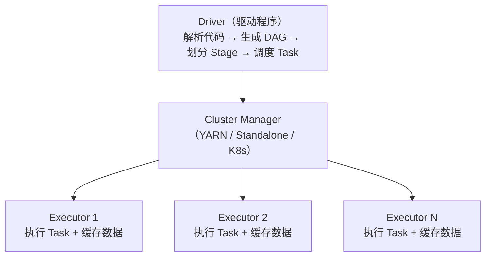

# 6.4 Spark——内存计算引擎

> **一句话定位**：Spark 是 MapReduce 的替代者——同样做分布式批处理，但把中间结果放内存而非磁盘，快 10-100 倍。同时它还统一了批处理（Spark SQL）、流处理（Structured Streaming）、机器学习（MLlib）、图计算（GraphX）四大场景，是目前大数据批处理的事实标准。

---

## 一、为什么比 MapReduce 快？

MapReduce 的致命问题是**每个阶段的结果都要写磁盘**。一个复杂查询翻译成多轮 MapReduce，每轮的中间结果都落盘再读回来，IO 成本极高。

Spark 的核心改进是**内存计算**：把中间结果缓存在内存中，下一步直接从内存读，避免反复磁盘 IO。只有内存放不下时才溢写到磁盘。

```
MapReduce：Map → 写磁盘 → Reduce → 写磁盘 → Map → 写磁盘 → Reduce
Spark：    Map → 内存 → Reduce → 内存 → Map → 内存 → Reduce → 写磁盘
```

---

## 二、核心抽象——RDD

### 2.1 RDD 是什么

RDD（Resilient Distributed Dataset，弹性分布式数据集）是 Spark 最基础的数据抽象——一个**不可变的、分区的、可并行计算的**数据集合。

| 特性 | 含义 |
|------|------|
| **分布式** | 数据分散在集群的多个节点上 |
| **不可变** | RDD 创建后不能修改，每次操作生成新 RDD |
| **弹性容错** | 通过 **血缘（Lineage）** 记录转换链路，丢失分区可以从上游重算恢复 |
| **惰性求值** | Transformation 只构建执行计划，遇到 Action 才真正执行 |

### 2.2 Transformation vs Action

| 类型 | 做什么 | 是否触发计算 | 常见操作 |
|------|--------|------------|---------|
| **Transformation** | 从一个 RDD 生成新 RDD | 不触发（惰性） | `map`、`filter`、`flatMap`、`groupByKey`、`reduceByKey`、`join` |
| **Action** | 返回结果给 Driver 或写存储 | **触发计算** | `collect`、`count`、`reduce`、`saveAsTextFile`、`foreach` |

> 这和 Java Stream 的惰性求值是同一个思路（详见 [3.16 Java 8+ 新特性](../part3-java-deep/16-Java8+新特性.md)）。

### 2.3 宽依赖 vs 窄依赖

| 类型 | 定义 | 是否产生 Shuffle | 示例 |
|------|------|-----------------|------|
| **窄依赖** | 父 RDD 的每个分区只被子 RDD 的一个分区使用 | 否 | `map`、`filter`、`union` |
| **宽依赖** | 父 RDD 的一个分区被子 RDD 的多个分区使用 | **是** | `groupByKey`、`reduceByKey`、`join` |

**Shuffle 是 Spark 最昂贵的操作**——数据要通过网络在节点间重新分配（类似 MapReduce 的 Shuffle 阶段）。宽依赖触发 Shuffle，也触发 Stage 的划分。

---

## 三、执行架构



| 组件 | 职责 |
|------|------|
| **Driver** | 运行用户代码的 main 方法，创建 SparkContext，生成执行计划（DAG），划分 Stage 和 Task |
| **Executor** | 集群节点上的 JVM 进程，负责执行 Task 和缓存 RDD 数据 |
| **Task** | 最小执行单元，一个 Task 处理一个 RDD 分区 |

### 3.1 Job → Stage → Task 的划分

```
Job：    一个 Action 触发一个 Job
Stage：  以 Shuffle 为边界划分（宽依赖切分 Stage）
Task：   一个 Stage 内，每个分区对应一个 Task
```

---

## 四、Spark SQL——最常用的模块

Spark SQL 是在 RDD 之上封装的结构化数据处理接口，提供 DataFrame / Dataset API 和标准 SQL 语法。

```python
# DataFrame API（Python）
df = spark.read.parquet("/data/orders")
result = df.filter(df.amount > 1000) \
           .groupBy("user_id") \
           .agg({"amount": "sum"}) \
           .orderBy("sum(amount)", ascending=False)

# 等价 SQL
spark.sql("""
    SELECT user_id, SUM(amount) as total
    FROM orders
    WHERE amount > 1000
    GROUP BY user_id
    ORDER BY total DESC
""")
```

**Catalyst 优化器**：Spark SQL 的查询会经过 Catalyst 优化器（逻辑优化 → 物理优化），类似 MySQL 的查询优化器。它能自动做谓词下推（把 WHERE 条件推到数据源层过滤）、列裁剪、Join 策略选择等优化。

---

## 五、性能优化要点

Spark ETL 任务优化可以从三个维度系统思考：**减少数据量**（让引擎处理更少的数据）、**优化计算逻辑**（让同样的数据处理得更快）、**调整计算资源**（给引擎更合适的硬件配置）。下面按这三个维度展开。

### 5.1 减少数据量

#### 输入数据量——分区裁剪与列裁剪

分区裁剪（Partition Pruning）是大数据查询的第一道优化——让 Spark 只读需要的分区目录，跳过其他分区。列裁剪是第二道——只读 SELECT 中出现的列（ORC/Parquet 列式存储下，少读一列就少一列的 IO）。

但分区裁剪在实际开发中很容易失效，以下是六种常见的失效场景：

```
分区裁剪失效六大场景：

① 函数包裹分区字段：WHERE to_date(dt) = '2024-06-29'
   → 修复：WHERE dt = '2024-06-29'（直接字面量比较）

② 隐式类型转换：WHERE dt = 20240629（数字 vs 字符串）
   → 修复：WHERE dt = '20240629'（加引号保持类型一致）

③ 分区条件写在 JOIN ON 而非 WHERE：
   → 修复：将分区条件移到 WHERE 子句

④ OR 条件导致裁剪失效：
   → 修复：拆分为 UNION ALL，各子查询带分区条件

⑤ 视图穿透失效：查询视图时，底层物理表的分区字段未透传
   → 修复：直接查物理表，显式加分区过滤条件

⑥ 谓词下推失效：过滤条件在外层子查询，内层未下推
   → 修复：将过滤条件移入子查询内部
```

验证分区裁剪是否生效：在 Spark UI 的 SQL 详情页查看 `PartitionFilters` 字段——有值且非空则生效，空列表或缺失则失效。也可以用 `EXPLAIN EXTENDED <SQL>` 查看物理执行计划中 `Filter` 算子是否在 `FileScan` 节点内部。

#### 中间数据量——数据膨胀问题

Spark 任务中一个隐蔽的性能杀手是**中间数据膨胀**——原始数据量不大，但经过某些操作后数据量暴增几十甚至上百倍。

两个最常见的膨胀源：

**count(distinct) 膨胀**：当 SQL 中有多个 `count(distinct col)` 时，Spark 会通过 Expand 算子把每行数据复制 N 份（N = distinct 字段数），然后对每份数据分别做去重。3 个 count(distinct) 意味着数据量膨胀 3 倍，6 个就是 6 倍。

```sql
-- 膨胀方案（3 个 count distinct → 数据量膨胀 3 倍）
SELECT dt,
       count(distinct customer_id),
       count(distinct sku_id),
       count(distinct concat(customer_id, '-', sku_id))
FROM orders GROUP BY dt;

-- 优化方案一：size + collect_set 避免膨胀
SELECT dt,
       size(collect_set(customer_id)),
       size(collect_set(sku_id)),
       size(collect_set(concat(customer_id, '-', sku_id)))
FROM orders GROUP BY dt;
-- 注意：collect_set 会把所有不同值收集到内存，数据量极大时可能 OOM

-- 优化方案二：拆分为多个小查询 UNION ALL
SELECT dt, count(distinct customer_id), count(distinct sku_id), null
FROM orders GROUP BY dt
UNION ALL
SELECT dt, null, null, count(distinct concat(customer_id, '-', sku_id))
FROM orders GROUP BY dt;
-- 虽然多扫一次表，但每次膨胀倍数更小，单 Task 压力大幅降低
```

**grouping sets 膨胀**：`GROUP BY GROUPING SETS ((a), (a,b), (a,b,c))` 等价于对数据做 3 次不同粒度的聚合再 UNION，数据量随组合数线性膨胀。

优化手段：在 grouping sets 之前先做一次预聚合，只保留需要的维度和指标字段，输入最少的数据进入膨胀阶段。

### 5.2 优化计算逻辑

#### Broadcast Join——避免 Shuffle 的首选

当大表 JOIN 小表时，可以把小表广播到所有 Executor 的内存中，在 Map 端直接完成 JOIN，完全避免 Shuffle。

```sql
-- 使用 MAPJOIN hint 强制广播
SELECT /*+ MAPJOIN(dim) */
    fact.order_id, fact.amount, dim.category_name
FROM fact_order fact
JOIN dim_product dim ON fact.prod_key = dim.prod_key;
```

广播表大小的判断标准：Spark UI 执行计划中各 Scan 节点的实际大小（注意 ORC/Parquet 解压后会膨胀 2-3 倍），小于 60MB 可直接广播，60-200MB 需要评估 Driver 内存是否充足，超过 200MB 不建议广播。

也可以通过 AQE 动态广播：`SET spark.sql.adaptive.autoBroadcastJoinThreshold=100MB`，让 Spark 在运行时根据实际数据量自动决定是否广播。

#### CTE / WITH 子查询的陷阱——不会被复用

后端开发者的直觉是 WITH 子查询（CTE）像变量一样"算一次，到处引用"，但在 Spark 中 **CTE 每次引用都会重新计算**。如果同一个 CTE 被引用 3 次，底层数据会被扫描 3 次。

```sql
-- 问题：cte_result 被引用 2 次 = 底层表扫描 2 次
WITH cte_result AS (
    SELECT user_id, SUM(amount) as total FROM orders WHERE dt = '2024-06-29' GROUP BY user_id
)
SELECT * FROM cte_result WHERE total > 1000
UNION ALL
SELECT * FROM cte_result WHERE total <= 100;

-- 修复方案一：数据量小，CACHE 到内存
CACHE TABLE cte_result AS
SELECT user_id, SUM(amount) as total FROM orders WHERE dt = '2024-06-29' GROUP BY user_id;

-- 修复方案二：数据量大，落临时表
CREATE TABLE tmp_cte_result AS
SELECT user_id, SUM(amount) as total FROM orders WHERE dt = '2024-06-29' GROUP BY user_id;
-- 后续步骤直接读 tmp_cte_result
```

#### 窗口函数优化

窗口函数是 SQL 分析利器，但也是 Spill 和倾斜的高发区：

```
窗口函数优化检查清单：

① 去掉不必要的 ORDER BY：纯聚合窗口（如 SUM OVER PARTITION BY）
   不需要排序，去掉 ORDER BY 可省 O(n log n) 排序开销

② 聚合+JOIN 替代：对无 ORDER BY 的分组聚合窗口，先 GROUP BY
   压缩数据量再 Broadcast JOIN 回原表，比窗口函数更轻量

③ 检查 PARTITION BY key 热点：某个 key 对应百万行，
   所有数据集中到一个 Task 处理 → 倾斜

④ 显式指定 ROWS BETWEEN 范围：避免默认 UNBOUNDED PRECEDING
   导致内存随数据量线性增长

⑤ 多窗口规格拆分为独立 CTE：不同 OVER 规格各自 Shuffle，
   拆开后每次 Shuffle 数据量更小
```

#### reduceByKey vs groupByKey

```
groupByKey：先 Shuffle 所有数据到相同 key 的分区，再聚合
  → 全量数据过网络，内存压力大

reduceByKey：先在各分区内局部聚合（combine），再 Shuffle 聚合后的结果
  → 过网络的数据量大幅减少
```

> **经验法则**：能用 `reduceByKey` / `aggregateByKey` 就不用 `groupByKey`。

### 5.3 调整计算资源

#### 内存模型与 memory.fraction

Spark Executor 的 JVM 内存分为三个区域：

```
┌─────────────────────────────────────────────┐
│              Executor JVM Heap              │
│  ┌────────────────────────────────────────┐ │
│  │     执行内存 + 存储内存                  │ │
│  │     = heap × spark.memory.fraction     │ │
│  │     （用于 Shuffle/JOIN/聚合/缓存）       │ │
│  ├────────────────────────────────────────┤ │
│  │     其他内存（Other）                    │ │
│  │     = heap × (1 - memory.fraction)     │ │
│  │     （用于用户代码、UDF、数据结构）        │ │
│  └────────────────────────────────────────┘ │
├─────────────────────────────────────────────┤
│  堆外内存（spark.executor.memoryOverhead）   │
│  （JNI、网络缓冲区、Python UDF 等）          │
└─────────────────────────────────────────────┘
```

**关键参数 `spark.memory.fraction`**：很多公司的大数据平台默认值是 **0.3**（最初为了兼容 Hive UDF 的内存需求），这意味着 8G 的 Executor 只有 2.4G 用于 Shuffle/JOIN/聚合——严重偏低。如果你的任务不使用自定义 UDF，建议调整到 **0.6**，执行内存翻倍，Spill 大幅减少。

**真实案例**：某推荐团队的 LTV 指标计算任务，executor.memory = 8g 但 memory.fraction = 0.3，导致执行内存仅 2.4G。核心 Stage 处理 3.4TB 数据时 Memory Spill 高达 1751GB、Disk Spill 78GB，单个 Stage 耗时 25 分钟。将 memory.fraction 从 0.3 调到 0.6 后（执行内存从 2.4G 变为 4.8G），Stage 耗时从 25 分钟降至约 12 分钟，**零风险、不增加资源申请量**——这是性价比最高的优化手段。

#### Shuffle 分区数

```
spark.sql.shuffle.partitions = 200（默认值，通常偏小）

估算公式：合理分区数 ≈ Shuffle Read 总数据量 / 目标分区大小（128-256MB）
例如：Shuffle Read 100GB → 100GB / 200MB = 500 个分区
```

分区数过小 → 单 Task 数据量大 → OOM 或 Spill；分区数过大 → Task 太多、调度开销大、可能产生大量小文件。

推荐开启 AQE（Adaptive Query Execution）自动合并分区：`SET spark.sql.adaptive.enabled=true`，Spark 会在运行时根据实际数据量自动合并过小的分区。

#### 小文件问题

小文件是 HDFS 和 Spark 的共同敌人——读取端每个小文件产生一个 Task（10GB 数据如果是 10 万个小文件就产生 10 万个 Task），写入端输出过多小文件会拖慢下游任务。

```
读取端小文件（Task 膨胀）：
  调大 spark.sql.files.maxPartitionBytes（默认 128MB → 256MB）
  让 Spark 合并多个小文件到一个 Task

写入端小文件（输出文件过多）：
  开启 AQE 自动合并：spark.sql.adaptive.coalescePartitions.enabled=true
  或在写出前加 DISTRIBUTE BY 控制输出文件数
```

#### OOM / Spill 排查路径

```
Executor OOM / Spill 排查优先级：
  ① 先查 memory.fraction 是否偏低（0.3 → 0.6，零成本）
  ② 再查 Shuffle 分区数是否偏小（调大 shuffle.partitions）
  ③ 检查是否有数据倾斜（单 Task 数据量远超中位数）
  ④ 检查 executor.cores 是否过大（每个 core 一个 Task 共享内存）
  ⑤ 最后才考虑调大 executor.memory（增加资源申请量）

Driver OOM 排查：
  ① collect() 把大结果集拉到 Driver → 改用 write 写出
  ② Broadcast 表过大 → 检查 autoBroadcastJoinThreshold
  ③ 动态分区数量过多 → 限制 maxDynamicPartitions

YARN kill（exitCode 143）：
  ≠ JVM OOM。YARN kill 是容器物理内存（堆 + 堆外）超出申请量
  → 调大 spark.executor.memoryOverhead，不是调 executor.memory
```

### 5.4 Spark UI 分析方法——ETL 优化的第一步

在优化 Spark 任务之前，先用 Spark UI 定位瓶颈，避免"凭感觉调参"。

```
Spark UI 分析清单：

① Jobs 页面：看哪些 Job 耗时最长
② Stages 页面：按耗时排序，找 TOP 5 最慢的 Stage
③ Stage 详情页：
   - Task 数量：是否合理（太多 = 小文件，太少 = 并行度不足）
   - Shuffle Read/Write：数据量是否异常大
   - Memory Spill / Disk Spill：> 0 说明内存不足
   - Task 耗时分布：最慢 Task / 中位数 > 5x = 数据倾斜
   - GC Time：占比 > 10% 说明内存压力大
④ SQL 页面：查看执行计划，确认 PartitionFilters 是否生效、
   JOIN 策略是否合理（BroadcastHashJoin vs SortMergeJoin）
```

<details>
<summary><b>展开：ETL 任务优化实战案例——从 Spark UI 到参数调优</b></summary>

**场景**：某配送团队的快送范围计算任务（核心 ETL 链路），Spark 3 引擎，137 行 SQL，涉及多表 JOIN 和聚合计算，运行时长持续增长触发超时告警。

**第一步：时间线分析**

通过调度系统和 YARN 日志，还原任务的完整时间线：

| 环节 | 耗时 | 占比 |
|------|------|------|
| 上游依赖等待 | — | — |
| YARN 队列等待 | 52 min | 46% |
| Spark 实际运行 | 58 min | 51% |
| 提交/收尾 | 3 min | 3% |

发现 YARN 等待占了 46%——这是资源层面的问题（队列在早高峰资源紧张），不是 Spark 本身的问题。

**第二步：Spark UI 定位瓶颈 Stage**

| Stage | 耗时 | Input | Memory Spill | Disk Spill |
|-------|------|-------|-------------|------------|
| Stage 8 | 25 min（占 43%） | 3.4 TB | 1751 GB | 78 GB |
| 其他 Stage | 合计 33 min | — | 少量 | — |

Stage 8 是明确的性能瓶颈，Memory Spill 高达 1751GB 说明内存严重不足。

**第三步：参数分析**

```
当前参数：
  spark.executor.memory = 8g
  spark.memory.fraction = 0.3  ← 问题根因
  spark.sql.files.maxPartitionBytes = 32MB  ← 偏小
  spark.executor.cores = 2

内存计算：8G × 0.3 = 2.4G 执行内存
Stage 8 每个 Task 平均输入 344MB，但执行内存只有 2.4G
→ 大量中间数据无法放入内存 → 触发 Spill → 磁盘 IO 成为瓶颈
```

**第四步：优化方案**

| 优先级 | 类型 | 内容 | 预期效果 |
|--------|------|------|---------|
| P0 | 纯参数 | memory.fraction 0.3 → 0.6 | Stage 8 预计 25min → 12min，零风险 |
| P1 | 纯参数 | maxPartitionBytes 32MB → 128MB | Task 数从 10123 降至 2500，减少调度开销 |
| P2 | 调度 | 错峰提交或申请扩容 | 消除 52min 队列等待 |

**结果**：任务运行时长降低约 40%，CU 消耗降低约 25%，优化从分析到验证完成仅 30 分钟。

**关键教训**：`spark.memory.fraction` 是最被忽视但性价比最高的参数——调整它不增加资源申请量，只是改变了内存的分配比例。很多团队在 OOM 时第一反应是调大 executor.memory（增加资源），其实先检查 memory.fraction 是否合理，往往就能解决问题。

</details>

### 5.5 数据倾斜——八种修复方案

数据倾斜是 Spark 任务中最常见的性能杀手。诊断标准：Stage 内 Task 倾斜分析中，最慢 Task / 中位数 > 5 倍，且耗时差值 > 10 分钟或输入量差值 > 1GB。

修复前的**必做前置步骤**：先判断是 JOIN 倾斜还是聚合倾斜——两类倾斜的修复方向完全不同，混用无效。对 JOIN Key 和 GROUP BY Key 分别做分布分析，找出热点 Key。

| 优先级 | 方案 | 适用场景 | 改动成本 |
|--------|------|---------|---------|
| 1 | 过滤倾斜 Key | null 值、测试数据等可丢弃的异常 key | 最低 |
| 2 | 提高 Shuffle 并行度 | 整体分区数不足，无单一热点 | 纯参数 |
| 3 | AQE Skew Join | JOIN 倾斜首选（Spark 3.x） | 纯参数 |
| 4 | 两阶段聚合 | GROUP BY / PARTITION BY 聚合倾斜 | SQL 改写 |
| 5 | Broadcast Join | 小表 ≤ 60MB | SQL hint |
| 6 | NULL Key 单独处理 | JOIN Key 含大量 null（> 10%） | SQL 改写 |
| 7 | 热点 Key 单独 JOIN | 少量热点 key（≤ 10 个）且不能过滤 | SQL 改写 |
| 8 | 加盐打散 | 大量热点 key、前七种均无效的兜底方案 | SQL 改写 |

> **经验法则**：优先用纯参数方案（方案 1-3），再考虑 SQL 改写（方案 4-8）。AQE Skew Join 开启方式：`SET spark.sql.adaptive.skewJoin.enabled=true`。

### 5.6 优化效果评估

优化有两个方向——节约资源和加快速度——但它们不总是一致的（比如增加 Executor 可以加速但会消耗更多 CU）。评估标准要根据任务的重要性来定：

```
大 V 任务（核心链路卡点）：以尽快就绪为主，给充足资源，保证下游按时启动
SLA 任务（有承诺就绪时间）：以按时就绪为主，在保证 buffer 的前提下优化资源
普通任务：以节省资源为主，使用默认参数即可
```

---

## 六、面试深度剖析

### 考点 1：Spark 比 MapReduce 快在哪

> **面试官**：「Spark 为什么比 MapReduce 快？」

三个层面：内存计算（中间结果不落盘）；DAG 执行引擎（多轮计算合并为一个 DAG，减少启动开销）；Catalyst 查询优化器（SQL 层面的自动优化）。但如果数据大到内存放不下，Spark 也会溢写磁盘，和 MapReduce 差距会缩小。

### 考点 2：RDD 怎么容错

> **面试官**：「Spark RDD 某个分区丢失了怎么办？」

通过血缘（Lineage）重算。每个 RDD 记录了它是从哪个 RDD 通过什么 Transformation 得来的，丢失分区时只需要从最近的可用上游分区重算，不需要重跑整个任务。如果血缘链太长，可以用 `checkpoint()` 把 RDD 持久化到 HDFS，截断血缘。

### 考点 3：Shuffle 为什么慢

> **面试官**：「Spark 的 Shuffle 具体做了什么？」

Shuffle 分两个阶段：**Shuffle Write**（Map 端把数据按 key 的 hash 写到本地磁盘的分区文件）和 **Shuffle Read**（Reduce 端通过网络拉取各个 Map 端对应分区的数据）。涉及磁盘 IO（序列化+写文件）+ 网络传输 + 反序列化，是 Spark 中最昂贵的操作。

### 考点 4：数据倾斜怎么处理

> **面试官**：「Spark 任务跑了很久，发现只有一个 Task 卡住，怎么办？」

第一步是诊断而非直接修复——先打开 Spark UI 看 Stage 详情页，找最慢 Task 和中位数 Task 的输入数据量差异，确认是 JOIN 倾斜还是聚合倾斜。然后按优先级选方案：Spark 3.x 首选开启 AQE Skew Join（纯参数，零风险），其次是 Broadcast Join（小表广播避免 Shuffle），再次是两阶段聚合（先加随机前缀局部聚合再全局聚合），最后才是加盐打散（兜底方案，改动最大）。

### 考点 5：Spark 任务 OOM 了怎么排查

> **面试官**：「Spark 任务报 OutOfMemoryError，你怎么处理？」

不要第一反应调大 executor.memory。先区分三种 OOM：Executor OOM（先查 `spark.memory.fraction` 是否偏低，再查分区数是否偏小，最后才加内存）；Driver OOM（通常是 `collect()` 拉了太多数据到 Driver，改用 write 写出）；YARN kill（exitCode 143，和 JVM OOM 不同，是容器物理内存超限，需要调大 `memoryOverhead`）。三种的修复方向完全不同。

### 考点 6：分区裁剪失效的场景

> **面试官**：「Spark 任务读了比预期多得多的数据，可能是什么原因？」

最常见的原因是分区裁剪失效——分区字段被函数包裹（`WHERE to_date(dt) = ...`）、隐式类型转换（字符串分区用数字匹配）、过滤条件写在 JOIN ON 而非 WHERE、OR 条件跨列、查询视图时底层物理表分区字段未透传。可以通过 Spark UI SQL 详情页的 `PartitionFilters` 字段验证是否生效。

---

[← 6.3 Hive](./03-Hive.md) | [返回本章目录](./README.md) | [6.5 Flink →](./05-Flink.md)
