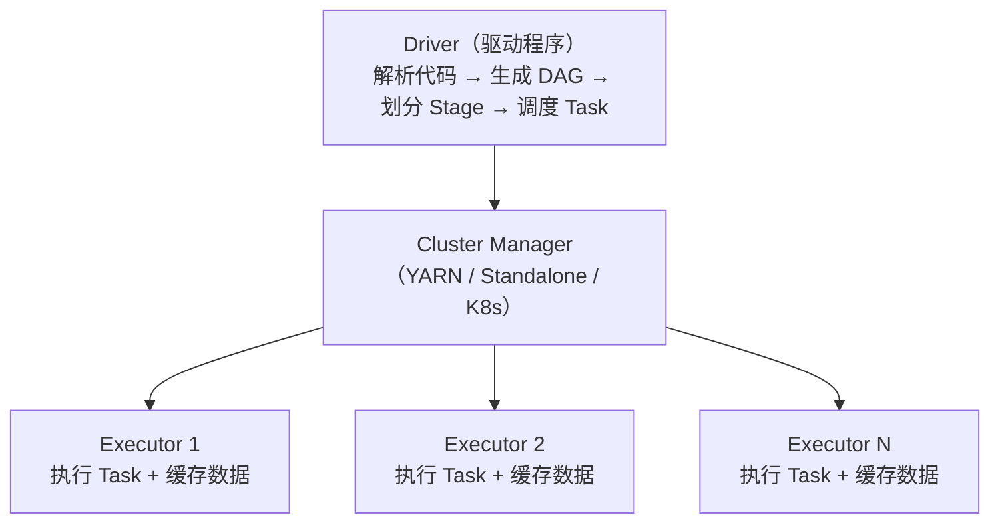

# 6.4 Spark——内存计算引擎

> **一句话定位**：Spark 是 MapReduce 的替代者——同样做分布式批处理，但把中间结果放内存而非磁盘，快 10-100 倍。同时它还统一了批处理（Spark SQL）、流处理（Structured Streaming）、机器学习（MLlib）、图计算（GraphX）四大场景，是目前大数据批处理的事实标准。

---

## 一、为什么比 MapReduce 快？

MapReduce 的致命问题是**每个阶段的结果都要写磁盘**。一个复杂查询翻译成多轮 MapReduce，每轮的中间结果都落盘再读回来，IO 成本极高。

Spark 的核心改进是**内存计算**：把中间结果缓存在内存中，下一步直接从内存读，避免反复磁盘 IO。只有内存放不下时才溢写到磁盘。

```
MapReduce：Map → 写磁盘 → Reduce → 写磁盘 → Map → 写磁盘 → Reduce
Spark：    Map → 内存 → Reduce → 内存 → Map → 内存 → Reduce → 写磁盘
```

---

## 二、核心抽象——RDD

### 2.1 RDD 是什么

RDD（Resilient Distributed Dataset，弹性分布式数据集）是 Spark 最基础的数据抽象——一个**不可变的、分区的、可并行计算的**数据集合。

| 特性 | 含义 |
|------|------|
| **分布式** | 数据分散在集群的多个节点上 |
| **不可变** | RDD 创建后不能修改，每次操作生成新 RDD |
| **弹性容错** | 通过 **血缘（Lineage）** 记录转换链路，丢失分区可以从上游重算恢复 |
| **惰性求值** | Transformation 只构建执行计划，遇到 Action 才真正执行 |

### 2.2 Transformation vs Action

| 类型 | 做什么 | 是否触发计算 | 常见操作 |
|------|--------|------------|---------|
| **Transformation** | 从一个 RDD 生成新 RDD | 不触发（惰性） | `map`、`filter`、`flatMap`、`groupByKey`、`reduceByKey`、`join` |
| **Action** | 返回结果给 Driver 或写存储 | **触发计算** | `collect`、`count`、`reduce`、`saveAsTextFile`、`foreach` |

> 这和 Java Stream 的惰性求值是同一个思路（详见 [3.16 Java 8+ 新特性](../part3-java-deep/16-Java8+新特性.md)）。

### 2.3 宽依赖 vs 窄依赖

| 类型 | 定义 | 是否产生 Shuffle | 示例 |
|------|------|-----------------|------|
| **窄依赖** | 父 RDD 的每个分区只被子 RDD 的一个分区使用 | 否 | `map`、`filter`、`union` |
| **宽依赖** | 父 RDD 的一个分区被子 RDD 的多个分区使用 | **是** | `groupByKey`、`reduceByKey`、`join` |

**Shuffle 是 Spark 最昂贵的操作**——数据要通过网络在节点间重新分配（类似 MapReduce 的 Shuffle 阶段）。宽依赖触发 Shuffle，也触发 Stage 的划分。

---

## 三、执行架构



| 组件 | 职责 |
|------|------|
| **Driver** | 运行用户代码的 main 方法，创建 SparkContext，生成执行计划（DAG），划分 Stage 和 Task |
| **Executor** | 集群节点上的 JVM 进程，负责执行 Task 和缓存 RDD 数据 |
| **Task** | 最小执行单元，一个 Task 处理一个 RDD 分区 |

### 3.1 Job → Stage → Task 的划分

```
Job：    一个 Action 触发一个 Job
Stage：  以 Shuffle 为边界划分（宽依赖切分 Stage）
Task：   一个 Stage 内，每个分区对应一个 Task
```

---

## 四、Spark SQL——最常用的模块

Spark SQL 是在 RDD 之上封装的结构化数据处理接口，提供 DataFrame / Dataset API 和标准 SQL 语法。

```python
# DataFrame API（Python）
df = spark.read.parquet("/data/orders")
result = df.filter(df.amount > 1000) \
           .groupBy("user_id") \
           .agg({"amount": "sum"}) \
           .orderBy("sum(amount)", ascending=False)

# 等价 SQL
spark.sql("""
    SELECT user_id, SUM(amount) as total
    FROM orders
    WHERE amount > 1000
    GROUP BY user_id
    ORDER BY total DESC
""")
```

**Catalyst 优化器**：Spark SQL 的查询会经过 Catalyst 优化器（逻辑优化 → 物理优化），类似 MySQL 的查询优化器。它能在**部分场景下**自动做谓词下推、列裁剪、Join 策略选择等优化——但"自动"不等于"万能"。Catalyst 在 INNER JOIN 下表现良好（过滤条件写在 WHERE 还是 ON 里效果一样），但在**外连接（LEFT/RIGHT JOIN）场景下存在明显局限**：右表的过滤条件写在 WHERE 中不会被下推（因为下推会把 LEFT JOIN 变成 INNER JOIN，改变语义）。此外，分区字段被函数包裹、隐式类型转换、视图遮挡底层分区字段等情况，Catalyst 也无法自动处理。这些需要开发者手动优化的场景，详见下文 [6.1 分区裁剪失效六大场景](#61-减少数据量)。

---

## 五、Spark 版本演进与新特性

Spark 从 2014 年的 1.0 到如今的 3.x / 4.x，核心架构保持稳定（RDD + DAG + Catalyst），但每个大版本都引入了对性能和易用性有重大影响的新特性。面试中经常会问"你用的哪个版本、了解哪些新特性"，这里按影响从大到小梳理。

### 5.1 AQE——Adaptive Query Execution（Spark 3.0，最重要的新特性）

AQE 是 Spark 3.0 引入的**运行时自适应优化**——在查询执行过程中，根据已经产生的真实数据统计信息（而非编译期的估算），动态调整执行计划。

传统 Catalyst 优化器的问题是：它在**编译期**根据表的统计信息（行数、大小）决定执行计划，但统计信息经常不准（表没有 ANALYZE、分区被过滤后实际数据量远小于统计值）。AQE 把这个决策推迟到**运行时**——Shuffle 写完后，Spark 拿到了每个分区的真实数据量，再决定下一步怎么做。

AQE 包含三个核心能力：

```
① 自动合并小分区（Coalescing Post-Shuffle Partitions）
   Shuffle 后如果很多分区数据量很小（比如 1MB），AQE 自动合并成更大的分区
   → 减少 Task 数量，降低调度开销
   SET spark.sql.adaptive.coalescePartitions.enabled=true;

② 动态切换 JOIN 策略（Converting Sort-Merge Join to Broadcast Join）
   编译期估算小表 100MB 选了 SortMergeJoin，但运行时发现过滤后只有 5MB
   → AQE 自动切换为 BroadcastHashJoin，省掉一次 Shuffle
   SET spark.sql.adaptive.autoBroadcastJoinThreshold=100MB;

③ 自动处理倾斜 JOIN（Optimizing Skew Joins）
   Shuffle 后发现某个分区数据量远大于其他分区
   → AQE 自动把大分区拆成多个小分区，并行处理
   SET spark.sql.adaptive.skewJoin.enabled=true;
```

> **实际影响**：AQE 是 Spark 3.x 对 ETL 任务最大的性能提升——很多之前需要手动调 shuffle.partitions、手动加 Broadcast hint、手动处理数据倾斜的场景，开启 AQE 后 Spark 自己就能处理。Spark 3.2+ 默认开启 AQE。

### 5.2 Spark 3.x 其他关键改进

| 版本 | 特性 | 说明 |
|------|------|------|
| **3.0** | AQE | 运行时自适应优化（见上文） |
| **3.0** | Dynamic Partition Pruning（DPP） | 星型模型查询中，先扫描维度表获取过滤后的 Key 集合，再用这些 Key 裁剪事实表分区——解决了"维度表 WHERE 条件无法传递给事实表分区过滤"的痛点 |
| **3.1** | Shuffle Hash Join 改进 | 支持 Full Outer Join 的 Shuffle Hash Join，之前只能走 Sort Merge Join |
| **3.2** | AQE 默认开启 | `spark.sql.adaptive.enabled` 默认值从 false 变为 true |
| **3.2** | RocksDB State Store | Structured Streaming 状态存储从内存迁移到 RocksDB，支持更大状态 |
| **3.3** | Join Hint 增强 | 支持 `/*+ MERGE(t) */`、`/*+ SHUFFLE_HASH(t) */` 等细粒度 Join 策略提示 |
| **3.4** | Python UDF 性能提升 | Apache Arrow 批量数据传输，Python UDF 性能提升 2-5 倍 |
| **3.5** | CONNECT 协议 | 新增 Spark Connect 架构，客户端通过 gRPC 连接远端 Spark 集群，解耦客户端和服务端版本 |

### 5.3 Spark 4.x 前瞻

| 特性 | 说明 |
|------|------|
| **Spark Connect GA**（GA = Generally Available，正式发布） | 正式版 Spark Connect，支持多语言客户端（Python/Scala/Go/Rust）远程连接 Spark 集群 |
| **ANSI SQL 默认开启** | 更严格的 SQL 语义（如溢出报错而非截断），减少隐式类型转换带来的数据质量问题 |
| **Variant 数据类型** | 原生支持半结构化数据（JSON-like），比 `get_json_object` 快数倍 |
| **Collation 支持** | 字符串排序和比较支持指定排序规则（大小写不敏感比较等） |
| **String 索引优化** | STRING 类型的 UTF-8 处理全面优化，性能提升显著 |

<details>
<summary><b>展开：面试常问——AQE 和手动调参的关系</b></summary>

**问**：有了 AQE 是不是就不用手动调参了？

**答**：不完全是。AQE 解决了**运行时**能感知到的问题（分区合并、JOIN 策略切换、倾斜处理），但以下场景 AQE 无能为力：

分区裁剪失效（AQE 管不了数据读取阶段的问题）、分区字段被函数包裹（这是 SQL 写法问题）、CTE 重复计算（AQE 不会自动缓存中间结果）、memory.fraction 配置偏低（这是 JVM 层的内存分配，不是 SQL 执行计划的范畴）。

所以正确的关系是：**AQE 是保底机制**——即使你的参数没调到最优，AQE 也能在运行时做一定程度的弥补。但最佳实践仍然是"先在 SQL 和参数层面做好优化，再让 AQE 兜底"。

</details>

---

## 六、性能优化要点

Spark ETL 任务优化可以从三个维度系统思考：**减少数据量**（让引擎处理更少的数据）、**优化计算逻辑**（让同样的数据处理得更快）、**调整计算资源**（给引擎更合适的硬件配置）。下面按这三个维度展开。

### 6.1 减少数据量

#### 输入数据量——分区裁剪与列裁剪

分区裁剪（Partition Pruning）是大数据查询的第一道优化——让 Spark 只读需要的分区目录，跳过其他分区。列裁剪是第二道——只读 SELECT 中出现的列（ORC/Parquet 列式存储下，少读一列就少一列的 IO）。

但分区裁剪在实际开发中很容易失效，以下是六种常见的失效场景：

```
分区裁剪失效六大场景：

① 函数包裹分区字段：WHERE to_date(dt) = '2024-06-29'
   → 修复：WHERE dt = '2024-06-29'（直接字面量比较）

② 隐式类型转换：WHERE dt = 20240629（数字 vs 字符串）
   → 修复：WHERE dt = '20240629'（加引号保持类型一致）

③ 分区条件写在 JOIN ON 而非 WHERE：
   → 修复：将分区条件移到 WHERE 子句

④ OR 条件导致裁剪失效：
   → 修复：拆分为 UNION ALL，各子查询带分区条件

⑤ 视图穿透失效：查询视图时，底层物理表的分区字段未透传
   → 修复：直接查物理表，显式加分区过滤条件

⑥ 谓词下推失效：过滤条件在外层子查询，内层未下推
   → 修复：将过滤条件移入子查询内部
```

验证分区裁剪是否生效：在 Spark UI 的 SQL 详情页查看 `PartitionFilters` 字段——有值且非空则生效，空列表或缺失则失效。也可以用 `EXPLAIN EXTENDED <SQL>` 查看物理执行计划中 `Filter` 算子是否在 `FileScan` 节点内部。

#### 谓词下推在外连接中的行为——Catalyst 不能自动优化的盲区

后端开发者习惯了"把过滤条件写在 WHERE 里就行，优化器会处理"，但外连接下这个直觉是错的。LEFT JOIN 场景下，过滤条件写在不同位置，Catalyst 的行为完全不同：

| 条件位置 | LEFT JOIN 中左表条件 | LEFT JOIN 中右表条件 |
|---------|---------------------|---------------------|
| 写在 **JOIN ON** 中 | 不下推（ON 中只影响匹配，不影响左表输出） | **下推** ✓ |
| 写在 **WHERE** 中 | **下推** ✓ | **不下推** ✗（会把 LEFT 变 INNER） |

```sql
-- ✗ 错误写法：右表过滤条件在 WHERE 中，Catalyst 不会下推
-- Spark 会先 LEFT JOIN 全量数据，再过滤 → 无效数据参与了 Shuffle
SELECT a.*, b.value
FROM big_table a
LEFT JOIN small_table b ON a.id = b.id
WHERE b.dt = '2024-06-29';

-- ✓ 正确写法：右表过滤条件移到子查询内部，读数据时就过滤
SELECT a.*, b.value
FROM big_table a
LEFT JOIN (
    SELECT * FROM small_table WHERE dt = '2024-06-29'
) b ON a.id = b.id;
```

> **经验法则**：INNER JOIN 可以放心把条件写在 WHERE 里，Catalyst 能处理。但 LEFT/RIGHT JOIN 一定要手动检查：右表（或 LEFT JOIN 的非保留表）的过滤条件，要写在子查询内部或 JOIN ON 中，别指望 Catalyst 替你下推。

#### 中间数据量——数据膨胀问题

Spark 任务中一个隐蔽的性能杀手是**中间数据膨胀**——原始数据量不大，但经过某些操作后数据量暴增几十甚至上百倍。

两个最常见的膨胀源：

**count(distinct) 膨胀**：当 SQL 中有多个 `count(distinct col)` 时，Spark 会通过 Expand 算子把每行数据复制 N 份（N = distinct 字段数），然后对每份数据分别做去重。3 个 count(distinct) 意味着数据量膨胀 3 倍，6 个就是 6 倍。

```sql
-- 膨胀方案（3 个 count distinct → 数据量膨胀 3 倍）
SELECT dt,
       count(distinct customer_id),
       count(distinct sku_id),
       count(distinct concat(customer_id, '-', sku_id))
FROM orders GROUP BY dt;

-- 优化方案一：size + collect_set 避免膨胀
SELECT dt,
       size(collect_set(customer_id)),
       size(collect_set(sku_id)),
       size(collect_set(concat(customer_id, '-', sku_id)))
FROM orders GROUP BY dt;
-- 注意：collect_set 会把所有不同值收集到内存，数据量极大时可能 OOM

-- 优化方案二：拆分为多个小查询 UNION ALL
SELECT dt, count(distinct customer_id), count(distinct sku_id), null
FROM orders GROUP BY dt
UNION ALL
SELECT dt, null, null, count(distinct concat(customer_id, '-', sku_id))
FROM orders GROUP BY dt;
-- 虽然多扫一次表，但每次膨胀倍数更小，单 Task 压力大幅降低
```

**grouping sets 膨胀**：`GROUP BY GROUPING SETS ((a), (a,b), (a,b,c))` 等价于对数据做 3 次不同粒度的聚合再 UNION，数据量随组合数线性膨胀。

优化手段：在 grouping sets 之前先做一次预聚合，只保留需要的维度和指标字段，输入最少的数据进入膨胀阶段。

### 6.2 优化计算逻辑

#### Spark JOIN 策略全景——五种物理 JOIN

Spark SQL 的 Catalyst 优化器在生成物理执行计划时，会根据数据大小、JOIN 类型、是否有 Hint 等因素，从五种物理 JOIN 策略中选择一种。理解这五种策略的触发条件和适用场景，是优化 JOIN 性能的基础。

| 策略 | 是否 Shuffle | 是否排序 | 适用场景 | 触发条件 |
|------|------------|---------|---------|---------|
| **BroadcastHashJoin** | 否（小表广播） | 否 | 大表 JOIN 小表 | 小表 < `autoBroadcastJoinThreshold`（默认 10MB）或使用 `/*+ BROADCAST(t) */` |
| **SortMergeJoin** | 是 | 是 | 大表 JOIN 大表（等值 JOIN） | 两表都超过广播阈值，JOIN key 可排序（默认策略） |
| **ShuffleHashJoin** | 是 | 否 | 大表 JOIN 中等表（等值 JOIN） | 需设置 `spark.sql.join.preferSortMergeJoin=false`，或使用 `/*+ SHUFFLE_HASH(t) */` |
| **CartesianJoin** | 是 | 否 | 笛卡尔积（无 JOIN 条件） | CROSS JOIN 或 INNER JOIN 无 ON 条件 |
| **BroadcastNestedLoopJoin** | 否（小表广播） | 否 | 非等值 JOIN（如 `a.price > b.min_price`） | 小表可广播 + 非等值条件 |

```
Spark 选择 JOIN 策略的决策树（简化版）：

  有 JOIN Hint？
  ├── /*+ BROADCAST(t) */ → BroadcastHashJoin
  ├── /*+ SHUFFLE_HASH(t) */ → ShuffleHashJoin
  ├── /*+ MERGE(t) */ → SortMergeJoin
  └── 无 Hint → 自动判断 ↓

  是等值 JOIN？
  ├── 是 → 小表 < 广播阈值？
  │         ├── 是 → BroadcastHashJoin
  │         └── 否 → SortMergeJoin（默认）
  └── 否 → 小表可广播？
            ├── 是 → BroadcastNestedLoopJoin
            └── 否 → CartesianJoin（慎用，性能极差）
```

**BroadcastHashJoin** 是性能最优的策略——小表被序列化后广播到每个 Executor 内存中，构建 Hash 表，大表流式探测。完全避免 Shuffle，适合维度表 JOIN 事实表的星型模型场景。

```sql
-- 使用 MAPJOIN hint 强制广播（MAPJOIN / BROADCAST / BROADCASTJOIN 三个 hint 等价）
SELECT /*+ BROADCAST(dim) */
    fact.order_id, fact.amount, dim.category_name
FROM fact_order fact
JOIN dim_product dim ON fact.prod_key = dim.prod_key;
```

广播表大小的判断标准：Spark UI 执行计划中各 Scan 节点的实际大小（注意 ORC/Parquet 解压后会膨胀 2-3 倍），小于 60MB 可直接广播，60-200MB 需要评估 Driver 内存是否充足，超过 200MB 不建议广播。

也可以通过 AQE 动态广播：`SET spark.sql.adaptive.autoBroadcastJoinThreshold=100MB`，让 Spark 在运行时根据实际数据量自动决定是否广播。

**SortMergeJoin** 是 Spark 大表 JOIN 大表的默认策略。两张表按 JOIN key 各自 Shuffle + 排序后，用归并算法做匹配。优点是不受数据量限制（不需要把任何一张表放进内存），缺点是需要两次 Shuffle + 两次排序。

**ShuffleHashJoin** 只 Shuffle 不排序——Shuffle 后对小表那侧构建 Hash 表，大表那侧做探测。比 SortMergeJoin 少了排序开销，但要求小表的每个分区能放进内存。Spark 默认优先 SortMergeJoin（更稳定），需要手动开启或用 Hint。

```sql
-- 用 Hint 指定 ShuffleHashJoin
SELECT /*+ SHUFFLE_HASH(b) */
    a.*, b.value
FROM big_table a JOIN medium_table b ON a.id = b.id;
```

**CartesianJoin** 和 **BroadcastNestedLoopJoin** 是两种非等值 JOIN 策略。CartesianJoin 做笛卡尔积（M×N 行输出），除非数据量极小否则不应使用。BroadcastNestedLoopJoin 广播小表后对每行大表遍历小表匹配，适合非等值条件（如范围 JOIN `a.start <= b.ts AND b.ts < a.end`）且小表可广播的场景。

> **经验法则**：90% 的 ETL 场景只需关注两种策略——小表走 BroadcastHashJoin，大表走 SortMergeJoin。如果发现 SortMergeJoin 的排序阶段成为瓶颈（Spark UI 中 Stage 的排序耗时占比高），且其中一侧表不算太大，可以尝试切换为 ShuffleHashJoin。非等值 JOIN 尽量控制其中一侧为小表，走 BroadcastNestedLoopJoin 避免笛卡尔积。

#### CTE / WITH 子查询的陷阱——不会被复用

后端开发者的直觉是 WITH 子查询（CTE）像变量一样"算一次，到处引用"，但在 Spark 中 **CTE 每次引用都会重新计算**。如果同一个 CTE 被引用 3 次，底层数据会被扫描 3 次。

```sql
-- 问题：cte_result 被引用 2 次 = 底层表扫描 2 次
WITH cte_result AS (
    SELECT user_id, SUM(amount) as total FROM orders WHERE dt = '2024-06-29' GROUP BY user_id
)
SELECT * FROM cte_result WHERE total > 1000
UNION ALL
SELECT * FROM cte_result WHERE total <= 100;

-- 修复方案一：数据量小，CACHE 到内存
CACHE TABLE cte_result AS
SELECT user_id, SUM(amount) as total FROM orders WHERE dt = '2024-06-29' GROUP BY user_id;

-- 修复方案二：数据量大，落临时表
CREATE TABLE tmp_cte_result AS
SELECT user_id, SUM(amount) as total FROM orders WHERE dt = '2024-06-29' GROUP BY user_id;
-- 后续步骤直接读 tmp_cte_result
```

#### 窗口函数——语法、分类与面试常考函数

窗口函数（Window Function）是 SQL 中"既要聚合又要保留明细"的利器。和 GROUP BY 不同，窗口函数**不会合并行**——每行都保留，同时附带一个在"窗口"内计算出的值。Spark SQL 从 **1.4 版本**开始完整支持 SQL 标准的窗口函数语法，后续版本持续增强（如 Spark 2.0 引入 Dataset API 的窗口支持，Spark 3.x 在 AQE 下优化窗口执行）。

**完整语法**

```sql
函数名(参数) OVER (
    [PARTITION BY 分区字段, ...]     -- 按哪个维度分组（类似 GROUP BY，但不合并行）
    [ORDER BY 排序字段 [ASC|DESC]]   -- 分区内按什么排序
    [窗口框架子句]                    -- 计算范围：哪些行参与计算
)
```

三个子句都是可选的：省略 PARTITION BY 则整张表为一个分区；省略 ORDER BY 则分区内不排序（聚合窗口用）；省略窗口框架则根据是否有 ORDER BY 使用不同的默认值（下文详述）。

**三类窗口函数**

| 类别 | 函数 | 用途 | 是否需要 ORDER BY |
|------|------|------|-----------------|
| **排名函数** | `ROW_NUMBER()` | 分区内行号，1,2,3,4（不跳号） | 必须 |
| | `RANK()` | 排名（并列跳号），1,1,3,4 | 必须 |
| | `DENSE_RANK()` | 排名（并列不跳号），1,1,2,3 | 必须 |
| | `NTILE(n)` | 分区内分成 n 等份，返回桶号 | 必须 |
| **聚合函数** | `SUM()` / `COUNT()` / `AVG()` / `MAX()` / `MIN()` | 在窗口内做聚合 | 可选（有无 ORDER BY 语义不同） |
| **偏移函数** | `LAG(col, n, default)` | 取前 n 行的值（上一条记录） | 必须 |
| | `LEAD(col, n, default)` | 取后 n 行的值（下一条记录） | 必须 |
| | `FIRST_VALUE(col)` | 窗口内第一行的值 | 通常需要 |
| | `LAST_VALUE(col)` | 窗口内最后一行的值 | 通常需要 |

```sql
-- 面试高频场景 1：每个部门薪资排名 TOP 3
SELECT * FROM (
    SELECT name, dept_id, salary,
           ROW_NUMBER() OVER (PARTITION BY dept_id ORDER BY salary DESC) as rn
    FROM employees
) t WHERE rn <= 3;

-- 面试高频场景 2：同比/环比——取上一期的值做对比
SELECT dt, gmv,
       LAG(gmv, 1) OVER (ORDER BY dt) as prev_day_gmv,           -- 昨天的 GMV
       LAG(gmv, 7) OVER (ORDER BY dt) as prev_week_gmv,          -- 上周同一天的 GMV
       gmv - LAG(gmv, 1) OVER (ORDER BY dt) as day_over_day      -- 日环比增量
FROM daily_gmv;

-- 面试高频场景 3：RANK vs DENSE_RANK vs ROW_NUMBER 的区别
-- 薪资：8000, 8000, 7000, 6000
-- ROW_NUMBER: 1, 2, 3, 4（强制不重复，常用于去重取一条）
-- RANK:       1, 1, 3, 4（并列后跳号，常用于竞赛排名）
-- DENSE_RANK: 1, 1, 2, 3（并列后不跳号，常用于"排名第几"的业务语义）
```

**窗口框架（Frame）——ROWS BETWEEN 详解**

窗口框架决定"当前行往前往后看多远"。这是理解窗口函数行为的关键，也是面试常考的细节。

```
窗口框架语法：
  ROWS BETWEEN <起点> AND <终点>

五种边界关键词：
  UNBOUNDED PRECEDING  = 分区的第一行（从最开头开始）
  n PRECEDING          = 当前行往前 n 行
  CURRENT ROW          = 当前行
  n FOLLOWING          = 当前行往后 n 行
  UNBOUNDED FOLLOWING  = 分区的最后一行（到最末尾）

常见组合：
  ROWS BETWEEN UNBOUNDED PRECEDING AND CURRENT ROW      → 从头累计到当前行
  ROWS BETWEEN 6 PRECEDING AND CURRENT ROW              → 最近 7 行（含当前行）
  ROWS BETWEEN 1 PRECEDING AND 1 FOLLOWING              → 前一行 + 当前行 + 后一行
  ROWS BETWEEN UNBOUNDED PRECEDING AND UNBOUNDED FOLLOWING → 整个分区（全量）
```

**ROWS vs RANGE 的区别**：`ROWS` 按物理行数计算边界（第几行到第几行），`RANGE` 按值的范围计算边界（ORDER BY 字段值的差值）。实际开发中 **ROWS 用得更多**，因为行为更可预测。

**默认框架规则**（不写 ROWS BETWEEN 时 Spark 自动使用的框架）：

```
有 ORDER BY 时：默认 RANGE BETWEEN UNBOUNDED PRECEDING AND CURRENT ROW
  → 相当于"从分区开头累计到当前行"，SUM 变成累计求和

无 ORDER BY 时：默认 ROWS BETWEEN UNBOUNDED PRECEDING AND UNBOUNDED FOLLOWING
  → 相当于"整个分区"，SUM 变成分区内总和
```

这就是为什么同样是 `SUM() OVER(PARTITION BY ...)`，加不加 ORDER BY 结果完全不同的原因。

#### 窗口函数优化

理解了窗口函数的语法和框架之后，再来看优化手段。窗口函数是 Spill 和倾斜的高发区——因为同一个 PARTITION BY key 下的所有行必须集中到同一个 Task 处理。以下逐项说明优化手段，每个都附带 SQL 对比。

**① 去掉不必要的 ORDER BY**

纯聚合窗口（如"算每个部门的总薪资"）不需要排序，去掉 ORDER BY 可省去分区内 O(n log n) 的排序开销。

```sql
-- ✗ 不必要的 ORDER BY：只是求部门总薪资，不需要排序
SELECT name, dept_id, salary,
       SUM(salary) OVER (PARTITION BY dept_id ORDER BY salary) as dept_total
FROM employees;
-- 注意：加了 ORDER BY 后 SUM 变成"累计求和"（默认 ROWS BETWEEN UNBOUNDED PRECEDING AND CURRENT ROW）

-- ✓ 去掉 ORDER BY：SUM 变成整个分区的总和，且不需要排序
SELECT name, dept_id, salary,
       SUM(salary) OVER (PARTITION BY dept_id) as dept_total
FROM employees;
```

**② 聚合 + JOIN 替代窗口函数**

对无 ORDER BY 的分组聚合窗口，先 GROUP BY 压缩数据量，再 Broadcast JOIN 回原表，整体比窗口函数更轻量——因为窗口函数要求整个分区的数据进入同一个 Task，而 GROUP BY + JOIN 可以让聚合阶段的数据量大幅缩小。

```sql
-- ✗ 窗口函数方案：每个员工行都带着整个部门的聚合结果
-- 如果某个 dept_id 有 500 万行，这 500 万行全在同一个 Task 里
SELECT name, dept_id, salary,
       SUM(salary) OVER (PARTITION BY dept_id) as dept_total,
       COUNT(*) OVER (PARTITION BY dept_id) as dept_count
FROM employees;

-- ✓ 聚合+JOIN 方案：先 GROUP BY 压缩到每个部门一行，再广播回去
SELECT e.name, e.dept_id, e.salary, d.dept_total, d.dept_count
FROM employees e
JOIN /*+ BROADCAST(d) */ (
    SELECT dept_id, SUM(salary) as dept_total, COUNT(*) as dept_count
    FROM employees
    GROUP BY dept_id
) d ON e.dept_id = d.dept_id;
-- 部门维度表通常很小（几百行），广播后零 Shuffle
```

**③ 检查 PARTITION BY key 热点**

某个 key 对应百万行时，这百万行全部集中到一个 Task 处理——其他 Task 可能几千行就跑完了，但这个 Task 卡住整个 Stage。

```sql
-- 诊断：查看 PARTITION BY key 的数据分布
SELECT dept_id, COUNT(*) as row_count
FROM employees
GROUP BY dept_id
ORDER BY row_count DESC
LIMIT 20;
-- 如果 TOP 1 的 row_count 远超中位数（比如 100 倍以上），就存在热点
```

**④ 显式指定 ROWS BETWEEN 范围**

不指定范围时，有 ORDER BY 的聚合窗口默认使用 `RANGE BETWEEN UNBOUNDED PRECEDING AND CURRENT ROW`（从分区开头累计到当前行），内存消耗随数据量线性增长——处理到分区最后一行时，需要持有从第一行到当前行的所有中间状态。如果业务只需要"最近 N 行"的滑动计算，显式指定 ROWS BETWEEN 可以把内存占用从 O(n) 降到 O(N)。

```sql
-- ✗ 默认范围：从分区第一行累计到当前行（UNBOUNDED PRECEDING → CURRENT ROW）
-- 随着行数增加，每一行要累加的范围越来越大
SELECT user_id, order_date, amount,
       SUM(amount) OVER (PARTITION BY user_id ORDER BY order_date) as running_total
FROM orders;

-- ✓ 显式指定：只看当前行和它前面 6 行（共 7 行），滑动窗口
-- ROWS BETWEEN 6 PRECEDING AND CURRENT ROW 含义：
--   6 PRECEDING = 往前数 6 行（物理行，不是 6 天）
--   CURRENT ROW = 当前行
--   合计 7 行参与计算，内存占用恒定
SELECT user_id, order_date, amount,
       SUM(amount) OVER (
           PARTITION BY user_id ORDER BY order_date
           ROWS BETWEEN 6 PRECEDING AND CURRENT ROW
       ) as rolling_7row_total
FROM orders;
-- 注意：ROWS BETWEEN 按物理行数而非日期值计算。如果数据不是每天一行
-- （有缺失日期），"6 PRECEDING"不等于"最近 7 天"。
-- 需要严格按日期范围的场景，用 RANGE BETWEEN INTERVAL 7 DAYS PRECEDING AND CURRENT ROW
-- （Spark 3.0+ 支持 INTERVAL 语法）
```

**⑤ 多窗口规格拆分为独立 CTE**

不同的 OVER 规格（不同的 PARTITION BY + ORDER BY 组合）各自触发独立的 Shuffle。拆成独立 CTE 后，每次 Shuffle 的数据量更小，也更容易被 AQE 优化。

```sql
-- ✗ 混合窗口规格：两种不同的 PARTITION BY 在同一个 SELECT 中
SELECT user_id, order_date, amount,
       RANK() OVER (PARTITION BY user_id ORDER BY amount DESC) as user_rank,
       RANK() OVER (PARTITION BY category ORDER BY amount DESC) as category_rank
FROM orders;
-- 产生两次 Shuffle，且 Spark 可能难以同时优化两种分布

-- ✓ 拆分为两个 CTE，各自独立 Shuffle
WITH user_ranked AS (
    SELECT user_id, order_id,
           RANK() OVER (PARTITION BY user_id ORDER BY amount DESC) as user_rank
    FROM orders
),
category_ranked AS (
    SELECT order_id,
           RANK() OVER (PARTITION BY category ORDER BY amount DESC) as category_rank
    FROM orders
)
SELECT o.user_id, o.order_date, o.amount, u.user_rank, c.category_rank
FROM orders o
JOIN user_ranked u ON o.order_id = u.order_id
JOIN category_ranked c ON o.order_id = c.order_id;
```

#### reduceByKey vs groupByKey——从源码看本质区别

后端开发者可能觉得 reduceByKey 和 groupByKey 是两个独立的 API，但看 Spark 源码会发现：**所有 ByKey 聚合操作都收敛到同一个底层方法 `combineByKeyWithClassTag`**，它们的区别只是传入的三个函数参数不同。

```scala
// Spark 源码：PairRDDFunctions.scala（简化版）

// reduceByKey 的底层调用
def reduceByKey(func: (V, V) => V): RDD[(K, V)] =
  combineByKeyWithClassTag[V](
    (v: V) => v,          // createCombiner：值本身就是初始聚合结果
    func,                 // mergeValue：分区内聚合（Map 端 combine）
    func                  // mergeCombiners：跨分区聚合（Reduce 端）
  )

// groupByKey 的底层调用
def groupByKey(): RDD[(K, Iterable[V])] =
  combineByKeyWithClassTag[CompactBuffer[V]](
    (v: V) => CompactBuffer(v),    // createCombiner：创建列表
    (buf, v) => buf += v,          // mergeValue：往列表追加元素
    (buf1, buf2) => buf1 ++= buf2  // mergeCombiners：合并两个列表
  )

// aggregateByKey 的底层调用
def aggregateByKey[U](zeroValue: U)(seqOp: (U, V) => U, combOp: (U, U) => U): RDD[(K, U)] =
  combineByKeyWithClassTag[U](
    (v: V) => seqOp(zeroValue, v), // createCombiner：用零值初始化
    seqOp,                         // mergeValue：分区内聚合
    combOp                         // mergeCombiners：跨分区聚合
  )

// foldByKey 也是调用 combineByKeyWithClassTag，只是 seqOp = combOp = func
```

**关键区别在于 `mergeValue`（Map 端 combine 时做什么）**：

```
reduceByKey 的 mergeValue = func（比如 _ + _）
  → Map 端每个分区内，相同 key 的值直接聚合成一个数
  → Shuffle 时只传聚合后的结果，数据量大幅减少

groupByKey 的 mergeValue = list.append(value)
  → Map 端每个分区内，相同 key 的值只是追加到列表里
  → Shuffle 时列表中的每个元素都要传，数据量没有减少
```

```
场景：统计每个单词出现次数，数据分布在 3 个分区

reduceByKey(_ + _)：
  分区 1：(hello,1)(hello,1)(world,1) → combine → (hello,2)(world,1)
  分区 2：(hello,1)(spark,1)         → combine → (hello,1)(spark,1)
  分区 3：(hello,1)(world,1)         → combine → (hello,1)(world,1)
  Shuffle 传输：6 条记录（已聚合）
  Reduce 端：(hello, 2+1+1=4)(world, 1+1=2)(spark, 1)

groupByKey() + mapValues(_.sum)：
  分区 1：(hello,1)(hello,1)(world,1) → 追加 → (hello,[1,1])(world,[1])
  分区 2：(hello,1)(spark,1)         → 追加 → (hello,[1])(spark,[1])
  分区 3：(hello,1)(world,1)         → 追加 → (hello,[1])(world,[1])
  Shuffle 传输：8 条原始值（未聚合，全量过网络）
  Reduce 端：(hello, [1,1,1,1].sum=4)(world, [1,1].sum=2)(spark, [1].sum=1)
```

> **经验法则**：能用 `reduceByKey` / `aggregateByKey` / `foldByKey` 就不用 `groupByKey`——它们底层都是 `combineByKeyWithClassTag`，但前三个在 Map 端就做了聚合（combiner），过网络的数据量远小于 groupByKey。

### 6.3 调整计算资源

#### 内存模型与 memory.fraction

Spark Executor 的 JVM 内存分为三个区域：

```
┌─────────────────────────────────────────────┐
│              Executor JVM Heap              │
│  ┌────────────────────────────────────────┐ │
│  │     执行内存 + 存储内存                  │ │
│  │     = heap × spark.memory.fraction     │ │
│  │     （用于 Shuffle/JOIN/聚合/缓存）       │ │
│  ├────────────────────────────────────────┤ │
│  │     其他内存（Other）                    │ │
│  │     = heap × (1 - memory.fraction)     │ │
│  │     （用于用户代码、UDF、数据结构）        │ │
│  └────────────────────────────────────────┘ │
├─────────────────────────────────────────────┤
│  堆外内存（spark.executor.memoryOverhead）   │
│  （JNI、网络缓冲区、Python UDF 等）          │
└─────────────────────────────────────────────┘
```

**关键参数 `spark.memory.fraction`**：很多公司的大数据平台默认值是 **0.3**（最初为了兼容 Hive UDF 的内存需求），这意味着 8G 的 Executor 只有 2.4G 用于 Shuffle/JOIN/聚合——严重偏低。如果你的任务不使用自定义 UDF，建议调整到 **0.6**，执行内存翻倍，Spill 大幅减少。

**真实案例**：某推荐团队的 LTV 指标计算任务，executor.memory = 8g 但 memory.fraction = 0.3，导致执行内存仅 2.4G。核心 Stage 处理 3.4TB 数据时 Memory Spill 高达 1751GB、Disk Spill 78GB，单个 Stage 耗时 25 分钟。将 memory.fraction 从 0.3 调到 0.6 后（执行内存从 2.4G 变为 4.8G），Stage 耗时从 25 分钟降至约 12 分钟，**零风险、不增加资源申请量**——这是性价比最高的优化手段。

#### Memory Spill 和 Disk Spill 是什么关系？

Spark UI 上同时显示 Memory Spill 和 Disk Spill 两个指标，很多人以为 Spark 会"选择"用 memory 还是 disk 来溢写——其实不是。**它们是同一次溢写动作的两个统计视角**：

```
当执行内存不够时，Spark 会把内存中的数据溢写到磁盘。这一次溢写产生两个数字：

Memory Spill = 数据在内存中的大小（反序列化、未压缩的 Java 对象）
Disk Spill   = 同一份数据序列化 + 压缩后写到磁盘的大小

例如上面的案例：
  Memory Spill = 1751 GB（内存中的 Java 对象大小）
  Disk Spill   = 78 GB（序列化 + 压缩后的磁盘大小）
  压缩比 ≈ 22:1（这是正常的，Java 对象头 + 指针 + 对齐填充占了大量空间）
```

溢写的触发机制是 Spark 的**统一内存管理器（Unified Memory Manager）**：执行内存和存储内存共享同一个内存池（由 `memory.fraction` 控制总量）。当执行内存不足时，Spark 先尝试从存储内存中"借"空间（驱逐缓存的 RDD 数据）；如果借不到了，就触发 Spill——把内存中排序好的数据序列化压缩后写到本地磁盘的临时文件中，释放内存继续处理后续数据。

```
Spill 对性能的影响链：
  内存不足 → 触发 Spill → 序列化 + 压缩（CPU 开销）→ 写磁盘（IO 开销）
  → 后续还要从磁盘读回来（再一次 IO 开销）→ 反序列化（CPU 开销）
  → 同一份数据被处理了两遍，性能可能降低 2-5 倍
```

> **看 Spark UI 的经验法则**：如果 Memory Spill > 0，说明执行内存不够用了。优化优先级：先调 memory.fraction（零成本），再调 shuffle.partitions（减少单 Task 数据量），最后才调大 executor.memory（增加资源）。Disk Spill 的大小不重要——它只是 Memory Spill 压缩后的结果，你需要关注的是 Memory Spill 本身。

#### Shuffle 分区数

```
spark.sql.shuffle.partitions = 200（默认值，通常偏小）

估算公式：合理分区数 ≈ Shuffle Read 总数据量 / 目标分区大小（128-256MB）
例如：Shuffle Read 100GB → 100GB / 200MB = 500 个分区
```

分区数过小 → 单 Task 数据量大 → OOM 或 Spill；分区数过大 → Task 太多、调度开销大、可能产生大量小文件。

推荐开启 AQE（Adaptive Query Execution）自动合并分区：`SET spark.sql.adaptive.enabled=true`，Spark 会在运行时根据实际数据量自动合并过小的分区。

#### 小文件问题

小文件是 HDFS 和 Spark 的共同敌人——读取端每个小文件产生一个 Task（10GB 数据如果是 10 万个小文件就产生 10 万个 Task），写入端输出过多小文件会拖慢下游任务。

```
读取端小文件（Task 膨胀）：
  调大 spark.sql.files.maxPartitionBytes（默认 128MB → 256MB）
  让 Spark 合并多个小文件到一个 Task

写入端小文件（输出文件过多）：
  开启 AQE 自动合并：spark.sql.adaptive.coalescePartitions.enabled=true
  或在写出前加 DISTRIBUTE BY 控制输出文件数
```

#### OOM / Spill 排查路径

```
Executor OOM / Spill 排查优先级：
  ① 先查 memory.fraction 是否偏低（0.3 → 0.6，零成本）
  ② 再查 Shuffle 分区数是否偏小（调大 shuffle.partitions）
  ③ 检查是否有数据倾斜（单 Task 数据量远超中位数）
  ④ 检查 executor.cores 是否过大（每个 core 一个 Task 共享内存）
  ⑤ 最后才考虑调大 executor.memory（增加资源申请量）

Driver OOM 排查：
  ① collect() 把大结果集拉到 Driver → 改用 write 写出
  ② Broadcast 表过大 → 检查 autoBroadcastJoinThreshold
  ③ 动态分区数量过多 → 限制 maxDynamicPartitions

YARN kill（exitCode 143）：
  ≠ JVM OOM。YARN kill 是容器物理内存（堆 + 堆外）超出申请量
  → 调大 spark.executor.memoryOverhead，不是调 executor.memory
```

### 6.4 Spark UI 分析方法——ETL 优化的第一步

在优化 Spark 任务之前，先用 Spark UI 定位瓶颈，避免"凭感觉调参"。

```
Spark UI 分析清单：

① Jobs 页面：看哪些 Job 耗时最长
② Stages 页面：按耗时排序，找 TOP 5 最慢的 Stage
③ Stage 详情页：
   - Task 数量：是否合理（太多 = 小文件，太少 = 并行度不足）
   - Shuffle Read/Write：数据量是否异常大
   - Memory Spill / Disk Spill：> 0 说明内存不足
   - Task 耗时分布：最慢 Task / 中位数 > 5x = 数据倾斜
   - GC Time：占比 > 10% 说明内存压力大
④ SQL 页面：查看执行计划，确认 PartitionFilters 是否生效、
   JOIN 策略是否合理（BroadcastHashJoin vs SortMergeJoin）
```

<details>
<summary><b>展开：ETL 任务优化实战案例——从 Spark UI 到参数调优</b></summary>

**场景**：某配送团队的快送范围计算任务（核心 ETL 链路），Spark 3 引擎，137 行 SQL，涉及多表 JOIN 和聚合计算，运行时长持续增长触发超时告警。

**第一步：时间线分析**

通过调度系统和 YARN 日志，还原任务的完整时间线：

| 环节 | 耗时 | 占比 |
|------|------|------|
| 上游依赖等待 | — | — |
| YARN 队列等待 | 52 min | 46% |
| Spark 实际运行 | 58 min | 51% |
| 提交/收尾 | 3 min | 3% |

发现 YARN 等待占了 46%——这是资源层面的问题（队列在早高峰资源紧张），不是 Spark 本身的问题。

**第二步：Spark UI 定位瓶颈 Stage**

| Stage | 耗时 | Input | Memory Spill | Disk Spill |
|-------|------|-------|-------------|------------|
| Stage 8 | 25 min（占 43%） | 3.4 TB | 1751 GB | 78 GB |
| 其他 Stage | 合计 33 min | — | 少量 | — |

Stage 8 是明确的性能瓶颈，Memory Spill 高达 1751GB 说明内存严重不足。

**第三步：参数分析**

```
当前参数：
  spark.executor.memory = 8g
  spark.memory.fraction = 0.3  ← 问题根因
  spark.sql.files.maxPartitionBytes = 32MB  ← 偏小
  spark.executor.cores = 2

内存计算：8G × 0.3 = 2.4G 执行内存
Stage 8 每个 Task 平均输入 344MB，但执行内存只有 2.4G
→ 大量中间数据无法放入内存 → 触发 Spill → 磁盘 IO 成为瓶颈
```

**第四步：优化方案**

| 优先级 | 类型 | 内容 | 预期效果 |
|--------|------|------|---------|
| P0 | 纯参数 | memory.fraction 0.3 → 0.6 | Stage 8 预计 25min → 12min，零风险 |
| P1 | 纯参数 | maxPartitionBytes 32MB → 128MB | Task 数从 10123 降至 2500，减少调度开销 |
| P2 | 调度 | 错峰提交或申请扩容 | 消除 52min 队列等待 |

**结果**：任务运行时长降低约 40%，CU 消耗降低约 25%，优化从分析到验证完成仅 30 分钟。

**关键教训**：`spark.memory.fraction` 是最被忽视但性价比最高的参数——调整它不增加资源申请量，只是改变了内存的分配比例。很多团队在 OOM 时第一反应是调大 executor.memory（增加资源），其实先检查 memory.fraction 是否合理，往往就能解决问题。

</details>

### 6.5 数据倾斜——八种修复方案

数据倾斜是 Spark 任务中最常见的性能杀手。诊断标准：Stage 内 Task 倾斜分析中，最慢 Task / 中位数 > 5 倍，且耗时差值 > 10 分钟或输入量差值 > 1GB。

修复前的**必做前置步骤**：先判断是 JOIN 倾斜还是聚合倾斜——两类倾斜的修复方向完全不同，混用无效。对 JOIN Key 和 GROUP BY Key 分别做分布分析，找出热点 Key。

| 优先级 | 方案 | 适用场景 | 改动成本 |
|--------|------|---------|---------|
| 1 | 过滤倾斜 Key | null 值、测试数据等可丢弃的异常 key | 最低 |
| 2 | 提高 Shuffle 并行度 | 整体分区数不足，无单一热点 | 纯参数 |
| 3 | AQE Skew Join | JOIN 倾斜首选（Spark 3.x） | 纯参数 |
| 4 | 两阶段聚合 | GROUP BY / PARTITION BY 聚合倾斜 | SQL 改写 |
| 5 | Broadcast Join | 小表 ≤ 60MB | SQL hint |
| 6 | NULL Key 单独处理 | JOIN Key 含大量 null（> 10%） | SQL 改写 |
| 7 | 热点 Key 单独 JOIN | 少量热点 key（≤ 10 个）且不能过滤 | SQL 改写 |
| 8 | 加盐打散 | 大量热点 key、前七种均无效的兜底方案 | SQL 改写 |

> **经验法则**：优先用纯参数方案（方案 1-3），再考虑 SQL 改写（方案 4-8）。AQE Skew Join 开启方式：`SET spark.sql.adaptive.skewJoin.enabled=true`。

### 6.6 优化效果评估

优化有两个方向——节约资源和加快速度——但它们不总是一致的（比如增加 Executor 可以加速但会消耗更多 CU）。评估标准要根据任务的重要性来定：

```
大 V 任务（核心链路卡点）：以尽快就绪为主，给充足资源，保证下游按时启动
SLA 任务（有承诺就绪时间）：以按时就绪为主，在保证 buffer 的前提下优化资源
普通任务：以节省资源为主，使用默认参数即可
```

---

## 七、面试深度剖析

### 考点 1：Spark 比 MapReduce 快在哪

> **面试官**：「Spark 为什么比 MapReduce 快？」

三个层面：内存计算（中间结果不落盘）；DAG 执行引擎（多轮计算合并为一个 DAG，减少启动开销）；Catalyst 查询优化器（SQL 层面的自动优化）。但如果数据大到内存放不下，Spark 也会溢写磁盘，和 MapReduce 差距会缩小。

### 考点 2：RDD 怎么容错

> **面试官**：「Spark RDD 某个分区丢失了怎么办？」

通过血缘（Lineage）重算。每个 RDD 记录了它是从哪个 RDD 通过什么 Transformation 得来的，丢失分区时只需要从最近的可用上游分区重算，不需要重跑整个任务。如果血缘链太长，可以用 `checkpoint()` 把 RDD 持久化到 HDFS，截断血缘。

### 考点 3：Shuffle 为什么慢

> **面试官**：「Spark 的 Shuffle 具体做了什么？」

Shuffle 分两个阶段：**Shuffle Write**（Map 端把数据按 key 的 hash 写到本地磁盘的分区文件）和 **Shuffle Read**（Reduce 端通过网络拉取各个 Map 端对应分区的数据）。涉及磁盘 IO（序列化+写文件）+ 网络传输 + 反序列化，是 Spark 中最昂贵的操作。

### 考点 4：数据倾斜怎么处理

> **面试官**：「Spark 任务跑了很久，发现只有一个 Task 卡住，怎么办？」

第一步是诊断而非直接修复——先打开 Spark UI 看 Stage 详情页，找最慢 Task 和中位数 Task 的输入数据量差异，确认是 JOIN 倾斜还是聚合倾斜。然后按优先级选方案：Spark 3.x 首选开启 AQE Skew Join（纯参数，零风险），其次是 Broadcast Join（小表广播避免 Shuffle），再次是两阶段聚合（先加随机前缀局部聚合再全局聚合），最后才是加盐打散（兜底方案，改动最大）。

### 考点 5：Spark 任务 OOM 了怎么排查

> **面试官**：「Spark 任务报 OutOfMemoryError，你怎么处理？」

不要第一反应调大 executor.memory。先区分三种 OOM：Executor OOM（先查 `spark.memory.fraction` 是否偏低，再查分区数是否偏小，最后才加内存）；Driver OOM（通常是 `collect()` 拉了太多数据到 Driver，改用 write 写出）；YARN kill（exitCode 143，和 JVM OOM 不同，是容器物理内存超限，需要调大 `memoryOverhead`）。三种的修复方向完全不同。

### 考点 6：分区裁剪失效的场景

> **面试官**：「Spark 任务读了比预期多得多的数据，可能是什么原因？」

最常见的原因是分区裁剪失效——分区字段被函数包裹（`WHERE to_date(dt) = ...`）、隐式类型转换（字符串分区用数字匹配）、过滤条件写在 JOIN ON 而非 WHERE、OR 条件跨列、查询视图时底层物理表分区字段未透传。可以通过 Spark UI SQL 详情页的 `PartitionFilters` 字段验证是否生效。

---

[← 6.3 Hive](./03-Hive.md) | [返回本章目录](./README.md) | [6.5 Flink →](./05-Flink.md)
